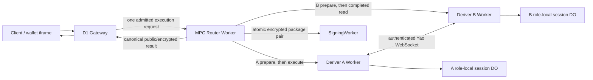

# Refactor 93: MPC Router-Owned Ed25519 Yao Ceremony Coordination

Date created: July 24, 2026

Status: in progress

## Objective

Move Cloudflare Ed25519 Yao ceremony orchestration out of the D1 Gateway and
into the Rust MPC Router. Replace the serial Gateway-driven
`Deriver B Stage -> Deriver A Start -> Deriver B Result -> SigningWorker`
sequence with one authenticated Gateway-to-Router execution request and one
connected Router-owned execution path.

The refactor must reduce production passkey registration latency while
preserving:

- independent Deriver A and Deriver B secret custody;
- role-local one-use state and replay protection;
- exact A/B input-pair binding;
- forward-only output commitment;
- atomic SigningWorker package delivery;
- exact encrypted-output redelivery without cryptographic reevaluation.

The target product latency after the platform passkey prompt completes is
2–3 seconds for a typical production registration.

## Decision Summary

1. The MPC Router Worker is the execution coordinator.
2. Role-local one-use Durable Objects are the sole coordination authority.
   Deriver A's `Prepared -> Running` transition is the execution lock. No
   ceremony-wide Router ledger exists.
3. Deriver A and Deriver B retain separate role-local Durable Objects and
   separate secret bindings.
4. The Router dispatches A and B preparation concurrently, awaits both signed
   readiness receipts, then dispatches execution and owns the connected
   request chain through terminal output.
5. A and B bind every prepared, running, completed, and terminal role state and
   peer handshake to the same input-pair digest.
6. B refuses execution without an exactly matching prepared record. This is a
   fail-closed coordinator-defect guard. It is never a retry path.
7. Registration, recovery, and export have operation-specific request and
   result payloads and share one lifecycle state machine.
8. The Gateway performs one MPC Router request and owns byte-exact replay for
   internal transport retries. A client-initiated attempt allocates a new
   ceremony identity.
9. The Gateway does not call Deriver A, Deriver B, or SigningWorker directly.
10. The current direct Stage, Start, Result, and SigningWorker orchestration
    paths are retained only for the request-boundary drain, then deleted.
11. No feature flag, legacy orchestration mode, or compatibility branch
    remains after deployment.

## Review Resolutions

The implementation follows these reviewed conclusions.

### Receipt-Sequenced Preparation

Concurrent A/B preparation followed by two signed readiness receipts is the
selected coordination model. It has a deterministic execution boundary and no
race-and-backoff loop.

The performance benefit from warming is a hypothesis. Cloudflare may schedule
preparation and execution on different isolates. Phase 0 and deployed
acceptance must measure:

- concurrent A/B preparation p50/p95;
- time from both readiness receipts to A execution start;
- whether A preparation and execution use warm or cold isolates when that
  telemetry is available;
- the incremental cost of the additional A service request;
- root metadata validation time during preparation and revalidation during
  execution.

Correctness depends on durable prepared records and signed receipts. It never
depends on isolate reuse or an in-memory cache.

### No Ceremony-Wide Ledger In V1

Role-local A/B Durable Objects are sufficient for mutual exclusion, pair
conflict detection, expiry, terminal redelivery, and reconciliation. Adding a
third lifecycle ledger would duplicate authority and add storage transitions
to the latency-sensitive path.

A ceremony-wide ledger may be reconsidered only when production evidence shows
material duplicate-request contention or operational reconciliation cost. A
future proposal must define its independent invariant, latency budget, and
deletion impact. It cannot be added as a convenience cache.

### Disconnect Policy

Refactor 93 retains the Yao implementation plan's current rule: uncertainty
after activation burns the execution. Durable `Completed` output remains
eligible for exact redelivery.

Allowing `waitUntil` run-to-completion after caller disconnect is a separate
protocol and security-policy change. It requires an update to the
authoritative Yao plan, failure analysis, duration-limit evidence, and fault
tests before Refactor 93 may adopt it.

### Cutover Recovery

Deployment recovery uses the previous Cloudflare Worker version. Refactor 93
does not add a runtime backend-selection switch. Temporary request-boundary
compatibility exists only during the ordered deployment and drain window, then
the direct orchestration path is deleted.

## Authoritative Dependencies

This plan changes Cloudflare orchestration. It does not redefine the Yao
construction.

- [Streaming Yao implementation plan](./router-ab/ed25519-yao/implementation-plan.md)
  remains authoritative for cryptography, role views, one-use execution,
  output commitment, retry safety, and corruption claims.
- [Streaming Yao deployment plan](./router-ab/ed25519-yao/deployment.md)
  remains authoritative for Cloudflare topology, transport benchmarks,
  deployment evidence, and production profile claims.
- [Refactor 90](./refactor-90-modular-auth-capabilities-plan.md) remains
  authoritative for capability and authorization lifecycle.
- [Refactor 92](./refactor-92-session-expiry-handling.md) remains authoritative
  for Wallet Session expiry and step-up behavior.

If this plan conflicts with a cryptographic or role-isolation invariant in the
Yao implementation plan, the Yao plan wins and Refactor 93 must be revised.

## Baseline Before Refactor 93 Cutover

Before the Router cutover, `RouterAbEd25519YaoHttpRegistrationBackend.executeInner()` performed
four network operations in series:

1. post the B envelope to the Deriver B Stage route;
2. post the A envelope to the Deriver A Start route;
3. fetch the completed B result from the Deriver B Result route;
4. deliver the A/B SigningWorker package pair.

The export path has the same Stage, Start, and Result shape.

The pre-cutover production Gateway constructed this backend with direct Deriver A, Deriver
B, and SigningWorker origins. The Gateway already has an `MPC_ROUTER` Service
Binding, yet Yao activation bypasses it.

Historical production tracing during the regression investigation observed approximately:

| Span                                                         | Observed wall time |
| ------------------------------------------------------------ | -----------------: |
| Deriver B Stage                                              |             884 ms |
| Deriver A Start, including the A/B ceremony                  |              1.8 s |
| Deriver B Result                                             |              65 ms |
| Successful post-Touch-ID product flow before the first fixes |            10–12 s |
| Successful post-Touch-ID product flow after the first fixes  |          about 6 s |

The underlying storage writes were generally tens of milliseconds or less.
Serial Worker, Durable Object, and peer-boundary wakeups multiplied the
platform latency.

The current architecture also gives the product Gateway responsibility for
cryptographic service orchestration. That responsibility belongs to the MPC
Router.

## Scope

This refactor owns:

- the Router-facing Ed25519 Yao execution contract;
- paired A/B ciphertext digest binding;
- Router-owned A/B dispatch and result composition;
- signed readiness receipts and safe overlap of A and B preparation;
- role-local uncertainty handling required by that overlap;
- registration, recovery, and export execution coordination;
- atomic SigningWorker package-pair delivery from the Router;
- Gateway cutover to one `MPC_ROUTER` request;
- deletion of direct Gateway-to-Deriver and Gateway-to-SigningWorker Yao
  orchestration;
- lifecycle timing spans and production acceptance measurements;
- local Router A/B dev parity.

This refactor does not:

- change the selected Yao circuit, garbling, OT, framing, or output-sharing
  construction;
- merge A and B into one administrative or secret-custody domain;
- move either role root share into the Router;
- allow the Router to decrypt either role input or recipient output;
- remove role-local one-use Durable Objects;
- store the binary garbled stream in a Durable Object;
- hold a Durable Object active across the network stream;
- change normal Ed25519 signing after activation;
- change Wallet Session budget or expiry policy;
- use D1 as a ceremony coordinator;
- introduce preprocessing or reusable garbled material.

## Required Invariants

1. The Gateway sends one admitted Yao execution request to the MPC Router.
2. The Gateway cannot address Yao Deriver Stage, Start, Result, or
   SigningWorker package routes after cutover.
3. The Router receives both opaque role envelopes and never receives either
   role plaintext.
4. The canonical input-pair digest commits to:
   - the complete ceremony binding;
   - operation;
   - circuit and protocol identity;
   - A ciphertext digest;
   - B ciphertext digest;
   - recipient-set digest;
   - authorization/admission digest;
   - root-share epoch and signer-set identity.
5. Every A and B lifecycle record for a ceremony carries the exact input-pair
   digest.
6. A conflicting pair digest fails before either role enters `Running`.
7. The Router dispatches execution only after it holds exact signed readiness
   receipts from A and B.
8. B accepts an A WebSocket only when its prepared record matches the exact
   pair digest, session, circuit, operation, and peer identity.
9. A missing or mismatched B preparation fails closed and identifies a Router
   coordinator defect. The execution path contains no coordination retry loop.
10. A and B independently enforce one-use execution in their own Durable
    Object namespaces.
11. `Running` never returns to `Prepared`.
12. Ambiguity after either role enters `Running` burns that execution identity.
13. `Completed` permits exact encrypted-result redelivery only.
14. A retry never reruns cryptography for a completed or ambiguous execution.
15. Role-local Durable Objects remain the owners of exact encrypted package
    redelivery state required by the Yao plan.
16. Role lifecycle records store the pair digest and role-local digest. They
    do not duplicate the full pair-binding structure.
17. `blockConcurrencyWhile` cannot enclose a fetch, WebSocket, Yao execution,
    SigningWorker call, timer, or polling loop.
18. The connected Router Worker request owns network wall time.
19. A caller disconnect after either role enters `Running` burns the activated
    execution as required by the Yao implementation plan. If both roles had
    already durably reached `Completed`, an exact retry may redeliver that
    completed output.
20. SigningWorker receives the A/B package pair through one atomic delivery
    command.
21. Recovery output remains staged until client verification and explicit
    promotion.
22. Export output remains client-recipient-only.
23. Diagnostics and timing fields never influence lifecycle control flow.
24. Logs contain no ciphertext bodies, tokens, secrets, private outputs, or
    recipient packages.
25. Gateway internal retry reuses the byte-exact admitted request body. HPKE
    reencryption is a new ceremony with a new identity.
26. Each readiness receipt binds the exact role-local root metadata digest.
    Execution rejects root metadata drift between preparation and execution,
    and receipt signature verification rejects a configured peer-key identity
    mismatch. Secret-binding-name rotation is not represented in this digest
    and remains a deployment-contract gate.

## Target Architecture



The Router Worker coordinates execution. The independent role-local Durable
Objects serialize one-use state and support exact status recovery.

## Component Responsibilities

### D1 Gateway

The Gateway continues to own:

- product authentication;
- registration intent and tenant policy;
- D1 wallet and account records;
- product admission facts passed to the channel-authenticated Router request;
- persistence of the final verified product result.

The Gateway sends one typed request through its existing `MPC_ROUTER` Service
Binding. It receives one typed result and performs no role scheduling.

### MPC Router Worker

The Router owns:

- boundary parsing, internal service authentication, and authority
  lifetime/digest validation;
- canonical ceremony and input-pair digest construction;
- concurrent exact A/B preparation;
- signed readiness-receipt verification;
- receipt-sequenced A/B execution dispatch;
- transcript and role-result matching;
- atomic SigningWorker package delivery;
- sanitized timing and failure spans;
- canonical response composition.

The Router keeps the original request chain connected until terminal output.
It does not persist secrets.

### Deriver A And Deriver B

Each Deriver:

- opens only its role-scoped HPKE envelope;
- validates the canonical pair binding;
- loads only its role-local root state;
- owns its role-local one-use state;
- returns a signed exact readiness receipt from preparation;
- participates in the authenticated A/B protocol;
- persists exact encrypted output before release;
- returns its signed public receipt and opaque recipient packages.

The selected transport and separate deployment identities remain unchanged.

### SigningWorker

The SigningWorker continues to:

- receive both role packages atomically;
- validate the pair and transcript;
- activate registration output or stage recovery output;
- return the canonical activation or staging receipt;
- support exact idempotent redelivery.

## Domain Model

### Ceremony Identity

Use one validated identity type. Raw route strings and partial binding objects
cannot enter core orchestration.

```rust
pub struct Ed25519YaoCeremonyIdentityV1 {
    pub lifecycle: RouterAbLifecycleIdentityV1,
    pub operation: Ed25519YaoOperationV1,
    pub session: Ed25519YaoSessionIdV1,
    pub circuit: Ed25519YaoCircuitIdV1,
    pub protocol: Ed25519YaoProtocolIdV1,
    pub signer_set: SignerSetIdV1,
    pub root_share_epoch: RootShareEpochV1,
}
```

Final field types must reuse the existing canonical Rust domain types.

### Input Pair Binding

```rust
pub struct Ed25519YaoInputPairBindingV1 {
    pub ceremony: Ed25519YaoCeremonyIdentityV1,
    pub deriver_a_input_digest: PublicDigest32,
    pub deriver_b_input_digest: PublicDigest32,
    pub recipient_set_digest: PublicDigest32,
    pub authorization_digest: PublicDigest32,
    pub pair_digest: PublicDigest32,
}
```

`pair_digest` is derived by the canonical Rust production encoder and is
recomputed and validated at the Router boundary. The Gateway sends the
validated ceremony binding and opaque role envelopes without any digest
preimages or derived pair fields. The Router derives the role-input,
recipient-set, authorization, and pair digests before constructing its
internal execute request. Rust-generated pair-digest fixtures remain the
cross-language wire invariant; Gateway contract tests assert that the raw
request contains no Router-owned digest fields. The generated TypeScript base
contracts are emitted by `pnpm generate:router-ab-ed25519-yao-types`.

### Readiness Receipt

```rust
pub struct Ed25519YaoRoleReadinessReceiptV1 {
    pub role: Ed25519YaoDeriverRoleV1,
    pub session: Ed25519YaoSessionIdV1,
    pub pair_digest: PublicDigest32,
    pub local_input_digest: PublicDigest32,
    pub root_metadata_digest: PublicDigest32,
    pub prepared_at_ms: u64,
    pub expires_at_ms: u64,
    pub signature: Ed25519YaoRoleSignatureV1,
}
```

Each role signs the canonical receipt only after its exact `Prepared` record
is durable. The Router requires one unexpired receipt from each role with the
same session and pair digest. The final names must reuse existing role,
signature, and session types.

Deriver B also returns a signed `Ed25519YaoRoleStartAcceptanceV1` only after
its exact pair record durably transitions from `Prepared` to `Running`. The
acceptance binds B's role, session, pair digest, execution identity, root
metadata digest, and bounded lifetime. Deriver A verifies that acceptance and
atomically transitions its own record to `Running`; neither role starts Yao
before this two-phase start completes.

### Role-Local State

The A and B session records gain an exact prepared state. The full pair
binding is validated at request and peer boundaries. Lifecycle records store
its canonical digest:

```rust
pub enum Ed25519YaoRoleSessionStateV1 {
    Prepared {
        pair_digest: PublicDigest32,
        local_input_digest: PublicDigest32,
        root_metadata_digest: PublicDigest32,
        expires_at_ms: u64,
    },
    Running {
        pair_digest: PublicDigest32,
        local_input_digest: PublicDigest32,
        root_metadata_digest: PublicDigest32,
        execution_id: Ed25519YaoExecutionIdV1,
        expires_at_ms: u64,
    },
    Completed {
        pair_digest: PublicDigest32,
        execution_id: Ed25519YaoExecutionIdV1,
        execution: Ed25519YaoRoleExecutionV1,
    },
    Burned {
        pair_digest: PublicDigest32,
        execution_id: Ed25519YaoExecutionIdV1,
    },
    Expired {
        pair_digest: PublicDigest32,
        local_input_digest: PublicDigest32,
    },
}
```

`Ed25519YaoRoleExecutionV1` is the operation-discriminated terminal payload.
Registration, recovery, and export share the lifecycle states. Their terminal
payload branches preserve activation, staged recovery, and export recipient
constraints without multiplying lifecycle enums. The Cloudflare adapter maps
role failures to `Burned` and expiry to `Expired`.

## Router Request Contract

Add one authenticated private Router endpoint:

```text
POST /router-ab/router/ed25519-yao/execute
```

The route accepts a discriminated request:

```rust
pub enum RouterEd25519YaoExecuteRequestV1 {
    Registration {
        authority: RouterAdmittedExecutionAuthorityV1,
        binding: Ed25519YaoRegistrationBindingV1,
        deriver_a_input: Ed25519YaoEncryptedInputV1,
        deriver_b_input: Ed25519YaoEncryptedInputV1,
    },
    Recovery {
        authority: RouterAdmittedExecutionAuthorityV1,
        binding: Ed25519YaoRecoveryBindingV1,
        deriver_a_input: Ed25519YaoEncryptedInputV1,
        deriver_b_input: Ed25519YaoEncryptedInputV1,
    },
    Export {
        authority: RouterAdmittedExecutionAuthorityV1,
        binding: Ed25519YaoExportBindingV1,
        deriver_a_input: Ed25519YaoEncryptedInputV1,
        deriver_b_input: Ed25519YaoEncryptedInputV1,
    },
}
```

The exact existing binding types should be reused where they already express
the required invariants. The route parser validates unknown JSON once and
hands a precise branch to core orchestration.

The response is an operation-specific `Result`-style union. Recoverable
service failures, terminal burned executions, authorization rejection, and
successful operation results remain distinct at the core contract boundary.
Pair-bound role routes carry sanitized failure classes across the HTTP boundary;
legacy role routes retain protocol-error responses until the drain cleanup.

### Private Role Commands

Replace the current unpaired role routes with Router-owned, pair-bound private
commands:

```text
POST /router-ab/deriver-a/ed25519-yao/prepare-pair
POST /router-ab/deriver-a/ed25519-yao/execute-pair
POST /router-ab/deriver-b/ed25519-yao/prepare-pair
POST /router-ab/deriver-b/ed25519-yao/read-completed-pair
```

Each `prepare-pair` validates the role-local envelope and pair binding, warms
the role-local Worker and Durable Object boundaries, validates root metadata,
persists its public metadata digest in `Prepared`, and returns a signed exact
readiness receipt. A's prepared record stores no role plaintext or root
material. `execute-pair` reopens A's HPKE envelope, verifies both readiness
receipts, revalidates the exact root metadata digest, performs the pair-bound
claim and peer-receipt handshake, and runs the existing A/B protocol. After A completes,
`read-completed-pair` performs one exact read of B's already-completed
encrypted result.

Preparation is idempotent for an exact pair and rejects a conflicting pair for
a live session. Cloudflare may schedule preparation and execution on different
isolates. Warming is an optimization claim that must be measured; correctness
depends only on the durable readiness receipts.

The final private route names may follow an established path naming pattern.
Their ownership and semantics are fixed:

- only the MPC Router can call them;
- every command requires the exact pair binding;
- execution requires both exact signed readiness receipts;
- the final B read performs no polling and no execution;
- the old Gateway-addressable Stage, Start, and Result contracts are removed
  after the request-boundary drain.

The target critical path is:

```text
max(A prepare, B prepare)
  + pair-bound receipt handshake + Yao
  + one exact B completed-result read
  + atomic SigningWorker delivery
```

The current critical path adds B Stage, A Start, and B Result sequentially.

## Execution Protocol

### Validate And Reconcile

1. Parse and authenticate the Gateway request.
2. Validate both encrypted envelope metadata against the admitted binding.
3. Compute A digest, B digest, and the canonical input-pair digest.
4. Reuse the byte-exact request for a Gateway-owned internal retry.
5. Read exact role-local status when a prior Router outcome is uncertain.
6. Return the existing terminal receipt for an exact completed retry.
7. Reject a conflicting pair during role preparation.
8. Never blindly rerun the ceremony.

### Paired Preparation And Execution

1. The Router dispatches A and B `prepare-pair` concurrently.
2. A and B validate their own envelopes, pair binding, root metadata, and
   role-local state.
3. Each role persists `Prepared` with the public root metadata digest and
   returns a signed readiness receipt.
4. The Router awaits and verifies both exact receipts.
5. The Router dispatches A `execute-pair` with both receipts.
6. A connects to B exactly once with the exact pair digest.
7. B refuses a missing or mismatched prepared record.
8. B verifies A's signed readiness receipt and atomically transitions its exact
   record from `Prepared` to `Running` before returning the WebSocket upgrade.
9. B returns a signed start acceptance over the upgraded peer channel. A
   verifies the acceptance and atomically transitions its exact record from
   `Prepared` to `Running` before sending Yao messages.
10. Any uncertainty after either transition burns the execution identity.
11. A and B execute the existing Yao protocol unchanged.

The execution path contains no coordination retry loop. Authentication errors,
conflicts, missing preparation, expiry, malformed state, circuit mismatch, and
terminal role state fail immediately.

### Result And Delivery

1. A and B persist their exact encrypted role outputs before releasing them.
2. The Router obtains both validated role results.
3. The Router validates pair digest, ceremony identity, role, transcript,
   circuit, operation, recipient bindings, and public receipt equality.
4. Registration and recovery send one atomic package pair to SigningWorker.
5. Registration returns the active receipt.
6. Recovery returns the staged receipt. Promotion remains a
   separate client-verified operation.
7. Export returns only the exact client-recipient packages.

## Retry, Disconnect, And Reconciliation

Retry behavior is forward-only:

| Observed state                                  | Exact retry behavior                                                              |
| ----------------------------------------------- | --------------------------------------------------------------------------------- |
| Neither role prepared                           | Prepare both roles and execute                                                    |
| One or both roles `Prepared`, neither `Running` | Reissue exact preparation, verify both receipts, then execute                     |
| Any role `Running` after caller uncertainty     | Reconcile; burn on unresolved ambiguity                                           |
| Both roles `Completed` with the exact pair      | Redeliver exact encrypted outputs                                                 |
| SigningWorker delivery uncertain                | Retry the exact atomic package-pair command                                       |
| SigningWorker has the exact terminal receipt    | Return the canonical terminal receipt                                             |
| Conflicting pair digest                         | Reject                                                                            |
| Terminal role failure                           | Return the canonical sanitized failure                                            |
| Expired nonterminal state                       | Return typed `ceremony_expired`; Gateway/client allocates a new ceremony identity |

A generic network retry cannot allocate a new transcript under the same
execution identity. The Gateway retains and replays the byte-exact admitted
request body for internal retries. HPKE reencryption produces new ciphertext
digests and therefore requires a new ceremony identity.

## Implementation Phases

### Implementation Checklist Audit (July 25, 2026)

The checked implementation items below were re-audited against reachable
production adapters, executable local paths, and focused behavioral tests.
These checks mean code-complete for the stated item. They do not imply staging
or production acceptance.

- [x] Review the completed Phase 0 contract and trace-correlation work. The
      boundary accepts or creates one opaque 128-bit identifier, rejects
      malformed caller values before work, and propagates the same value
      through Gateway, Router, and role calls.
- [x] Review Phases 1–3 against the canonical Rust constructors, generated
      TypeScript boundary, pair-lifecycle implementation, and production Router
      coordinator. Pair preparation is concurrent, both signed receipts are
      required, A execution is single-dispatch, B completion is request-bound,
      and SigningWorker delivery is operation-typed and idempotent.
- [x] Review Phase 4 as an orchestration cutover. Registration, recovery, and
      export use the MPC Router backend and the Gateway backend type has no
      direct Yao role-route origin. The separate tenant-runtime persistence
      cutover remains Phase 5 work.
- [x] Review the checked Phase 5 substeps. Registration admission/execution,
      recovery claims and activation replacement, export phase claims and exact
      result redelivery, cross-key role claims, and split role execution all
      have focused behavioral coverage.
- [ ] Complete the unchecked Phase 5 composition, tenant-runtime removal,
      drain, and deletion work.
- [ ] Complete Phase 0 production evidence and Phase 6 staging/production
      acceptance.

Audit validation: all `router-ab-core`, `router-ab-cloudflare`, and
`router-ab-dev` tests pass; 72 focused Gateway contract, persistence, recovery,
export, trace, and selector tests pass; and the integration checkpoint passes
`pnpm check`. The native Router executable installs its coordinator and serves
the authenticated execute and recovery-promotion boundaries. Direct calls to
the lower-level Router boundary helper without a dispatcher intentionally
return `501`.

### Phase 0: Freeze Baseline And Contracts

Production evidence is deferred until the implementation and coherent staging
cutover are complete. The unchecked evidence items in this phase remain
production-acceptance gates; they do not block the remaining implementation
phases.

- [ ] Capture at least 20 production registration traces with per-span
      durations for Gateway, Router, B preparation, A preparation, A/B
      protocol, B result, SigningWorker delivery, D1 commit, and frontend
      finalization.
- [ ] Record cold-after-deploy and warm cohorts separately.
- [ ] Measure the added A preparation request and cross-request isolate reuse
      rather than assuming a warm execution.
- [x] Add a trace correlation ID that contains no user identity or secret.
- [x] Freeze the current successful registration, recovery, and export
      response contracts.
- [x] Add intended-behaviour assertions for exact retry and terminal failure.
- [x] Superseded: review the measured critical path before Phase 1. Phases 1–4
      landed before a complete production baseline could be captured.
- [ ] Review the measured critical path before production acceptance. If the
      dominant remaining latency lies outside Yao orchestration, rescope the
      remaining work around the measured owner.
- [ ] Derive a Router-owned `gateway.yao_execute` p50/p95 budget from the
      baseline. Keep the Touch-ID-to-wallet-ready target as a separate
      product-level budget.
- [x] Gate the evidence analyzer on platform execution telemetry, including
      CPU, wall time, memory, Durable Object calls, Worker invocations,
      D1 exclusion, exact replay, and conflict counts.

Phase 0 evidence remains open. The available deployment logs do not contain
20 complete correlated production traces, and the current Wrangler access does
not expose the Workers Observability telemetry needed to reconstruct them.
Cold/warm cohorts, Durable Object instantiation/reuse, and the frozen p50/p95
budget must be captured after a coherent Router, role-worker, and Gateway
rollout. The strict capture format, analyzer, and current telemetry blockers
are documented in
[`refactor-93-production-evidence.md`](./refactor-93-production-evidence.md).
The lower-level Router contract tests cover exact replay and terminal failure;
the HTTP backend contract tests assert that a response lost after Router
execution is retried with the exact admitted body, trace ID, and replay marker,
and that a burned execution is surfaced as a terminal failure without retry.
The strict intended-behaviour suite now covers both product outcomes through a
request-scoped local-Gateway fault seam. Each armed request carries a validated
opaque UUID that correlates its sanitized proof response; its Router fetch
controller is constructed only for that request, so overlapping registrations
cannot consume one another's fault state. The uncertain-transport case lets the
real strict Router complete, drops that first response, and proves that the
Gateway retry uses the byte-exact body, original trace ID, and replay marker
before registration completes and signs. Its terminal case returns the typed
Router burned result at the same service-binding boundary and proves that the
Gateway performs no second Router dispatch. The harness refuses to arm against
any origin other than the managed local Router. Both local control headers are
removed before product routing and are absent from staging and production
Workers.

The successful response shapes are frozen at the existing strict TypeScript
parsers and product service boundaries. Registration and recovery are covered
by `routerAbEd25519YaoContracts.unit.test.ts`; export is covered by
`routerAbEd25519YaoExport.server.unit.test.ts`. The Router transport changes
preserve those public operation-specific result bodies.

### V1 Admission Authority Semantics

`RouterAdmittedExecutionAuthorityV1` is a short-lived, channel-authenticated
request field in the current v1 boundary. The Router requires the internal
service-authentication header, derives the activation authorization digest from
the canonical Rust serialization of the raw Gateway request, validates the
authority time window, and rejects an authority digest that does not equal the
pair binding's authorization digest. Export continues to carry the
authorization digest from its explicit client authorization artifact.

The v1 field is not a standalone cryptographic signature over the D1 admission
decision. Extending the route to an independently callable trust boundary
requires a signed admission artifact, Router key-rotation policy, and a
cross-language verification contract. That work remains outside this cutover;
the plan does not claim cryptographic D1 admission attestation.

### Phase 1: Canonical Pair And Router Contracts

- [x] Add the canonical ceremony identity and input-pair binding to
      `router-ab-core`.
- [x] Add the operation-specific Router execute request and result unions.
- [x] Add canonical digest encoding and Rust vectors.
- [x] Generate or update TypeScript bindings through the router-ab-core
      generator (`pnpm generate:router-ab-ed25519-yao-types`). The generated
      base contracts cover ceremony identity, lifecycle, digest, and pair
      binding shapes; shared TypeScript keeps operation-specific generic
      narrowing around those generated declarations.
- [x] Add a cross-language pair-digest vector that is generated from the Rust
      encoder and keep the Gateway adapter on the raw request boundary; its
      contract test rejects locally derived pair/authority fields.
- [x] Add type fixtures rejecting missing identities, cross-operation fields,
      optional pair digests, and broad object-spread construction.
- [x] Add exhaustive switches for operation-specific request and terminal
      payload unions.

### Phase 2: Pair-Bound Role Lifecycle

- [x] Add `Prepared`, pair digest, and role-local input digest to A and B
      role-local state.
- [x] Add idempotent A and B `prepare-pair` commands and signed readiness
      receipts.
- [x] Bind the pair digest into the peer handshake and WebSocket request.
- [x] Make execute-before-prepare a typed fail-closed defect result.
- [x] Require both exact readiness receipts before A execution.
- [x] Bind and revalidate role-local root metadata digests across preparation
      and execution.
- [x] Transition both role records through the pair-bound readiness and signed
      two-phase start handshake. B's acceptance is verified before A enters
      `Running`.
- [x] Burn uncertainty after either role enters `Running`.
- [x] Preserve exact completed-output redelivery.
- [x] Update registration, recovery, and export role adapters.
- [x] Verify strict local Wrangler serving uses the production Router and role
      Worker shims, including all pair-bound role paths. The executable script
      test covers generated shim targets and the strict Deriver dispatch table.
- [x] Mirror the production lifecycle in `router-ab-dev` through the serving
      path with a pair-bound state model, role-specific receipt signing,
      readiness/peer claims, uncertainty burning, and exact completed-output
      lookup tests. Native Rust workers serve authenticated, persisted
      `prepare-pair`, `execute-pair`, `read-pair-status`,
      `read-completed-pair`, and `burn-pair` commands. A and B persist
      `Running` before the peer network hop, B signs start acceptance, both
      persist `Completed`, and completed reads validate the canonical pair
      binding before returning bytes. The native Router coordinator performs
      concurrent preparation, A execution, B completion acknowledgement, and
      registration/recovery SigningWorker delivery without opening role
      secrets. Its recovery-promotion route forwards the expanded local
      SigningWorker request and validates the returned `Active` receipt;
      Router-side replay/CAS persistence remains a separate follow-up gate.
      Strict Wrangler local mode remains the executable Cloudflare
      production-parity path.

### Phase 3: MPC Router Execution Coordinator

- [x] Add the private Router execute route and boundary parser.
- [x] Reuse internal service authentication and verify the admitted execution
      authority.
- [x] Compute and validate the canonical pair digest in Rust.
- [x] Start A and B preparation concurrently.
- [x] Await and validate both signed readiness receipts.
- [x] Dispatch A execution exactly once after both receipts.
- [x] Await and validate both role results, with the Router's single exact
      completed-result read returning an explicit B completion acknowledgment.
- [x] Deliver the exact package pair to SigningWorker atomically.
- [x] Implement exact retry reconciliation without cryptographic
      reevaluation.
- [x] Accept byte-exact internal replay and reject conflicting ciphertext
      digests under the same ceremony identity.
- [x] Add structured span timings for preparation, receipt validation, A
      execution, B completed-result read, SigningWorker delivery, and the
      connected Router execution.

### Phase 4: Gateway Cutover

- [x] Replace `RouterAbEd25519YaoHttpRegistrationBackend` with an MPC
      Router-backed implementation.
- [x] Configure it with the existing `MPC_ROUTER` Service Binding and canonical
      internal Router origin.
- [x] Remove Deriver A, Deriver B, and SigningWorker URLs from the Yao backend
      configuration.
- [x] Make registration, recovery, and export each submit one logical admitted
      Router command. The normal path performs one fetch; an uncertain
      transport may perform one byte-exact replay of that command.
- [x] Keep product admission and D1 commit outside the MPC Router.
- [x] Make direct Yao role and SigningWorker addressing unrepresentable in the
      backend configuration type.
- [x] Retain the byte-exact admitted request body for an internal uncertain
      Router retry. Transport failures retry once with the same serialized
      body and trace ID plus the Router replay marker; HTTP responses are not
      retried.

The Cloudflare Gateway cutover code is implemented behind the explicit drain
selector described below. The strict local Wrangler runtime
(`crates/router-ab-dev/scripts/dev-local-workers.mjs`) includes the Router
coordinator on port 9100. The `router_ab_local_up` Rust harness starts an
explicit Router process with its own persistence scopes and serves the native
pair and recovery boundaries; the two harnesses still require separate
cryptographic and deployment evidence.

### Phase 5: Hard Cutover And Deletion

The Phase 5 deletion audit is recorded in
[`refactor-93-phase5-deletion-audit.md`](./refactor-93-phase5-deletion-audit.md).
It confirms that the Gateway serial Yao owner is deleted, while Deriver A/B
service bindings, legacy role routes/parsers, and compatibility tests remain
drain targets. `SIGNING_WORKER` is still owned by the Router A/B ECDSA
threshold transport and is not an obsolete Yao direct-origin binding. No
destructive deletion is authorized until the audit's deployment and drain
receipts are recorded.

- [x] Delete the Gateway Stage, Start, Result, and package-delivery
      orchestration.
- [ ] Delete obsolete Yao direct-origin environment keys where no other
      protocol owns them.
- [ ] Replace the tenant-scoped Gateway runtime Durable Object with a
      request-safe per-ceremony persistence/CAS boundary, then remove its
      binding and SQLite migration so no tenant-wide object coordinates Yao.
  - [x] Route registration admission and execution through typed request-scoped
        CAS behind the disabled two-boundary drain selector.
  - [ ] Move registration start, bind, finalize, and shared wallet/session
        effects behind an idempotent side-effect boundary, then enable the
        registration selector.
  - [x] Add typed request-scoped recovery admission and execution
        prepare/claim/commit boundaries with a shared backend-session uniqueness
        index, durable uncertainty, and no backend retry.
  - [ ] Wire recovery admission, execution, and activation to the partitioned
        store as one coherent cutover after activation has an idempotent
        side-effect boundary.
    - [x] Persist the activation claim before Router promotion and replace the
          active wallet capability together with an exact operation receipt in
          one D1 transaction. Exact retries reconcile response loss from that
          receipt without repeating the wallet write.
    - [ ] Compose admission, execution, and activation behind the same drain
          selector and enable them only after local cutover validation.
  - [ ] Move export admission, execution, redelivery, and authorization state
        to the partitioned store with typed conflict and uncertainty handling.
    - [x] Persist phase-specific authorization, admission, and execution claims
          before their effects; retain uncertain claims without repeating
          WebAuthn verification or Router calls; persist and redeliver the exact
          completed export result after a codec reload.
    - [ ] Compose both export routes against the partitioned store behind the
          drain selector. A WebAuthn-success/receipt-CAS conflict remains
          fail-closed and requires a fresh export ceremony.
  - [ ] Move remaining replay, authorization, and session state out of the
        tenant runtime, then delete its binding, readiness path, serializer, and
        SQLite migration after the drain.
- [ ] Delete obsolete Deriver Stage and Result route contracts after the
      maximum in-flight ceremony lifetime has elapsed.
- [ ] Before deleting legacy role routes, complete the cross-key exclusion
      drain:
  - [x] Make legacy admission and pair preparation claim both role-record keys
        through the same Durable Object storage transaction.
  - [ ] Deploy that version, then observe the maximum in-flight lifetime with
        no object containing both records.
- [ ] Delete lower-authority tests, fixtures, mocks, and source guards that
      encode the serial flow.
- [ ] Delete compatibility request parsers after the boundary drain.
- [x] Split A's claim, network execution, and completion into separate Worker
      and role-DO commands so no role Durable Object remains active across the
      Yao WebSocket stream.
- [x] Keep role-local Durable Object classes and their current secret
      boundaries.
- [ ] After the boundary drain, verify the repository and deployment contain
      one reachable production Yao orchestration owner.

The Gateway backend no longer contains the serial Stage/Start/Result or direct
Yao package-delivery flow. The remaining Deriver Stage/Result handlers and
direct-origin bindings are retained until the deployed cutover has survived the
maximum in-flight ceremony lifetime; they are role-boundary drain targets, not
second Gateway orchestration owners. The tenant-scoped `ROUTER_API_RUNTIME`
state holder is a separate persistence boundary: it must be replaced with
request-safe lifecycle storage before acceptance criterion 3 can be closed.

### Phase 6: Deployment And Production Acceptance

Cold/warm production evidence and destructive legacy cleanup are deferred until
the implementation branch is complete and the coherent staging cutover passes.
These items remain unchecked so implementation completion cannot be mistaken
for production acceptance.

The code branch already contains the Gateway cutover, so the historical
"validate Router while Gateway still uses the old request boundary" step cannot
be replayed here. Contract tests and optimized four-Worker dry-runs are green;
the first external validation must be a coherent staging rollout before any
route-deletion cleanup.

- [ ] Deploy the new Router private route as part of one coherent staging
      release. The historical route deployment was overwritten by the
      2026-07-25 staging stack run, whose selected source did not contain the
      Refactor 93 coordinator. Dispatch `deploy-staging-backend.yml` from
      `dev` after this branch lands.
- [x] Superseded: validate the Router while the Gateway still uses the old
      request boundary. The branch already contains the Gateway cutover, so this
      ordering cannot be replayed. The coherent staging rollout below replaces
      it as the first external validation.
- [ ] Deploy the Gateway cutover with
      `ROUTER_AB_YAO_GATEWAY_ADMISSION_CUTOFF_MS` set at admission quiescence
      and `ROUTER_AB_YAO_GATEWAY_DRAIN_UNTIL_MS` set to that cutoff plus the
      measured maximum in-flight lifetime.
- [ ] Exercise staging registration, recovery, export, exact replay, conflict,
      disconnect, terminal redelivery, and rollback on the coherent versions.
- [ ] Deploy the accepted coherent backend to production without deleting
      legacy role routes.
- [ ] Run cold-after-deploy and warm production cohorts.
- [ ] Compare latency, errors, Durable Object calls, Worker invocations, CPU,
      wall time, exact replay, and conflicts against the historical
      partial observations and the first fully instrumented candidate cohort.
- [ ] Confirm receipt sequencing improves or preserves p95 after including the
      additional A preparation request.
- [ ] Record the final evidence in the Yao deployment plan.
- [ ] Observe the full production drain interval after the last legacy
      admission before enabling route deletion.
- [ ] Deploy and validate route-deletion cleanup in staging, then deploy the
      same cleanup to production.
- [x] Replace the failed stack workflow's hard-coded Gateway secret plumbing
      with target-capability-derived backend deployment. Staging billing is
      disabled and excludes `STRIPE_API_SK`; production billing is enabled and
      requires it. The historical failure and current invariant are recorded
      in [`refactor-93-production-evidence.md`](./refactor-93-production-evidence.md);
      a new coherent staging run remains open.

## Mid-Implementation Review Dispositions (2026-07-24)

The Fable review identified several claims that needed either implementation or
an explicit scope decision:

- The Router now samples the clock after concurrent preparation, so receipt
  validation cannot reject a receipt merely because preparation completed after
  request parsing.
- A completion re-reads its role state before writing `Completed`; stale
  completions, burns, and conflicting executions fail closed. Both role
  preparation paths re-read after root metadata loading, and normal legacy and
  pair-bound requests reject the other lifecycle's existing record. The
  cross-key exclusion remains a drain gate until the final boundary cleanup.
  The two record keys cannot coordinate requests served by different Worker
  versions: an in-flight legacy binary can still perform its plain
  `SESSION_RECORD_STORAGE_KEY` write after a newer pair binary has checked that
  key. Before deleting the legacy routes, deploy a version whose first legacy
  admission writes and pair preparation write are both transactions that
  re-read `SESSION_RECORD_STORAGE_KEY` and `PAIR_SESSION_RECORD_STORAGE_KEY`
  together (or use an equivalent persistent lifecycle-claim marker), then wait
  the maximum in-flight lifetime. Any Durable Object that contains both keys
  must fail closed and be investigated; it is not safe to infer ownership from
  either key alone.
- The unused contract-only coordinator was removed. `router_coordinator.rs` is
  the sole production Router orchestration owner.
- The current v1 handshake uses signed readiness plus a signed, pair-bound
  two-phase start acceptance over internally authenticated peer transport.
  Signed terminal-result artifacts and acceptance redelivery remain separate
  follow-up protocol work.
- The authority field is channel-authenticated and digest/time bound in v1,
  rather than a signed D1 admission attestation. A signed admission artifact
  remains a future trust-boundary requirement.
- The Gateway forwards only the raw ceremony binding and opaque role envelopes.
  Rust owns authorization, recipient-set, role-input, and pair digest
  derivation; cross-language vectors pin the resulting binding, while the
  Gateway contract test asserts that no digest preimage or derived pair field
  is constructed locally.
- SigningWorker activation receipts are now checked against the admitted
  operation (`Active` for registration and `Staged` for recovery). Pair-bound
  role routes emit a sanitized typed failure envelope, and the Router decodes
  it into the canonical recoverable, rejected, or burned result union. Legacy
  role routes and SigningWorker transport retain their existing protocol-error
  boundary until the drain cleanup.
- Pair lifecycle failure classification is now protocol-code driven for missing
  preparation, expired preparation, and pair conflicts. Human-readable error
  text remains diagnostic and cannot select a retry or rejection branch.
- The Router's one-shot B result read now consumes a typed completion
  acknowledgment envelope. The envelope revalidates the session, pair digest,
  role, and execution before transcript validation; a pending B state remains a
  typed failure rather than a coordination retry loop.
- Deriver B revalidates live root metadata when its role execution begins,
  after the signed `BeginPair` transition. A root change in that interval
  burns the pair rather than reopening preparation or retrying under the same
  identity; the post-`Running` check is intentional one-use fail-closed
  behavior.
- The Gateway preserves `ceremony_expired` as a terminal 409 failure instead of
  treating it as an exact retry. Callers must allocate a new ceremony identity
  after the nonterminal lifetime has elapsed.
- Caller-disconnect handling follows the forward burn policy when the Router
  observes an uncertain role result. Cloudflare request cancellation does not
  guarantee a post-disconnect callback, so proving burn for a dropped caller
  remains a fault-test and platform-evidence gate.

Several acceptance gates remain intentionally open. Production cold/warm traces
and the frozen latency budget are unavailable under the current Wrangler
Observability scope. The `router-ab-dev` pair lifecycle has route and ownership
parity checks, and the Rust harness serves the native Router coordinator through
authenticated role-worker HTTP boundaries, including recovery promotion.
Router-side replay/CAS persistence, tenant-runtime removal, coherent route
composition, drain verification, and staging validation remain open; those
residuals are recorded below rather than presented as complete production
acceptance.

The current staging Gateway still has one tenant-scoped runtime Durable Object
(`ROUTER_API_RUNTIME`). It serializes only runtime initialization with
`blockConcurrencyWhile`, then permits request overlap, so it does not wrap the
Yao network stream. It does, however, hold the mutable product admission,
recovery, export, and authorization maps and writes the complete snapshot back
after each request. Removing this object or routing Yao requests around it
without a replacement persistence/CAS boundary would lose replay state and
allow concurrent snapshots to overwrite one another. The request-scoped D1
partitioned adapter implements registration admission and execution. The
staging Worker contains a two-boundary drain selector that keeps both
operations on `ROUTER_API_RUNTIME` before
`ROUTER_AB_YAO_GATEWAY_ADMISSION_CUTOFF_MS`, rejects new admissions between
that cutoff and `ROUTER_AB_YAO_GATEWAY_DRAIN_UNTIL_MS`, keeps old executions on
the tenant runtime during that interval, and switches both operations to D1 at
the final boundary:
authorization and a typed admission or execution claim are CASed before the
MPC Router backend call, terminal state is loaded from a fresh snapshot, and
uncertainty or CAS conflicts fail closed without retrying the backend. The
generated deployment config leaves both values empty until the wallet-finalize
state bridge is ready. Enabling the D1 route before that bridge would create an
independent state copy that finalization could not observe.

Wallet registration start/bind/finalize, recovery route selection, export,
remaining session side effects, and the non-Yao API still use
`ROUTER_API_RUNTIME`. Recovery
admission and execution now expose typed request-scoped preparation and
completion boundaries that persist `admitting` or `executing` before the
backend call and preserve those claims on transport uncertainty. The recovery
session index is part of the shared CAS record, so a backend session cannot be
accepted by two lifecycle partitions. This adapter is deliberately
foundation-only at the route-selection boundary. Recovery activation now
persists `activating` before Router promotion and commits the wallet capability
replacement with an exact D1 operation receipt. A lost D1 response or terminal
product-state CAS conflict is reconciled from that receipt without repeating
the wallet write. All three recovery routes stay on the tenant runtime until
they are composed behind one drain selector and validated together. Acceptance
criterion 3 therefore remains an explicit Gateway persistence refactor gate:
migrate those remaining routes to typed side-effect boundaries, gather drain
evidence, then delete the binding and its migration. This is separate from the
role-local Router coordination already implemented here.
The follow-up review also confirms that the object name is keyed by
`namespace:org:project:environment`, so all registrations for one tenant
environment share that instance. That creates a tenant-level throughput ceiling
and keeps admission/recovery/export persistence on the non-Yao Gateway path.
The existing Gateway timing spans will size that cost in the Phase 0 cohort;
the replacement is tracked in the
[Gateway Ceremony Persistence follow-up](./refactor-93-gateway-persistence-follow-up.md)
and gates this criterion rather than expanding the Router coordinator scope.
The shared Cloudflare adapter now provides a per-record Durable Object resolver,
opaque versioned JSON envelopes, and transaction-backed compare-and-swap writes.
The Gateway package also has a request-boundary ceremony-key parser, a lossless
codec for the registration, authorization, recovery, and export Map/Set graphs,
and a shared-plus-ceremony state store that reads both records from one D1
batch snapshot and commits them with one typed CAS batch. The registration
request-scoped adapter, drain selector, and contract tests are complete. The
generated deployment config accepts explicit
`ROUTER_AB_YAO_GATEWAY_ADMISSION_CUTOFF_MS` and
`ROUTER_AB_YAO_GATEWAY_DRAIN_UNTIL_MS` values; leave both empty during the
legacy window, then set the cutoff at quiescence and the final boundary after
the measured maximum in-flight lifetime before enabling the D1 route. The tenant runtime has not
been migrated for the remaining routes, its binding and migration have not
been deleted, and this checkbox remains open until recovery, export, replay,
authorization, and wallet-finalize paths have equivalent typed boundaries and
drain evidence.
The SDK also exposes a request-scoped load/execute/commit runner with typed
CAS conflicts and no retry loop. It remains the composition seam for routes
that have not been split. The current Gateway handler combines Yao transitions
with other D1 and wallet side effects, so a post-side-effect CAS conflict would
be uncertain. The dedicated request-scoped adapter is wired behind the
drain-gated staging selector; recovery, export, replay, authorization, and
wallet-finalize still require explicit side-effect boundaries and a shared-state
bridge before the selector may be enabled. During the intermediate drain,
admission returns a typed 503 with `Retry-After`, while execute remains on the
legacy runtime.

The first bounded Gateway migration is implemented and tested for registration
admission and execution, with new admission quiesced first and both operations
switched together only after the configured final drain boundary. A typed
admission or `executing` claim is CASed before the
backend call; terminal completion loads a fresh snapshot and CASes the
activated/failed state. Backend uncertainty leaves the claim durable for
reconciliation, and a terminal CAS conflict is returned with the claim without
retrying the backend.

Loaded partitioned records are detached from adapter-owned Map, Set, and byte
arrays before a request can mutate them. Terminal persistence therefore does
not depend on an adapter returning mutable object aliases; the regression test
exercises a non-cloning adapter and verifies that request-only mutations never
change the persisted snapshot.
Wallet-registration finalize still mixes Yao consumption with account creation,
signing-session provisioning, wallet D1 commits, capability installation,
replay persistence, and ceremony deletion. Those effects need their own typed
hooks before the remaining production routes can leave `ROUTER_API_RUNTIME`.

The request-boundary parser and partitioned state store are ready for
registration admission and execution. Routing a full four-map snapshot to one
Durable Object per lifecycle would isolate registrations, capabilities,
recovery state, and export state from one another. The staging Worker keeps
both registration operations on the tenant runtime during the configured drain,
then switches them together; the remaining routes stay there until each has an
equivalent typed composition and CAS boundary.

The native serving path is now wired through `router_ab_local_worker`.
The Router has its own process and five SQLite-backed Router persistence
boundaries, while each Deriver retains its own process and role-local Durable
Object stand-in. The authenticated Router coordinator owns only opaque
admission metadata; it prepares A and B concurrently, calls A's pair execute
route, reads B's exact completed acknowledgement, validates role/session/
transcript identity, burns uncertainty, and delivers activation packages to the
SigningWorker. A and B persist `Running` before network I/O and persist
`Completed` before their responses. The native dispatcher also serves recovery
promotion with the expanded local SigningWorker request shape and validates the
returned `Active` receipt. Router-side replay/CAS persistence remains a
separate follow-up; the native coordinator does not claim that gate. Strict
Wrangler local mode continues to execute the production Cloudflare handlers.
The pure local pair model now marks an expired prepared pair as terminal before
any role can enter `Running`; the serving path exercises the same identity
invariants through the native role workers. Its lifecycle metadata has a
validated snapshot/restore shape and the local SQLite adapter has
insert-if-absent and byte-exact compare-and-swap primitives. Local startup
initializes the five Router-owned SQLite scopes before the private role workers
start, and the Router process never opens role secret state. Role workers persist
opaque encrypted inputs and pair lifecycle records in their own SQLite scopes.

Role startup metadata is role-local. A's prepared/root-drift checks bind A's
metadata, B's signed start acceptance binds B's metadata, and A matches that
acceptance to B's signed readiness receipt. The Cloudflare and native paths use
the same rule; treating the two role metadata digests as one shared value would
reject the configured A/B roots.

The final review pass checked three small cleanup findings. Recovery promotion
already uses discriminated lifecycle state and typed `capability_conflict`
results; the only `already active` text in the current branch is a Deriver-A
HTTP 409 diagnostic and is not a promotion control-flow predicate. The
Cloudflare lint run reports the existing large-enum-variant warnings and no
`peer_verifying_keys` dead-code or unused-import batch. The five remaining
`source.contains` checks in `ed25519_yao_lifecycle_boundaries.rs` remain
intentional durable boundary guards until the role-route drain and deletion
phase; deleting them before that drain would remove the only checks for those
cross-worker ownership invariants.

The Gateway contract suite also pins every registration and exact replay
request to the configured MPC Router origin. A recovery continuity fixture
now distinguishes a valid fresh wallet session from invalid account or
public-key substitutions; promotion idempotency remains a typed exact-retry
path rather than string-matched control flow.

## Test Matrix

### Core And Type Tests

- canonical A/B pair digest vectors;
- registration, recovery, and export branch construction;
- direct object-literal rejection for invalid lifecycle states;
- broad-spread and unsafe-cast escape-hatch fixtures;
- exhaustive operation-specific request and terminal-payload switching;
- cross-operation recipient rejection.

### Role Lifecycle Tests

- A `prepare-pair` is idempotent for the exact pair;
- B `prepare-pair` is idempotent for the exact pair;
- preparation rejects a conflicting pair for a live session;
- B refuses execute-before-prepare fail closed;
- B prepares before A connects;
- both exact readiness receipts are required before execution;
- root epoch and peer-key signature drift after preparation is rejected;
- secret-binding-name rotation remains a deployment-contract gate until the
  binding is included in the canonical root metadata digest;
- the exact pair transitions both roles to `Running`;
- wrong pair, session, circuit, operation, or peer fails closed;
- uncertainty after B acceptance burns the execution;
- duplicate `Running` cannot execute again;
- completed exact retry returns the same encrypted result;
- burned and expired records never revive;
- registration, recovery, and export preserve their recipient constraints.

### Router Orchestration Tests

- one Gateway request produces one Router request;
- A and B preparation overlap;
- execution starts only after both signed readiness receipts;
- the execution path contains no coordination retry loop;
- SigningWorker delivery waits for both role results;
- transcript mismatch blocks delivery;
- role swap blocks delivery;
- exact package pair is delivered once;
- uncertain SigningWorker response retries exactly;
- client disconnect burns activated role work;
- a completed retry performs zero Yao reevaluation;
- Router logs contain no secret-bearing fields;
- Gateway backend construction has no Deriver or SigningWorker origin fields.

### Product And Intended-Behaviour Tests

- passkey registration;
- Email OTP registration;
- add-signer activation where Yao is selected;
- explicit same-root recovery;
- explicit export;
- recovery client verification and promotion;
- normal signing still performs zero Yao calls;
- Wallet Session expiry still performs zero Yao recovery;
- registration cancellation cannot produce a partially active wallet.

### Fault Tests

- Router restart before dispatch;
- Router restart after one role prepares;
- Router disconnect after one role enters `Running`;
- A failure before and after peer acceptance;
- B failure before and after peer acceptance;
- WebSocket rejection, truncation, and timeout;
- SigningWorker timeout after durable activation;
- conflicting pair preparation and role-state expiry;
- deployment immediately after a new Worker version;
- D1 overload remains isolated from the MPC execution path.

## Validation Commands

Run the narrowest relevant test during each phase. The final change touches
shared lifecycle, auth, crypto routing, deployment configuration, and
persistence, so broad validation is required before cutover:

```text
cargo test -p router-ab-core
cargo test -p router-ab-cloudflare
cargo test -p router-ab-dev
cargo yao-fv all
pnpm generate:signer-core-types
pnpm test:intended
pnpm test:unit
pnpm test:source-guards
pnpm check
```

Also run:

- strict Router, Deriver A, Deriver B, and SigningWorker Worker builds;
- Wrangler startup dry-runs for all four Workers;
- local Yao product tests;
- deployed staging registration, recovery, and export;
- production trace capture after deployment approval.

Generated vectors and bindings must be regenerated through their repository
commands. They cannot be hand-edited.

## Observability

Emit one sanitized span tree:

```text
registration.post_touch_id
  gateway.pre_yao
  gateway.yao_execute
    router.parse_and_authorize
    router.role_status_reconciliation  [exact replay only]
    router.prepare_pair
      router.prepare_pair.deriver_a
      router.prepare_pair.deriver_b
    router.verify_readiness_receipts
    router.deriver_a_execute
      router.deriver_a_execute.http
      deriver_a.root_share
      deriver_a.websocket_connect
      deriver_a.yao_protocol
      deriver_b.session_do
      deriver_b.yao_protocol
    router.deriver_b_completed_read
      router.deriver_b_completed_read.http
    router.signing_worker_delivery
  gateway.d1_commit
  frontend.wallet_ready
```

Each span records:

- trace and ceremony audit digests;
- operation;
- outcome class;
- wall time;
- CPU time where available;
- Durable Object call count;
- Worker invocation count;
- exact replay and conflict count;
- cold/warm deployment cohort when known.

No span records request bodies, HPKE ciphertexts, recipient packages, tokens,
emails, account IDs, credential IDs, root shares, or private outputs.

The Phase 0 implementation currently emits sanitized role, Router, Gateway, and
frontend events with span, role (where applicable), operation, outcome, duration,
and the validated trace value. The SDK emits `registration.post_touch_id` and
`frontend.wallet_ready` through an optional timing sink; the sink receives only
the span name, outcome, duration, and opaque trace value. The Gateway backend
emits `gateway.pre_yao` and `gateway.yao_execute` through its deployment-provided
span sink; the Cloudflare Gateway worker writes that event as a structured JSON
log. The production evidence analyzer accepts platform-attributed CPU, wall
time, memory, Durable Object call, Worker invocation, D1-query,
exact-replay, and conflict fields on the `gateway.yao_execute` event and keeps
missing values as readiness blockers. Current application emitters still emit
the sanitized span fields above; deployment collection must join those events
with the platform resource record before Phase 0 can claim those metrics.
Ceremony digests and cold/warm cohort labels remain deployment-evidence fields;
they are acceptance requirements rather than claims about the local event
payload today. The Gateway registration-finalize route now
emits a sanitized `gateway.d1_commit` event when a validated trace header is
present; deployment evidence still has to confirm that the event covers the
intended D1 write and is collected with the rest of the span tree.

The SDK creates one fresh 128-bit lowercase-hex trace value per registration
ceremony and sends it through the public Gateway routes. Each server boundary
validates and reuses the supplied value; server-side execution or recovery
promotion creates a value only when an upstream caller did not provide one. The
Router forwards the validated value to every role and SigningWorker request in
the same operation. It is correlation metadata only and is never derived from
product identity, session secrets, ciphertext, or recipient output.

## Latency Budgets And Ownership

Refactor 93 owns the `gateway.yao_execute` span. Before production acceptance,
the measured cohort freezes its p50 and p95 budget from the recorded subspans.
The budget must show that A/B preparation overlaps and that no
Stage/Start/Result wakeup stack remains on the critical path.

The Touch-ID-to-wallet-ready target remains:

- p50 at or below 3 seconds;
- p95 at or below 4 seconds;
- zero repeated 10–12 second successful-path plateaus.

That product budget also includes work outside Yao orchestration. Phase 0 must
name owners for:

1. time inside the current Deriver A Start span that lies outside the measured
   Yao protocol;
2. Gateway product logic, D1 commit, and frontend finalization outside the
   current Yao spans.

Refactor 93 cannot claim the end-to-end performance regression is closed when
an unassigned companion span still misses the product budget. It may complete
its orchestration cutover when its own frozen span budget passes and every
remaining miss has a named follow-up owner.

## Deployment Sequence

1. Land one reviewed revision on `dev` and dispatch
   `deploy-staging-backend.yml`.
2. Let that workflow migrate D1 and deploy SigningWorker, Deriver A, Deriver B,
   Router, and Gateway in its fixed dependency order.
3. Confirm all five active Worker versions came from the same revision.
4. Exercise registration, recovery, export, exact replay, conflict,
   disconnect, terminal redelivery, and rollback in staging.
5. Enable the Gateway persistence cutover only after its state bridges are
   complete, then observe one full maximum ceremony lifetime.
6. Deploy the accepted coherent backend to production without deleting legacy
   role routes.
7. Capture cold and warm production acceptance cohorts and verify the latency,
   resource, retry, conflict, and D1-exclusion gates.
8. After the production drain receipt is complete, deploy route cleanup to
   staging and repeat the lifecycle and rollback checks.
9. Deploy the same cleanup to production.

Compatibility exists only at the request boundary during steps 1–6. The
Gateway has one current Router path; legacy role-boundary handlers remain
available during the drain window and are removed by the cleanup step.

The cutover uses no backend-selection feature flag. Before hard deletion,
rollback redeploys the previous Gateway Worker version. Rollback after any
role enters `Running` follows forward-only reconciliation and burn rules. A
code rollback cannot revive an old execution identity or pair digest.

## Acceptance Criteria

Refactor 93 is complete when:

1. the Gateway submits exactly one logical admitted MPC Router command for each
   Yao execution; an uncertain transport may replay that same command once;
2. no production Gateway code calls A, B, or SigningWorker Yao routes directly;
3. no ceremony-wide or tenant-wide Router Durable Object coordinates Yao;
4. A and B role-local Durable Objects are the sole one-use coordination
   authorities;
5. no Durable Object stays active across the A/B network stream;
6. A and B retain independent secret bindings and administrative boundaries;
7. every role state and peer handshake binds the exact A/B input-pair digest;
8. A and B preparation overlap safely;
9. execution begins only after both signed readiness receipts and contains no
   coordination retry loop;
10. completed retries perform zero cryptographic reevaluation;
11. Gateway internal retry reuses the byte-exact admitted request, while client
    re-attempts use a new ceremony identity;
12. SigningWorker package delivery is atomic and idempotent;
13. registration, recovery, and export intended-behaviour contracts pass;
14. crypto vectors, type fixtures, Worker builds, and startup dry-runs pass;
15. the old Stage, Start, Result, and Gateway package-delivery paths are
    deleted;
16. `gateway.yao_execute` meets the Phase 0 frozen p50/p95 budget and shows no
    serial Stage/Start/Result wakeup stacking;
17. the end-to-end product budget is met or every remaining miss outside the
    Refactor 93 span has a named owner and follow-up;
18. production traces show no D1 query inside the MPC execution span;
19. production traces show no `D1 DB is overloaded` error caused by ceremony
    coordination;
20. the Yao deployment evidence records cold and warm latency, CPU, memory,
    requests, Durable Object calls, failures, and retry counts.

## Estimated Size

Expected implementation size:

- 5–8 focused engineering days;
- approximately 15–25 production and test files;
- approximately 1,000–2,000 net lines including lifecycle tests and deletion;
- coordinated Router, Deriver A, Deriver B, SigningWorker, Gateway, and
  frontend verification deployments.

The cryptographic kernel remains unchanged. Lifecycle, authentication,
deployment, and persistence boundaries make this a high-risk refactor that
requires broad final validation.
