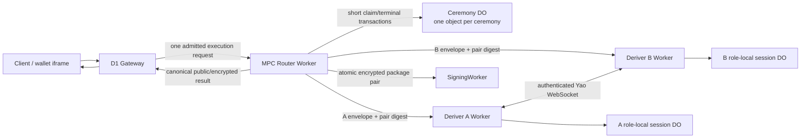

# Refactor 93: MPC Router-Owned Ed25519 Yao Ceremony Coordination

Date created: July 24, 2026

Status: planned

## Objective

Move Cloudflare Ed25519 Yao ceremony orchestration out of the D1 Gateway and
into the Rust MPC Router. Replace the serial Gateway-driven
`Deriver B Stage -> Deriver A Start -> Deriver B Result -> SigningWorker`
sequence with one authenticated Gateway-to-Router execution request and one
connected Router-owned execution path.

The refactor must reduce production passkey registration latency while
preserving:

- independent Deriver A and Deriver B secret custody;
- role-local one-use state and replay protection;
- exact A/B input-pair binding;
- forward-only output commitment;
- atomic SigningWorker package delivery;
- exact encrypted-output redelivery without cryptographic reevaluation.

The target product latency after the platform passkey prompt completes is
2–3 seconds for a typical production registration.

## Decision Summary

1. The MPC Router Worker is the execution coordinator.
2. A new ceremony-scoped Router Durable Object is the atomic public lifecycle
   ledger.
3. The coordinator Durable Object is keyed by the canonical ceremony identity.
   It is never tenant-wide.
4. The coordinator Durable Object performs short storage transactions only.
   It never waits for Deriver network requests, WebSockets, Yao execution, or
   SigningWorker delivery.
5. Deriver A and Deriver B retain separate role-local Durable Objects and
   separate secret bindings.
6. The Router dispatches exact paired work to A and B and owns the connected
   request chain through terminal output.
7. A and B bind every prepared, running, completed, and failed role state to
   the same input-pair digest.
8. A typed `peer_not_prepared` outcome permits bounded coordination retry
   before either role consumes one-use execution state.
9. The Gateway performs one MPC Router request. It does not call Deriver A,
   Deriver B, or SigningWorker directly.
10. Registration, recovery, and export use the same coordinator architecture
    with operation-specific request and result branches.
11. The current direct Stage, Start, Result, and SigningWorker orchestration
    paths are deleted after the request-boundary cutover.
12. No feature flag, legacy orchestration mode, or permanent compatibility
    branch remains after deployment.

## Authoritative Dependencies

This plan changes Cloudflare orchestration. It does not redefine the Yao
construction.

- [Streaming Yao implementation plan](./router-ab/ed25519-yao/implementation-plan.md)
  remains authoritative for cryptography, role views, one-use execution,
  output commitment, retry safety, and corruption claims.
- [Streaming Yao deployment plan](./router-ab/ed25519-yao/deployment.md)
  remains authoritative for Cloudflare topology, transport benchmarks,
  deployment evidence, and production profile claims.
- [Refactor 90](./refactor-90-modular-auth-capabilities-plan.md) remains
  authoritative for capability and authorization lifecycle.
- [Refactor 92](./refactor-92-session-expiry-handling.md) remains authoritative
  for Wallet Session expiry and step-up behavior.

If this plan conflicts with a cryptographic or role-isolation invariant in the
Yao implementation plan, the Yao plan wins and Refactor 93 must be revised.

## Current State And Regression

`RouterAbEd25519YaoHttpRegistrationBackend.executeInner()` currently performs
four network operations in series:

1. post the B envelope to the Deriver B Stage route;
2. post the A envelope to the Deriver A Start route;
3. fetch the completed B result from the Deriver B Result route;
4. deliver the A/B SigningWorker package pair.

The export path has the same Stage, Start, and Result shape.

The production Gateway constructs this backend with direct Deriver A, Deriver
B, and SigningWorker origins. The Gateway already has an `MPC_ROUTER` Service
Binding, yet Yao activation bypasses it.

Production tracing during the regression investigation observed approximately:

| Span | Observed wall time |
| --- | ---: |
| Deriver B Stage | 884 ms |
| Deriver A Start, including the A/B ceremony | 1.8 s |
| Deriver B Result | 65 ms |
| Successful post-Touch-ID product flow before the first fixes | 10–12 s |
| Successful post-Touch-ID product flow after the first fixes | about 6 s |

The underlying storage writes were generally tens of milliseconds or less.
Serial Worker, Durable Object, and peer-boundary wakeups multiplied the
platform latency.

The current architecture also gives the product Gateway responsibility for
cryptographic service orchestration. That responsibility belongs to the MPC
Router.

## Scope

This refactor owns:

- the Router-facing Ed25519 Yao execution contract;
- the per-ceremony Router coordination ledger;
- paired A/B ciphertext digest binding;
- Router-owned A/B dispatch and result composition;
- safe overlap of B preparation with A preparation;
- role-local retry and uncertainty handling required by that overlap;
- registration, recovery, and export execution coordination;
- atomic SigningWorker package-pair delivery from the Router;
- Gateway cutover to one `MPC_ROUTER` request;
- deletion of direct Gateway-to-Deriver and Gateway-to-SigningWorker Yao
  orchestration;
- Cloudflare Durable Object migrations and bindings;
- lifecycle timing spans and production acceptance measurements;
- local Router A/B dev parity.

This refactor does not:

- change the selected Yao circuit, garbling, OT, framing, or output-sharing
  construction;
- merge A and B into one administrative or secret-custody domain;
- move either role root share into the Router;
- allow the Router to decrypt either role input or recipient output;
- remove role-local one-use Durable Objects;
- store the binary garbled stream in a Durable Object;
- hold a Durable Object active across the network stream;
- change normal Ed25519 signing after activation;
- change Wallet Session budget or expiry policy;
- use D1 as a ceremony coordinator;
- introduce preprocessing or reusable garbled material.

## Required Invariants

1. The Gateway sends one admitted Yao execution request to the MPC Router.
2. The Gateway cannot address Yao Deriver Stage, Start, Result, or
   SigningWorker package routes after cutover.
3. The Router receives both opaque role envelopes and never receives either
   role plaintext.
4. The canonical input-pair digest commits to:
   - the complete ceremony binding;
   - operation;
   - circuit and protocol identity;
   - A ciphertext digest;
   - B ciphertext digest;
   - recipient-set digest;
   - authorization/admission digest;
   - root-share epoch and signer-set identity.
5. Every Router, A, and B lifecycle record for a ceremony carries the exact
   input-pair digest.
6. A conflicting pair digest fails before either role enters `Running`.
7. A missing B preparation returns `peer_not_prepared`. It does not mark A
   `Running` or `Failed`.
8. B accepts an A WebSocket only when its prepared record matches the exact
   pair digest, session, circuit, operation, and peer identity.
9. A and B independently enforce one-use execution in their own Durable
   Object namespaces.
10. `Running` never returns to `Prepared`.
11. Ambiguity after either role enters `Running` burns that execution identity.
12. `Completed` permits exact encrypted-result redelivery only.
13. A retry never reruns cryptography for a completed or ambiguous execution.
14. The Router Durable Object stores public identities, digests, status,
    timing metadata, failure classes, and public terminal receipts only.
15. Role-local Durable Objects remain the owners of exact encrypted package
    redelivery state required by the Yao plan.
16. The Router Durable Object never stores role plaintext, root shares,
    garbled tables, labels, OT material, recipient plaintext, or joined output.
17. `blockConcurrencyWhile` cannot enclose a fetch, WebSocket, Yao execution,
    SigningWorker call, timer, or polling loop.
18. The connected Router Worker request owns network wall time.
19. A client disconnect burns any activated role execution and records a
    sanitized terminal outcome.
20. SigningWorker receives the A/B package pair through one atomic delivery
    command.
21. Recovery output remains staged until client verification and explicit
    promotion.
22. Export output remains client-recipient-only.
23. Diagnostics and timing fields never influence lifecycle control flow.
24. Logs contain no ciphertext bodies, tokens, secrets, private outputs, or
    recipient packages.

## Target Architecture



The Router Worker coordinates execution. The ceremony Durable Object
serializes short state transitions and supports idempotent status recovery. It
does not host the ceremony.

## Component Responsibilities

### D1 Gateway

The Gateway continues to own:

- product authentication;
- registration intent and tenant policy;
- D1 wallet and account records;
- issuance of the admitted Router execution authority;
- persistence of the final verified product result.

The Gateway sends one typed request through its existing `MPC_ROUTER` Service
Binding. It receives one typed result and performs no role scheduling.

### MPC Router Worker

The Router owns:

- boundary parsing and execution-authority verification;
- canonical ceremony and input-pair digest construction;
- coordinator claim and terminal receipt calls;
- exact A/B dispatch;
- bounded `peer_not_prepared` coordination;
- transcript and role-result matching;
- atomic SigningWorker package delivery;
- sanitized timing and failure spans;
- canonical response composition.

The Router keeps the original request chain connected until terminal output.
It does not persist secrets.

### Ceremony Durable Object

Add:

```text
RouterAbRouterEd25519YaoCeremonyDurableObject
```

with binding:

```text
ROUTER_ED25519_YAO_CEREMONY_DO
```

and migration tag:

```text
router_ab_router_ed25519_yao_ceremony_v1
```

The object ID is derived from the canonical ceremony identity. Configuration
must not contain a static object name that routes every ceremony to one
instance.

The Durable Object accepts exact typed commands:

- `Claim`
- `MarkDispatched`
- `RecordTerminal`
- `Read`
- `Expire`

Each command performs bounded parsing, one lifecycle reduction, and bounded
storage work. Network access is forbidden from this class.

### Deriver A And Deriver B

Each Deriver:

- opens only its role-scoped HPKE envelope;
- validates the canonical pair binding;
- loads only its role-local root state;
- owns its role-local one-use state;
- participates in the authenticated A/B protocol;
- persists exact encrypted output before release;
- returns its signed public receipt and opaque recipient packages.

The selected transport and separate deployment identities remain unchanged.

### SigningWorker

The SigningWorker continues to:

- receive both role packages atomically;
- validate the pair and transcript;
- activate registration output or stage recovery output;
- return the canonical activation or staging receipt;
- support exact idempotent redelivery.

## Domain Model

### Ceremony Identity

Use one validated identity type. Raw route strings and partial binding objects
cannot enter core orchestration.

```rust
pub struct Ed25519YaoCeremonyIdentityV1 {
    pub lifecycle: RouterAbLifecycleIdentityV1,
    pub operation: Ed25519YaoOperationV1,
    pub session: Ed25519YaoSessionIdV1,
    pub circuit: Ed25519YaoCircuitIdV1,
    pub protocol: Ed25519YaoProtocolIdV1,
    pub signer_set: SignerSetIdV1,
    pub root_share_epoch: RootShareEpochV1,
}
```

Final field types must reuse the existing canonical Rust domain types.

### Input Pair Binding

```rust
pub struct Ed25519YaoInputPairBindingV1 {
    pub ceremony: Ed25519YaoCeremonyIdentityV1,
    pub deriver_a_input_digest: PublicDigest32,
    pub deriver_b_input_digest: PublicDigest32,
    pub recipient_set_digest: PublicDigest32,
    pub authorization_digest: PublicDigest32,
    pub pair_digest: PublicDigest32,
}
```

`pair_digest` is derived by the canonical production encoder. It is never
assembled independently in TypeScript.

### Router Coordination State

```rust
pub enum RouterEd25519YaoCeremonyStateV1 {
    Claimed {
        binding: Ed25519YaoInputPairBindingV1,
        claimed_at_ms: u64,
        expires_at_ms: u64,
    },
    Dispatched {
        binding: Ed25519YaoInputPairBindingV1,
        execution_id: Ed25519YaoExecutionIdV1,
        dispatched_at_ms: u64,
        expires_at_ms: u64,
    },
    OutputCommitted {
        binding: Ed25519YaoInputPairBindingV1,
        execution_id: Ed25519YaoExecutionIdV1,
        public_receipt: RouterAbEd25519YaoActivationPublicReceiptV1,
        committed_at_ms: u64,
    },
    Delivered {
        binding: Ed25519YaoInputPairBindingV1,
        execution_id: Ed25519YaoExecutionIdV1,
        public_receipt: RouterAbEd25519YaoActivationPublicReceiptV1,
        delivery_receipt: Ed25519YaoSigningWorkerActivationReceiptV1,
        delivered_at_ms: u64,
    },
    Failed {
        binding: Ed25519YaoInputPairBindingV1,
        execution_id: Ed25519YaoExecutionIdV1,
        failure: RouterEd25519YaoTerminalFailureV1,
        failed_at_ms: u64,
    },
    Expired {
        binding: Ed25519YaoInputPairBindingV1,
        expired_at_ms: u64,
    },
}
```

Export needs an operation-specific terminal receipt branch. Recovery needs
separate `OutputCommitted` and `Delivered` meanings because recovery remains
staged until client verification. The final implementation should express
those differences as operation-specific enum branches rather than optional
fields.

### Role-Local State

The A and B session records gain an exact prepared state and pair binding:

```rust
pub enum Ed25519YaoRoleSessionStateV1 {
    Prepared {
        pair: Ed25519YaoInputPairBindingV1,
        local_input_digest: PublicDigest32,
        expires_at_ms: u64,
    },
    Running {
        pair: Ed25519YaoInputPairBindingV1,
        local_input_digest: PublicDigest32,
        execution_id: Ed25519YaoExecutionIdV1,
        expires_at_ms: u64,
    },
    Completed {
        pair: Ed25519YaoInputPairBindingV1,
        execution_id: Ed25519YaoExecutionIdV1,
        execution: Ed25519YaoRoleExecutionV1,
    },
    Failed {
        pair: Ed25519YaoInputPairBindingV1,
        execution_id: Ed25519YaoExecutionIdV1,
        reason: Ed25519YaoRoleTerminalFailureV1,
    },
}
```

Operation-specific role execution branches must preserve activation and export
recipient constraints.

## Router Request Contract

Add one authenticated private Router endpoint:

```text
POST /router-ab/router/ed25519-yao/execute
```

The route accepts a discriminated request:

```rust
pub enum RouterEd25519YaoExecuteRequestV1 {
    Registration {
        authority: RouterAdmittedExecutionAuthorityV1,
        binding: Ed25519YaoRegistrationBindingV1,
        deriver_a_input: Ed25519YaoEncryptedInputV1,
        deriver_b_input: Ed25519YaoEncryptedInputV1,
    },
    Recovery {
        authority: RouterAdmittedExecutionAuthorityV1,
        binding: Ed25519YaoRecoveryBindingV1,
        deriver_a_input: Ed25519YaoEncryptedInputV1,
        deriver_b_input: Ed25519YaoEncryptedInputV1,
    },
    Export {
        authority: RouterAdmittedExecutionAuthorityV1,
        binding: Ed25519YaoExportBindingV1,
        deriver_a_input: Ed25519YaoEncryptedInputV1,
        deriver_b_input: Ed25519YaoEncryptedInputV1,
    },
}
```

The exact existing binding types should be reused where they already express
the required invariants. The route parser validates unknown JSON once and
hands a precise branch to core orchestration.

The response is an operation-specific `Result`-style union. Recoverable
service failures, terminal burned executions, authorization rejection, and
successful operation results must remain distinct.

### Private Role Commands

Replace the current unpaired role routes with Router-owned, pair-bound private
commands:

```text
POST /router-ab/deriver-a/ed25519-yao/execute-pair
POST /router-ab/deriver-b/ed25519-yao/prepare-pair
POST /router-ab/deriver-b/ed25519-yao/read-completed-pair
```

`prepare-pair` persists the exact B envelope and pair binding. It returns an
exact readiness receipt. `execute-pair` performs A preparation, the signed
two-phase start handshake, and the existing A/B protocol. After A completes,
`read-completed-pair` performs one exact read of B's already-completed
encrypted result.

The final private route names may follow an established path naming pattern.
Their ownership and semantics are fixed:

- only the MPC Router can call them;
- every command requires the exact pair binding;
- the final B read performs no polling and no execution;
- the old Gateway-addressable Stage, Start, and Result contracts are removed.

The target critical path is:

```text
Router claim
  + max(B prepare, A input/root preparation + bounded peer-ready wait + Yao)
  + one exact B completed-result read
  + atomic SigningWorker delivery
  + Router terminal record
```

The current critical path adds B Stage, A Start, and B Result sequentially.

## Execution Protocol

### Claim

1. Parse and authenticate the Gateway request.
2. Validate both encrypted envelope metadata against the admitted binding.
3. Compute A digest, B digest, and the canonical input-pair digest.
4. Address the ceremony Durable Object from the canonical ceremony identity.
5. Claim the exact pair.
6. Return the existing terminal receipt for an exact completed retry.
7. Reject a conflicting pair before contacting either Deriver.
8. Reconcile a previously dispatched state through exact role-local status.
   Never blindly rerun the ceremony.

### Paired Preparation And Execution

The Router starts B preparation and A execution concurrently.

1. B validates and persists `Prepared` for the exact pair.
2. A opens its own input and loads its root metadata while B prepares.
3. A attempts the authenticated B WebSocket with the exact pair digest.
4. B returns typed `peer_not_prepared` until the matching prepared record
   exists.
5. A performs bounded jittered retry inside the same Router-owned execution
   request.
6. A remains `Prepared` during these retries.
7. B atomically transitions its exact record from `Prepared` to `Running`.
8. A verifies B's signed acceptance and atomically transitions its exact record
   from `Prepared` to `Running`.
9. Any uncertainty after either transition burns the execution identity.
10. A and B execute the existing Yao protocol unchanged.

The retry budget must be short, explicit, and measured. It retries only
`peer_not_prepared`. Authentication errors, conflicts, expiry, malformed
state, circuit mismatch, and terminal role state fail immediately.

### Result And Delivery

1. A and B persist their exact encrypted role outputs before releasing them.
2. The Router obtains both signed role results.
3. The Router validates pair digest, ceremony identity, role, transcript,
   circuit, operation, recipient bindings, and public receipt equality.
4. The Router records the public output commitment.
5. Registration and recovery send one atomic package pair to SigningWorker.
6. Registration records and returns the active receipt.
7. Recovery records and returns the staged receipt. Promotion remains a
   separate client-verified operation.
8. Export returns only the exact client-recipient packages.
9. The Router records the public terminal receipt.

## Retry, Disconnect, And Reconciliation

Retry behavior is forward-only:

| Observed state | Exact retry behavior |
| --- | --- |
| No Router claim | Claim and execute |
| `Claimed`, neither role prepared | Resume exact preparation |
| One or both roles `Prepared`, neither `Running` | Resume exact paired execution |
| Any role `Running` after caller uncertainty | Reconcile; burn on unresolved ambiguity |
| Both roles `Completed` with the exact pair | Redeliver exact encrypted outputs |
| SigningWorker delivery uncertain | Retry the exact atomic package-pair command |
| Router `Delivered` | Return the canonical terminal receipt |
| Conflicting pair digest | Reject |
| Terminal role failure | Return the canonical sanitized failure |
| Expired nonterminal state | Expire and allocate a new ceremony identity |

A generic network retry cannot allocate a new transcript under the same
execution identity.

## Implementation Phases

### Phase 0: Freeze Baseline And Contracts

- [ ] Capture at least 20 production registration traces with per-span
      durations for Gateway, Router, B preparation, A preparation, A/B
      protocol, B result, SigningWorker delivery, D1 commit, and frontend
      finalization.
- [ ] Record cold-after-deploy and warm cohorts separately.
- [ ] Add a trace correlation ID that contains no user identity or secret.
- [ ] Freeze the current successful registration, recovery, and export
      response contracts.
- [ ] Add intended-behaviour assertions for exact retry and terminal failure.

### Phase 1: Canonical Pair And Coordinator Types

- [ ] Add the canonical ceremony identity and input-pair binding to
      `router-ab-core`.
- [ ] Add the operation-specific Router execute request and result unions.
- [ ] Add canonical digest encoding and Rust vectors.
- [ ] Generate or update TypeScript bindings through the existing generator.
- [ ] Add type fixtures rejecting missing identities, cross-operation fields,
      optional pair digests, and broad object-spread construction.
- [ ] Add exhaustive switches for every new operation and lifecycle union.

### Phase 2: Ceremony Coordination Ledger

- [ ] Implement
      `RouterAbRouterEd25519YaoCeremonyDurableObject`.
- [ ] Derive one object ID per canonical ceremony.
- [ ] Implement exact `Claim`, `MarkDispatched`, `RecordTerminal`, `Read`, and
      `Expire` reducers.
- [ ] Add idempotency, conflict, expiry, and absorbing-terminal tests.
- [ ] Add an alarm or bounded cleanup path for expired public ledger records.
- [ ] Add the Router binding and SQLite Durable Object migration to every
      Router environment.
- [ ] Prove through a focused boundary test that the class performs no fetch,
      WebSocket, timer wait, or cryptographic execution.

### Phase 3: Pair-Bound Role Lifecycle

- [ ] Add `Prepared` and exact pair binding to A and B role-local state.
- [ ] Bind the pair digest into the peer handshake and WebSocket request.
- [ ] Add typed `peer_not_prepared`.
- [ ] Ensure `peer_not_prepared` leaves both roles retryable and unconsumed.
- [ ] Transition both role records through the signed two-phase start
      handshake.
- [ ] Burn uncertainty after either role enters `Running`.
- [ ] Preserve exact completed-output redelivery.
- [ ] Update registration, recovery, and export role adapters.
- [ ] Mirror the production lifecycle in `router-ab-dev`.

### Phase 4: MPC Router Execution Coordinator

- [ ] Add the private Router execute route and boundary parser.
- [ ] Reuse internal service authentication and verify the admitted execution
      authority.
- [ ] Compute the canonical pair digest in Rust.
- [ ] Claim the ceremony ledger before role dispatch.
- [ ] Start B preparation and A preparation concurrently.
- [ ] Retry only typed `peer_not_prepared` within a bounded deadline.
- [ ] Await and validate both role results.
- [ ] Deliver the exact package pair to SigningWorker atomically.
- [ ] Record the public terminal receipt.
- [ ] Implement exact retry reconciliation without cryptographic
      reevaluation.
- [ ] Add structured span timings for every boundary.

### Phase 5: Gateway Cutover

- [ ] Replace `RouterAbEd25519YaoHttpRegistrationBackend` with an MPC
      Router-backed implementation.
- [ ] Configure it with the existing `MPC_ROUTER` Service Binding and canonical
      internal Router origin.
- [ ] Remove Deriver A, Deriver B, and SigningWorker URLs from the Yao backend
      configuration.
- [ ] Make registration, recovery, and export each perform one Router fetch.
- [ ] Keep product admission and D1 commit outside the MPC Router.
- [ ] Add unit tests proving the Gateway cannot issue direct Yao role or
      SigningWorker requests.

### Phase 6: Hard Cutover And Deletion

- [ ] Delete the Gateway Stage, Start, Result, and package-delivery
      orchestration.
- [ ] Delete obsolete Yao direct-origin environment keys where no other
      protocol owns them.
- [ ] Delete obsolete Deriver Stage and Result route contracts after the
      maximum in-flight ceremony lifetime has elapsed.
- [ ] Delete lower-authority tests, fixtures, mocks, and source guards that
      encode the serial flow.
- [ ] Delete compatibility request parsers after the boundary drain.
- [ ] Keep role-local Durable Object classes and their current secret
      boundaries.
- [ ] Verify the repository contains one production Yao orchestration owner.

### Phase 7: Deployment And Production Acceptance

- [ ] Deploy the new Router Durable Object migration and private route.
- [ ] Validate it while the Gateway still uses the old request boundary.
- [ ] Deploy the Gateway cutover without a runtime feature flag.
- [ ] Wait the maximum old ceremony lifetime.
- [ ] Deploy the route-deletion cleanup.
- [ ] Run cold-after-deploy and warm production cohorts.
- [ ] Compare latency, errors, Durable Object calls, Worker invocations, CPU,
      and active duration against Phase 0.
- [ ] Record the final evidence in the Yao deployment plan.

## Test Matrix

### Core And Type Tests

- canonical A/B pair digest vectors;
- registration, recovery, and export branch construction;
- direct object-literal rejection for invalid lifecycle states;
- broad-spread and unsafe-cast escape-hatch fixtures;
- exhaustive operation and terminal-state switching;
- cross-operation recipient rejection.

### Coordinator Durable Object Tests

- first exact claim;
- repeated exact claim;
- conflicting A digest;
- conflicting B digest;
- conflicting authorization or recipient digest;
- claim-to-dispatch transition;
- terminal states are absorbing;
- exact terminal receipt replay;
- expiry and cleanup;
- stable identity mismatch;
- one ceremony never blocks another ceremony.

### Role Lifecycle Tests

- A starts before B preparation and receives only `peer_not_prepared`;
- B prepares before A connects;
- exact pair eventually transitions both roles to `Running`;
- wrong pair, session, circuit, operation, or peer fails closed;
- `peer_not_prepared` does not burn A;
- uncertainty after B acceptance burns the execution;
- duplicate `Running` cannot execute again;
- completed exact retry returns the same encrypted result;
- failed and expired records never revive;
- registration, recovery, and export preserve their recipient constraints.

### Router Orchestration Tests

- one Gateway request produces one Router request;
- B and A preparation overlap;
- SigningWorker delivery waits for both role results;
- transcript mismatch blocks delivery;
- role swap blocks delivery;
- exact package pair is delivered once;
- uncertain SigningWorker response retries exactly;
- client disconnect burns activated role work;
- a completed retry performs zero Yao reevaluation;
- Router logs and coordinator records contain no secret-bearing fields.

### Product And Intended-Behaviour Tests

- passkey registration;
- Email OTP registration;
- add-signer activation where Yao is selected;
- explicit same-root recovery;
- explicit export;
- recovery client verification and promotion;
- normal signing still performs zero Yao calls;
- Wallet Session expiry still performs zero Yao recovery;
- registration cancellation cannot produce a partially active wallet.

### Fault Tests

- Router restart before dispatch;
- Router restart after one role prepares;
- Router disconnect after one role enters `Running`;
- A failure before and after peer acceptance;
- B failure before and after peer acceptance;
- WebSocket rejection, truncation, and timeout;
- SigningWorker timeout after durable activation;
- coordinator conflict and expiry;
- deployment immediately after a new Worker version;
- D1 overload remains isolated from the MPC execution path.

## Validation Commands

Run the narrowest relevant test during each phase. The final change touches
shared lifecycle, auth, crypto routing, deployment configuration, and
persistence, so broad validation is required before cutover:

```text
cargo test -p router-ab-core
cargo test -p router-ab-cloudflare
cargo test -p router-ab-dev
cargo yao-fv all
pnpm generate:signer-core-types
pnpm test:intended
pnpm test:unit
pnpm test:source-guards
pnpm check
```

Also run:

- strict Router, Deriver A, Deriver B, and SigningWorker Worker builds;
- Wrangler startup dry-runs for all four Workers;
- local Yao product tests;
- deployed staging registration, recovery, and export;
- production trace capture after deployment approval.

Generated vectors and bindings must be regenerated through their repository
commands. They cannot be hand-edited.

## Observability

Emit one sanitized span tree:

```text
gateway.yao_execute
  router.parse_and_authorize
  router.ceremony_claim
  router.deriver_b_prepare
  router.deriver_a_prepare
  router.peer_ready_wait
  router.yao_protocol
  router.deriver_a_commit
  router.deriver_b_commit
  router.signing_worker_delivery
  router.ceremony_terminal
  gateway.d1_commit
  frontend.wallet_ready
```

Each span records:

- trace and ceremony audit digests;
- operation;
- outcome class;
- wall time;
- CPU time where available;
- Durable Object call count;
- Worker invocation count;
- retry count by typed reason;
- cold/warm deployment cohort when known.

No span records request bodies, HPKE ciphertexts, recipient packages, tokens,
emails, account IDs, credential IDs, root shares, or private outputs.

## Deployment Sequence

1. Deploy the new Router ceremony Durable Object class and binding.
2. Deploy the MPC Router execute route.
3. Exercise the new private route in staging with production-shaped inputs.
4. Deploy compatible A/B pair-binding handlers.
5. Deploy the Gateway cutover to its existing `MPC_ROUTER` binding.
6. Observe one full maximum ceremony lifetime.
7. Delete the old Gateway orchestration and old request routes.
8. Deploy the cleanup to staging, then production.
9. Capture cold and warm acceptance cohorts.

Compatibility exists only at the request boundary during steps 2–6. Core
state and execution code have one current path.

Rollback before Gateway cutover removes no user state. Rollback after any role
enters `Running` follows forward-only reconciliation and burn rules. A code
rollback cannot revive an old execution identity or pair digest.

## Acceptance Criteria

Refactor 93 is complete when:

1. the Gateway makes exactly one MPC Router request for each Yao execution;
2. no production Gateway code calls A, B, or SigningWorker Yao routes directly;
3. one ceremony-scoped Router Durable Object owns public coordination state;
4. no tenant-wide Durable Object serializes ceremonies;
5. no Durable Object stays active across the A/B network stream;
6. A and B retain independent role-local one-use Durable Objects;
7. every role state and peer handshake binds the exact A/B input-pair digest;
8. A and B preparation overlap safely;
9. `peer_not_prepared` is the only coordination retry;
10. completed retries perform zero cryptographic reevaluation;
11. SigningWorker package delivery is atomic and idempotent;
12. registration, recovery, and export intended-behaviour contracts pass;
13. crypto vectors, type fixtures, Worker builds, and startup dry-runs pass;
14. the old Stage, Start, Result, and Gateway package-delivery paths are
    deleted;
15. production passkey registration from Touch ID completion to wallet-ready
    reaches:
    - p50 at or below 3 seconds;
    - p95 at or below 4 seconds;
    - zero repeated 10–12 second successful-path plateaus;
16. the Router Yao execution span meets the existing Yao deployment SLO or has
    an explicitly reviewed product-level budget;
17. production traces show no D1 query inside the MPC execution span;
18. production traces show no `D1 DB is overloaded` error caused by ceremony
    coordination;
19. the Yao deployment evidence records cold and warm latency, CPU, memory,
    requests, Durable Object calls, failures, and retry counts.

## Estimated Size

Expected implementation size:

- 5–8 focused engineering days;
- approximately 15–25 production and test files;
- approximately 1,000–2,000 net lines including lifecycle tests and deletion;
- one Router Durable Object migration;
- coordinated Router, Deriver A, Deriver B, SigningWorker, Gateway, and
  frontend verification deployments.

The cryptographic kernel remains unchanged. Lifecycle, authentication,
deployment, and persistence boundaries make this a high-risk refactor that
requires broad final validation.
