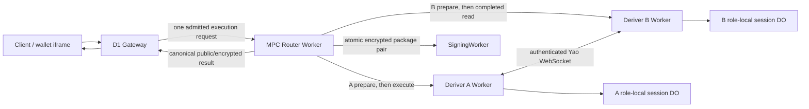

# Refactor 93: MPC Router-Owned Ed25519 Yao Ceremony Coordination

Date created: July 24, 2026

Status: in progress

## Objective

Move Cloudflare Ed25519 Yao ceremony orchestration out of the D1 Gateway and
into the Rust MPC Router. Replace the serial Gateway-driven
`Deriver B Stage -> Deriver A Start -> Deriver B Result -> SigningWorker`
sequence with one authenticated Gateway-to-Router execution request and one
connected Router-owned execution path.

The refactor must reduce production passkey registration latency while
preserving:

- independent Deriver A and Deriver B secret custody;
- role-local one-use state and replay protection;
- exact A/B input-pair binding;
- forward-only output commitment;
- atomic SigningWorker package delivery;
- exact encrypted-output redelivery without cryptographic reevaluation.

The target product latency after the platform passkey prompt completes is
2–3 seconds for a typical production registration.

## Decision Summary

1. The MPC Router Worker is the execution coordinator.
2. Role-local one-use Durable Objects are the sole coordination authority.
   Deriver A's `Prepared -> Running` transition is the execution lock. No
   ceremony-wide Router ledger exists.
3. Deriver A and Deriver B retain separate role-local Durable Objects and
   separate secret bindings.
4. The Router dispatches A and B preparation concurrently, awaits both signed
   readiness receipts, then dispatches execution and owns the connected
   request chain through terminal output.
5. A and B bind every prepared, running, completed, and terminal role state and
   peer handshake to the same input-pair digest.
6. B refuses execution without an exactly matching prepared record. This is a
   fail-closed coordinator-defect guard. It is never a retry path.
7. Registration, recovery, and export have operation-specific request and
   result payloads and share one lifecycle state machine.
8. The Gateway performs one MPC Router request and owns byte-exact replay for
   internal transport retries. A client-initiated attempt allocates a new
   ceremony identity.
9. The Gateway does not call Deriver A, Deriver B, or SigningWorker directly.
10. The current direct Stage, Start, Result, and SigningWorker orchestration
    paths are retained only for the request-boundary drain, then deleted.
11. No feature flag, legacy orchestration mode, or compatibility branch
    remains after deployment.

## Review Resolutions

The implementation follows these reviewed conclusions.

### Receipt-Sequenced Preparation

Concurrent A/B preparation followed by two signed readiness receipts is the
selected coordination model. It has a deterministic execution boundary and no
race-and-backoff loop.

Cloudflare may schedule preparation and execution on different isolates.
Correctness depends on durable prepared records and signed receipts. It never
depends on isolate reuse or an in-memory cache.

### No Ceremony-Wide Ledger In V1

Role-local A/B Durable Objects are sufficient for mutual exclusion, pair
conflict detection, expiry, terminal redelivery, and reconciliation. Adding a
third lifecycle ledger would duplicate authority and add storage transitions
to the latency-sensitive path.

A ceremony-wide ledger may be reconsidered only when a demonstrated
correctness requirement cannot be represented by the role-local lifecycle.
It cannot be added as a convenience cache.

### Disconnect Policy

Refactor 93 retains the Yao implementation plan's current rule: uncertainty
after activation burns the execution. Durable `Completed` output remains
eligible for exact redelivery.

Allowing `waitUntil` run-to-completion after caller disconnect is a separate
protocol and security-policy change. It requires an update to the
authoritative Yao plan, failure analysis, duration-limit evidence, and fault
tests before Refactor 93 may adopt it.

### Cutover Recovery

Deployment recovery uses the previous Cloudflare Worker version. Refactor 93
does not add a runtime backend-selection switch. Temporary request-boundary
compatibility exists only during the ordered deployment and drain window, then
the direct orchestration path is deleted.

## Authoritative Dependencies

This plan changes Cloudflare orchestration. It does not redefine the Yao
construction.

- [Streaming Yao implementation plan](./router-ab/ed25519-yao/implementation-plan.md)
  remains authoritative for cryptography, role views, one-use execution,
  output commitment, retry safety, and corruption claims.
- [Streaming Yao deployment plan](./router-ab/ed25519-yao/deployment.md)
  remains authoritative for Cloudflare topology, transport benchmarks,
  deployment evidence, and production profile claims.
- [Refactor 90](./refactor-90-modular-auth-capabilities-plan.md) remains
  authoritative for capability and authorization lifecycle.
- [Refactor 92](./refactor-92-session-expiry-handling.md) remains authoritative
  for Wallet Session expiry and step-up behavior.

If this plan conflicts with a cryptographic or role-isolation invariant in the
Yao implementation plan, the Yao plan wins and Refactor 93 must be revised.

## Baseline Before Refactor 93 Cutover

Before the Router cutover, `RouterAbEd25519YaoHttpRegistrationBackend.executeInner()` performed
four network operations in series:

1. post the B envelope to the Deriver B Stage route;
2. post the A envelope to the Deriver A Start route;
3. fetch the completed B result from the Deriver B Result route;
4. deliver the A/B SigningWorker package pair.

The export path has the same Stage, Start, and Result shape.

The pre-cutover production Gateway constructed this backend with direct Deriver A, Deriver
B, and SigningWorker origins. The Gateway already has an `MPC_ROUTER` Service
Binding, yet Yao activation bypasses it.

Historical production tracing during the regression investigation observed approximately:

| Span                                                         | Observed wall time |
| ------------------------------------------------------------ | -----------------: |
| Deriver B Stage                                              |             884 ms |
| Deriver A Start, including the A/B ceremony                  |              1.8 s |
| Deriver B Result                                             |              65 ms |
| Successful post-Touch-ID product flow before the first fixes |            10–12 s |
| Successful post-Touch-ID product flow after the first fixes  |          about 6 s |

The underlying storage writes were generally tens of milliseconds or less.
Serial Worker, Durable Object, and peer-boundary wakeups multiplied the
platform latency.

The current architecture also gives the product Gateway responsibility for
cryptographic service orchestration. That responsibility belongs to the MPC
Router.

## Scope

This refactor owns:

- the Router-facing Ed25519 Yao execution contract;
- paired A/B ciphertext digest binding;
- Router-owned A/B dispatch and result composition;
- signed readiness receipts and safe overlap of A and B preparation;
- role-local uncertainty handling required by that overlap;
- registration, recovery, and export execution coordination;
- atomic SigningWorker package-pair delivery from the Router;
- Gateway cutover to one `MPC_ROUTER` request;
- deletion of direct Gateway-to-Deriver and Gateway-to-SigningWorker Yao
  orchestration;
- lifecycle timing spans for focused diagnosis;
- local Router A/B dev parity.

This refactor does not:

- change the selected Yao circuit, garbling, OT, framing, or output-sharing
  construction;
- merge A and B into one administrative or secret-custody domain;
- move either role root share into the Router;
- allow the Router to decrypt either role input or recipient output;
- remove role-local one-use Durable Objects;
- store the binary garbled stream in a Durable Object;
- hold a Durable Object active across the network stream;
- change normal Ed25519 signing after activation;
- change Wallet Session budget or expiry policy;
- use D1 as a ceremony coordinator;
- introduce preprocessing or reusable garbled material.

## Required Invariants

1. The Gateway sends one admitted Yao execution request to the MPC Router.
2. The Gateway cannot address Yao Deriver Stage, Start, Result, or
   SigningWorker package routes after cutover.
3. The Router receives both opaque role envelopes and never receives either
   role plaintext.
4. The canonical input-pair digest commits to:
   - the complete ceremony binding;
   - operation;
   - circuit and protocol identity;
   - A ciphertext digest;
   - B ciphertext digest;
   - recipient-set digest;
   - authorization/admission digest;
   - root-share epoch and signer-set identity.
5. Every A and B lifecycle record for a ceremony carries the exact input-pair
   digest.
6. A conflicting pair digest fails before either role enters `Running`.
7. The Router dispatches execution only after it holds exact signed readiness
   receipts from A and B.
8. B accepts an A WebSocket only when its prepared record matches the exact
   pair digest, session, circuit, operation, and peer identity.
9. A missing or mismatched B preparation fails closed and identifies a Router
   coordinator defect. The execution path contains no coordination retry loop.
10. A and B independently enforce one-use execution in their own Durable
    Object namespaces.
11. `Running` never returns to `Prepared`.
12. Ambiguity after either role enters `Running` burns that execution identity.
13. `Completed` permits exact encrypted-result redelivery only.
14. A retry never reruns cryptography for a completed or ambiguous execution.
15. Role-local Durable Objects remain the owners of exact encrypted package
    redelivery state required by the Yao plan.
16. Role lifecycle records store the pair digest and role-local digest. They
    do not duplicate the full pair-binding structure.
17. `blockConcurrencyWhile` cannot enclose a fetch, WebSocket, Yao execution,
    SigningWorker call, timer, or polling loop.
18. The connected Router Worker request owns network wall time.
19. A caller disconnect after either role enters `Running` burns the activated
    execution as required by the Yao implementation plan. If both roles had
    already durably reached `Completed`, an exact retry may redeliver that
    completed output.
20. SigningWorker receives the A/B package pair through one atomic delivery
    command.
21. Recovery output remains staged until client verification and explicit
    promotion.
22. Export output remains client-recipient-only.
23. Diagnostics and timing fields never influence lifecycle control flow.
24. Logs contain no ciphertext bodies, tokens, secrets, private outputs, or
    recipient packages.
25. Gateway internal retry reuses the byte-exact admitted request body. HPKE
    reencryption is a new ceremony with a new identity.
26. Each readiness receipt binds the exact role-local root metadata digest.
    Execution rejects root metadata drift between preparation and execution,
    and receipt signature verification rejects a configured peer-key identity
    mismatch. Secret-binding-name rotation is not represented in this digest
    and remains a deployment-contract gate.

## Target Architecture



The Router Worker coordinates execution. The independent role-local Durable
Objects serialize one-use state and support exact status recovery.

## Component Responsibilities

### D1 Gateway

The Gateway continues to own:

- product authentication;
- registration intent and tenant policy;
- D1 wallet and account records;
- product admission facts passed to the channel-authenticated Router request;
- persistence of the final verified product result.

The Gateway sends one typed request through its existing `MPC_ROUTER` Service
Binding. It receives one typed result and performs no role scheduling.

### MPC Router Worker

The Router owns:

- boundary parsing, internal service authentication, and authority
  lifetime/digest validation;
- canonical ceremony and input-pair digest construction;
- concurrent exact A/B preparation;
- signed readiness-receipt verification;
- receipt-sequenced A/B execution dispatch;
- transcript and role-result matching;
- atomic SigningWorker package delivery;
- sanitized timing and failure spans;
- canonical response composition.

The Router keeps the original request chain connected until terminal output.
It does not persist secrets.

### Deriver A And Deriver B

Each Deriver:

- opens only its role-scoped HPKE envelope;
- validates the canonical pair binding;
- loads only its role-local root state;
- owns its role-local one-use state;
- returns a signed exact readiness receipt from preparation;
- participates in the authenticated A/B protocol;
- persists exact encrypted output before release;
- returns its signed public receipt and opaque recipient packages.

The selected transport and separate deployment identities remain unchanged.

### SigningWorker

The SigningWorker continues to:

- receive both role packages atomically;
- validate the pair and transcript;
- activate registration output or stage recovery output;
- return the canonical activation or staging receipt;
- support exact idempotent redelivery.

## Domain Model

### Ceremony Identity

Use one validated identity type. Raw route strings and partial binding objects
cannot enter core orchestration.

```rust
pub struct Ed25519YaoCeremonyIdentityV1 {
    pub lifecycle: RouterAbLifecycleIdentityV1,
    pub operation: Ed25519YaoOperationV1,
    pub session: Ed25519YaoSessionIdV1,
    pub circuit: Ed25519YaoCircuitIdV1,
    pub protocol: Ed25519YaoProtocolIdV1,
    pub signer_set: SignerSetIdV1,
    pub root_share_epoch: RootShareEpochV1,
}
```

Final field types must reuse the existing canonical Rust domain types.

### Input Pair Binding

```rust
pub struct Ed25519YaoInputPairBindingV1 {
    pub ceremony: Ed25519YaoCeremonyIdentityV1,
    pub deriver_a_input_digest: PublicDigest32,
    pub deriver_b_input_digest: PublicDigest32,
    pub recipient_set_digest: PublicDigest32,
    pub authorization_digest: PublicDigest32,
    pub pair_digest: PublicDigest32,
}
```

`pair_digest` is derived by the canonical Rust production encoder and is
recomputed and validated at the Router boundary. The Gateway sends the
validated ceremony binding and opaque role envelopes without any digest
preimages or derived pair fields. The Router derives the role-input,
recipient-set, authorization, and pair digests before constructing its
internal execute request. Rust-generated pair-digest fixtures remain the
cross-language wire invariant; Gateway contract tests assert that the raw
request contains no Router-owned digest fields. The generated TypeScript base
contracts are emitted by `pnpm generate:router-ab-ed25519-yao-types`.

### Readiness Receipt

```rust
pub struct Ed25519YaoRoleReadinessReceiptV1 {
    pub role: Ed25519YaoDeriverRoleV1,
    pub session: Ed25519YaoSessionIdV1,
    pub pair_digest: PublicDigest32,
    pub local_input_digest: PublicDigest32,
    pub root_metadata_digest: PublicDigest32,
    pub prepared_at_ms: u64,
    pub expires_at_ms: u64,
    pub signature: Ed25519YaoRoleSignatureV1,
}
```

Each role signs the canonical receipt only after its exact `Prepared` record
is durable. The Router requires one unexpired receipt from each role with the
same session and pair digest. The final names must reuse existing role,
signature, and session types.

Deriver B also returns a signed `Ed25519YaoRoleStartAcceptanceV1` only after
its exact pair record durably transitions from `Prepared` to `Running`. The
acceptance binds B's role, session, pair digest, execution identity, root
metadata digest, and bounded lifetime. Deriver A verifies that acceptance and
atomically transitions its own record to `Running`; neither role starts Yao
before this two-phase start completes.

### Role-Local State

The A and B session records gain an exact prepared state. The full pair
binding is validated at request and peer boundaries. Lifecycle records store
its canonical digest:

```rust
pub enum Ed25519YaoRoleSessionStateV1 {
    Prepared {
        pair_digest: PublicDigest32,
        local_input_digest: PublicDigest32,
        root_metadata_digest: PublicDigest32,
        expires_at_ms: u64,
    },
    Running {
        pair_digest: PublicDigest32,
        local_input_digest: PublicDigest32,
        root_metadata_digest: PublicDigest32,
        execution_id: Ed25519YaoExecutionIdV1,
        expires_at_ms: u64,
    },
    Completed {
        pair_digest: PublicDigest32,
        execution_id: Ed25519YaoExecutionIdV1,
        execution: Ed25519YaoRoleExecutionV1,
    },
    Burned {
        pair_digest: PublicDigest32,
        execution_id: Ed25519YaoExecutionIdV1,
    },
    Expired {
        pair_digest: PublicDigest32,
        local_input_digest: PublicDigest32,
    },
}
```

`Ed25519YaoRoleExecutionV1` is the operation-discriminated terminal payload.
Registration, recovery, and export share the lifecycle states. Their terminal
payload branches preserve activation, staged recovery, and export recipient
constraints without multiplying lifecycle enums. The Cloudflare adapter maps
role failures to `Burned` and expiry to `Expired`.

## Router Request Contract

Add one authenticated private Router endpoint:

```text
POST /router-ab/router/ed25519-yao/execute
```

The route accepts a discriminated request:

```rust
pub enum RouterEd25519YaoExecuteRequestV1 {
    Registration {
        authority: RouterAdmittedExecutionAuthorityV1,
        binding: Ed25519YaoRegistrationBindingV1,
        deriver_a_input: Ed25519YaoEncryptedInputV1,
        deriver_b_input: Ed25519YaoEncryptedInputV1,
    },
    Recovery {
        authority: RouterAdmittedExecutionAuthorityV1,
        binding: Ed25519YaoRecoveryBindingV1,
        deriver_a_input: Ed25519YaoEncryptedInputV1,
        deriver_b_input: Ed25519YaoEncryptedInputV1,
    },
    Export {
        authority: RouterAdmittedExecutionAuthorityV1,
        binding: Ed25519YaoExportBindingV1,
        deriver_a_input: Ed25519YaoEncryptedInputV1,
        deriver_b_input: Ed25519YaoEncryptedInputV1,
    },
}
```

The exact existing binding types should be reused where they already express
the required invariants. The route parser validates unknown JSON once and
hands a precise branch to core orchestration.

The response is an operation-specific `Result`-style union. Recoverable
service failures, terminal burned executions, authorization rejection, and
successful operation results remain distinct at the core contract boundary.
Pair-bound role routes carry sanitized failure classes across the HTTP boundary;
legacy role routes retain protocol-error responses until the drain cleanup.

### Private Role Commands

Replace the current unpaired role routes with Router-owned, pair-bound private
commands:

```text
POST /router-ab/deriver-a/ed25519-yao/prepare-pair
POST /router-ab/deriver-a/ed25519-yao/execute-pair
POST /router-ab/deriver-b/ed25519-yao/prepare-pair
POST /router-ab/deriver-b/ed25519-yao/read-completed-pair
```

Each `prepare-pair` validates the role-local envelope and pair binding, warms
the role-local Worker and Durable Object boundaries, validates root metadata,
persists its public metadata digest in `Prepared`, and returns a signed exact
readiness receipt. A's prepared record stores no role plaintext or root
material. `execute-pair` reopens A's HPKE envelope, verifies both readiness
receipts, revalidates the exact root metadata digest, performs the pair-bound
claim and peer-receipt handshake, and runs the existing A/B protocol. After A completes,
`read-completed-pair` performs one exact read of B's already-completed
encrypted result.

Preparation is idempotent for an exact pair and rejects a conflicting pair for
a live session. Cloudflare may schedule preparation and execution on different
isolates. Correctness depends only on the durable readiness receipts.

The final private route names may follow an established path naming pattern.
Their ownership and semantics are fixed:

- only the MPC Router can call them;
- every command requires the exact pair binding;
- execution requires both exact signed readiness receipts;
- the final B read performs no polling and no execution;
- the old Gateway-addressable Stage, Start, and Result contracts are removed
  after the request-boundary drain.

The target critical path is:

```text
max(A prepare, B prepare)
  + pair-bound receipt handshake + Yao
  + one exact B completed-result read
  + atomic SigningWorker delivery
```

The current critical path adds B Stage, A Start, and B Result sequentially.

## Execution Protocol

### Validate And Reconcile

1. Parse and authenticate the Gateway request.
2. Validate both encrypted envelope metadata against the admitted binding.
3. Compute A digest, B digest, and the canonical input-pair digest.
4. Reuse the byte-exact request for a Gateway-owned internal retry.
5. Read exact role-local status when a prior Router outcome is uncertain.
6. Return the existing terminal receipt for an exact completed retry.
7. Reject a conflicting pair during role preparation.
8. Never blindly rerun the ceremony.

### Paired Preparation And Execution

1. The Router dispatches A and B `prepare-pair` concurrently.
2. A and B validate their own envelopes, pair binding, root metadata, and
   role-local state.
3. Each role persists `Prepared` with the public root metadata digest and
   returns a signed readiness receipt.
4. The Router awaits and verifies both exact receipts.
5. The Router dispatches A `execute-pair` with both receipts.
6. A connects to B exactly once with the exact pair digest.
7. B refuses a missing or mismatched prepared record.
8. B verifies A's signed readiness receipt and atomically transitions its exact
   record from `Prepared` to `Running` before returning the WebSocket upgrade.
9. B returns a signed start acceptance over the upgraded peer channel. A
   verifies the acceptance and atomically transitions its exact record from
   `Prepared` to `Running` before sending Yao messages.
10. Any uncertainty after either transition burns the execution identity.
11. A and B execute the existing Yao protocol unchanged.

The execution path contains no coordination retry loop. Authentication errors,
conflicts, missing preparation, expiry, malformed state, circuit mismatch, and
terminal role state fail immediately.

### Result And Delivery

1. A and B persist their exact encrypted role outputs before releasing them.
2. The Router obtains both validated role results.
3. The Router validates pair digest, ceremony identity, role, transcript,
   circuit, operation, recipient bindings, and public receipt equality.
4. Registration and recovery send one atomic package pair to SigningWorker.
5. Registration returns the active receipt.
6. Recovery returns the staged receipt. Promotion remains a
   separate client-verified operation.
7. Export returns only the exact client-recipient packages.

## Retry, Disconnect, And Reconciliation

Retry behavior is forward-only:

| Observed state                                  | Exact retry behavior                                                              |
| ----------------------------------------------- | --------------------------------------------------------------------------------- |
| Neither role prepared                           | Prepare both roles and execute                                                    |
| One or both roles `Prepared`, neither `Running` | Reissue exact preparation, verify both receipts, then execute                     |
| Any role `Running` after caller uncertainty     | Reconcile; burn on unresolved ambiguity                                           |
| Both roles `Completed` with the exact pair      | Redeliver exact encrypted outputs                                                 |
| SigningWorker delivery uncertain                | Retry the exact atomic package-pair command                                       |
| SigningWorker has the exact terminal receipt    | Return the canonical terminal receipt                                             |
| Conflicting pair digest                         | Reject                                                                            |
| Terminal role failure                           | Return the canonical sanitized failure                                            |
| Expired nonterminal state                       | Return typed `ceremony_expired`; Gateway/client allocates a new ceremony identity |

A generic network retry cannot allocate a new transcript under the same
execution identity. The Gateway retains and replays the byte-exact admitted
request body for internal retries. HPKE reencryption produces new ciphertext
digests and therefore requires a new ceremony identity.

## Implementation Phases

### Implementation Checklist Audit (July 26, 2026)

The checked implementation items below were re-audited against reachable
production adapters, executable local paths, and focused behavioral tests.
These checks mean code-complete for the stated item. They do not imply staging
or production acceptance.

- [x] Review the completed Phase 0 contract and trace-correlation work. The
      boundary accepts or creates one opaque 128-bit identifier, rejects
      malformed caller values before work, and propagates the same value
      through Gateway, Router, and role calls.
- [x] Review Phases 1–3 against the canonical Rust constructors, generated
      TypeScript boundary, pair-lifecycle implementation, and production Router
      coordinator. Pair preparation is concurrent, both signed receipts are
      required, A execution is single-dispatch, B completion is request-bound,
      and SigningWorker delivery is operation-typed and idempotent.
- [x] Review Phase 4 as an orchestration cutover. Registration, recovery, and
      export use the MPC Router backend and the Gateway backend type has no
      direct Yao role-route origin. The separate tenant-runtime persistence
      cutover remains Phase 5 work.
- [x] Review the checked Phase 5 substeps. Registration admission/execution,
      recovery claims and activation replacement, export phase claims and exact
      result redelivery, cross-key role claims, and split role execution all
      have focused behavioral coverage.
- [x] Complete the remaining Phase 5 request-scoped composition and cutover
      plumbing. Registration, recovery, export, finalize, replay, capability,
      session, and local-dev paths all have partitioned implementations behind
      the independent family selectors.
- [ ] Complete the staged family cutovers and drains, then remove the
      tenant-runtime binding and remaining legacy routes, serializers,
      fixtures, and compatibility boundaries.
- [ ] Deploy one coherent staging revision and complete manual registration,
      recovery, and export acceptance.

Audit validation: all `router-ab-core`, `router-ab-cloudflare`, and
`router-ab-dev` tests pass; 72 focused Gateway contract, persistence, recovery,
export, trace, and selector tests pass; and the integration checkpoint passes
`pnpm check`. The native Router executable installs its coordinator and serves
the authenticated execute and recovery-promotion boundaries. Direct calls to
the lower-level Router boundary helper without a dispatcher intentionally
return `501`.

### Phase 0: Freeze Contracts And Staging Gate

- [x] Add a trace correlation ID that contains no user identity or secret.
- [x] Freeze the current successful registration, recovery, and export
      response contracts.
- [x] Add intended-behaviour assertions for exact retry and terminal failure.
- [x] Add structured boundary spans for diagnosing individual staging
      ceremonies without making telemetry collection an acceptance gate.

The lower-level Router contract tests cover exact replay and terminal failure;
the HTTP backend contract tests assert that a response lost after Router
execution is retried with the exact admitted body, trace ID, and replay marker,
and that a burned execution is surfaced as a terminal failure without retry.
The strict intended-behaviour suite now covers both product outcomes through a
request-scoped local-Gateway fault seam. Each armed request carries a validated
opaque UUID that correlates its sanitized proof response; its Router fetch
controller is constructed only for that request, so overlapping registrations
cannot consume one another's fault state. The uncertain-transport case lets the
real strict Router complete, drops that first response, and proves that the
Gateway retry uses the byte-exact body, original trace ID, and replay marker
before registration completes and signs. Its terminal case returns the typed
Router burned result at the same service-binding boundary and proves that the
Gateway performs no second Router dispatch. The harness refuses to arm against
any origin other than the managed local Router. Both local control headers are
removed before product routing and are absent from staging and production
Workers.

The successful response shapes are frozen at the existing strict TypeScript
parsers and product service boundaries. Registration and recovery are covered
by `routerAbEd25519YaoContracts.unit.test.ts`; export is covered by
`routerAbEd25519YaoExport.server.unit.test.ts`. The Router transport changes
preserve those public operation-specific result bodies.

### V1 Admission Authority Semantics

`RouterAdmittedExecutionAuthorityV1` is a short-lived, channel-authenticated
request field in the current v1 boundary. The Router requires the internal
service-authentication header, derives the activation authorization digest from
the canonical Rust serialization of the raw Gateway request, validates the
authority time window, and rejects an authority digest that does not equal the
pair binding's authorization digest. Export continues to carry the
authorization digest from its explicit client authorization artifact.

The v1 field is not a standalone cryptographic signature over the D1 admission
decision. Extending the route to an independently callable trust boundary
requires a signed admission artifact, Router key-rotation policy, and a
cross-language verification contract. That work remains outside this cutover;
the plan does not claim cryptographic D1 admission attestation.

### Phase 1: Canonical Pair And Router Contracts

- [x] Add the canonical ceremony identity and input-pair binding to
      `router-ab-core`.
- [x] Add the operation-specific Router execute request and result unions.
- [x] Add canonical digest encoding and Rust vectors.
- [x] Generate or update TypeScript bindings through the router-ab-core
      generator (`pnpm generate:router-ab-ed25519-yao-types`). The generated
      base contracts cover ceremony identity, lifecycle, digest, and pair
      binding shapes; shared TypeScript keeps operation-specific generic
      narrowing around those generated declarations.
- [x] Add a cross-language pair-digest vector that is generated from the Rust
      encoder and keep the Gateway adapter on the raw request boundary; its
      contract test rejects locally derived pair/authority fields.
- [x] Add type fixtures rejecting missing identities, cross-operation fields,
      optional pair digests, and broad object-spread construction.
- [x] Add exhaustive switches for operation-specific request and terminal
      payload unions.

### Phase 2: Pair-Bound Role Lifecycle

- [x] Add `Prepared`, pair digest, and role-local input digest to A and B
      role-local state.
- [x] Add idempotent A and B `prepare-pair` commands and signed readiness
      receipts. Core lifetime validation remains strict; Cloudflare role and
      coordinator boundaries allow at most 1,000 ms of future-only skew from
      the platform's I/O-refreshed clock.
- [x] Bind the pair digest into the peer handshake and WebSocket request.
- [x] Make execute-before-prepare a typed fail-closed defect result.
- [x] Require both exact readiness receipts before A execution.
- [x] Bind and revalidate role-local root metadata digests across preparation
      and execution.
- [x] Transition both role records through the pair-bound readiness and signed
      two-phase start handshake. B's acceptance is verified before A enters
      `Running`.
- [x] Burn uncertainty after either role enters `Running`.
- [x] Preserve exact completed-output redelivery.
- [x] Update registration, recovery, and export role adapters.
- [x] Verify strict local Wrangler serving uses the production Router and role
      Worker shims, including all pair-bound role paths. The executable script
      test covers generated shim targets and the strict Deriver dispatch table.
- [x] Mirror the production lifecycle in `router-ab-dev` through the serving
      path with a pair-bound state model, role-specific receipt signing,
      readiness/peer claims, uncertainty burning, and exact completed-output
      lookup tests. Native Rust workers serve authenticated, persisted
      `prepare-pair`, `execute-pair`, `read-pair-status`,
      `read-completed-pair`, and `burn-pair` commands. A and B persist
      `Running` before the peer network hop, B signs start acceptance, both
      persist `Completed`, and completed reads validate the canonical pair
      binding before returning bytes. The native Router coordinator performs
      concurrent preparation, A execution, B completion acknowledgement, and
      registration/recovery SigningWorker delivery without opening role
      secrets. Its recovery-promotion route forwards the expanded local
      SigningWorker request and validates the returned `Active` receipt;
      Router-side replay/CAS persistence remains a separate follow-up gate.
      Strict Wrangler local mode remains the executable Cloudflare
      production-parity path.

### Phase 3: MPC Router Execution Coordinator

- [x] Add the private Router execute route and boundary parser.
- [x] Reuse internal service authentication and verify the admitted execution
      authority.
- [x] Compute and validate the canonical pair digest in Rust.
- [x] Start A and B preparation concurrently.
- [x] Await and validate both signed readiness receipts.
- [x] Dispatch A execution exactly once after both receipts.
- [x] Await and validate both role results, with the Router's single exact
      completed-result read returning an explicit B completion acknowledgment.
- [x] Deliver the exact package pair to SigningWorker atomically.
- [x] Implement exact retry reconciliation without cryptographic
      reevaluation.
- [x] Accept byte-exact internal replay and reject conflicting ciphertext
      digests under the same ceremony identity.
- [x] Add structured span timings for preparation, receipt validation, A
      execution, B completed-result read, SigningWorker delivery, and the
      connected Router execution.

### Phase 4: Gateway Cutover

- [x] Replace `RouterAbEd25519YaoHttpRegistrationBackend` with an MPC
      Router-backed implementation.
- [x] Configure it with the existing `MPC_ROUTER` Service Binding and canonical
      internal Router origin.
- [x] Remove Deriver A, Deriver B, and SigningWorker URLs from the Yao backend
      configuration.
- [x] Make registration, recovery, and export each submit one logical admitted
      Router command. The normal path performs one fetch; an uncertain
      transport may perform one byte-exact replay of that command.
- [x] Keep product admission and D1 commit outside the MPC Router.
- [x] Make direct Yao role and SigningWorker addressing unrepresentable in the
      backend configuration type.
- [x] Retain the byte-exact admitted request body for an internal uncertain
      Router retry. Transport failures retry once with the same serialized
      body and trace ID plus the Router replay marker; HTTP responses are not
      retried.

The Cloudflare Gateway cutover code is implemented behind the explicit drain
selector described below. The strict local Wrangler runtime
(`crates/router-ab-dev/scripts/dev-local-workers.mjs`) includes the Router
coordinator on port 9100. The `router_ab_local_up` Rust harness starts an
explicit Router process with its own persistence scopes and serves the native
pair and recovery boundaries; the two harnesses still require separate
cryptographic and deployment evidence.

### Phase 5: Hard Cutover And Deletion

#### Cutover Reliability Corrections (July 26, 2026)

The cutover review findings C1, C2, and H2–H6 were rechecked against the
production Worker composition and fixed before any family window was enabled.
No deployment or cutover window change is part of these corrections.

- [x] **Email OTP failure cleanup — preserve the actionable failure and release
      the registration intent.** Disposal treats an already-absent one-use
      factor as an idempotent success. Yao factor disposal and registration
      intent cancellation run independently, so a disposal failure cannot skip
      cancellation and leave `walletId` reserved. The original registration
      failure remains visible when cleanup succeeds or finds the factor already
      absent.
- [x] **C1 / H1 — classify every ceremony-store route.** Registration intent,
      cancellation, start, derivation response/activation, finalize,
      add-signer intent/start/derivation/finalize, and add-auth-method
      intent/start/finalize now follow the registration family window. The
      intent routes are the admission boundaries; later phases remain on the
      legacy store during the drain. The remaining catch-all routes do not read
      or write registration ceremony intent state. Worker-boundary tests cover
      every classified route before cutoff, during drain, and after drain.
- [x] **C2 / H6 — route capability consumers by recovery ownership.** Warm
      recovery bootstrap, wallet-session minting, unlock, and sync-account all
      follow the recovery family window. A registration cutover can no longer
      move those consumers to partitioned D1 while recovery still writes the
      legacy snapshot. Configuration rejects registration unless recovery is
      configured to finish draining first, so removing the legacy fallback
      cannot make newly partitioned registrations unreadable during rollout.
- [x] **H2 — prevent legacy capability-state resurrection.** The stateful
      tenant-runtime composition no longer accepts or invokes the canonical D1
      capability fallback. Existing-wallet rehydration remains exclusively in
      the request-scoped partitioned runtime, where installation uses shared
      CAS. An empty legacy snapshot now stays empty on a capability miss.
- [x] **H3 — tolerate only bounded Cloudflare clock skew.** Core readiness
      validation remains strict. Cloudflare readiness checks share one
      future-only 1,000 ms allowance for the platform's I/O-refreshed clock;
      receipt expiry, pair/root binding, and strict signature verification are
      unchanged. Boundary tests accept +1,000 ms, reject +1,001 ms, reject
      expiry, and prove the default validator still rejects any future issue
      time.
- [x] **H4 — enforce legacy ceremony CAS.** Registration and add-signer legacy
      updates use one transactional Durable Object compare-and-swap operation
      over canonical JSON. Missing or stale expected records return the same
      typed conflict used by partitioned D1, and the winning record is left
      unchanged. The actual Durable Object test proves the transaction and
      stale-writer behavior.
- [x] **H5 — keep transient start/finalize failures resumable.** Registration
      and add-signer start/finalize callbacks share one typed retryable-failure
      classifier. `not_configured`, internal/in-progress/uncertain/timeout and
      temporarily unavailable results, plus responses carrying `retryAfterMs`,
      throw before terminal persistence. The durable prepared claim remains
      available for exact stale-claim reconciliation after service recovery;
      deterministic domain rejections remain terminal.

Validation for this correction set: `pnpm build:sdk-full`, `pnpm check`, the SDK
server build, unit typecheck, 49 focused cutover/state/CAS/side-effect tests, 10
registration and wallet-auth-method lifecycle tests, and the Rust core and
Cloudflare bounded-skew tests all pass.

The Phase 5 deletion audit is recorded in
[`refactor-93-phase5-deletion-audit.md`](./refactor-93-phase5-deletion-audit.md).
It confirms that the Gateway serial Yao owner is deleted, while Deriver A/B
service bindings, legacy role routes/parsers, and compatibility tests remain
drain targets. `SIGNING_WORKER` is still owned by the Router A/B ECDSA
threshold transport and is not an obsolete Yao direct-origin binding. No
destructive deletion is authorized until the audit's deployment and drain
receipts are recorded.

The tenant-runtime cleanup is deliberately ordered after the three family
drains. An unset window still selects the tenant runtime for product lifecycle
state, while cryptographic execution already uses the MPC Router. Active
admission, authorization, recovery, export, and finalization claims exist only
in that runtime's snapshot; there is no snapshot-to-partitioned-D1 migration
bridge. Removing or bypassing the snapshot first would strand an in-flight
ceremony after the user completes authentication. The safe sequence is:

1. deploy and exercise one frozen revision with every family window unset;
2. quiesce and drain registration, recovery, and export independently;
3. remove all Yao traffic and state from the tenant runtime;
4. retain the runtime only for non-Yao routes until its separate follow-up
   deletion.

- [x] Delete the Gateway Stage, Start, Result, and package-delivery
      orchestration.
- [ ] Delete obsolete Yao direct-origin environment keys where no other
      protocol owns them.
- [ ] Replace the tenant-scoped Gateway runtime Durable Object with a
      request-safe per-ceremony persistence/CAS boundary, then remove its
      binding and SQLite migration so no tenant-wide object coordinates Yao.
  - [x] Route registration admission and execution through typed request-scoped
        CAS behind the disabled two-boundary drain selector.
  - [x] Move registration start, bind, finalize, add-signer, and shared
        wallet/session effects behind idempotent request-safe boundaries.
    - [x] Persist a stable registration/add-signer start claim before consuming
          the grant, binding Yao authorization, preparing either signer branch,
          or writing the ceremony. Exact retries must return the same ceremony
          and a conflicting request fingerprint must fail closed.
      - [x] Close the remaining registration authority/claim ambiguity. A failed
            OTP, WebAuthn, or add-signer authorization attempt creates no start
            claim and leaves the grant available for a corrected retry. A
            successful Email OTP verification now atomically writes an exact,
            operation-bound D1 receipt while deleting the challenge. Receipt
            replay bypasses rate limiting, rejects a changed proof, stores no OTP
            or raw grant, and resumes start after response loss or a crash before
            the claim write. The real-D1 test covers wrong-then-correct OTP,
            receipt-batch response loss, the missing-claim interval, and exact
            recovery.
    - [x] Put add-signer finalize behind a durable outer claim and terminal
          receipt so concurrent requests and response loss cannot repeat
          session minting, normal-signing provisioning, signer insertion, or
          capability installation. Ed25519 fault injection covers every
          lifecycle boundary and stable session terms; the strict ECDSA test
          covers request purpose, respond, activation, signer persistence, exact
          replay, and conflicting finalize requests on partitioned D1.
    - [x] Move registration/add-signer intent, ceremony, and replay records off
          the shared `THRESHOLD_STORE` object to partitioned D1 CAS. The Yao
          runtime and lifecycle records are request-scoped. Real-SQLite tests
          cover atomic multi-record writes, one-time take/delete behavior,
          contention, restart recovery, terminal cancellation, and canonical
          exact replay. The legacy factory remains only for drain coverage and
          now enforces the same expected-record CAS contract for ceremony
          updates.
    - [x] Split sponsored NEAR account creation into a prepare step that builds,
          signs, and hashes the transaction without broadcasting and a broadcast
          step that replays those exact bytes. Rebuilding would take a fresh
          nonce and block hash and produce a second distinct transaction.
    - [x] Let the side-effect claim carry the prepared artifact. `prepare` runs
          before the claim is persisted, so the signed transaction and its hash
          are durable before the broadcast, and `in_progress` returns that
          artifact so an ambiguous outcome reconciles by replay.
    - [x] Wire prepare/broadcast into finalize, keyed by the activation session
          so two attempts at one registration share a claim, and commit the
          wallet, signer, authentication, and Email OTP enrollment records in
          one D1 batch. The commit input is a discriminated union, so a passkey
          registration carrying enrollment state does not compile.
    - [x] Classify the initial broadcast and resumed `txStatus` as created,
          rejected, or uncertain. Terminal execution success returns created;
          structured terminal execution failures reject. Pending, not-found,
          transport, and infrastructure outcomes perform exact account and
          queried-public-key `FullAccess` readback. Only structured
          transaction-not-found plus confirmed account absence permits an
          exact-byte replay on a resumed claim. `InvalidNonce` and `Expired`
          remain uncertain after absent readback. `send_tx` itself runs once;
          reconciliation owns every later retry decision. A local HTTP
          JSON-RPC matrix exercises the production `MinimalNearClient` path for
          success, execution and status failure, pending readback, outage, and
          exact replay. The real-D1 finalize suite covers a lost response after
          the transaction lands without a duplicate broadcast.
    - [x] Parse the persisted claim envelope at the D1 boundary. Invalid records
          fail closed as an uncertain claim read and are never reinterpreted as
          missing or fresh. Before claim resume or terminal replay, decode the
          bounded signed Borsh bytes; verify sender, signing key, receiver,
          nonce, block hash, actions, and the NEAR transaction hash against the
          persisted metadata; recompute the exact signed-byte artifact
          fingerprint; and compare it with the stored fingerprint. Any failure
          prevents preparation, `txStatus`, and broadcast. The real-D1 suite
          mutates only a persisted signature byte while preserving the stored
          fingerprint and proves that network counts remain unchanged.
    - [x] Prove the finalization sequence converges after a crash between its
          steps. Each write is individually idempotent — wallet, signer, and
          Email OTP statements are `DO UPDATE` upserts, capability installation
          returns `exact_retry` for a matching origin fingerprint, and ceremony
          cleanup is a delete. The full-service convergence suite injects
          response loss after the outer finalize claim, activation consumption,
          session minting, normal signing provisioning, the wallet D1 batch,
          capability installation, finalize-replay persistence, ceremony
          deletion, and the outer completion commit. An identical retry reaches
          the same successful response with one wallet, signer, authentication
          method, authenticator, and credential binding.
    - [x] Bind keyed finalize replay records to a canonical request fingerprint
          and reject reuse of an idempotency key for a different finalize body.
          Persisted replay records without a fingerprint fail closed at the D1
          boundary.
    - [x] Cover Email OTP commit atomicity against a real D1 database: the
          enrollment and wallet land together and read back, a failing
          enrollment statement rolls back the wallet and signer rows, and
          re-running the identical commit converges to one row per table.
    - [x] Cover concurrent finalize contention for one lifecycle: exactly one
          claim and terminal receipt win. A prepared idempotent effect may be
          resumed after its 30-second live-owner window; a contender inside
          that window receives the matching retry delay instead of executing
          the effect concurrently. Deterministic failures are terminal exact
          receipts. Internal, unavailable, unconfigured, in-progress,
          uncertain, timeout, and retry-after failures leave start and finalize
          claims open for stale-claim reconciliation.
    - [x] Drive the convergence check through the finalize entry point rather
          than the commit store and side-effect boundary separately. The same
          suite also races two identical finalize requests and verifies an
          exact shared result with one persisted wallet state.
    - [x] Derive the request fingerprint from the stable semantic
          account-creation intent: receiver account, target public key, relayer
          account, and initial balance. Persist the complete prepared effect,
          including the relayer signing key, nonce, block hash, exact signed
          Borsh bytes, and NEAR transaction hash. The NEAR transaction hash is
          the decoded unsigned-transaction hash. Separately compute the
          prepared-artifact fingerprint as SHA-256 over the exact signed Borsh
          bytes after semantic validation, and recompute it on every claim or
          completion read.
    - [x] Resolve the Yao runtime per request so registration finalize reads the
          activation from whichever store its execute step used. A fixed runtime
          would have sent execute to the partitioned store while finalize kept
          reading the legacy one.
    - [x] Make resumability explicit with a required
          `kind: 'prepared_resumable'` lifecycle discriminator and required
          preparation, artifact-fingerprint derivation, resume interval, and
          execution members. Compile-time fixtures reject an omitted
          discriminator, missing prepared-lifecycle members, and the obsolete
          `non_resumable` kind.
    - [x] Build the full partitioned Gateway handler with the D1 runtime in
          both the service provider and Router options. Registration start uses
          it after the registration drain; every public, session, sync-account,
          and non-Yao route leaves the tenant runtime after all three family
          drains.
    - [ ] Enable the registration selector in staging with a measured cutoff
          and drain window.
  - [x] Add typed request-scoped recovery admission and execution
        prepare/claim/commit boundaries with a shared backend-session uniqueness
        index, durable uncertainty, and no backend retry.
  - [x] Classify recovery and export phases in the cutover selector so only
        admission stops at the cutoff and every later phase of a ceremony runs
        against the store its admission used. Each family carries its own
        window; a family with no window stays on the legacy runtime, so one
        family cannot inherit another's elapsed drain.
    - [x] Lift the recovery and export authorization and capability adapters out
          of the tenant runtime object so the request-scoped handlers can be
          constructed from the environment. `createStagingRecoveryRequestScopedDependencies`
          and `createStagingExportRequestScopedDependencies` reuse the existing
          wallet-session and WebAuthn adapters and the request-scoped runtime, so
          this is composition wiring rather than a second authorization
          implementation. Cutover timing is configured separately per family;
          existing-wallet capability rehydration is supplied by a bounded
          wallet/slot D1 fallback on a shared-state miss.
      - [x] Load exactly one canonical signer record on a shared-state miss,
            validate its persisted capability through the production parser,
            and install it through the partitioned shared-state CAS. Exact
            retries reuse the installed record; conflicting state fails closed.
      - [x] Keep the NEAR account ID as a validated chain projection instead of
            a capability-selector or wire-identity field. Warm recovery,
            Email OTP unlock, and sync-account compare the resolved descriptor
            with their verified account identity. Export remains bound by the
            signed wallet/key/session/grant/worker/root/participant identity and
            the exact capability public key, epoch, application binding, and
            runtime policy. D1 signer parsing independently requires the stored
            capability account to match the signer account.
      - [x] Exercise registration-era recovery and recovered-capability export
            against real D1 from an initially empty partitioned shared record.
            The export test uses a named NEAR account whose value differs
            from the registered public-key bytes and the production Wallet
            Session authorization adapter. Exact admission, activation, and
            completed-result retries do not repeat backend work.
  - [x] Wire recovery admission, execution, and activation to the partitioned
        store as one coherent cutover, dispatched through the selector using the
        environment-backed dependencies. Dormant until the recovery window is
        configured.
    - [x] Route warm recovery bootstrap through the same request-scoped
          capability resolver and classify it as a recovery continuation in the
          per-family selector.
    - [x] Persist the activation claim before Router promotion and replace the
          active wallet capability together with an exact operation receipt in
          one D1 transaction. Exact retries reconcile response loss from that
          receipt without repeating the wallet write.
    - [x] Compose admission, execution, and activation behind the drain
          selector. Enabling still waits on local cutover validation.
  - [x] Move export admission, execution, redelivery, and authorization state
        to the partitioned store with typed conflict and uncertainty handling.
    - [x] Persist phase-specific authorization, admission, and execution claims
          before their effects; retain uncertain claims without repeating
          WebAuthn verification or Router calls; persist and redeliver the exact
          completed export result after a codec reload.
    - [x] Compose both export routes against the partitioned store behind the
          drain selector. A WebAuthn-success/receipt-CAS conflict remains
          fail-closed and requires a fresh export ceremony.
  - [x] Provide partitioned D1 ownership for remaining replay, authorization,
        and session state, and route the complete outer Gateway to it after all
        family drains.
  - [ ] Delete the tenant runtime binding, readiness path, serializer, and
        Durable Object class after the drain.
    - [ ] Preserve the historical `router-api-runtime-sqlite-v1` migration and,
          only after the drain receipt, add a new unique Cloudflare legacy
          migration with
          `deleted_classes = ["RouterApiRuntimeDurableObject"]`. Removing the
          old migration entry does not delete the deployed class namespace.
  - [x] Give the local dev worker the same request-scoped path. Its Yao
        product runtime and all registration, recovery (including warm
        bootstrap), and export routes use the partitioned D1 store and the
        request-scoped handlers. The local MPC backend keeps the service
        binding and intended-fault controller, so local retries exercise the
        same byte-exact transport boundary as staging. Readiness now checks
        both versioned JSON CAS tables required by that store. The real local
        Worker and SQLite D1 suite covers registration contention, recovery
        bootstrap/admission/execution/activation, Email OTP-authorized export,
        exact replay after Worker reconstruction, typed conflicts, and one
        Router effect. The native Router executable installs its coordinator
        dispatcher for execute and recovery-promotion; only the deliberately
        dispatcher-free lower helper retains the explicit 501 response.
- [ ] Delete obsolete Deriver Stage and Result route contracts after the
      maximum in-flight ceremony lifetime has elapsed.
- [ ] Before deleting legacy role routes, complete the cross-key exclusion
      drain:
  - [x] Make legacy admission and pair preparation claim both role-record keys
        through the same Durable Object storage transaction.
  - [ ] Deploy that version, then observe the maximum in-flight lifetime with
        no object containing both records.
- [ ] Delete lower-authority tests, fixtures, mocks, and source guards that
      encode the serial flow.
- [ ] Delete compatibility request parsers after the boundary drain.
- [x] Split A's claim, network execution, and completion into separate Worker
      and role-DO commands so no role Durable Object remains active across the
      Yao WebSocket stream.
- [x] Keep role-local Durable Object classes and their current secret
      boundaries.
- [ ] After the boundary drain, verify the repository and deployment contain
      one reachable production Yao orchestration owner.

The Gateway backend no longer contains the serial Stage/Start/Result or direct
Yao package-delivery flow. The remaining Deriver Stage/Result handlers and
direct-origin bindings are retained until the deployed cutover has survived the
maximum in-flight ceremony lifetime; they are role-boundary drain targets, not
second Gateway orchestration owners. Request-safe lifecycle storage replaces
the tenant-scoped `ROUTER_API_RUNTIME` after the per-family drains. Its
pre-cutover fallback, binding, and class remain until the deployed drain receipt
authorizes deletion.

### Phase 6: Staging Deployment And Manual Acceptance

The staging product validation uses a local-only Playwright runner rather than a
deployed test surface. `pnpm -C tests test:refactor93:staging:check` validates
the exact staging-origin allowlist and proves that private Router service-auth
material is rejected without contacting staging. A live run uses
`pnpm -C tests test:refactor93:staging` with the frozen full commit SHA and the
public staging frontend configuration in the environment. Playwright serves an
instrumented frontend locally while fulfilling the exact staging site origin,
so Gateway CORS and wallet RP-ID policy see the real approved origin. The
deployed Pages build never receives `VITE_ENABLE_INTENDED_E2E`, and the runner
adds no Gateway route, privileged adapter, D1 seed, or service-auth path.

The automated live test covers virtual-passkey registration, client-observed
response loss, exact retry, concurrent terminal redelivery, and Ed25519 export
through the real staging Gateway, Router, and role workers. It emits only route
counts, the frozen SHA, and SHA-256 digests of the in-memory request and terminal
response. Authorization headers, request bodies, credentials, and wallet state
are never serialized; Playwright tracing, screenshots, and video are disabled.
Browser contexts own and discard virtual credentials, and runner output lives
under the operating-system temporary directory.

The focused request-scoped and role-lifecycle suites remain the authority for
deterministic conflicting cryptographic requests, terminal burning, process
restart, and rollback state transitions that cannot be safely injected into a
hosted product without a test backdoor. A real Touch ID registration and Email
OTP recovery from a fresh device are explicit manual checks.

The code branch already contains the Gateway cutover, so the historical
"validate Router while Gateway still uses the old request boundary" step cannot
be replayed here. Contract tests and optimized four-Worker dry-runs are green;
the first external validation must be a coherent staging rollout before any
route-deletion cleanup.

- [x] Deploy the new Router private route as part of one coherent staging
      release. Staging backend run `30171501501` deployed `dev` revision
      `bea123f4559e17101733c24f4f64db94ec3b286e` on 2026-07-25. Cloudflare
      reported SigningWorker version `81c3fca0-c325-4fee-8bf8-6fe91931f1d1`,
      Deriver A `667e7f6c-8502-4043-aa60-75b52f02c6d5`, Deriver B
      `0a72499b-e003-4aee-9858-10781f06a361`, Router
      `f48ea746-baa3-4a60-9758-8f9b9280aa2c`, and Gateway
      `e0dd36d0-787b-4e19-beb0-c84b8955cc8b`, each at 100% traffic. The
      Gateway version annotation records the selected revision. Workflow and
      independent readiness checks passed, and all six family-window bindings
      remained empty. The first live registration reached the Router but failed
      before either role entered `Prepared`: Deriver A and Deriver B each
      rejected the Gateway-requested `root_share_epoch=epoch-1` against their
      persisted startup metadata. Readiness proved deployment and binding
      availability; it did not prove that persisted role metadata matched the
      Gateway-admitted signing-root scope. A reversible staging CAS from
      `epoch-1` to `default` proved that both Ed25519 roles accept `default` and
      complete Router execution, while the ECDSA derivation roles reject that
      same epoch because their persisted metadata is `epoch-1`. The CAS was
      reverted to `epoch-1`; no role metadata was rewritten. The product flow
      currently projects one environment `signingRootVersion` onto two
      independently persisted root-share systems, so staging cannot complete a
      dual-branch registration with its existing records.
- [x] Reconcile the frozen staging revision's admitted signing-root scope with
      both Ed25519 and ECDSA role-local startup-metadata records. Define the
      deployment-owned root epoch for each root-share system instead of letting
      one tenant environment version initialize or relabel role custody state.
      Correct staging through the supported provisioning or rotation boundary,
      verify both roles in each system accept the exact configured scope, and
      add a data-plane preflight that fails before a product ceremony when any
      required role lacks that scope.
      The authorized staging-only replacement procedure and pre-upload backup
      receipt are recorded in
      [`refactor-93-staging-custody-rotation.md`](./refactor-93-staging-custody-rotation.md).
      Staging backend run `30174308501` deployed the matched replacement pair
      and fresh role-local object scopes from frozen `dev` revision
      `bf3642dc4` on 2026-07-26. All deployment preflights and five Gateway
      smoke endpoints passed. Backend run `30185829220` and frontend run
      `30185830270` then deployed merged revision
      `9791ffc98eaf1799f8fb378e5b09f81b9d654659`. A fresh product registration
      and export completed through both root-share systems under `epoch-1`.
- [x] Deploy one frozen staging baseline with every family window unset.
      Backend run `30183541977` and frontend run `30184290832` deployed
      revision `4585f4223a72844bae0ed569601bb34b09804c93` on 2026-07-26.
      Backend build, migration, five deployment preflights, all five Worker
      deployments, readiness smoke, frontend build, Pages deployment, and
      frontend smoke passed. GitHub Environment variables use whitespace-only
      sentinels because GitHub rejects empty variable values; the deployment
      parser trims those sentinels to the required unset state.
      A live registration correlated by opaque trace
      `7253e42b854c6b47113a5ff33c9db53a` proved both rotated Ed25519 roles can
      load `epoch-1`, prepare the exact pair, and sign readiness receipts. It
      then exposed a Cloudflare clock-boundary defect: Deriver A observed
      Deriver B's freshly signed start acceptance as slightly future because
      Workers clocks report the time of the last I/O.
- [x] Diagnose and fix the Cloudflare start-acceptance clock regression without
      weakening the canonical protocol validator. Commit `ac348b043` keeps
      strict validation as the default and permits at most 1,000 ms future
      skew only at the Cloudflare A-to-B peer handoff. Focused core tests, the
      complete feature-enabled Cloudflare adapter suite, and the source-guard
      chain pass. PR #29 merged the fix to `dev` as
      `9791ffc98eaf1799f8fb378e5b09f81b9d654659`. Backend run `30185829220`
      deployed that revision successfully, and the live staging product test
      completed registration, exact terminal replay, and export.
- [x] With every family window unset, run the staging registration and export
      product paths on the frozen revision. The live Playwright test completed
      both paths and concurrent byte-identical terminal replay against revision
      `9791ffc98eaf1799f8fb378e5b09f81b9d654659`.
- [ ] Run the staging recovery product path on the same frozen revision. Verify
      exact replay,
      conflict, disconnect, terminal redelivery, rollback, restart, and
      concurrency with their focused automated tests rather than expanding the
      hosted staging flow.
- [x] Superseded: validate the Router while the Gateway still uses the old
      request boundary. The branch already contains the Gateway cutover, so this
      ordering cannot be replayed. The coherent staging rollout below replaces
      it as the first external validation.
- [ ] Deploy each Gateway family cutover with its corresponding
      `ROUTER_AB_YAO_GATEWAY_{REGISTRATION,RECOVERY,EXPORT}_ADMISSION_CUTOFF_MS`
      set at admission quiescence and its corresponding
      `ROUTER_AB_YAO_GATEWAY_{REGISTRATION,RECOVERY,EXPORT}_DRAIN_UNTIL_MS`
      set to that cutoff plus the measured maximum in-flight lifetime.
- [ ] Exercise staging registration, recovery, export, exact replay, conflict,
      disconnect, terminal redelivery, and rollback on the coherent versions.
- [ ] Confirm manual staging registration completes successfully after Touch
      ID, with the post-prompt wait returned to the expected 2–3 second range.
- [ ] Complete the staging family drains and validate route-deletion cleanup in
      staging.
- [x] Replace the failed stack workflow's hard-coded Gateway secret plumbing
      with target-capability-derived backend deployment. Billing is enabled in
      both hosted environments, and both Gateway jobs require
      `STRIPE_API_SK`. The historical failure and current invariant are recorded
      in [`refactor-93-production-evidence.md`](./refactor-93-production-evidence.md);
      a coherent staging run completed, while data-plane acceptance remains
      open on the role startup-metadata mismatch recorded above.

## Mid-Implementation Review Dispositions (2026-07-24)

The Fable review identified several claims that needed either implementation or
an explicit scope decision:

- The Router now samples the clock after concurrent preparation, so receipt
  validation cannot reject a receipt merely because preparation completed after
  request parsing.
- A completion re-reads its role state before writing `Completed`; stale
  completions, burns, and conflicting executions fail closed. Both role
  preparation paths re-read after root metadata loading, and normal legacy and
  pair-bound requests reject the other lifecycle's existing record. The
  cross-key exclusion remains a drain gate until the final boundary cleanup.
  The two record keys cannot coordinate requests served by different Worker
  versions: an in-flight legacy binary can still perform its plain
  `SESSION_RECORD_STORAGE_KEY` write after a newer pair binary has checked that
  key. Before deleting the legacy routes, deploy a version whose first legacy
  admission writes and pair preparation write are both transactions that
  re-read `SESSION_RECORD_STORAGE_KEY` and `PAIR_SESSION_RECORD_STORAGE_KEY`
  together (or use an equivalent persistent lifecycle-claim marker), then wait
  the maximum in-flight lifetime. Any Durable Object that contains both keys
  must fail closed and be investigated; it is not safe to infer ownership from
  either key alone.
- The unused contract-only coordinator was removed. `router_coordinator.rs` is
  the sole production Router orchestration owner.
- The current v1 handshake uses signed readiness plus a signed, pair-bound
  two-phase start acceptance over internally authenticated peer transport.
  Signed terminal-result artifacts and acceptance redelivery remain separate
  follow-up protocol work.
- The authority field is channel-authenticated and digest/time bound in v1,
  rather than a signed D1 admission attestation. A signed admission artifact
  remains a future trust-boundary requirement.
- The Gateway forwards only the raw ceremony binding and opaque role envelopes.
  Rust owns authorization, recipient-set, role-input, and pair digest
  derivation; cross-language vectors pin the resulting binding, while the
  Gateway contract test asserts that no digest preimage or derived pair field
  is constructed locally.
- SigningWorker activation receipts are now checked against the admitted
  operation (`Active` for registration and `Staged` for recovery). Pair-bound
  role routes emit a sanitized typed failure envelope, and the Router decodes
  it into the canonical recoverable, rejected, or burned result union. Legacy
  role routes and SigningWorker transport retain their existing protocol-error
  boundary until the drain cleanup.
- Pair lifecycle failure classification is now protocol-code driven for missing
  preparation, expired preparation, and pair conflicts. Human-readable error
  text remains diagnostic and cannot select a retry or rejection branch.
- The Router's one-shot B result read now consumes a typed completion
  acknowledgment envelope. The envelope revalidates the session, pair digest,
  role, and execution before transcript validation; a pending B state remains a
  typed failure rather than a coordination retry loop.
- Deriver B revalidates live root metadata when its role execution begins,
  after the signed `BeginPair` transition. A root change in that interval
  burns the pair rather than reopening preparation or retrying under the same
  identity; the post-`Running` check is intentional one-use fail-closed
  behavior.
- The Gateway preserves `ceremony_expired` as a terminal 409 failure instead of
  treating it as an exact retry. Callers must allocate a new ceremony identity
  after the nonterminal lifetime has elapsed.
- Caller-disconnect handling follows the forward burn policy when the Router
  observes an uncertain role result. Cloudflare request cancellation does not
  guarantee a post-disconnect callback, so dropped-caller burn is covered by
  the fault-test boundary.

The `router-ab-dev` pair lifecycle has route and ownership parity checks, and
the Rust harness serves the native Router coordinator through authenticated
role-worker HTTP boundaries, including recovery promotion. Tenant-runtime
binding/class removal, drain verification, and staging validation remain open.

The current staging Gateway still has one tenant-scoped runtime Durable Object
(`ROUTER_API_RUNTIME`). It serializes only runtime initialization with
`blockConcurrencyWhile`, then permits request overlap, so it does not wrap the
Yao network stream. It does, however, hold the mutable product admission,
recovery, export, and authorization maps and writes the complete snapshot back
after each request. Removing this object or routing Yao requests around it
without a replacement persistence/CAS boundary would lose replay state and
allow concurrent snapshots to overwrite one another. The request-scoped D1
partitioned adapter now implements registration, recovery, export, capability,
and session state. The staging Worker contains independent drain selectors for
registration, recovery, and export. Each family has its own
`ROUTER_AB_YAO_GATEWAY_<FAMILY>_ADMISSION_CUTOFF_MS` and
`ROUTER_AB_YAO_GATEWAY_<FAMILY>_DRAIN_UNTIL_MS` pair. The registration selector
also gates public `/wallets/register/start`; it keeps the family on
`ROUTER_API_RUNTIME` before the cutoff, rejects new admissions between the
cutoff and drain boundary, keeps old continuations on the tenant runtime, and
switches the family to D1 at the final boundary:
authorization and a typed admission or execution claim are CASed before the
MPC Router backend call, terminal state is loaded from a fresh snapshot, and
uncertainty or CAS conflicts fail closed without retrying the backend. The
generated deployment config leaves each pair empty until that family's state
bridge is ready.

Registration start and all internal registration operations use the
partitioned handler after the registration drain. Recovery and export route
selection dispatches admission, execution, activation, warm bootstrap, and
export requests through request-scoped handlers after their respective family
drains. Once all three windows have elapsed, the outer Gateway dispatches every
remaining public, session, sync-account, console, and non-Yao request through a
per-request handler whose service provider and Router options both use the
partitioned D1 runtime. The handler is not cached across Cloudflare requests,
and mutable lifecycle authority remains in D1. Recovery
admission and execution persist `admitting` or
`executing` before the backend call and preserve those claims on transport
uncertainty. The recovery session index is part of the shared CAS record, so a
backend session cannot be accepted by two lifecycle partitions. Recovery
activation commits the wallet capability replacement with an exact D1 operation
receipt. A lost D1 response or terminal product-state CAS conflict is
reconciled from that receipt without repeating the wallet write. Registration
finalization has its own D1 claim and terminal CAS around the complete entry
point, including exact response replay after concurrent execution or response
loss. Acceptance criterion 3 remains open for the external drain and eventual
deletion of the binding, class, serializer, readiness probe, and migration.
This is separate from the role-local Router coordination already implemented
here.
The follow-up review also confirms that the object name is keyed by
`namespace:org:project:environment`, so all registrations for one tenant
environment share that instance. That creates a tenant-level throughput ceiling
and keeps admission/recovery/export persistence on the non-Yao Gateway path.
The replacement is tracked in the
[Gateway Ceremony Persistence follow-up](./refactor-93-gateway-persistence-follow-up.md)
and gates this criterion rather than expanding the Router coordinator scope.
The shared Cloudflare adapter now provides a per-record Durable Object resolver,
opaque versioned JSON envelopes, and transaction-backed compare-and-swap writes.
The Gateway package also has a request-boundary ceremony-key parser, a lossless
codec for the registration, authorization, recovery, and export Map/Set graphs,
and a shared-plus-ceremony state store that reads both records from one D1
batch snapshot and commits them with one typed CAS batch. The registration
request-scoped adapter, drain selector, and contract tests are complete. The
generated deployment config accepts six explicit per-family values,
`ROUTER_AB_YAO_GATEWAY_{REGISTRATION,RECOVERY,EXPORT}_ADMISSION_CUTOFF_MS` and
`ROUTER_AB_YAO_GATEWAY_{REGISTRATION,RECOVERY,EXPORT}_DRAIN_UNTIL_MS`; leave a
family's pair empty during its legacy window, then set its cutoff at quiescence
and its final boundary after the measured maximum in-flight lifetime. The
staging and production workflows project those exact values into migration and
Gateway deployment jobs. Shared preflight and static readiness validation
reject incomplete, invalid, reversed, or obsolete tenant-wide windows while
preserving explicit empty pairs before cutover. The
tenant runtime remains reachable only as the pre-cutover and in-flight drain
authority. Its binding and historical migration cannot be deleted until the
coherent staging cutover and maximum-lifetime drain are recorded. The
dedicated request-scoped registration, recovery, export, and outer Gateway
handlers are wired behind the drain-gated staging selector. During an
intermediate family drain, admission returns a typed 503 with `Retry-After`,
while continuations remain on the legacy runtime.

The first bounded Gateway migration is implemented and tested for registration
admission and execution, with new admission quiesced first and both operations
switched together only after the configured final drain boundary. A typed
admission or `executing` claim is CASed before the
backend call; terminal completion loads a fresh snapshot and CASes the
activated/failed state. Backend uncertainty leaves the claim durable for
reconciliation, and a terminal CAS conflict is returned with the claim without
retrying the backend.

Loaded partitioned records are detached from adapter-owned Map, Set, and byte
arrays before a request can mutate them. Terminal persistence therefore does
not depend on an adapter returning mutable object aliases; the regression test
exercises a non-cloning adapter and verifies that request-only mutations never
change the persisted snapshot. Wallet-registration finalize composes Yao
consumption, account creation, signing-session provisioning, the wallet D1
batch, capability installation, replay persistence, and ceremony deletion.
Each step is idempotent, and the outer D1 claim/terminal receipt makes
concurrent attempts and response loss converge on one exact response.

The request-boundary parser and partitioned state store cover registration,
capabilities, recovery, and export state. The staging Worker keeps each family
on the tenant runtime during its configured drain, switches that family
together at its final boundary, and moves the complete outer Gateway only
after all three families have drained.

The native serving path is now wired through `router_ab_local_worker`.
The Router has its own process and five SQLite-backed Router persistence
boundaries, while each Deriver retains its own process and role-local Durable
Object stand-in. The authenticated Router coordinator owns only opaque
admission metadata; it prepares A and B concurrently, calls A's pair execute
route, reads B's exact completed acknowledgement, validates role/session/
transcript identity, burns uncertainty, and delivers activation packages to the
SigningWorker. A and B persist `Running` before network I/O and persist
`Completed` before their responses. The native dispatcher also serves recovery
promotion with the expanded local SigningWorker request shape and validates the
returned `Active` receipt. Router-side replay/CAS persistence remains a
separate follow-up; the native coordinator does not claim that gate. Strict
Wrangler local mode continues to execute the production Cloudflare handlers.
The pure local pair model now marks an expired prepared pair as terminal before
any role can enter `Running`; the serving path exercises the same identity
invariants through the native role workers. Its lifecycle metadata has a
validated snapshot/restore shape and the local SQLite adapter has
insert-if-absent and byte-exact compare-and-swap primitives. Local startup
initializes the five Router-owned SQLite scopes before the private role workers
start, and the Router process never opens role secret state. Role workers persist
opaque encrypted inputs and pair lifecycle records in their own SQLite scopes.

Role startup metadata is role-local. A's prepared/root-drift checks bind A's
metadata, B's signed start acceptance binds B's metadata, and A matches that
acceptance to B's signed readiness receipt. The Cloudflare and native paths use
the same rule; treating the two role metadata digests as one shared value would
reject the configured A/B roots.

The final review pass checked three small cleanup findings. Recovery promotion
already uses discriminated lifecycle state and typed `capability_conflict`
results; the only `already active` text in the current branch is a Deriver-A
HTTP 409 diagnostic and is not a promotion control-flow predicate. The
Cloudflare lint run reports the existing large-enum-variant warnings and no
`peer_verifying_keys` dead-code or unused-import batch. The five remaining
`source.contains` checks in `ed25519_yao_lifecycle_boundaries.rs` remain
intentional durable boundary guards until the role-route drain and deletion
phase; deleting them before that drain would remove the only checks for those
cross-worker ownership invariants.

The Gateway contract suite also pins every registration and exact replay
request to the configured MPC Router origin. A recovery continuity fixture
now distinguishes a valid fresh wallet session from invalid account or
public-key substitutions; promotion idempotency remains a typed exact-retry
path rather than string-matched control flow.

## Test Matrix

### Core And Type Tests

- canonical A/B pair digest vectors;
- registration, recovery, and export branch construction;
- direct object-literal rejection for invalid lifecycle states;
- broad-spread and unsafe-cast escape-hatch fixtures;
- exhaustive operation-specific request and terminal-payload switching;
- cross-operation recipient rejection.

### Role Lifecycle Tests

- A `prepare-pair` is idempotent for the exact pair;
- B `prepare-pair` is idempotent for the exact pair;
- preparation rejects a conflicting pair for a live session;
- B refuses execute-before-prepare fail closed;
- B prepares before A connects;
- both exact readiness receipts are required before execution;
- root epoch and peer-key signature drift after preparation is rejected;
- secret-binding-name rotation remains a deployment-contract gate until the
  binding is included in the canonical root metadata digest;
- the exact pair transitions both roles to `Running`;
- wrong pair, session, circuit, operation, or peer fails closed;
- uncertainty after B acceptance burns the execution;
- duplicate `Running` cannot execute again;
- completed exact retry returns the same encrypted result;
- burned and expired records never revive;
- registration, recovery, and export preserve their recipient constraints.

### Router Orchestration Tests

- one Gateway request produces one Router request;
- A and B preparation overlap;
- execution starts only after both signed readiness receipts;
- the execution path contains no coordination retry loop;
- SigningWorker delivery waits for both role results;
- transcript mismatch blocks delivery;
- role swap blocks delivery;
- exact package pair is delivered once;
- uncertain SigningWorker response retries exactly;
- client disconnect burns activated role work;
- a completed retry performs zero Yao reevaluation;
- Router logs contain no secret-bearing fields;
- Gateway backend construction has no Deriver or SigningWorker origin fields.

### Product And Intended-Behaviour Tests

- passkey registration;
- Email OTP registration;
- add-signer activation where Yao is selected;
- explicit same-root recovery;
- explicit export;
- recovery client verification and promotion;
- normal signing still performs zero Yao calls;
- Wallet Session expiry still performs zero Yao recovery;
- registration cancellation cannot produce a partially active wallet.

### Fault Tests

- Router restart before dispatch;
- Router restart after one role prepares;
- Router disconnect after one role enters `Running`;
- A failure before and after peer acceptance;
- B failure before and after peer acceptance;
- WebSocket rejection, truncation, and timeout;
- SigningWorker timeout after durable activation;
- conflicting pair preparation and role-state expiry;
- deployment immediately after a new Worker version;
- D1 overload remains isolated from the MPC execution path.

## Validation Commands

Run the narrowest relevant test during each phase. The final change touches
shared lifecycle, auth, crypto routing, deployment configuration, and
persistence, so broad validation is required before cutover:

```text
cargo test -p router-ab-core
cargo test -p router-ab-cloudflare
cargo test -p router-ab-dev
cargo yao-fv all
pnpm generate:signer-core-types
pnpm test:intended
pnpm test:unit
pnpm test:source-guards
pnpm check
```

Also run:

- strict Router, Deriver A, Deriver B, and SigningWorker Worker builds;
- Wrangler startup dry-runs for all four Workers;
- local Yao product tests;
- deployed staging registration, recovery, and export.

Generated vectors and bindings must be regenerated through their repository
commands. They cannot be hand-edited.

## Observability

Emit one sanitized span tree:

```text
registration.post_touch_id
  gateway.pre_yao
  gateway.yao_execute
    router.parse_and_authorize
    router.role_status_reconciliation  [exact replay only]
    router.prepare_pair
      router.prepare_pair.deriver_a
      router.prepare_pair.deriver_b
    router.verify_readiness_receipts
    router.deriver_a_execute
      router.deriver_a_execute.http
      deriver_a.root_share
      deriver_a.websocket_connect
      deriver_a.yao_protocol
      deriver_b.session_do
      deriver_b.yao_protocol
    router.deriver_b_completed_read
      router.deriver_b_completed_read.http
    router.signing_worker_delivery
  gateway.d1_commit
  frontend.wallet_ready
```

Each span records:

- trace and ceremony audit digests;
- operation;
- outcome class;
- wall time;
- exact replay and conflict count.

No span records request bodies, HPKE ciphertexts, recipient packages, tokens,
emails, account IDs, credential IDs, root shares, or private outputs.

The Phase 0 implementation currently emits sanitized role, Router, Gateway, and
frontend events with span, role (where applicable), operation, outcome, duration,
and the validated trace value. The SDK emits `registration.post_touch_id` and
`frontend.wallet_ready` through an optional timing sink; the sink receives only
the span name, outcome, duration, and opaque trace value. The Gateway backend
emits `gateway.pre_yao` and `gateway.yao_execute` through its deployment-provided
span sink; the Cloudflare Gateway worker writes that event as a structured JSON
log. The Gateway registration-finalize route emits a sanitized
`gateway.d1_commit` event when a validated trace header is present. These spans
support focused diagnosis during staging tests.

The SDK creates one fresh 128-bit lowercase-hex trace value per registration
ceremony and sends it through the public Gateway routes. Each server boundary
validates and reuses the supplied value; server-side execution or recovery
promotion creates a value only when an upstream caller did not provide one. The
Router forwards the validated value to every role and SigningWorker request in
the same operation. It is correlation metadata only and is never derived from
product identity, session secrets, ciphertext, or recipient output.

## Manual Performance Check

The staging registration flow should reach wallet-ready within roughly 2–3
seconds after Touch ID completes. A slower result is diagnosed from the
correlated boundary spans for that ceremony.

## Deployment Sequence

1. Land one reviewed revision on `dev` and dispatch
   `deploy-staging-backend.yml`.
2. Let that workflow migrate D1 and deploy SigningWorker, Deriver A, Deriver B,
   Router, and Gateway in its fixed dependency order.
3. Confirm all five active Worker versions came from the same revision.
4. Exercise registration, recovery, export, exact replay, conflict,
   disconnect, terminal redelivery, rollback, restart, and concurrency in
   staging with every family window unset.
5. Quiesce and drain registration, recovery, and export independently. Existing
   continuations stay on the tenant snapshot until their family drain expires;
   new admissions resume against partitioned D1 after that boundary.
6. Remove Yao snapshot hydration, persistence, serialization, and routing from
   the tenant runtime after all three drain receipts. Keep the runtime reachable
   only for non-Yao routes until its separate follow-up deletion.
7. Deploy route cleanup to staging and repeat the lifecycle and rollback
   checks.

Compatibility exists at the tenant lifecycle persistence boundary through step
5 and at the role/request boundary through step 7. The Gateway has one current
Router cryptographic path throughout; legacy role-boundary handlers remain
available during the drain window and are removed by the cleanup step.

The cutover uses no backend-selection feature flag. Before hard deletion,
rollback redeploys the previous Gateway Worker version. Rollback after any
role enters `Running` follows forward-only reconciliation and burn rules. A
code rollback cannot revive an old execution identity or pair digest.

## Acceptance Criteria

Refactor 93 is complete when:

1. the Gateway submits exactly one logical admitted MPC Router command for each
   Yao execution; an uncertain transport may replay that same command once;
2. no production Gateway code calls A, B, or SigningWorker Yao routes directly;
3. no ceremony-wide or tenant-wide Router Durable Object coordinates Yao;
4. A and B role-local Durable Objects are the sole one-use coordination
   authorities;
5. no Durable Object stays active across the A/B network stream;
6. A and B retain independent secret bindings and administrative boundaries;
7. every role state and peer handshake binds the exact A/B input-pair digest;
8. A and B preparation overlap safely;
9. execution begins only after both signed readiness receipts and contains no
   coordination retry loop;
10. completed retries perform zero cryptographic reevaluation;
11. Gateway internal retry reuses the byte-exact admitted request, while client
    re-attempts use a new ceremony identity;
12. SigningWorker package delivery is atomic and idempotent;
13. registration, recovery, and export intended-behaviour contracts pass;
14. crypto vectors, type fixtures, Worker builds, and startup dry-runs pass;
15. the old Stage, Start, Result, and Gateway package-delivery paths are
    deleted;
16. manual staging registration, recovery, and export succeed on one coherent
    backend/frontend revision;
17. manual registration returns to the expected 2–3 second post-Touch-ID
    range, or the remaining delay has a concrete span owner and fix.

## Estimated Size

Expected implementation size:

- 5–8 focused engineering days;
- approximately 15–25 production and test files;
- approximately 1,000–2,000 net lines including lifecycle tests and deletion;
- coordinated Router, Deriver A, Deriver B, SigningWorker, Gateway, and
  frontend verification deployments.

The cryptographic kernel remains unchanged. Lifecycle, authentication,
deployment, and persistence boundaries make this a high-risk refactor that
requires broad final validation.
