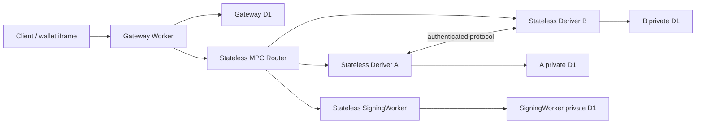

# Refactor 94C: Remove Durable Object Latency From Signing

Date created: July 28, 2026

Status: active

## Objective

Restore registration to a typical 1.5–2 second post-authentication path, with
3 seconds as the hard product ceiling.

The final Cloudflare topology has:

- a stateless MPC Router;
- stateless Deriver A and Deriver B Workers;
- a stateless SigningWorker;
- separate role-private D1 databases;
- zero Durable Object calls during registration and ordinary signing;
- one ephemeral SigningWorker presign-session Durable Object outside both
  blocking paths;
- three blocking registration routes;
- no legacy selector, fallback, dual-read, or compatibility path.

Refactor 94C retains the completed Refactor 93 and 94A work: Worker custody
separation, Service Bindings, pair binding, signed readiness, one-use role
execution, exact terminal redelivery, lazy NEAR provisioning, and the browser
ECDSA proof-verification boundary.

## Confirmed Cause

The cold regression is stateful orchestration around fast cryptography:

| Boundary | Representative cold time | Representative warm time |
| --- | ---: | ---: |
| Router authorization and admission | about 2,360 ms | about 60 ms |
| SigningWorker output DO | about 1,406 ms | about 38 ms |
| Gateway session and budget DOs | about 1,336 ms | about 22 ms |
| Deriver work | 22–49 ms | similar |
| Worker startup | 3–11 ms | similar |

Service Bindings remain. The Durable Object authorities and redundant public
and D1 round trips are removed.

## Design Rules

### Persist Only Real Effects

Durable state exists only for:

- activation and custody commitment;
- consume-once role/Yao execution;
- exact budget or presign consumption;
- an explicit on-chain operation outside registration;
- terminal bytes that must be redelivered exactly.

Deterministic and idempotent work recovers through re-execution and database
constraints. State written solely for the next route to read is replaced with
a signed client-carried payload.

Delete:

- stored managed grants;
- separate wallet reservations and their cleanup job;
- quota `COUNT` queries;
- abuse-check DO calls;
- duplicate start pre-reads and side-effect journals;
- the outer finalize journal and separate replay-cache write;
- Gateway respond replay state after role retry is verified;
- serialized post-registration React refreshes.

### One Authority Per Effect

- Gateway D1 owns canonical product ceremonies and irreversible product
  activation results.
- Deriver A owns its root share as a role-only Worker Secret and uses A private
  D1 for encrypted one-use state.
- Deriver B owns its root share as a role-only Worker Secret and uses B private
  D1 for encrypted one-use state.
- SigningWorker private D1 owns activated material, exact delivery results,
  sessions, budgets, and presign consumption.
- Router owns no mutable storage.

An operation row's terminal update is its replay record. No second journal or
cache records the same effect.

### Signed Setup And Policy

The Gateway signs the setup payload carried opaquely by the client. It binds
the immutable ceremony specification: environment, wallet candidate,
authentication challenge, signer plan, issue time, expiry, and key version.

For each concrete Router call, Gateway mints an internal Router JWT containing
`RouterRequestPolicyClaimsV1`. Those claims bind that operation's canonical
request fingerprint, work kind, and policy version. Respond and activate use
their own fingerprints because their complete request bodies do not exist at
setup time. The policy claims never cross the public client contract.

Workers verify these payloads locally against deployment-pinned keys.
Registration performs no JWKS, policy, or authorization-state fetch.

The frozen internal contract uses these exact rules:

- request fingerprints are `PublicDigest32` values over the existing canonical
  typed domain encoding, never raw JSON serialization;
- signed setup is a compact Ed25519 JWS that the client carries opaquely;
- request policy is an internal Gateway-to-Router JWT claim verified locally;
- activate returns exact terminal response bytes and exposes no Router
  readiness receipt;
- Gateway is the only wallet-session JWT minting authority; Router and role
  Workers only verify with deployment-pinned key material.

Abuse control uses Cloudflare rate limiting. An exact product quota, where the
configured policy requires one, uses one conditional counter update.

### Role-Private D1 Custody

Root shares remain role-only Worker Secrets. The root-share Durable Objects
stored startup metadata rather than root-share bytes, so their replacement is
local metadata derived from the role Secret and deployment-pinned epochs. Root
shares do not move into D1.

Private D1 stores mutable role lifecycle and SigningWorker custody records.
This intentionally changes the operator threat surface: a Cloudflare
account-scoped API token may query D1 ciphertext through `wrangler d1 execute`
or the D1 API. Application encryption makes database access alone insufficient
to recover protected material.

- A, B, and SigningWorker use separate versioned KEKs available only to the
  owning Worker.
- D1, migration, observability, and general CI credentials contain no KEK.
- AEAD associated data binds role, environment, deriver set or SigningWorker
  identity, root epoch where applicable, record purpose, and schema version.
- No Worker, deployment principal, or release job receives both A and B role
  databases or both role KEKs.
- Plaintext root shares exist only in the owning role's request memory.

The three private schemas are intentionally small:

| Database | Public lookup columns | Encrypted record |
| --- | --- | --- |
| Deriver A D1 | session/pair digest, lifecycle, revision, expiry | A input, execution state, completed output |
| Deriver B D1 | session/pair digest, lifecycle, revision, expiry | B input, execution state, completed output |
| SigningWorker D1 | operation/material identity, request digest, lifecycle, revision, expiry | activated material, session/budget/presign state, protected terminal payload |

A and B use the same logical lifecycle schema in different databases. SQL
transactions use `INSERT ON CONFLICT` for first ownership and versioned
compare-and-swap updates for transitions. Public columns support conflict and
expiry checks only; protected JSON crosses the D1 boundary as ciphertext.

### NEAR Registration Is Local Key Provisioning

Registration creates an Ed25519 keypair and derives the NEAR implicit account
identifier from the public key. It creates no named account on chain.

Registration therefore uses no NEAR RPC, relayer, nonce, block hash, gas,
signed transaction, broadcast, `txStatus`, or on-chain backup journal.
Deferred NEAR provisioning persists only encrypted signer material, the
implicit account projection, and the local provisioning result.

## Target Topology

All Worker-to-Worker calls use Service Bindings. The D1 databases use an
explicit documented locality compatible with the production Gateway stores.

## Three-Route Registration

### 1. Setup

One Gateway request:

- authenticates the application;
- applies rate limiting and any conditional exact quota;
- chooses the generated wallet name;
- inserts the canonical ceremony with its wallet UNIQUE constraint;
- returns the signed setup payload;
- starts safe ECDSA preparation during the user prompt when the signer plan
  includes ECDSA.

Preparation creates no custody commitment, consumes no factor, and enters no
irreversible state.

Yao admission requires the verified authority scope. Setup therefore carries
no Ed25519/Yao work for either authentication method. This keeps passkey and
Email OTP on one wire contract and preserves deferred NEAR provisioning.

### 2. Authenticated Respond

One Gateway request:

- verifies the passkey or Email OTP proof;
- verifies the setup signature locally and mints request-bound Router policy
  claims after the authenticated respond body is complete;
- returns the exact A/B proof bundles for browser verification when the signer
  plan includes ECDSA.

When the signer plan includes NEAR, including an Ed25519-only plan, respond
also derives the authority-bound Yao admission and returns the deferred
provisioning work. The client starts that work after proof verification without
awaiting it for wallet readiness.

Role-private state owns exact retry and partial-role convergence. Remove the
Gateway claim/terminal pair after one focused test proves that an identical
retry following a lost or partial response returns the exact role results and
a conflicting fingerprint fails before execution.

### 3. Activate And Finalize

After browser proof verification for ECDSA plans, or directly after authenticated
respond for an Ed25519-only plan, one Gateway request:

- claims the irreversible activation;
- invokes Router and SigningWorker;
- commits activated material, session, budget, wallet, signer,
  authentication, and credential records;
- stores the exact terminal response in the operation row;
- returns the wallet-ready result.

An Ed25519-only result is wallet-ready with durable `near_pending` state and no
ECDSA signer. Its deferred Yao completion installs the sole NEAR signer and
transitions the wallet to `near_ready`; registration does not await that work.

The standalone finalize route and its journals are deleted. Authentication
enrollment and recovery-critical records remain blocking. Notifications,
analytics, and redundant refreshes may run asynchronously.

## Client Tail

- Initialize ECDSA client WASM during the authentication prompt.
- Hydrate React account state from activate-and-finalize.
- Refresh login and account data concurrently in the background.
- Represent passkey-session sealing as a typed pending state. Immediate signing
  awaits or resumes it.
- Keep lazy NEAR provisioning outside the blocking ECDSA path.

## Durable Object Deletion Map

| Current binding | Replacement |
| --- | --- |
| `ROUTER_REPLAY_DO` | Owning Gateway or role terminal row |
| `ROUTER_LIFECYCLE_DO` | Owning Gateway or role lifecycle row |
| `ROUTER_PROJECT_POLICY_DO` | Signed request-carried policy |
| `ROUTER_QUOTA_DO` | Conditional owner counter when exact quota is required |
| `ROUTER_ABUSE_DO` | Cloudflare rate limiting |
| `ROUTER_WALLET_BUDGET_DO` | SigningWorker private D1 |
| `DERIVER_A_ROOT_SHARE_DO` | Local startup metadata derived from A's role-only Worker Secret |
| `DERIVER_A_YAO_SESSION_DO` | A private D1 lifecycle row |
| `DERIVER_B_ROOT_SHARE_DO` | Local startup metadata derived from B's role-only Worker Secret |
| `DERIVER_B_YAO_SESSION_DO` | B private D1 lifecycle row |
| `SIGNING_WORKER_SERVER_OUTPUT_DO` | SigningWorker private D1 |
| `SIGNING_WORKER_ED25519_YAO_DO` | SigningWorker private D1 |

`SIGNING_WORKER_PRESIGN_SESSION_DO` is the sole exception. It coordinates one
in-memory background ECDSA presign rendezvous and owns no durable custody,
budget, activation, delivery, or replay record.

## Concurrent Implementation Split

Use two dedicated branches and keep file ownership exclusive until the
integration gate:

- **Codex / topology lane:** `codex/refactor-94c-regression-fixes`
- **Claude / product lane:** `claude/refactor-94c-product-path`

Create both branches from the commit containing this split. Codex owns
`crates/router-ab-*`, `packages/sdk-server-ts/migrations`, role and
SigningWorker database migrations, Worker bindings/configuration, generated
Rust-to-TypeScript protocol bindings, Rust tests, custody documentation, and
Durable Object deletion. Claude owns `packages/sdk-server-ts/src`,
`packages/sdk-web`, `apps/seams-site`, and the TypeScript tests for those
product paths. Only Codex edits this checklist. Claude reports completed commit
hashes for Codex to mark.

### Wave 0: Parallel Inventory And Contract Preparation

#### Codex: Internal Topology Contract

- [x] Map the 12 DO bindings and stored records to Gateway D1, Deriver A D1,
      Deriver B D1, SigningWorker D1, or deletion.
- [x] Define the minimal internal policy, role-lifecycle, activation, and
      terminal-result contracts. Generate the TypeScript bindings once.
- [x] Specify the three role-private D1 schemas, separate KEKs, encrypted
      mutable records, and role-only root-share Secret retention.
- [x] Update the threat/deployment docs for the D1 custody surface.

#### Claude: Product Contract And Deletion Inventory

- [x] Map the current grant, intent, start, respond, activate, finalize, replay,
      reservation, and refresh paths in the TypeScript product flow.
- [x] Define the public setup, authenticated-respond, and
      activate-and-finalize request/result unions using the existing auth
      branches.
- [x] List the TypeScript records, routes, fixtures, and tests deleted by the
      three-route flow.

#### Contract Checkpoint

- [x] Agree on field names, fingerprints, idempotency keys, signed-policy
      claims, and terminal response bytes. Codex commits the canonical internal
      bindings; Claude rebases before implementation.

No implementation on either lane may redefine the other lane's contract.

### Wave 1: Parallel Implementation

#### Codex: Zero-DO Custody Topology

- [x] Make Router authorization local with the signed request-carried policy
      and pinned verification key. Remove registration-time network/JWKS reads.
- [x] Make Router stateless and delete its six DO bindings and adapters.
- [x] Implement Deriver A and B private-D1 lifecycle, encrypted mutable state,
      role-only root-share Secrets,
      deterministic retry, and exact completed-output replay.
- [x] Implement SigningWorker private-D1 activation, delivery, session, budget,
      and presign transactions.
- [x] Apply the authorized testnet custody reset, invalidate former namespaces,
      and delete the SigningWorker and Deriver DO implementations.

#### Claude: Three-Route Product Flow

- [x] Add the compile-checked three-route wire contract, typed deferred
      ceremony authority, `/wallets/register/setup` route and service, one-row
      setup persistence, signed setup payload, focused setup tests, and the SDK
      setup RPC client.
- [x] Finish the canonical setup contract: only ECDSA may be prepared before
      proof, when the signer plan includes it, with direct publishable-key
      admission and no stored bootstrap grant or compatibility fallback.
- [x] Implement authenticated respond against the frozen internal interfaces,
      including proof verification, the `awaiting_proof` to `verified`
      transition, request-bound Router policy, ECDSA respond, and deferred
      authority-bound Yao work.
- [x] Implement activate-and-finalize against the frozen internal interfaces,
      with one irreversible activation claim and exact terminal replay.
- [x] Implement asynchronous `/near-provisioning` completion on one operation
      row with exact replay, with no legacy finalize journal or replay-cache
      pair beneath it.
- [x] Wire the SDK ECDSA and mixed registration paths to setup, authenticated
      respond, browser proof verification, activate-and-finalize, and
      non-blocking deferred Yao provisioning.
- [x] Delete the dead `backend_proxy`/`bootstrapUrl` registration configuration
      and the client standalone-finalize path retired by the three-route flow.
- [x] Migrate Ed25519-only registration onto setup, authenticated respond, and
      activate-and-finalize. Return the wallet with durable pending NEAR state
      and finish its sole signer asynchronously through deferred Yao, just as
      mixed registration provisions NEAR asynchronously.
- [x] Implement the Email OTP enrollment commit for Ed25519-only pending-wallet
      activation. The valid Email OTP plus Ed25519-only branch must never return
      `not_implemented`.
- [x] Make setup, authenticated respond, and activate-and-finalize the only
      blocking registration routes.
- [x] Delete stored grants, wallet reservations and cleanup, quota counts,
      start/finalize journals, duplicate replay writes, and successful-path
      readbacks.
- [x] Keep Gateway state only at irreversible activation and terminal replay;
      remove Gateway respond bookkeeping after its deterministic retry test.
- [x] Add ECDSA WASM prompt-time prewarm.
- [x] Hydrate React state from the registration response and move redundant
      refreshes into the background.
- [x] Represent passkey warm-session sealing as a typed pending state and make
      sealed-record restore await it.
- [x] Move NEAR/Yao provisioning outside the blocking ECDSA registration path,
      with durable pending/provisioning/ready/retryable-failure lifecycle state
      and focused lifecycle/replay coverage.
- [x] Audit recovery, export, add-signer, and ordinary signing against the new
      interfaces. Recovery, export, and ordinary signing have no dependency on
      the registration records being deleted.
- [x] Move add-signer's server intent admission from the stored managed grant
      to direct publishable-key authentication while preserving its existing
      ceremony and journals.
- [x] Switch the add-signer client to direct publishable-key admission, then
      delete the grant client and server broker once no flow uses them.
- [x] Fold add-signer's activation preparation and query into its activate
      route, as registration's were folded. The client computes the activation
      request digest locally over the canonical `wallet_add_signer_activate_v2`
      command (`{operation, addSignerCeremonyId, activationCorrelationId,
      publicFacts}`, alphabetized, sha256); the server recomputes it from the
      same coordinates and refuses a digest that is not the canonical one.
      Refactor 90's four properties survive the route shape change: activate
      records those coordinates as a claim *before* any Router work (prepared
      coordinates), replays the committed receipt byte for byte to any later
      call carrying them (exact replay, and the only way completion is now
      queried), and keeps the claim when the Router commits but the ceremony
      write does not, so a retry finishes rather than strands the wallet (crash
      reconciliation).

The lanes may use temporary compile-time interface stubs that exactly match the
checkpoint. Delete those stubs during integration.

### Testnet Custody Reset

There are no users or production-value wallets on the pre-94C topology. The
product owner explicitly authorized invalidating those testnet wallets rather
than shipping a legacy custody reader or one-shot migration path.

The final `deleted_classes` migrations invalidate the former SigningWorker and
Deriver namespaces. New wallets are created only in private D1. No migration
command, dual read, legacy binding, or compatibility route ships.

### Wave 2: Integration

- [x] Merge the Codex contract, storage, and Worker commits into the 94C
      integration branch first; merge Claude's product commits second.
- [x] Resolve generated-binding and call-site conflicts without retaining the
      old topology or adding compatibility branches.
- [x] Prove registration and ordinary signing contain zero DO calls and
      registration contains exactly three blocking server routes.
- [x] Run the focused operating-path validation below and fix only observed failures in the
      new operating path.

No mixed-topology revision is deployed.

### Wave 3: Cutover And Delete

- [x] Run one optimized local Email OTP and one passkey registration.
- [ ] Deploy one coherent staging revision and manually exercise registration,
      unlock/sign, recovery, and export.
      Deferred by the owner on July 30, 2026. The owner confirmed registration,
      unlock/sign, recovery, and export apart from NEAR delegate sponsorship;
      the final coherent-revision acceptance pass remains manual.
- [x] Confirm the existing timing summary reports zero DO intervals and a
      wallet-ready result within 3 seconds.
- [x] Deploy the same implementation to production. The owner explicitly
      authorized production rollout while deferring the final manual staging
      acceptance pass.
- [x] Delete migration commands, retired bindings/configuration, and fixtures
      whose only purpose was the removed topology.

Deployment record (July 30, 2026):

- staging Gateway: `https://staging.api.seams.sh`, Worker version
  `6fab660a-200d-4b8d-83c1-03068995af19`;
- production Gateway: `https://api.seams.sh`, Worker version
  `92e2f6f2-d23f-491e-91ee-0f274679b3c1`;
- production Router: version `947ff8de-013d-4547-a8e9-367dc48bf418`, with
  zero Durable Object bindings;
- production Deriver A/B: versions
  `957e412c-14b4-46fb-beb3-55ce2570436c` and
  `77a55e22-5b6f-4033-bfa6-f01a8b5d3872`, each with zero Durable Object
  bindings and a separate role-private D1 database;
- production SigningWorker: version
  `9024c0f0-bc2c-4484-9785-9167138684ba`, with private D1 and only the
  ephemeral presign-session Durable Object binding;
- production frontend workflow: GitHub Actions run `30516830211`;
- production `/readyz`, `/healthz`, Router ceremony JWKS, `seams.sh`, and
  `sign.seams.sh` returned HTTP 200 after applying signer D1 migration
  `0017_signer_router_ab_normal_signing_admission.sql`;
- the final legacy Gateway Durable Object was deleted with a one-time
  deployment-boundary migration. The checked-in end state retains no retired
  Gateway Durable Object binding or migration scaffold.
- the three production role-private databases were created in APAC, migrated,
  and encrypted with role-specific KEKs. The recovery copy is stored outside
  the repository at
  `~/.seams/backups/refactor94c-production-role-private-d1-20260730.json`.

Exit: local, staging, and production use the same zero-DO implementation.

## Minimum Validation

No new test framework, trace cohort, mutation suite, or source-text guard is
required.

Required evidence:

- [x] One focused real-D1 test for concurrent activation and exact
      lost-response replay. The real workerd/D1 run exposed and verified the
      fix for commit-time drift during concurrent activation.
- [x] One focused role test for identical retry, partial completion, and
      conflicting fingerprint.
- [x] One custody test showing wrong-role or wrong-KEK ciphertext fails closed.
- [x] Existing focused registration, recovery, export, add-signer, and signing tests
      affected by the changed adapters.
- [ ] `pnpm check`, `cargo test -p router-ab-cloudflare`, and
      `git diff --check` before staging.
      `cargo test -p router-ab-cloudflare`, SDK typecheck, Rust formatting,
      Rust lint, signing-architecture checks, and `git diff --check` passed on
      July 30. The aggregate command remains unchecked: the clean-worktree app
      typecheck exposed pre-existing seams-site fixture/API drift, and the
      signer-parity browser runner could not bind localhost port 3600 in the
      sandbox. Neither failure is in the changed deployment path.
- [ ] One manual Email OTP and one passkey registration in local, staging, and
      production. Final manual staging acceptance is explicitly deferred.

Integration evidence at `4d8d8741a`:

- the SDK calls only setup, respond, activate, and asynchronous
  near-provisioning; the blocking ceremony test observes setup, respond, and
  activate exactly once and observes no standalone finalize;
- Gateway registration and normal-signing adapters contain no Durable Object
  access; Router and both Derivers have no Durable Object binding; the
  SigningWorker retains only its non-blocking ephemeral presign-session binding;
- Router is stateless, both Derivers use separate private D1 bindings, and the
  SigningWorker uses its private D1 binding for activation, delivery, sessions,
  budgets, and presign persistence;
- 111 focused registration, recovery, export, add-signer, and ordinary-signing
  tests passed, followed by 30 focused three-route and timing tests;
- both `sdk-server-ts` and `sdk-web` typechecks pass and `git diff --check` is
  clean. The repository-wide check remains open because the unrelated
  `apps/web-server` branch has its existing 19-error typecheck baseline.

Classify existing failing tests under `AGENTS.md`. Delete fixtures that encode
the retired DO topology.

### Staging Email OTP Latency Evidence — 2026-07-29

Two mixed-signer Email OTP registrations were measured on the coherent staging
deployment at `441c847ea7569e9c546e775d549fee878ef9ec0d`. Both completed the
blocking wallet-ready path below the 3-second product ceiling.

| Run | Total | Setup | ECDSA respond | ECDSA activate | Local persistence | Trace coverage |
| --- | ---: | ---: | ---: | ---: | ---: | ---: |
| Cold | 2,565 ms | 263 ms | 523 ms | 1,722 ms | 20 ms | 99.84% |
| Warm | 1,189 ms | 241 ms | 339 ms | 556 ms | 25 ms | 99.83% |

The cold run met the hard ceiling with 435 ms of headroom. The warm run was
below 1.2 seconds. Ed25519/Yao provisioning was deferred from the blocking
registration path in both runs (`emailOtpYaoWorkerRegistrationMs = 0` and
`emailOtpYaoTotalMs = 0`), confirming that wallet readiness no longer waits for
NEAR signer provisioning.

This evidence accepts staging Email OTP registration latency only. The cold log
also recorded an asynchronous `/wallets/register/near-provisioning` HTTP 400
after wallet readiness; deferred NEAR readiness remains part of the open
staging lifecycle validation above.

### Staging Passkey Latency Evidence — 2026-07-29

Two passkey registrations on the same staging revision established the
passkey regression baseline:

| Run | Observed wallet-ready time |
| --- | ---: |
| Cold | approximately 2–3 seconds |
| Warm | under 1 second |

These are manually observed bounds because the supplied console excerpt did
not include the serialized timing-summary total. They are sufficient to guard
the product-level regression: a future cold passkey registration above 3
seconds or a warm registration above 1 second requires investigation.

Canonical staging regression reference:

- Email OTP: 2,565 ms cold; 1,189 ms warm.
- Passkey: approximately 2–3 seconds cold; under 1 second warm.
- Both methods return the ECDSA-ready wallet before asynchronous NEAR
  provisioning completes.

## Performance Acceptance

- setup: at or below 400 ms;
- authenticated respond: at or below 350 ms after preparation is ready;
- browser proof verification: at or below 100 ms;
- activate-and-finalize: at or below 500 ms;
- typical wallet-ready registration: approximately 1.5–2 seconds;
- hard wallet-ready ceiling: 3 seconds;
- cold path within 500 ms of warm after excluding the user prompt;
- zero registration DO calls;
- zero Router mutable-persistence calls;
- zero network calls for token or policy verification;
- no standalone grant, intent, start, or finalize route.

## Completion Criteria

Refactor 94C is complete when:

1. Router, Deriver A, Deriver B, and SigningWorker are stateless.
2. Router and Deriver production Wrangler configurations contain zero DO
   bindings; SigningWorker contains only its ephemeral presign-session binding.
3. Role-private encrypted D1 storage preserves A/B custody.
4. Registration uses setup, authenticated respond, and activate-and-finalize.
5. Registration and ordinary signing make zero DO calls.
6. Exact activation replay, role one-use behavior, recovery staging, export
   isolation, and budget consumption remain correct.
7. Registration performs no NEAR on-chain account creation.
8. No compatibility or retired persistence path remains.
9. Staging and production registration meet the 3-second hard ceiling.

## Out Of Scope

- prewarming Durable Objects scheduled for deletion;
- a new coordinator or ledger;
- new telemetry infrastructure or production trace cohorts;
- reusable cryptographic preprocessing;
- changing ECDSA or Yao cryptography;
- named NEAR account creation during registration;
- Smart Placement experiments before the zero-DO topology is live.

## Relationship To Other Refactors

- [`refactor-93.md`](./refactor-93.md) records the Router and pair-bound work
  retained here.
- [`refactor-94A-performance-regression.md`](./refactor-94A-performance-regression.md)
  records completed registration-path simplification and local results.
- [`refactor-94B-cold-ecdsa-registration.md`](./refactor-94B-cold-ecdsa-registration.md)
  records the completed cold-boundary diagnosis and timing apparatus.
- Refactor 90 remains authoritative for modular authorization capabilities.
