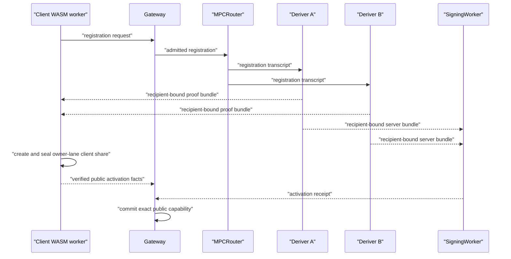
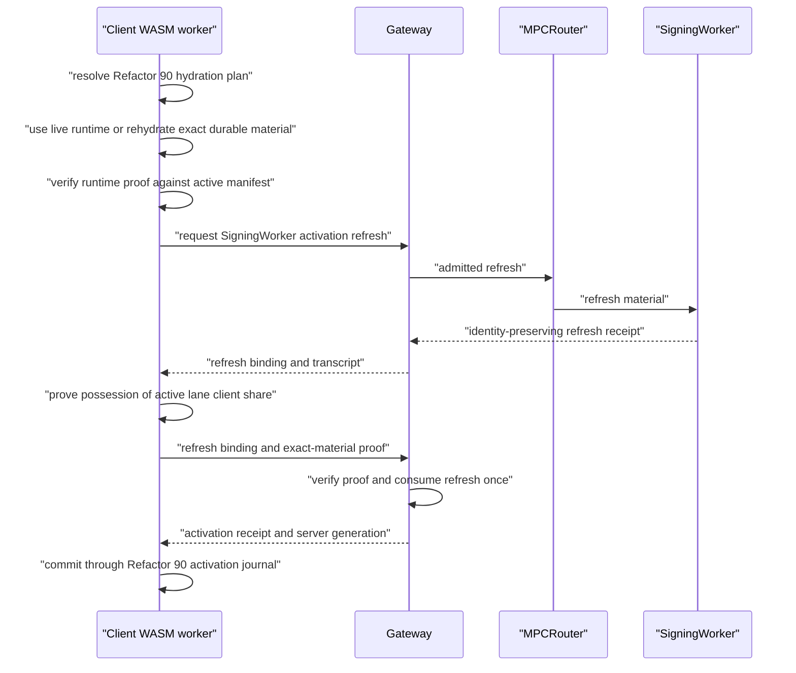

# Eliminate Threshold-PRF Client-Share Rederivation

Date created: July 18, 2026

Status: active; Phase 0 regression and the shared public verifier are complete.
Rust/WASM proof generation and activation integration remain pending.

## Dependencies

- [Refactor 90](./refactor-90-modular-auth-capabilities-plan.md) Pre-Phases
  4/19A and 4/19B own canonical MPC hydration,
  `ActiveEcdsaCapabilityManifest`, `DurableEcdsaMaterialBinding`,
  `ActiveEcdsaMaterialSession`, `EcdsaRuntimeObservation`, and the
  `EcdsaCapabilityActivationCommitJournal`. They must land before this patch
  cuts over SDK hydration or persistence.
- [Refactor 95](./refactor-95-passkey-account-refactor.md) owns wrapped
  role-local custody and exact-material recovery.
- [Refactor 97](./refactor-97-share-rotation.md) owns ECDSA additive lane
  resharing and activation.
- [Refactor 98](./refactor-98-delegated-agent-linked-device-behavior.md) owns
  linked-device product behavior and admission.

Device linking currently fails closed. This patch may land in development with
`device_link_required`; cross-device release remains gated on Refactors 97 and
98.

## Decision

Threshold-PRF derivation creates the initial owner-lane ECDSA client share only
during registration. Post-registration material activation uses the exact live,
rehydrated, or custody-restored role-local material selected by Refactor 90's
canonical hydration result.

Delete the strict ECDSA derivation recovery protocol that asks Deriver A/B to
derive the client share again. Exact wrapped owner custody is resolved before
the system concludes that a device requires linking. Refactors 97 and 98 own
provisioning an independently revocable ECDSA lane when no authorized exact
custody source exists for that device.

Keep the threshold-PRF context bound to the full ceremony transcript, output
purpose, recipient role, and recipient identity. Those bindings provide
freshness, recipient isolation, and cross-protocol domain separation.

## Problem

The current recovery flow assumes a fresh ceremony can reproduce the client
share created during registration. The protocol makes that impossible by
design:

1. `plan_mpc_prf_purpose_binding_for_output_v1` computes the fresh ceremony
   transcript digest.
2. `encode_mpc_prf_context_bytes_v1` includes that digest and the ephemeral
   recipient identity in the threshold-PRF context.
3. A recovery ceremony therefore produces a different threshold-PRF output.
4. `finalize_recovery_client_bootstrap` converts that new output into a new
   client scalar and public share.
5. Session activation correctly rejects the new public share because it does
   not equal the registered public capability.

Relevant implementation points:

- `crates/router-ab-core/src/derivation/ecdsa_threshold_prf.rs`
  - `plan_mpc_prf_purpose_binding_for_output_v1`
  - `encode_mpc_prf_context_bytes_v1`
- `wasm/router_ab_ecdsa_derivation_client/src/ceremony.rs`
  - `finalize_registration_client_bootstrap`
  - `finalize_recovery_client_bootstrap`
- `packages/shared-ts/src/utils/routerAbEcdsaDerivation.ts`
  - `parseRouterAbEcdsaPostRegistrationSessionActivationRequestV1`
- `packages/sdk-web/src/core/signingEngine/threshold/ecdsa/postRegistrationSessionActivation.ts`
  - `activateStrictEcdsaPostRegistrationSession`

The public capability comparison is an essential identity-continuity check.
Weakening it would allow a session to activate material for a different client
share, threshold key, or EVM address.

## Rejected Corrections

### Remove Fresh Fields From The Threshold-PRF Context

This would make repeated output possible by weakening the derivation domain.
It would also erase the cryptographic distinction between ceremonies or
recipients that request the same output purpose. Transcript freshness and
recipient isolation remain required.

### Accept The Newly Derived Client Share

The resulting public share would produce a different threshold identity unless
the server share were changed through an explicit key-preserving resharing
protocol. Quietly accepting the value would violate registered key and address
continuity.

### Copy The Owner-Lane Share To A New Device

Two devices holding the same owner-lane material cannot be independently
revoked or attributed. Linked-device provisioning creates a separate lane with
separate holder material.

## Terminology

This plan removes one narrowly defined capability:

```text
strict ECDSA derivation recovery
  = call Deriver A/B after registration to derive a replacement owner-lane
    client share from the same derivation root
```

The following capabilities remain separate:

- Refactor 90 hydration of an exact active capability manifest and durable
  material binding;
- Refactor 95 authorization and restoration of exact wrapped owner custody;
- explicit ECDSA key export;
- Email OTP or recovery-code custody recovery that restores the exact wrapped
  role-local material;
- Ed25519 Yao recovery;
- ECDSA signature recovery identifiers;
- linked-device lane provisioning through Refactors 97 and 98.

No generic symbol or route may use `recovery` as justification for retaining
the strict ECDSA derivation recovery protocol.

## Required Invariants

1. Threshold-PRF derivation creates the initial owner-lane ECDSA client share
   only during registration.
2. The client-share public key, threshold public key, EVM address, participant
   set, signing-root scope, material owner, lane, and lane epoch remain exact
   for one active capability manifest revision.
3. Session activation requires possession of the exact role-local client
   material bound to the active manifest and lane epoch.
4. Activation refresh may rotate SigningWorker material and activation epoch
   only when the resulting public identity exactly equals the registered
   public identity.
5. Exact custody recovery restores the same owner-lane share. It does not
   derive a replacement through Deriver A/B.
6. A new device receives a distinct linked-device lane and independently
   revocable holder material.
7. Explicit export remains a separately authorized, audited operation.
8. Transcript and recipient substitutions continue to change threshold-PRF
   outputs and invalidate proofs.
9. Secret client material remains inside the ECDSA Rust/WASM worker. JavaScript
   receives opaque handles, public facts, and typed results.
10. Recovery compatibility code is not retained. Pending recovery ceremonies
    and records are development-only obsolete state.
11. Refactor 97 additive lane resharing may replace holder and server shares at
    the next lane epoch while preserving the wallet key and EVM address.
12. `SigningWorkerActivationRefresh` preserves the client share.
    `EcdsaLaneShareRefresh` replaces lane material through the explicit
    Refactor 97 protocol.

## Target Flow

### Registration



### Existing-Device Session Activation



### Missing Local Material

```text
use_live_runtime
  -> activate from validated worker runtime

rehydrate_active_session
  -> open exact durable active material
  -> activate from rehydrated runtime

reauthorize_public_anchor + exact wrapped owner custody
  -> authorize Refactor 95 custody restore
  -> commit exact restored material through Refactor 90
  -> activate from restored runtime

blocked missing material + no exact custody source for this device
  -> device_link_required

blocked corrupt, conflicting, revoked, replaced, or mismatched state
  -> integrity or lifecycle failure
  -> no fallback

all non-ready branches
  -> no threshold-PRF recovery ceremony
```

## Domain Contracts

### Local Material Resolution

Consume Refactor 90's `MpcCapabilityHydrationResolution` directly. This patch
does not define another local-material union or persistence priority.

Branch behavior:

| Hydration branch | This patch's action |
| --- | --- |
| `use_live_runtime` | Validate the runtime proof and continue to exact-material activation. |
| `rehydrate_active_session` | Open the exact `DurableEcdsaMaterialBinding`, publish a validated runtime observation, then continue. |
| `reauthorize_public_anchor` | Resolve Refactor 95 exact custody. Restore the same share through `commitEcdsaCapabilityActivation(...)` when authorized. |
| `blocked` with no exact custody source | Return `device_link_required` only after exact custody resolution. |
| `blocked` for revoked, replaced, conflict, corruption, mismatch, or unavailable persistence | Return the exact fail-closed state. |

The activation coordinator accepts only a `use_live_runtime` plan carrying an
`ActiveEcdsaCapabilityManifest` reference and exact runtime validation proof.

### Existing-Material Activation Request

Replace the recovery-plus-refresh activation request with one exact contract:

```ts
type RouterAbEcdsaExistingMaterialSessionActivationRequestV1 = {
  kind: 'router_ab_ecdsa_existing_material_session_activation_v1';
  registeredSigner: RegisteredEvmFamilySigner;
  activeCapability: ActiveEcdsaCapabilityRef;
  materialOwner: MpcMaterialOwnerRef;
  laneId: EcdsaLaneId;
  laneEpoch: EcdsaLaneEpoch;
  thresholdMaterialSessionId: ThresholdEcdsaSessionId;
  expectedServerGeneration: EcdsaServerGeneration;
  refreshBinding: RouterAbEcdsaPostRegistrationProofBindingV1;
  refreshTranscriptDigestB64u: PublicDigest32B64u;
  runtimePolicyBindingDigestB64u: PublicDigest32B64u;
  serverNonceB64u: PublicDigest32B64u;
  expiresAtMs: number;
  idempotencyCorrelation: CorrelationId;
  clientMaterialProof: RouterAbEcdsaClientMaterialPossessionProofV1;
};
```

Every field is required. Remove `recovery_binding` and
`verified_client_facts`; the canonical registered signer, active manifest
reference, material session, refresh receipt, and possession proof supply the
required identity evidence. Operation grants, signing quotas, transaction
nonces, and bearer credentials are forbidden. They enter later through
`selectExactEcdsaOperationLane(...)`.

### Client-Material Possession Proof

Use BIP340 Schnorr over secp256k1 through `k256` 0.13. The proof wire contract
is:

```text
scheme: "secp256k1_bip340_sha256_v1"
signature: 64 canonical BIP340 bytes
JSON encoding: unpadded base64url
signed message: 32-byte SHA-256 canonical challenge digest
```

Canonical challenge fields use a four-byte big-endian length prefix followed by
the exact field bytes. Numeric values use fixed-width big-endian bytes inside
the same length-prefixed framing. The challenge starts with:

```text
router-ab-ecdsa/client-material-possession/challenge/v1
secp256k1_bip340_sha256_v1
```

The frozen Phase 0 challenge vector has digest:

```text
37a338b6d113d0b80c3d81ed5e5c67c82702a06f913ec2acc9e2e75a8636246c
```

The active lane's compressed SEC1 client public key remains part of the
challenge.
BIP340 verification uses its x-coordinate after validating the complete
compressed point. The parity byte therefore stays committed by the signed
challenge even though BIP340 verification uses an x-only key.

The Rust signer implementation must:

- prove knowledge of the scalar corresponding to
  `derivation_client_share_public_key33_b64u`;
- use a fresh nonce generated inside the Rust/WASM worker;
- use a fixed protocol and ciphersuite label;
- use canonical scalar and point encodings;
- reject infinity, non-curve points, and non-canonical BIP340 signatures;
- keep the client scalar and proof nonce inside Rust/WASM;
- include independent verifier test vectors;
- receive constant-time review for secret-dependent operations.

The challenge digest must bind:

```text
protocol version
registered signer digest
registered public-capability digest
authority-reference digest
material-owner reference
lane ID and lane epoch
active lane client-share public key
threshold material-session ID
expected server generation
refresh lifecycle ID
refresh request ID
refresh transcript digest
previous and next activation epochs
runtime policy binding digest
server-generated one-use nonce
expiry
idempotency correlation
```

The Gateway derives the challenge independently from parsed domain values.
The client cannot provide an arbitrary challenge digest for the verifier to
trust.

## Lifecycle Contract

Use one server-side refresh and activation-attempt lifecycle. Refactor 90's
`EcdsaCapabilityActivationCommitJournal` remains the complete cross-boundary
browser commit lifecycle.

```ts
type EcdsaExistingMaterialActivationAttemptState =
  | {
      state: 'refresh_pending';
      refreshBinding: RouterAbEcdsaPostRegistrationProofBindingV1;
      expiresAtMs: number;
    }
  | {
      state: 'refresh_ready';
      refreshBinding: RouterAbEcdsaPostRegistrationProofBindingV1;
      refreshTranscriptDigestB64u: string;
      nextActivationEpoch: string;
      expiresAtMs: number;
    }
  | {
      state: 'activating';
      refreshBinding: RouterAbEcdsaPostRegistrationProofBindingV1;
      activationOperationId: string;
      claimedAtMs: number;
    }
  | {
      state: 'server_activation_committed';
      refreshBinding: RouterAbEcdsaPostRegistrationProofBindingV1;
      activationOperationId: string;
      thresholdMaterialSessionId: ThresholdEcdsaSessionId;
      serverGeneration: EcdsaServerGeneration;
      activationReceipt: EcdsaServerActivationReceipt;
      committedAtMs: number;
    }
  | {
      state: 'terminal';
      refreshBinding: RouterAbEcdsaPostRegistrationProofBindingV1;
      reason: 'expired' | 'cancelled' | 'invalid_proof' | 'identity_mismatch';
      terminalAtMs: number;
    };
```

Requirements:

- reserve one refresh binding before expensive work;
- verify the registered capability, route authorization, refresh receipt, and
  possession proof before provisioning signing state;
- claim the exact refresh attempt atomically;
- use one idempotent activation operation ID across external provisioning;
- persist the successful server receipt and generation so a transport retry
  returns the same result;
- burn invalid, expired, or identity-mismatched attempts terminally;
- allow a new refresh ceremony after a terminal attempt;
- reject concurrent activation attempts for the same refresh binding.

After server commitment, the SDK passes the exact receipt, generation,
idempotency correlation, active material, and expected manifest revision to
`commitEcdsaCapabilityActivation(...)`. That journal performs:

1. server receipt persistence;
2. atomic encrypted-material plus active-manifest commit;
3. authenticated readback;
4. runtime publication;
5. reload reconciliation by exact idempotency correlation.

The server attempt state cannot independently publish a ready browser
capability.

## Implementation Phases

Required order:

1. Complete Refactor 90 Pre-Phases 4/19A and 4/19B.
2. Freeze this patch's PRF regression and possession-proof contract.
3. Integrate Refactor 95 exact-custody restoration with the canonical manifest
   commit.
4. Replace recovery-plus-refresh activation with exact-material activation.
5. Delete strict threshold-PRF recovery.
6. Leave additive lane refresh and linked-device provisioning to Refactors 97
   and 98.

### Phase 0: Freeze The Correct Security Contract

- [x] Add a regression test showing that registration and a fresh recovery
      transcript produce different threshold-PRF context digests and outputs.
- [x] Add transcript-substitution and recipient-substitution assertions.
- [ ] Record the registered public identity as immutable owner-lane identity.
- [ ] Confirm activation refresh preserves the exact client public share,
      threshold public key, EVM address, participant set, and signing-root
      scope.
- [x] Select the standard secp256k1 proof-of-knowledge construction and publish
      its canonical encoding and challenge transcript in this document.
- [ ] Obtain cryptographic review of the proof construction and its use of the
      existing client-share scalar.
- [ ] Run constant-time analysis at relevant optimization levels and available
      architectures, then manually review secret dataflow, nonce generation,
      and zeroization. Static instruction scanning is supporting evidence.

Exit criteria:

- changing transcript or recipient changes the threshold-PRF output;
- no proposed fix removes those fields from the PRF context;
- the possession-proof wire format has no unspecified encoding or challenge
  field.

### Phase 1: Add Existing-Material Proof In Rust/WASM

- [ ] Add a narrow Rust command that accepts an opened role-local worker handle
      and parsed activation challenge facts.
- [ ] Verify the handle's public facts exactly match the registered public
      capability before creating a proof.
- [ ] Generate the possession proof without exposing the scalar or nonce.
- [x] Add the matching Rust verifier to the shared protocol crate.
- [ ] Call the shared verifier from the trusted Gateway admission boundary.
- [ ] Export a typed WASM result containing the proof and public challenge
      facts.
- [ ] Add zeroization and constant-time checks for all temporary secret state.
- [ ] Add malformed-point, malformed-scalar, challenge-substitution,
      capability-substitution, refresh-substitution, and replay vectors.

Exit criteria:

- the proof verifies only for the active lane client public share and exact
  activation challenge;
- JavaScript cannot request a proof from raw client-share bytes;
- no secret-bearing result crosses the worker boundary.

### Phase 2: Replace The SDK Bootstrap State Machine

- [ ] Depend on Refactor 90 Pre-Phases 4/19A and 4/19B.
- [ ] Call the shared hydration resolver before any activation network request.
- [ ] Continue immediately from `use_live_runtime`.
- [ ] Rehydrate `rehydrate_active_session` through the canonical durable
      material adapter and publish an exact validated runtime observation.
- [ ] Route `reauthorize_public_anchor` through Refactor 95 exact-custody
      authorization and restoration.
- [ ] Return `device_link_required` only when exact custody resolution proves
      no authorized custody source exists for this device.
- [ ] Preserve exact blocked states for conflict, corruption, revocation,
      replacement, mismatch, or persistence failure.
- [ ] Replace `activateStrictEcdsaPostRegistrationSession` with an
      existing-material activation coordinator.
- [ ] Keep activation refresh as the only Deriver/SigningWorker preparation
      call in this coordinator.
- [ ] Create the client possession proof after receiving the exact refresh
      binding and transcript.
- [ ] Submit the new activation request.
- [ ] Reuse the exact validated runtime handle selected by hydration.
- [ ] Commit the server receipt and material through
      `commitEcdsaCapabilityActivation(...)` before publishing success.
- [ ] Delete every SDK fallback that creates an ECDSA derivation recovery
      ceremony when local material is missing.
- [ ] Add static fixtures rejecting activation from
      `rehydrate_active_session`, `reauthorize_public_anchor`, or `blocked`
      without first reaching `use_live_runtime`.

Exit criteria:

- existing-device activation performs zero ECDSA recovery calls;
- every non-live hydration branch performs zero Deriver calls until exact
  custody restoration reaches `use_live_runtime`;
- successful activation returns the same local public facts that registration
  committed.

### Phase 3: Replace Gateway Activation Admission

- [ ] Add the strict parser for
      `RouterAbEcdsaExistingMaterialSessionActivationRequestV1`.
- [ ] Normalize route auth, public capability, refresh binding, proof, and
      material-activation facts once at the request boundary.
- [ ] Resolve the exact registered signer, authority, active capability,
      material owner, lane epoch, material session, and server-generation
      expectation.
- [ ] Verify the refresh receipt preserves the complete registered public
      identity.
- [ ] Derive and verify the possession-proof challenge independently.
- [ ] Replace
      `takeEcdsaPendingSessionActivationPair` with the one-refresh lifecycle.
- [ ] Provision the material session under the request's idempotency
      correlation.
- [ ] Persist the exact server receipt and generation for Refactor 90 journal
      reconciliation.
- [ ] Return a stable typed error for stale, consumed, expired, mismatched, and
      invalid-proof activation attempts.
- [ ] Ensure diagnostics cannot influence admission decisions.

Exit criteria:

- Gateway activation has no recovery proof binding;
- Gateway activation accepts no operation grant, signing quota, transaction
  nonce, or bearer state;
- the only accepted client public key comes from the registered capability;
- replay and concurrent activation attempts cannot provision multiple sessions
  from one refresh.

### Phase 4: Simplify Activation Refresh

- [ ] Keep `RouterAbEcdsaDerivationActivationRefreshRequestV1` scoped to
      SigningWorker material.
- [ ] Preserve the current exact-public-identity comparison in
      `cloudflare_router_ab_ecdsa_derivation_activation_refresh_receipt_from_material_v1`.
- [ ] Remove any client-recipient refresh bundle that exists only to rebuild or
      attest a new client share.
- [ ] Return the refresh lifecycle, request ID, transcript digest, activation
      epoch, public-identity digest, and SigningWorker receipt required by the
      possession-proof challenge.
- [ ] Keep Deriver requests recipient-bound to the selected SigningWorker.
- [ ] Keep refresh replay reservation and terminal lifecycle behavior.

Exit criteria:

- refresh can rotate SigningWorker activation state;
- refresh cannot change owner-lane public identity;
- refresh returns no client secret material and creates no client bootstrap.

### Phase 5: Delete Strict ECDSA Derivation Recovery

- [ ] Delete the public `/router-ab/ecdsa-derivation/recover` route.
- [ ] Delete private Deriver A/B ECDSA recovery routes and service calls.
- [ ] Delete recovery request, response, header, envelope, parser, operation,
      and lifecycle variants from `router-ab-core`.
- [ ] Delete recovery-specific client-protocol request and ceremony types.
- [ ] Delete `finalize_recovery_client_bootstrap` and all recovery ceremony
      commands from the ECDSA derivation WASM package.
- [ ] Delete shared TypeScript recovery wire types and parsers.
- [ ] Delete `routerAbEcdsaRecovery` from the SDK relayer client.
- [ ] Delete recovery worker channels, command variants, and result variants.
- [ ] Delete AuthService recovery methods and Router API route definitions.
- [ ] Delete pending recovery proof storage and recovery-plus-refresh pairing.
- [ ] Delete Cloudflare release assertions, path assertions, lifecycle matrix
      rows, fixtures, and tests that exist only for the removed route.
- [ ] Delete comments and docs that describe same-root ECDSA client-share
      recovery as supported.

Exit criteria:

```bash
rg -n \
  "ecdsa-derivation/recover|RouterAbEcdsaDerivationRecovery|router_ab_ecdsa_derivation_recovery|finalize_recovery_client_bootstrap" \
  crates packages wasm tests
```

The command returns no product-code matches. Generic recovery systems remain
outside this deletion check.

### Phase 6: Reconcile Persistence And Product Behavior

- [ ] Delete development-only pending ECDSA recovery records and schemas.
- [ ] Delete `EcdsaRoleLocalReadyRecord` dependencies covered by Refactor 90's
      canonical persistence cutover.
- [ ] Keep valid `ActiveEcdsaCapabilityManifest`,
      `DurableEcdsaMaterialBinding`, and `ActiveEcdsaMaterialSession`
      aggregates.
- [ ] Ensure registration commits through
      `EcdsaCapabilityActivationCommitJournal` before exposing the capability
      as signable.
- [ ] Resolve exact Refactor 95 custody before returning
      `device_link_required`.
- [ ] Surface `device_link_required` through SDK and UI domain results without
      converting it to a generic unlock or internal error.
- [ ] Keep linked-device creation fail closed while Refactors 97 and 98 remain
      incomplete.
- [ ] Update Refactor 95 so passkey or recovery-code custody recovery restores
      exact wrapped ECDSA role-local material and never invokes same-root
      Deriver rederivation.
- [ ] Update Refactors 97 and 98 to remain the only new-device ECDSA lane
      provisioning path.

Existing development accounts:

| State | Result |
| --- | --- |
| Live runtime matching an active manifest | Existing-material activation |
| Active manifest and exact durable material | `rehydrate_active_session`, then activation |
| Reauthorization anchor and exact wrapped owner custody | Authorized exact-custody restore, journal commit, then activation |
| No live/durable material and no exact custody source for this device | `device_link_required` |
| Conflicting, corrupt, revoked, replaced, mismatched, or unavailable state | Exact blocked state |
| Pending strict ECDSA derivation recovery ceremony | Delete or expire |
| New registration | Create the initial owner-lane share and commit the canonical manifest |

No compatibility reconstruction route is added.

### Phase 7: Validation And Release Gate

- [ ] Registration, reload, unlock, activation, and EVM-family signing succeed
      on the same browser profile.
- [ ] A second browser profile with exact wrapped owner custody restores that
      custody and sends no threshold-PRF recovery request.
- [ ] A device without exact custody receives `device_link_required` and sends
      no recovery or Deriver request.
- [ ] Activation refresh preserves the exact client public share, threshold
      public key, EVM address, registered signer, capability, material owner,
      lane epoch, participant set, and signing-root scope.
- [ ] A tampered local record fails before network activation.
- [ ] A proof for another signer, capability, authority, material owner, lane,
      lane epoch, material session, server generation, refresh, policy, nonce,
      expiry, or idempotency correlation is rejected.
- [ ] Replayed and concurrent activation requests produce at most one session.
- [ ] Explicit ECDSA export still requires its own authorization and audit
      event.
- [ ] Email OTP/recovery-code restore tests prove exact wrapped-material
      continuity where that feature is enabled.
- [ ] Cloudflare and local production-equivalent topologies exercise the same
      activation request and proof verifier.
- [ ] Type checks reject invalid lifecycle and material combinations.
- [ ] Rust protocol, WASM, shared TypeScript, SDK web, SDK server, and local
      Router smoke checks pass.
- [ ] The release bundle and route inventory contain no strict ECDSA derivation
      recovery endpoint.

Production release requires one of these explicit product states:

1. Refactors 97 and 98 provide linked-device ECDSA lane provisioning.
2. Cross-device activation remains intentionally unavailable and the product
   surfaces `device_link_required` as a terminal user-visible limitation.

## Files Expected To Change

Primary implementation surfaces:

- `crates/router-ab-core/src/derivation/ecdsa_threshold_prf.rs`
- `crates/router-ab-core/src/protocol/router_ab_ecdsa_derivation.rs`
- `crates/router-ab-ecdsa-client-protocol/src/post_registration.rs`
- `crates/router-ab-cloudflare/src/lib.rs`
- `crates/router-ab-cloudflare/src/paths.rs`
- `crates/router-ab-cloudflare/src/strict_worker/router.rs`
- `crates/router-ab-cloudflare/src/strict_worker/deriver.rs`
- `wasm/router_ab_ecdsa_derivation_client/src/ceremony.rs`
- `packages/shared-ts/src/utils/routerAbEcdsaDerivation.ts`
- `packages/sdk-web/src/core/signingEngine/threshold/ecdsa/`
- `packages/sdk-web/src/core/signingEngine/workerManager/`
- `packages/sdk-web/src/core/rpcClients/relayer/thresholdEcdsa.ts`
- `packages/sdk-server-ts/src/router/cloudflare/routes/thresholdEcdsa.ts`
- `packages/sdk-server-ts/src/router/cloudflare/d1WalletRegistrationService.ts`
- `packages/sdk-server-ts/src/router/authServicePort.ts`
- `packages/sdk-server-ts/src/router/routeDefinitions.ts`

The implementation should narrow this inventory as recovery-only symbols are
identified. Unrelated Email OTP, recovery-code, Ed25519 Yao, export, and
signature-recovery files must remain outside the patch unless their boundary
types directly reference the deleted ECDSA derivation recovery protocol.

## Completion Criteria

This patch is complete when:

1. Threshold-PRF derivation creates the initial owner-lane ECDSA client share
   during registration and never rederives it.
2. Existing-device session activation proves possession of the exact client
   share bound to the active manifest and lane epoch.
3. SigningWorker activation refresh preserves the complete registered public
   identity.
4. Refactor 90 hydration and Refactor 95 exact-custody resolution run before
   `device_link_required`.
5. Additive lane resharing remains an explicit Refactor 97 operation with a new
   lane epoch.
6. The strict ECDSA derivation recovery protocol has been deleted end to end.
7. Transcript and recipient bindings remain part of the threshold-PRF context.
8. Material activation contains no operation grant or signing quota.
9. Server activation commits through Refactor 90's activation journal before
   runtime publication.
10. Local and production-equivalent Router topologies use the same corrected
   protocol.
