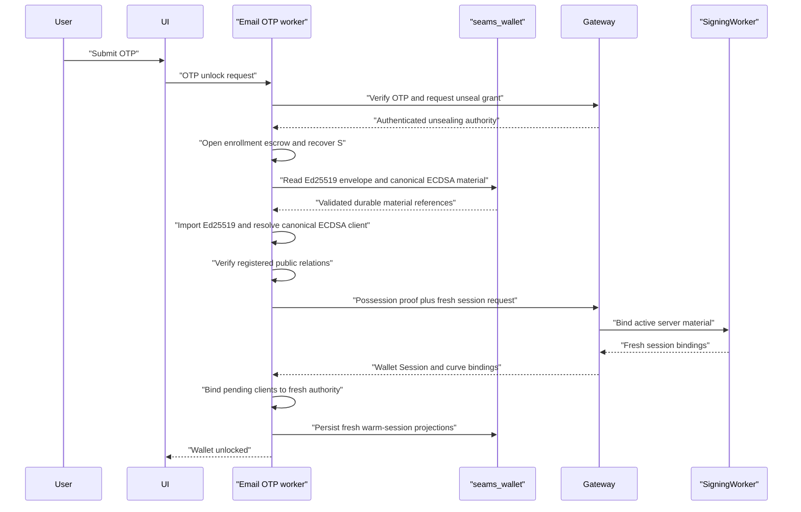
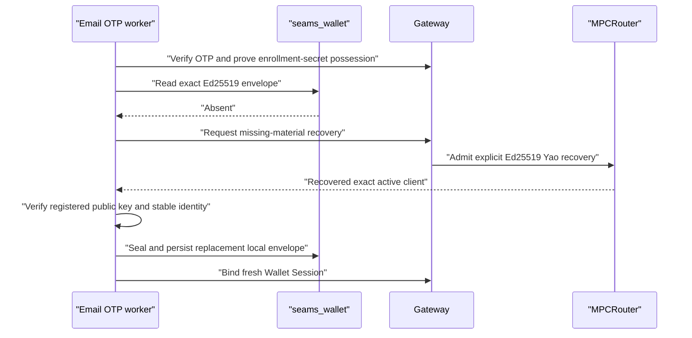

# Email OTP Exact-Material Unlock Patch

Date created: July 22, 2026

Status: implementation complete; manual latency and intended-behaviour acceptance pending

## Scope

This patch makes routine same-device Email OTP wallet unlock restore the exact
locally sealed Ed25519 client and reuse the canonical durable ECDSA role-local
material. It removes Ed25519 Yao recovery from the normal unlock path and
reserves recovery for authenticated cases where local Ed25519 custody material
is genuinely absent.

This is a lifecycle and latency correction. It does not reorganize the broader
auth-capability model owned by
[Refactor 90](./refactor-90-modular-auth-capabilities-plan.md), add linked-device
provisioning, or change the threshold signing protocols.

The patch targets the current architecture and can land before Refactor 90.
Refactor 90 may later replace its concrete record and capability types while
preserving the lifecycle and custody invariants defined here.

## Problem

The current Email OTP unlock path performs more work than a passkey unlock:

1. verify the OTP and unseal the Email OTP enrollment secret `S`;
2. create and verify a wallet-unlock possession proof;
3. derive or restore ECDSA client material;
4. request an Ed25519 Yao recovery session;
5. activate both signing lanes;
6. persist warm-session records and verify runtime postconditions.

The Ed25519 recovery branch starts from
`SeamsWeb.loginWithEmailOtpEcdsaCapabilityDomain`, is requested during
`/wallet/unlock/verify`, and reaches the Router A/B recovery runtime. Routine
unlock therefore pays recovery latency even when the browser already owns the
same wallet's local custody material.

Passkey same-device unlock already demonstrates the intended shape: open an
authenticated local envelope, verify its public relation, and bind the live
client to fresh session authority. Email OTP should use the same lifecycle with
an Email OTP-specific wrapping authority.

## Goals

1. Verify a fresh Email OTP proof with the Gateway.
2. Obtain the existing high-entropy Email OTP enrollment secret `S` inside the
   dedicated Email OTP worker.
3. Open and import the exact locally sealed Ed25519 material from
   `seams_wallet` and resolve ECDSA through the existing canonical role-local
   material owner.
4. Verify both clients against the registered public capabilities.
5. Mint and bind a fresh Wallet Session only after local material verification.
6. Use Ed25519 Yao recovery only when the exact local Ed25519 envelope is
   absent.
7. Preserve key identity, signing-root scope, signer slot, and participant
   identity across every unlock.
8. Reduce routine same-device OTP unlock latency without weakening fresh-auth
   requirements.

## Non-Goals

- Removing Email OTP verification from wallet unlock.
- Using the six-digit OTP as key-encryption material.
- Adding another IndexedDB database or another owner for wallet custody state.
- Silently repairing malformed or mismatched local material.
- Changing registration key derivation or registered wallet addresses.
- Implementing cross-device linking, delegated lanes, or Refactor 90's full
  capability reorganization.
- Removing explicit Ed25519 recovery and key-export protocols.

## Security Model

### Wrapping Authority

The OTP proves recent control of the inbox. The OTP has insufficient entropy
for encryption and must never become a KEK, KDF input, stored secret, or
durable material identifier.

The server-assisted Email OTP flow releases the high-entropy enrollment secret
`S` into the dedicated Email OTP worker after successful OTP verification and
enrollment-escrow unsealing. The worker derives the Ed25519 local wrapping key
from `S`:

```text
Ed25519 KEK = HKDF-SHA256(
  ikm = S,
  salt = "seams/email-otp/local-custody/v1",
  info = "ed25519-yao-client" || stable-custody-binding-digest
)

```

Every seal uses a fresh 96-bit nonce. The envelope version, algorithm, stable
custody binding, and IndexedDB record identity are authenticated as AAD.

ECDSA retains its existing canonical role-local sealing and rehydration
scheme. This patch does not introduce an Email OTP-specific ECDSA envelope,
KEK domain, record type, or durable secret owner.

`S`, the derived Ed25519 KEK, and plaintext client material remain inside the dedicated
worker or Rust/WASM boundary. JavaScript receives ciphertext records, opaque
live handles, public facts, and typed results.

### Stable Custody Binding

The Ed25519 envelope binds the material to stable identity:

- envelope version and algorithm;
- wallet ID;
- Email OTP provider and provider subject ID;
- Email OTP enrollment ID and seal-key version;
- curve and key kind;
- signer slot and exact key ID;
- signing-root ID and signing-root version;
- registered public key;
- Ed25519 participant set, application binding, lifecycle ID, and root-share
  epoch;
- SigningWorker identity and stable verifying share required to prove the
  registered threshold relation.

The envelope excludes rotating authority:

- Wallet Session JWT;
- threshold-session ID;
- signing-grant ID;
- remaining uses;
- expiry;
- challenge IDs and OTP attempt IDs;
- request nonces;
- transient activation handles.

An imported client enters a pending state. It cannot sign until a fresh Wallet
Session and curve-specific session bindings have been verified and attached.

### Failure Semantics

Local custody resolution has three distinct outcomes:

```ts
type EmailOtpLocalMaterialResolution<TMaterial> =
  | {
      kind: 'exact_material_ready';
      material: TMaterial;
    }
  | {
      kind: 'material_absent';
    }
  | {
      kind: 'material_invalid';
      code:
        | 'ciphertext_invalid'
        | 'custody_binding_mismatch'
        | 'registered_public_key_mismatch'
        | 'unsupported_envelope_version';
    };
```

Rules:

- `exact_material_ready` enters local rehydration.
- `material_absent` may enter an authenticated recovery plan.
- `material_invalid` fails closed with a local-custody error.
- Invalid material never falls through to Yao recovery.
- Expired Wallet Sessions, exhausted budgets, or missing SigningWorker active
  state are session/activation problems. They do not prove local material is
  absent.

## Target Lifecycle

### Routine Same-Device Unlock



This path must not call Router A/B Ed25519 Yao recovery admission, execution,
activation, or Deriver A/B routes.

### Missing Local Ed25519 Material



Recovery is allowed only after authenticated absence is established. A
successful recovery must persist and read back the new envelope before unlock
reports success. The next same-device unlock must use local rehydration.

### ECDSA Material Resolution

ECDSA remains owned by the canonical role-local material resolver. Routine
unlock reuses live material when available and otherwise opens its existing
durable representation. Missing or invalid ECDSA material follows that
resolver's typed failure policy. Ed25519 Yao recovery is never used for ECDSA.

## Domain State

The unlock coordinator should consume one precise plan:

```ts
type EmailOtpUnlockMaterialPlan =
  | {
      kind: 'rehydrate_exact_local_material';
      ed25519Envelope: EmailOtpEd25519LocalEnvelope;
      ecdsaMaterial: PersistedEcdsaRoleLocalMaterial;
    }
  | {
      kind: 'recover_missing_ed25519_material';
      ecdsaMaterial: PersistedEcdsaRoleLocalMaterial;
      ed25519Envelope?: never;
    }
  | {
      kind: 'reject_invalid_local_material';
      curve: 'ed25519' | 'ecdsa';
      code: EmailOtpLocalMaterialInvalidCode;
    };
```

Use branch-specific builders after parsing IndexedDB records. Core unlock,
rehydration, activation, and recovery functions must not accept raw records,
optional identity fields, or independent boolean flags.

The live lifecycle is:

```text
otp_verified
  -> enrollment_secret_unsealed
  -> local_material_resolved
  -> clients_rehydrated_pending_session
  -> wallet_session_minted
  -> clients_bound_active
  -> warm_state_committed
```

Any failure after client import disposes both pending handles and zeroizes `S`,
KEKs, and temporary plaintext. Partial activation cannot become observable as
an unlocked wallet.

## Persistence

### Ownership

All records remain in `seams_wallet`. This patch must not create standalone
Email OTP, Ed25519, ECDSA, presignature, or session databases.

Use the existing account/key-material store and canonical wallet profile. Add
one key-material record branch for Email OTP Ed25519 Yao local client material.
Reuse the existing ECDSA role-local durable-material branch.

There must be one durable material owner per curve. Existing public capability,
session projection, and diagnostics records cannot contain another copy of the
secret material.

### Registration Commit

Registration must commit the new Ed25519 envelope and existing canonical ECDSA
material before reporting success:

1. create and activate the exact Ed25519 and ECDSA clients;
2. seal the Ed25519 client with the Email OTP-specific key derived from `S`;
3. persist the Ed25519 envelope and canonical ECDSA material under the wallet
   profile;
4. read back, parse, and verify both durable records;
5. finalize the active wallet state;
6. report registration success.

If server activation succeeds and local persistence fails, return an explicit
`local_custody_commit_failed` state and dispose live material. Do not report a
partially recoverable registration as successful.

### Existing Development Records

This repository is in development. Replace obsolete Email OTP material records
at their persistence parser boundary and delete the old writer and runtime
branches in the same patch. No legacy unlock flag or compatibility path should
enter core lifecycle code.

An old account without the new envelope follows `material_absent` and the
explicit authenticated recovery branch. A malformed old record follows
`material_invalid` and requires cleanup or re-registration.

## Server Responsibilities

The Gateway must:

1. verify the OTP and issue a single-use unseal authorization;
2. verify possession of the enrollment secret using the existing unlock-proof
   key relation;
3. authorize one fresh wallet-scoped session request;
4. bind the exact wallet, auth authority, key IDs, signing-root scope, and
   requested budget;
5. return fresh Ed25519 and ECDSA session projections;
6. invoke Yao recovery only for an explicit missing-Ed25519-material request;
7. emit an audit event identifying `local_rehydrate` or `missing_material_recovery`.

The server never receives local envelope plaintext, `S`, a KEK, an ECDSA client
share, or an Ed25519 client root.

The fresh Wallet Session may rotate JWT, grant, quota, and expiry. The
registered Ed25519 threshold-session lifecycle identity remains pinned to the
active signer capability. Fresh authority cannot change registered key
identity or stable custody bindings.

## Current Implementation Map

Use these existing boundaries rather than creating parallel coordinators:

- `packages/sdk-web/src/SeamsWeb/SeamsWeb.ts`
  - owns the current Email OTP unlock orchestration and timing summary;
- `packages/sdk-web/src/core/signingEngine/session/emailOtp/walletUnlock.ts`
  - owns typed worker unlock requests;
- `packages/sdk-web/src/core/signingEngine/workerManager/workers/email-otp.worker.ts`
  - owns `S`, enrollment-escrow unsealing, possession proofs, and temporary
    client material;
- `packages/sdk-web/src/core/signingEngine/session/emailOtp/ecdsaLogin.ts`
  - owns ECDSA session provisioning after Email OTP authorization;
- `packages/sdk-web/src/core/signingEngine/session/emailOtp/ecdsaRecovery.ts`
  - owns current Email OTP ECDSA sealed-session rehydration;
- `packages/sdk-web/src/core/signingEngine/session/emailOtp/ed25519YaoSealedRecovery.ts`
  - owns current Email OTP Ed25519 sealed-session recovery;
- `packages/sdk-web/src/core/signingEngine/session/passkey/ed25519YaoLocalMaterial.ts`
  - provides the existing local Ed25519 envelope pattern to generalize;
- `packages/sdk-web/src/core/signingEngine/session/persistence/records.ts` and
  `sealedSessionStore.ts`
  - own canonical persisted material and rotating session projections;
- `packages/sdk-server-ts/src/router/walletUnlockRouteHandlers.ts`
  - owns OTP unlock verification and the current recovery augmentation;
- `packages/sdk-server-ts/src/router/routerAbEd25519YaoRecovery.ts`
  - remains the explicit missing-Ed25519-material recovery implementation.

Do not add a second unlock coordinator, ECDSA material resolver, active-client
registry, or persistence adapter.

## Implementation Phases

### Phase 0: Baseline And Contract Freeze

- [ ] Capture timing summaries for warm-worker and cold-worker OTP unlocks.
- [ ] Record requests to OTP verification, unseal, wallet-session, Ed25519 Yao,
      ECDSA activation, and persistence boundaries.
- [x] Inventory the exact current owners of `S`, Ed25519 active client material,
      ECDSA role-local material, public capabilities, and sealed sessions.
- [x] Confirm which current records contain durable material and which contain
      rotating session projections.
- [x] Add a source guard proving new code writes only to `seams_wallet`.
- [x] Freeze the target lifecycle states and error codes before implementation.

Exit criteria:

- The four-second baseline is attributed to named timing buckets and route
  calls.
- Every durable and volatile secret has one declared owner.

### Phase 1: Envelope And State Types

- [x] Define a versioned Ed25519 Email OTP envelope record with required stable
      bindings and retain the canonical ECDSA durable record.
- [x] Define boundary parsers for IndexedDB records and worker responses.
- [x] Define `EmailOtpLocalMaterialResolution` and
      `EmailOtpUnlockMaterialPlan` as exhaustive unions.
- [x] Keep imported Ed25519 handles worker-owned until authoritative session
      verification succeeds.
- [x] Add `@ts-expect-error` fixtures rejecting missing identities, rotating
      session fields in durable bindings, broad object spreads, and active use
      of pending handles.
- [x] Delete superseded Email OTP material record types and writers touched by
      this path.

Exit criteria:

- Invalid combinations cannot be constructed through exported TypeScript APIs.
- Raw persistence records are parsed once at the storage boundary.

### Phase 2: Worker And WASM Custody Operations

- [x] Add Email OTP worker commands to seal and import Ed25519 active-client
      material using an owned `S` handle.
- [x] Reuse worker commands to seal and import exact ECDSA role-local
      material through the canonical ECDSA material resolver.
- [x] Keep envelope encryption, decryption, public-relation checks, and secret
      zeroization inside worker/WASM code.
- [x] Use an Email OTP-specific versioned HKDF domain for Ed25519 and retain the
      existing ECDSA sealing domain.
- [x] Generate a fresh nonce for every seal and reject nonce, version, AAD, or
      identity mismatches.
- [x] Return ciphertext and public facts only; never return plaintext material
      or `S` to application JavaScript.
- [x] Add disposal commands for imported handles and invoke them on terminal
      paths.

Exit criteria:

- Ed25519 round-trips through the new seal/import boundary, and ECDSA continues
  to round-trip through its canonical resolver with exact public identity.
- Tampered ciphertext and cross-wallet/cross-slot substitution fail closed.

### Phase 3: Registration Persistence

- [x] Seal the exact Ed25519 client during Email OTP registration while `S` is
      owned by the worker and retain canonical ECDSA persistence.
- [x] Persist the new Ed25519 record under the canonical `seams_wallet` profile.
- [x] Read back and verify the durable records before registration succeeds.
- [x] Keep server activation and local custody persistence under one explicit
      registration commit state machine.
- [x] Ensure rollback disposes volatile clients and clears uncommitted local
      records.
- [x] Verify by source guard that no additional IndexedDB database is created.

Exit criteria:

- A fresh Email OTP registration leaves an exact Ed25519 local envelope and
  canonical ECDSA durable material.
- Registration cannot return success with either durable material owner
  missing.

### Phase 4: Routine Unlock Cutover

- [x] Change OTP unlock to verify OTP and unseal `S` once.
- [x] Resolve the exact Ed25519 envelope and canonical ECDSA material before
      selecting recovery.
- [x] Import Ed25519 and resolve ECDSA into worker-owned live states.
- [x] Verify registered Ed25519, ECDSA client-share, threshold-key, and EVM
      address continuity.
- [x] Request fresh wallet-scoped authority and expose imported handles only
      after authority and public-continuity checks pass.
- [x] Persist fresh warm-session projections without copying rotating session
      fields into durable custody bindings.
- [x] Activate the React wallet state only after both curves and runtime
      postconditions succeed.
- [x] Remove the unconditional
      `prepareEmailOtpEd25519YaoLoginRecoveryInternal` branch
      from `loginWithEmailOtpEcdsaCapabilityDomain`.

Exit criteria:

- Same-device unlock performs zero Yao recovery requests.
- The wallet becomes active only after both exact clients share one fresh
  wallet-scoped authority and budget.

### Phase 5: Explicit Missing-Material Recovery

- [x] Enter Ed25519 recovery only from `material_absent`.
- [x] Recover only missing Ed25519 material; ECDSA remains under its canonical
      resolver.
- [x] Use Router A/B Yao recovery only for missing Ed25519 material.
- [x] Seal, persist, read back, and verify recovered Ed25519 material before session
      activation succeeds.
- [ ] Emit distinct timing and audit labels for local rehydration and recovery.
- [x] Return `local_custody_invalid` for corrupt or mismatched records without
      attempting recovery.
- [x] Return `device_link_required` only when the authenticated authority cannot
      restore exact material on this device.

Exit criteria:

- The first authenticated unlock with absent material may recover and persist.
- The next unlock uses local rehydration.
- Corruption never triggers recovery.

### Phase 6: Delete Superseded Paths

- [x] Restrict `ecdsa_and_ed25519_yao_recovery` to the explicit
      missing-Ed25519-material branch.
- [x] Replace optional recovery request shapes with exact-local and
      missing-material discriminants.
- [x] Delete duplicate Ed25519 material reconstruction helpers from
      normal session activation.
- [x] Keep explicit recovery and export entry points narrowly typed.
- [x] Remove stale tests, fixtures, and guards that require Yao recovery on every
      OTP unlock.
- [x] Update architecture and Email OTP documentation with the final lifecycle.

Exit criteria:

- Recovery is reachable only through the explicit `material_absent` plan.
- Search guards find no compatibility flag or legacy normal-unlock recovery
  branch.

## Validation

### Static And Unit Checks

- Envelope parsers reject unknown fields and rotating-session fields.
- Type fixtures reject pending clients at signing boundaries.
- Cross-wallet, cross-provider, cross-slot, cross-root, and cross-curve envelope
  substitution fails.
- Invalid ciphertext, nonce, AAD, version, and public relations fail closed.
- Worker failure and cancellation dispose handles and zeroize temporary bytes.
- Missing and invalid material produce different typed outcomes.

### Intended Behaviour E2E

1. Fresh OTP registration persists the Ed25519 envelope and canonical ECDSA
   durable material in `seams_wallet`.
2. Lock then OTP unlock imports Ed25519 and resolves ECDSA without Yao recovery
   routes.
3. Unlock then NEAR, Tempo, and EVM signing succeeds under one shared budget.
4. Step-up and Ed25519/ECDSA export continue to work.
5. Page refresh preserves and consumes the remaining warm allowance without OTP
   or Yao recovery.
6. Deleting only the Ed25519 envelope causes exactly one authenticated Yao
   recovery, persists a new envelope, and preserves the NEAR public key.
7. Removing canonical ECDSA material follows the existing ECDSA resolver's
   typed failure or recovery policy and preserves the EVM address.
8. Corrupting either envelope fails without any recovery request.
9. Server restart followed by unlock preserves wallet identities and uses the
   appropriate identity-preserving activation refresh.
10. Only `seams_wallet` exists after registration, unlock, refresh, signing, and
    recovery.

### Performance Acceptance

Measure from OTP submission to active wallet state and exclude email delivery
and human input time.

- Record cold-worker and prewarmed-worker results separately.
- Routine local unlock must make zero Deriver A/B or Ed25519 Yao recovery calls.
- Local-development warm-worker median should be below 1.5 seconds.
- Local-development warm-worker p95 should be below 2 seconds.
- Any unlock above 2 seconds must emit a development timing summary naming its
  three largest buckets.
- Recovery latency is measured separately and does not count toward routine
  unlock acceptance.

## Observability

Retain the existing `[EmailOtpUnlock] timing summary` and add these fields:

- `materialPlan`: `local_rehydrate` or `missing_material_recovery`;
- `otpVerificationMs`;
- `enrollmentSecretUnsealMs`;
- `localEnvelopeReadMs`;
- `ed25519ImportMs`;
- `ecdsaImportMs`;
- `walletSessionMintMs`;
- `sessionBindingMs`;
- `warmStateCommitMs`;
- `recoveryMs` only for explicit recovery.

Logs may include wallet ID, curve, key IDs, envelope version, and timing. They
must never include OTPs, `S`, KEKs, plaintext material, ciphertext, JWTs,
recovery codes, or worker handles.

## Completion Criteria

The patch is complete when:

1. fresh Email OTP registrations persist an exact Ed25519 envelope and
   canonical ECDSA durable material;
2. routine OTP unlock verifies OTP, opens exact local material, and binds a
   fresh Wallet Session;
3. routine OTP unlock makes no Yao recovery request;
4. missing Ed25519 material enters one explicit authenticated recovery and
   seeds the local envelope;
5. invalid local material fails closed;
6. registered NEAR and EVM identities remain unchanged;
7. the intended-behaviour matrix passes for registration, unlock, refresh,
   shared budget, step-up, and exports;
8. performance acceptance is met;
9. no additional IndexedDB database or duplicate durable secret owner exists;
10. superseded unconditional recovery branches and stale tests are deleted.

## Recommended Commit Sequence

1. `refactor(otp): define exact local custody envelopes`
2. `feat(otp): add worker-owned envelope seal and import`
3. `feat(otp): persist exact material during registration`
4. `fix(otp): rehydrate local material during wallet unlock`
5. `fix(otp): isolate missing-material recovery`
6. `test(otp): enforce exact-material unlock lifecycle`
7. `refactor(otp): remove routine Yao recovery paths`
