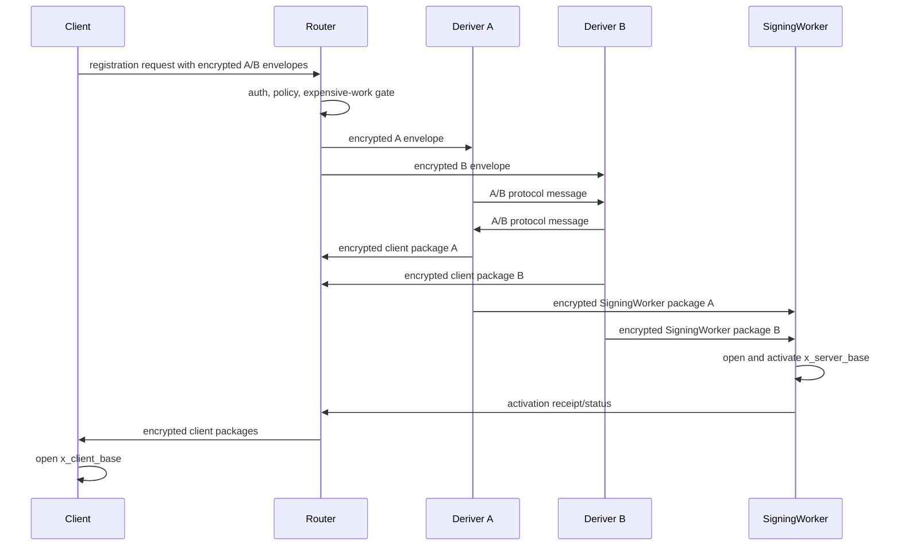
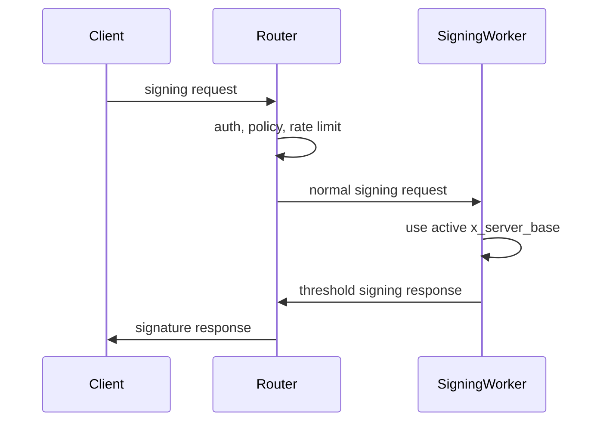
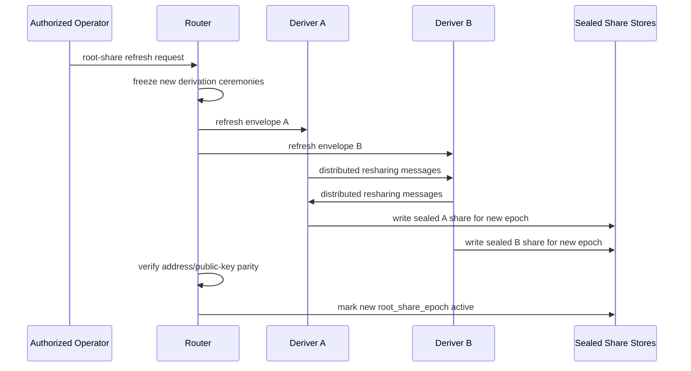

# Router A/B Deriver Spec

Date created: June 11, 2026

Status: pre-implementation specification.

Related plan:
[docs/router-A-B-signer.md](./router-A-B-signer.md).

## Purpose

This spec records the security, protocol, lifecycle, observability, and release
gates for the Router A/B deriver architecture before implementation starts.

The implementation plan lives in `docs/router-A-B-signer.md`. This file owns
the decisions that must be settled or explicitly gated before code can claim the
Router A/B security boundary.

Terminology: target architecture prose uses `Deriver A`, `Deriver B`, and
`SigningWorker`. Current implementation labels such as `SignerA`, `SignerB`,
`SIGNER_A_*`, `SIGNER_B_*`, and server-labelled activation types are
transitional and should be renamed during the slimming refactor.

## Client Material Boundary

Router A/B client code has a strict split between orchestration and
cryptographic material. TypeScript SDK code carries public/session metadata,
Wallet Session JWTs, route requests, worker material handles, binding digests,
public facts, runtime-policy scope, and SigningWorker scope. It must not own
Ed25519 HSS client-base material, ECDSA-HSS client signing shares,
presignature/client-share material, nonce secrets, PRF-derived secret state, or
signing-share generation.

`crates/signer-core` and browser WASM workers own client-side cryptographic
protocol logic, secret material, binding checks, serialization formats that are
crypto-adjacent, and client share generation. Cloudflare SigningWorker owns
server-side one-use nonce/presignature state and server signing material. Router
owns admission, policy, Wallet Session verification, replay/quota/abuse gates,
private worker forwarding, and response binding validation.

## Protocol Decision Gates

### Gate 1: Split Derivation Primitive

Decision: `mpc_threshold_prf_v1` is the production primitive.

Reason: both candidates have the same current Router-facing round-trip shape,
and `mpc_threshold_prf_v1` is already sub-ms on the native proof path. Its
reuse of `threshold-prf` gives the clearer correctness-hardening,
refresh-continuity, and formal-verification path. The split-root candidate
remains comparison/prototype material until its root-generation, anti-bias,
refresh, and address-verification questions are resolved.

Candidates:

- **MPC threshold-PRF-to-shares.**
  - Keeps continuity with the current threshold-PRF root custody model.
  - Preserves the "same root, same wallet identity" story cleanly.
  - Requires more adapter, proof, and vector work than the split-root
    prototype.
- **New split root derivation.**
  - Likely faster if the construction naturally emits `y_A`, `y_B`, `tau_A`,
    and `tau_B`.
  - Better aligned with Router A/B as the native architecture.
  - Requires fresh cryptographic review and dedicated leakage analysis.

Release gates after selection:

- frozen canonical test vectors for `mpc_threshold_prf_v1`
- latency and byte-size estimates for setup/export/refresh
- one-party leakage analysis for A-side derived material
- one-party leakage analysis for B-side derived material
- review of what a leaked derived wallet share reveals about `k_org`
- proof or clear argument that no party opens joined `y_server` or
  `tau_server`
- address/public-key parity tests before and after root-share refresh
- decision on whether Candidate A DLEQ verification ships in the first
  production path or remains stronger hardening after Minimum Level C

Release rule: production Router A/B split derivation uses
`mpc_threshold_prf_v1`. `split_root_derivation_v1` must not be promoted without
fresh vectors, leakage analysis, root-generation review, anti-bias review, and
refresh/address-verification acceptance.

Experiment format:

```text
candidate_id:
  mpc_threshold_prf_to_shares | split_root_derivation_v1

inputs:
  signing_root_version
  root_share_epoch
  wallet_context
  deriver_a_share
  deriver_b_share
  derivation_version
  transcript_binding

outputs:
  y_a
  y_b
  tau_a
  tau_b
  public_commitments
  transcript_digest

measurements:
  native_cpu_ms
  wasm_cpu_ms
  message_count
  total_bytes
  estimated_a_b_round_trips

analysis:
  what A learns
  what B learns
  what a derived A share leak reveals
  what a derived B share leak reveals
  whether address identity is preserved after root-share refresh
```

Pass criteria:

- no participant opens joined `y_server` or `tau_server`
- one-party leakage is documented and accepted
- vectors are deterministic across native Rust and Wasm
- output shares feed the role-separated HSS API without joined-state adapters
- setup/export/refresh latency is within the target budget

### Gate 2: HSS Integration Boundary

Decision: create a new role-separated HSS API.

Do not adapt current joined-state APIs in production paths. The new API should
make Router A/B role separation explicit from the type boundary.

Allowed A/B API inputs:

- role-local root material
- role-local client material
- transcript metadata
- authenticated peer protocol messages
- request-kind-specific scope

Forbidden A/B API inputs and outputs:

- joined `d`
- joined `a`
- joined `y_server`
- joined `tau_server`
- joined `x_client_base`
- `DdhHssSharedWord`-style joined hidden words in production routes
- evaluator driver state that lets one server reconstruct protected values

Allowed outputs:

- encrypted client-output package share
- SigningWorker-output package share
- public transcript digest
- typed redacted diagnostics

Release rule: production Router A/B code must use the role-separated API, with
source guards preventing imports of joined-state executor types.

Draft API shape:

```rust
pub struct RoleSeparatedHssInput<R> {
    pub role: R,
    pub transcript: TranscriptBinding,
    pub local_root_material: RoleLocalRootMaterial<R>,
    pub local_client_material: RoleLocalClientMaterial<R>,
    pub peer_messages: Vec<AuthenticatedPeerMessage>,
}

pub struct RoleSeparatedHssStepOutput<R> {
    pub role: R,
    pub peer_messages: Vec<AuthenticatedPeerMessage>,
    pub client_output_package: Option<EncryptedClientOutputPackage>,
    pub signing_worker_output_package: Option<SigningWorkerOutputPackage>,
    pub transcript_digest: TranscriptDigest,
    pub diagnostics: RedactedCeremonyDiagnostics,
}

pub trait RoleSeparatedHssEngine<R> {
    fn advance(
        &mut self,
        input: RoleSeparatedHssInput<R>,
    ) -> Result<RoleSeparatedHssStepOutput<R>, HssRoleError>;
}
```

Forbidden imports in production Router A/B paths:

- `DdhHssSharedWord`
- `SplitLocalBitWord` where it can expose both local sides
- `DdhHiddenEvalProjectorInputs`
- evaluator driver state bytes for secret ceremony values
- current output-projector APIs that materialize joined client output state

### Gate 3: SigningWorker Placement

Decision: normal signing uses a standalone `SigningWorker`.

Initial topology:

```text
Registration/export/recovery/refresh:
  Client -> Router -> Deriver A and Deriver B
  Deriver A <-> Deriver B
  Deriver A/B -> SigningWorker
  SigningWorker activates x_server_base
  SigningWorker -> Router activation receipt

Normal signing:
  Client -> Router -> SigningWorker -> Router -> Client
```

Deriver A and Deriver B are derivation workers. They hold role-local derivation
material and produce recipient-scoped proof bundles for the client and
SigningWorker. The SigningWorker is allowed to open `x_server_base`.
Deriver A, Deriver B, Router, and diagnostics sinks must never open
`x_client_base`, joined `d`, joined `a`, joined `y_server`, or joined
`tau_server`.

Rationale:

- normal signing stays on a Router plus one worker path
- Deriver A and Deriver B leave the hot signing path after derivation-time
  ceremonies
- the role name describes signing responsibility and avoids transaction-server
  ambiguity
- Router remains secret-light
- direct Deriver A/B -> SigningWorker delivery avoids an extra Router relay
  hop during activation
- failover uses multiple instances of the same SigningWorker identity or a
  refresh ceremony that activates a new SigningWorker identity

### Gate 4: Non-Circular Envelope Binding

Decision: implemented for canonical-byte construction. The derivation
transcript, request-context digest, Router replay digest, and strict
deriver-envelope AAD bootstrap are non-circular. The strict deriver bootstrap can
now derive typed deriver-host preload coordinates, and deriver Workers can load
trusted A/B peer verifying keys from role-local config. Router A/B v1 strict
proof-bundle delivery uses independent Router dispatch to Deriver A and Deriver B;
Router aggregation requires both deriver responses for liveness.

The current field graph is too circular for real envelope construction:

```text
RoleEnvelopeAadV1.aad_digest
  depends on RoleEnvelopeAadV1.transcript_digest
  depends on RoleEnvelopeAadV1.router_request_digest

legacy router_transcript_digest_v1 shape
  depended on deriver envelope digests
  depended on RoleEncryptedEnvelopeV1.aad_digest

PublicRouterRequestV1::router_replay_digest()
  depends on role envelopes
  depend on RoleEncryptedEnvelopeV1.aad_digest
```

That made it unclear which bytes are known when A/B deriver envelopes are
encrypted. The implementation now splits public pre-envelope transcript context
from encrypted-envelope assignment metadata:

- `PublicRouterRequestContextV1::context_digest()` excludes transcript digest,
  role-envelope AAD digests, and ciphertext.
- `PublicRouterRequestContextV1::derivation_transcript_digest()` computes the
  HSS/output transcript digest before role envelopes are encrypted.
- `PublicRouterRequestV1` rejects supplied transcript digests that do not match
  the pre-envelope derivation transcript.
- Derivation `TranscriptBinding` binds deriver-set id, deriver index, role,
  deriver identity, key epoch, quorum policy, selected SigningWorker, client
  identity, client ephemeral key, and account context. It no longer binds
  encrypted envelope digests.
- `RouterEnvelopeDigestSetV1` carries encrypted-envelope digests only for
  Router-to-deriver assignment validation.

Implemented fix:

- Add public `root_share_epoch` to the Router request scope. It is needed to
  compute derivation transcript bytes before deriver-envelope encryption.
- Define `RouterRequestContextDigestV1` over public request fields that exclude
  role envelopes, role-envelope `aad_digest`, and ciphertext bytes. Use this
  digest inside deriver-envelope AAD and deriver plaintext.
- Define `DerivationTranscriptDigestV1` over lifecycle scope including
  `root_share_epoch`, deriver set, selected SigningWorker, client identity,
  client ephemeral public key, request kind, and `RouterRequestContextDigestV1`.
  This digest is known before encryption and is used inside deriver plaintext,
  A/B proof batches, recipient proof bundles, and output package bindings.

Remaining release gates:

- Keep final `RouterReplayDigestV1` over the full public request, including
  encrypted role envelopes, for Router replay/idempotency storage only.
  Implemented as `PublicRouterRequestV1::router_replay_digest()`.
- Make deriver private service bodies carry the exact typed AAD object supplied
  by Router, then require `aad.digest()` to match the envelope's public
  `aad_digest`. Implemented as
  `CloudflareDeriverPrivateBootstrapRequestV1`.

Release rule: production vectors must show the complete order of operations for
creating A and B encrypted deriver envelopes, computing transcript bytes,
computing Router replay bytes, and decrypting at each deriver without any digest
fixed point.

## Threat Claim Matrix

| Compromise            | Expected exposure                                   | Required containment                                                         |
| --------------------- | --------------------------------------------------- | ---------------------------------------------------------------------------- |
| Router                | public metadata, ciphertext, hashes, timings        | no deriver plaintext, no root shares, no output shares                       |
| Deriver A             | A custody material, A local derived material        | no B plaintext, no `x_client_base`, no `x_server_base`, no joined `d` or `a` |
| Deriver B             | B custody material, B local derived material        | no A plaintext, no `x_client_base`, no `x_server_base`, no joined `d` or `a` |
| A and B               | server-side custody may be compromised              | incident response may require root replacement or wallet migration           |
| SigningWorker         | `x_server_base` and normal-signing state            | no `k_org`, no joined `y_server`, no joined `d`, no `x_client_base`          |
| Client                | that user's client output path and local material   | no server root material, no `y_server`, no `tau_server`                      |
| A storage or KEK only | A sealed/plain share according to the key boundary  | no B share, no joined root                                                   |
| B storage or KEK only | B sealed/plain share according to the key boundary  | no A share, no joined root                                                   |
| Logs/observability    | public metadata, hashes, state transitions, timings | no protocol payload plaintext                                                |

Claim language for initial release:

```text
Router A/B Level C prevents a single production server process from holding
joined d, a, x_client_base, y_server, or tau_server during derivation-time
ceremonies, assuming the role-separated protocol boundary is followed.
```

Avoid claiming full malicious-secure MPC. Minimum Level C does not prevent
denial of service, aborts, malformed messages, or all active correctness
attacks.

## Derivation Ceremony State Machine

Use one `DerivationCeremony` lifecycle with request-kind-specific scope.

Request kinds:

- `registration`
- `key_export`
- `recovery`
- `server_share_refresh`

Suggested state model:

```rust
pub enum DerivationCeremony {
    Created(CreatedCeremony),
    Admitted(AdmittedCeremony),
    AEnvelopeForwarded(AEnvelopeForwardedCeremony),
    BEnvelopeForwarded(BEnvelopeForwardedCeremony),
    AbRunning(AbRunningCeremony),
    ClientOutputReady(ClientOutputReadyCeremony),
    SigningWorkerOutputReady(SigningWorkerOutputReadyCeremony),
    Activated(ActivatedCeremony),
    Failed(FailedCeremony),
    Expired(ExpiredCeremony),
    Abandoned(AbandonedCeremony),
}
```

Required common scope:

- `request_id`
- `protocol_version`
- `request_kind`
- `account_id`
- `session_id`
- `org_id`
- `project_id`
- `environment_id`
- `signing_root_id`
- `signing_root_version`
- `root_share_epoch`
- deriver A identity and key epoch
- deriver B identity and key epoch
- SigningWorker identity and key epoch
- client ephemeral public key
- transcript nonce
- expiry

State rules:

- `Created` has parsed public metadata and encrypted-envelope digest metadata.
- `Admitted` has an accepted or reused expensive-work gate decision.
- `AbRunning` has both deriver envelopes forwarded and peer identities pinned.
- `ClientOutputReady` can expose only encrypted client-output packages.
- `SigningWorkerOutputReady` can expose only SigningWorker-output packages.
- `Activated` is valid only after the SigningWorker opens and records
  `x_server_base`.
- terminal states are `Activated`, `Failed`, `Expired`, and `Abandoned`.
- stale, expired, or wrong-epoch messages must fail closed.

The Router persists only public lifecycle state, hashes, transcript digests,
timings, and error codes.

Transition table:

| From                       | Event                        | To                         | Actor           | Persisted fields                                    |
| -------------------------- | ---------------------------- | -------------------------- | --------------- | --------------------------------------------------- |
| none                       | create request               | `Created`                  | Router          | public metadata, encrypted-envelope digests, expiry |
| `Created`                  | gate accepted                | `Admitted`                 | Router          | gate decision, request id                           |
| `Created`                  | gate reused                  | `Admitted`                 | Router          | reused lifecycle id                                 |
| `Created`                  | gate rejected                | `Failed`                   | Router          | redacted error code                                 |
| `Admitted`                 | forward A envelope           | `AEnvelopeForwarded`       | Router          | A envelope digest, A deriver id                     |
| `AEnvelopeForwarded`       | forward B envelope           | `BEnvelopeForwarded`       | Router          | B envelope digest, B deriver id                     |
| `BEnvelopeForwarded`       | A/B protocol starts          | `AbRunning`                | A or B          | public transcript digest                            |
| `AbRunning`                | client packages ready        | `ClientOutputReady`        | A and B         | encrypted package hashes                            |
| `ClientOutputReady`        | SigningWorker packages ready | `SigningWorkerOutputReady` | A and B         | SigningWorker package hashes                        |
| `SigningWorkerOutputReady` | SigningWorker activates      | `Activated`                | SigningWorker   | activation hash, public transcript digest           |
| any nonterminal            | expiry reached               | `Expired`                  | Router          | expiry reason                                       |
| any nonterminal            | user cancels                 | `Abandoned`                | Router          | abandon reason                                      |
| any nonterminal            | protocol error               | `Failed`                   | Router, A, or B | redacted error code                                 |

Invalid transitions must be rejected at the type boundary where practical and
at the parser/store boundary for persisted records.

Implementation status as of 2026-06-14:

- `router-ab-core` has the platform-neutral ceremony builder chain for the
  derivation protocol state machine.
- `router-ab-core` and `router-ab-cloudflare` now enforce the persisted Router
  admission lifecycle transition at the Cloudflare Durable Object boundary:
  a stored lifecycle starts as `Requested`, advances once to a gate or fallback
  outcome, accepts exact idempotent retries, and rejects skipped or rewritten
  transitions.
- `router-ab-cloudflare` now has a dedicated
  `CloudflareDerivationCeremonyV1` Durable Object record for
  the full `Created -> ... -> Activated/Failed/Expired/Abandoned` transition
  table. The store rejects skipped activation, stale transitions, scope
  changes, and terminal rewrites.

## Transcript Binding Spec

Every encrypted envelope, A/B protocol message, output package, SigningWorker
activation, and deriver response must bind to the same transcript.

Minimum transcript fields:

- `protocol_version`
- `request_kind`
- `request_id`
- `account_id`
- `session_id`
- `org_id`
- `project_id`
- `environment_id`
- `signing_root_id`
- `signing_root_version`
- `root_share_epoch`
- deriver A identity
- deriver A key epoch
- deriver B identity
- deriver B key epoch
- SigningWorker identity
- SigningWorker key epoch
- client ephemeral public key
- Router request digest
- transcript nonce
- expiry

Deriver-envelope AAD and transcript bytes must be non-circular. Any digest used
inside deriver-envelope AAD must be computable before the envelope's
`aad_digest`, ciphertext, or encrypted-envelope digest is computed. The
full Router replay/idempotency digest may bind final envelope bytes, but that
digest must not be required to create those same envelope bytes.

Request-kind-specific bindings:

- registration intent grant and digest
- auth method intent: Passkey or Email OTP
- expected origin and RP ID
- normalized account or wallet id
- key purpose, key version, derivation version, and participant ids
- recovery/export policy identifiers where applicable

Canonical encoding:

- transcript hashes bind canonical inner bytes
- JSON may be used for outer product APIs
- acceptable canonical encodings: CBOR, Borsh, postcard, or a custom versioned
  encoding with fixed field ordering and length rules
- no transcript digest may depend on `JSON.stringify` field ordering

Rotation rule: deriver key rotation, SigningWorker rotation, root-share refresh,
and protocol version changes must change transcript-bound epochs or versions.

Canonical encoding decision:

- implementation may start with Borsh for the Rust-first skeleton
- final protocol freeze requires cross-host vectors that TypeScript can verify
- if Borsh TypeScript support is insufficient, move to deterministic CBOR with
  strict canonical settings before production vectors are frozen

The canonical encoding choice is allowed to change during Phase 0A. After the
first production vector set is accepted, changing encoding requires a protocol
version bump.

## Rust Type Appendix

These types are intentionally close to compilable Rust. Opaque byte wrappers
should be newtypes, not raw `Vec<u8>` aliases, in the actual implementation.

```rust
pub enum Role {
    Router,
    DeriverA,
    DeriverB,
    SigningWorker,
    Client,
}

pub enum RequestKind {
    Registration,
    KeyExport,
    Recovery,
    ServerShareRefresh,
}

pub struct RoleIdentity {
    pub role: Role,
    pub role_id: RoleId,
    pub key_epoch: RoleKeyEpoch,
    pub verifying_key: PublicKeyBytes,
}

pub struct TranscriptBinding {
    pub protocol_version: ProtocolVersion,
    pub request_kind: RequestKind,
    pub request_id: RequestId,
    pub account_id: AccountId,
    pub session_id: SessionId,
    pub org_id: OrgId,
    pub project_id: ProjectId,
    pub environment_id: EnvironmentId,
    pub signing_root_id: SigningRootId,
    pub signing_root_version: SigningRootVersion,
    pub root_share_epoch: RootShareEpoch,
    pub deriver_a: RoleIdentity,
    pub deriver_b: RoleIdentity,
    pub signing_worker: RoleIdentity,
    pub client_ephemeral_public_key: PublicKeyBytes,
    pub router_request_digest: DigestBytes,
    pub transcript_nonce: NonceBytes,
    pub expires_at_ms: UnixMillis,
}

pub struct EncryptedDeriverEnvelope<R> {
    pub role: R,
    pub transcript_digest: TranscriptDigest,
    pub aad_digest: DigestBytes,
    pub ciphertext: CiphertextBytes,
}

pub enum AbProtocolMessage {
    AToB(AuthenticatedPeerMessage<DeriverARole, DeriverBRole>),
    BToA(AuthenticatedPeerMessage<DeriverBRole, DeriverARole>),
}

pub struct EncryptedClientOutputPackage {
    pub transcript_digest: TranscriptDigest,
    pub output_kind: ClientOutputKind,
    pub recipient_client_key: PublicKeyBytes,
    pub ciphertext: CiphertextBytes,
}

pub struct SigningWorkerOutputPackage {
    pub transcript_digest: TranscriptDigest,
    pub output_kind: SigningWorkerOutputKind,
    pub recipient_signing_worker: RoleIdentity,
    pub package_bytes: CanonicalBytes,
}

pub enum ExpensiveWorkGateDecision {
    Accepted { request_id: RequestId },
    ReuseExisting { request_id: RequestId, lifecycle_id: CeremonyId },
    Defer { reason: DeferReason },
    Rejected { reason: RejectReason, retry_after_ms: u64 },
}
```

Role marker types should make invalid engine calls unrepresentable:

```rust
pub enum DeriverARole {}
pub enum DeriverBRole {}

pub type DeriverAEnvelope = EncryptedDeriverEnvelope<DeriverARole>;
pub type DeriverBEnvelope = EncryptedDeriverEnvelope<DeriverBRole>;
```

## Host Trait Appendix

The platform-agnostic engines depend on host traits. Cloudflare, local test
servers, and future TypeScript/Wasm hosts supply implementations.

```rust
pub trait Clock {
    fn now_ms(&self) -> UnixMillis;
}

pub trait Csprng {
    fn fill_random(&mut self, out: &mut [u8]) -> Result<(), HostError>;
}

pub trait DeriverKeyStore {
    fn deriver_identity(&self, role: Role) -> Result<RoleIdentity, HostError>;
    fn decrypt_envelope_key(&self, role: Role) -> Result<KeyBytes, HostError>;
    fn sign_transcript(&self, digest: TranscriptDigest) -> Result<SignatureBytes, HostError>;
}

pub trait SigningRootShareStore {
    fn load_role_share(
        &self,
        role: Role,
        root: SigningRootRef,
    ) -> Result<SealedSigningRootShare, HostError>;
}

pub trait PeerTransport {
    fn send_peer_message(
        &self,
        peer: RoleIdentity,
        message: AbProtocolMessage,
    ) -> Result<AbProtocolMessage, HostError>;
}

pub trait SigningWorkerStateStore {
    fn activate_signing_worker_output(
        &self,
        transcript: TranscriptDigest,
        package: SigningWorkerOutputPackage,
    ) -> Result<SigningWorkerActivationReceipt, HostError>;
}

pub trait AuditSink {
    fn record(&self, event: RedactedCeremonyDiagnostics) -> Result<(), HostError>;
}

pub trait DeriverHost:
    Clock + Csprng + DeriverKeyStore + SigningRootShareStore + PeerTransport + AuditSink
{
}

pub trait SigningWorkerHost: Clock + SigningWorkerStateStore + AuditSink {}
```

Host implementations must not expose decrypted payloads to logging or diagnostics
interfaces.

## Cloudflare Adapter Appendix

`crates/router-ab-cloudflare` owns Cloudflare-specific binding descriptors and
startup validation. The first layer is intentionally independent of
`workers-rs`; the later Worker entrypoints parse `worker::Env` into these typed
descriptors.

The optional `workers-rs` feature pins `worker = 0.8.4`. The Worker bridge
requires Rust 1.88 or newer because the current Workers SDK dependency graph
includes `wasm-streams` 0.6.x. `CloudflareWorkerEnvReaderV1` adapts real
`worker::Env` text vars to the typed parser.
`parse_cloudflare_worker_bindings_from_worker_env_v1` then checks runtime
presence of every configured Durable Object namespace and service binding before
returning accepted startup descriptors.

### Production A/B Orchestration Gate

Strict server-blind production uses recipient-side combine. A and B return only
recipient-scoped proof-batch material: the client receives only `x_client_base`
proof bundles, and the standalone SigningWorker receives only `x_server_base`
proof bundles. Each recipient combines its own output locally.

The decrypted strict delivery payload is `RecipientProofBundlePayloadV1`. The
public wire payload for `WireMessageKindV1::RecipientProofBundle` is
`RecipientProofBundleCiphertextV1`. The decrypted payload binds:

- lifecycle id
- producing deriver identity
- recipient role
- opened-share kind
- recipient identity
- transcript digest
- nested `AbDerivationProofBatchPayloadV1`

The nested proof batch must contain exactly one proof bundle. The one bundle's
binding must match the declared recipient role, opened-share kind, recipient
identity, transcript digest, and producing deriver identity.

`RecipientProofBundleCiphertextV1` encrypts the canonical proof-bundle payload
to the final recipient. Its AAD binds:

- algorithm
- producing deriver identity
- recipient role
- opened-share kind
- recipient identity
- recipient encryption key
- transcript digest
- payload digest
- nonce

The Cloudflare adapter uses HPKE base mode with X25519, HKDF-SHA256, and
AES-256-GCM for this proof-bundle envelope.

The preloaded synchronous deriver host remains an adapter-test boundary and a
weaker deployment-profile building block. It must not satisfy the strict
server-blind release gate because it combines final output packages inside a
deriver process.

Alternative orchestration profiles:

- **Encrypted rendezvous:** A and B use a transcript-scoped rendezvous, such as
  a Durable Object, and encrypt peer bundles to the specific peer or final
  recipient. This keeps Router opaque and adds timeout, replay, cleanup, and
  equivocation rules.
- **Deriver-side combine:** A or B combines proof batches and emits final output
  packages. This is the simplest path and matches the preloaded test handler,
  but it is a weaker deployment profile unless the combiner runs inside a
  separately trusted boundary.

Live direct-peer coordination requires more than an authenticated peer message.
The recipient deriver also needs its own Router-to-deriver encrypted envelope,
role-envelope AAD, request-context digest, root-share metadata, and root-share
wire before it can produce its proof batch. The deployable strict path must
choose either transcript-scoped rendezvous for both role-specific private
bootstraps or independent Router dispatch to A and B with direct A/B used only
as a transcript/liveness check.

Strict release gates:

- The client path must reject any SigningWorker-output proof bundle.
- The SigningWorker path must reject any client-output proof bundle.
- Router may relay opaque bundles, but it must not decrypt them or combine
  recipient outputs.
- Strict production delivery must use `RecipientProofBundleCiphertextV1` or a
  later encrypted version, and the decrypted payload must preserve the same
  one-recipient invariant.
- Deriver-side combine must have its own release profile and must not satisfy the
  strict server-blind release gate.

Durable Object scopes:

```rust
pub enum CloudflareDurableObjectScopeV1 {
    RouterReplay,
    RouterLifecycle,
    RouterProjectPolicy,
    RouterQuota,
    RouterAbuse,
    SignerRootShare { role: Role },
    SigningWorkerOutput,
}
```

Visibility rules:

| Worker        | Allowed Durable Object scopes                                                          |
| ------------- | -------------------------------------------------------------------------------------- |
| Router        | `RouterReplay`, `RouterLifecycle`, `RouterProjectPolicy`, `RouterQuota`, `RouterAbuse` |
| Deriver A     | `SignerRootShare { role: DeriverA }`                                                   |
| Deriver B     | `SignerRootShare { role: DeriverB }`                                                   |
| SigningWorker | `SigningWorkerOutput`                                                                  |

Deriver-envelope key-source rules:

Production deriver envelopes use public-key HPKE. Clients encrypt the Deriver A
and Deriver B envelopes to deriver role public envelope keys. The selected public
key epoch is bound into the request transcript and role-envelope AAD. Daily key
rotation is acceptable when each deriver keeps current and previous private
decrypt keys only through request TTL plus retry grace, then rejects stale
epochs.

Implemented production metadata:

- `DeriverEnvelopeHpkePayloadV1` canonical bytes bind recipient role, key epoch,
  recipient public key, role-envelope AAD digest, HPKE encapsulated X25519 key,
  and ciphertext/tag bytes before any platform decrypt.
- `CloudflareDeriverEnvelopeHpkePublicKeyV1`,
  `CloudflareDeriverEnvelopeHpkePublicKeySetV1`, and
  `CloudflareDeriverEnvelopeHpkeDecryptKeyBindingV1` validate deriver role,
  canonical `x25519:<64 lowercase hex chars>` public-key encoding, key epoch,
  and role-local private binding visibility.
- Cloudflare Router and opposite-deriver startup guards reject HPKE private-key
  binding Env keys.
- `router-ab-cloudflare` exposes native deriver-envelope HPKE seal/open helpers
  and a `workers-rs` HPKE Secret-loading decrypt wrapper. The wrapper decodes a
  versioned private-key Secret, validates public HPKE payload metadata, checks
  the supplied AAD digest, and then calls HPKE open.
- Strict Deriver A/B Worker startup bindings and decrypt-and-handle paths use
  the HPKE decrypt-key descriptor and HPKE open wrapper.

Deriver-envelope HPKE private-key source rules:

| Worker        | Allowed deriver-envelope Secret bindings |
| ------------- | ---------------------------------------- |
| Router        | none                                     |
| Deriver A     | `SIGNER_A_ENVELOPE_HPKE_PRIVATE_KEY`, optional `SIGNER_A_PREVIOUS_ENVELOPE_HPKE_PRIVATE_KEY` during overlap |
| Deriver B     | `SIGNER_B_ENVELOPE_HPKE_PRIVATE_KEY`, optional `SIGNER_B_PREVIOUS_ENVELOPE_HPKE_PRIVATE_KEY` during overlap |
| SigningWorker | none                                     |

Direct A/B peer-message signing key-source rules:

| Worker        | Allowed peer-message signing Secret bindings |
| ------------- | -------------------------------------------- |
| Router        | none                                         |
| Deriver A     | `SIGNER_A_PEER_SIGNING_KEY` only             |
| Deriver B     | `SIGNER_B_PEER_SIGNING_KEY` only             |
| SigningWorker | none                                         |

Direct A/B peer-message verifying key-source rules:

| Worker        | Allowed peer-message verifying keys                                    |
| ------------- | ---------------------------------------------------------------------- |
| Router        | optional public config only                                          |
| Deriver A     | `SIGNER_A_PEER_VERIFYING_KEY_HEX`, `SIGNER_B_PEER_VERIFYING_KEY_HEX` |
| Deriver B     | `SIGNER_A_PEER_VERIFYING_KEY_HEX`, `SIGNER_B_PEER_VERIFYING_KEY_HEX` |
| SigningWorker | optional public config only                                          |

The Cloudflare parser receives public key-source descriptors and public
verifying-key bytes:

```text
SIGNER_A_ENVELOPE_HPKE_PRIVATE_KEY_BINDING
SIGNER_A_ENVELOPE_HPKE_KEY_EPOCH
SIGNER_A_ENVELOPE_HPKE_PUBLIC_KEY
SIGNER_B_ENVELOPE_HPKE_PRIVATE_KEY_BINDING
SIGNER_B_ENVELOPE_HPKE_KEY_EPOCH
SIGNER_B_ENVELOPE_HPKE_PUBLIC_KEY
SIGNER_A_PREVIOUS_ENVELOPE_HPKE_PRIVATE_KEY_BINDING
SIGNER_A_PREVIOUS_ENVELOPE_HPKE_KEY_EPOCH
SIGNER_A_PREVIOUS_ENVELOPE_HPKE_PUBLIC_KEY
SIGNER_B_PREVIOUS_ENVELOPE_HPKE_PRIVATE_KEY_BINDING
SIGNER_B_PREVIOUS_ENVELOPE_HPKE_KEY_EPOCH
SIGNER_B_PREVIOUS_ENVELOPE_HPKE_PUBLIC_KEY
ROUTER_AB_PREVIOUS_ENVELOPE_HPKE_RETIRE_AT_MS
SIGNER_A_PEER_SIGNING_KEY_BINDING
SIGNER_A_PEER_SIGNING_KEY_EPOCH
SIGNER_B_PEER_SIGNING_KEY_BINDING
SIGNER_B_PEER_SIGNING_KEY_EPOCH
SIGNER_A_PEER_VERIFYING_KEY_HEX
SIGNER_B_PEER_VERIFYING_KEY_HEX
```

For the production HPKE path, `*_PRIVATE_KEY_BINDING` names a role-local
Cloudflare Secret binding containing the HPKE private key material. The paired
`*_PUBLIC_KEY` is public `x25519:<64 lowercase hex chars>` metadata and
`*_KEY_EPOCH` is public rotation metadata. Router may receive public keys and
key epochs. Router must reject private-key binding Env keys, and each deriver
must reject the other deriver's private-key binding Env key.
Previous signer-envelope HPKE private bindings are configured as an all-or-none
set: previous private binding, previous key epoch, previous public key, and
`ROUTER_AB_PREVIOUS_ENVELOPE_HPKE_RETIRE_AT_MS`.

The HPKE private-key Secret text format is:

```text
hpke-x25519-private-v1:<64 lowercase hex chars>
```

The 32 decoded bytes must parse as `hpke-ng` X25519 private-key bytes. The
runtime rejects unsupported prefixes, malformed hex, wrong lengths, and private
key parse errors before attempting HPKE open.

For peer signing keys, `*_BINDING` names a Cloudflare Secret containing an
unpadded base64url Ed25519 signing seed of exactly 32 bytes. `*_EPOCH` must
match the sender `RoleIdentityV1.key_epoch` before the Worker signs a peer
message.

Production deriver-envelope ciphertext uses a strict public HPKE payload wrapper
inside the outer `EncryptedPayloadV1`:

```text
lp("router-ab-protocol/deriver-envelope-hpke/v1")
lp("hpke-x25519-hkdf-sha256-aes256gcm/v1")
lp(recipient_role)
lp(key_epoch)
lp(recipient_public_key)
lp(aad_digest[32])
lp(encapped_key[32])
u32be(tag_len = 16)
lp(ciphertext || tag)
```

The parser must reject unsupported versions or algorithms, non-deriver recipient
roles, empty key epochs, malformed recipient public-key encodings, AAD digest
mismatches with the outer envelope, key epoch mismatches with the role-local
decrypt-key descriptor, public-key mismatches with the role-local descriptor,
non-32-byte encapsulated keys, non-128-bit tags, tag-only payloads, and trailing
bytes. Platform decryptors pass `encapped_key`, canonical AAD bytes, and
`ciphertext || tag` to HPKE open, then feed decrypted bytes into the
post-decrypt `DeriverInputPlaintextV1` validation boundary.

Startup validation must reject:

- Router bindings that include deriver root-share or SigningWorker-output scopes
- Router bindings that include Deriver A or Deriver B envelope-key descriptors
- Deriver A bindings that include Deriver B root-share scopes
- Deriver A bindings that include Deriver B envelope-key descriptors
- Deriver B bindings that include Deriver A root-share or SigningWorker-output
  scopes
- Deriver B bindings that include Deriver A envelope-key descriptors
- Deriver A or Deriver B bindings that include SigningWorker-output scopes
- root-share startup checks whose deriver role differs from the Worker role

Durable Object operations should be explicit Router A/B operations:

```text
root_share.has
root_share.startup_metadata
router_replay.reserve
router_lifecycle.put_public_state
router_project_policy.evaluate
router_quota.evaluate
router_abuse.evaluate
router_normal_signing_project_policy.evaluate
router_normal_signing_quota.evaluate
router_normal_signing_abuse.evaluate
signing_worker_output.activate
signing_worker_output.active_state_get
signing_worker_output.material_get
```

The Cloudflare adapter owns typed request and response structs for these
operations. `CloudflareDurableObjectCallV1` binds the initiating Worker role,
the validated Durable Object binding descriptor, and the typed operation body.
It rejects calls whose operation requires a different storage scope or whose
Worker role cannot see the binding. The `workers-rs` executor posts the typed
operation JSON to the Durable Object stub selected by `binding.object_name` and
validates that the typed response branch matches the request before returning.
`router_lifecycle.put_public_state` currently stores the Router admission
lifecycle with transition enforcement. The full derivation ceremony lifecycle
needs a dedicated Cloudflare record before production release.

Generic key/value Durable Object access can exist inside the adapter
implementation, while Router A/B host traits should receive typed operations and
typed responses.

## Endpoint And Wire Examples

Outer JSON examples are illustrative. Transcript hashes bind canonical inner
bytes, represented here as base64url strings.

Registration prepare:

```json
{
  "protocol_version": "router_ab_v1",
  "request_kind": "registration",
  "account_id": "acct_123",
  "session_id": "sess_123",
  "transcript_nonce": "b64u_nonce",
  "expires_at_ms": 1781190000000,
  "client_ephemeral_public_key": "b64u_key",
  "a_envelope_b64u": "b64u_canonical_encrypted_a",
  "b_envelope_b64u": "b64u_canonical_encrypted_b"
}
```

Router response:

```json
{
  "request_id": "req_123",
  "protocol_version": "router_ab_v1",
  "request_kind": "registration",
  "account_id": "acct_123",
  "session_id": "sess_123",
  "public_transcript_digest_b64u": "b64u_digest",
  "a_client_package_b64u": "b64u_ciphertext",
  "b_client_package_b64u": "b64u_ciphertext",
  "state": "client_output_ready"
}
```

SigningWorker-share refresh uses the same outer shape with the current
`server_share_refresh` request-kind label:

```json
{
  "request_kind": "server_share_refresh",
  "a_envelope_b64u": "b64u_canonical_encrypted_a_refresh",
  "b_envelope_b64u": "b64u_canonical_encrypted_b_refresh"
}
```

Normal signing after activation:

```text
Client -> Router -> SigningWorker -> Router -> Client
```

Normal signing does not invoke Deriver A or Deriver B and does not unwrap
signing-root shares.

## Source Guard Spec

Add source guards for these boundaries:

| Boundary                 | Forbidden                                                                     |
| ------------------------ | ----------------------------------------------------------------------------- |
| Router production code   | deriver plaintext modules, deriver decrypt keys, joined HSS executor types    |
| Deriver A routes         | B plaintext input, B-only envelope decrypt helpers                            |
| Deriver B routes         | A plaintext input, A-only envelope decrypt helpers                            |
| Cloudflare adapters      | HSS joined-state APIs, output projector APIs that materialize `x_client_base` |
| Logging/diagnostics      | protocol payload types, root shares, output shares                            |
| SigningWorker activation | client-output packages, client-output decrypt helpers                         |

Guard tests should fail on imports, route input types, and logging function
signatures. Prefer allowlists for role modules over broad deny-only grep rules
where possible.

## Output Correctness Levels

### Initial Release: Minimum Level C

Decision: implement Minimum Level C first.

Required:

- Router opacity
- role-specific deriver envelopes
- A-only and B-only plaintext boundaries
- transcript binding
- output-kind checks
- downgrade rejection for clients requiring split derivation
- no single server process materializes joined `d`, `a`, `x_client_base`,
  `y_server`, or `tau_server`
- client opens only `x_client_base`
- SigningWorker opens only `x_server_base`

Known limitation:

- a malicious A or B can abort
- a malicious A or B may try to cause bad output
- stronger output correctness needs additional public relation checks,
  commitments, proofs, or verifying-share binding

### Later Hardening: Strong Output Correctness

Subject to performance and product need, add:

- public verifying-share binding
- commitments to output shares
- relation checks against known account public key and client verifying share
- proofs or equivalent checks for A/B protocol messages
- stronger replay and equivocation evidence

Release rule: do not block the first Router A/B implementation on strong output
correctness, but keep transcript and package formats extensible enough to add
it without replacing the whole protocol.

## Observability And Redaction Policy

Recommendation: source guards plus typed redacted diagnostics.

Allowed logs and metrics:

- request id
- request kind
- public transcript digest
- state transition
- role
- deriver key epoch
- root-share epoch
- payload hash
- timing
- queue wait
- error code
- redacted failure class

Forbidden logs and metrics:

- decrypted deriver envelopes
- A/B protocol payload plaintext
- root shares
- `y_A`, `y_B`, `tau_A`, `tau_B`
- joined `y_server` or `tau_server`
- joined `d` or `a`
- output shares
- `x_client_base`
- `x_server_base`
- OT labels, evaluator driver state, joined hidden words

Typed diagnostics:

```rust
pub struct RedactedCeremonyDiagnostics {
    pub request_id: RequestId,
    pub request_kind: RequestKind,
    pub transcript_digest: TranscriptDigest,
    pub role: Option<Role>,
    pub state: CeremonyStateName,
    pub root_share_epoch: RootShareEpoch,
    pub deriver_key_epochs: DeriverKeyEpochs,
    pub timings: CeremonyTimings,
    pub error: Option<RedactedErrorCode>,
}
```

Source guards must fail when production logging paths accept protocol payload
types rather than redacted diagnostics.

## Local And Production Parity

Recommendation: strict parity from day one.

Local simulation must use:

- separate Router, Deriver A, Deriver B, and SigningWorker processes
- separate env files
- separate role keys
- role-specific sealed shares
- the same canonical wire protocol as production
- the same transcript binding rules
- the same output-kind checks

Local shortcuts allowed:

- local HTTP transport instead of Cloudflare Service Bindings
- deterministic dev output shares before the real split derivation primitive
- local Postgres for signing-root metadata and sealed shares

Local shortcuts forbidden:

- Router has deriver decrypt keys
- A has B-only keys or B-only plaintext types
- B has A-only keys or A-only plaintext types
- one local process combines joined `d`, `a`, or `x_client_base`
- local-only wire encoding that differs from production

## Deriver Identity Pinning And Key-Epoch Rotation Runbook

Production Router A/B deployments pin role identity at startup and bind that
identity through every transcript that crosses a public or private Worker
boundary. The pinned deployment descriptor must include:

- Router deployment id and active public keyset epoch
- Deriver A signer id, signing-key epoch, envelope HPKE key epoch, and Worker
  service binding
- Deriver B signer id, signing-key epoch, envelope HPKE key epoch, and Worker
  service binding
- SigningWorker signer id, signing-key epoch, envelope HPKE key epoch, and
  Worker service binding
- root-share set id, root epoch, expected role, sealed-share storage key, and
  local Durable Object namespace binding
- request TTL, retry grace, and previous-epoch retirement deadline

Startup validation must fail closed when any configured identity, role, key
epoch, Durable Object binding, or Service Binding is absent or crosses roles.
Runtime validation must bind the configured signer identity and key epoch into
the request transcript, role envelope AAD, recipient proof-bundle AAD,
SigningWorker activation scope, and output response binding. Replay reservations
and one-use SigningWorker handles are epoch-scoped and cannot be replayed across
an epoch transition.

Key-epoch rotation sequence:

1. Generate new Deriver A, Deriver B, and SigningWorker signing keys plus
   envelope HPKE recipient keys.
2. Publish a Router keyset descriptor that carries the current epoch and a
   previous epoch with an explicit retirement deadline.
3. Configure Router to accept current plus previous verifying keys only for
   `request_ttl + retry_grace`.
4. Deploy Deriver A, Deriver B, and SigningWorker with the new key epochs while
   keeping previous envelope decrypt keys available until the overlap window
   closes.
5. Run canonical wire vectors, payload vectors, HPKE seal/open vectors, and
   private-route source guards against the staged descriptors.
6. Upload or profile role-specific Worker bundles and record compressed size,
   uncompressed size, and `startup_time_ms`.
7. Promote the Router keyset current epoch, then monitor gate rejects,
   deriver-role rejects, stale-epoch rejects, SigningWorker activation rejects,
   and replay rejections.
8. Retire previous signing keys and envelope decrypt keys only after the overlap
   deadline, no accepted in-flight requests remain, and retirement evidence is
   exported.

Required rotation evidence:

- `rtk pnpm -C crates/router-ab-cloudflare test:wasm-vectors`
- `rtk cargo test --manifest-path crates/router-ab-cloudflare/Cargo.toml --test source_guards`
- `rtk pnpm -C crates/router-ab-cloudflare measure:startup-latencies -- --upload --env <env>`
- a rejected stale-key-epoch request for each role after the overlap window
- a rejected cross-role descriptor for each deriver role
- a rejected replay reservation that attempts to cross epochs
- a key-retirement artifact naming the retired signer id, retired key epoch,
  retirement timestamp, and approving operator or automation identity

## Incident Response Runbooks

All incidents start with preserving redacted logs, current keyset descriptors,
Durable Object metadata hashes, and recent deploy artifacts. Do not export raw
shares, decrypted envelopes, client secrets, or `x_client_base` during triage.

| Incident | Immediate containment | Recovery path | Verification evidence |
| --- | --- | --- | --- |
| Router compromise | Stop public routes, revoke Router deploy token, freeze new derivation and signing requests, keep Deriver A/B and SigningWorker secrets untouched. | Deploy a clean Router with a new deployment id and keyset epoch, replay no cached admissions, then re-enable traffic after Wallet Session and replay stores are clean. | source-guard pass, rejected old Router signatures, replay-store reset receipt, successful registration/signing smoke test through the clean Router. |
| Deriver A compromise | Disable Deriver A Service Binding or route, freeze root-share refresh and new derivations, keep Deriver B isolated. | Rotate Deriver A signing and envelope keys, rewrap or refresh A-side root shares, then run address/public-key parity checks before reopening. | old Deriver A key rejected, A role metadata matches the new epoch, B role metadata unchanged, parity evidence for sampled wallets. |
| Deriver B compromise | Disable Deriver B Service Binding or route, freeze root-share refresh and new derivations, keep Deriver A isolated. | Rotate Deriver B signing and envelope keys, rewrap or refresh B-side root shares, then run address/public-key parity checks before reopening. | old Deriver B key rejected, B role metadata matches the new epoch, A role metadata unchanged, parity evidence for sampled wallets. |
| Deriver A plus Deriver B compromise | Freeze all hosted derivation, export, recovery, and refresh ceremonies; disable affected root-share epochs. | Treat server custody as compromised, perform approved root replacement or same-wallet migration only after customer and policy approval, and retire old epochs. | retired-root evidence, new root-share epoch evidence, customer approval artifact, sampled wallet parity or migration evidence. |
| SigningWorker compromise | Disable normal signing and activation refresh for affected SigningWorker identity, preserve active-state metadata, and revoke SigningWorker deploy credentials. | Rotate SigningWorker identity and envelope keys, refresh active server-output material where policy requires it, invalidate stale activation state. | old SigningWorker identity rejected, stale activation rejected, fresh prepare/finalize smoke pass, no Deriver A/B invocation on normal signing. |
| Storage compromise | Freeze ceremonies that read affected Durable Object or database namespaces, snapshot metadata hashes, and rotate storage credentials. | Rebuild state from authoritative signed artifacts when available, otherwise run approved root-share refresh or wallet migration for affected scopes. | namespace binding audit, metadata-hash comparison, stale/missing binding rejection tests, sampled wallet parity evidence. |
| KEK compromise | Disable seal/unseal operations for affected key ids and stop deployments that can read the compromised KEK. | Generate a new KEK, rewrap sealed root shares and SigningWorker material, then retire old sealed blobs and key ids. | old KEK disabled, new sealed-share metadata recorded, unseal with old key rejected, startup validation succeeds with the new key id only. |

## Production Alerting Rules

Production telemetry must use redacted diagnostic fields only. Alert labels may
include role, Worker name, request kind, protocol version, root epoch, key epoch,
and redacted error code. Alert payloads must exclude protocol plaintext,
encrypted payload bytes, raw JWTs, raw Wallet Session claims, sealed-share bytes,
HPKE private keys, threshold shares, and signing material.

Required alert rules:

| Signal | Trigger | First response |
| --- | --- | --- |
| gate rejects | rejection rate exceeds the rolling baseline for one request kind or policy reason | inspect admission policy changes, abuse/quota inputs, and Wallet Session verifier health before reopening traffic. |
| replay rejects | duplicate replay reservations spike or cross-epoch replay attempts appear | preserve replay-store evidence, check client retry behavior, and verify epoch retirement windows. |
| share access rejects | any role tries to access an opposite-role root-share or SigningWorker-output scope | disable the offending deployment, compare startup bindings with the deployment descriptor, and run source guards. |
| deriver envelope rejects | wrong role, wrong key epoch, AAD mismatch, or transcript mismatch exceeds baseline | pin the active Router keyset, inspect recent deploys, and run wire/HPKE vectors against staged descriptors. |
| deriver peer rejects | A/B peer identity, transcript, or proof-bundle validation fails | freeze derivations and refreshes, inspect peer verifying-key descriptors, and verify both role Workers use the same current keyset. |
| SigningWorker activation rejects | stale activation, wrong recipient, wrong output kind, or duplicate-role aggregation appears | disable activation refresh, inspect direct-delivery records, and verify active-state epoch monotonicity. |
| normal-signing anomalies | Deriver A/B receives normal-signing traffic, presign pool misses spike, or one-use nonce take conflicts rise | block the affected Router route, inspect SDK route selection, and verify SigningWorker presign-pool storage. |
| storage errors | Durable Object missing-binding, conflict, or cleanup failures exceed baseline | freeze writes for the affected namespace, export metadata hashes, and compare namespace bindings with the deployment descriptor. |

Alert evidence for deployment readiness must include configured Cloudflare alert
or log-query identifiers, a synthetic firing example for at least one gate
reject and one stale-epoch reject, and an incident ticket or artifact linking
the alert to the relevant runbook row.

## Rust/Wasm Bundle Discipline

Recommendation: separate bundles per role and measure every release candidate.

Required measurements:

- Router compressed Worker size
- Deriver A compressed Worker size
- Deriver B compressed Worker size
- SigningWorker compressed Worker size
- uncompressed size for each Worker
- Wrangler `startup_time_ms` for each Worker
- setup/export/refresh CPU time
- normal signing CPU time

Targets:

```text
excellent startup_time_ms: < 100 ms
acceptable startup_time_ms: 100-300 ms
risky startup_time_ms: 300-700 ms
unacceptable startup_time_ms: approaching 1000 ms
```

Implementation rules:

- keep Router dependencies narrow
- keep Router, A, B, and SigningWorker as separate Worker bundles
- avoid expensive global-scope initialization
- run expensive derivation inside request handlers
- use release size optimizations and `wasm-opt`
- track size and startup in benchmark artifacts

Current local release artifacts, captured June 12, 2026:

These measurements were captured before the standalone SigningWorker split.
New release candidates must add a SigningWorker row and remove the embedded
pre-split Deriver A activation target.

```text
command:
  cargo build --manifest-path crates/router-ab-cloudflare/Cargo.toml \
    --target wasm32-unknown-unknown \
    --features <entrypoint-feature> \
    --release

artifact:
  crates/router-ab-cloudflare/target/wasm32-unknown-unknown/release/router_ab_cloudflare.wasm

profile:
  role-specific strict Worker entrypoint features
  no wasm-opt pass
  no Wrangler bundling pass

sizes:
  strict-worker-router-entrypoint   Router                  1,836,346 bytes  gzip 487,682 bytes
  strict-worker-signer-a-entrypoint pre-split Deriver A activation        2,126,483 bytes  gzip 614,303 bytes
  strict-worker-signer-b-entrypoint Deriver B                1,990,085 bytes  gzip 577,469 bytes
```

Current optimized `worker-build` and Wrangler dry-run artifacts, captured
June 12, 2026:

These measurements were captured before the standalone SigningWorker split.
New release candidates must add a SigningWorker row and remove the embedded
pre-split Deriver A activation target.

```text
commands:
  pnpm -C crates/router-ab-cloudflare measure:strict-workers
  pnpm -C crates/router-ab-cloudflare dry-run:router
  pnpm -C crates/router-ab-cloudflare dry-run:signer-a
  pnpm -C crates/router-ab-cloudflare dry-run:signer-b

profile:
  worker-build 0.8.4 release
  wasm-opt@130 through worker-build
  wrangler 4.40.3 deploy --dry-run
  deployment-shaped per-role Wrangler configs with Durable Object and Service
  Binding entries

optimized worker-build wasm:
  strict-worker-router-entrypoint   Router                  1,066,608 bytes  gzip 380,786 bytes
  strict-worker-signer-a-entrypoint pre-split Deriver A activation        1,321,089 bytes  gzip 498,834 bytes
  strict-worker-signer-b-entrypoint Deriver B                1,252,900 bytes  gzip 479,720 bytes

wrangler dry-run Total Upload:
  Router           1088.52 KiB  gzip 381.52 KiB
  pre-split Deriver A activation 1340.19 KiB  gzip 497.55 KiB
  Deriver B         1273.60 KiB  gzip 478.68 KiB
```

`startup_time_ms` remains a release gate. The current Wrangler files include
DO classes, migrations, and Service Bindings; production still needs real
verifying-key values, Cloudflare secrets under the configured secret binding
names, and route/account selection.

Current native Router adapter CPU baseline, captured June 17, 2026:

```text
command:
  cargo bench --manifest-path crates/router-ab-cloudflare/Cargo.toml \
    --bench router_latency -- \
    --sample-size 10 --warm-up-time 0.1 --measurement-time 0.2

profile:
  native aarch64-apple-darwin Criterion smoke pass
  Router admission-provider derivation
  Router replay/lifecycle plan execution
  simulated A/B coordination via repeated JSON and canonical wire passes
  no Cloudflare runtime, Service Binding, or network latency

latency:
  registration, 1 simulated A/B round trip    80.646 us median
  registration, 2 simulated A/B round trips   94.294 us median
  registration, 3 simulated A/B round trips  114.94 us median
  registration, 4 simulated A/B round trips  136.10 us median

  export, 1 simulated A/B round trip          68.112 us median
  export, 2 simulated A/B round trips         98.488 us median
  export, 3 simulated A/B round trips        113.03 us median
  export, 4 simulated A/B round trips        135.28 us median

  refresh, 1 simulated A/B round trip         68.822 us median
  refresh, 2 simulated A/B round trips        91.081 us median
  refresh, 3 simulated A/B round trips       112.26 us median
  refresh, 4 simulated A/B round trips       136.76 us median
```

## Recovery And Migration Gates

Recommendation: address verification is a release gate before production root
rotation.

Required vectors and checks:

- before root-share refresh
- after root-share refresh
- after signing-worker share refresh
- after self-host export/import
- after deriver key rotation
- after SigningWorker identity rotation

Root-share refresh must prove:

- same signing root
- new root-share epoch
- same account public keys or wallet addresses
- old epoch retired only after rollback window and evidence export

Self-host export/import must prove:

- artifact checksum verifies
- imported shares derive the same wallet identities
- hosted signing is disabled after customer verification
- hosted shares are deleted or retired with audit evidence

## Test Vector Manifest

Every vector file should be deterministic and cross-host verifiable.

```json
{
  "vector_version": "router_ab_vector_v1",
  "case_id": "registration_min_level_c_valid_001",
  "protocol_version": "router_ab_v1",
  "request_kind": "registration",
  "canonical_encoding": "borsh",
  "transcript_inputs": {
    "request_id": "req_123",
    "account_id": "acct_123",
    "session_id": "sess_123",
    "signing_root_version": "1",
    "root_share_epoch": "1",
    "deriver_a_key_epoch": "1",
    "deriver_b_key_epoch": "1",
    "signing_worker_key_epoch": "1"
  },
  "canonical_transcript_bytes_b64u": "b64u_bytes",
  "transcript_digest_b64u": "b64u_digest",
  "a_envelope_digest_b64u": "b64u_digest",
  "b_envelope_digest_b64u": "b64u_digest",
  "expected_state": "activated",
  "expected_rejections": []
}
```

Rejection vectors should include:

- wrong deriver role
- wrong deriver key epoch
- expired transcript
- replayed nonce
- client-output package sent to SigningWorker
- SigningWorker-output package sent to client
- mismatched root-share epoch
- mismatched registration intent digest

## Architecture Examples

Registration and SigningWorker activation:



Normal signing:



Root-share refresh:



## Release Gates And Test Vectors

Required before local simulation is considered complete:

- canonical wire vectors
- transcript binding vectors
- wrong-role rejection tests
- output-kind rejection tests
- Router opacity tests
- redacted diagnostics tests

Required before Cloudflare prototype is considered complete:

- same vectors pass through `workers-rs` adapters
- separate local and Cloudflare role env checks pass
- rejected gate decisions do not reach Deriver A or Deriver B
- size and `startup_time_ms` recorded for all role Workers
- setup/export/refresh latency recorded for 1, 2, 3, and 4 A/B round trips

Required before real split derivation is considered complete:

- chosen primitive has vectors and leakage analysis
- address/public-key parity passes across root-share refresh
- no joined-state source guards pass
- local and Cloudflare paths produce identical transcript digests

Required before production root rotation:

- address verification passes before and after refresh
- signing-worker share refresh is tested
- rollback behavior is tested
- old epoch retirement is tested
- audit evidence export is tested

Required before production recipient-output encryption:

- selected HPKE implementation is `hpke-ng = "=0.1.0"` with default features
  disabled, and it compiles for native tests and `wasm32-unknown-unknown`
- native RFC 9180 AES-256-GCM base-mode open vector passes
- deterministic seal vectors and a Wasm vector pass exist
  for `hpke_x25519_hkdf_sha256_aes256gcm_v1`
- adapter rejects malformed `x25519:<64 lowercase hex chars>` recipient keys
- ciphertext AAD matches `encode_recipient_output_ciphertext_aad_v1`
- client and SigningWorker decryption tests reject wrong transcript, wrong
  recipient, wrong opened-share kind, and modified package commitments
- AES-256-GCM constant-time posture is established for the Cloudflare Wasm
  target, or a ChaCha20-Poly1305 HPKE suite is introduced as a new protocol
  algorithm before production use
- direct `hpke = "=0.14.0-pre.2"` remains deferred unless its pre-release
  transitive graph is pinned and reviewed; the first local evaluation failed in
  `sha3-0.11.0-rc.7`

## Phased Todo List

### Phase 0: Spec Freeze Gates

- [x] Compare MPC threshold-PRF-to-shares against new split root derivation.
- [x] Produce candidate vectors for both split derivation approaches.
- [x] Record one-party leakage analysis for A-side and B-side material.
- [x] Choose the canonical wire encoding for Phase 1 vectors.
- [x] Freeze Minimum Level C claim language.
- [x] Freeze the role-separated HSS API shape.
- [x] Freeze the `DerivationCeremony` lifecycle and transition table.
- [x] Define source guards for joined-state imports and logging payload types.

### Phase 1: Protocol Skeleton

- [x] Create `crates/router-ab-core`.
- [x] Add role marker types and role-specific envelope aliases.
- [x] Add `RequestKind`, `TranscriptBinding`, deriver identity, root epoch, and
      request id types.
- [x] Add canonical encode/decode helpers.
- [x] Add transcript digest construction.
- [x] Resolve non-circular canonical bytes for deriver-envelope AAD, transcript
      digest, and Router replay digest.
  - [x] Add public root-share epoch to Router request scope and payload vectors.
  - [x] Add pre-envelope request-context digest for AAD/plaintext.
  - [x] Add pre-envelope derivation transcript digest for HSS/output bindings.
  - [x] Keep full-envelope replay digest scoped to Router storage.
  - [x] Add strict deriver bootstrap body carrying typed AAD from Router.
- [x] Add `DerivationCeremony` lifecycle types.
- [x] Add host traits for clock, RNG, keys, share storage, peer transport,
      SigningWorker state, and audit.
- [x] Add redacted diagnostics types.

### Phase 2: Wire Vectors And Type Guards

- [x] Add canonical transcript vectors.
- [x] Add valid registration, export, recovery, and signing-worker refresh wire
      vectors.
- [x] Add rejection vectors for wrong role, wrong epoch, expiry, replay, and
      output-kind confusion.
- [x] Add type fixtures that reject A/B branch mixing.
- [x] Add source guards for Router, Deriver A, Deriver B, SigningWorker
      activation, and logging modules.
- [x] Add native Rust tests for transcript and lifecycle transitions.

### Phase 3: Local Boundary Simulation

- [x] Add local Router, Deriver A, Deriver B, and SigningWorker service
      entrypoints.
- [x] Add separate local env files and forbidden-key checks.
- [x] Seed local SQLite/Postgres plans with role-specific sealed shares.
- [x] Use deterministic transcript-bound dev output packages.
- [x] Run one end-to-end request through Router with encrypted A/B envelopes.
- [x] Verify Router cannot decrypt deriver payloads.
- [x] Verify A rejects B-only payloads and B rejects A-only payloads.
- [x] Verify SigningWorker activates only SigningWorker output.

### Phase 4: Split Derivation Experiment

- [x] Implement benchmark harness for MPC threshold-PRF-to-shares.
- [x] Implement benchmark harness for new split root derivation.
- [x] Record native and Wasm CPU time.
      Native Candidate A threshold-PRF path: DLEQ prove ~102 us, DLEQ verify
      ~123 us, verified combine ~263 us, two proofs plus combine ~467 us.
      Native Candidate B split-root path: derive output share ~2.46 us and
      combine output shares ~6.58 us. Wasm Candidate A threshold-PRF path,
      captured with `pnpm benchmark:router-ab-threshold-prf:wasm --
      --iterations 12 --warmup 3`: two DLEQ proof bundles 0.672 ms median,
      verified combine 0.854 ms median, and two proofs plus combine 1.454 ms
      median. Artifact:
      `benchmarks/router-ab-threshold-prf-wasm/out/2026-06-17T08-47-53-975Z/summary.md`.
- [x] Record message count and total bytes.
      The selected `mpc_threshold_prf_v1` report records 7 protocol messages
      per registration/export/refresh ceremony: 1 Router-facing client request,
      2 Router-to-Deriver messages, and 4 recipient output packages. The raw
      proof-bundle inner wire total is 656 bytes per ceremony before HPKE,
      JSON, HTTP, or Worker transport overhead. Validation: `rtk cargo test
      --manifest-path crates/router-ab-core/Cargo.toml --test bench`.
- [x] Record estimated A/B round trips.
- [x] Verify candidate outputs can feed the role-separated HSS API.
  - [x] Added Ed25519-HSS role-separated normal-signing parity tests that feed
        fixture `x_client_base`/`x_server_base` outputs into the client/server
        verifying-share relation and produce a standard Ed25519 signature.
- [x] Select the candidate or explicitly continue both as experiments.
  - [x] Add the selected `mpc_threshold_prf_v1` deriver batch-evaluation
        backend for all requested deriver outputs.
  - [x] Wire the batch evaluator into platform-agnostic deriver engines.
  - [x] Add canonical A/B derivation proof-batch payloads under authenticated
        peer envelopes and validate sender, recipient, transcript, root epoch,
        and proof-bundle bindings.
  - [x] Add source guards preventing A/B peer payload modules from importing
        combined outputs, root-share wires, or raw secret material.
  - [x] Add a deriver-identity-checked builder that signs threshold-PRF proof
        bundles for client and SigningWorker outputs into authenticated A/B peer
        payloads.
  - [x] Add a recipient-side batch combiner that verifies matching A/B proof
        bundles and produces combined client and SigningWorker output material.

### Phase 5: Role-Separated HSS Integration

- [x] Add the new role-separated HSS API.
      `ed25519_hss::role_signing` now exposes round-1 nonce/commitment state,
      client/server verifying-share derivation, client signature-share creation,
      and server finalization from `x_server_base` without reconstructing joined
      `a` or importing an Ed25519 private key.
- [x] Wire selected split derivation output into A/B HSS.
      The selected `mpc_threshold_prf_v1` derivation backend now produces
      recipient-scoped `x_client_base` and `x_server_base` proof bundles.
      Client delivery, SigningWorker activation, and Ed25519 normal signing all
      consume those split outputs through the role-separated HSS API.
      Validation: `rtk cargo test --manifest-path
      crates/router-ab-core/Cargo.toml --test generated_vectors --test
      protocol_boundaries` and `rtk cargo test --manifest-path
      crates/ed25519-hss/Cargo.toml --test mod role_signing`.
- [x] Produce encrypted client-output packages.
      Cloudflare and local deriver paths now deliver encrypted recipient proof
      bundles for the client recipient path instead of joined server-side output.
- [x] Produce SigningWorker-output packages for the active SigningWorker.
      SigningWorker activation now receives encrypted `x_server_base ->
SigningWorker` proof bundles and opens them only at the SigningWorker
      boundary.
- [x] Materialize active SigningWorker state plus SigningWorker-local material
      before the normal-signing handler boundary.
      Cloudflare now has a typed `SigningWorkerOutputMaterialGet` Durable Object
      operation and a materialized normal-signing request shape.
- [x] Persist server round-1 nonce material before the normal-signing handler
      boundary.
      `CloudflareSigningWorkerRound1RecordV1` stores server nonce state in the
      SigningWorker server-output Durable Object, rejects conflicting puts, and
      removes a record only after an exact non-expired take whose
      `round1_binding_digest` matches the prepared signing context.
- [x] Add the normal-signing round-1 prepare route.
      `NormalSigningRound1PrepareRequestV1` and
      `NormalSigningRound1PrepareResponseV1` define the Router-facing prepare
      boundary. Cloudflare public `/v1/hss/sign/prepare` and private
      `/router-ab/v1/signing-worker/sign/prepare` routes authorize prepare
      through the normal-signing JWT/policy/quota/abuse path, generate
      SigningWorker server commitments, persist nonce state, and return the
      server round-1 handle plus public server verification material.
- [x] Require two-party Ed25519/FROST finalization material in
      `NormalSigningRequestV1`.
      A normal-signing request now carries the server round-1 handle,
      client/server commitments, client/server verifying shares, and the client
      signature share. A metadata-only request cannot reach the handler.
- [x] Wire the production role-separated Ed25519/FROST finalizer behind
      `CloudflareSigningWorkerNormalSigningHandlerV1`.
      The strict SigningWorker uses
      `CloudflareRoleSeparatedEd25519NormalSigningHandlerV1`, which finalizes
      through `ed25519_hss::role_signing` from `x_server_base`, persisted server
      round-1 state, and client-supplied finalize material.
- [x] Replace local normal-signing smoke signatures with the production
      Ed25519-HSS two-step shape.
      The local Router and SigningWorker now expose prepare/finalize routes,
      store SigningWorker server round-1 nonce records in-process, and return
      `ed25519_v1` signatures through the same role-separated signing primitive.
- [x] Expose the browser-side client-share primitive for role-separated
      Ed25519 normal signing.
      `wasm/hss_client_signer` and the SDK HSS worker now accept required
      32-byte base64url client/server share material, server commitments, and
      non-empty signing payload bytes, then return only client commitments,
      client verifying share, and the client signature share.
- [x] Wire the SDK NEAR transaction normal-signing client through Router A/B
      prepare, browser HSS-client share generation, Router A/B finalize, and
      local NEAR transaction signature attachment. The path requires explicit
      `routerAbNormalSigning.signingWorkerId` session metadata and verifies the
      returned scope plus signing-payload digest.
- [x] Add shared `routerAbNormalSigning` session metadata parsing and preserve
      it through SDK sealed-session storage plus server Ed25519 session
      policy/response normalization.
- [x] Add deployment/runtime configuration for selecting the production
      SigningWorker id and populating
      `sessionPolicy.routerAbNormalSigning.signingWorkerId`.
      `routerAb.normalSigning.mode="enabled"` requires a typed
      `signingWorkerId` in SDK config, `VITE_ROUTER_AB_NORMAL_SIGNING_WORKER_ID`
      drives demo frontend sessions, and
      `ROUTER_AB_NORMAL_SIGNING_WORKER_ID` constrains relay/server session
      policy acceptance.
- [x] Extend Router A/B SDK normal signing to signature-only Ed25519 flows
      such as NEP-413 and delegate actions.
      The SDK now routes signature-only NEP-413 and delegate-action signing
      through Router A/B prepare/finalize before the local fallback path.
- [x] Verify no joined `d`, `a`, `y_server`, `tau_server`, or
      `x_client_base` appears in production role paths.
      Source guards cover the Cloudflare normal-signing production paths and
      reject joined-state recovery, direct Ed25519 private-key import, and the
      old unconfigured-handler stub.
- [x] Add address/public-key parity vectors.
      Ed25519 role-separated normal-signing parity covers public-key and
      signature verification against committed HSS fixtures. ECDSA-HSS
      role-local vectors cover `X_client + X_server = X`, Ethereum address
      derivation from `X`, and public-key/address mismatch rejection.
      Validation: `rtk cargo test --manifest-path
      crates/ed25519-hss/Cargo.toml --test mod role_signing` and `rtk cargo
      test --manifest-path crates/ecdsa-hss/Cargo.toml --test role_local_mvp`.
- [x] Remove client-supplied `group_public_key` from v2 normal-signing finalize
      material.
      Strict SigningWorker finalize now loads the account/group public key from
      active SigningWorker state, and v2 boundary parsers reject
      `group_public_key` on finalize protocol material.
- [x] Persist and enforce the full Cloudflare `DerivationCeremony` lifecycle
      state machine at the Durable Object boundary.
      `CloudflareDerivationCeremonyV1` is a dedicated Durable Object record and
      enforces the Cloudflare release lifecycle separately from Router
      admission state.

### Phase 6: Cloudflare Prototype

- [x] Create `crates/router-ab-cloudflare`.
- [x] Define typed Durable Object scopes, role-specific binding descriptors,
      and deriver startup-check descriptors.
- [x] Add typed Env-reader parsing behind Cloudflare binding descriptors.
- [x] Add the optional `worker::Env` bridge and real binding-presence checks.
- [x] Add typed Durable Object call descriptors and Worker-side request
      execution.
- [x] Implement actual Durable Object handler storage for replay, Router
      admission lifecycle, root-share startup metadata, and SigningWorker-output
      activation.
      Router admission lifecycle storage rejects skipped and rewritten
      transitions. Full derivation ceremony lifecycle storage now uses
      `CloudflareDerivationCeremonyV1` and enforces the release transition
      table separately from Router admission state.
- [x] Add feature-gated `workers-rs` Durable Object fetch/storage wrapper.
- [x] Add initial thin `workers-rs` Router startup/runtime wrapper.
- [x] Add transport-neutral public Router request boundary.
- [x] Normalize public Router requests into Router-scoped work plans.
- [x] Add thin `workers-rs` public Router request handler.
- [x] Require trusted Router admission before public deriver forwarding.
- [x] Derive trusted Router admission from typed trusted metadata and
      policy/quota/abuse outcomes.
- [x] Add a typed Router admission-provider boundary for auth/session, project
      policy, quota, and abuse checks before trusted admission derivation.
- [x] Add a composite Router admission-provider chain with verified JWT/session
      claims, allowed-work-kind project policy, abuse, quota, and runtime plan
      derivation.
- [x] Define Cloudflare Router admission Env descriptors for JWT verifier
      config plus Router-only project-policy, quota, and abuse Durable Object
      bindings.
- [x] Add typed strict bearer-token parsing, JWT verifier, JWT-backed session,
      and store-backed project-policy, quota, and abuse provider adapters.
- [x] Implement the concrete Worker/JWKS JWT verifier and Durable Object-backed
      project-policy, quota, and abuse store handlers behind those adapters.
      The strict Router path verifies Wallet Session bearer JWTs with configured
      JWKS material and derives policy, quota, and abuse decisions through
      Durable Object-backed adapters before forwarding.
- [x] Add thin `workers-rs` Deriver A wrapper.
- [x] Add thin `workers-rs` Deriver B wrapper.
- [x] Add Deriver A, Deriver B, and SigningWorker runtime contexts around
      validated Cloudflare bindings.
- [x] Add preloaded synchronous Cloudflare deriver host implementing the current
      core host traits.
- [x] Wire workers-rs async Env, Durable Object, and randomness preload into
      the Cloudflare deriver host.
- [x] Add direct A/B peer service-binding endpoint.
- [x] Wire direct A/B peer service-binding preload into the Cloudflare deriver
      host.
- [x] Decode Router-to-deriver canonical payloads at private deriver endpoints
      and verify deriver role plus payload/wire transcript binding.
- [x] Enforce Router-to-deriver lifecycle/deriver-set/SigningWorker binding and
      deriver assignment identity before local deriver handlers produce output.
- [x] Specify the `deriver_input` plaintext schema and strict rejection rules in
      `crates/router-ab-core/specs/envelopes-and-delivery.md`.
- [x] Implement `DeriverInputPlaintextV1` canonical encoding/decoding with
      Candidate A-only, duplicate-output, selected-SigningWorker, and
      trailing-byte rejection tests.
- [x] Validate decoded deriver-input plaintext against Router-to-deriver payload,
      Router request digest, AAD digest, deriver identity, SigningWorker
      identity, and local root-share epoch.
- [x] Add a Router boundary source guard preventing Router-facing protocol
      modules from importing deriver-input plaintext decoder APIs.
- [x] Add a deterministic local deriver-envelope decryptor boundary returning
      typed `DeriverInputPlaintextV1` before local deriver output generation.
- [x] Add a Cloudflare post-decrypt validation boundary that decodes
      `DeriverInputPlaintextV1` and binds it to Router payload, Router request
      digest, AAD digest, root metadata role, deriver identity, and root-share
      epoch.
- [x] Add deriver-envelope HPKE/X25519 public envelope-key descriptors,
      role-local private decrypt-key descriptors, Env-reader parsers, private
      key visibility guards, and strict public HPKE payload parsing/binding.
- [x] Add deriver-envelope HPKE/X25519 seal/open helpers, versioned private-key
      Secret parsing, `workers-rs` HPKE decrypt wrapper, and native runtime
      tests for successful open, AAD mismatch, and wrong private key.
- [x] Switch strict Deriver A/B Worker handlers and startup bindings to the
      HPKE/X25519 decrypt path before production release.
- [x] Remove the obsolete deriver-envelope AEAD parser, Cloudflare key
      descriptors, WebCrypto decrypt helper, tests, docs, and wrangler
      variables after the HPKE strict-worker switch.
- [x] Add a narrow validated private deriver request boundary for production
      deriver-engine wrappers.
- [x] Reject joined-state marker text in decoded deriver plaintext identifier
      fields and output recipient labels.
- [x] Wire the real private deriver engine wrapper through the Cloudflare
      decrypt-then-validate boundary.
  - [x] Promote or add a platform-neutral builder from
        `RouterToSignerPayloadV1` plus `DeriverInputPlaintextV1` into
        `MpcPrfThresholdDeriverBatchInputV1`.
  - [x] Add a production root-share wire source to the Cloudflare deriver host.
    - [x] Add redacted preloaded root-share wire records and a role-local host
          accessor for deterministic production-adapter tests.
    - [x] Add a versioned lower-hex root-share wire secret decoder that returns
          only the redacted role-local preloaded record.
    - [x] Add role-local Cloudflare root-share wire Secret binding descriptors
          and Env parsing.
    - [x] Load the role-local root-share wire from the selected Cloudflare
          Secret binding path, validate it against startup metadata, and return
          only the redacted preloaded record.
    - [x] Wire async Cloudflare deriver-host preload to attach the validated
          role-local root-share wire Secret to the synchronous deriver host.
    - [ ] Add a sealed Durable Object or KMS-backed storage path if production
          rotations need runtime unsealing beyond Cloudflare Secret binding
          rotation.
  - [x] Add Deriver A and Deriver B validated handlers that run
        `DeriverAEngine`/`DeriverBEngine`, authenticate A/B proof-batch messages,
        combine threshold outputs, and use
        `CloudflareHpkeRecipientOutputEncryptorV1` for recipient delivery.
    - [x] Promote shared A/B proof-batch combine plus recipient-output
          packaging so local dev and Cloudflare use the same transcript and
          package-commitment logic.
    - [x] Add a Cloudflare validated MPC PRF engine bridge that turns a
          decrypt-validated deriver request plus role-local root-share wire into
          a real `DeriverAEngine`/`DeriverBEngine` proof batch.
    - [x] Add shared Cloudflare proof-batch peer-message helpers that sign
          local proof batches, verify/decode authenticated peer proof batches,
          combine A/B outputs, and build canonical deriver responses.
    - [x] Add a synchronous Cloudflare validated MPC PRF deriver handler that
          evaluates the local proof batch, sends the signed peer proof batch
          through host transport, combines verified A/B outputs, and returns
          `DeriverResponsePayloadV1`.
    - [x] Add a testable peer signing-key/request binding check for Worker
          role, deriver identity, and deriver key epoch before loading the secret
          signing key bytes.
    - [x] Wire the workers-rs wrapper to load the role-local peer signing key
          Secret, call the synchronous validated MPC PRF handler, and pass
          `CloudflareHpkeRecipientOutputEncryptorV1` for production delivery.
    - [x] Connect the production private fetch/bootstrap path to
          recipient-scoped MPC PRF proof-batch delivery once the deployable
          Worker entrypoint supplies role-envelope AAD, Router request digest,
          root-share metadata, and root-share wire.
      - [x] Resolve the production A/B orchestration shape before exposing this
            as a deployable deriver route: strict server-blind production uses
            recipient-side combine, and deriver-side combine remains a preloaded
            test or weaker deployment profile.
      - [x] Add core recipient-scoped proof-batch views so client delivery can
            carry only `x_client_base` proof bundles and SigningWorker delivery
            can carry only `x_server_base` proof bundles.
      - [x] Add a core one-recipient combine helper that opens exactly one
            requested output binding and rejects missing or mismatched recipient
            proof bundles.
      - [x] Design the live Cloudflare delivery shape for recipient-scoped proof
            bundles: Router-carried opaque bundles encrypted to the final
            recipient, with Durable Object rendezvous deferred until
            timeout/retry pressure justifies it.
        - [x] Add canonical `RecipientProofBundlePayloadV1` and
              `WireMessageKindV1::RecipientProofBundle` for one-recipient
              proof-batch delivery.
        - [x] Add `RecipientProofBundleCiphertextV1`, AAD binding, and
              Cloudflare HPKE encryption for client or active SigningWorker
              recipient keys.
        - [x] Add typed strict Cloudflare private deriver response, Router
              client-bundle aggregation, and SigningWorker activation
              containers around encrypted recipient proof-bundle payloads.
        - [x] Wire the strict containers through `workers-rs` private deriver,
              Router aggregation, and SigningWorker activation entrypoints.
        - [x] Add deployable Worker bootstrap modules that choose the strict
              proof-bundle route profile.
        - [x] Add strict private-bootstrap-to-deriver-host preload plan
              derivation before deriver-host execution.
        - [x] Add a deployable trusted A/B verifying-key provider for the
              strict deriver-host preload input.
        - [x] Decide the deployable live peer-coordination shape:
              independent Router dispatch to A and B, with Router aggregation
              requiring both deriver responses for liveness.
        - [x] Scope async direct A/B peer coordination to deriver-side combine,
              rendezvous, or later hardening profiles outside v1 strict
              proof-bundle delivery.
        - [x] Wire deployable Deriver A and Deriver B private route
              bootstraps to the deriver-host preload provider.
    - [x] Promote shared MPC PRF combined-output packaging so local dev and
          Cloudflare adapters use the same package commitment logic with
          adapter-specific recipient encryption.
    - [x] Specify and bind the selected SigningWorker recipient encryption key
          in the current server-labelled identity type, deriver-set canonical
          bytes, and transcript digests for HPKE SigningWorker delivery.
- [x] Add required authenticated A/B peer-message envelopes with canonical
      bytes-to-sign, sender/recipient direction binding, transcript binding,
      payload digest binding, signature scheme, and signature bytes.
- [x] Decode Cloudflare A/B peer payloads before handler execution and reject
      direction, transcript, or authentication-digest mismatches.
- [x] Require authenticated A/B peer payloads in Cloudflare deriver-host
      preloaded peer request/response inputs.
- [x] Add a core Ed25519 verifier for authenticated A/B peer payloads.
- [x] Add deriver-host access to trusted deriver verifying keys.
- [x] Verify Ed25519 peer request signatures before Cloudflare handler
      execution.
- [x] Verify preloaded peer request/response signatures before synchronous
      deriver-engine execution.
- [x] Add local peer signing-key access for outbound A/B messages.
- [x] Add production Cloudflare signing-key loading for outbound A/B messages.
- [x] Bind preloaded deriver hosts to one expected deriver role and reject
      opposite-role root-share metadata before host construction.
- [x] Run the same wire and payload vectors through Cloudflare adapter boundary
      tests, including a Node `wasm-bindgen-test` pass with the workers-rs
      Router entrypoint feature enabled, and verify the Worker wasm build still
      compiles.
- [x] Add Cloudflare production route source guards proving public Router and
      wire-level deriver routes do not decode deriver plaintext or reference
      joined-state material.
- [x] Evaluate `hpke = "=0.14.0-pre.2"` as the first direct Rust dependency
      candidate for recipient-output delivery. Deferred: its pre-release
      transitive graph failed to compile locally in `sha3-0.11.0-rc.7`.
- [x] Select and pin `hpke-ng = "=0.1.0"` with default features disabled.
- [x] Add the Cloudflare recipient-output HPKE encryptor and adapter
      round-trip/malformed-key tests.
- [x] Add an RFC 9180 AES-256-GCM base-mode open vector with modified-AAD
      rejection.
- [x] Add deterministic seal vectors and a Wasm HPKE vector pass.
  - Native HPKE vector coverage includes the deterministic recipient
    proof-bundle seal vector plus the RFC 9180 AES-256-GCM base open vector:
    `rtk cargo test --manifest-path crates/router-ab-cloudflare/Cargo.toml cloudflare_hpke`
    passes with 6 HPKE tests.
  - Cloudflare Wasm vector coverage runs the committed wire/payload adapters
    plus HPKE recipient proof-bundle seal/open/AAD-drift rejection under the
    workers-rs Router feature:
    `rtk pnpm -C crates/router-ab-cloudflare test:wasm-vectors` passes with 3
    wasm-bindgen tests.
- [x] Verify AES-256-GCM constant-time posture for the Cloudflare Wasm target,
      or add a ChaCha20-Poly1305 HPKE suite before production use.
  - Current Cloudflare HPKE uses
    `Hpke<DhKemX25519HkdfSha256, HkdfSha256, Aes256Gcm>` from pinned
    `hpke-ng = "=0.1.0"`.
  - `rtk rustc --print cfg --target wasm32-unknown-unknown` confirms the
    Worker build target is `target_arch="wasm32"` and
    `target_pointer_width="32"`.
  - RustCrypto `aes = "0.8.4"` selects its software fixslice backend for
    wasm32 because the AES-NI and ARMv8 cfg branches do not apply. The backend
    documentation states it uses bitwise arithmetic with no lookup tables or
    data-dependent branches.
  - RustCrypto `aes-gcm = "0.10.3"` uses GHASH through
    `ghash = "0.5.1"` / `polyval = "0.6.2"`. On wasm32, POLYVAL selects the
    soft32 backend. The crate documents that backend as a constant-time
    BearSSL-derived implementation, with the standard requirement that the
    executing processor has constant-time multiplication.
  - Production posture accepted for the current Cloudflare Wasm target. Reopen
    this item and switch to an HPKE ChaCha20-Poly1305 suite if deployment
    evidence shows a runtime or processor family with variable-time integer
    multiplication.
- [ ] Record Worker compressed size, uncompressed size, and `startup_time_ms`.
  - [x] Retire the combined strict Worker role-dispatch artifact. Current
        measurement tooling records role-specific artifacts only.
  - [x] Record role-specific strict Worker release Wasm sizes:
        Router 1,836,346 bytes uncompressed / 487,682 bytes gzip;
        pre-split Deriver A activation 2,126,483 / 614,303;
        Deriver B 1,990,085 / 577,469.
  - [x] Record Wrangler-bundled and `wasm-opt` sizes for each role:
        Router 1088.52 KiB / gzip 381.52 KiB;
        pre-split Deriver A activation 1340.19 KiB / gzip 497.55 KiB;
        Deriver B 1273.60 KiB / gzip 478.68 KiB.
  - [x] Record local Wrangler role dry-run upload sizes:
        `rtk pnpm -C crates/router-ab-cloudflare measure:startup-latencies -- --dry-run --out reports/startup-latencies/startup-latencies-local-dry-run.json`.
        Report:
        Router 3048.44 KiB / gzip 917.94 KiB;
        Deriver A 2489.28 KiB / gzip 776.88 KiB;
        Deriver B 2489.23 KiB / gzip 777.04 KiB;
        SigningWorker 3021.03 KiB / gzip 962.28 KiB.
  - [ ] Record Wrangler `startup_time_ms` from deployed or Wrangler-profiled
        role Worker bundles.
- [x] Benchmark setup/export/refresh with 1, 2, 3, and 4 A/B round trips.
  - [x] Add and run native Router adapter CPU benchmark:
        `rtk cargo bench --manifest-path crates/router-ab-cloudflare/Cargo.toml --bench router_latency -- --sample-size 10 --warm-up-time 0.1 --measurement-time 0.2`.
        Registration medians: 80.646 us / 94.294 us / 114.94 us /
        136.10 us. Export medians: 68.112 us / 98.488 us /
        113.03 us / 135.28 us. Refresh medians: 68.822 us / 91.081 us /
        112.26 us / 136.76 us.

### Phase 7: Router A/B Server-Custody Rotation And Migration

Wallet and lane-level share rotation moved to
[refactor-72-share-rotation.md](./refactor-72-share-rotation.md). This Router
A/B phase owns server-custody rotation, root-share refresh, self-host migration
evidence, and Router A/B stale-epoch rejection.

- [x] Implement role-local share rewrap as server internal custody rotation.
  - Current custody model rewrap is a role-local Durable Object metadata
    transition: the signer set, role, signer id, signer key epoch, and
    root-share epoch stay fixed while the sealed-share storage key moves to the
    rewrapped share location. Runtime unsealing or KMS-backed blob movement
    remains scoped to the Phase 6 sealed-storage follow-up if production
    introduces that storage path.
  - Evidence:
    `rtk cargo test --manifest-path crates/router-ab-cloudflare/Cargo.toml --test bindings root_share`,
    `rtk cargo check --manifest-path crates/router-ab-cloudflare/Cargo.toml --no-default-features --features strict-worker-signer-a-entrypoint`,
    `rtk cargo check --manifest-path crates/router-ab-cloudflare/Cargo.toml --no-default-features --features strict-worker-signer-b-entrypoint`.
- [ ] Implement distributed or approved-provisioning root-share refresh.
- [ ] Produce Router A/B address/public-key parity evidence before and after
      root-share refresh.
- [ ] Run SigningWorker server-share or custody refresh after root-share epoch
      changes when policy requires it.
- [ ] Implement self-host export/import vectors for Router A/B custody.
- [ ] Verify hosted disablement and share retirement evidence.
- [x] Test Router A/B root-epoch rollback behavior and stale-epoch rejection.
  - Root-share Durable Object storage rejects stale old-epoch lookups after an
    epoch advance and fails closed if next-epoch metadata is mis-indexed under
    an old-epoch storage key:
    `rtk cargo test --manifest-path crates/router-ab-cloudflare/Cargo.toml --test bindings durable_object_handler_rejects_stale_root_share_epoch_after_epoch_advance`.
  - SigningWorker output activation rejects stale refresh activation timestamps
    and preserves the current active state:
    `rtk cargo test --manifest-path crates/router-ab-cloudflare/Cargo.toml --test bindings durable_object_handler_rejects_stale_signing_worker_output_refresh_activation`.

### Phase 8: Production Hardening

- [x] Add deployment identity key generation for Deriver A, Deriver B, and
      SigningWorker.
- [x] Add Router public keyset discovery and SDK registration-time keyset
      prefetch for the active single-epoch deployment keys.
- [x] Split Router, A, and B across separate Cloudflare accounts if required.
  - Decision: same-account Cloudflare is the documented default self-host
    production profile; separate accounts are the insider-risk hardening
    profile, per
    [router-a-b-deployment-choices.md](./router-a-b-deployment-choices.md).
- [x] Add deriver identity pinning and key-epoch rotation runbooks.
  - See
    [Deriver Identity Pinning And Key-Epoch Rotation Runbook](#deriver-identity-pinning-and-key-epoch-rotation-runbook).
- [ ] Revisit deriver-envelope HPKE rotation semantics after MVP: current and
      previous epoch descriptors, request-TTL overlap, stale-epoch rejection,
      and current/previous epoch tests.
  - [x] Add public current/previous signer-envelope HPKE keyset descriptors,
        request-TTL overlap retirement semantics, and stale previous-epoch
        rejection helpers at the Rust and TypeScript boundaries.
        Evidence:
        `rtk cargo test --manifest-path crates/router-ab-cloudflare/Cargo.toml --test bindings cloudflare_signer_envelope_hpke_rotation_keyset`,
        `rtk cargo test --manifest-path crates/router-ab-cloudflare/Cargo.toml --test bindings router_public_keyset_builds_from_public_env_only`,
        `rtk pnpm -C tests exec playwright test tests/unit/routerAbPublicKeyset.unit.test.ts tests/unit/routerAbPublicKeysetEnvBoundary.unit.test.ts --config=playwright.unit.config.ts`.
  - [x] Add role-local previous HPKE decrypt-key bindings and strict private
        Deriver decrypt selection for the overlap window.
        Evidence:
        `rtk cargo test --manifest-path crates/router-ab-cloudflare/Cargo.toml --test bindings cloudflare_signer_envelope_hpke_decrypt_key_set`,
        `rtk cargo test --manifest-path crates/router-ab-cloudflare/Cargo.toml --test bindings env_parser_builds_deriver`,
        `rtk cargo check --manifest-path crates/router-ab-cloudflare/Cargo.toml --no-default-features --features strict-worker-signer-a-entrypoint`,
        `rtk cargo check --manifest-path crates/router-ab-cloudflare/Cargo.toml --no-default-features --features strict-worker-signer-b-entrypoint`.
  - [x] Add local strict rotation smoke vectors proving current-key success,
        previous-key overlap success, and stale previous-key rejection before
        staged/deployed validation.
        Evidence:
        `rtk cargo test --manifest-path crates/router-ab-cloudflare/Cargo.toml --test bindings cloudflare_signer_envelope_hpke_decrypt_key_set`.
  - [ ] Add staged or deployed rotation smoke evidence proving current-key
        success, previous-key overlap success, and stale previous-key rejection.
- [x] Add alerting for unusual gate, share access, and deriver error patterns.
  - See [Production Alerting Rules](#production-alerting-rules).
- [x] Add incident runbooks for Router, A, B, A+B, SigningWorker, storage, and
      KEK compromise.
  - See [Incident Response Runbooks](#incident-response-runbooks).
- [ ] Evaluate strong output correctness once performance data exists.
- [ ] Evaluate multi-cloud TEE placement once operational need justifies it.

### Release-Blocking Phase: ECDSA-HSS Router-A-B Version

The detailed ECDSA-HSS Router-A-B release plan is owned by
[router-a-b-ecdsa.md](router-a-b-ecdsa.md). Keep this spec focused on the
Ed25519-HSS Router-A-B protocol and its production hardening gates, while
treating the dedicated ECDSA-HSS plan as an additional release blocker for any
Cloudflare Router A/B deployment that includes ECDSA support.

Ed25519-HSS readiness alone does not authorize staging or production deploy
while ECDSA-HSS remains in release scope. Deployment is allowed only after the
ECDSA-HSS acceptance criteria in [router-a-b-ecdsa.md](router-a-b-ecdsa.md)
pass or ECDSA-HSS is explicitly removed from the release.

The ECDSA plan keeps these cross-reference decisions:

- ECDSA-HSS uses a separate `router_ab_ecdsa_hss_secp256k1_v1` protocol
  version.
- Router-A-B applies to ECDSA registration, session bootstrap, recovery,
  explicit key export, and SigningWorker activation.
- Normal ECDSA signing remains:
  `Client -> Router -> SigningWorker -> Router -> Client`.
- The authorized client export runtime is the only place allowed to reconstruct
  canonical `x` or `privateKeyHex`.

## Spec Status Summary

- Split derivation primitive: `mpc_threshold_prf_v1`.
- HSS integration boundary: new role-separated API.
- Malicious correctness: Minimum Level C first, strong path later.
- SigningWorker placement: standalone worker for activation and normal signing.
- Lifecycle: one `DerivationCeremony` state machine with request-kind-specific
  scope.
- Deriver identity and rotation: bind the minimum transcript fields listed above.
- Observability: typed redacted diagnostics plus source guards.
- Local/prod parity: strict from day one.
- Rust/Wasm bundle discipline: separate role bundles and measure every
  candidate.
- Recovery/migration: address verification gates production root rotation.
