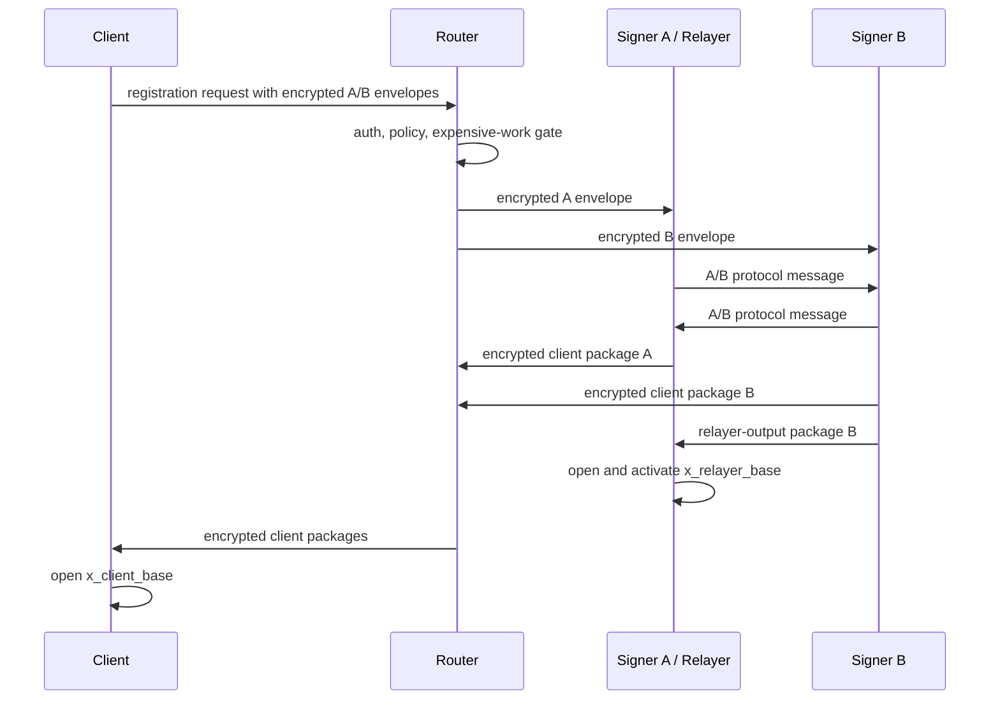
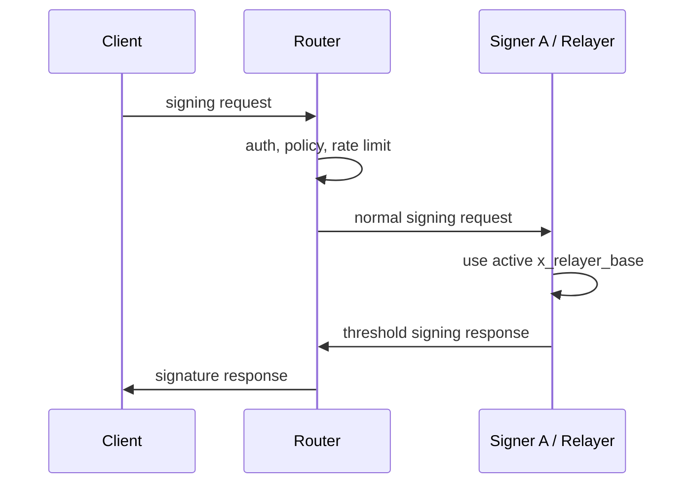
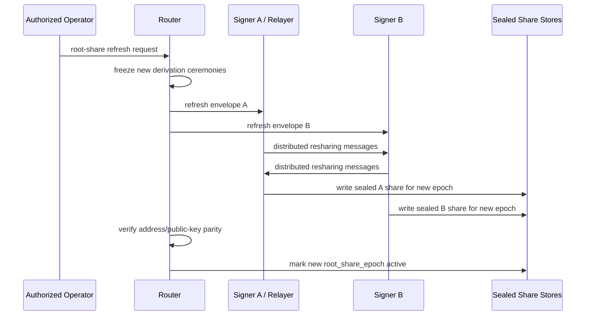

# Router A/B Signer Spec

Date created: June 11, 2026

Status: pre-implementation specification.

Related plan:
[docs/router-A-B-signer.md](/Users/pta/Dev/rust/simple-threshold-signer/docs/router-A-B-signer.md).

## Purpose

This spec records the security, protocol, lifecycle, observability, and release
gates for the Router A/B signer architecture before implementation starts.

The implementation plan lives in `docs/router-A-B-signer.md`. This file owns
the decisions that must be settled or explicitly gated before code can claim the
Router A/B security boundary.

## Protocol Decision Gates

### Gate 1: Split Derivation Primitive

Decision: `mpc_threshold_prf_v1` is the production primitive.

Reason: both candidates have the same current Router-facing round-trip shape,
and `mpc_threshold_prf_v1` is already sub-ms on the native proof path. Its
reuse of `threshold-prf` gives the clearer correctness-hardening,
refresh-continuity, and formal-verification path. The split-root candidate
remains comparison/prototype material until its root-generation, anti-bias,
refresh, and address-verification questions are resolved.

Candidates:

- **MPC threshold-PRF-to-shares.**
  - Keeps continuity with the current threshold-PRF root custody model.
  - Preserves the "same root, same wallet identity" story cleanly.
  - Requires more adapter, proof, and vector work than the split-root
    prototype.
- **New split root derivation.**
  - Likely faster if the construction naturally emits `y_A`, `y_B`, `tau_A`,
    and `tau_B`.
  - Better aligned with Router A/B as the native architecture.
  - Requires fresh cryptographic review and dedicated leakage analysis.

Release gates after selection:

- frozen canonical test vectors for `mpc_threshold_prf_v1`
- latency and byte-size estimates for setup/export/refresh
- one-party leakage analysis for A-side derived material
- one-party leakage analysis for B-side derived material
- review of what a leaked derived wallet share reveals about `k_org`
- proof or clear argument that no party opens joined `y_relayer` or
  `tau_relayer`
- address/public-key parity tests before and after root-share refresh
- decision on whether Candidate A DLEQ verification ships in the first
  production path or remains stronger hardening after Minimum Level C

Release rule: production Router A/B split derivation uses
`mpc_threshold_prf_v1`. `split_root_derivation_v1` must not be promoted without
fresh vectors, leakage analysis, root-generation review, anti-bias review, and
refresh/address-verification acceptance.

Experiment format:

```text
candidate_id:
  mpc_threshold_prf_to_shares | split_root_derivation_v1

inputs:
  signing_root_version
  root_share_epoch
  wallet_context
  signer_a_share
  signer_b_share
  derivation_version
  transcript_binding

outputs:
  y_a
  y_b
  tau_a
  tau_b
  public_commitments
  transcript_digest

measurements:
  native_cpu_ms
  wasm_cpu_ms
  message_count
  total_bytes
  estimated_a_b_round_trips

analysis:
  what A learns
  what B learns
  what a derived A share leak reveals
  what a derived B share leak reveals
  whether address identity is preserved after root-share refresh
```

Pass criteria:

- no participant opens joined `y_relayer` or `tau_relayer`
- one-party leakage is documented and accepted
- vectors are deterministic across native Rust and Wasm
- output shares feed the role-separated HSS API without joined-state adapters
- setup/export/refresh latency is within the target budget

### Gate 2: HSS Integration Boundary

Decision: create a new role-separated HSS API.

Do not adapt current joined-state APIs in production paths. The new API should
make Router A/B role separation explicit from the type boundary.

Allowed A/B API inputs:

- role-local root material
- role-local client material
- transcript metadata
- authenticated peer protocol messages
- request-kind-specific scope

Forbidden A/B API inputs and outputs:

- joined `d`
- joined `a`
- joined `y_relayer`
- joined `tau_relayer`
- joined `x_client_base`
- `DdhHssSharedWord`-style joined hidden words in production routes
- evaluator driver state that lets one server reconstruct protected values

Allowed outputs:

- encrypted client-output package share
- relayer-output package share
- public transcript digest
- typed redacted diagnostics

Release rule: production Router A/B code must use the role-separated API, with
source guards preventing imports of joined-state executor types.

Draft API shape:

```rust
pub struct RoleSeparatedHssInput<R> {
    pub role: R,
    pub transcript: TranscriptBinding,
    pub local_root_material: RoleLocalRootMaterial<R>,
    pub local_client_material: RoleLocalClientMaterial<R>,
    pub peer_messages: Vec<AuthenticatedPeerMessage>,
}

pub struct RoleSeparatedHssStepOutput<R> {
    pub role: R,
    pub peer_messages: Vec<AuthenticatedPeerMessage>,
    pub client_output_package: Option<EncryptedClientOutputPackage>,
    pub relayer_output_package: Option<RelayerOutputPackage>,
    pub transcript_digest: TranscriptDigest,
    pub diagnostics: RedactedCeremonyDiagnostics,
}

pub trait RoleSeparatedHssEngine<R> {
    fn advance(
        &mut self,
        input: RoleSeparatedHssInput<R>,
    ) -> Result<RoleSeparatedHssStepOutput<R>, HssRoleError>;
}
```

Forbidden imports in production Router A/B paths:

- `DdhHssSharedWord`
- `SplitLocalBitWord` where it can expose both local sides
- `DdhHiddenEvalProjectorInputs`
- evaluator driver state bytes for secret ceremony values
- current output-projector APIs that materialize joined client output state

### Gate 3: Relayer Placement

Decision: initial relayer is Signer A.

Initial topology:

```text
Registration/export/recovery/refresh:
  Client -> Router -> A and B
  A <-> B
  A activates x_relayer_base

Normal signing:
  Client -> Router -> A
```

Signer A is allowed to open `x_relayer_base`. Signer A must never open
`x_client_base`, joined `d`, joined `a`, joined `y_relayer`, or joined
`tau_relayer`.

Rationale:

- simplest product shape
- lowest normal-signing latency
- B is needed only for derivation-time ceremonies
- Router remains secret-light

Later hardening option: use a separate relayer service if operational separation
or customer requirements justify the extra deployment surface.

### Gate 4: Non-Circular Envelope Binding

Decision: implemented for canonical-byte construction. The derivation
transcript, request-context digest, Router replay digest, and strict
signer-envelope AAD bootstrap are non-circular. The strict signer bootstrap can
now derive typed signer-host preload coordinates, and signer Workers can load
trusted A/B peer verifying keys from role-local config. Router A/B v1 strict
proof-bundle delivery uses independent Router dispatch to Signer A and Signer B;
Router aggregation requires both signer responses for liveness.

The current field graph is too circular for real envelope construction:

```text
RoleEnvelopeAadV1.aad_digest
  depends on RoleEnvelopeAadV1.transcript_digest
  depends on RoleEnvelopeAadV1.router_request_digest

legacy router_transcript_digest_v1 shape
  depended on signer envelope digests
  depended on RoleEncryptedEnvelopeV1.aad_digest

PublicRouterRequestV1::router_replay_digest()
  depends on role envelopes
  depend on RoleEncryptedEnvelopeV1.aad_digest
```

That made it unclear which bytes are known when A/B signer envelopes are
encrypted. The implementation now splits public pre-envelope transcript context
from encrypted-envelope assignment metadata:

- `PublicRouterRequestContextV1::context_digest()` excludes transcript digest,
  role-envelope AAD digests, and ciphertext.
- `PublicRouterRequestContextV1::derivation_transcript_digest()` computes the
  HSS/output transcript digest before role envelopes are encrypted.
- `PublicRouterRequestV1` rejects supplied transcript digests that do not match
  the pre-envelope derivation transcript.
- Derivation `TranscriptBinding` binds signer-set id, signer index, role,
  signer identity, key epoch, quorum policy, selected relayer, client identity,
  client ephemeral key, and account context. It no longer binds encrypted
  envelope digests.
- `RouterEnvelopeDigestSetV1` carries encrypted-envelope digests only for
  Router-to-signer assignment validation.

Implemented fix:

- Add public `root_share_epoch` to the Router request scope. It is needed to
  compute derivation transcript bytes before signer-envelope encryption.
- Define `RouterRequestContextDigestV1` over public request fields that exclude
  role envelopes, role-envelope `aad_digest`, and ciphertext bytes. Use this
  digest inside signer-envelope AAD and signer plaintext.
- Define `DerivationTranscriptDigestV1` over lifecycle scope including
  `root_share_epoch`, signer set, selected relayer, client identity, client
  ephemeral public key, request kind, and `RouterRequestContextDigestV1`. This
  digest is known before encryption and is used inside signer plaintext,
  A/B proof batches, recipient proof bundles, and output package bindings.

Remaining release gates:

- Keep final `RouterReplayDigestV1` over the full public request, including
  encrypted role envelopes, for Router replay/idempotency storage only.
  Implemented as `PublicRouterRequestV1::router_replay_digest()`.
- Make signer private service bodies carry the exact typed AAD object supplied
  by Router, then require `aad.digest()` to match the envelope's public
  `aad_digest`. Implemented as
  `CloudflareSignerPrivateBootstrapRequestV1`.

Release rule: production vectors must show the complete order of operations for
creating A and B encrypted signer envelopes, computing transcript bytes,
computing Router replay bytes, and decrypting at each signer without any digest
fixed point.

## Threat Claim Matrix

| Compromise | Expected exposure | Required containment |
| --- | --- | --- |
| Router | public metadata, ciphertext, hashes, timings | no signer plaintext, no root shares, no output shares |
| Signer A | A custody material, A local derived material, `x_relayer_base` after activation | no B plaintext, no `x_client_base`, no joined `d` or `a` |
| Signer B | B custody material, B local derived material | no A plaintext, no `x_relayer_base` unless B is configured as relayer, no joined `d` or `a` |
| A and B | server-side custody may be compromised | incident response may require root replacement or wallet migration |
| Relayer role in Signer A | `x_relayer_base` | no `k_org`, no joined `y_relayer`, no joined `d`, no `x_client_base` |
| Client | that user's client output path and local material | no server root material, no `y_relayer`, no `tau_relayer` |
| A storage or KEK only | A sealed/plain share according to the key boundary | no B share, no joined root |
| B storage or KEK only | B sealed/plain share according to the key boundary | no A share, no joined root |
| Logs/observability | public metadata, hashes, state transitions, timings | no protocol payload plaintext |

Claim language for initial release:

```text
Router A/B Level C prevents a single production server process from holding
joined d, a, x_client_base, y_relayer, or tau_relayer during derivation-time
ceremonies, assuming the role-separated protocol boundary is followed.
```

Avoid claiming full malicious-secure MPC. Minimum Level C does not prevent
denial of service, aborts, malformed messages, or all active correctness
attacks.

## Derivation Ceremony State Machine

Use one `DerivationCeremony` lifecycle with request-kind-specific scope.

Request kinds:

- `registration`
- `key_export`
- `recovery`
- `relayer_share_refresh`

Suggested state model:

```rust
pub enum DerivationCeremony {
    Created(CreatedCeremony),
    Admitted(AdmittedCeremony),
    AEnvelopeForwarded(AEnvelopeForwardedCeremony),
    BEnvelopeForwarded(BEnvelopeForwardedCeremony),
    AbRunning(AbRunningCeremony),
    ClientOutputReady(ClientOutputReadyCeremony),
    RelayerOutputReady(RelayerOutputReadyCeremony),
    Activated(ActivatedCeremony),
    Failed(FailedCeremony),
    Expired(ExpiredCeremony),
    Abandoned(AbandonedCeremony),
}
```

Required common scope:

- `request_id`
- `protocol_version`
- `request_kind`
- `account_id`
- `session_id`
- `org_id`
- `project_id`
- `environment_id`
- `signing_root_id`
- `signing_root_version`
- `root_share_epoch`
- signer A identity and key epoch
- signer B identity and key epoch
- relayer identity and key epoch
- client ephemeral public key
- transcript nonce
- expiry

State rules:

- `Created` has parsed public metadata and encrypted-envelope digest metadata.
- `Admitted` has an accepted or reused expensive-work gate decision.
- `AbRunning` has both signer envelopes forwarded and peer identities pinned.
- `ClientOutputReady` can expose only encrypted client-output packages.
- `RelayerOutputReady` can expose only relayer-output packages.
- `Activated` is valid only after the designated relayer opens and records
  `x_relayer_base`.
- terminal states are `Activated`, `Failed`, `Expired`, and `Abandoned`.
- stale, expired, or wrong-epoch messages must fail closed.

The Router persists only public lifecycle state, hashes, transcript digests,
timings, and error codes.

Transition table:

| From | Event | To | Actor | Persisted fields |
| --- | --- | --- | --- | --- |
| none | create request | `Created` | Router | public metadata, encrypted-envelope digests, expiry |
| `Created` | gate accepted | `Admitted` | Router | gate decision, request id |
| `Created` | gate reused | `Admitted` | Router | reused lifecycle id |
| `Created` | gate rejected | `Failed` | Router | redacted error code |
| `Admitted` | forward A envelope | `AEnvelopeForwarded` | Router | A envelope digest, A signer id |
| `AEnvelopeForwarded` | forward B envelope | `BEnvelopeForwarded` | Router | B envelope digest, B signer id |
| `BEnvelopeForwarded` | A/B protocol starts | `AbRunning` | A or B | public transcript digest |
| `AbRunning` | client packages ready | `ClientOutputReady` | A and B | encrypted package hashes |
| `ClientOutputReady` | relayer packages ready | `RelayerOutputReady` | A and B | relayer package hashes |
| `RelayerOutputReady` | relayer activates | `Activated` | Signer A relayer role | activation hash, public transcript digest |
| any nonterminal | expiry reached | `Expired` | Router | expiry reason |
| any nonterminal | user cancels | `Abandoned` | Router | abandon reason |
| any nonterminal | protocol error | `Failed` | Router, A, or B | redacted error code |

Invalid transitions must be rejected at the type boundary where practical and
at the parser/store boundary for persisted records.

## Transcript Binding Spec

Every encrypted envelope, A/B protocol message, output package, relayer
activation, and signer response must bind to the same transcript.

Minimum transcript fields:

- `protocol_version`
- `request_kind`
- `request_id`
- `account_id`
- `session_id`
- `org_id`
- `project_id`
- `environment_id`
- `signing_root_id`
- `signing_root_version`
- `root_share_epoch`
- signer A identity
- signer A key epoch
- signer B identity
- signer B key epoch
- relayer identity
- relayer key epoch
- client ephemeral public key
- Router request digest
- transcript nonce
- expiry

Signer-envelope AAD and transcript bytes must be non-circular. Any digest used
inside signer-envelope AAD must be computable before the envelope's
`aad_digest`, ciphertext, or encrypted-envelope digest is computed. The
full Router replay/idempotency digest may bind final envelope bytes, but that
digest must not be required to create those same envelope bytes.

Request-kind-specific bindings:

- registration intent grant and digest
- auth method intent: Passkey or Email OTP
- expected origin and RP ID
- normalized account or wallet id
- key purpose, key version, derivation version, and participant ids
- recovery/export policy identifiers where applicable

Canonical encoding:

- transcript hashes bind canonical inner bytes
- JSON may be used for outer product APIs
- acceptable canonical encodings: CBOR, Borsh, postcard, or a custom versioned
  encoding with fixed field ordering and length rules
- no transcript digest may depend on `JSON.stringify` field ordering

Rotation rule: signer key rotation, relayer rotation, root-share refresh, and
protocol version changes must change transcript-bound epochs or versions.

Canonical encoding decision:

- implementation may start with Borsh for the Rust-first skeleton
- final protocol freeze requires cross-host vectors that TypeScript can verify
- if Borsh TypeScript support is insufficient, move to deterministic CBOR with
  strict canonical settings before production vectors are frozen

The canonical encoding choice is allowed to change during Phase 0A. After the
first production vector set is accepted, changing encoding requires a protocol
version bump.

## Rust Type Appendix

These types are intentionally close to compilable Rust. Opaque byte wrappers
should be newtypes, not raw `Vec<u8>` aliases, in the actual implementation.

```rust
pub enum Role {
    Router,
    SignerA,
    SignerB,
    Relayer,
    Client,
}

pub enum RequestKind {
    Registration,
    KeyExport,
    Recovery,
    RelayerShareRefresh,
}

pub struct SignerIdentity {
    pub role: Role,
    pub signer_id: SignerId,
    pub key_epoch: SignerKeyEpoch,
    pub verifying_key: PublicKeyBytes,
}

pub struct TranscriptBinding {
    pub protocol_version: ProtocolVersion,
    pub request_kind: RequestKind,
    pub request_id: RequestId,
    pub account_id: AccountId,
    pub session_id: SessionId,
    pub org_id: OrgId,
    pub project_id: ProjectId,
    pub environment_id: EnvironmentId,
    pub signing_root_id: SigningRootId,
    pub signing_root_version: SigningRootVersion,
    pub root_share_epoch: RootShareEpoch,
    pub signer_a: SignerIdentity,
    pub signer_b: SignerIdentity,
    pub relayer: SignerIdentity,
    pub client_ephemeral_public_key: PublicKeyBytes,
    pub router_request_digest: DigestBytes,
    pub transcript_nonce: NonceBytes,
    pub expires_at_ms: UnixMillis,
}

pub struct EncryptedSignerEnvelope<R> {
    pub role: R,
    pub transcript_digest: TranscriptDigest,
    pub aad_digest: DigestBytes,
    pub ciphertext: CiphertextBytes,
}

pub enum AbProtocolMessage {
    AToB(AuthenticatedPeerMessage<SignerARole, SignerBRole>),
    BToA(AuthenticatedPeerMessage<SignerBRole, SignerARole>),
}

pub struct EncryptedClientOutputPackage {
    pub transcript_digest: TranscriptDigest,
    pub output_kind: ClientOutputKind,
    pub recipient_client_key: PublicKeyBytes,
    pub ciphertext: CiphertextBytes,
}

pub struct RelayerOutputPackage {
    pub transcript_digest: TranscriptDigest,
    pub output_kind: RelayerOutputKind,
    pub recipient_relayer: SignerIdentity,
    pub package_bytes: CanonicalBytes,
}

pub enum ExpensiveWorkGateDecision {
    Accepted { request_id: RequestId },
    ReuseExisting { request_id: RequestId, lifecycle_id: CeremonyId },
    Defer { reason: DeferReason },
    Rejected { reason: RejectReason, retry_after_ms: u64 },
}
```

Role marker types should make invalid engine calls unrepresentable:

```rust
pub enum SignerARole {}
pub enum SignerBRole {}

pub type SignerAEnvelope = EncryptedSignerEnvelope<SignerARole>;
pub type SignerBEnvelope = EncryptedSignerEnvelope<SignerBRole>;
```

## Host Trait Appendix

The platform-agnostic engines depend on host traits. Cloudflare, local test
servers, and future TypeScript/Wasm hosts supply implementations.

```rust
pub trait Clock {
    fn now_ms(&self) -> UnixMillis;
}

pub trait Csprng {
    fn fill_random(&mut self, out: &mut [u8]) -> Result<(), HostError>;
}

pub trait SignerKeyStore {
    fn signer_identity(&self, role: Role) -> Result<SignerIdentity, HostError>;
    fn decrypt_envelope_key(&self, role: Role) -> Result<KeyBytes, HostError>;
    fn sign_transcript(&self, digest: TranscriptDigest) -> Result<SignatureBytes, HostError>;
}

pub trait SigningRootShareStore {
    fn load_role_share(
        &self,
        role: Role,
        root: SigningRootRef,
    ) -> Result<SealedSigningRootShare, HostError>;
}

pub trait PeerTransport {
    fn send_peer_message(
        &self,
        peer: SignerIdentity,
        message: AbProtocolMessage,
    ) -> Result<AbProtocolMessage, HostError>;
}

pub trait RelayerStateStore {
    fn activate_relayer_output(
        &self,
        transcript: TranscriptDigest,
        package: RelayerOutputPackage,
    ) -> Result<RelayerActivationReceipt, HostError>;
}

pub trait AuditSink {
    fn record(&self, event: RedactedCeremonyDiagnostics) -> Result<(), HostError>;
}

pub trait SignerHost:
    Clock + Csprng + SignerKeyStore + SigningRootShareStore + PeerTransport + AuditSink
{
}

pub trait RelayerHost: Clock + RelayerStateStore + AuditSink {}
```

Host implementations must not expose decrypted payloads to logging or diagnostics
interfaces.

## Cloudflare Adapter Appendix

`crates/router-ab-cloudflare` owns Cloudflare-specific binding descriptors and
startup validation. The first layer is intentionally independent of
`workers-rs`; the later Worker entrypoints parse `worker::Env` into these typed
descriptors.

The optional `workers-rs` feature pins `worker = 0.8.4`. The Worker bridge
requires Rust 1.88 or newer because the current Workers SDK dependency graph
includes `wasm-streams` 0.6.x. `CloudflareWorkerEnvReaderV1` adapts real
`worker::Env` text vars to the typed parser.
`parse_cloudflare_worker_bindings_from_worker_env_v1` then checks runtime
presence of every configured Durable Object namespace and service binding before
returning accepted startup descriptors.

### Production A/B Orchestration Gate

Strict server-blind production uses recipient-side combine. A and B return only
recipient-scoped proof-batch material: the client receives only `x_client_base`
proof bundles, and the designated relayer receives only `x_relayer_base` proof
bundles. Each recipient combines its own output locally.

The decrypted strict delivery payload is `RecipientProofBundlePayloadV1`. The
public wire payload for `WireMessageKindV1::RecipientProofBundle` is
`RecipientProofBundleCiphertextV1`. The decrypted payload binds:

- lifecycle id
- producing signer identity
- recipient role
- opened-share kind
- recipient identity
- transcript digest
- nested `AbDerivationProofBatchPayloadV1`

The nested proof batch must contain exactly one proof bundle. The one bundle's
binding must match the declared recipient role, opened-share kind, recipient
identity, transcript digest, and producing signer identity.

`RecipientProofBundleCiphertextV1` encrypts the canonical proof-bundle payload
to the final recipient. Its AAD binds:

- algorithm
- producing signer identity
- recipient role
- opened-share kind
- recipient identity
- recipient encryption key
- transcript digest
- payload digest
- nonce

The Cloudflare adapter uses HPKE base mode with X25519, HKDF-SHA256, and
AES-256-GCM for this proof-bundle envelope.

The preloaded synchronous signer host remains an adapter-test boundary and a
weaker deployment-profile building block. It must not satisfy the strict
server-blind release gate because it combines final output packages inside a
signer process.

Alternative orchestration profiles:

- **Encrypted rendezvous:** A and B use a transcript-scoped rendezvous, such as
  a Durable Object, and encrypt peer bundles to the specific peer or final
  recipient. This keeps Router opaque and adds timeout, replay, cleanup, and
  equivocation rules.
- **Signer-side combine:** A or B combines proof batches and emits final output
  packages. This is the simplest path and matches the preloaded test handler,
  but it is a weaker deployment profile unless the combiner runs inside a
  separately trusted boundary.

Live direct-peer coordination requires more than an authenticated peer message.
The recipient signer also needs its own Router-to-signer encrypted envelope,
role-envelope AAD, request-context digest, root-share metadata, and root-share
wire before it can produce its proof batch. The deployable strict path must
choose either transcript-scoped rendezvous for both role-specific private
bootstraps or independent Router dispatch to A and B with direct A/B used only
as a transcript/liveness check.

Strict release gates:

- The client path must reject any relayer-output proof bundle.
- The relayer path must reject any client-output proof bundle.
- Router may relay opaque bundles, but it must not decrypt them or combine
  recipient outputs.
- Strict production delivery must use `RecipientProofBundleCiphertextV1` or a
  later encrypted version, and the decrypted payload must preserve the same
  one-recipient invariant.
- Signer-side combine must have its own release profile and must not satisfy the
  strict server-blind release gate.

Durable Object scopes:

```rust
pub enum CloudflareDurableObjectScopeV1 {
    RouterReplay,
    RouterLifecycle,
    RouterProjectPolicy,
    RouterQuota,
    RouterAbuse,
    SignerRootShare { role: Role },
    RelayerOutput { owner_role: Role },
}
```

Visibility rules:

| Worker | Allowed Durable Object scopes |
| --- | --- |
| Router | `RouterReplay`, `RouterLifecycle`, `RouterProjectPolicy`, `RouterQuota`, `RouterAbuse` |
| Signer A/Relayer | `SignerRootShare { role: SignerA }`, `RelayerOutput { owner_role: SignerA }` |
| Signer B | `SignerRootShare { role: SignerB }` |

Signer-envelope key-source rules:

Production signer envelopes use public-key HPKE. Clients encrypt the Signer A
and Signer B envelopes to signer role public envelope keys. The selected public
key epoch is bound into the request transcript and role-envelope AAD. Daily key
rotation is acceptable when each signer keeps current and previous private
decrypt keys only through request TTL plus retry grace, then rejects stale
epochs.

Implemented production metadata:

- `SignerEnvelopeHpkePayloadV1` canonical bytes bind recipient role, key epoch,
  recipient public key, role-envelope AAD digest, HPKE encapsulated X25519 key,
  and ciphertext/tag bytes before any platform decrypt.
- `CloudflareSignerEnvelopeHpkePublicKeyV1`,
  `CloudflareSignerEnvelopeHpkePublicKeySetV1`, and
  `CloudflareSignerEnvelopeHpkeDecryptKeyBindingV1` validate signer role,
  canonical `x25519:<64 lowercase hex chars>` public-key encoding, key epoch,
  and role-local private binding visibility.
- Cloudflare Router and opposite-signer startup guards reject HPKE private-key
  binding Env keys.
- `router-ab-cloudflare` exposes native signer-envelope HPKE seal/open helpers
  and a `workers-rs` HPKE Secret-loading decrypt wrapper. The wrapper decodes a
  versioned private-key Secret, validates public HPKE payload metadata, checks
  the supplied AAD digest, and then calls HPKE open.
- Strict Signer A/B Worker startup bindings and decrypt-and-handle paths use
  the HPKE decrypt-key descriptor and HPKE open wrapper.

Signer-envelope HPKE private-key source rules:

| Worker | Allowed signer-envelope Secret bindings |
| --- | --- |
| Router | none |
| Signer A/Relayer | `SIGNER_A_ENVELOPE_HPKE_PRIVATE_KEY` only |
| Signer B | `SIGNER_B_ENVELOPE_HPKE_PRIVATE_KEY` only |

Direct A/B peer-message signing key-source rules:

| Worker | Allowed peer-message signing Secret bindings |
| --- | --- |
| Router | none |
| Signer A/Relayer | `SIGNER_A_PEER_SIGNING_KEY` only |
| Signer B | `SIGNER_B_PEER_SIGNING_KEY` only |

Direct A/B peer-message verifying key-source rules:

| Worker | Allowed peer-message verifying keys |
| --- | --- |
| Router | optional public config only |
| Signer A/Relayer | `SIGNER_A_PEER_VERIFYING_KEY_HEX`, `SIGNER_B_PEER_VERIFYING_KEY_HEX` |
| Signer B | `SIGNER_A_PEER_VERIFYING_KEY_HEX`, `SIGNER_B_PEER_VERIFYING_KEY_HEX` |

The Cloudflare parser receives public key-source descriptors and public
verifying-key bytes:

```text
SIGNER_A_ENVELOPE_HPKE_PRIVATE_KEY_BINDING
SIGNER_A_ENVELOPE_HPKE_KEY_EPOCH
SIGNER_A_ENVELOPE_HPKE_PUBLIC_KEY
SIGNER_B_ENVELOPE_HPKE_PRIVATE_KEY_BINDING
SIGNER_B_ENVELOPE_HPKE_KEY_EPOCH
SIGNER_B_ENVELOPE_HPKE_PUBLIC_KEY
SIGNER_A_PEER_SIGNING_KEY_BINDING
SIGNER_A_PEER_SIGNING_KEY_EPOCH
SIGNER_B_PEER_SIGNING_KEY_BINDING
SIGNER_B_PEER_SIGNING_KEY_EPOCH
SIGNER_A_PEER_VERIFYING_KEY_HEX
SIGNER_B_PEER_VERIFYING_KEY_HEX
```

For the production HPKE path, `*_PRIVATE_KEY_BINDING` names a role-local
Cloudflare Secret binding containing the HPKE private key material. The paired
`*_PUBLIC_KEY` is public `x25519:<64 lowercase hex chars>` metadata and
`*_KEY_EPOCH` is public rotation metadata. Router may receive public keys and
key epochs. Router must reject private-key binding Env keys, and each signer
must reject the other signer's private-key binding Env key.

The HPKE private-key Secret text format is:

```text
hpke-x25519-private-v1:<64 lowercase hex chars>
```

The 32 decoded bytes must parse as `hpke-ng` X25519 private-key bytes. The
runtime rejects unsupported prefixes, malformed hex, wrong lengths, and private
key parse errors before attempting HPKE open.

For peer signing keys, `*_BINDING` names a Cloudflare Secret containing an
unpadded base64url Ed25519 signing seed of exactly 32 bytes. `*_EPOCH` must
match the sender `SignerIdentityV1.key_epoch` before the Worker signs a peer
message.

Production signer-envelope ciphertext uses a strict public HPKE payload wrapper
inside the outer `EncryptedPayloadV1`:

```text
lp("router-ab-protocol/signer-envelope-hpke/v1")
lp("hpke-x25519-hkdf-sha256-aes256gcm/v1")
lp(recipient_role)
lp(key_epoch)
lp(recipient_public_key)
lp(aad_digest[32])
lp(encapped_key[32])
u32be(tag_len = 16)
lp(ciphertext || tag)
```

The parser must reject unsupported versions or algorithms, non-signer recipient
roles, empty key epochs, malformed recipient public-key encodings, AAD digest
mismatches with the outer envelope, key epoch mismatches with the role-local
decrypt-key descriptor, public-key mismatches with the role-local descriptor,
non-32-byte encapsulated keys, non-128-bit tags, tag-only payloads, and trailing
bytes. Platform decryptors pass `encapped_key`, canonical AAD bytes, and
`ciphertext || tag` to HPKE open, then feed decrypted bytes into the
post-decrypt `SignerInputPlaintextV1` validation boundary.

Startup validation must reject:

- Router bindings that include signer root-share or relayer-output scopes
- Router bindings that include Signer A or Signer B envelope-key descriptors
- Signer A bindings that include Signer B root-share scopes
- Signer A bindings that include Signer B envelope-key descriptors
- Signer B bindings that include Signer A root-share or relayer-output scopes
- Signer B bindings that include Signer A envelope-key descriptors
- relayer-output scopes owned by any role except Signer A in v1
- root-share startup checks whose signer role differs from the Worker role

Durable Object operations should be explicit Router A/B operations:

```text
root_share.has
root_share.startup_metadata
router_replay.reserve
router_lifecycle.put_public_state
relayer_output.activate
```

The Cloudflare adapter owns typed request and response structs for these
operations. `CloudflareDurableObjectCallV1` binds the initiating Worker role,
the validated Durable Object binding descriptor, and the typed operation body.
It rejects calls whose operation requires a different storage scope or whose
Worker role cannot see the binding. The `workers-rs` executor posts the typed
operation JSON to the Durable Object stub selected by `binding.object_name` and
validates that the typed response branch matches the request before returning.

Generic key/value Durable Object access can exist inside the adapter
implementation, while Router A/B host traits should receive typed operations and
typed responses.

## Endpoint And Wire Examples

Outer JSON examples are illustrative. Transcript hashes bind canonical inner
bytes, represented here as base64url strings.

Registration prepare:

```json
{
  "protocol_version": "router_ab_v1",
  "request_kind": "registration",
  "account_id": "acct_123",
  "session_id": "sess_123",
  "transcript_nonce": "b64u_nonce",
  "expires_at_ms": 1781190000000,
  "client_ephemeral_public_key": "b64u_key",
  "a_envelope_b64u": "b64u_canonical_encrypted_a",
  "b_envelope_b64u": "b64u_canonical_encrypted_b"
}
```

Router response:

```json
{
  "request_id": "req_123",
  "protocol_version": "router_ab_v1",
  "request_kind": "registration",
  "account_id": "acct_123",
  "session_id": "sess_123",
  "public_transcript_digest_b64u": "b64u_digest",
  "a_client_package_b64u": "b64u_ciphertext",
  "b_client_package_b64u": "b64u_ciphertext",
  "state": "client_output_ready"
}
```

Relayer-share refresh uses the same outer shape with:

```json
{
  "request_kind": "relayer_share_refresh",
  "a_envelope_b64u": "b64u_canonical_encrypted_a_refresh",
  "b_envelope_b64u": "b64u_canonical_encrypted_b_refresh"
}
```

Normal signing after activation:

```text
Client -> Router -> Signer A relayer role
```

Normal signing does not invoke Signer B and does not unwrap signing-root shares.

## Source Guard Spec

Add source guards for these boundaries:

| Boundary | Forbidden |
| --- | --- |
| Router production code | signer plaintext modules, signer decrypt keys, joined HSS executor types |
| Signer A routes | B plaintext input, B-only envelope decrypt helpers |
| Signer B routes | A plaintext input, A-only envelope decrypt helpers |
| Cloudflare adapters | HSS joined-state APIs, output projector APIs that materialize `x_client_base` |
| Logging/diagnostics | protocol payload types, root shares, output shares |
| Relayer activation | client-output packages, client-output decrypt helpers |

Guard tests should fail on imports, route input types, and logging function
signatures. Prefer allowlists for role modules over broad deny-only grep rules
where possible.

## Output Correctness Levels

### Initial Release: Minimum Level C

Decision: implement Minimum Level C first.

Required:

- Router opacity
- role-specific signer envelopes
- A-only and B-only plaintext boundaries
- transcript binding
- output-kind checks
- downgrade rejection for clients requiring split derivation
- no single server process materializes joined `d`, `a`, `x_client_base`,
  `y_relayer`, or `tau_relayer`
- client opens only `x_client_base`
- Signer A's relayer role opens only `x_relayer_base`

Known limitation:

- a malicious A or B can abort
- a malicious A or B may try to cause bad output
- stronger output correctness needs additional public relation checks,
  commitments, proofs, or verifying-share binding

### Later Hardening: Strong Output Correctness

Subject to performance and product need, add:

- public verifying-share binding
- commitments to output shares
- relation checks against known account public key and client verifying share
- proofs or equivalent checks for A/B protocol messages
- stronger replay and equivocation evidence

Release rule: do not block the first Router A/B implementation on strong output
correctness, but keep transcript and package formats extensible enough to add
it without replacing the whole protocol.

## Observability And Redaction Policy

Recommendation: source guards plus typed redacted diagnostics.

Allowed logs and metrics:

- request id
- request kind
- public transcript digest
- state transition
- role
- signer key epoch
- root-share epoch
- payload hash
- timing
- queue wait
- error code
- redacted failure class

Forbidden logs and metrics:

- decrypted signer envelopes
- A/B protocol payload plaintext
- root shares
- `y_A`, `y_B`, `tau_A`, `tau_B`
- joined `y_relayer` or `tau_relayer`
- joined `d` or `a`
- output shares
- `x_client_base`
- `x_relayer_base`
- OT labels, evaluator driver state, joined hidden words

Typed diagnostics:

```rust
pub struct RedactedCeremonyDiagnostics {
    pub request_id: RequestId,
    pub request_kind: RequestKind,
    pub transcript_digest: TranscriptDigest,
    pub role: Option<Role>,
    pub state: CeremonyStateName,
    pub root_share_epoch: RootShareEpoch,
    pub signer_key_epochs: SignerKeyEpochs,
    pub timings: CeremonyTimings,
    pub error: Option<RedactedErrorCode>,
}
```

Source guards must fail when production logging paths accept protocol payload
types rather than redacted diagnostics.

## Local And Production Parity

Recommendation: strict parity from day one.

Local simulation must use:

- separate Router, Signer A/Relayer, and Signer B processes
- separate env files
- separate role keys
- role-specific sealed shares
- the same canonical wire protocol as production
- the same transcript binding rules
- the same output-kind checks

Local shortcuts allowed:

- local HTTP transport instead of Cloudflare Service Bindings
- deterministic dev output shares before the real split derivation primitive
- local Postgres for signing-root metadata and sealed shares

Local shortcuts forbidden:

- Router has signer decrypt keys
- A has B-only keys or B-only plaintext types
- B has A-only keys or A-only plaintext types
- one local process combines joined `d`, `a`, or `x_client_base`
- local-only wire encoding that differs from production

## Rust/Wasm Bundle Discipline

Recommendation: separate bundles per role and measure every release candidate.

Required measurements:

- Router compressed Worker size
- Signer A/Relayer compressed Worker size
- Signer B compressed Worker size
- optional separate Relayer compressed Worker size if that split is enabled
- uncompressed size for each Worker
- Wrangler `startup_time_ms` for each Worker
- setup/export/refresh CPU time
- normal signing CPU time

Targets:

```text
excellent startup_time_ms: < 100 ms
acceptable startup_time_ms: 100-300 ms
risky startup_time_ms: 300-700 ms
unacceptable startup_time_ms: approaching 1000 ms
```

Implementation rules:

- keep Router dependencies narrow
- keep Router, A/Relayer, and B as separate Worker bundles
- avoid expensive global-scope initialization
- run expensive derivation inside request handlers
- use release size optimizations and `wasm-opt`
- track size and startup in benchmark artifacts

Current local release artifacts, captured June 12, 2026:

```text
command:
  cargo build --manifest-path crates/router-ab-cloudflare/Cargo.toml \
    --target wasm32-unknown-unknown \
    --features <entrypoint-feature> \
    --release

artifact:
  crates/router-ab-cloudflare/target/wasm32-unknown-unknown/release/router_ab_cloudflare.wasm

profile:
  role-specific strict Worker entrypoint features
  no wasm-opt pass
  no Wrangler bundling pass

sizes:
  strict-worker-entrypoint          combined role dispatch  2,370,450 bytes  gzip 671,138 bytes
  strict-worker-router-entrypoint   Router                  1,836,346 bytes  gzip 487,682 bytes
  strict-worker-signer-a-entrypoint Signer A/Relayer        2,126,483 bytes  gzip 614,303 bytes
  strict-worker-signer-b-entrypoint Signer B                1,990,085 bytes  gzip 577,469 bytes
```

Current optimized `worker-build` and Wrangler dry-run artifacts, captured
June 12, 2026:

```text
commands:
  pnpm -C crates/router-ab-cloudflare measure:strict-workers
  pnpm -C crates/router-ab-cloudflare dry-run:router
  pnpm -C crates/router-ab-cloudflare dry-run:signer-a
  pnpm -C crates/router-ab-cloudflare dry-run:signer-b

profile:
  worker-build 0.8.4 release
  wasm-opt@130 through worker-build
  wrangler 4.40.3 deploy --dry-run
  deployment-shaped per-role Wrangler configs with Durable Object and Service
  Binding entries

optimized worker-build wasm:
  strict-worker-entrypoint          combined role dispatch  1,505,206 bytes  gzip 561,307 bytes
  strict-worker-router-entrypoint   Router                  1,066,608 bytes  gzip 380,786 bytes
  strict-worker-signer-a-entrypoint Signer A/Relayer        1,321,089 bytes  gzip 498,834 bytes
  strict-worker-signer-b-entrypoint Signer B                1,252,900 bytes  gzip 479,720 bytes

wrangler dry-run Total Upload:
  Router           1088.52 KiB  gzip 381.52 KiB
  Signer A/Relayer 1340.19 KiB  gzip 497.55 KiB
  Signer B         1273.60 KiB  gzip 478.68 KiB
```

`startup_time_ms` remains a release gate. The current Wrangler files include
DO classes, migrations, and Service Bindings; production still needs real
verifying-key values, Cloudflare secrets under the configured secret binding
names, and route/account selection.

Current native Router adapter CPU baseline, captured June 12, 2026:

```text
command:
  cargo bench --manifest-path crates/router-ab-cloudflare/Cargo.toml \
    --bench router_latency -- \
    --sample-size 10 --warm-up-time 0.1 --measurement-time 0.2

profile:
  native aarch64-apple-darwin Criterion smoke pass
  Router admission-provider derivation
  Router replay/lifecycle plan execution
  simulated A/B coordination via repeated JSON and canonical wire passes
  no Cloudflare runtime, Service Binding, or network latency

latency:
  1 simulated A/B round trip   62.882 us median
  2 simulated A/B round trips  82.568 us median
  3 simulated A/B round trips 102.72 us median
  4 simulated A/B round trips 123.85 us median
```

## Recovery And Migration Gates

Recommendation: address verification is a release gate before production root
rotation.

Required vectors and checks:

- before root-share refresh
- after root-share refresh
- after relayer-share refresh
- after self-host export/import
- after signer key rotation
- after relayer identity rotation

Root-share refresh must prove:

- same signing root
- new root-share epoch
- same account public keys or wallet addresses
- old epoch retired only after rollback window and evidence export

Self-host export/import must prove:

- artifact checksum verifies
- imported shares derive the same wallet identities
- hosted signing is disabled after customer verification
- hosted shares are deleted or retired with audit evidence

## Test Vector Manifest

Every vector file should be deterministic and cross-host verifiable.

```json
{
  "vector_version": "router_ab_vector_v1",
  "case_id": "registration_min_level_c_valid_001",
  "protocol_version": "router_ab_v1",
  "request_kind": "registration",
  "canonical_encoding": "borsh",
  "transcript_inputs": {
    "request_id": "req_123",
    "account_id": "acct_123",
    "session_id": "sess_123",
    "signing_root_version": "1",
    "root_share_epoch": "1",
    "signer_a_key_epoch": "1",
    "signer_b_key_epoch": "1",
    "relayer_key_epoch": "1"
  },
  "canonical_transcript_bytes_b64u": "b64u_bytes",
  "transcript_digest_b64u": "b64u_digest",
  "a_envelope_digest_b64u": "b64u_digest",
  "b_envelope_digest_b64u": "b64u_digest",
  "expected_state": "activated",
  "expected_rejections": []
}
```

Rejection vectors should include:

- wrong signer role
- wrong signer key epoch
- expired transcript
- replayed nonce
- client-output package sent to relayer
- relayer-output package sent to client
- mismatched root-share epoch
- mismatched registration intent digest

## Architecture Examples

Registration and relayer activation:



Normal signing:



Root-share refresh:



## Release Gates And Test Vectors

Required before local simulation is considered complete:

- canonical wire vectors
- transcript binding vectors
- wrong-role rejection tests
- output-kind rejection tests
- Router opacity tests
- redacted diagnostics tests

Required before Cloudflare prototype is considered complete:

- same vectors pass through `workers-rs` adapters
- separate local and Cloudflare role env checks pass
- rejected gate decisions do not reach Signer A or Signer B
- size and `startup_time_ms` recorded for all role Workers
- setup/export/refresh latency recorded for 1, 2, 3, and 4 A/B round trips

Required before real split derivation is considered complete:

- chosen primitive has vectors and leakage analysis
- address/public-key parity passes across root-share refresh
- no joined-state source guards pass
- local and Cloudflare paths produce identical transcript digests

Required before production root rotation:

- address verification passes before and after refresh
- relayer-share refresh is tested
- rollback behavior is tested
- old epoch retirement is tested
- audit evidence export is tested

Required before production recipient-output encryption:

- selected HPKE implementation is `hpke-ng = "=0.1.0"` with default features
  disabled, and it compiles for native tests and `wasm32-unknown-unknown`
- native RFC 9180 AES-256-GCM base-mode open vector passes
- deterministic seal vectors and a Wasm vector pass exist
  for `hpke_x25519_hkdf_sha256_aes256gcm_v1`
- adapter rejects malformed `x25519:<64 lowercase hex chars>` recipient keys
- ciphertext AAD matches `encode_recipient_output_ciphertext_aad_v1`
- client and relayer decryption tests reject wrong transcript, wrong recipient,
  wrong opened-share kind, and modified package commitments
- AES-256-GCM constant-time posture is established for the Cloudflare Wasm
  target, or a ChaCha20-Poly1305 HPKE suite is introduced as a new protocol
  algorithm before production use
- direct `hpke = "=0.14.0-pre.2"` remains deferred unless its pre-release
  transitive graph is pinned and reviewed; the first local evaluation failed in
  `sha3-0.11.0-rc.7`

## Phased Todo List

### Phase 0: Spec Freeze Gates

- [x] Compare MPC threshold-PRF-to-shares against new split root derivation.
- [x] Produce candidate vectors for both split derivation approaches.
- [x] Record one-party leakage analysis for A-side and B-side material.
- [x] Choose the canonical wire encoding for Phase 1 vectors.
- [x] Freeze Minimum Level C claim language.
- [x] Freeze the role-separated HSS API shape.
- [x] Freeze the `DerivationCeremony` lifecycle and transition table.
- [x] Define source guards for joined-state imports and logging payload types.

### Phase 1: Protocol Skeleton

- [x] Create `crates/router-ab-core`.
- [x] Add role marker types and role-specific envelope aliases.
- [x] Add `RequestKind`, `TranscriptBinding`, signer identity, root epoch, and
  request id types.
- [x] Add canonical encode/decode helpers.
- [x] Add transcript digest construction.
- [x] Resolve non-circular canonical bytes for signer-envelope AAD, transcript
      digest, and Router replay digest.
  - [x] Add public root-share epoch to Router request scope and payload vectors.
  - [x] Add pre-envelope request-context digest for AAD/plaintext.
  - [x] Add pre-envelope derivation transcript digest for HSS/output bindings.
  - [x] Keep full-envelope replay digest scoped to Router storage.
  - [x] Add strict signer bootstrap body carrying typed AAD from Router.
- [x] Add `DerivationCeremony` lifecycle types.
- [x] Add host traits for clock, RNG, keys, share storage, peer transport,
  relayer state, and audit.
- [x] Add redacted diagnostics types.

### Phase 2: Wire Vectors And Type Guards

- [x] Add canonical transcript vectors.
- [x] Add valid registration, export, recovery, and relayer-refresh wire
  vectors.
- [x] Add rejection vectors for wrong role, wrong epoch, expiry, replay, and
  output-kind confusion.
- [x] Add type fixtures that reject A/B branch mixing.
- [x] Add source guards for Router, Signer A, Signer B, relayer activation, and
  logging modules.
- [x] Add native Rust tests for transcript and lifecycle transitions.

### Phase 3: Local Boundary Simulation

- [x] Add local Router, Signer A/Relayer, and Signer B service entrypoints.
- [x] Add separate local env files and forbidden-key checks.
- [x] Seed local SQLite/Postgres plans with role-specific sealed shares.
- [x] Use deterministic transcript-bound dev output packages.
- [x] Run one end-to-end request through Router with encrypted A/B envelopes.
- [x] Verify Router cannot decrypt signer payloads.
- [x] Verify A rejects B-only payloads and B rejects A-only payloads.
- [x] Verify Signer A activates only relayer output.

### Phase 4: Split Derivation Experiment

- [x] Implement benchmark harness for MPC threshold-PRF-to-shares.
- [x] Implement benchmark harness for new split root derivation.
- [ ] Record native and Wasm CPU time.
- [ ] Record message count and total bytes.
- [x] Record estimated A/B round trips.
- [ ] Verify candidate outputs can feed the role-separated HSS API.
- [x] Select the candidate or explicitly continue both as experiments.
  - [x] Add the selected `mpc_threshold_prf_v1` signer batch-evaluation
        backend for all requested signer outputs.
  - [x] Wire the batch evaluator into platform-agnostic signer engines.
  - [x] Add canonical A/B derivation proof-batch payloads under authenticated
        peer envelopes and validate sender, recipient, transcript, root epoch,
        and proof-bundle bindings.
  - [x] Add source guards preventing A/B peer payload modules from importing
        combined outputs, root-share wires, or raw secret material.
  - [x] Add a signer-identity-checked builder that signs threshold-PRF proof
        bundles for client and relayer outputs into authenticated A/B peer
        payloads.
  - [x] Add a recipient-side batch combiner that verifies matching A/B proof
        bundles and produces combined client and relayer output material.

### Phase 5: Role-Separated HSS Integration

- [ ] Add the new role-separated HSS API.
- [ ] Wire selected split derivation output into A/B HSS.
- [ ] Produce encrypted client-output packages.
- [ ] Produce relayer-output packages for Signer A.
- [ ] Verify no joined `d`, `a`, `y_relayer`, `tau_relayer`, or
  `x_client_base` appears in production role paths.
- [ ] Add address/public-key parity vectors.

### Phase 6: Cloudflare Prototype

- [x] Create `crates/router-ab-cloudflare`.
- [x] Define typed Durable Object scopes, role-specific binding descriptors,
      and signer startup-check descriptors.
- [x] Add typed Env-reader parsing behind Cloudflare binding descriptors.
- [x] Add the optional `worker::Env` bridge and real binding-presence checks.
- [x] Add typed Durable Object call descriptors and Worker-side request
      execution.
- [x] Implement actual Durable Object handler storage for replay, lifecycle,
      root-share startup metadata, and relayer-output activation.
- [x] Add feature-gated `workers-rs` Durable Object fetch/storage wrapper.
- [x] Add initial thin `workers-rs` Router startup/runtime wrapper.
- [x] Add transport-neutral public Router request boundary.
- [x] Normalize public Router requests into Router-scoped work plans.
- [x] Add thin `workers-rs` public Router request handler.
- [x] Require trusted Router admission before public signer forwarding.
- [x] Derive trusted Router admission from typed trusted metadata and
      policy/quota/abuse outcomes.
- [x] Add a typed Router admission-provider boundary for auth/session, project
      policy, quota, and abuse checks before trusted admission derivation.
- [x] Add a composite Router admission-provider chain with verified JWT/session
      claims, allowed-work-kind project policy, abuse, quota, and runtime plan
      derivation.
- [x] Define Cloudflare Router admission Env descriptors for JWT verifier
      config plus Router-only project-policy, quota, and abuse Durable Object
      bindings.
- [x] Add typed strict bearer-token parsing, JWT verifier, JWT-backed session,
      and store-backed project-policy, quota, and abuse provider adapters.
- [ ] Implement the concrete Worker/JWKS JWT verifier and Durable Object-backed
      project-policy, quota, and abuse store handlers behind those adapters.
- [x] Add thin `workers-rs` Signer A/Relayer wrapper.
- [x] Add thin `workers-rs` Signer B wrapper.
- [x] Add Signer A/Relayer and Signer B runtime contexts around validated
      Cloudflare bindings.
- [x] Add preloaded synchronous Cloudflare signer host implementing the current
      core host traits.
- [x] Wire workers-rs async Env, Durable Object, and randomness preload into
      the Cloudflare signer host.
- [x] Add direct A/B peer service-binding endpoint.
- [x] Wire direct A/B peer service-binding preload into the Cloudflare signer
      host.
- [x] Decode Router-to-signer canonical payloads at private signer endpoints
      and verify signer role plus payload/wire transcript binding.
- [x] Enforce Router-to-signer lifecycle/signer-set/relayer binding and signer
      assignment identity before local signer handlers produce output.
- [x] Specify the `signer_input` plaintext schema and strict rejection rules in
      `crates/router-ab-core/specs/envelopes-and-delivery.md`.
- [x] Implement `SignerInputPlaintextV1` canonical encoding/decoding with
      Candidate A-only, duplicate-output, selected-relayer, and trailing-byte
      rejection tests.
- [x] Validate decoded signer-input plaintext against Router-to-signer payload,
      Router request digest, AAD digest, signer identity, relayer identity, and
      local root-share epoch.
- [x] Add a Router boundary source guard preventing Router-facing protocol
      modules from importing signer-input plaintext decoder APIs.
- [x] Add a deterministic local signer-envelope decryptor boundary returning
      typed `SignerInputPlaintextV1` before local signer output generation.
- [x] Add a Cloudflare post-decrypt validation boundary that decodes
      `SignerInputPlaintextV1` and binds it to Router payload, Router request
      digest, AAD digest, root metadata role, signer identity, and root-share
      epoch.
- [x] Add signer-envelope HPKE/X25519 public envelope-key descriptors,
      role-local private decrypt-key descriptors, Env-reader parsers, private
      key visibility guards, and strict public HPKE payload parsing/binding.
- [x] Add signer-envelope HPKE/X25519 seal/open helpers, versioned private-key
      Secret parsing, `workers-rs` HPKE decrypt wrapper, and native runtime
      tests for successful open, AAD mismatch, and wrong private key.
- [x] Switch strict Signer A/B Worker handlers and startup bindings to the
      HPKE/X25519 decrypt path before production release.
- [x] Remove the obsolete signer-envelope AEAD parser, Cloudflare key
      descriptors, WebCrypto decrypt helper, tests, docs, and wrangler
      variables after the HPKE strict-worker switch.
- [ ] Add daily envelope key rotation semantics: key epoch in transcript/AAD,
      request-TTL overlap, stale-epoch rejection, and current/previous epoch
      tests.
- [x] Add a narrow validated private signer request boundary for production
      signer-engine wrappers.
- [x] Reject joined-state marker text in decoded signer plaintext identifier
      fields and output recipient labels.
- [x] Wire the real private signer engine wrapper through the Cloudflare
      decrypt-then-validate boundary.
  - [x] Promote or add a platform-neutral builder from
        `RouterToSignerPayloadV1` plus `SignerInputPlaintextV1` into
        `MpcPrfThresholdSignerBatchInputV1`.
  - [x] Add a production root-share wire source to the Cloudflare signer host.
    - [x] Add redacted preloaded root-share wire records and a role-local host
          accessor for deterministic production-adapter tests.
    - [x] Add a versioned lower-hex root-share wire secret decoder that returns
          only the redacted role-local preloaded record.
    - [x] Add role-local Cloudflare root-share wire Secret binding descriptors
          and Env parsing.
    - [x] Load the role-local root-share wire from the selected Cloudflare
          Secret binding path, validate it against startup metadata, and return
          only the redacted preloaded record.
    - [x] Wire async Cloudflare signer-host preload to attach the validated
          role-local root-share wire Secret to the synchronous signer host.
    - [ ] Add a sealed Durable Object or KMS-backed storage path if production
          rotations need runtime unsealing beyond Cloudflare Secret binding
          rotation.
  - [x] Add Signer A and Signer B validated handlers that run
        `SignerAEngine`/`SignerBEngine`, authenticate A/B proof-batch messages,
        combine threshold outputs, and use
        `CloudflareHpkeRecipientOutputEncryptorV1` for recipient delivery.
    - [x] Promote shared A/B proof-batch combine plus recipient-output
          packaging so local dev and Cloudflare use the same transcript and
          package-commitment logic.
    - [x] Add a Cloudflare validated MPC PRF engine bridge that turns a
          decrypt-validated signer request plus role-local root-share wire into
          a real `SignerAEngine`/`SignerBEngine` proof batch.
    - [x] Add shared Cloudflare proof-batch peer-message helpers that sign
          local proof batches, verify/decode authenticated peer proof batches,
          combine A/B outputs, and build canonical signer responses.
    - [x] Add a synchronous Cloudflare validated MPC PRF signer handler that
          evaluates the local proof batch, sends the signed peer proof batch
          through host transport, combines verified A/B outputs, and returns
          `SignerResponsePayloadV1`.
    - [x] Add a testable peer signing-key/request binding check for Worker
          role, signer identity, and signer key epoch before loading the secret
          signing key bytes.
    - [x] Wire the workers-rs wrapper to load the role-local peer signing key
          Secret, call the synchronous validated MPC PRF handler, and pass
          `CloudflareHpkeRecipientOutputEncryptorV1` for production delivery.
    - [x] Connect the production private fetch/bootstrap path to
          recipient-scoped MPC PRF proof-batch delivery once the deployable
          Worker entrypoint supplies role-envelope AAD, Router request digest,
          root-share metadata, and root-share wire.
      - [x] Resolve the production A/B orchestration shape before exposing this
            as a deployable signer route: strict server-blind production uses
            recipient-side combine, and signer-side combine remains a preloaded
            test or weaker deployment profile.
      - [x] Add core recipient-scoped proof-batch views so client delivery can
            carry only `x_client_base` proof bundles and relayer delivery can
            carry only `x_relayer_base` proof bundles.
      - [x] Add a core one-recipient combine helper that opens exactly one
            requested output binding and rejects missing or mismatched recipient
            proof bundles.
      - [x] Design the live Cloudflare delivery shape for recipient-scoped proof
            bundles: Router-carried opaque bundles encrypted to the final
            recipient, with Durable Object rendezvous deferred until
            timeout/retry pressure justifies it.
        - [x] Add canonical `RecipientProofBundlePayloadV1` and
              `WireMessageKindV1::RecipientProofBundle` for one-recipient
              proof-batch delivery.
        - [x] Add `RecipientProofBundleCiphertextV1`, AAD binding, and
              Cloudflare HPKE encryption for client or designated relayer
              recipient keys.
        - [x] Add typed strict Cloudflare private signer response, Router
              client-bundle aggregation, and Signer A relayer activation
              containers around encrypted recipient proof-bundle payloads.
        - [x] Wire the strict containers through `workers-rs` private signer,
              Router aggregation, and Signer A relayer activation entrypoints.
        - [x] Add deployable Worker bootstrap modules that choose the strict
              proof-bundle route profile.
        - [x] Add strict private-bootstrap-to-signer-host preload plan
              derivation before signer-host execution.
        - [x] Add a deployable trusted A/B verifying-key provider for the
              strict signer-host preload input.
        - [x] Decide the deployable live peer-coordination shape:
              independent Router dispatch to A and B, with Router aggregation
              requiring both signer responses for liveness.
        - [x] Scope async direct A/B peer coordination to signer-side combine,
              rendezvous, or later hardening profiles outside v1 strict
              proof-bundle delivery.
        - [x] Wire deployable Signer A/Relayer and Signer B private route
              bootstraps to the signer-host preload provider.
    - [x] Promote shared MPC PRF combined-output packaging so local dev and
          Cloudflare adapters use the same package commitment logic with
          adapter-specific recipient encryption.
    - [x] Specify and bind the selected relayer recipient encryption key in
          `RelayerIdentityV1`, signer-set canonical bytes, and transcript
          digests for HPKE relayer delivery.
- [x] Add required authenticated A/B peer-message envelopes with canonical
      bytes-to-sign, sender/recipient direction binding, transcript binding,
      payload digest binding, signature scheme, and signature bytes.
- [x] Decode Cloudflare A/B peer payloads before handler execution and reject
      direction, transcript, or authentication-digest mismatches.
- [x] Require authenticated A/B peer payloads in Cloudflare signer-host
      preloaded peer request/response inputs.
- [x] Add a core Ed25519 verifier for authenticated A/B peer payloads.
- [x] Add signer-host access to trusted signer verifying keys.
- [x] Verify Ed25519 peer request signatures before Cloudflare handler
      execution.
- [x] Verify preloaded peer request/response signatures before synchronous
      signer-engine execution.
- [x] Add local peer signing-key access for outbound A/B messages.
- [x] Add production Cloudflare signing-key loading for outbound A/B messages.
- [x] Bind preloaded signer hosts to one expected signer role and reject
      opposite-role root-share metadata before host construction.
- [x] Run the same wire and payload vectors through Cloudflare adapter boundary
      tests, including a Node `wasm-bindgen-test` pass with the workers-rs
      Router entrypoint feature enabled, and verify the Worker wasm build still
      compiles.
- [x] Add Cloudflare production route source guards proving public Router and
      wire-level signer routes do not decode signer plaintext or reference
      joined-state material.
- [x] Evaluate `hpke = "=0.14.0-pre.2"` as the first direct Rust dependency
      candidate for recipient-output delivery. Deferred: its pre-release
      transitive graph failed to compile locally in `sha3-0.11.0-rc.7`.
- [x] Select and pin `hpke-ng = "=0.1.0"` with default features disabled.
- [x] Add the Cloudflare recipient-output HPKE encryptor and adapter
      round-trip/malformed-key tests.
- [x] Add an RFC 9180 AES-256-GCM base-mode open vector with modified-AAD
      rejection.
- [ ] Add deterministic seal vectors and a Wasm HPKE vector pass.
- [ ] Verify AES-256-GCM constant-time posture for the Cloudflare Wasm target,
      or add a ChaCha20-Poly1305 HPKE suite before production use.
- [ ] Record Worker compressed size, uncompressed size, and `startup_time_ms`.
  - [x] Record combined strict Worker role-dispatch artifact size:
        2,370,450 bytes uncompressed, 671,138 bytes gzip.
  - [x] Record role-specific strict Worker release Wasm sizes:
        Router 1,836,346 bytes uncompressed / 487,682 bytes gzip;
        Signer A/Relayer 2,126,483 / 614,303;
        Signer B 1,990,085 / 577,469.
  - [x] Record Wrangler-bundled and `wasm-opt` sizes for each role:
        Router 1088.52 KiB / gzip 381.52 KiB;
        Signer A/Relayer 1340.19 KiB / gzip 497.55 KiB;
        Signer B 1273.60 KiB / gzip 478.68 KiB.
  - [ ] Record Wrangler `startup_time_ms` from deployed or Wrangler-profiled
        role Worker bundles.
- [ ] Benchmark setup/export/refresh with 1, 2, 3, and 4 A/B round trips.
  - [x] Add and run native Router adapter CPU benchmark:
        1 round trip 62.882 us; 2 round trips 82.568 us;
        3 round trips 102.72 us; 4 round trips 123.85 us.

### Phase 7: Recovery, Rotation, And Migration

- [ ] Implement role-local share rewrap.
- [ ] Implement distributed or approved-provisioning root-share refresh.
- [ ] Verify address/public-key parity before and after root-share refresh.
- [ ] Run relayer-share refresh after root-share epoch changes when policy
  requires it.
- [ ] Implement self-host export/import vectors.
- [ ] Verify hosted disablement and share retirement evidence.
- [ ] Test rollback behavior.

### Phase 8: Production Hardening

- [ ] Split Router, A, and B across separate Cloudflare accounts if required.
- [ ] Add signer identity pinning and key-epoch rotation runbooks.
- [ ] Add alerting for unusual gate, share access, and signer error patterns.
- [ ] Add incident runbooks for Router, A, B, A+B, relayer, storage, and KEK
  compromise.
- [ ] Evaluate strong output correctness once performance data exists.
- [ ] Evaluate multi-cloud TEE placement once operational need justifies it.

## Spec Status Summary

- Split derivation primitive: `mpc_threshold_prf_v1`.
- HSS integration boundary: new role-separated API.
- Malicious correctness: Minimum Level C first, strong path later.
- Relayer placement: Signer A initially.
- Lifecycle: one `DerivationCeremony` state machine with request-kind-specific
  scope.
- Signer identity and rotation: bind the minimum transcript fields listed above.
- Observability: typed redacted diagnostics plus source guards.
- Local/prod parity: strict from day one.
- Rust/Wasm bundle discipline: separate role bundles and measure every
  candidate.
- Recovery/migration: address verification gates production root rotation.
