# Router A/B Spec

Date consolidated: June 20, 2026

Status: canonical Router A/B architecture and protocol reference, updated for
the July 10, 2026 Phase 0 decision. Ed25519 targets actively secure Streaming
Yao. ECDSA targets strict threshold-PRF derivation and additive scalar shares.
Deployment profile and rollout details live in
[router-a-b-deployment.md](./router-a-b-deployment.md). Local commands and smoke
coverage live in [router-a-b-local-dev.md](./router-a-b-local-dev.md). Historical
cleanup closure lives in [router-a-b-cleanup.md](./router-a-b-cleanup.md).

## 1. Overview

Router A/B is the split-custody signing architecture for SDK/server Ed25519 and
ECDSA product signing. The browser sees one public backend, the Router.
Router owns public admission and private worker forwarding. Deriver A, Deriver B,
and SigningWorker stay behind private service boundaries.

Approved target status:

- Ed25519 uses `router_ab_ed25519_yao_v1`, with Deriver A fixed as garbler and
  Deriver B fixed as evaluator.
- ECDSA uses strict Router A/B threshold-PRF derivation and additive secp256k1
  scalar shares. ECDSA never depends on the Ed25519 Yao circuit.
- Production Deriver A and B use independent Cloudflare accounts and deployment
  principals. Same-account bindings are limited to development and benchmarks.
- Existing development Ed25519 wallets are reprovisioned under one frozen
  Yao-era stable context. No HSS compatibility backend or migration flag exists.
- Old public threshold signing routes are deleted from active product signing.
- Wallet Session bearer JWT auth is the public signing authorization boundary.
- Server-authoritative signing budget and step-up behavior are owned by
  [refactor-70-server-budget.md](./refactor-70-server-budget.md).
- No-HSS unlock, material restore, and deeper worker-owned material cleanup are
  owned by Refactor 74/75.
- Deployed Cloudflare evidence belongs in
  [router-a-b-deployment.md](./router-a-b-deployment.md).

Product signing topology:

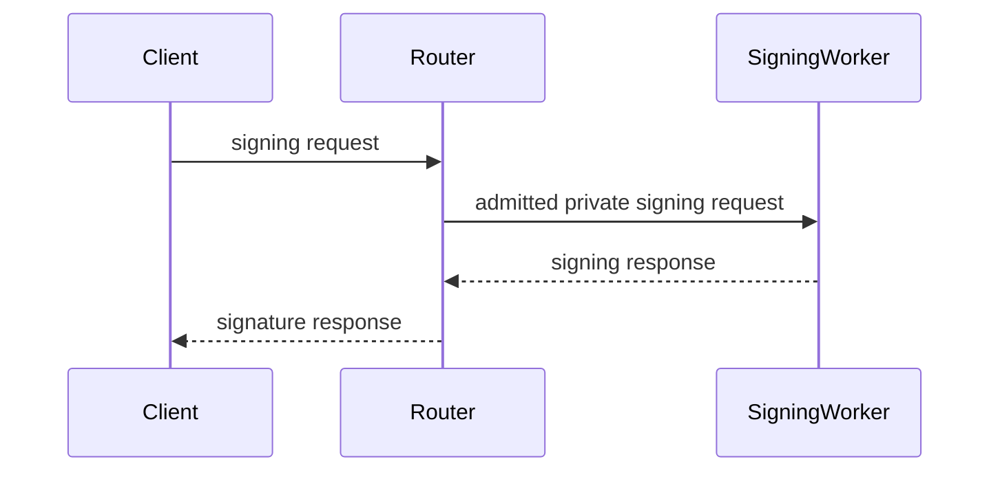

Derivation-time topology for registration, export, recovery, refresh, and
activation:

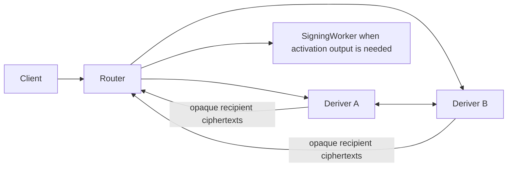

Deriver A and Deriver B leave the hot signing path after activation. Normal
Ed25519 and ECDSA signing use Router plus SigningWorker.

## 2. Roles And Boundaries

### 2.1 Router

Router owns public HTTP routes, Wallet Session JWT verification, policy,
replay, quota, abuse checks, signing-budget reserve/commit/release, request
binding, CORS, diagnostics, observability, and private-worker forwarding.

Router may hold:

- public metadata and public keys
- typed request scope
- opaque ciphertext
- public transcript digests
- replay state
- lifecycle records
- budget reservations and counters
- public activation and delivery receipts

Router must never hold both raw sides of protected split values. Router must not
open deriver plaintext envelopes, client output packages, SigningWorker output
packages, raw root material, canonical ECDSA private keys, or Ed25519 client-base
material.

### 2.2 Deriver A And Deriver B

Deriver A and Deriver B own role-local derivation material. They receive only
role-specific encrypted envelopes and authenticated role-bound peer messages.

Deriver A may hold A-side root/provisioning material and A-side protocol state.
Deriver B may hold B-side root/provisioning material and B-side protocol state.
Neither deriver receives enough material to reconstruct client or server signing
material alone.

Derivers must reject:

- wrong-role envelopes
- stale key epochs
- stale root-share epochs
- wrong peer identity
- wrong transcript digest
- expired requests
- replayed nonces
- malformed output-recipient labels
- mixed client-recipient and SigningWorker-recipient output

### 2.3 SigningWorker

SigningWorker owns activated server-side signing material, one-use nonce state,
Ed25519 presign-pool state, ECDSA-HSS presignature state, Ed25519 finalize
execution, and ECDSA-HSS prepare/finalize execution.

SigningWorker private routes require internal service auth and admitted Router
requests. SigningWorker does not parse browser Wallet Session credentials.

SigningWorker may open only material addressed to the active SigningWorker
identity. It must reject output packages for clients, derivation workers, stale
activation epochs, wrong public identity, or wrong active-state session ids.

### 2.4 Browser SDK And WASM Workers

TypeScript SDK code is orchestration only. It carries public/session metadata,
Wallet Session JWTs, typed lifecycle state, runtime policy scope, SigningWorker
scope, worker material handles, binding digests, public facts, and route
requests.

`crates/signer-core` and browser WASM workers own client-side cryptographic
protocol logic, crypto-secret material, key/share derivation, binding checks,
nonce/client-base state, ECDSA-HSS client signing shares, presign/client-share
material, PRF-derived secret state, and signing-share generation.

TypeScript must not own raw Ed25519 client-base material, raw ECDSA-HSS
client signing shares, presignature secrets, nonce secrets, PRF.first bytes, or
signing shares.

Persisted worker material handles are hints. A sign-ready runtime capability
exists only after the current worker validates the handle and binding for the
current Wallet Session, signing grant, threshold session, signing root, runtime
policy scope, SigningWorker id, client verifier, and material binding digest.

## 3. Security Model

Router A/B targets this split-custody invariant:

```text
server never has joined d, a, x_client_base
outside explicit authorized export, client never has joined d or a
client never has joined y_server or tau_server
in non-export ceremonies, client opens only x_client_base
SigningWorker opens only x_server_base
authorized export lets only the client reconstruct d and therefore derive a
```

Split values are algebraic relationships, not transport payloads:

```text
y_server = y_A + y_B
tau_server = tau_A + tau_B
y_client = y_client_A + y_client_B
tau_client = tau_client_A + tau_client_B
```

No Router, deriver, coordinator, persistence layer, log sink, or diagnostics path
may receive both raw sides of a protected split value.

Threat containment matrix:

| Compromise         | Expected exposure                                                                         | Required containment                                                                             |
| ------------------ | ----------------------------------------------------------------------------------------- | ------------------------------------------------------------------------------------------------ |
| Router             | Public metadata, ciphertext, hashes, timings                                              | No deriver plaintext, root shares, output shares, or signing shares                              |
| Deriver A          | A custody material and A local derived material                                           | No B plaintext, no joined `d`, no joined `a`, no `x_client_base`, no `x_server_base`             |
| Deriver B          | B custody material and B local derived material                                           | No A plaintext, no joined `d`, no joined `a`, no `x_client_base`, no `x_server_base`             |
| SigningWorker      | Activated server signing material and nonce/presign state                                 | No `k_org`, no joined root, no client material, no Deriver A/B root material                     |
| Client             | User client material, local worker handles, and `d`/`a` during explicit authorized export | No server root material, `y_server`, or `tau_server`; `d`/`a` only in explicit authorized export |
| Logs/observability | Public metadata, hashes, timings, state transitions                                       | No protocol payload plaintext or secret material                                                 |

Production release claim:

```text
Router A/B provides privacy and correctness-with-abort against the Router plus
at most one malicious Deriver under static corruption, independent A/B
administrative domains, a reviewed active two-party construction, authenticated
role-bound transport, input provenance, one-use preprocessing, and no A+B
collusion.
```

The claim excludes A+B collusion, sequential compromise of retained state
without reviewed refresh/erasure, a Cloudflare platform-wide compromise,
common supply-chain compromise approved by both deployers, fairness, and
availability.

## 4. Protocol Decisions

### 4.1 Split Derivation Primitive

The signature families use distinct fixed derivation protocols:

- Ed25519 uses `router_ab_ed25519_yao_v1` for the exact
  `d -> SHA-512(d) -> clamp -> a` function, role-private output shares, and
  export-only seed shares.
- ECDSA uses its fixed strict Router A/B threshold PRF, then derives additive
  secp256k1 scalar shares satisfying `x = x_client + x_server mod n`.

No request may select a backend, downgrade the security profile, route Ed25519
through `mpc_threshold_prf_v1`, or route ECDSA through Yao.

### 4.2 Role-Separated Ed25519 Yao Boundary

Production Ed25519 Router A/B uses fixed active-Yao role APIs. Clear evaluators,
joined-state executors, passive protocol entrypoints, and circuit generators
remain outside production dependency graphs.

Allowed role-separated API inputs:

- role-local root material
- role-local client material and provisioned-root proof inputs
- transcript metadata
- authenticated bounded peer frames
- request-kind-specific scope

Forbidden production inputs and outputs:

- joined `d`
- joined `a`
- joined `y_server`
- joined `tau_server`
- joined `x_client_base`
- clear evaluator or joined circuit input
- runtime backend or security-profile selectors

Allowed outputs:

- authenticated encrypted client-output package shares
- authenticated encrypted SigningWorker-output package shares
- export-only encrypted seed shares
- public transcript digest
- typed redacted diagnostics

Target role-state shape:

```rust
pub enum Ed25519YaoRoleState {
    Garbler(DeriverAConsumingState),
    Evaluator(DeriverBConsumingState),
}

pub enum Ed25519YaoOutput {
    Activation(ActivationRecipientPackages),
    Export(ExportRecipientPackages),
}

// Consuming transitions take owned state and return one precise next state.
```

Activation types contain no seed field. Export types carry only recipient-
encrypted seed shares. The active suite supplies malicious OT, garbling
correctness, input consistency/provenance, selective-failure resistance,
authenticated private outputs, and uniform correctness-with-abort.

### 4.3 SigningWorker Placement

Normal signing uses a standalone SigningWorker. Deriver A and Deriver B are not
in the normal-signing hot path. Activation ceremonies deliver server-recipient
output to SigningWorker, then SigningWorker owns active server-side signing
state.

Initial topology:

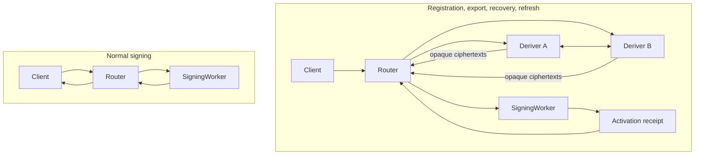

### 4.4 Non-Circular Envelope Binding

Deriver-envelope construction must be non-circular. Public pre-envelope
transcript context is separate from encrypted-envelope assignment metadata.

Digest ordering:

1. `PublicRouterRequestContextV1::context_digest()` covers public request fields
   excluding role envelopes, role-envelope AAD digests, and ciphertext bytes.
2. `PublicRouterRequestContextV1::derivation_transcript_digest()` covers
   derivation scope, deriver set, selected SigningWorker, client identity,
   client ephemeral key, request kind, root-share epoch, and the public request
   context digest.
3. Role-envelope AAD binds the known derivation transcript digest and Router
   request context digest.
4. `PublicRouterRequestV1::router_replay_digest()` covers the full public
   request, including encrypted role envelopes, for Router replay and
   idempotency storage only.

Role envelopes must carry typed AAD supplied by Router. Deriver private service
bodies require `aad.digest()` to match the envelope's public `aad_digest`.

### 4.5 Output Correctness Release Gate

Production release requires:

- Router never opens joined secret material.
- Deriver A and Deriver B never open joined secret material.
- SigningWorker opens only its server-recipient output.
- Client opens only client-recipient output.
- Source guards reject joined-state, generator, clear-evaluator, passive-Yao,
  and old HSS imports in production Router A/B paths.
- Transcript and output package digests bind role, request kind, deriver set,
  root-share epoch, SigningWorker id, client identity, and replay nonce.
- The active construction enforces garbler correctness, evaluator-input
  consistency, provisioned-input provenance, selective-failure resistance, and
  authenticated private outputs.
- Public point commitments and the Ed25519 relation
  `2 * X_client - X_server = A_pub` pass before activation.
- Output anti-equivocation and one-use ticket tests pass for both corrupt-role
  cases.

## 5. Ceremony And Transcript Model

### 5.1 Request Kinds

One `DerivationCeremony` lifecycle covers request-kind-specific scope:

- `registration`
- `activation`
- `recovery`
- `refresh`
- `export`

Normal signing is not a derivation ceremony. It consumes active SigningWorker
state.

### 5.2 Ceremony States

Canonical lifecycle shape:

```rust
pub enum DerivationCeremony {
    Created(CreatedCeremony),
    Admitted(AdmittedCeremony),
    AEnvelopeForwarded(AEnvelopeForwardedCeremony),
    BEnvelopeForwarded(BEnvelopeForwardedCeremony),
    AbRunning(AbRunningCeremony),
    ClientOutputReady(ClientOutputReadyCeremony),
    SigningWorkerOutputReady(SigningWorkerOutputReadyCeremony),
    Activated(ActivatedCeremony),
    Failed(FailedCeremony),
    Expired(ExpiredCeremony),
    Abandoned(AbandonedCeremony),
}
```

Required common scope:

- `request_id`
- `protocol_version`
- `request_kind`
- `account_id` or `wallet_id`
- `session_id`
- `org_id`
- `project_id`
- `environment_id`
- `signing_root_id`
- `signing_root_version`
- `root_share_epoch`
- Deriver A identity and key epoch
- Deriver B identity and key epoch
- SigningWorker identity and key epoch
- client ephemeral public key
- transcript nonce
- expiry

State rules:

- `Created` contains parsed public metadata and encrypted-envelope digest
  metadata.
- `Admitted` contains accepted or reused expensive-work gate state.
- `AbRunning` has both deriver envelopes forwarded and peer identities pinned.
- `ClientOutputReady` exposes only encrypted client-output packages.
- `SigningWorkerOutputReady` exposes only SigningWorker-output packages.
- `Activated` records SigningWorker activation receipt and public identity.
- `Failed`, `Expired`, and `Abandoned` are terminal except for explicit
  idempotent status reads.

### 5.3 Transcript Binding

Transcript binding covers all public facts that define the ceremony:

- protocol version
- request kind
- request id
- replay nonce
- account or wallet id
- rp id or chain target
- org/project/environment
- signing root id and version
- root-share epoch
- deriver set id
- Deriver A id and key epoch
- Deriver B id and key epoch
- SigningWorker id and key epoch
- client ephemeral public key
- recipient kind (`client` or `signing_worker`)
- output package kind
- request expiry
- public request context digest

Transcript digest must not depend on encrypted envelope ciphertext, role-envelope
AAD digest, or any digest that depends on itself.

### 5.4 Direct A/B Coordination

After Router forwards role envelopes, Deriver A and Deriver B coordinate through
authenticated transcript-bound peer messages:

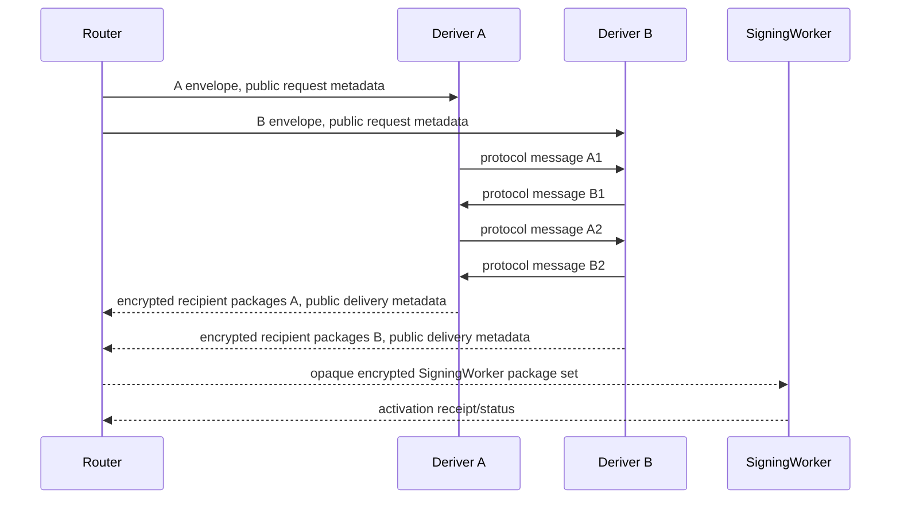

A/B messages may contain commitments, masks, OT/correlation messages, encrypted
labels, or output shares. They must not contain raw joined values or plaintext
material intended for another role.

### 5.5 Output Delivery

Client output:

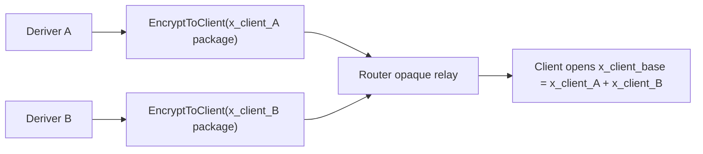

SigningWorker output:

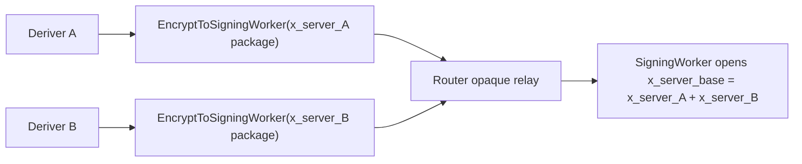

Output packages bind request kind, transcript digest, recipient identity, role,
root-share epoch, signing root, account/wallet identity, and expiry.

### 5.6 Architecture Flow Diagrams

Registration and SigningWorker activation:

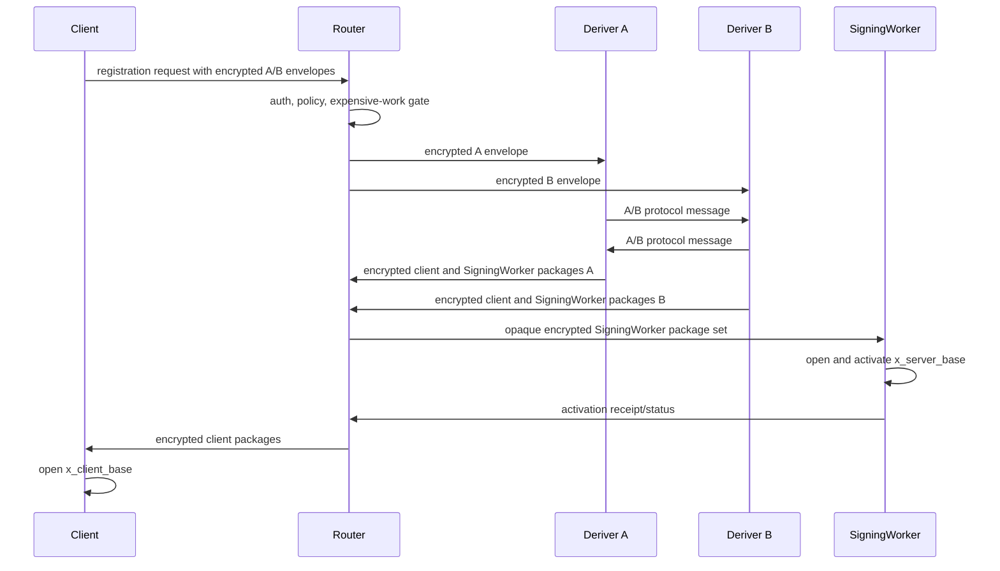

Normal signing:

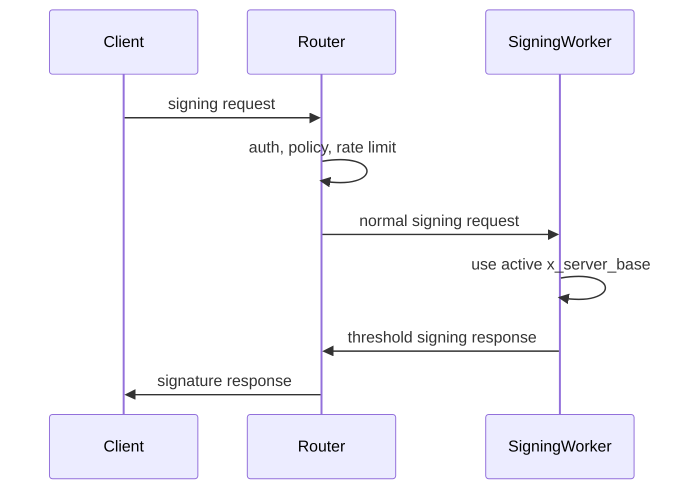

Root-share refresh:

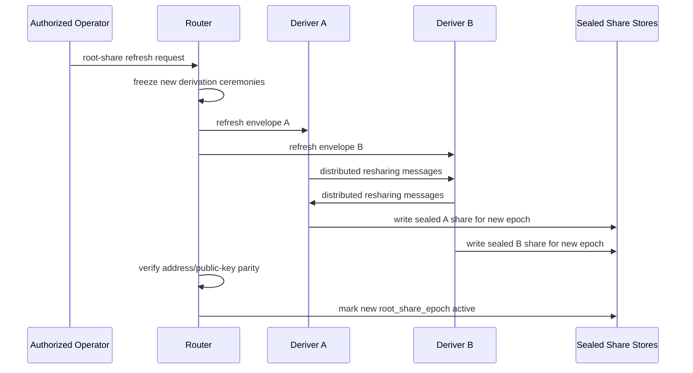

### 5.7 Detailed Direct A/B Coordination Flow

After the Router forwards envelopes, A and B coordinate directly using the
sequence in Section 5.4.

The exact A/B request graph is frozen by the reviewed active-Yao suite and
signed circuit manifest before production. Active compiler candidates may be
compared in isolated Phase 6 experiments. No caller or runtime request selects
the primitive, compiler, round graph, or security level. The implementation
target is:

- ideal: 1 A/B round trip
- acceptable: 2 to 4 A/B round trips
- unacceptable for normal UX: many sequential online rounds

All A/B protocol messages must be authenticated and transcript-bound. They may
contain commitments, masks, OT/correlation messages, encrypted labels, or output
shares. They must not contain raw `y_A`, `y_B`, `tau_A`, `tau_B`,
`y_client_A`, `y_client_B`, `tau_client_A`, `tau_client_B`, joined `d`, joined
`a`, or joined `x_client_base`.

### 5.8 Detailed Output Delivery

At the end of the A/B protocol:

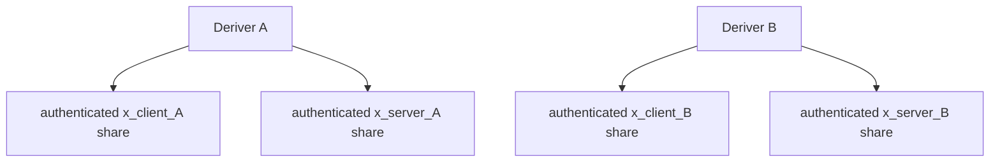

Client-output material:

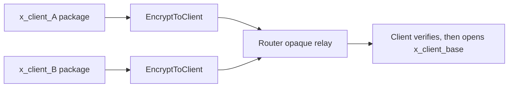

SigningWorker-output material:

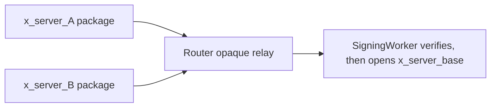

Router-mediated ciphertext relay is the sole product delivery topology. A and B
return compact recipient ciphertexts and a signed public receipt to Router.
Router forwards the client package set in the public response and forwards the
SigningWorker package set over its private worker edge. Router cannot decrypt,
combine, substitute, or reinterpret either package set. This keeps lifecycle
admission, delivery status, and activation receipts on one control-plane path
without placing recipient plaintext in Router.

The target relay response is a discriminated union so export-only seed material
cannot appear in an activation-family response:

```ts
type RouterYaoActivationRelayResponse = {
  kind: 'activation_output';
  requestId: string;
  protocolVersion: string;
  requestKind: 'registration' | 'activation' | 'recovery' | 'refresh';
  accountId: string;
  sessionId: string;
  transcriptNonce: string;
  publicTranscriptDigest: string;
  publicOutputReceipt: SignedYaoOutputReceipt;
  aClientPackage: Ed25519YaoActivationShareCiphertextV1;
  bClientPackage: Ed25519YaoActivationShareCiphertextV1;
  aSigningWorkerPackage: Ed25519YaoActivationShareCiphertextV1;
  bSigningWorkerPackage: Ed25519YaoActivationShareCiphertextV1;
  aSeedExportPackage?: never;
  bSeedExportPackage?: never;
};

type RouterYaoExportRelayResponse = {
  kind: 'seed_export_output';
  requestId: string;
  protocolVersion: string;
  requestKind: 'export';
  accountId: string;
  sessionId: string;
  transcriptNonce: string;
  publicTranscriptDigest: string;
  publicOutputReceipt: SignedYaoOutputReceipt;
  aSeedExportPackage: Ed25519YaoSeedExportShareCiphertextV1;
  bSeedExportPackage: Ed25519YaoSeedExportShareCiphertextV1;
  aClientPackage?: never;
  bClientPackage?: never;
  aSigningWorkerPackage?: never;
  bSigningWorkerPackage?: never;
};

type RouterYaoDerivationRelayResponse =
  | RouterYaoActivationRelayResponse
  | RouterYaoExportRelayResponse;
```

Activation-family delivery uses `Ed25519YaoActivationSharePayloadV1` encrypted
as `Ed25519YaoActivationShareCiphertextV1`. Export delivery uses the disjoint
`Ed25519YaoSeedExportSharePayloadV1` encrypted as
`Ed25519YaoSeedExportShareCiphertextV1`. Each Deriver emits one role-private
share per authorized recipient:

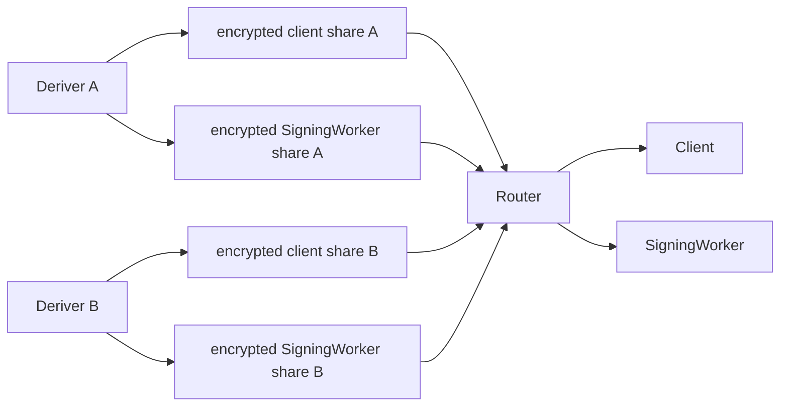

Every activation-share payload contains exactly one scalar share, its public
point commitment, and the reviewed active-output binding that ties the decoded
scalar, point, ciphertext digest, recipient, circuit, ticket, and transcript to
the actively secure Yao execution. It never contains the joined
`x_client_base`, joined `x_server_base`, a seed share, or a nested HSS proof
batch. A seed-export payload contains exactly one authenticated seed share and
cannot be decoded as an activation share.

The canonical payload and HPKE AAD bind protocol and circuit digest, lifecycle
and request kind, account/wallet/key identity, root and deployment epochs,
producing Deriver and peer identity, recipient role and public key, ticket ID,
transcript root, output kind, payload digest, expiry, replay domain, algorithm,
and nonce. Recipients verify the active-output binding and public receipt before
combining shares. Router verifies only public signatures, digests, and delivery
metadata.

`RecipientProofBundlePayloadV1`, `RecipientProofBundleCiphertextV1`, the
`recipient_proof_bundle` wire kind, and nested proof-batch filtering describe the
historical HSS delivery path currently scheduled for deletion. They are not
valid target Yao payloads, wire kinds, or release evidence.

The first deployable strict profile should be:

```text
1. A and B decrypt only their own role envelopes.
2. A and B run the reviewed active Streaming Yao protocol.
3. A and B decode only their role-private authenticated output shares.
4. A and B encrypt each active-output-bound share to its final recipient key.
5. A and B return the exact ciphertext digest set and co-signed public receipt
   to Router after both one-use tickets reach Consumed.
6. Router relays opaque encrypted client packages in the public response and
   opaque encrypted SigningWorker packages over the private worker edge.
7. SigningWorker verifies both role packages and opens only x_server_base.
8. Client verifies both role packages and opens only x_client_base, or d only
   in the explicit authorized export branch.
```

### 5.9 Detailed Normal Signing Flow

The split A/B path is used for derivation-time operations:

- registration
- recovery
- key export
- signing-worker share refresh

Day-to-day signing should use the standalone worker shape:

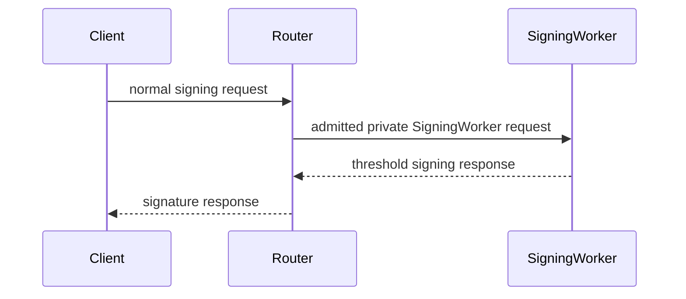

The active SigningWorker holds `x_server_base`, which is allowed by the target
security model. Normal signing requires Router and the active SigningWorker.
Deriver A and Deriver B participate when derivation, key export, recovery, or
signing-worker share refresh is requested.

### 5.10 Failure Model

The Router can:

- deny service
- drop or delay messages
- send stale envelopes
- route to the wrong deriver
- replay old requests
- return incomplete responses

The protocol must turn those failures into detectable aborts. The Router should
not be able to learn protected secrets or silently rewrite a successful
derivation.

A or B can:

- deny service
- abort the A/B protocol
- send malformed protocol messages
- attempt transcript confusion
- attempt to make the other party or client accept a bad output

The active Yao construction must turn every malicious A or B behavior into a
valid authenticated output or a uniform detectable abort. Garbling correctness,
malicious OT, input provenance and consistency, selective-failure resistance,
private output authenticity, and anti-equivocation are release requirements.

## 6. Public And Private API

### 6.1 Public Route Families

Target public signing-capable route families:

- Ed25519 Wallet Session issuance: `/router-ab/wallet-session/ed25519`
- Ed25519 derivation lifecycle: `/router-ab/ed25519/derive/*`
- Ed25519 normal signing: `/router-ab/ed25519/sign/*`
- ECDSA Wallet Session/bootstrap/lifecycle: `/router-ab/ecdsa/*`
- Wallet Session seal: `/wallet-session/seal/*`
- Wallet Session budget status: `/router-ab/wallet-budget/status`

Old public threshold signing routes are not active product signing paths:

- `/threshold-ed25519/authorize`
- `/threshold-ed25519/sign/*`
- `/threshold-ed25519/presign/refill`
- `/threshold-ecdsa/authorize`
- `/threshold-ecdsa/presign/*`
- `/threshold-ecdsa/sign/*`

Threshold- and HSS-named product routes are deleted during the hard cutover.
Historical route literals may remain only in dated plans or source-guard
fixtures.

### 6.2 Private Route Families

Private routes are internal service routes and require internal service auth:

- Deriver A private ceremony routes
- Deriver B private ceremony routes
- SigningWorker activation routes
- SigningWorker Ed25519 normal-signing routes
- SigningWorker ECDSA prepare/finalize routes
- SigningWorker ECDSA pool-fill put routes

Private routes receive admitted Router bodies. They do not parse browser cookies,
Wallet Session bearer tokens, publishable keys, or app-session credentials.

### 6.3 Wallet Session Credential

Wallet Session is the only browser-facing signing authorization concept. The SDK
sends bearer Wallet Session JWTs to public Router A/B signing routes.

A signable Wallet Session state binds:

- wallet/account id
- threshold session id
- signing grant id
- runtime policy scope
- signing root id and version where applicable
- Wallet Session JWT
- participant set
- SigningWorker id and scope
- curve-specific Router A/B normal-signing state
- worker material handle or restorable worker material state
- binding digest and public verifier facts
- budget expiry and remaining-use information

Durable Wallet Session records may contain material handles, binding digests, or
sealed material references. Those fields are restore hints, not durable
sign-ready truth. A lane is sign-ready only after the current browser worker
validates the material handle against the current Wallet Session, signing grant,
threshold session, signing root, runtime policy scope, SigningWorker id, public
verifier facts, and curve-specific active state.

Cookie-mode signing-capable sessions are rejected for Router A/B signing paths.
Legacy threshold JWT kinds are rejected at active signing-capable boundaries.

### 6.4 Normal-Signing Intent And Payload Binding

Router recomputes intent and signing-payload digests from typed request data.
The client is never the authority for the admitted signing digest.

Router creates internal admission candidates only after:

1. Wallet Session verification succeeds.
2. Request parsing succeeds.
3. Scope validation succeeds.
4. Intent digest recomputation succeeds.
5. Signing-payload digest recomputation succeeds.
6. Prepare/finalize binding validation succeeds.
7. Replay, quota, budget, policy, and abuse gates accept the request.

SigningWorker receives only admitted private request bodies.

### 6.5 Canonicalization Authority

`router-ab-core` owns canonical Router A/B byte encoding and digest derivation for
strict Router protocol surfaces. TypeScript and Cloudflare adapter code must use
shared vectors or boundary parsers for public request shapes, admission material,
request digests, replay digests, response digests, and active-state ids.

### 6.6 Router Split Request Shape

The client sends one Router request containing public routing metadata and two
role-specific encrypted envelopes:

```ts
type RouterSplitDerivationRequest = {
  protocolVersion: string;
  requestKind: 'registration' | 'activation' | 'recovery' | 'refresh' | 'export';
  accountId: string;
  sessionId: string;
  transcriptNonce: string;
  expiresAtMs: number;
  clientEphemeralPublicKey: string;
  aEnvelope: EncryptedDeriverEnvelope;
  bEnvelope: EncryptedDeriverEnvelope;
};
```

Each encrypted deriver envelope must bind:

- `protocolVersion`
- `requestKind`
- `accountId`
- `sessionId`
- `transcriptNonce`
- `expiresAtMs`
- deriver role, `A` or `B`
- client ephemeral public key
- Router request digest

The plaintext inside `aEnvelope` is valid only for A. The plaintext inside
`bEnvelope` is valid only for B.

#### Product Operation To Ideal Functionality To Circuit Mapping

Router validates a product operation, converts it once to one canonical request
kind, and dispatches the fixed ideal functionality and circuit family below.
Callers never provide an ideal-function or circuit identifier.

| Product/control operation   | Canonical request kind | Ideal functionality         | Circuit family              | Secret result                                                                                                            |
| --------------------------- | ---------------------- | --------------------------- | --------------------------- | ------------------------------------------------------------------------------------------------------------------------ |
| `registration_prepare`      | `registration`         | `F_ed25519_registration_v1` | `ed25519_yao_activation_v1` | fresh client and SigningWorker activation-share ciphertexts; no seed                                                     |
| `signing_worker_activation` | `activation`           | `F_ed25519_activation_v1`   | `ed25519_yao_activation_v1` | activate the previously committed SigningWorker shares; no seed                                                          |
| `recovery`                  | `recovery`             | `F_ed25519_recovery_v1`     | `ed25519_yao_activation_v1` | fresh recipient activation-share ciphertexts preserving registered identity; no seed                                     |
| `server_share_refresh`      | `refresh`              | `F_ed25519_refresh_v1`      | `ed25519_yao_activation_v1` | next-epoch recipient activation-share ciphertexts preserving joined `y`, joined `tau`, `d`, and public identity; no seed |
| `key_export`                | `export`               | `F_ed25519_export_v1`       | `ed25519_yao_export_v1`     | two authenticated seed-share ciphertexts addressed only to the authorized client                                         |

`signing_worker_activation` is an internal control-plane continuation after
registration, recovery, or refresh output is committed. It consumes and verifies
the previously produced activation-family packages and never causes a second Yao
evaluation. Request kind remains transcript-bound even when four ideal
functionalities share the activation circuit artifact.

Recovery remains distinct in Router policy, authorization, abuse controls,
diagnostics, and lifecycle state. It preserves `d` through a non-export state
transition, produces fresh recipient-scoped activation shares, and never receives
export seed wires or seed-output packages.

### 6.7 Endpoint And Wire Examples

Outer JSON examples are illustrative. Transcript hashes bind canonical inner
bytes, represented here as base64url strings.

Registration prepare:

```json
{
  "protocol_version": "router_ab_v1",
  "request_kind": "registration",
  "account_id": "acct_123",
  "session_id": "sess_123",
  "transcript_nonce": "b64u_nonce",
  "expires_at_ms": 1781190000000,
  "client_ephemeral_public_key": "b64u_key",
  "a_envelope_b64u": "b64u_canonical_encrypted_a",
  "b_envelope_b64u": "b64u_canonical_encrypted_b"
}
```

Router response:

```json
{
  "request_id": "req_123",
  "protocol_version": "router_ab_v1",
  "request_kind": "registration",
  "account_id": "acct_123",
  "session_id": "sess_123",
  "public_transcript_digest_b64u": "b64u_digest",
  "a_client_package_b64u": "b64u_ciphertext",
  "b_client_package_b64u": "b64u_ciphertext",
  "state": "client_output_ready"
}
```

SigningWorker-share refresh uses the same outer shape with the canonical
`refresh` request-kind label:

```json
{
  "request_kind": "refresh",
  "a_envelope_b64u": "b64u_canonical_encrypted_a_refresh",
  "b_envelope_b64u": "b64u_canonical_encrypted_b_refresh"
}
```

Normal signing after activation:

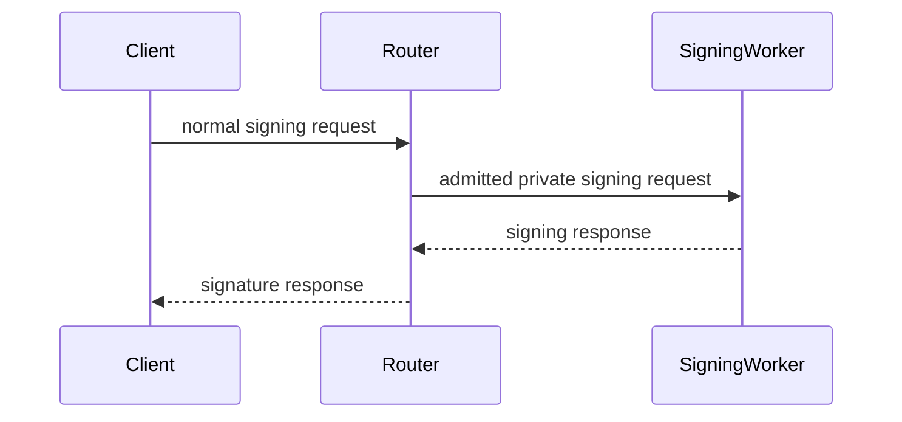

Normal signing does not invoke Deriver A or Deriver B and does not unwrap
signing-root shares.

### 6.8 Public Router API Details

Keep public endpoints simple:

```text
POST /router-ab/ed25519/sign/prepare
POST /router-ab/ed25519/sign
```

Both MVP endpoints accept:

```http
Authorization: Bearer <wallet-session-token>
```

Cookie Wallet Session auth is deferred.

Both endpoints reject:

- missing Wallet Session
- invalid Wallet Session
- Wallet Session account/session mismatch
- missing `routerAbNormalSigning.signingWorkerId`
- request SigningWorker mismatch
- typed intent mismatch
- signing payload digest mismatch
- prepare/finalize binding mismatch
- expired request
- replayed request id

No public endpoint should mint `routerAbNormalSigningGrant`.

Strict Cloudflare Router deployment must expose browser-safe CORS for these
public endpoints:

- `OPTIONS /router-ab/ed25519/sign/prepare`
- `OPTIONS /router-ab/ed25519/sign`
- configured allowlist for app and wallet origins
- deployed Worker evidence that browser prepare/finalize requests succeed

### 6.9 Ed25519 Intent Types

Add a discriminated intent union for Router A/B Ed25519 normal signing:

```ts
type RouterAbEd25519NormalSigningIntentV2 =
  | {
      kind: 'near_transaction_v1';
      operationId: string;
      operationFingerprint: string;
      nearAccountId: string;
      nearNetworkId: 'testnet' | 'mainnet';
      transactions: readonly RouterAbNearTransactionIntentV1[];
      unsignedTransactionBorshB64u: string;
    }
  | {
      kind: 'nep413_v1';
      operationId: string;
      operationFingerprint: string;
      nearAccountId: string;
      nearNetworkId: 'testnet' | 'mainnet';
      recipient: string;
      message: string;
      nonceB64u?: string;
      callbackUrl?: string;
    }
  | {
      kind: 'near_delegate_action_v1';
      operationId: string;
      operationFingerprint: string;
      nearAccountId: string;
      nearNetworkId: 'testnet' | 'mainnet';
      delegate: RouterAbNearDelegateActionIntentV1;
    };
```

Use required fields for identity, session, signing, and lifecycle data. Optional
fields are allowed only where the underlying protocol makes them optional, such
as NEP-413 callback URL.

### 6.10 Ed25519 Signing Payload Types

Replace opaque digest-only normal-signing payloads with typed payload branches:

```ts
type RouterAbEd25519SigningPayloadV2 =
  | {
      kind: 'near_unsigned_transaction_borsh_v1';
      unsignedTransactionBorshB64u: string;
      expectedSigningDigestB64u: string;
    }
  | {
      kind: 'nep413_message_v1';
      canonicalMessageB64u: string;
      expectedSigningDigestB64u: string;
    }
  | {
      kind: 'near_delegate_action_v1';
      canonicalDelegateBorshB64u: string;
      expectedSigningDigestB64u: string;
    };
```

Router must recompute the signing digest from the payload preimage and compare
it to `expectedSigningDigestB64u`. SigningWorker receives only the digest and
finalize material after Router admission succeeds.

Each branch has one authoritative signing preimage:

- NEAR transaction signing: `unsignedTransactionBorshB64u`.
- NEP-413 signing: `canonicalMessageB64u`.
- Delegate action signing: `canonicalDelegateBorshB64u`.

The typed intent provides policy and display data. Router parses the signing
preimage and rejects the request when parsed fields disagree with the typed
intent. `expectedSigningDigestB64u` is a diagnostic cross-check; Router derives
the signing authority from the preimage and Wallet Session.

### 6.11 Ed25519 Prepare And Finalize Request Types

The public API has two different request types because prepare and finalize
protect different invariants.

Prepare:

```ts
type RouterAbEd25519NormalSigningPrepareRequestV2 = {
  scope: NormalSigningScopeV1;
  expiresAtMs: number;
  intent: RouterAbEd25519NormalSigningIntentV2;
  signingPayload: RouterAbEd25519SigningPayloadV2;
};
```

Finalize:

```ts
type RouterAbEd25519NormalSigningFinalizeRequestV2 = {
  scope: NormalSigningScopeV1;
  expiresAtMs: number;
  prepareBinding: {
    serverRound1Handle: string;
    round1BindingDigest: string;
    intentDigest: string;
    signingPayloadDigest: string;
  };
  protocol: {
    kind: 'ed25519_two_party_frost_finalize_v1';
    groupPublicKey: string;
    clientCommitments: RouterAbNormalSigningCommitmentsV2;
    serverCommitments: RouterAbNormalSigningCommitmentsV2;
    clientVerifyingShareB64u: string;
    serverVerifyingShareB64u: string;
    clientSignatureShareB64u: string;
  };
};
```

Router prepare creates one internal admission record and one SigningWorker
round-1 nonce record. Router finalize must consume the server round-1 handle
exactly once. If scope, expiry, intent digest, signing-payload digest,
round-1 binding, commitments, or SigningWorker id mismatch, finalize rejects
without consuming nonce material.

### 6.12 Router Admission Candidate Types

Evolve the existing normal-signing admission-store path into an internal type
that replaces the client-visible Router grant:

```rust
pub struct CloudflareRouterNormalSigningPrepareAdmissionCandidateV2 {
    pub org_id: String,
    pub project_id: String,
    pub environment: String,
    pub account_id: String,
    pub subject_id: String,
    pub session_id: String,
    pub signing_worker_id: String,
    pub request_id: String,
    pub intent_digest: PublicDigest32,
    pub signing_payload_digest: PublicDigest32,
    pub admitted_signing_digest: PublicDigest32,
    pub round1_binding_digest: Option<PublicDigest32>,
    pub trusted_source_digest: PublicDigest32,
    pub expires_at_ms: u64,
}
```

The prepare/finalize candidate types are constructed only after:

1. Wallet Session verification succeeds.
2. Normal-signing request parsing succeeds.
3. Typed intent digest recomputation succeeds.
4. Signing payload digest recomputation succeeds.
5. Admitted signing digest derivation succeeds.
6. Prepare/finalize binding validation succeeds when finalizing.

Router policy, quota, abuse, and prepare replay gates produce a
`CloudflareRouterNormalSigningTrustedAdmissionV1`. Only the
`CloudflareSigningWorkerAdmittedNormalSigningPrepareRequestV2` or
`CloudflareSigningWorkerAdmittedNormalSigningFinalizeRequestV2` service-call
body crosses into SigningWorker, and those bodies carry both the pre-gate
candidate and the accepted trusted admission decision. They are never serialized
to the client.

## 7. Ed25519 Normal Signing

Ed25519 Router A/B signing covers:

- NEAR transaction signing
- NEP-413 message signing
- NEP-461 delegate-action signing
- presign-pool hit signing
- presign-pool miss prepare/finalize signing

### 7.1 Route Sequence

Pool hit:

```text
POST /router-ab/ed25519/sign
```

Pool miss:

```text
POST /router-ab/ed25519/sign/prepare
POST /router-ab/ed25519/sign
```

Pool refill:

```text
POST /router-ab/ed25519/sign/presign-pool/prepare
```

Router admits the request, binds scope and request digest, reserves budget, and
forwards only admitted private material to SigningWorker. SigningWorker owns
server-side Ed25519 signing material and one-use pool/finalize state. The
browser worker owns Ed25519 client material and signing-share generation.
Persisted Ed25519 worker-material handles are hints for restore or validation;
they do not make a lane signable until the current worker validates the handle
for the current binding.

### 7.2 Presign-Pool Semantics

Ed25519 presign-pool refill is message-agnostic. Refill must not carry intent
digest, signing-payload digest, or admitted signing digest.

A ready Router A/B Ed25519 presign entry includes:

- server round-1 handle
- server commitments
- server verifying share
- client nonce handle
- client commitments
- client verifying share
- account/session scope
- SigningWorker id
- expiry
- generation
- pool binding digest

Claim-time lookup validates account id, session id, signing root/key id when
available, SigningWorker id, client presign id, server round-1 handle,
generation, pool binding digest, and expiry before binding the record to an
admitted signing digest.

Burn semantics:

- Scope, handle, commitment, or expiry drift rejects before claim and preserves
  the pool record.
- Once a record is claimed for an admitted signing digest, cryptographic failure,
  invalid client signature share, or response-send uncertainty burns the record.
- Claimed nonce material never returns to the available pool.

### 7.3 Final Signing Boundary

Final Ed25519 signing consumes only a validated runtime material state, current
Wallet Session credential, and current server-budget admission. Restore,
worker-material validation, derivation, and activation happen before final
signing. The final signing path must not restore material, invoke a Deriver,
reconstruct split derivation state, read raw persistence optionals, or fall back
to non-Router signing.

If material is absent or invalid, readiness must classify the lane as
`restore_available`, `material_pending`, or `material_restore_required` before
final signing begins.

### 7.4 Runtime Material Readiness

Ed25519 readiness has three distinct layers:

- auth-ready: Wallet Session bearer auth and budget identity are present
- restore-ready: durable sealed worker material or a complete persisted material
  hint exists
- sign-ready: the current browser worker has validated worker-owned material for
  the current binding

The persisted record parser must classify raw records into strict branches such
as `auth_ready_material_pending`, `restore_available`,
`material_hint_unvalidated`, `non_signing`, or `invalid`. It must not produce a
sign-ready branch from persisted fields alone.

The runtime-validated material state should carry a material reference,
material binding, session binding, Router A/B normal-signing state, expiry, and
no raw client-base material. Flat identity values used by route builders should
be derived from those bindings instead of duplicated into a broad object.

Page reload, worker restart, Wallet Session remint, signing grant change,
signing root change, SigningWorker change, verifier change, and material binding
change all invalidate runtime validation. After invalidation, the lane returns
to `restore_available` or `material_pending` until the worker validates or
restores the material again.

## 8. ECDSA Threshold-PRF And Additive Shares

ECDSA uses Router A/B for registration/bootstrap, activation, recovery,
refresh, export, presignature pool refill, and normal EVM/Tempo digest signing.
The existing `ECDSA-HSS` source and protocol namespace denotes this current
threshold-PRF/additive-share flow; Phase 8 renames its public surface to the
backend-neutral ECDSA route family. It has no Yao dependency.

Protocol version:

```text
router_ab_ecdsa_hss_secp256k1_v1
```

### 8.1 Stable Context And Active-State Id

ECDSA-HSS active-state binding covers:

- stable key context
- signing root id and version
- ECDSA threshold key id
- public identity
- activation epoch
- participant set
- key handle
- threshold session id
- signing grant id
- runtime policy scope
- SigningWorker id
- Wallet Session JWT

Canonical active-state session id:

```text
{ecdsa_threshold_key_id}:{signing_root_id}:{signing_root_version}:{activation_epoch}
```

This value is the Wallet Session `session_id` for ECDSA-HSS normal signing and a
SigningWorker active-state lookup component. It prevents one wallet, key id, and
worker from colliding across signing root versions or activation epochs.

### 8.2 ECDSA Public Identity

Public identity equations:

```text
X_client = x_client * G
X_server = x_server * G
X = X_client + X_server
ethereum_address = last20(keccak256(uncompressed(X)[1..]))
```

SigningWorker activation verifies opened server material by deriving the public
server key and requiring the resulting public identity to equal the activated
identity. Refresh preserves public identity while advancing activation epoch.

Activation receipts include stable ECDSA-HSS context, public identity,
SigningWorker identity, activation epoch, activation digest, activated timestamp,
and SigningWorker output storage receipt.

### 8.3 Registration And Bootstrap

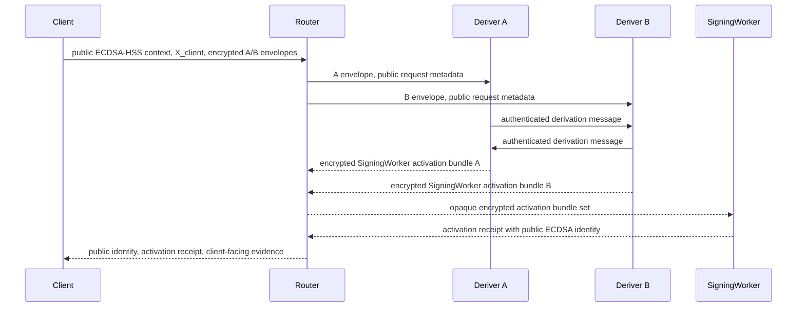

The SigningWorker opens only the material intended for it. Router can validate
public receipt shape, but cannot decrypt A/B envelopes or SigningWorker
activation bundles.

### 8.4 Explicit Export

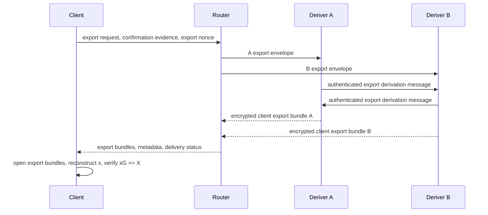

Export requires Deriver A/B participation. SigningWorker does not release active
signing material for export.

Export is explicit, user-confirmed, transcript-bound, nonce/replay-protected,
auditable, and client-side reconstructed and verified.

Server-side export responses must never contain canonical `x`, `privateKeyHex`,
`x_client`, `y_client`, `y_server`, backend threshold private shares, or raw root
material.

### 8.5 Normal ECDSA Signing

ECDSA-HSS signing uses:

```text
POST /router-ab/ecdsa-hss/sign/prepare
POST /router-ab/ecdsa-hss/sign
```

Presignature pool refill uses:

```text
POST /router-ab/ecdsa-hss/presignature-pool/fill/init
POST /router-ab/ecdsa-hss/presignature-pool/fill/step
```

Normal signing uses activated SigningWorker state. Deriver A/B stay out of
online signing. If a signing mode needs client-side threshold participation,
that remains a client/SigningWorker signing protocol.

Presignature ids and handles are one-use. Replays, cross-session use, scope
mismatch, SigningWorker mismatch, activation-epoch drift, stale pool records, and
request-digest drift fail closed.

### 8.6 ECDSA Material Boundaries

| Material                                    | Allowed location                      |
| ------------------------------------------- | ------------------------------------- |
| `y_client`                                  | Client only                           |
| `x_client`                                  | Client only                           |
| Deriver A root/provisioning share           | Deriver A only                        |
| Deriver B root/provisioning share           | Deriver B only                        |
| Joined `y_server`                           | No single production worker           |
| Joined `x_server` before activation         | No Deriver or Router plaintext        |
| Activated SigningWorker material            | SigningWorker only                    |
| Canonical `x` / `privateKeyHex`             | Authorized client export runtime only |
| ECDSA presign/triple/nonce material         | SigningWorker/signing backend only    |
| Public `X_client`, `X_server`, `X`, address | Public transcript after validation    |

ECDSA-HSS follows the same persisted-hint versus runtime-validation boundary as
Ed25519. Persisted role-local material, role-local blobs, presign handles, and
activation facts are not sign-ready by themselves. Tempo/EVM signing may use
them only after the current worker and SigningWorker active-state binding prove
the material belongs to the current Wallet Session, signing grant, chain target,
activation epoch, SigningWorker id, and ECDSA public identity.

### 8.7 Detailed ECDSA-HSS Protocol Spec

`router_ab_ecdsa_hss_secp256k1_v1` is a Router-A/B protocol that derives or
refreshes ECDSA-HSS server-side material outside the normal-signing hot path.
The public Router boundary accepts typed registration/bootstrap, explicit
export, recovery, activation-refresh, prepare, and finalize requests. The
private Deriver boundary accepts only Router-forwarded, role-encrypted A/B
envelopes. The private SigningWorker boundary accepts only activated
SigningWorker-recipient material, pool-fill records from a trusted producer,
and Router-admitted prepare/finalize requests.

State machine:

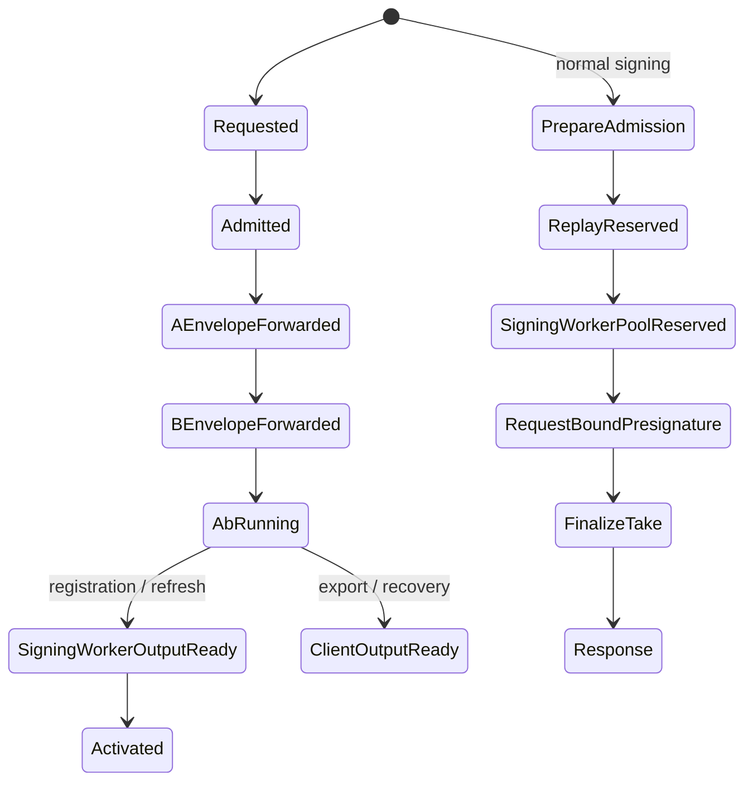

Any state can terminate as failed, expired, or abandoned before activation or
client output. Activated state replacement requires a newer activation
timestamp for the same account, active-state session id, and SigningWorker.

ECDSA-HSS transcript domains are protocol-specific:

| Domain                     | Current label                                                     |
| -------------------------- | ----------------------------------------------------------------- |
| Stable key context         | `ecdsa-hss:context:v2`                                            |
| Context binding            | `ecdsa-hss:role-local:v2:context-binding`                         |
| Public identity            | `router-ab-protocol/ecdsa-hss/public-identity/v1`                 |
| Registration request       | `router-ab-protocol/ecdsa-hss/registration-request/v1`            |
| Export request             | `router-ab-protocol/ecdsa-hss/export-request/v1`                  |
| Recovery request           | `router-ab-protocol/ecdsa-hss/recovery-request/v1`                |
| Activation refresh request | `router-ab-protocol/ecdsa-hss/refresh-request/v1`                 |
| Normal-signing scope       | `router-ab-protocol/ecdsa-hss/normal-signing-scope/v1`            |
| Prepare request            | `router-ab-protocol/ecdsa-hss/normal-signing-request/v1`          |
| Finalize request           | `router-ab-protocol/ecdsa-hss/normal-signing-finalize-request/v1` |

Every registration, export, recovery, and refresh transcript binds wallet id,
RP id, key scope, ECDSA threshold key id, signing root id, signing root version,
key purpose, key version, Router id, Deriver A identity, Deriver B identity,
SigningWorker identity, client identity, replay nonce, request kind,
secp256k1 compressed public keys where applicable, Ethereum address where
applicable, and the context binding. Export binds the export authorization
digest. Recovery binds the recovery authorization digest. Refresh binds the
refresh authorization digest plus previous and next activation epochs. Normal
signing binds the active normal-signing scope digest, request id, selected
client presignature id, signing digest, expiry, prepare digest, and finalize
client signature share.

The active-state session id is:

```text
{ecdsa_threshold_key_id}:{signing_root_id}:{signing_root_version}:{activation_epoch}
```

That value is the Wallet Session `session_id` for ECDSA-HSS normal signing and
the SigningWorker active-state lookup key component. This prevents one wallet,
key id, and worker from colliding across signing root versions or activation
epochs.

Envelope and output kinds:

| Operation              | Deriver envelopes                 | Output                                              |
| ---------------------- | --------------------------------- | --------------------------------------------------- |
| Registration/bootstrap | Signer A/B registration envelopes | SigningWorker activation bundles                    |
| Explicit export        | Signer A/B export envelopes       | Client-recipient export bundles                     |
| Recovery               | Signer A/B recovery envelopes     | Client-recipient recovery/export bundles            |
| Activation refresh     | Signer A/B refresh envelopes      | SigningWorker activation bundles for the next epoch |
| Normal signing         | None                              | SigningWorker ECDSA signature response              |

Public identity equations:

```text
X_client = x_client * G
X_server = x_server * G
X = X_client + X_server
ethereum_address = last20(keccak256(uncompressed(X)[1..]))
```

The client verifies explicit export by reconstructing `x_export`, checking
`x_export * G == X`, and checking the Ethereum address derived from `X`.
SigningWorker activation verifies the opened server material by deriving the
public server key and requiring the resulting public identity to equal the
activated identity. Refresh must preserve public identity while advancing the
activation epoch.

Activation receipts contain the stable ECDSA-HSS context, public identity,
SigningWorker identity, activation epoch, activation digest, activated timestamp,
and generic SigningWorker output storage receipt. Failure cases include
malformed or unknown fields, wrong envelope role, wrong Deriver identity, wrong
SigningWorker identity, stale or non-advancing activation epoch, expired
request, replayed nonce, authorization digest mismatch, context/public-identity
mismatch, active-state mismatch, public key/address mismatch, and presignature
record drift or replay.

### 8.8 Detailed ECDSA-HSS Flow Rejection Boundaries

#### Registration / Bootstrap

The registration/bootstrap sequence is shown in Section 8.3.

The SigningWorker opens only the material intended for it. It derives or
receives enough public evidence to return:

- `X_server`
- `X = X_client + X_server`
- Ethereum address
- activation digest
- SigningWorker identity and key epoch

Router can validate public receipt shape, but it cannot decrypt A/B envelopes or
SigningWorker activation bundles.

#### Explicit Key Export

The explicit key export sequence is shown in Section 8.4.

The key export path should require Deriver A/B participation. The SigningWorker
should not release active signing material for export. Export must remain:

- explicit
- user-confirmed
- transcript-bound
- nonce/replay protected
- auditable
- client-side reconstructed and verified

The server-side export response must never contain:

- canonical `x`
- `privateKeyHex`
- `x_client`
- `y_client`
- `y_server`
- backend threshold private shares

#### Normal ECDSA Signing

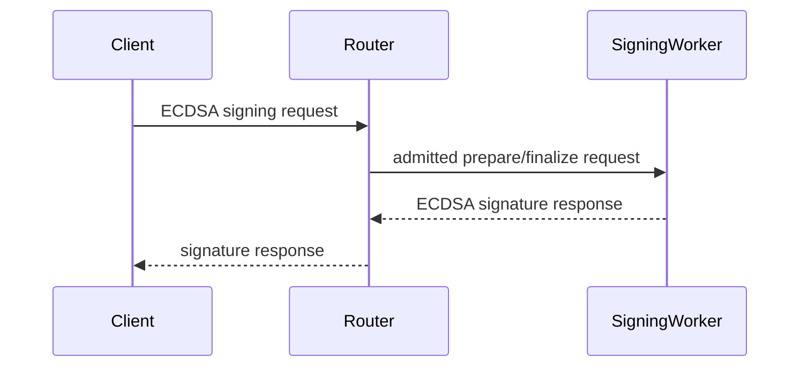

Normal signing uses the activated SigningWorker state. Router-A-B adds no A/B
round trip to each normal ECDSA signature.

If the current ECDSA signing backend still needs a threshold client-side
participant for a specific signing mode, that protocol remains a
SigningWorker/client signing protocol. Deriver A/B stay out of online signing.

## 9. Admission, Replay, Budget, Expiry

### 9.1 Expensive-Work Admission

Expensive-work admission protects Router CPU, queue slots, Deriver CPU, Deriver
queues, and A/B protocol capacity.

Router derives gate context from trusted metadata:

- source IP or edge-provided client address
- authenticated user/session when present
- org/project/environment
- request kind
- account or wallet id
- normalized Email OTP email when present
- coarse device/session id where privacy-acceptable

The client may request an operation. It must not supply the gate decision or
gate identity.

Decision shape:

```ts
type ExpensiveWorkGateDecision =
  | { kind: 'accepted'; requestId: string }
  | { kind: 'reuse_existing'; requestId: string; existingLifecycleId: string }
  | { kind: 'defer'; reason: 'short_window_saturated' | 'deriver_queue_saturated' }
  | { kind: 'rejected'; reason: 'rate_limited' | 'abuse_policy'; retryAfterMs: number };
```

Operational rules:

- short-window gates default to one active expensive prepare per key per `5s` to
  `10s` in production
- duplicate normal-user clicks reuse the current pending lifecycle
- early precompute is independently disableable per deployment, org/project
  policy, or incident response state
- saturated deriver queues return `defer`
- rejected requests stop before Deriver A, Deriver B, or HSS prepare work
- gate records are short-lived, scoped, and cleaned up on completion, expiry, or
  abandon

### 9.2 Expiry

Worker/server time is authoritative. Wallet Session, prepare request, finalize
request, replay reservation, quota reservation, budget reservation, and
SigningWorker nonce/presign records are live only while `now_unix_ms <
expires_at_ms`. Exact equality is expired. Clock-skew allowance is `0 ms`.

Effective maximum lifetime is the minimum of request expiry, Wallet Session
expiry, active SigningWorker state expiry, replay reservation expiry, budget
reservation expiry, and private material expiry.

### 9.3 Replay

Replay checks run after authentication and scope validation and before budget
reserve where possible. Duplicate prepares should reuse idempotent prepared state
when the original request identity and digest match. Drift or mismatch rejects
without consuming budget or one-use signing material.

Finalize/sign replay is single-use. Once a nonce or presignature record is
claimed for an admitted signing digest, it cannot be reused for a different
request or returned to the pool.

### 9.4 Budget

Server-side Wallet Session budget is authoritative. SDK budget state is a local
projection only.

Signing routes use reserve/commit/release semantics:

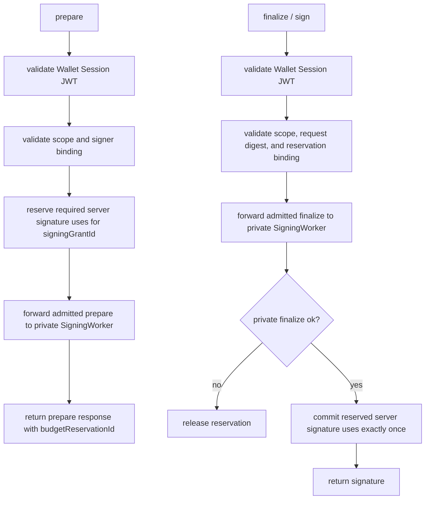

NEAR, Tempo, and EVM share the same Wallet Session budget when they share the
same `signingGrantId`. A post-exhaustion step-up mint creates a new signing
grant and budget counter.

## 10. Implementation Reference

### 10.1 Core Crates And Packages

`router-ab-core` owns:

- role-separated protocol types
- lifecycle state
- canonical bytes
- transcript binding
- request and response digest construction
- source guards
- local simulation primitives

`router-ab-cloudflare` owns:

- strict Router, Deriver A, Deriver B, and SigningWorker workers
- role-specific bindings
- private route boundaries
- Durable Object scopes
- activation state
- release checks

SDK packages own:

- typed Router A/B route clients
- Wallet Session state parsing
- worker material handle orchestration
- signable-state classifiers
- runtime policy scope binding
- browser Worker calls

### 10.2 Host Traits

Cloudflare and local development adapters should implement protocol-neutral host
traits for clock, RNG, key access, sealed share storage, Durable Object storage,
peer transport, internal service auth, and diagnostics sinks.

Core protocol logic should not import Cloudflare runtime types directly.

### 10.3 Bundle Discipline

Role bundles are separate. Router, Deriver A, Deriver B, and SigningWorker
entrypoints should include only the code needed by that role. Bundle size and
startup-time evidence belong in deployment docs and release evidence, not in this
spec.

### 10.4 Source Guards

Source guards should reject:

- production imports of joined-state HSS executor types in Router A/B paths
- public route parsing in private SigningWorker routes
- browser Wallet Session parsing in private worker code
- old public threshold signing route reintroduction
- client-visible Router normal-signing grants
- TypeScript access to raw Ed25519 client-base material or ECDSA signing shares
- final signing paths that read raw persistence material optionals or invoke
  restore or derivation setup
- persisted record classifiers that mark material handles as sign-ready without
  worker validation
- logs containing protocol payload plaintext
- server export responses containing canonical private keys or raw root material

### 10.5 Rust Domain Type Appendix

These types are intentionally close to compilable Rust. Opaque byte wrappers
should be newtypes, not raw `Vec<u8>` aliases, in the actual implementation.

```rust
pub enum Role {
    Router,
    DeriverA,
    DeriverB,
    SigningWorker,
    Client,
}

pub enum RequestKind {
    Registration,
    Activation,
    Recovery,
    Refresh,
    Export,
}

pub struct RoleIdentity {
    pub role: Role,
    pub role_id: RoleId,
    pub key_epoch: RoleKeyEpoch,
    pub verifying_key: PublicKeyBytes,
}

pub struct TranscriptBinding {
    pub protocol_version: ProtocolVersion,
    pub request_kind: RequestKind,
    pub request_id: RequestId,
    pub account_id: AccountId,
    pub session_id: SessionId,
    pub org_id: OrgId,
    pub project_id: ProjectId,
    pub environment_id: EnvironmentId,
    pub signing_root_id: SigningRootId,
    pub signing_root_version: SigningRootVersion,
    pub root_share_epoch: RootShareEpoch,
    pub deriver_a: RoleIdentity,
    pub deriver_b: RoleIdentity,
    pub signing_worker: RoleIdentity,
    pub client_ephemeral_public_key: PublicKeyBytes,
    pub router_request_digest: DigestBytes,
    pub transcript_nonce: NonceBytes,
    pub expires_at_ms: UnixMillis,
}

pub struct EncryptedDeriverEnvelope<R> {
    pub role: R,
    pub transcript_digest: TranscriptDigest,
    pub aad_digest: DigestBytes,
    pub ciphertext: CiphertextBytes,
}

pub enum AbProtocolMessage {
    AToB(AuthenticatedPeerMessage<DeriverARole, DeriverBRole>),
    BToA(AuthenticatedPeerMessage<DeriverBRole, DeriverARole>),
}

pub struct EncryptedClientOutputPackage {
    pub transcript_digest: TranscriptDigest,
    pub output_kind: ClientOutputKind,
    pub recipient_client_key: PublicKeyBytes,
    pub ciphertext: CiphertextBytes,
}

pub struct SigningWorkerOutputPackage {
    pub transcript_digest: TranscriptDigest,
    pub output_kind: SigningWorkerOutputKind,
    pub recipient_signing_worker: RoleIdentity,
    pub package_bytes: CanonicalBytes,
}

pub enum ExpensiveWorkGateDecision {
    Accepted { request_id: RequestId },
    ReuseExisting { request_id: RequestId, lifecycle_id: CeremonyId },
    Defer { reason: DeferReason },
    Rejected { reason: RejectReason, retry_after_ms: u64 },
}
```

Role marker types should make invalid engine calls unrepresentable:

```rust
pub enum DeriverARole {}
pub enum DeriverBRole {}

pub type DeriverAEnvelope = EncryptedDeriverEnvelope<DeriverARole>;
pub type DeriverBEnvelope = EncryptedDeriverEnvelope<DeriverBRole>;
```

### 10.6 Host Trait Definitions

The platform-agnostic engines depend on host traits. Cloudflare, local test
servers, and future TypeScript/Wasm hosts supply implementations.

```rust
pub trait Clock {
    fn now_ms(&self) -> UnixMillis;
}

pub trait Csprng {
    fn fill_random(&mut self, out: &mut [u8]) -> Result<(), HostError>;
}

pub trait DeriverKeyStore {
    fn deriver_identity(&self, role: Role) -> Result<RoleIdentity, HostError>;
    fn decrypt_envelope_key(&self, role: Role) -> Result<KeyBytes, HostError>;
    fn sign_transcript(&self, digest: TranscriptDigest) -> Result<SignatureBytes, HostError>;
}

pub trait SigningRootShareStore {
    fn load_role_share(
        &self,
        role: Role,
        root: SigningRootRef,
    ) -> Result<SealedSigningRootShare, HostError>;
}

pub trait PeerTransport {
    fn send_peer_message(
        &self,
        peer: RoleIdentity,
        message: AbProtocolMessage,
    ) -> Result<AbProtocolMessage, HostError>;
}

pub trait SigningWorkerStateStore {
    fn activate_signing_worker_output(
        &self,
        transcript: TranscriptDigest,
        package: SigningWorkerOutputPackage,
    ) -> Result<SigningWorkerActivationReceipt, HostError>;
}

pub trait AuditSink {
    fn record(&self, event: RedactedCeremonyDiagnostics) -> Result<(), HostError>;
}

pub trait DeriverHost:
    Clock + Csprng + DeriverKeyStore + SigningRootShareStore + PeerTransport + AuditSink
{
}

pub trait SigningWorkerHost: Clock + SigningWorkerStateStore + AuditSink {}
```

Host implementations must not expose decrypted payloads to logging or diagnostics
interfaces.

### 10.7 Cloudflare Adapter Details

`crates/router-ab-cloudflare` owns Cloudflare-specific binding descriptors and
startup validation. The first layer is intentionally independent of
`workers-rs`; the later Worker entrypoints parse `worker::Env` into these typed
descriptors.

The optional `workers-rs` feature pins `worker = 0.8.4`. The Worker bridge
requires Rust 1.88 or newer because the current Workers SDK dependency graph
includes `wasm-streams` 0.6.x. `CloudflareWorkerEnvReaderV1` adapts real
`worker::Env` text vars to the typed parser.
`parse_cloudflare_worker_bindings_from_worker_env_v1` then checks runtime
presence of every configured Durable Object namespace and service binding before
returning accepted startup descriptors.

#### Target Yao A/B Orchestration Gate

Strict production uses recipient-side combine over active-output-bound Yao
shares. A and B decode only their own role-private output shares, encrypt each
share to its fixed recipient, and return the exact ciphertexts plus their
co-signed public output receipt to Router. Router is the mandatory opaque relay
to Client and SigningWorker.

The decrypted target payloads are the disjoint
`Ed25519YaoActivationSharePayloadV1` and
`Ed25519YaoSeedExportSharePayloadV1` shapes from Section 5.8. The public wire
payloads are their corresponding ciphertext types. Activation payloads bind one
canonical scalar share, one public point commitment, and one active-output
binding. Export payloads bind one seed share and exist only under the explicit
authorized export functionality. Neither shape nests an HSS proof batch or
contains a joined recipient value.

Router independently dispatches the compact role envelopes to A and B. A and B
then use direct signed cross-account HTTPS for the binary garbled stream,
malicious OT, and bounded control frames. The large stream never traverses
Router. After both one-use tickets reach `Consumed`, each role returns its
persisted recipient ciphertexts and the complete package-digest set to Router.

Strict release gates:

- Client parsing rejects every SigningWorker-output package.
- SigningWorker parsing rejects every client-output or seed-export package.
- Non-export parsing rejects every seed-bearing package.
- Router relays exact opaque ciphertext and verifies only public receipt and
  delivery metadata; it cannot decrypt or combine recipient outputs.
- Each recipient verifies the active-output binding, scalar-to-point relation,
  package digest set, transcript root, and co-signed receipt before combining.
- No Deriver-side combine, synchronous joined-state adapter, or clear
  reconstruction profile satisfies the strict production gate.

Historical implementation note: the current
`RecipientProofBundlePayloadV1`, `RecipientProofBundleCiphertextV1`,
`WireMessageKindV1::RecipientProofBundle`, and
`AbDerivationProofBatchPayloadV1` code belongs to the superseded HSS path. It may
remain temporarily as migration evidence while replacement work is incomplete.
It is scheduled for hard deletion and supplies no Yao security or release
evidence.

Durable Object scopes:

```rust
pub enum CloudflareDurableObjectScopeV1 {
    RouterReplay,
    RouterLifecycle,
    RouterProjectPolicy,
    RouterQuota,
    RouterAbuse,
    SignerRootShare { role: Role },
    SigningWorkerOutput,
}
```

Visibility rules:

| Worker        | Allowed Durable Object scopes                                                          |
| ------------- | -------------------------------------------------------------------------------------- |
| Router        | `RouterReplay`, `RouterLifecycle`, `RouterProjectPolicy`, `RouterQuota`, `RouterAbuse` |
| Deriver A     | `SignerRootShare { role: DeriverA }`                                                   |
| Deriver B     | `SignerRootShare { role: DeriverB }`                                                   |
| SigningWorker | `SigningWorkerOutput`                                                                  |

Deriver-envelope key-source rules:

Production deriver envelopes use public-key HPKE. Clients encrypt the Deriver A
and Deriver B envelopes to deriver role public envelope keys. The selected public
key epoch is bound into the request transcript and role-envelope AAD. Daily key
rotation is acceptable when each deriver keeps current and previous private
decrypt keys only through request TTL plus retry grace, then rejects stale
epochs.

Implemented production metadata:

- `DeriverEnvelopeHpkePayloadV1` canonical bytes bind recipient role, key epoch,
  recipient public key, role-envelope AAD digest, HPKE encapsulated X25519 key,
  and ciphertext/tag bytes before any platform decrypt.
- `CloudflareDeriverEnvelopeHpkePublicKeyV1`,
  `CloudflareDeriverEnvelopeHpkePublicKeySetV1`, and
  `CloudflareDeriverEnvelopeHpkeDecryptKeyBindingV1` validate deriver role,
  canonical `x25519:<64 lowercase hex chars>` public-key encoding, key epoch,
  and role-local private binding visibility.
- Cloudflare Router and opposite-deriver startup guards reject HPKE private-key
  binding Env keys.
- `router-ab-cloudflare` exposes native deriver-envelope HPKE seal/open helpers
  and a `workers-rs` HPKE Secret-loading decrypt wrapper. The wrapper decodes a
  versioned private-key Secret, validates public HPKE payload metadata, checks
  the supplied AAD digest, and then calls HPKE open.
- Strict Deriver A/B Worker startup bindings and decrypt-and-handle paths use
  the HPKE decrypt-key descriptor and HPKE open wrapper.

Deriver-envelope HPKE private-key source rules:

| Worker        | Allowed deriver-envelope Secret bindings                                                                    |
| ------------- | ----------------------------------------------------------------------------------------------------------- |
| Router        | none                                                                                                        |
| Deriver A     | `SIGNER_A_ENVELOPE_HPKE_PRIVATE_KEY`, optional `SIGNER_A_PREVIOUS_ENVELOPE_HPKE_PRIVATE_KEY` during overlap |
| Deriver B     | `SIGNER_B_ENVELOPE_HPKE_PRIVATE_KEY`, optional `SIGNER_B_PREVIOUS_ENVELOPE_HPKE_PRIVATE_KEY` during overlap |
| SigningWorker | none                                                                                                        |

Direct A/B peer-message signing key-source rules:

| Worker        | Allowed peer-message signing Secret bindings |
| ------------- | -------------------------------------------- |
| Router        | none                                         |
| Deriver A     | `SIGNER_A_PEER_SIGNING_KEY` only             |
| Deriver B     | `SIGNER_B_PEER_SIGNING_KEY` only             |
| SigningWorker | none                                         |

Direct A/B peer-message verifying key-source rules:

| Worker        | Allowed peer-message verifying keys                                  |
| ------------- | -------------------------------------------------------------------- |
| Router        | optional public config only                                          |
| Deriver A     | `SIGNER_A_PEER_VERIFYING_KEY_HEX`, `SIGNER_B_PEER_VERIFYING_KEY_HEX` |
| Deriver B     | `SIGNER_A_PEER_VERIFYING_KEY_HEX`, `SIGNER_B_PEER_VERIFYING_KEY_HEX` |
| SigningWorker | optional public config only                                          |

The Cloudflare parser receives public key-source descriptors and public
verifying-key bytes:

```text
SIGNER_A_ENVELOPE_HPKE_PRIVATE_KEY_BINDING
SIGNER_A_ENVELOPE_HPKE_KEY_EPOCH
SIGNER_A_ENVELOPE_HPKE_PUBLIC_KEY
SIGNER_B_ENVELOPE_HPKE_PRIVATE_KEY_BINDING
SIGNER_B_ENVELOPE_HPKE_KEY_EPOCH
SIGNER_B_ENVELOPE_HPKE_PUBLIC_KEY
SIGNER_A_PREVIOUS_ENVELOPE_HPKE_PRIVATE_KEY_BINDING
SIGNER_A_PREVIOUS_ENVELOPE_HPKE_KEY_EPOCH
SIGNER_A_PREVIOUS_ENVELOPE_HPKE_PUBLIC_KEY
SIGNER_B_PREVIOUS_ENVELOPE_HPKE_PRIVATE_KEY_BINDING
SIGNER_B_PREVIOUS_ENVELOPE_HPKE_KEY_EPOCH
SIGNER_B_PREVIOUS_ENVELOPE_HPKE_PUBLIC_KEY
ROUTER_AB_PREVIOUS_ENVELOPE_HPKE_RETIRE_AT_MS
SIGNER_A_PEER_SIGNING_KEY_BINDING
SIGNER_A_PEER_SIGNING_KEY_EPOCH
SIGNER_B_PEER_SIGNING_KEY_BINDING
SIGNER_B_PEER_SIGNING_KEY_EPOCH
SIGNER_A_PEER_VERIFYING_KEY_HEX
SIGNER_B_PEER_VERIFYING_KEY_HEX
```

For the production HPKE path, `*_PRIVATE_KEY_BINDING` names a role-local
Cloudflare Secret binding containing the HPKE private key material. The paired
`*_PUBLIC_KEY` is public `x25519:<64 lowercase hex chars>` metadata and
`*_KEY_EPOCH` is public rotation metadata. Router may receive public keys and
key epochs. Router must reject private-key binding Env keys, and each deriver
must reject the other deriver's private-key binding Env key.
Previous signer-envelope HPKE private bindings are configured as an all-or-none
set: previous private binding, previous key epoch, previous public key, and
`ROUTER_AB_PREVIOUS_ENVELOPE_HPKE_RETIRE_AT_MS`.

The HPKE private-key Secret text format is:

```text
hpke-x25519-private-v1:<64 lowercase hex chars>
```

The 32 decoded bytes must parse as `hpke-ng` X25519 private-key bytes. The
runtime rejects unsupported prefixes, malformed hex, wrong lengths, and private
key parse errors before attempting HPKE open.

For peer signing keys, `*_BINDING` names a Cloudflare Secret containing an
unpadded base64url Ed25519 signing seed of exactly 32 bytes. `*_EPOCH` must
match the sender `RoleIdentityV1.key_epoch` before the Worker signs a peer
message.

Production deriver-envelope ciphertext uses a strict public HPKE payload wrapper
inside the outer `EncryptedPayloadV1`:

```text
lp("router-ab-protocol/deriver-envelope-hpke/v1")
lp("hpke-x25519-hkdf-sha256-aes256gcm/v1")
lp(recipient_role)
lp(key_epoch)
lp(recipient_public_key)
lp(aad_digest[32])
lp(encapped_key[32])
u32be(tag_len = 16)
lp(ciphertext || tag)
```

The parser must reject unsupported versions or algorithms, non-deriver recipient
roles, empty key epochs, malformed recipient public-key encodings, AAD digest
mismatches with the outer envelope, key epoch mismatches with the role-local
decrypt-key descriptor, public-key mismatches with the role-local descriptor,
non-32-byte encapsulated keys, non-128-bit tags, tag-only payloads, and trailing
bytes. Platform decryptors pass `encapped_key`, canonical AAD bytes, and
`ciphertext || tag` to HPKE open, then feed decrypted bytes into the
post-decrypt `DeriverInputPlaintextV1` validation boundary.

Startup validation must reject:

- Router bindings that include deriver root-share or SigningWorker-output scopes
- Router bindings that include Deriver A or Deriver B envelope-key descriptors
- Deriver A bindings that include Deriver B root-share scopes
- Deriver A bindings that include Deriver B envelope-key descriptors
- Deriver B bindings that include Deriver A root-share or SigningWorker-output
  scopes
- Deriver B bindings that include Deriver A envelope-key descriptors
- Deriver A or Deriver B bindings that include SigningWorker-output scopes
- root-share startup checks whose deriver role differs from the Worker role

Durable Object operations should be explicit Router A/B operations:

```text
root_share.has
root_share.startup_metadata
router_replay.reserve
router_lifecycle.put_public_state
router_project_policy.evaluate
router_quota.evaluate
router_abuse.evaluate
router_normal_signing_project_policy.evaluate
router_normal_signing_quota.evaluate
router_normal_signing_abuse.evaluate
signing_worker_output.activate
signing_worker_output.active_state_get
signing_worker_output.material_get
```

The Cloudflare adapter owns typed request and response structs for these
operations. `CloudflareDurableObjectCallV1` binds the initiating Worker role,
the validated Durable Object binding descriptor, and the typed operation body.
It rejects calls whose operation requires a different storage scope or whose
Worker role cannot see the binding. The `workers-rs` executor posts the typed
operation JSON to the Durable Object stub selected by `binding.object_name` and
validates that the typed response branch matches the request before returning.
`router_lifecycle.put_public_state` currently stores the Router admission
lifecycle with transition enforcement. The full derivation ceremony lifecycle
needs a dedicated Cloudflare record before production release.

Generic key/value Durable Object access can exist inside the adapter
implementation, while Router A/B host traits should receive typed operations and
typed responses.

### 10.8 Cloudflare Adapter Boundary

Router A/B should use Cloudflare Durable Objects only through role-specific
adapter bindings. Durable Objects provide Cloudflare-native persistence,
single-object atomicity, replay/idempotency coordination, and operationally
simple local state. They are not a security boundary against a compromised
Worker that is already allowed to access the binding.

The adapter boundary must preserve the same role separation as the local SQLite
host-store checks:

```text
Router Worker:
  allowed Durable Object scopes:
    router replay/idempotency state
    router public lifecycle state
  allowed deriver-envelope HPKE private keys:
    none
  allowed A/B peer signing keys:
    none
  allowed A/B peer verifying keys:
    optional public config only
  forbidden Durable Object scopes:
    Deriver A sealed root shares
    Deriver B sealed root shares
    SigningWorker activation state
  forbidden deriver-envelope HPKE private keys:
    Deriver A deriver-envelope private key
    Deriver B deriver-envelope private key
  forbidden A/B peer signing keys:
    Deriver A peer-message signing key
    Deriver B peer-message signing key

Deriver A Worker:
  allowed Durable Object scopes:
    Deriver A sealed root shares
  allowed deriver-envelope HPKE private keys:
    Deriver A deriver-envelope private key
  allowed A/B peer signing keys:
    Deriver A peer-message signing key
  allowed A/B peer verifying keys:
    Deriver A and Deriver B peer-message verifying keys
  forbidden Durable Object scopes:
    Deriver B sealed root shares
    SigningWorker activation state
    Router replay state
  forbidden deriver-envelope HPKE private keys:
    Deriver B deriver-envelope private key
  forbidden A/B peer signing keys:
    Deriver B peer-message signing key

Deriver B Worker:
  allowed Durable Object scopes:
    Deriver B sealed root shares
  allowed deriver-envelope HPKE private keys:
    Deriver B deriver-envelope private key
  allowed A/B peer signing keys:
    Deriver B peer-message signing key
  allowed A/B peer verifying keys:
    Deriver A and Deriver B peer-message verifying keys
  forbidden Durable Object scopes:
    Deriver A sealed root shares
    SigningWorker activation state
    Router replay state
  forbidden deriver-envelope HPKE private keys:
    Deriver A deriver-envelope private key
  forbidden A/B peer signing keys:
    Deriver A peer-message signing key

SigningWorker Worker:
  allowed Durable Object scopes:
    SigningWorker activation state
  allowed deriver-envelope HPKE private keys:
    none
  allowed A/B peer signing keys:
    none
  allowed A/B peer verifying keys:
    optional public config only
  forbidden Durable Object scopes:
    Deriver A sealed root shares
    Deriver B sealed root shares
    Router replay state
  forbidden deriver-envelope HPKE private keys:
    Deriver A deriver-envelope private key
    Deriver B deriver-envelope private key
  forbidden A/B peer signing keys:
    Deriver A peer-message signing key
    Deriver B peer-message signing key
```

The development and benchmark-only same-account profile may use these separate
bindings in one Cloudflare account:

```text
ROUTER_REPLAY_DO
ROUTER_LIFECYCLE_DO
DERIVER_A_ROOT_SHARE_DO
DERIVER_B_ROOT_SHARE_DO
SIGNING_WORKER_OUTPUT_DO
DERIVER_A_ENVELOPE_HPKE_PRIVATE_KEY
DERIVER_B_ENVELOPE_HPKE_PRIVATE_KEY
DERIVER_A_ENVELOPE_HPKE_PUBLIC_KEY
DERIVER_B_ENVELOPE_HPKE_PUBLIC_KEY
DERIVER_A_PEER_SIGNING_KEY
DERIVER_B_PEER_SIGNING_KEY
DERIVER_A_PEER_VERIFYING_KEY_HEX
DERIVER_B_PEER_VERIFYING_KEY_HEX
```

Strict production requires separate accounts. Each account owns only the
bindings it needs, and no deploy principal or credential can administer both A
and B:

```text
Router account:
  ROUTER_REPLAY_DO
  ROUTER_LIFECYCLE_DO

Deriver A account:
  DERIVER_A_ROOT_SHARE_DO
  DERIVER_A_ENVELOPE_HPKE_PRIVATE_KEY
  DERIVER_A_ENVELOPE_HPKE_PUBLIC_KEY
  DERIVER_A_PEER_SIGNING_KEY
  DERIVER_A_PEER_VERIFYING_KEY_HEX
  DERIVER_B_PEER_VERIFYING_KEY_HEX

Deriver B account:
  DERIVER_B_ROOT_SHARE_DO
  DERIVER_B_ENVELOPE_HPKE_PRIVATE_KEY
  DERIVER_B_ENVELOPE_HPKE_PUBLIC_KEY
  DERIVER_B_PEER_SIGNING_KEY
  DERIVER_A_PEER_VERIFYING_KEY_HEX
  DERIVER_B_PEER_VERIFYING_KEY_HEX

SigningWorker account:
  SIGNING_WORKER_OUTPUT_DO
  SIGNING_WORKER_PUBLIC_KEY
```

Deriver-envelope HPKE private keys and A/B peer-message signing keys are
Cloudflare Secret bindings. Deriver-envelope HPKE public keys and A/B
peer-message verifying keys are public config. The typed startup parser
receives only public descriptors and public verifying-key bytes:

```text
DERIVER_A_ENVELOPE_HPKE_PRIVATE_KEY_BINDING=DERIVER_A_ENVELOPE_HPKE_PRIVATE_KEY
DERIVER_A_ENVELOPE_HPKE_KEY_EPOCH=envelope-hpke-key-epoch-a
DERIVER_A_ENVELOPE_HPKE_PUBLIC_KEY=x25519:<64 lowercase hex chars>
DERIVER_B_ENVELOPE_HPKE_PRIVATE_KEY_BINDING=DERIVER_B_ENVELOPE_HPKE_PRIVATE_KEY
DERIVER_B_ENVELOPE_HPKE_KEY_EPOCH=envelope-hpke-key-epoch-b
DERIVER_B_ENVELOPE_HPKE_PUBLIC_KEY=x25519:<64 lowercase hex chars>
DERIVER_A_PEER_SIGNING_KEY_BINDING=DERIVER_A_PEER_SIGNING_KEY
DERIVER_A_PEER_SIGNING_KEY_EPOCH=key-epoch-a
DERIVER_B_PEER_SIGNING_KEY_BINDING=DERIVER_B_PEER_SIGNING_KEY
DERIVER_B_PEER_SIGNING_KEY_EPOCH=key-epoch-b
DERIVER_A_PEER_VERIFYING_KEY_HEX=<64 lowercase hex chars>
DERIVER_B_PEER_VERIFYING_KEY_HEX=<64 lowercase hex chars>
```

`workers-rs` startup validation checks the configured Secret binding exists,
without loading the key into startup diagnostics. Deriver A startup rejects any
Deriver B envelope-key or peer-signing-key descriptor. Deriver B startup rejects
any Deriver A envelope-key or peer-signing-key descriptor. Router startup rejects
both role-local key classes.

The Durable Object request protocol should use small explicit operations rather
than generic key/value access in Router A/B adapters:

```text
root_share.has {
  signerSetId,
  signerRole,
  rootShareEpoch
}

root_share.startup_metadata {
  signerSetId,
  signerRole,
  rootShareEpoch
}

signing_worker_output.activate {
  transcriptDigest,
  signingWorkerIdentity,
  rootShareEpoch,
  packageDigest
}

router_replay.reserve {
  requestId,
  transcriptDigest,
  expiresAtMs
}
```

Deriver startup must fail closed if the role-specific root-share Durable Object
binding is missing, points at the wrong storage scope, lacks the expected
deriver-set id, lacks the expected root-share epoch, or returns a deriver role
that differs from the Worker role. Router startup must fail if it receives any
deriver root-share or SigningWorker activation binding.

The first `router-ab-cloudflare` crate should pin this boundary with typed
binding descriptors, role-specific startup configs, and validation tests before
adding `workers-rs` request handlers. The later `workers-rs` layer should be a
thin adapter from `worker::Env` and Service Bindings into those typed configs
and the existing `router-ab-core` host traits.

### 10.9 Rust/WASM Implementation Architecture

The implementation should put the protocol-critical code and A/B deriver logic
in platform-agnostic Rust. Cloudflare integration should be a thin
`workers-rs` adapter around that core. The goal is to get Rust's type system,
memory-safety defaults, better constant-time ergonomics, shared native/Wasm test
vectors, compatibility with non-Cloudflare hosts, and a future path toward
Verus-style formal verification.

Preferred split:

```text
pure Rust crates:
  protocol types
  role-specific state machines
  transcript hashing and binding
  encrypted envelope framing
  fixed active Ed25519 Yao protocol and manifests
  ECDSA-only threshold-PRF integration and additive scalar shares
  client-output and SigningWorker-output package validation

platform-agnostic deriver engines:
  Deriver A engine
  Deriver B engine
  SigningWorker activation engine
  host traits for clock, randomness, storage, keys, transport, and audit

workers-rs wrappers:
  Router Worker HTTP entrypoint
  Deriver A Worker HTTP entrypoint
  Deriver B Worker HTTP entrypoint
  SigningWorker Worker HTTP entrypoint
  Cloudflare Env bindings
  fetch/service-binding transport adapters
  response mapping

TypeScript:
  optional build/test harness glue
  optional host implementation using the same canonical wire protocol
  optional Wasm/npm consumer of the Rust protocol core
```

Router, Deriver A, Deriver B, and SigningWorker may all be Rust Workers. The
protocol boundary should still use portable request/response envelopes rather
than Cloudflare-specific object RPC:

```mermaid
sequenceDiagram
  participant R as Router
  participant A as Deriver A
  participant B as Deriver B
  participant SW as SigningWorker

  R->>A: request carrying encrypted A envelope
  R->>B: request carrying encrypted B envelope
  A->>B: transcript-bound protocol messages
  B->>A: transcript-bound protocol messages
  R->>SW: request carrying SigningWorker-output package
```

That keeps the same core usable across:

- local localhost simulation
- same-account Cloudflare Service Bindings
- cross-account Cloudflare HTTPS
- future AWS Nitro or Google Cloud Confidential deriver services

#### Platform-Agnostic Deriver Engines

Deriver A and Deriver B should be ordinary Rust engines that know nothing about
Cloudflare, HTTP frameworks, environment variables, service bindings, or
TypeScript runtimes.

The core shape should be:

```rust
pub struct DeriverEngine<R, H> {
    role: R,
    host: H,
}

impl<R, H> DeriverEngine<R, H>
where
    R: DeriverRole,
    H: DeriverHost,
{
    pub async fn handle_envelope(
        &self,
        input: DeriverEnvelopeRequest,
    ) -> Result<DeriverEnvelopeResponse, DeriverError> {
        // role-specific protocol logic
    }
}
```

The host boundary should be a small set of traits:

```rust
pub trait DeriverHost:
    Clock
    + Csprng
    + DeriverKeyStore
    + SigningRootShareStore
    + PeerTransport
    + AuditSink
{
}
```

The core engine should depend on canonical protocol inputs and host traits. It
should not read environment variables, create HTTP responses, access Cloudflare
bindings directly, or choose transport URLs.

The Cloudflare adapter supplies a host implementation:

```rust
pub struct CloudflareDeriverHost {
    env: worker::Env,
}
```

An Axum, Nitro, GCP, AWS, Node, or TypeScript deployment can use the same model
by implementing the same wire protocol or by calling the Rust core through a
Wasm/npm package.

#### Wire Protocol Compatibility

Inter-service APIs should be stable canonical messages, not Cloudflare object
RPC method calls:

```mermaid
sequenceDiagram
  participant R as Router
  participant A as Deriver A
  participant B as Deriver B
  participant SW as SigningWorker

  R->>A: DeriverARequestBytes
  R->>B: DeriverBRequestBytes
  A->>B: AbProtocolMessageBytes
  B->>A: AbProtocolMessageBytes
  A-->>R: DeriverResponseBytes
  B-->>R: DeriverResponseBytes
  R->>SW: SigningWorkerActivationBytes
```

The outer HTTP body may be JSON for product ergonomics, but transcript hashes
must bind canonical inner bytes. For the current release, `WireMessageV1` is the
canonical inter-service wrapper: fixed field order, a
`router-ab-protocol/wire-message/v1` domain label, 32-bit big-endian length
prefixes, message-kind bytes, transcript digest bytes, and payload bytes. A
different codec requires a later protocol-version bump and fresh vectors.

#### Crate Layout

Router A/B uses three crates. Keep the design modular inside these crates, and
split out more crates only when dependency boundaries or module size require
it.

```text
tools/ed25519-yao-generator
  exact clear Ed25519 reference oracle
  deterministic circuit and schedule generation
  test/CI only; no production reverse dependency

crates/ed25519-yao
  validated fixed protocol and circuit manifests
  actively secure Streaming Yao primitives and role states
  no clear joined evaluator or generator dependency

crates/router-ab-core
  pure Rust derivation and service protocol contracts
  fixed Ed25519 Yao lifecycle and ECDSA threshold-PRF lifecycle
  transcript, envelope, lifecycle, wire, host-trait, and local simulation modules
  vectors, measurement gates, specs, and formal-verification scaffolding

crates/router-ab-dev
  local database-driver adapters
  SQLite seed and smoke binaries
  development-only persistence verification

crates/router-ab-cloudflare
  workers-rs adapters
  Env parsing and binding validation
  Durable Object operation execution
  Service Binding/fetch transport

crates/threshold-prf
  ECDSA threshold-PRF primitives and vectors
```

Optional later package:

```text
packages/router-ab-wasm
  wasm-bindgen/npm package for TypeScript hosts
```

`router-ab-core` must remain platform-neutral and avoid Cloudflare APIs,
filesystem APIs, ambient time, ambient randomness, database drivers, and broad
async dependencies. Boundary adapters inject time, randomness, peer identities,
transport, and storage.

`router-ab-cloudflare` should do only boundary work:

- convert `worker::Request` into canonical protocol input
- parse `worker::Env` into a `CloudflareDeriverHost`
- call platform-agnostic engines
- convert protocol output into `worker::Response`
- map service bindings or fetch into `PeerTransport`
- map Cloudflare secrets/storage into key and share stores

The adapter should not contain HSS derivation logic, threshold-PRF logic,
output-opening logic, or transcript construction beyond invoking the shared
core.

Suggested folder structure:

```text
crates/router-ab-core/
  Cargo.toml
  src/
    lib.rs
    derivation/
      mod.rs
      candidate_mpc_prf.rs
      candidate_mpc_prf_threshold_backend.rs
      context.rs
      diagnostics.rs
      envelope.rs
      evidence.rs
      leakage.rs
      material.rs
      scope.rs
      state_machine.rs
      transcript.rs
      vectors.rs
      wire/
        mod.rs
    protocol/
      mod.rs
      envelope.rs
      error.rs
      gate.rs
      identity.rs
      lifecycle.rs
      local.rs
      output.rs
      payload.rs
      vectors.rs
      wire.rs
      engine/
        mod.rs
        host.rs
        router.rs
        deriver_a.rs
        deriver_b.rs
        signing_worker.rs
    bin/
      emit_contract_vectors.rs
      emit_payload_vectors.rs
      emit_wire_vectors.rs

  benches/
    derivation_candidates.rs
  fixtures/
    derivation/
    protocol/
  specs/
  formal-verification/
  tests/
    *_tests.rs

crates/router-ab-dev/
  Cargo.toml
  src/
    lib.rs
    bin/
      dev_seed_router_ab_sqlite.rs
  tests/
    sqlite_seed.rs

crates/router-ab-cloudflare/
  Cargo.toml
  src/
    lib.rs
    durable_object.rs
```

#### Verification Path

Keep the protocol core friendly to later formal verification:

- represent roles as distinct types, not strings
- represent lifecycle states as enums with role-specific variants
- make output kinds explicit and unforgeable at the type level
- keep transcript construction deterministic and canonical
- keep parsing and normalization at boundaries
- avoid global mutable state
- isolate cryptographic primitive calls behind narrow traits
- minimize `unsafe`

Initial Verus targets should be state-machine and boundary invariants:

- Router cannot construct deriver plaintext.
- A-only input cannot enter B-only state.
- B-only input cannot enter A-only state.
- client-output Yao share packages cannot be accepted as server output.
- server-output Yao share packages cannot be accepted as client output.
- every accepted output binds to the transcript, role, account, session, and
  request kind.

#### Bundle Size And Startup Budget

Rust/Wasm Workers are compatible with Cloudflare, but binary size becomes a
deployment constraint. The Worker should track:

- compressed Worker size
- uncompressed Worker size
- `startup_time_ms` from Wrangler upload/deploy
- CPU time for setup/export/refresh
- CPU time for normal signing

Cloudflare's current documented limits are:

```text
Worker size after gzip:
  Free: 3 MB
  Paid: 10 MB

Worker size before gzip:
  64 MB

Worker startup time:
  1 second

Memory per isolate:
  128 MB
```

The startup limit applies to parsing and executing global scope. Larger bundles
and expensive top-level initialization increase startup time, so Rust Workers
must avoid doing protocol setup, key derivation, large table generation, or
schema construction in global scope.

Use these rules:

- compile with release size optimizations
- use `wasm-opt`
- keep Router, Deriver A, Deriver B, and SigningWorker as separate Workers so
  each bundle carries only its deployment role's code
- avoid large dependency graphs in Router
- initialize Wasm modules and static data minimally
- put expensive derivation inside request handlers
- run `wrangler deploy --dry-run --outdir bundled` and record gzip size
- record `startup_time_ms` on every release candidate

Startup punishment is workload-specific. Treat the target as:

```text
excellent: < 100 ms startup_time_ms
acceptable: 100-300 ms startup_time_ms
risky: 300-700 ms startup_time_ms
unacceptable: approaching 1000 ms
```

The exact value must be measured with the built bundles. A small Rust/Wasm
protocol Worker may start quickly; a large bundle with broad dependencies,
large static tables, or expensive global initialization can fail Cloudflare's
startup validation.

Current evidence is tracked once in Phase 9B. The latest staging dry-run report
records role-specific upload sizes after ECDSA-HSS strict-route integration:
Router 2887.88 KiB / gzip 879.45 KiB, Deriver A 2336.55 KiB / gzip
737.40 KiB, Deriver B 2336.49 KiB / gzip 738.38 KiB, and SigningWorker
2784.06 KiB / gzip 896.44 KiB. Dry-run does not emit `startup_time_ms`, so real
startup evidence remains pending until Cloudflare upload or deploy.

### 10.10 Detailed Source Guard Matrix

Add source guards for these boundaries:

| Boundary                 | Forbidden                                                                     |
| ------------------------ | ----------------------------------------------------------------------------- |
| Router production code   | deriver plaintext modules, deriver decrypt keys, joined HSS executor types    |
| Deriver A routes         | B plaintext input, B-only envelope decrypt helpers                            |
| Deriver B routes         | A plaintext input, A-only envelope decrypt helpers                            |
| Cloudflare adapters      | HSS joined-state APIs, output projector APIs that materialize `x_client_base` |
| Logging/diagnostics      | protocol payload types, root shares, output shares                            |
| SigningWorker activation | client-output packages, client-output decrypt helpers                         |

Guard tests should fail on imports, route input types, and logging function
signatures. Prefer allowlists for role modules over broad deny-only grep rules
where possible.

### 10.11 Test Vector Manifest

Every vector file should be deterministic and cross-host verifiable.

```json
{
  "vector_version": "router_ab_vector_v1",
  "case_id": "registration_min_level_c_valid_001",
  "protocol_version": "router_ab_v1",
  "request_kind": "registration",
  "canonical_encoding": "borsh",
  "transcript_inputs": {
    "request_id": "req_123",
    "account_id": "acct_123",
    "session_id": "sess_123",
    "signing_root_version": "1",
    "root_share_epoch": "1",
    "deriver_a_key_epoch": "1",
    "deriver_b_key_epoch": "1",
    "signing_worker_key_epoch": "1"
  },
  "canonical_transcript_bytes_b64u": "b64u_bytes",
  "transcript_digest_b64u": "b64u_digest",
  "a_envelope_digest_b64u": "b64u_digest",
  "b_envelope_digest_b64u": "b64u_digest",
  "expected_state": "activated",
  "expected_rejections": []
}
```

Rejection vectors should include:

- wrong deriver role
- wrong deriver key epoch
- expired transcript
- replayed nonce
- client-output package sent to SigningWorker
- SigningWorker-output package sent to client
- mismatched root-share epoch
- mismatched registration intent digest

## 11. Observability, Runbooks, And Operations

### 11.1 Observability And Redaction

Diagnostics may include public ids, state transitions, duration metrics,
response sizes, request ids, transcript digests, role ids, key epochs, and safe
failure codes.

Diagnostics must not include raw protocol payloads, ciphertext plaintext, root
shares, nonce secrets, signing shares, private keys, PRF outputs, or worker
material handles that function as secrets.

### 11.2 Identity Pinning And Rotation

Deriver identity pinning binds Deriver A id/key epoch, Deriver B id/key epoch,
SigningWorker id/key epoch, deriver set id, root-share epoch, and deployment
profile into transcript scope.

HPKE signer-envelope key rotation supports current and previous epochs for a
bounded overlap window. Stale previous-epoch requests must be rejected after the
request TTL overlap expires.

### 11.3 Incident Response

Runbooks should cover:

- Router compromise
- Deriver A compromise
- Deriver B compromise
- Deriver A+B compromise
- SigningWorker compromise
- storage namespace errors
- KEK compromise
- replay-store reset
- CORS/origin misconfiguration
- key epoch rollback
- deployment manifest drift

Deployment-specific runbooks live in
[router-a-b-deployment.md](./router-a-b-deployment.md).

## 12. Future Work

Future protocol and deployment work includes:

- generalized N-of-N deriver sets
- t-of-N deriver quorum
- provider-diverse deployments
- TEE-backed SigningWorker or Deriver roles
- additional publicly verifiable output proofs beyond the mandatory active-Yao
  bindings
- self-host export/import vectors
- distributed or approved-provisioning root-share refresh
- address/public-key parity gates after root-share refresh
- deployed HPKE rotation smoke evidence

Generalized quorum requires a new durable protocol version and transcript labels,
fresh cross-language vectors, leakage and collusion review, refresh/reshare
semantics, deriver-set binding, quorum selection, replay handling, equivocation
handling, duplicate-role tests, wrong-quorum tests, stale-epoch tests, and
mixed-recipient-output tests.

Router A/B v1 remains strict 2-of-2: Deriver A plus Deriver B.

## 13. Non-Goals

- Reintroducing old public threshold signing routes.
- Adding fallback from Router A/B signing to legacy signing paths.
- Treating deployment evidence as local cleanup evidence.
- Letting TypeScript own raw crypto-secret client material.
- A general-purpose malicious-secure MPC framework.
- Two-server online signing for every normal signature.
- Generalized quorum or provider-diverse deployment in Router A/B v1.
