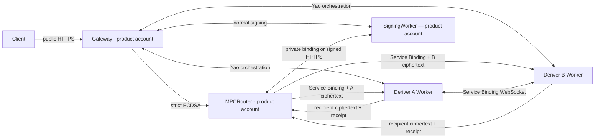

# Router A/B Deployment

Date consolidated: June 20, 2026

Last architecture decision: July 10, 2026

Status: canonical deployment reference for the approved strict Router A/B
topology. The selected P0 production profile uses distinct Deriver Workers,
role-local storage and secrets, and a same-account Service Binding WebSocket.
Independent-account WebSocket remains a deferred stronger-operator profile.

Related active documents:

- [Router A/B specification](./router-a-b-SPEC.md)
- [Router A/B solution refactor](./router-a-b-sol-refactor.md)
- [Streaming Yao A/B plan](./yaos-ab.md)
- [Router A/B local development](./router-a-b-local-dev.md)
- [Deployment runbook](./deployment/README.md)
- [Deployment infrastructure](./deployment/infra.md)

## Approved Protocol Placement

- Ed25519 uses `router_ab_ed25519_yao_v1`. Deriver A is the fixed garbler;
  Deriver B is the fixed evaluator. The large binary stream travels directly
  over a same-account Service Binding WebSocket.
- ECDSA uses strict Router A/B threshold-PRF derivation and additive secp256k1
  scalar shares. It has no dependency on the Ed25519 Yao crate or stream.
- Router performs public admission and opaque routing. It never opens Deriver
  inputs, output shares, Yao frames, or ECDSA role material.
- SigningWorker owns activated server signing state and remains outside both
  derivation protocols after activation.
- Normal Ed25519 and ECDSA signing uses Client, Router, and SigningWorker. It
  makes zero Deriver calls.

## Deployment Profiles

| Profile                                     | Account boundary                                              | Transport                 | Intended use                                      | Security claim                                                                                                  |
| ------------------------------------------- | ------------------------------------------------------------- | ------------------------- | ------------------------------------------------- | --------------------------------------------------------------------------------------------------------------- |
| `router_ab_cloudflare_same_account_p0_v1`   | One account, distinct Workers, secrets, storage, and bindings | Service Binding WebSocket | Production, staging, local parity, and benchmarks | Passive/honest-execution P0 claim; excludes account-admin, shared-CI, malicious-role, and joint-role compromise |
| `router_ab_cloudflare_separate_accounts_v1` | Product/control account plus independent A and B accounts     | Public WebSocket          | Deferred stronger-operator experiment             | May strengthen the administrative corruption boundary after its reconnect, tail-latency, and review gates pass  |

Deployment configuration selects the profile before startup; it is not a
caller-selected protocol option. Production contains only
`router_ab_cloudflare_same_account_p0_v1`. No runtime fallback or transport
negotiation crosses into the deferred independent-account experiment.

## Production Account Topology



The product account owns Gateway, MPCRouter, SigningWorker, Deriver A, and Deriver B.
Deriver A and Deriver B use distinct Worker entrypoints, deployment credentials,
secret bindings, Durable Object namespaces, backup boundaries, log streams, and
audit labels.

Production release requires:

```text
A.deploy_principal_id    != B.deploy_principal_id
A.storage_namespace      != B.storage_namespace
A.peer_signing_key       != B.peer_signing_key
A.envelope_hpke_key      != B.envelope_hpke_key
```

The P0 claim assumes the Cloudflare account administrator and emergency account
credentials remain honest. Day-to-day A and B deploy credentials and secret
bindings remain role-specific.

## Network And Authentication Edges

| Edge                     | Production transport                            | Required binding                                                                                       |
| ------------------------ | ----------------------------------------------- | ------------------------------------------------------------------------------------------------------ |
| Client -> Router         | Public HTTPS                                    | application auth, lifecycle grant, request identity, expiry, replay nonce                              |
| Router -> A              | Service Binding fetch                           | internal service authentication, A binding identity, A HPKE ciphertext, body digest                    |
| Router -> B              | Service Binding fetch                           | internal service authentication, B binding identity, B HPKE ciphertext, body digest                    |
| A -> B / B -> A          | Service Binding WebSocket                       | fixed role, protocol/circuit digest, session-bound framing, transcript, sequence, frame digest, expiry |
| A/B -> recipients        | Router-relayed or direct ciphertext             | recipient identity, request kind, output kind, transcript, active-output binding                       |
| Router <-> SigningWorker | Product-account Service Binding or signed HTTPS | admitted request, SigningWorker identity, activation/session epoch                                     |

The Router never proxies or buffers Yao table frames. Only Deriver A opens the
private `DERIVER_B` Service Binding WebSocket. Public requests cannot select a
transport or reach the peer endpoint.

## Production CI And Deployment Authority

Production uses separate protected deployment paths for A and B. A workflow may
validate every public artifact, while an actor able to release A cannot release
B and vice versa.

Required environments:

```text
production-mpc-router
production-signing-worker
production-deriver-a  # controlled by A operator
production-deriver-b  # controlled by B operator
```

Rules:

- automatic production promotion validates one SHA, then enters each protected
  role environment independently before deploying that role;
- A and B jobs use role-scoped deploy credentials;
- A and B protected environments use separate approver groups and OIDC subjects;
- neither job can read the opposite role's private keys, roots, storage,
  backups, logs, or role-scoped deployment token;
- each operator independently verifies the same content-addressed public
  artifact, protocol digest, circuit digest, and deployment manifest;
- Router and SigningWorker may share the product account and deployment
  authority; neither receives a Deriver root or envelope private key;
- emergency rollback disables admission or deploys a previously reviewed
  artifact independently to each role. It never re-enables an old backend.

The release manifests deploy distinct A and B Workers. The account boundary is
shared by design; the role, secret, storage, deployment, and audit boundaries
remain explicit and fixed.

The implemented deployment artifact phase is defined in
[deployment/README.md](deployment/README.md#follow-up-phase-build-once-deploy-many).
Its shared release manifest may identify all four public role bundles, but each
role artifact must remain independently downloadable and deployable. Artifacts
contain no role secret, generated environment secret, or Cloudflare credential.
A deployment retry reuses the accepted role artifact and still enters that
role's protected GitHub Environment.

## Role Secret Matrix

| Owner         | Private material                                                                      | Forbidden material                                                                          |
| ------------- | ------------------------------------------------------------------------------------- | ------------------------------------------------------------------------------------------- |
| Router        | admission-signing key, replay and lifecycle stores                                    | A/B roots, A/B envelope private keys, A/B peer-signing keys, Yao state, ECDSA scalar shares |
| Deriver A     | A root/provisioning state, A envelope private key, A peer-signing key, A ticket store | every B private value, SigningWorker private key, joined inputs or outputs                  |
| Deriver B     | B root/provisioning state, B envelope private key, B peer-signing key, B ticket store | every A private value, SigningWorker private key, joined inputs or outputs                  |
| SigningWorker | server-output private key, activated signing state, nonce/presign state               | A/B roots, A/B peer keys, client-output private key                                         |

Public verifying and encryption keys may be distributed through a signed
deployment manifest. Private keys use role-local secret stores and rotation
epochs.

## Fail-Closed Startup Validation

Every Worker validates its precise deployment identity before serving traffic.

Router rejects startup when it has:

- a Deriver root/store binding;
- a Deriver envelope private key or peer-signing key;
- any profile other than `router_ab_cloudflare_same_account_p0_v1`;
- a caller-selectable A/B transport;
- an old HSS route or caller-selectable Ed25519 backend.

Deriver A and B reject startup when they have:

- an opposite-role root, private key, storage binding, or deploy identity;
- the same CI principal, storage namespace, envelope key, or peer-signing key as
  the other Deriver;
- a shared bearer credential for an A/B production edge;
- a circuit or protocol digest outside the signed allowlist;
- generator, clear-evaluator, passive-Yao, or old HSS code in the production
  bundle.

SigningWorker rejects startup when it has a Deriver root, Deriver envelope
private key, Yao ticket, or peer-signing key.

## Development And Benchmark Profile

Local development may use a process-local adapter to exercise the same fixed
role machines. The production Worker artifact contains only the Service Binding
WebSocket transport and exposes no runtime transport negotiation. Alternative
HTTP-stream, Workers RPC, and cross-account WebSocket implementations remain
isolated in the benchmark crate.

## Production Release Evidence

The [independent separation review](evidence/router-a-b-deployment/independent-separation-review-2026-07-17.md)
found that the current repository proves role-local same-account staging
boundaries. It does not prove account-administrator independence, which is
outside the selected P0 claim. Its
two local Yao evidence-integrity failures were subsequently repaired through
the canonical gates and recorded in the [local tooling remediation receipt](evidence/router-a-b-deployment/yao-local-tooling-remediation-2026-07-17.md).
That remediation supplies no external control-plane evidence, so every
production item below remains open.

Before production enablement:

- [ ] An independent deployment reviewer verifies Worker, CI, approver,
      credential, storage, backup, log, and audit role separation.
- [ ] Negative tests prove Router cannot access A or B stores, A cannot access B
      resources, and B cannot access A resources.
- [ ] Service Binding WebSocket tests cover wrong peer, wrong role, body tampering, replay,
      expiry, sequence gaps, duplicate frames, and stale deployment epochs.
- [ ] Final role bundles are scanned for opposite-role secrets and forbidden
      dependencies.
- [ ] Both role owners reproduce and approve protocol, circuit, source, and bundle
      digests.
- [ ] Same-account cold/warm p50, p95, p99, CPU, memory, payload, request count,
      retry, and abort measurements pass the Yao plan's gates.
- [ ] ECDSA strict bootstrap, activation, recovery, export, refresh, pool, and
      signing vectors pass with zero Yao dependency.
- [ ] Normal Ed25519 and ECDSA signing traces contain zero Deriver calls.
- [ ] Credential rotation, peer-key rotation, restore, one-role outage, and
      fail-closed rollback drills pass.

## Cutover

This repository is in development. Existing Ed25519 wallets and ceremony state
are invalidated and reprovisioned under one frozen Yao-era stable context. The
cutover deletes losing HTTP-stream, Workers RPC, and cross-account production
transport artifacts, old HSS routes and backend selectors, shared A/B
credentials, generic threshold-service paths, and legacy-only fixtures.
Compatibility logic and dual production profiles are not retained.

## Decision Log

| Date       | Decision                                                                                         | Reason                                                                                                     |
| ---------- | ------------------------------------------------------------------------------------------------ | ---------------------------------------------------------------------------------------------------------- |
| 2026-07-17 | P0 Half-Gates with the existing OT suite is the production Yao profile                           | It is the implemented, reviewed construction that satisfies the product latency target                     |
| 2026-07-17 | Same-account Service Binding WebSocket is the canonical Cloudflare transport                     | It has the simplest Worker data path and the best measured latency profile                                 |
| 2026-07-17 | Distinct Workers, credentials, secrets, storage, and audit boundaries provide P0 role separation | The security claim explicitly excludes account-admin, shared-CI, malicious-role, and joint-role compromise |
| 2026-07-17 | Independent-account WebSocket remains a deferred stronger-operator experiment                    | It is unnecessary for the selected P0 release and has higher tail latency                                  |
| 2026-07-10 | Product account owns Router and SigningWorker                                                    | Those roles may share an administrative domain without joining Deriver roots                               |
| 2026-07-10 | Ed25519 uses active Streaming Yao; ECDSA uses threshold PRF plus additive shares                 | Each signature family keeps the construction suited to its key semantics                                   |
