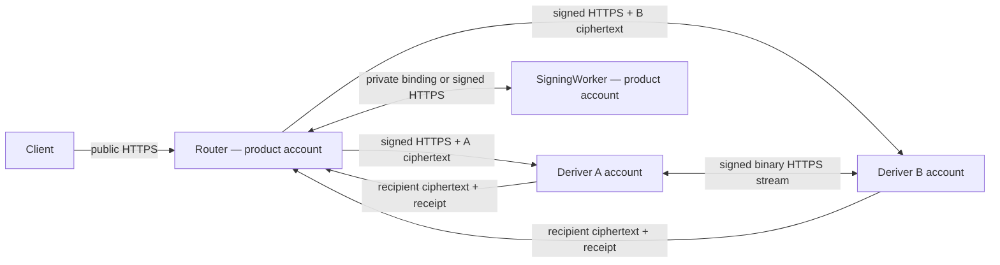

# Router A/B Deployment

Date consolidated: June 20, 2026

Last architecture decision: July 10, 2026

Status: canonical deployment reference for the approved strict Router A/B
topology. Production requires independently administered Cloudflare accounts
for Deriver A and Deriver B. Same-account Workers and Service Bindings are
development, staging, and benchmark profiles only.

Related active documents:

- [Router A/B specification](./router-a-b-SPEC.md)
- [Router A/B solution refactor](./router-a-b-sol-refactor.md)
- [Streaming Yao A/B plan](./yaos-ab.md)
- [Router A/B local development](./router-a-b-local-dev.md)
- [Deployment runbook](./deployment/README.md)
- [Deployment infrastructure](./deployment/infra.md)

## Approved Protocol Placement

- Ed25519 uses `router_ab_ed25519_yao_v1`. Deriver A is the fixed garbler;
  Deriver B is the fixed evaluator. The large binary stream travels directly
  between their accounts over signed HTTPS.
- ECDSA uses strict Router A/B threshold-PRF derivation and additive secp256k1
  scalar shares. It has no dependency on the Ed25519 Yao crate or stream.
- Router performs public admission and opaque routing. It never opens Deriver
  inputs, output shares, Yao frames, or ECDSA role material.
- SigningWorker owns activated server signing state and remains outside both
  derivation protocols after activation.
- Normal Ed25519 and ECDSA signing uses Client, Router, and SigningWorker. It
  makes zero Deriver calls.

## Deployment Profiles

| Profile | Account boundary | Transport | Intended use | Security claim |
| --- | --- | --- | --- | --- |
| `router_ab_cloudflare_same_account_dev_v1` | One account, distinct Workers and bindings | Service Bindings or local HTTP | Local development, staging, latency lower bound, and benchmarks | Contains a compromise confined to one Worker runtime while account administration remains honest; excludes account-admin and shared-CI compromise |
| `router_ab_cloudflare_separate_accounts_v1` | Product/control account plus independent A and B accounts | Signed cross-account HTTPS on every Deriver edge | The only production profile | Supports the Router-plus-one-malicious-Deriver claim when protocol and review gates pass |

No production manifest, capability response, request, or persisted record may
select the same-account profile. No runtime fallback crosses between profiles.

## Production Account Topology



The product/control account owns Router and SigningWorker. Deriver A and
Deriver B each use a different Cloudflare account, administrator, protected CI
environment, deployment credential, Durable Object namespace, backup boundary,
log sink, and audit export.

Production release requires:

```text
A.cloudflare_account_id != B.cloudflare_account_id
A.deploy_principal_id    != B.deploy_principal_id
A.storage_namespace      != B.storage_namespace
A.peer_signing_key       != B.peer_signing_key
A.envelope_hpke_key      != B.envelope_hpke_key
```

No human, CI principal, API token, OIDC trust, break-glass credential, or secret
store may deploy, read secrets for, or restore both A and B.

## Network And Authentication Edges

| Edge | Production transport | Required binding |
| --- | --- | --- |
| Client -> Router | Public HTTPS | application auth, lifecycle grant, request identity, expiry, replay nonce |
| Router -> A | Cross-account HTTPS | Router asymmetric signature, A endpoint identity, A HPKE ciphertext, body digest |
| Router -> B | Cross-account HTTPS | Router asymmetric signature, B endpoint identity, B HPKE ciphertext, body digest |
| A -> B / B -> A | Direct cross-account HTTPS | pinned peer key, role, protocol/circuit digest, transcript, sequence, frame digest, expiry |
| A/B -> recipients | Router-relayed or direct ciphertext | recipient identity, request kind, output kind, transcript, active-output binding |
| Router <-> SigningWorker | Product-account Service Binding or signed HTTPS | admitted request, SigningWorker identity, activation/session epoch |

The Router never proxies or buffers Yao table frames. Production A/B edges do
not use Service Bindings, `.internal` hostnames, shared bearer secrets, or a
credential accepted by both roles.

## Production CI And Deployment Authority

Production uses separate protected deployment paths for A and B. A workflow may
validate every public artifact, while an actor able to release A cannot release
B and vice versa.

Required environments:

```text
production-router
production-signing-worker
production-deriver-a  # controlled by A operator
production-deriver-b  # controlled by B operator
```

Rules:

- production has no `role=all` deployment action;
- A and B jobs use different Cloudflare account IDs and deploy credentials;
- A and B protected environments have disjoint approvers and OIDC subjects;
- neither job can read the opposite role's private keys, roots, storage,
  backups, logs, or account token;
- each operator independently verifies the same content-addressed public
  artifact, protocol digest, circuit digest, and deployment manifest;
- Router and SigningWorker may share the product account and deployment
  authority; neither receives a Deriver root or envelope private key;
- emergency rollback disables admission or deploys a previously reviewed
  artifact independently to each role. It never re-enables an old backend.

The existing single-workflow and same-account Wrangler assets are development
fixtures until they are replaced or renamed. They cannot be promoted by
changing an environment flag.

## Role Secret Matrix

| Owner | Private material | Forbidden material |
| --- | --- | --- |
| Router | admission-signing key, replay and lifecycle stores | A/B roots, A/B envelope private keys, A/B peer-signing keys, Yao state, ECDSA scalar shares |
| Deriver A | A root/provisioning state, A envelope private key, A peer-signing key, A ticket store | every B private value, SigningWorker private key, joined inputs or outputs |
| Deriver B | B root/provisioning state, B envelope private key, B peer-signing key, B ticket store | every A private value, SigningWorker private key, joined inputs or outputs |
| SigningWorker | server-output private key, activated signing state, nonce/presign state | A/B roots, A/B peer keys, client-output private key |

Public verifying and encryption keys may be distributed through a signed
deployment manifest. Private keys use role-local secret stores and rotation
epochs.

## Fail-Closed Startup Validation

Every Worker validates its precise deployment identity before serving traffic.

Router rejects startup when it has:

- a Deriver root/store binding;
- a Deriver envelope private key or peer-signing key;
- equal A and B account identities in a production manifest;
- a same-account production profile;
- an old HSS route or caller-selectable Ed25519 backend.

Deriver A and B reject startup when they have:

- an opposite-role root, private key, storage binding, or deploy identity;
- the same account, CI principal, or peer-signing key as the other production
  Deriver;
- a shared bearer credential for an A/B production edge;
- a circuit or protocol digest outside the signed allowlist;
- generator, clear-evaluator, passive-Yao, or old HSS code in the production
  bundle.

SigningWorker rejects startup when it has a Deriver root, Deriver envelope
private key, Yao ticket, or peer-signing key.

## Development And Benchmark Profile

The same-account profile remains useful for:

- local protocol development;
- deterministic integration tests;
- a Service Binding latency lower bound;
- Worker-runtime containment tests;
- same-colocation memory and throughput measurements.

Its capability response must identify
`router_ab_cloudflare_same_account_dev_v1`. Tests must reject that profile when
the target environment is production. Results from it cannot prove independent
operator security or production cross-account latency.

## Production Release Evidence

Before production enablement:

- [ ] An independent deployment reviewer verifies account, CI, approver,
      credential, storage, backup, log, and audit separation.
- [ ] Negative tests prove Router cannot access A or B stores, A cannot access B
      resources, and B cannot access A resources.
- [ ] Signed HTTPS tests cover wrong peer, wrong role, body tampering, replay,
      expiry, sequence gaps, duplicate frames, and stale deployment epochs.
- [ ] Final role bundles are scanned for opposite-role secrets and forbidden
      dependencies.
- [ ] Both operators reproduce and approve protocol, circuit, source, and bundle
      digests independently.
- [ ] Cross-account cold/warm p50, p95, p99, CPU, memory, payload, request count,
      retry, and abort measurements pass the Yao plan's gates.
- [ ] ECDSA strict bootstrap, activation, recovery, export, refresh, pool, and
      signing vectors pass with zero Yao dependency.
- [ ] Normal Ed25519 and ECDSA signing traces contain zero Deriver calls.
- [ ] Credential rotation, peer-key rotation, restore, one-role outage, and
      fail-closed rollback drills pass.

## Cutover

This repository is in development. Existing Ed25519 wallets and ceremony state
are invalidated and reprovisioned under one frozen Yao-era stable context. The
cutover deletes same-account production manifests, old HSS routes and backend
selectors, shared A/B credentials, generic threshold-service paths, and
legacy-only fixtures. Compatibility logic and dual production profiles are not
retained.

## Decision Log

| Date | Decision | Reason |
| --- | --- | --- |
| 2026-07-10 | Separate A/B Cloudflare accounts are mandatory in production | Same-account administration can replace both roles and defeats operational segregation |
| 2026-07-10 | Same-account Service Bindings are development and benchmark only | They measure a useful lower bound and Worker-runtime containment under honest account administration |
| 2026-07-10 | Product account owns Router and SigningWorker | Those roles may share an administrative domain without joining Deriver roots |
| 2026-07-10 | Production has no deploy-all authority across A and B | Independent deployers are part of the approved security claim |
| 2026-07-10 | Ed25519 uses active Streaming Yao; ECDSA uses threshold PRF plus additive shares | Each signature family keeps the construction suited to its key semantics |
