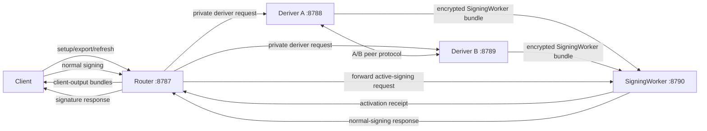

# Router A/B Local Development Deployment Parity Plan

Status: draft implementation plan.

This plan defines how local development should mimic the Cloudflare Router/A/B
deployment while keeping the existing fast in-process tests. The target local
shape is four independently started services:

- Router
- Deriver A
- Deriver B
- SigningWorker

The local harness should exercise the same role boundaries, route boundaries,
wire formats, transcript bindings, output-kind checks, and storage ownership
rules as production.

## Goals

- Run the Router/A/B setup and refresh path through four local processes.
- Run normal signing through `Client -> Router -> SigningWorker -> Router -> Client`.
- Keep Deriver A and Deriver B off the normal-signing hot path.
- Keep role-specific env, keys, storage, and diagnostics separated.
- Reuse the production Cloudflare adapter boundary types where possible.
- Preserve the existing `router-ab-dev` in-process harness for fast unit tests.

## Non-Goals

- Replacing Cloudflare Workers or Wrangler for deployment tests.
- Adding local-only protocol encodings.
- Adding compatibility branches for old Signer A/B naming.
- Making local secrets operationally secure against a hostile developer machine.

## Target Topology

Default ports:

| Role          | URL                     |
| ------------- | ----------------------- |
| Router        | `http://127.0.0.1:8787` |
| Deriver A     | `http://127.0.0.1:8788` |
| Deriver B     | `http://127.0.0.1:8789` |
| SigningWorker | `http://127.0.0.1:8790` |



## Existing State

- `router-ab-dev` has an in-process four-role service stack using
  `LocalServiceStackV1`, `LocalDeriverAEndpointV1`, `LocalDeriverBEndpointV1`,
  and `LocalSigningWorkerEndpointV1`.
- `router-ab-dev` has SQLite seeding helpers for local signing-root metadata and
  sealed root-share records.
- `router-ab-dev` has the dev-only Ed25519-HSS parity adapter.
- `router-ab-dev` has a persistent four-process HTTP runner:
  `router_ab_local_init`, `router_ab_local_up`, `router_ab_local_smoke`, and
  `router_ab_local_down`.
- `router-ab-cloudflare` has role-specific `workers-rs` entrypoint features and
  wrangler configs for Router, Deriver A, Deriver B, and SigningWorker.
- `router-ab-cloudflare` has typed runtime contexts and an in-memory Durable
  Object storage implementation used by tests.

Remaining local parity pieces:

- deployed Cloudflare startup/runtime evidence next to local timing evidence,
- replacement of the local dev normal-signing signature with the production
  role-separated Ed25519-HSS signer when that API exists.

## Architecture

Add one role-parametrized Rust binary under `crates/router-ab-dev`:

```text
crates/router-ab-dev/src/bin/router_ab_local_worker.rs
```

The binary should accept:

```text
router-ab-local-worker --role router --env .env.router-ab.router.local
router-ab-local-worker --role deriver-a --env .env.router-ab.deriver-a.local
router-ab-local-worker --role deriver-b --env .env.router-ab.deriver-b.local
router-ab-local-worker --role signing-worker --env .env.router-ab.signing-worker.local
```

Each process parses raw env once at startup into a precise role branch:

```rust
enum LocalWorkerRoleConfig {
    Router(LocalRouterWorkerConfig),
    DeriverA(LocalDeriverAWorkerConfig),
    DeriverB(LocalDeriverBWorkerConfig),
    SigningWorker(LocalSigningWorkerConfig),
}
```

Core handlers must accept only the narrowed role config. Invalid role/config
combinations should be unrepresentable after startup parsing.

## Routes

The local HTTP harness should use production route paths where the Cloudflare
adapter already defines them:

| Route                                                  | Owner         | Purpose                                     |
| ------------------------------------------------------ | ------------- | ------------------------------------------- |
| `/v1/hss/split-derivation`                             | Router        | public setup/export/refresh entry           |
| `/v1/hss/sign`                                         | Router        | public normal-signing entry                 |
| `/router-ab/v1/signer-a`                               | Deriver A     | private Router -> Deriver A request         |
| `/router-ab/v1/signer-b`                               | Deriver B     | private Router -> Deriver B request         |
| `/router-ab/v1/signer-a/peer`                          | Deriver A     | private Deriver B -> Deriver A peer request |
| `/router-ab/v1/signer-b/peer`                          | Deriver B     | private Deriver A -> Deriver B peer request |
| `/router-ab/v1/signing-worker/proof-bundle-activation` | SigningWorker | private activation request                  |
| `/router-ab/v1/signing-worker/sign`                    | SigningWorker | private normal-signing request              |

The current `LocalHttpPathV1` `/local/...` routes remain useful for
in-process unit tests. The four-process harness should converge on the
Cloudflare route constants so local smoke tests catch production path drift.

## Local Storage

Use role-owned local state directories:

```text
.router-ab-local/
  router/
    durable.sqlite
  deriver-a/
    durable.sqlite
    sealed-root-shares.sqlite
  deriver-b/
    durable.sqlite
    sealed-root-shares.sqlite
  signing-worker/
    durable.sqlite
```

Storage ownership:

- Router owns replay, lifecycle, admission, quota, and abuse state.
- Deriver A owns only Deriver A root-share metadata and A-local sealed shares.
- Deriver B owns only Deriver B root-share metadata and B-local sealed shares.
- SigningWorker owns activation records, active SigningWorker state, and
  SigningWorker-local opened `x_relayer_base` material.

Implementation sequence:

1. Use the existing `CloudflareDurableObjectMemoryStorageV1` for role-local
   smoke tests.
2. Add a file-backed `LocalDurableObjectSqliteStorageV1` with the same trait
   behavior.
3. Make file-backed SQLite the default for `local:up`.
4. Keep memory storage for unit tests and explicit `--ephemeral` runs.

## Env Files

Check in templates only:

```text
crates/router-ab-dev/env/router.local.example
crates/router-ab-dev/env/deriver-a.local.example
crates/router-ab-dev/env/deriver-b.local.example
crates/router-ab-dev/env/signing-worker.local.example
```

Generated local env files should stay untracked:

```text
.env.router-ab.router.local
.env.router-ab.deriver-a.local
.env.router-ab.deriver-b.local
.env.router-ab.signing-worker.local
```

Minimum bindings:

| Role          | Required bindings                                                                                                            |
| ------------- | ---------------------------------------------------------------------------------------------------------------------------- |
| Router        | Router public URL, Deriver A URL, Deriver B URL, SigningWorker URL, Router replay/lifecycle/admission storage                |
| Deriver A     | A envelope HPKE private key, A root-share wire secret, A peer signing key, A/B peer verifying keys, Deriver B URL, A storage |
| Deriver B     | B envelope HPKE private key, B root-share wire secret, B peer signing key, A/B peer verifying keys, Deriver A URL, B storage |
| SigningWorker | SigningWorker relayer-output HPKE private key, SigningWorker relayer-output storage, SigningWorker public identity           |

Forbidden local env checks should mirror production source guards:

- Router must reject deriver envelope private keys and root-share material.
- Deriver A must reject B root-share material and SigningWorker output storage.
- Deriver B must reject A root-share material and SigningWorker output storage.
- SigningWorker must reject deriver root-share material and deriver envelope
  private keys.

## Transport

Local service binding transport should be explicit HTTP:

```rust
trait LocalServiceBindingTransport {
    fn post_canonical_wire_bytes(
        &self,
        target: LocalPeerEndpoint,
        path: LocalPrivatePath,
        body: CanonicalWireBytesV1,
    ) -> Result<CanonicalWireBytesV1, LocalTransportError>;
}
```

The Router process uses this transport for Deriver A, Deriver B, and
SigningWorker calls. Deriver A and Deriver B use it for direct A/B peer
coordination. The transport must preserve the same canonical request bytes used
by Cloudflare service-binding requests.

## Smoke Flows

### Setup And Activation

1. Start all four processes.
2. Client posts one setup request to Router.
3. Router authenticates with local dev admission policy.
4. Router forwards encrypted role envelopes to Deriver A and Deriver B.
5. Deriver A and Deriver B coordinate directly.
6. Deriver A and Deriver B deliver encrypted SigningWorker proof bundles to
   SigningWorker.
7. SigningWorker opens only `x_relayer_base` material and records active state.
8. Router returns only client-output bundles to the client.
9. Smoke check asserts Router and deriver logs contain no recipient output
   material.

### Normal Signing

1. Client posts a normal-signing request to Router.
2. Router reserves replay and checks local admission policy.
3. Router resolves active SigningWorker state.
4. Router forwards the active-signing request to SigningWorker.
5. SigningWorker materializes active state plus local material.
6. SigningWorker runs the configured normal signer.
7. Router returns the response.
8. Smoke check asserts Deriver A and Deriver B receive zero requests.

The local HTTP smoke uses a deterministic dev SigningWorker signature over a
required payload so the four-process path can prove Router -> SigningWorker
success and Deriver A/B idleness. The Cloudflare strict worker remains gated on
the production role-separated Ed25519-HSS signer API.

## Commands

Add these commands after the binary exists:

```text
pnpm router-ab:local:init
pnpm router-ab:local:up
pnpm router-ab:local:smoke
pnpm router-ab:local:smoke:ci
pnpm router-ab:local:smoke:bundled
pnpm router-ab:local:down
pnpm router
pnpm router:multiplex
pnpm router:bundled
```

Expected behavior:

- `local:init` generates dev-only env files, keys, and SQLite seed data.
- `local:up` starts four processes and writes pids under `.router-ab-local/pids`.
- `local:smoke` runs setup/activation and normal-signing smoke tests through
  the Router public URL.
- `local:smoke:ci` starts four ephemeral workers, runs the same smoke checks,
  and tears the workers down.
- `local:smoke:bundled` starts one ephemeral bundled server, runs the same
  setup/activation and normal-signing checks through one listener, and tears it
  down.
- `local:down` stops only pids created by `local:up`.
- `router` starts Router, Deriver A, Deriver B, and SigningWorker in one
  terminal with interleaved color-labeled logs and stops all four workers on
  Ctrl-C.
- `router:multiplex` starts the same four workers in one 2x2 terminal
  dashboard and stops all four workers on Ctrl-C.
- `router:bundled` starts one process that exposes Router, Deriver A,
  Deriver B, and SigningWorker routes from a single HTTP listener. This is the
  local TEE-shaped profile for deployments that deliberately give up process
  segregation.

`pnpm server` still starts the main SDK relay server in `apps/web-server`. It
does not mean Router A/B bundled mode.

When default ports `8787-8790` are occupied, initialize with free localhost
ports:

```sh
pnpm router-ab:local:init -- --force --ephemeral-ports
pnpm router-ab:local:up
pnpm router-ab:local:smoke
pnpm router-ab:local:down
```

The generated env files record the selected URLs, so `local:up` and
`local:smoke` use the same four-worker topology without extra flags.

For fresh single-terminal runs with free ports:

```sh
pnpm router -- --fresh
pnpm router:multiplex -- --fresh
```

For the bundled single-server profile, first generate env files, then run:

```sh
pnpm router:bundled
```

Use `--url http://127.0.0.1:<port>` to override the Router env file's
`ROUTER_PUBLIC_URL`.

To smoke-test a running bundled server from another terminal:

```sh
pnpm router-ab:local:smoke -- --topology bundled
```

For a one-command bundled smoke with temp state and an ephemeral port:

```sh
pnpm router-ab:local:smoke:bundled
```

The implementation can also expose equivalent `just` recipes if the repo
standardizes Router/A/B developer commands there.

## Test Gates

Focused gates:

- unit tests for env parser role branches and forbidden-key checks,
- unit tests for route path ownership,
- unit tests for local Durable Object storage parity with memory storage,
- four-process setup/activation smoke,
- four-process normal-signing smoke proving Deriver A/B stay idle,
- bundled single-process setup/activation and normal-signing smoke,
- source guard proving the local HTTP harness uses Cloudflare route constants,
- source guard proving local logs accept only redacted diagnostics.

Release gates before Cloudflare deployment:

- `cargo test --manifest-path crates/router-ab-core/Cargo.toml`
- `cargo test --manifest-path crates/router-ab-dev/Cargo.toml`
- `cargo test --manifest-path crates/router-ab-cloudflare/Cargo.toml`
- `cargo check --manifest-path crates/router-ab-cloudflare/Cargo.toml --features strict-worker-router-entrypoint`
- `cargo check --manifest-path crates/router-ab-cloudflare/Cargo.toml --features strict-worker-signer-a-entrypoint`
- `cargo check --manifest-path crates/router-ab-cloudflare/Cargo.toml --features strict-worker-signer-b-entrypoint`
- `cargo check --manifest-path crates/router-ab-cloudflare/Cargo.toml --features strict-worker-signing-worker-entrypoint`
- local four-process smoke
- Wrangler dry-run for all four role configs

## Phased Todo List

### Phase 0: Document And Pin Local Shape

- [x] Write this local deployment parity plan.
- [x] Link this plan from `docs/router-A-B-signer.md`.
- [x] Add a short `crates/router-ab-dev/README.md` that points here.

### Phase 1: Role Config And Env Templates

- [x] Add role-specific local env example files.
- [x] Add a typed local env parser with one branch per role.
- [x] Add forbidden-key checks that mirror Cloudflare role separation.
- [x] Add local key-generation and env materialization command.

### Phase 2: Four-Process HTTP Harness

- [x] Add `router_ab_local_worker` binary under `crates/router-ab-dev`.
- [x] Start one HTTP server per role.
- [x] Implement production route constants for local HTTP endpoints.
- [x] Implement local HTTP service-binding client.
- [x] Add health endpoints with role, epoch, and redacted startup status.

### Phase 3: Local Storage Parity

- [x] Add file-backed local Durable Object storage.
- [x] Seed Router admission/replay/lifecycle state.
- [x] Seed Deriver A and Deriver B root-share metadata and sealed shares.
- [x] Persist SigningWorker activation records and active state.
- [x] Add restart smoke proving state survives process restart.

### Phase 4: Setup And Activation Smoke

- [x] Add typed local HTTP ceremony route-contract smoke.
- [x] Add Worker-shaped JSON service-binding helper for private route wiring.
- [x] Drive one setup request through Router public HTTP.
- [x] Assert Deriver A and Deriver B coordinate over direct HTTP.
- [x] Assert SigningWorker receives only encrypted `x_relayer_base` proof bundles.
- [x] Assert Router returns only client-output bundles.
- [x] Assert redacted diagnostics only.

### Phase 5: Normal-Signing Smoke

- [x] Drive one normal-signing request through Router public HTTP.
- [x] Assert Router forwards only to SigningWorker.
- [x] Assert Deriver A and Deriver B receive zero normal-signing requests.
- [x] Replace HTTP fail-closed smoke with a successful local dev SigningWorker
      signature smoke.
- [ ] Replace the local dev signature with the production role-separated
      Ed25519-HSS signer after that API exists.

### Phase 6: Developer Commands

- [x] Add `pnpm router-ab:local:init`.
- [x] Add `pnpm router-ab:local:up`.
- [x] Add `pnpm router-ab:local:smoke`.
- [x] Add `pnpm router-ab:local:down`.
- [x] Add `pnpm router` interleaved logs with Ctrl-C cleanup.
- [x] Add `pnpm router:multiplex` 2x2 dashboard with Ctrl-C cleanup.
- [x] Add `pnpm router:bundled` single-server mode for local TEE-shaped
      deployment checks.
- [x] Add CI-safe smoke mode that uses ephemeral ports and temp directories.
- [x] Add bundled topology to the smoke runner and CI-safe bundled smoke
      command.
- [x] Add persistent local init mode that materializes free ports when defaults
      are occupied.

### Phase 7: Cloudflare Parity Checks

- [x] Add source guard requiring local harness to use Cloudflare route constants.
- [x] Add parity tests comparing local HTTP request bytes to Cloudflare adapter
      request bytes.
- [x] Add a local-vs-wrangler startup manifest check for role names, bindings,
      and required secrets.
- [x] Add local smoke timing capture that writes timestamped JSON evidence.
- [x] Add staging/production Wrangler environment configs for all four Workers.
- [x] Add Router A/B GitHub Actions validation with tests, strict Worker
      checks, local smoke, and Wrangler startup dry-run.
- [x] Add manual Router A/B upload/deploy workflow for Cloudflare startup
      evidence and target deployment.
- [ ] Record local smoke timings next to deployed Cloudflare startup and
      hot-path benchmarks.

`router-ab:local:smoke` and `router-ab:local:smoke:ci` emit local per-phase
elapsed times in milliseconds. `router-ab:local:measure` writes the same data
to `crates/router-ab-dev/reports/local-smoke-timings/`. Keep the deployed
benchmark checkbox open until Cloudflare startup and hot-path measurements are
recorded next to those local numbers.
