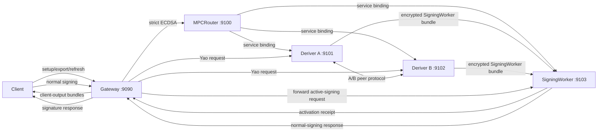

# Router A/B Local Development Deployment Parity Plan

Status: Phase 9C local Ed25519 Yao lifecycle implemented and passing. SDK
public-route cutover remains open. Cloudflare deployment and timing evidence
remain deferred until the local cutover closes.

This plan defines how local development should mimic the Cloudflare Router/A/B
deployment while keeping the existing fast in-process tests. The target local
shape is one public Gateway plus four independently started private workers:

- Gateway
- MPCRouter
- Deriver A
- Deriver B
- SigningWorker

The local harness should exercise the same role boundaries, route boundaries,
wire formats, transcript bindings, output-kind checks, and storage ownership
rules as production.

## Goals

- Run Ed25519 registration, recovery, refresh, export, and activation through
  separate local Deriver A, Deriver B, and SigningWorker processes.
- Run normal signing through `Client -> Router -> SigningWorker -> Router -> Client`.
- Keep Deriver A and Deriver B off the normal-signing hot path.
- Keep role-specific env, keys, storage, and diagnostics separated.
- Reuse the production Cloudflare adapter boundary types where possible.
- Preserve the existing `router-ab-dev` in-process harness for fast unit tests.

## Non-Goals

- Replacing Cloudflare Workers or Wrangler for deployment tests.
- Adding local-only protocol encodings.
- Adding compatibility branches for old Signer A/B naming.
- Making local secrets operationally secure against a hostile developer machine.

## Target Topology

Default ports:

| Service                  | URL                     |
| ------------------------ | ----------------------- |
| Gateway                  | `http://127.0.0.1:9090` |
| MPCRouter                | `http://127.0.0.1:9100` |
| Deriver A Worker         | `http://127.0.0.1:9101` |
| Deriver B Worker         | `http://127.0.0.1:9102` |
| SigningWorker            | `http://127.0.0.1:9103` |



## Existing State

- `router-ab-dev` has an in-process four-role service stack using
  `LocalServiceStackV1`, `LocalDeriverAEndpointV1`, `LocalDeriverBEndpointV1`,
  and `LocalSigningWorkerEndpointV1`.
- `router-ab-dev` has SQLite seeding helpers for local signing-root metadata and
  sealed root-share records.
- `router-ab-dev` has the fixed-profile Ed25519 Yao lifecycle adapter, typed
  Router admission, authenticated duplex A/B stream, encrypted recipient
  delivery, SigningWorker activation, recovery, refresh, export, and ordinary
  signing.
- `router-ab-dev` has persistent private-worker helpers:
  `router_ab_local_init`, `router_ab_local_up`, `router_ab_local_smoke`, and
  `router_ab_local_down`.
- `router-ab-cloudflare` has role-specific `workers-rs` entrypoint features and
  wrangler configs for Router, Deriver A, Deriver B, and SigningWorker.
- `router-ab-cloudflare` has typed runtime contexts and an in-memory Durable
  Object storage implementation used by tests.
- The SDK Router exposes the two-step Yao registration boundary, and the
  browser WASM Client retains its scalar inside an opaque disposable object.
  A real-process SDK test completes registration and ordinary FROST signing.

Remaining local work:

- finish deleting the superseded SDK and server Ed25519-HSS lifecycle surfaces;
- update intended-behaviour tests around the canonical Yao lifecycle.

Cloudflare startup and runtime evidence begins only after those local items
close.

## Architecture

Gateway owns public Router A/B routes. Add one role-parametrized
Rust binary under `crates/router-ab-dev` for private worker roles:

```text
crates/router-ab-dev/src/bin/router_ab_local_worker.rs
```

The binary should accept:

```text
router-ab-local-worker --role deriver-a --env .env.router-ab.deriver-a.local
router-ab-local-worker --role deriver-b --env .env.router-ab.deriver-b.local
router-ab-local-worker --role signing-worker --env .env.router-ab.signing-worker.local
```

Each process parses raw env once at startup into a precise role branch:

```rust
enum LocalWorkerRoleConfig {
    DeriverA(LocalDeriverAWorkerConfig),
    DeriverB(LocalDeriverBWorkerConfig),
    SigningWorker(LocalSigningWorkerConfig),
}
```

Core handlers must accept only the narrowed role config. Invalid role/config
combinations should be unrepresentable after startup parsing.

## Routes

The local HTTP harness uses the canonical protocol-specific route families:

| Route                                                                           | Owner         | Purpose                                |
| ------------------------------------------------------------------------------- | ------------- | -------------------------------------- |
| `/router-ab/ed25519/yao/registration/{admit,execute}`                           | Router        | public Ed25519 registration lifecycle  |
| `/router-ab/ed25519/yao/recovery/{admit,execute,activate}`                      | Router        | public Ed25519 recovery lifecycle      |
| `/router-ab/ed25519/sign/{prepare}` and `/router-ab/ed25519/sign`               | Router        | public normal-signing lifecycle        |
| `/router-ab/deriver-a/ed25519-yao/*`                                            | Deriver A     | private Ed25519 Yao role-A work        |
| `/router-ab/deriver-b/ed25519-yao/*`                                            | Deriver B     | private Ed25519 Yao role-B work        |
| `/router-ab/ecdsa-derivation/*`                                                 | Router        | public strict ECDSA lifecycle          |
| `/router-ab/signing-worker/ed25519-yao/*`                                       | SigningWorker | private Ed25519 activation and refresh |
| `/router-ab/signing-worker/sign/{prepare}` and `/router-ab/signing-worker/sign` | SigningWorker | private normal-signing lifecycle       |

The current `LocalHttpPathV1` `/local/...` routes remain useful for in-process
unit tests. Local smoke tests bind exact public and role-private contracts so
route drift fails at the boundary.

## Local Storage

Use role-owned local state directories:

```text
.router-ab-local/
  router/
    durable.sqlite
  deriver-a/
    durable.sqlite
    sealed-root-shares.sqlite
  deriver-b/
    durable.sqlite
    sealed-root-shares.sqlite
  signing-worker/
    durable.sqlite
```

Storage ownership:

- Router owns replay, lifecycle, admission, quota, and abuse state.
- Deriver A owns only Deriver A root-share metadata and A-local sealed shares.
- Deriver B owns only Deriver B root-share metadata and B-local sealed shares.
- SigningWorker owns activation records, active SigningWorker state, and
  SigningWorker-local opened `x_relayer_base` material.

Implementation sequence:

1. Use the existing `CloudflareDurableObjectMemoryStorageV1` for role-local
   smoke tests.
2. Add a file-backed `LocalDurableObjectSqliteStorageV1` with the same trait
   behavior.
3. Make file-backed SQLite the default for `local:up`.
4. Keep memory storage for unit tests and explicit `--ephemeral` runs.

## Env Files

Check in templates only:

```text
crates/router-ab-dev/env/router.local.example
crates/router-ab-dev/env/deriver-a.local.example
crates/router-ab-dev/env/deriver-b.local.example
crates/router-ab-dev/env/signing-worker.local.example
```

Generated local env files should stay untracked:

```text
.env.router-ab.router.local
.env.router-ab.deriver-a.local
.env.router-ab.deriver-b.local
.env.router-ab.signing-worker.local
```

Minimum bindings:

| Role          | Required bindings                                                                                                            |
| ------------- | ---------------------------------------------------------------------------------------------------------------------------- |
| Router        | Router public URL, Deriver A URL, Deriver B URL, SigningWorker URL, Router replay/lifecycle/admission storage                |
| Deriver A     | A envelope HPKE private key, A root-share wire secret, A peer signing key, A/B peer verifying keys, Deriver B URL, A storage |
| Deriver B     | B envelope HPKE private key, B root-share wire secret, B peer signing key, A/B peer verifying keys, Deriver A URL, B storage |
| SigningWorker | SigningWorker server-output HPKE private key, SigningWorker server-output storage, SigningWorker public identity             |

Forbidden local env checks should mirror production source guards:

- Router must reject deriver envelope private keys and root-share material.
- Deriver A must reject B root-share material and SigningWorker output storage.
- Deriver B must reject A root-share material and SigningWorker output storage.
- SigningWorker must reject deriver root-share material and deriver envelope
  private keys.

## Transport

Local service binding transport should be explicit HTTP:

```rust
trait LocalServiceBindingTransport {
    fn post_canonical_wire_bytes(
        &self,
        target: LocalPeerEndpoint,
        path: LocalPrivatePath,
        body: CanonicalWireBytesV1,
    ) -> Result<CanonicalWireBytesV1, LocalTransportError>;
}
```

Gateway uses this transport for Deriver A, Deriver B, and
SigningWorker calls. Deriver A and Deriver B use it for direct A/B peer
coordination. The transport must preserve the same canonical request bytes used
by Cloudflare service-binding requests.

## Smoke Flows

### Setup And Activation

1. Start all four processes.
2. Client posts one setup request to Router.
3. Router authenticates with local dev admission policy.
4. Router forwards encrypted role envelopes to Deriver A and Deriver B.
5. Deriver A and Deriver B coordinate directly.
6. Deriver A and Deriver B deliver encrypted SigningWorker proof bundles to
   SigningWorker.
7. SigningWorker opens only `x_relayer_base` material and records active state.
8. Router returns only client-output bundles to the client.
9. Smoke check asserts Router and deriver logs contain no recipient output
   material.

### Normal Signing

1. Client posts a normal-signing request to Router.
2. Router reserves replay and checks local admission policy.
3. Router resolves active SigningWorker state.
4. Router forwards the active-signing request to SigningWorker.
5. SigningWorker materializes active state plus local material.
6. SigningWorker runs the configured normal signer.
7. Router returns the response.
8. Smoke check asserts Deriver A and Deriver B receive zero requests.

The canonical Yao smoke activates disjoint Client and SigningWorker shares,
terminates both Deriver processes, then produces and verifies a standard
Ed25519 signature. This directly checks that ordinary signing performs zero
Deriver or Yao work.

## Commands

Canonical Ed25519 Yao local commands:

```text
pnpm router:yao-smoke
pnpm router:yao-smoke:one-account
pnpm router:yao-smoke:two-administrator
pnpm validate:yaos-ab-local
pnpm router:yao-measure-local
```

- `router:yao-smoke` runs the complete lifecycle in both fixed local profiles
  and cleans up every spawned process.
- The profile-specific commands run the identical protocol with either one
  shared development state root or separate A/B/SigningWorker roots and
  working directories.
- `validate:yaos-ab-local` runs the canonical KDF, adapter, process lifecycle,
  fault matrix, source boundaries, and optimized host/Worker-WASM
  constant-time code-generation checks.
- `router:yao-measure-local` collects release-mode local p50/p95/p99 latency
  and exact directional A/B bytes. Its report is local nonproduction evidence.

The broader SDK Router development harness also exposes:

```text
pnpm router:init
pnpm router:up
pnpm router:check
pnpm router:public-route-smoke
pnpm router:evidence
pnpm router:down
pnpm router
pnpm router:multiplex
```

Expected behavior:

- `router:init` generates dev-only env files, keys, and SQLite seed data.
- `router:up` starts detached private worker processes and writes pids under
  `.router-ab-local/pids`.
- `router:check` runs setup/activation and normal-signing prepare/finalize
  smoke tests through the already running SDK Router public URL.
- `router:public-route-smoke` verifies local Caddy forwards
  `https://localhost:9444` to one Router upstream and POST-probes the Ed25519
  normal-signing prepare and Wallet Session issuance routes through that public
  HTTPS origin.
- `router:evidence` runs the local release-evidence protocol harness for
  Router A/B ECDSA derivation normal-signing binding and Ed25519 presign-pool refill, pool-hit,
  and pool-miss timing.
- `router:down` stops only pids created by `router:up`.
- `router` starts Gateway, MPCRouter, Deriver A, Deriver B, and SigningWorker
  in one terminal with interleaved color-labeled logs and stops managed
  processes on Ctrl-C.
- `router:multiplex` starts the same services in one terminal dashboard and
  stops managed processes on Ctrl-C.

Frontend account-creation testing uses the regular local app stack:

```sh
pnpm build:sdk
pnpm site
pnpm router
```

Run those commands in separate terminals. Use `pnpm router:multiplex` for the
dashboard. `pnpm site` owns
`https://localhost`; `pnpm router` and `pnpm router:multiplex` start Gateway at
`127.0.0.1:9090` when it is not already running. They verify
`https://localhost:9444/.well-known/webauthn` and start the local Caddy proxy
when that HTTPS endpoint is absent. The production-equivalent Cloudflare
Workers run on `127.0.0.1:9100-9103` and retain state in
`.runtime/router-ab-strict-state/<worker-role>`, with one persistence directory
per production Worker.

The build and launch phases are separate. `pnpm build:sdk` builds the SDK and
the four strict Rust/WASM Workers. `pnpm router` validates the Worker artifacts
and their commitment-policy receipt, then starts the topology without invoking
`worker-build`. `pnpm router:build` rebuilds only the strict Workers.

Before launch, `pnpm router` stops existing Wrangler process groups whose
generated config and persistence paths identify them as this repository's local
Router A/B topology. This handles interrupted launchers and repeated startup
commands without killing unrelated processes that happen to use another
topology. A remaining listener on `9100-9103` is reported as a port conflict.

`pnpm gateway:server` is the lower-level Gateway command used by the local
topology launcher. Browser registration testing should use `pnpm router`.

If a browser request through `https://localhost:9444` returns an Express-style
`Cannot POST /router-ab/...`, the main Router route table is missing that
route. Do not fix this with Caddy path selection; Caddy must forward the whole
origin to Gateway.

For fresh single-terminal runs:

```sh
pnpm router -- --fresh
pnpm router:multiplex -- --fresh
```

The implementation can also expose equivalent `just` recipes if the repo
standardizes Router/A/B developer commands there.

## Local Browser Evidence

2026-06-14 local development evidence:

- [x] `pnpm build:sdk && pnpm router` starts Gateway, verifies
      `https://localhost:9444/.well-known/webauthn`, and starts MPCRouter,
      Deriver A, Deriver B, and SigningWorker after the browser-facing Router
      path is stable.
- [x] Passkey wallet unlock succeeds against the local stack.
- [x] Passkey account registration succeeds against the local stack.
- [x] Ed25519 transaction signing succeeds against the local stack.
- [x] ECDSA transaction signing succeeds against the local stack.
- [x] Ctrl-C stops the started local workers and Gateway.

This is local development evidence. It does not replace deployed Cloudflare
runtime evidence or the post-cutover Yao release gates.

## Test Gates

Focused gates:

- unit tests for env parser role branches and forbidden-key checks,
- unit tests for route path ownership,
- unit tests for local Durable Object storage parity with memory storage,
- local setup/activation smoke through Gateway and private workers,
- local normal-signing smoke proving Deriver A/B stay idle,
- source guard proving the local HTTP harness uses Cloudflare route constants,
- source guard proving local logs accept only redacted diagnostics.

Release gates before Cloudflare deployment:

- `pnpm validate:yaos-ab-local`
- `cargo test --manifest-path crates/router-ab-core/Cargo.toml`
- `cargo test --manifest-path crates/router-ab-dev/Cargo.toml`
- `cargo test --manifest-path crates/router-ab-cloudflare/Cargo.toml`
- `cargo check --manifest-path crates/router-ab-cloudflare/Cargo.toml --features strict-worker-router-entrypoint`
- `cargo check --manifest-path crates/router-ab-cloudflare/Cargo.toml --features strict-worker-deriver-a-entrypoint`
- `cargo check --manifest-path crates/router-ab-cloudflare/Cargo.toml --features strict-worker-deriver-b-entrypoint`
- `cargo check --manifest-path crates/router-ab-cloudflare/Cargo.toml --features strict-worker-signing-worker-entrypoint`
- local Router/API plus private-worker smoke
- Wrangler dry-run for all four role configs

## Phased Todo List

### Phase 0: Document And Pin Local Shape

- [x] Write this local deployment parity plan.
- [x] Link this plan from `docs/router-a-b-SPEC.md`.
- [x] Add a short `crates/router-ab-dev/README.md` that points here.

### Phase 1: Role Config And Env Templates

- [x] Add role-specific local env example files.
- [x] Add a typed local env parser with one branch per role.
- [x] Add forbidden-key checks that mirror Cloudflare role separation.
- [x] Add local key-generation and env materialization command.

### Phase 2: Four-Process HTTP Harness

- [x] Add `router_ab_local_worker` binary under `crates/router-ab-dev`.
- [x] Start one HTTP server per role.
- [x] Implement production route constants for local HTTP endpoints.
- [x] Implement local HTTP service-binding client.
- [x] Add health endpoints with role, epoch, and redacted startup status.

### Phase 3: Local Storage Parity

- [x] Add file-backed local Durable Object storage.
- [x] Seed Router admission/replay/lifecycle state.
- [x] Seed Deriver A and Deriver B root-share metadata and sealed shares.
- [x] Persist SigningWorker activation records and active state.
- [x] Add restart smoke proving state survives process restart.

### Phase 4: Setup And Activation Smoke

- [x] Add typed local HTTP ceremony route-contract smoke.
- [x] Add Worker-shaped JSON service-binding helper for private route wiring.
- [x] Drive one setup request through Router public HTTP.
- [x] Assert Deriver A and Deriver B coordinate over direct HTTP.
- [x] Assert SigningWorker receives only encrypted `x_relayer_base` proof bundles.
- [x] Assert Router returns only client-output bundles.
- [x] Assert redacted diagnostics only.

### Phase 5: Normal-Signing Smoke

- [x] Drive one normal-signing request through Router public HTTP.
- [x] Assert Router forwards only to SigningWorker.
- [x] Assert Deriver A and Deriver B receive zero normal-signing requests.
- [x] Replace HTTP fail-closed smoke with a successful local dev SigningWorker
      signature smoke.
- [x] Replace the local dev signature with standard two-party FROST over the
      Client and SigningWorker shares activated by Yao.

### Phase 6: Developer Commands

- [x] Add `pnpm router:init`.
- [x] Add `pnpm router:up`.
- [x] Add `pnpm router:check`.
- [x] Add `pnpm router:down`.
- [x] Add `pnpm router` interleaved logs with Ctrl-C cleanup.
- [x] Add `pnpm router:multiplex` dashboard with Ctrl-C cleanup.
- [x] Delete the obsolete single-process local profile after the SDK Router
      route table became the only public Router runtime.
- [x] Delete ephemeral local smoke commands that preserved the old public Rust
      Router role.
- [x] Add persistent local init mode that materializes free ports when defaults
      are occupied.
- [x] Make `pnpm router` and `pnpm router:multiplex` auto-start the
      Gateway at `127.0.0.1:9090` when it is not already running.
- [x] Make `pnpm router` and `pnpm router:multiplex` verify the
      `https://localhost:9444/.well-known/webauthn` proxy path before workers
      are marked ready.

### Phase 7: Cloudflare Parity Checks

- [x] Add source guard requiring local harness to use Cloudflare route constants.
- [x] Add parity tests comparing local HTTP request bytes to Cloudflare adapter
      request bytes.
- [x] Add a local-vs-wrangler startup manifest check for role names, bindings,
      and required secrets.
- [x] Add local smoke timing capture that writes timestamped JSON evidence.
- [x] Add staging/production Wrangler environment configs for all four Workers.
- [x] Add Router A/B GitHub Actions validation with tests, strict Worker
      checks, local smoke, and Wrangler startup dry-run.
- [x] Add manual Router A/B upload/deploy workflow for Cloudflare startup
      evidence and target deployment.
- [x] Re-run local Wrangler startup dry-run after the local browser-flow fixes.
      Evidence: timestamped ignored JSON under
      `crates/router-ab-cloudflare/reports/startup-latencies/`.
      Dry-run gzip upload sizes: Router `573.83 KiB`, Deriver A `598.97 KiB`,
      Deriver B `599.92 KiB`, SigningWorker `567.14 KiB`.
- [x] Capture current local smoke timing evidence.
      2026-06-14 local run: setup `18 ms`, SigningWorker activation `1 ms`,
      normal signing `0 ms`, total `36 ms`; Deriver A/B normal-signing request
      counts stayed `0`.
- [x] Move local normal-signing smoke to the public prepare/finalize routes
      backed by the active Yao-derived Client and SigningWorker shares.
- [x] Record deployed Cloudflare startup and hot-path benchmarks next to the
      local timing evidence. Moved to a future deployment evidence plan.

`router:check` emits local per-phase elapsed times in milliseconds.
`router:measure` writes the same data to
`crates/router-ab-dev/reports/local-smoke-timings/`. `router:evidence` writes
local protocol timing evidence for the Router A/B ECDSA derivation and Ed25519 Yao
release gates. Keep the deployed benchmark checkbox open until Cloudflare
startup and hot-path measurements are recorded next to those local numbers.

### Phase 8: Canonical Local Ed25519 Yao Usability

- [x] Add fixed one-account and two-administrator local profiles with identical
      protocol and circuit artifacts.
- [x] Complete registration, activation, ordinary signing, recovery, refresh,
      and exact seed export through separate Deriver A/B and SigningWorker
      processes.
- [x] Authenticate the duplex A/B stream, enforce one-use sessions, encrypt
      recipient packages, and cover replay, stale epoch, wrong role/family,
      wrong recipient, malformed framing, disconnect, and promotion failures.
- [x] Add `pnpm router:yao-smoke` and `pnpm validate:yaos-ab-local`.
- [x] Record optimized local p50/p95/p99 latency plus exact directional bytes.
- [x] Remove the obsolete local HSS parity suite and detach the generic local
      Router/A/B transport smoke from HSS fixtures.
- [x] Connect Gateway and the browser client to the Phase 9C Yao
      contracts.
- [ ] Delete the remaining SDK-bound Ed25519-HSS dependency, state, handlers,
      and fixtures after the cutover passes.
- [ ] Run intended-behaviour tests through the SDK public route, then close
      local usability before starting Cloudflare deployment work.
