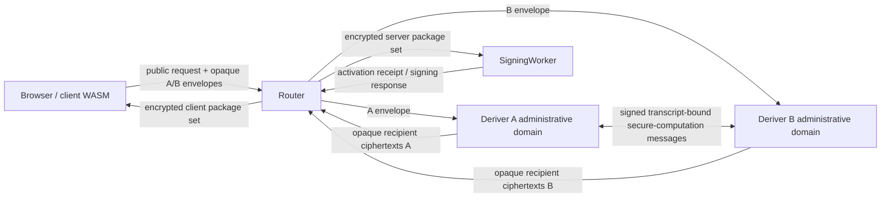

# Router A/B Ed25519 Yao And ECDSA Strict Refactor Plan

Date created: July 10, 2026

Status: active implementation plan. Phase 0 closed on July 10, 2026. The
deprecated Ed25519-HSS crate and its Rust dependencies are deleted. The complete
P0 Yao lifecycle passes locally, including SDK Router registration and ordinary
signing. Phase 9C SDK/server cleanup remains active. Production release stays
blocked on deployed evidence, profile selection, strict Router A/B cutover,
independent administration, and the profile-specific security gates.

Companion documents:

- [Router A/B specification](./router-a-b-SPEC.md)
- [Router A/B deployment reference](./router-a-b-deployment.md)
- [Router A/B local development](./router-a-b-local-dev.md)
- [Router A/B cleanup history](./router-a-b-cleanup.md)
- [Streaming Yao for Deriver A and Deriver B](./yaos-ab.md)

`yaos-ab.md` owns current latency and protocol evidence. This plan owns strict
Router A/B integration, product migration, operational segregation, and
deletion of obsolete implementations.

The critical risk register, bounded construction shortlist, kill criteria, and
Ed25519 platform fallback ladder in `yaos-ab.md` are authoritative here. Phase
3A converts that evidence into the product-level construction and platform
decision. Downstream phases cannot bypass it.

## Goal

Make strict Router A/B the only SDK/server architecture for every Ed25519 and
ECDSA lifecycle:

- registration and bootstrap;
- SigningWorker activation;
- normal signing;
- presignature or nonce-pool fill;
- recovery and material restore;
- explicit key export;
- server-share or role-share refresh;
- add-signer and related wallet lifecycle operations.

The Ed25519 flow must preserve the standard export-compatible derivation:

```text
d = LE32(y_client + y_server mod 2^256)
h = SHA-512(d)
a = LE256(clamp(h[0..32])) mod l
```

The output projection must remain:

```text
tau = tau_client + tau_server mod l
x_client_base = a + tau mod l
x_server_base = a + 2 * tau mod l
a = 2 * x_client_base - x_server_base mod l
```

The refactor must also delete `ThresholdSigningService`. ECDSA-HSS does not get
an extracted replacement service or compatibility fallback. Existing strict
ECDSA Router A/B components are the target owners for every remaining ECDSA
responsibility.

## Executive Decisions

1. **Strict Router A/B is the only production topology.** Router performs
   admission, replay protection, policy, lifecycle tracking, and opaque routing.
   Deriver A and Deriver B perform role-local derivation. SigningWorker owns
   activated signing state and signing-time preprocessing.
2. **Ed25519 uses one exact protocol, `router_ab_ed25519_yao_v1`.** It computes the
   canonical seed, SHA-512 expansion, clamped scalar, and signing-share
   projection through Streaming Yao between fixed Deriver A garbler and Deriver
   B evaluator roles. Phase 3A selects exactly one reviewed P0-P3 security
   profile. Runtime security-profile selection, downgrade, and backend
   negotiation are absent.
3. **`mpc_threshold_prf_v1` is ECDSA-only.** Its independently
   derived client and server scalar outputs have no canonical seed and cannot
   provide standard Ed25519 key export. ECDSA retains strict Router A/B
   threshold-PRF derivation and additive secp256k1 scalar shares.
4. **The `ed25519-hss` backend is deleted.** Formula-derived artifact sizes,
   deterministic padding, revealing commitments, joined-share objects, and
   same-process reconstruction are absent from current Rust code. No further
   succinct-HSS kernel, amplification, or optimization work proceeds.
5. **ECDSA also completes the strict cutover.** The existing strict
   `router-ab-core::protocol::ecdsa_hss` and SigningWorker architecture absorb
   all remaining generic service, authorization, pool, recovery, export, and
   refresh responsibilities.
6. **Production uses independent operators.** ECDSA requires
   `router_ab_cloudflare_separate_accounts_v1`. Ed25519 prefers that Worker
   profile and may use the Phase 3A-approved separate-account Containers or
   independent native-service fallback. Same-account bindings are limited to
   local development, staging, and performance evaluation.
7. **The production security claim follows the selected P0-P3 profile.** P0 may
   ship with an explicit honest-execution/passive-corruption claim. P1 ships
   only with the narrower claim proved for its coherent reviewed composition.
   P2 and P3 target privacy and correctness-with-abort against Router plus at
   most one malicious Deriver. Partial hardening never implies a broader claim.
8. **The cutover is destructive.** Old ceremony records, session shapes, route
   bodies, feature branches, tests, fixtures, and fallback code are deleted.
   Every existing development Ed25519 wallet is reprovisioned under the frozen
   Yao-era stable context. No compatibility or conversion path is retained.
9. **Ed25519 Yao has one isolated cryptographic implementation.** The exact
   oracle and generator live in `tools/ed25519-yao-generator`; the protocol and
   composition live in `crates/ed25519-yao` and
   `crates/router-ab-ed25519-yao`. Router, Client WASM, and SigningWorker reuse
   those owners without adding a second arithmetic implementation.

## Non-Goals

- A generic garbling or MPC framework.
- A runtime-pluggable production backend registry.
- Compatibility with unfinished legacy ceremonies or old sealed session
  records.
- A fallback from strict Router A/B to TypeScript threshold routes.
- A quorum larger than two Derivers in this refactor.
- Fairness or guaranteed availability when either Deriver aborts.
- Protection after Deriver A and Deriver B collude.
- A rewrite of normal signing algorithms whose strict Router A/B implementation
  already satisfies the target ownership model.

## Non-Negotiable Invariants

### Canonical Ed25519 Identity

- `d` is exactly 32 little-endian bytes obtained from addition modulo
  `2^256`.
- SHA-512 consumes exactly the standard Ed25519 seed bytes.
- Clamping follows the standard Ed25519 pruning rules.
- Export releases the exact seed `d`, never a scalar-native substitute.
- Importing the exported seed reproduces the registered Ed25519 public key.
- Refresh preserves `d`, `a`, the public key, and address unless the operation
  is explicitly classified as wallet-key rotation.

### Role Separation

- Router never opens Deriver input envelopes or output-share packages.
- Deriver A cannot represent or reconstruct Deriver B's private input.
- Deriver B cannot represent or reconstruct Deriver A's private input.
- No production type contains both sides of `y`, `tau`, `d`, `a`,
  `x_client_base`, or `x_server_base`.
- SigningWorker receives only shares addressed to its current identity and
  activation epoch.
- Client receives only client-addressed output shares or explicitly authorized
  export shares.
- TypeScript receives opaque ciphertext, handles, public metadata, and receipts;
  it does not receive raw signing or derivation material.

### ECDSA Threshold-PRF And Additive-Share Ownership

- Every ECDSA bootstrap, signing, pool-fill, export, recovery, and refresh call
  enters through a strict Router A/B public route.
- Deriver A and Deriver B evaluate the strict ECDSA threshold PRF under stable,
  role-local root material and derive additive secp256k1 scalar shares.
- The client and SigningWorker scalar shares satisfy
  `x = x_client + x_server mod n`; public-point parity is verified before
  activation and export.
- Deriver A and Deriver B own only role-local ECDSA derivation material.
- SigningWorker owns active ECDSA server signing shares and server
  presignatures.
- Browser/WASM owns client ECDSA shares and client presignature material.
- No `ThresholdSigningService`, ECDSA-specific successor service, or old
  threshold route remains reachable.

### Ed25519 Export

- Export is a distinct request branch with step-up authorization.
- Export authorization binds wallet/key identity, operation, recipient key,
  transcript, expiry, and one-use nonce.
- Each Deriver validates export authorization independently.
- Export releases additive seed contributions only to the authorized client.
- The client reconstructs `d`, recomputes the public key, and requires equality
  with the registered key before returning an exported key.
- Export authorization is consumed even if client delivery or local import
  validation fails after release.

### Deployment

- Deriver A and Deriver B use separate administrative domains, deploy
  principals, secrets, persistence, backups, logs, audit exports, and
  approvers. ECDSA and the preferred Ed25519 Worker platform use separate
  Cloudflare accounts. Any selected Durable Object state uses separate A/B
  namespaces.
- No human, CI principal, API token, break-glass credential, or secret store can
  administer both Derivers.
- A and B authenticate direct peer messages with distinct asymmetric keys.
- Router and SigningWorker have no access to either Deriver root store or
  envelope decryption key.
- A Phase 3A Ed25519 platform fallback requires a new deployment profile,
  constant-time and compiled-output review, erasure analysis, placement and cost
  evidence, and independent approval. It cannot weaken the cryptographic or
  operator-separation claim.

## Current-State Gap Matrix

| Requirement                                                                      | Intended source                          | Current implementation evidence                                                                                                                 | Classification                  | Confidence | Owning phase |
| -------------------------------------------------------------------------------- | ---------------------------------------- | ----------------------------------------------------------------------------------------------------------------------------------------------- | ------------------------------- | ---------: | ------------ |
| Ed25519 derivation uses strict A/B role processes                                | `router-a-b-SPEC.md` Sections 2-5        | Local Router, separate Deriver A/B processes, and SigningWorker complete the fixed Yao lifecycle; remaining product registration/recovery HSS surfaces are being deleted | High partial match | `0.99` | 9C, 14 |
| Ed25519 identity derives from canonical `d`                                      | `yaos-ab.md` Phase 9C                    | Local export runs `d -> SHA-512(d) -> clamp -> a`, reproduces the registered public key, and creates a standard Ed25519 signature | Local match; deployment pending | `0.99` | 9D, 11 |
| Neither peer obtains both share sides                                            | `router-a-b-SPEC.md` Section 3           | Role-specific encrypted inputs and recipient packages keep Deriver and Client/SigningWorker views disjoint in the local process suite | Local match; deployment pending | `0.99` | 9D, 11 |
| A coherent Phase 3A-selected Streaming Yao profile is implemented                | `yaos-ab.md`                             | The complete P0 fixed-circuit implementation passes locally; deployed evidence and final P0-P3 selection remain open | High partial match | `0.99` | 9D, 13A |
| Production uses independent operators                                            | Deployment intent                        | Active deployment documentation and bindings still prioritize same-account Service Bindings                                                     | High missing implementation     |     `0.97` | 6, 11        |
| ECDSA threshold-PRF/additive shares use strict Router A/B only                   | Router A/B spec                          | Strict ECDSA components exist, while generic service getters and threshold route handlers remain reachable                                      | High partial match              |     `0.96` | 5, 8, 10     |
| The capability claim exactly matches the selected profile                        | `yaos-ab.md` Phase 6A                    | No signed P0-P3 selection record, implementation, or profile-specific security evidence exists                                                 | Critical missing implementation |     `0.95` | 3A, 3B, 4, 9 |

This matrix is the initial implementation baseline. Each phase updates the
corresponding row with code, tests, and evidence. A partial match does not count
as release completion.

## Target Architecture



Router-mediated ciphertext relay is the sole target product topology. The large
garbled stream remains direct between A and B. Router carries only compact
recipient ciphertexts and public receipts and cannot decrypt or combine them.

Normal signing after activation remains:

```text
Client -> Router -> SigningWorker -> Router -> Client
```

Deriver A and Deriver B participate only in derivation-time ceremonies,
recovery, export, refresh, or activation. They remain outside the normal signing
latency path.

## Target Source Ownership

```text
tools/ed25519-yao-generator
  exact clear reference functionality and vectors
  deterministic circuit compiler and liveness schedule generator
  developer/CI artifact emission
  no production reverse dependency

crates/ed25519-yao
  validated fixed protocol and circuit manifests
  reviewed embedded production artifacts
  Phase 3A-selected garbler/evaluator, OT, and private-output protocol
  no clear joined evaluator or generator dependency

crates/router-ab-core
  public request and authorization contracts
  typed Ed25519 Yao and ECDSA lifecycle states
  canonical transcript and wire metadata
  recipient and role identities
  replay/error/output receipt contracts
  no secret-processing implementation

crates/router-ab-ed25519-yao
  production adapter between router-ab-core contracts and ed25519-yao roles
  no Router, HTTP, Cloudflare, persistence, or browser policy

crates/router-ab-cloudflare
  public Router Worker
  Deriver A Worker adapter
  Deriver B Worker adapter
  SigningWorker adapter
  role-local Durable Objects
  signed cross-account HTTPS transport

crates/signer-core and browser WASM
  client input derivation and splitting
  recipient-envelope construction
  client output combination
  explicit seed export reconstruction and verification
  client Ed25519 and ECDSA signing material

packages/sdk-web
  public lifecycle orchestration
  worker handles and public metadata
  no raw crypto material

packages/sdk-server-ts
  application auth integration and scoped Router grant issuance
  no threshold signing or hidden-evaluation service
```

The new adapter crate is deferred until Phase 5. The first implementation slice
creates only `tools/ed25519-yao-generator` and `crates/ed25519-yao`; Router,
Cloudflare, SigningWorker, persistence, SDK, and route code remain untouched.
When composition begins, `router-ab-core` stays cryptography-agnostic,
`ed25519-yao` stays transport-agnostic, and one adapter owns production
composition.

## Domain-State Rules

- Use distinct Rust enums for Ed25519 registration, export, recovery, refresh,
  and activation requests.
- Use distinct role-local state types for Deriver A and Deriver B.
- Use consuming transitions for secret lifecycle state. Finalization accepts
  owned state and cannot be called twice.
- When the selected profile uses preprocessing, model it as:

  ```text
  Available -> Reserved -> Consumed
                       -> Destroyed
  ```

- An uncertain crash destroys affected one-use material when that material
  exists. P0 instead uses fresh per-ceremony state with the minimal replay and
  output-commit persistence required by its reviewed construction.
- Export types can carry `SeedExportShare`; every non-export request type makes
  that field impossible.
- Client-output and SigningWorker-output branches use distinct recipient types.
- Raw request bodies, persisted records, and worker responses are validated once
  at their boundary and converted to precise internal types.
- Boundary compatibility shapes do not enter core logic.
- All switches over protocol, request, recipient, role, and lifecycle unions are
  exhaustive.
- Add compile-time fixtures that reject missing identity, broad-spread
  construction, wrong-recipient fields, mixed protocol branches, reusable
  consumed state, and legacy service inputs.

## Root And Key-Continuity Policy

The development cutover performs an unconditional hard identity reset for every
existing Ed25519 wallet. Each wallet is reprovisioned under one new, frozen
Yao-era `StableKeyDerivationContext`. Old records are invalidated. No migration,
address-preserving conversion, runtime compatibility flag, or retained HSS
backend exists.

The SDK-owned Ed25519 Yao application binding is frozen before the stable
context is constructed:

```text
LP32(x) = BE32(byte_length(x)) || x

application_binding_domain =
    ASCII("seams/router-ab/ed25519-yao/application-binding/v1")

Ed25519YaoApplicationBindingV1 =
    LP32(application_binding_domain)
    || LP32(ASCII("walletId"))
    || LP32(UTF8(walletId))
    || LP32(ASCII("nearEd25519SigningKeyId"))
    || LP32(UTF8(nearEd25519SigningKeyId))
    || LP32(ASCII("signingRootId"))
    || LP32(UTF8(signingRootId))
    || LP32(ASCII("keyCreationSignerSlot"))
    || LP32(BE32(keyCreationSignerSlot))

application_binding_digest = SHA-256(Ed25519YaoApplicationBindingV1)
```

The string values contain one or more visible ASCII bytes in the inclusive
range `0x21..=0x7e`; spaces, control bytes, non-ASCII code points, trimming, and
Unicode normalization are outside the version-one grammar. Their byte lengths
fit unsigned 32-bit integers. SDK integration constructs them from authenticated
domain records through matching parsers. `keyCreationSignerSlot` is a positive
unsigned 32-bit integer. It is the immutable slot chosen when this wallet key is
created. Same-root recovery retains it, while changing it creates a new `d` and
public key. A new recipient for the same logical key retains the original
key-creation slot and records the recipient slot in ceremony/provenance data.

The binding excludes `nearAccountId`; the implicit-account case derives it from
the final public key, so including it would be circular. It also excludes
`signingRootVersion`, deployment/root/key/activation epochs,
lifecycle/request/auth/transport/ticket values, and mutable active, default, or
recipient signer slots.

The committed fixture `{wallet-fixture, ed25519ks_fixture,
project-fixture:env-fixture, keyCreationSignerSlot=1}` has application digest
`b1dbafce5fd696ae4bd5611e3684a778febfdf7f716e2dfe3211ce0cff708121`.
With participant identifiers `1` and `2`, its stable-context binding is
`b5601ad156882b545a2e4a4a694e87c7982842d37a4c666645302604b2720655`
and its final KDF public key is
`ccd255d0b88721771947038f1a7c29b49eee3902d6aa732e5e448251537bf077`.
The canonical encoding bytes are committed in
`tools/ed25519-yao-generator/vectors/ed25519-yao-kdf-v1.json`.

For newly provisioned Ed25519 wallets:

- Deriver A and Deriver B each own stable, independent derivation material or
  stable per-account role-local material.
- Their role-local contributions algebraically define `y_server` and
  `tau_server`.
- The exact KDF, labels, context fields, endianness, and reduction rules are
  frozen in Phase 1 vectors.
- Deployment, HPKE, peer-signing, and storage-encryption epochs are transcript
  metadata. They do not change the wallet derivation context.

Operational rotation taxonomy:

- Rotating deployment, transport, HPKE, signing, wrapping, or storage keys keeps
  wallet identity stable.
- Rewrapping an existing derivation root without changing its bytes keeps wallet
  identity stable.
- Refreshing correlated role-local account shares preserves their joined `y`,
  `tau`, `d`, and public key.
- Replacing derivation roots changes wallet keys and is an explicit wallet-key
  rotation.

Ed25519 recovery has one version-one identity-preserving form: rewrap the same
logical 32-byte client derivation root under the replacement credential. It
retains the stable application binding, including the immutable
key-creation signer slot, and rederives identical client contributions. The
server contributions remain unchanged. Fresh protocol coins, activation
packages, ticket, and activation epoch yield the same `d`, `a`, `tau`, scalar
bases, public points, and registered public key. Admission suspends the old
credential; successful activation promotes the replacement and tombstones the
old binding. An unavailable or compromised root requires an explicit wallet
rekey with a new public identity. Production root custody and same-root input
proof remain stop-ship work.

Ed25519 refresh keeps all roots, stable context, and client contributions fixed.
It applies explicit nonzero correlated deltas to the effective persisted server
contributions:

```text
y_server_A'   = y_server_A + delta_y mod 2^256
y_server_B'   = y_server_B - delta_y mod 2^256
tau_server_A' = tau_server_A + delta_tau mod l
tau_server_B' = tau_server_B - delta_tau mod l
```

The refresh lifecycle is `Active(current) -> Prepared(next) ->
OutputCommitted(next) -> WorkerActivated(next) -> Active(next) +
RetiredTombstone(current)`. A pre-output-commit abort discards the prepared next
epoch. From output commit onward, the refresh transition advances forward-only
and may redeliver only the exact committed ciphertexts. Re-evaluation with new
randomness, delta replacement, and rollback are forbidden. Partial cutover
freezes new derivation admission until worker activation; stale role/worker
epochs are then rejected. This is an identity-preserving static-corruption
transition. It carries no proactive or mobile-adversary healing claim. Joint
delta generation and anti-bias, delta custody/provenance, profile-selected
private-output protection, and the minimum safe persistence/cutover protocol
remain stop-ship work.

ECDSA key continuity is frozen separately through existing strict ECDSA public
key and signing vectors. Moving an ECDSA lifecycle from
`ThresholdSigningService` to strict Router A/B must preserve its public key or be
classified as explicit wallet-key rotation.

## Security Target

Phase 3A selects the strongest coherent reviewed profile meeting the signed
p95/p99 SLO on the independent-domain production topology:

| Profile | Required composition | Eligible production claim |
| ------- | -------------------- | ------------------------- |
| P0 | Reviewed passive Yao and ordinary OT, fresh per-ceremony state, plus every mandatory operational control below | Correctness while both Derivers execute the approved protocol and confidentiality against passive compromise of one Deriver |
| P1 | P0 plus one complete reviewer-approved targeted-hardening composition | Only the exact one-sided or attack-specific claim proved for that complete composition |
| P2 | Reviewed active compiler, malicious OT, provenance, authenticated private outputs, correctness-with-abort, and one-use prepositioning | Privacy and correctness-with-abort against Router plus at most one malicious Deriver |
| P3 | The P2 security composition with preprocessing on the online path | The P2 claim with higher expected online latency |

Selection order is P2, then a coherent P1, then P0. P3 remains a just-in-time
correctness and total-cost comparator unless it independently meets the same
latency SLO. Partial active mechanisms never widen the selected claim.

Every selected profile requires independent A/B administration, pinned
protocol/circuit/schedule/binary/deployment artifacts, authenticated
transcript-bound transport, replay protection, recipient-bound encryption,
public output-share consistency checks, and constant-time review of the selected
cryptographic kernels and platform. Phase 3A freezes one security profile and
one platform profile. Product requests contain no selector, downgrade field, or
runtime negotiation.

Explicit exclusions:

- Deriver A and Deriver B collusion;
- sequential compromise of both role states without proactive refresh and
  verified erasure;
- client and SigningWorker collusion, because together they can reconstruct
  `a = 2*x_client_base - x_server_base`;
- platform compromise spanning both independent administrative domains;
- a common software-supply-chain compromise approved by both independent
  deployers;
- availability, fairness, and protection from a Deriver that always aborts.

P0 capability responses state the honest-execution and passive-corruption
assumptions prominently and disclaim active-Deriver protection. P1 states only
its reviewed coverage. P2/P3 may advertise the one-malicious-Deriver claim only
after the selected active composition and audit pass.

## Phase Overview

| Phase | Name                                                   | Depends on                                    | Exit result                                            |
| ----: | ------------------------------------------------------ | --------------------------------------------- | ------------------------------------------------------ |
|     0 | Freeze contract and stop-ship status                   | None                                          | Approved scope, threat model, budgets, identity policy |
|     1 | Freeze functionality, vectors, and party views         | Phase 0                                       | Canonical Ed25519/ECDSA identity and lifecycle oracle  |
|    2A | Build construction-independent Yao benchmark scaffold  | Phase 0 and frozen Phase 1 arithmetic/vectors | Provisional compiler, evaluator, and gate counts       |
|    2B | Close isolated Yao oracle and circuit foundations      | Phase 1 exit and Phase 2A                     | Phase 2 exit: exact deterministic benchmark artifacts  |
|    3A | Select security profile and platform                    | Phase 1 exit and Phase 2 exit                 | Signed P0-P3 decision record and reissued budgets      |
|    3B | Build the selected Streaming Yao core                   | Phase 2 exit and Phase 3A                     | Role-local production construction                     |
|     4 | Add the selected session/preprocessing lifecycle       | Phase 3B                                      | Profile-specific lifecycle evidence                    |
|     5 | Add strict Router A/B protocol integration             | Phases 1 and 4                                | Typed Ed25519 and ECDSA strict lifecycle contracts     |
|     6 | Implement selected independent runtime profiles        | Phases 3A and 5 wire freeze                   | Signed cross-domain A/B execution                      |
|     7 | Migrate Ed25519 product lifecycles                     | Phases 5-6                                    | All Ed25519 flows use strict Router A/B                |
|     8 | Complete ECDSA strict migration                        | Phases 5-6                                    | All ECDSA flows use strict Router A/B                  |
|     9 | Security, constant-time, and performance gates         | Phases 3B-8                                   | Auditable release evidence                             |
|    10 | Hard cutover and legacy deletion                       | Phases 7-9                                    | One implementation; generic service deleted           |
|    11 | Independent production evidence and release            | Phase 10                                      | Signed two-operator release evidence                   |

### Cross-Plan Phase Crosswalk And Status Rules

`yaos-ab.md` owns the fine-grained Ed25519 Yao phase gates. This plan owns the
wider Ed25519/ECDSA product migration and cleanup gates. The formal-verification
plan owns proof readiness and evidence. A checked task means only that exact
foundation exists; it cannot bypass a blocked dependency or phase exit gate.

| This plan | Authoritative Yao phases | Formal-verification phases |
| --------- | ------------------------ | -------------------------- |
| 0         | 0                        | planning only              |
| 1         | 1                        | FV0-FV1                    |
| 2A-2B     | 1-3 foundation slice     | FV2-FV4                    |
| 3A        | 6A                       | decision gate before FV5   |
| 3B        | 4-6B                     | FV5-FV6                    |
| 4         | 7                        | FV7                        |
| 5         | 8                        | FV7                        |
| 6         | 9-10                     | FV8                        |
| 7         | 11                       | FV7-FV8 evidence           |
| 8         | 12                       | outside Ed25519 Yao proofs |
| 9         | 13                       | FV8                        |
| 10        | 14                       | FV9                        |
| 11        | 15                       | FV10                       |

Current status is aligned across plans: the local P0 Streaming Yao construction,
complete local lifecycle, strict Router/A/B integration, opaque Rust/WASM Client
state, and standard FROST signing over the activated shares are implemented.
`yaos-ab.md` Phase 9C is the active gate. The deprecated Ed25519-HSS crate and
its Rust consumers are deleted; SDK and server deletion of the remaining HSS
request, persistence, recovery, and material-state surfaces is in progress.
Cloudflare deployment, profile promotion, and production security claims remain
deferred until the local SDK intended-behaviour path is clean and passing.

## Phase 0: Freeze Contract And Stop-Ship Status

Status: **complete — closed July 10, 2026; production gates remain active**

Goal: make the intended security and identity contract authoritative before new
cryptographic or routing code is written.

### TODO

- [x] Classify the current `ed25519-hss` candidate, artifact, DDH, joined
      client/server, and joined runtime paths as historical research inputs
      scheduled for deletion.
- [x] Remove the current prime-order implementation from production-security
      consideration.
- [x] Update `router-a-b-SPEC.md` so Ed25519 targets
      `router_ab_ed25519_yao_v1` and never uses `mpc_threshold_prf_v1`.
- [x] Update `router-a-b-deployment.md` so the initial strict profile is
      `router_ab_cloudflare_separate_accounts_v1`; classify same-account Service
      Bindings as local/staging-only. Phase 3A owns any new fallback profile and
      corresponding normative deployment update.
- [x] Record the P0-P3 claim matrix, explicit exclusions, mandatory operational
      controls, and profile-selection rule.
- [x] Freeze unconditional Ed25519 development-wallet reprovisioning under one
      new stable Yao-era context. No compatibility or secure-conversion path is
      retained.
- [x] Confirm ECDSA identity remains governed by its existing strict protocol
      vectors; no ECDSA derivation change is introduced by Yao.
- [x] Freeze initial provisional p50, p95, payload, Worker memory, cold-start,
      round-trip, optional-preprocessing storage, and correctness-error budgets
      pending the Phase 3A reissue.
- [x] Freeze Streaming Yao as the only Ed25519 production backend. Phase 3A may
      select P0, coherent P1, P2, or P3 under the performance-first policy.
- [x] Assign generic-service inventory and source-guard work to the integration
      and deletion phases; the first slice does not edit overlapping SDK code.
- [x] Add this plan and `yaos-ab.md` to the active architecture set.

### Exit Gate

- [x] The P0-P3 claim matrix, party-corruption boundaries, and selection rule
      are approved.
- [x] Key-continuity and root-refresh policy are approved for the development
      cutover.
- [x] Product resource budgets are recorded before prototype measurement.
- [x] Documentation no longer claims the current backend meets the target.
- [x] Every generic-service caller category has a target owner and deletion
      phase; the exact source inventory remains an integration deliverable.

Release remains a no-go while party views, the selected profile's exact
security details, resource evidence, or independent review are unresolved.

## Phase 1: Freeze Functionality, Vectors, And Party Views

Status: **in progress — isolated host-semantic types, canonical five-branch
ceremony DAGs, sealed provenance binding, typed host-reference lifecycle
ownership, move-owned issuance and package sets, a uniform profile-neutral
public abort, lean activation persistence projections, and a strict five-branch
public semantic-artifact lifecycle corpus plus authenticated request-bound
store/state-version and immutable identity bindings exist; complete ideal evaluators and role-
private party views, actual SigningWorker activation, and production wire/
storage remain open**

Goal: define exact executable semantics independently from any secure-computation
backend.

Phase 1 freezes exact construction-independent semantics and typed opaque
evidence slots. Phase 3A selects one P0-P3 realization and platform. Phase 3B
instantiates those slots with the selected provenance, input-selection,
private-output, abort, and lifecycle mechanisms. Phase 1 does not depend on a
Phase 3A decision.

### TODO

- [x] Move the exact correctness oracle into
      `tools/ed25519-yao-generator`, with no `ed25519-hss` dependency.
- [x] Define `VectorClearReferenceTraceV1` fixtures containing the complete
      stable-context record, A/B inputs, joined test-only `y_A`, `y_B`, `d`,
      SHA-512 digest, clamped and reduced `a`, `tau_A`, `tau_B`, `tau`, both
      unshared scalar bases, public commitments, public key, and export seed.
- [x] Freeze stable-context fields, canonical encoding, endianness, reductions,
      participant identifiers, and domain separators.
- [x] Freeze the visible-ASCII identifier grammar, LP32 Yao-only
      application-binding preimage, and golden vector over wallet ID, Ed25519
      signing-key ID, logical signing-root ID, and immutable key-creation signer
      slot; exclude circular/mutable fields.
- [x] Freeze role-local contribution KDF labels and bind the stable context into
      those KDFs.
- [x] Extract the implemented fixed-reference protocol, circuit-family and
      output-schema identifiers, application-binding and stable-context
      encodings, contribution KDF, arithmetic fixtures, and corpus commitments
      into `tools/ed25519-yao-generator/docs/fixed-reference-v1.md`.
- [ ] Extract the remaining canonical stream and circuit-wire layouts, durable
      lifecycle records, deployment profiles, and release SLOs into their
      versioned normative specifications as the owning phases close. Canonical
      ceremony/provenance and host-only semantic package, receipt, and
      persistence-projection encodings are committed.
- [x] Make CI regenerate and check the `fixed-reference-v1.md` generated region
      and its seven attached corpora through the focused `reference-spec-check`
      and `vectors-check` Yao tasks, failing on drift.
- [ ] Extend generated-spec drift checks to each later normative artifact as it
      freezes.
- [x] Add standard RFC 8032 seed import/export and signature-parity vectors.
- [x] Add deterministic pseudorandom differential vectors against an
      independent implementation.
- [x] Add carry-heavy addition cases.
- [x] Add clamp-boundary and scalar-reduction edge cases.
- [x] Verify `a = 2*x_client_base - x_server_base mod l` for every committed
      vector.
- [x] Verify exported `d` reproduces the registered public key and standard
      signature behavior.
- [x] Add host-only refresh before/after vectors proving exact opposite
      role-local deltas while preserving joined `d`, `a`, `tau`, scalar bases,
      public points, and `A_pub`.
- [ ] Freeze ECDSA strict identity, bootstrap, presign, signature, export,
      recovery, and refresh vectors before moving residual service callers.
- [x] Freeze request-kind-specific pre-state, success, output-custody, and
      identity boundary contracts for Ed25519 registration, activation,
      recovery, refresh, and export.
- [x] Implement the nonserializable five-branch host-semantic type layer.
- [x] Implement the metadata/control-only activation continuation for move-owned,
      output-committed registration-, recovery-, and refresh-origin artifacts.
      It derives a distinct canonical activation-control DAG, preserves the
      exact pending state on rejection, exposes one profile-neutral public abort,
      retains recovery state and non-promotable refresh proposals, and carries
      a host-reference zero-reevaluation witness. It makes no SigningWorker
      activation claim.
- [x] Commit and independently reproduce the narrow six-case synthetic
      registration-metadata/activation/recovery/activation/refresh/activation
      lifecycle-continuity corpus.
- [x] Freeze and implement the typed deterministic host-only client,
      SigningWorker, and export output-sharing reference in
      `tools/ed25519-yao-generator/docs/output-sharing-v1.md`.
- [x] Commit the complete output-sharing specification bytes through the
      generated fixed-reference block and count it as one of five companion
      specifications within the six-document `reference-spec-check` gate.
- [x] Commit and independently reproduce its strict six-case zero/small/wrap
      corpus from self-contained copied source inputs.
- [x] Implement profile-neutral role/recipient-typed activation and export
      package descriptors, fixed package sets, and receipt bodies with one-use
      execution, recipient/key, transcript, provenance, ciphertext
      digest/length, public point, A/B receipt-evidence, and export-consumption
      bindings. Package production uses move-only branch-specific ceremony
      contexts that run the host reference and output sharing internally; no
      package constructor accepts a precomputed success, and export gets its
      expected key only from the bound context. This closes call-local type-level
      ceremony/evaluation mixing. Opaque provenance and evidence still do not
      authenticate synthetic inputs. Preserve zero additive shares and enforce
      only the final Ed25519 public relation; selected cryptographic realization
      stays in Phase 3B.
- [x] Add canonical branch-typed host-reference lifecycle requests, registered
      pre-state, and consuming semantic sessions. Each request owns one validated
      request/authorization/transcript DAG, while registered recovery, refresh,
      and export sessions require exact equality between their non-Clone state
      projection and sealed provenance.
- [x] Check the registered key, stable KDF scope, both role-root
      records/bindings/epochs, and both role input-state records/epochs before
      evaluation. Refresh also matches current and proposed role epochs to its
      authorization and provenance.
- [x] Implement move-owned issuance for registration, recovery, refresh, and
      export. Stale pre-evaluation proposals retain all inputs; admitted
      evaluation failures burn the request and one-use identity, expose only a
      non-callable audit identity, and return unchanged registered state.
- [x] Implement the lean construction-independent activation persistence family:
      output-committed artifact identity, rejected-attempt exact self-loop, and
      metadata-consumed projection. Metadata/control consumption performs zero
      Yao evaluation, Deriver calls, contribution derivations, or output-share
      sampling.
- [x] Implement the deterministic host-only registration preparation and
      scalar-output-sharing composition from three purpose-typed public
      synthetic roots and the stable context. Six counted tests independently
      reproduce the KDF and Ed25519 arithmetic and reject role swaps and seed
      access. Admission, custody, authenticated provenance, the selected
      input-selection claim, production package crypto and receipt evidence,
      durable persistence, and the complete registration evaluator remain open.
- [x] Implement the deterministic host-only export composition that checks a
      caller-supplied canonical expected public key before seed sharing,
      consumes the prepared joined output, and returns only typed A/B seed
      shares, the expected key, and a private equality witness. Six counted
      tests cover mismatch/retry, wrap arithmetic, RFC 8032 parity, and API
      guards. Authoritative registered-state/provenance verification, durable
      authorization/replay consumption, private delivery, production
      persistence, and the complete export evaluator remain open.
- [x] Freeze same-root recovery plus explicit-delta refresh with pre-commit
      abort and post-commit forward-only cutover semantics.
- [x] Implement the deterministic host-only same-root recovery preparation and
      scalar-output-sharing composition, including exact root/KDF equality,
      unchanged server inputs, full before/after activation equality, six
      focused counted tests, and reuse by the unchanged lifecycle corpus.
      Authoritative store authentication, old-to-replacement credential
      evidence, production custody/package crypto, signed receipt verification,
      durable cutover, and the complete recovery evaluator remain outside this
      claim.
- [x] Implement the deterministic host-only opposite-delta refresh preparation
      and scalar-output-sharing composition. It takes call-local ownership of
      one typed fixture delta, preserves all client inputs, checks exact
      A-positive/B-inverse
      server updates and complete activation continuity, covers arithmetic wrap
      boundaries in six counted tests, and reuses the unchanged lifecycle
      corpus. Joint delta generation/proof, authenticated store/provenance/epoch
      authority, profile-selected output protection, production package crypto
      and receipt verification, durable promotion/cutover, and the complete
      refresh evaluator remain open.
- [x] Freeze the proof-system-neutral role-input provenance statement, A/B pair
      invariants, lifecycle evidence slots, epoch meanings, and profile-indexed
      registration input-selection requirements in
      `tools/ed25519-yao-generator/docs/input-provenance-v1.md`.
- [ ] Freeze the remaining construction-independent root/delta provenance
      relations, ideal joint-delta distribution, registration acceptance/retry
      relation, randomized-output distribution, and complete lifecycle records
      using typed opaque evidence slots. The lean activation projections are
      implemented; Phase 3B instantiates authenticated record authority.
- [x] Define the profile-indexed input-selection requirements against adaptive
      inputs, selective abort, and retry after peer-dependent information. P0
      records those active behaviors as exclusions. Client vanity-key grinding
      is an explicit authenticated admission policy with wallet, organization,
      and tenant limits when allowed. Phase 3B implements the selected branch.
- [ ] Write corresponding ECDSA lifecycle functionality and ownership maps by
      referencing the existing strict ECDSA protocol.
- [x] Freeze the common-leakage and output-custody boundary for Client, Router,
      Deriver A, Deriver B, SigningWorker, observers, and logs.
- [ ] Specify complete ideal role-private inputs, randomness distributions,
      semantic frame classes, parameterized role views, and corruption-game
      interfaces. The common public abort and lean activation projections are
      implemented; Phase 3B owns selected frame bytes, abort timing equivalence,
      durable realization, and executable adversarial harnesses.
- [x] Record every allowed output and every forbidden joined value per role.
- [x] Freeze semantic transcript fields, recipient identities, derived circuit
      mapping, and public epoch categories.
- [x] Commit the canonical public request, authorization, ceremony transcript,
      semantic package, receipt, and lean persistence-projection encodings to a
      strict five-case public lifecycle corpus. Seven Rust tests and ten
      independent Python tests cover exact bytes, three accepted activation
      origins, four retry-preserving abort self-loops, ceremony/provenance
      cross-links, public point relations, coherent key-fork and wrong-origin
      mutations, and recursive secret exclusion.
- [ ] Add complete role-private lifecycle party views, durable transition
      records, and selected-profile wire fixtures. Phase 3B freezes direction
      tags, sequence numbering, artifact/security-suite realizations,
      authenticated frames, encryption, and signatures.
- [x] Add the versioned authenticated store-resolution contract and require its
      move-only strictly verified authority wrapper for recovery, refresh, and
      export issuance. Bind authority key epoch, active state version,
      activation epoch, exact ceremony/provenance digests, registered state, and
      the frozen wallet/organization/project/environment/signing-root/chain plus
      application-binding identity. Production parsing, rollback floors, key
      distribution, and durable transactions remain later-phase work.
- [x] Add authenticated recovery evidence binding the signed active credential
      and state version to the distinct authorized replacement credential and
      the common A/B same-root evidence artifact. Retain the sealed binding
      through output commitment and activation metadata consumption; production
      custody and proof-system-specific artifact verification remain stop-ship
      gates.
- [ ] Add authenticated atomic refresh promotion. Refresh next-state bindings
      remain non-promotable proposals until actual SigningWorker activation and
      its signed idempotent receipt are implemented.
- [ ] Implement actual SigningWorker package opening, recipient/epoch and public-
      share checks, activated state, and a signed idempotent activation receipt;
      complete the party-view/lifecycle corpus and production wire/storage
      transactions.
- [ ] Create an alignment matrix from each Router A/B invariant to its planned
      enforcement code and test.

### July 11, 2026 Lifecycle Checkpoint

The completed lifecycle slice is deliberately narrow. Canonical typed
host-reference requests, registered pre-state, consuming sessions, state-to-
provenance equality, move-owned issuance, evaluation-failure burn, the uniform
public abort, and output-committed/rejected-self-loop/metadata-consumed
persistence projections are implemented. Activation consumes metadata/control
authority with zero Yao re-evaluation, Deriver calls, contribution derivations,
or output-share sampling. It does not claim credential or refresh promotion,
SigningWorker activation, an activated key, or production storage authority.
These boundaries keep Phase 1 in progress and all Phase 2/3 production gates
closed.

The public semantic-artifact lifecycle corpus now fixes all five branch tags,
descriptor sets, receipts, lean persistence projections, accepted activation
origins, and freshness-rejection self-loops. Ceremony, provenance, and semantic
fixtures share the same KDF-derived canonical registered key. Refresh fixtures
use the exact authorized A/B epoch transitions while preserving stable root
bindings. The formal runner counts seven Rust and ten independent Python
semantic-lifecycle tests within the 215-test Rust and 89-test Python gates.

### Exit Gate

- [x] Independent Rust and Python Ed25519 implementations agree with every
      committed canonical and deterministic-randomized vector.
- [x] Standard seed export/import parity passes.
- [ ] ECDSA vectors identify every value that must remain stable through the
      strict migration.
- [ ] Ideal functionality, party views, and transcript schema receive protocol
      review.
- [ ] No backend-specific assumption appears in the reference oracle.

## Phase 2: Build Isolated Yao Oracle And Circuit Foundations

Status: **open but incomplete — benchmark-only Phase 2A is complete; Phase 2B
and the Phase 2 exit remain blocked on the Phase 1 exit**

Goal: establish exact, deterministic foundations in isolated crates before any
product-path code changes.

Phase 2A consumes only the frozen construction-independent arithmetic, byte
order, circuit-family separation, and vector contract. Its generated artifacts,
digests, schedules, and counts use benchmark-only identities and remain
provisional. They cannot be accepted by a production loader or used to make a
P0-P3 security claim.

### Target Ownership

```text
tools/ed25519-yao-generator/
  exact clear reference oracle
  deterministic circuit compiler and schedule generator
  test vectors and provisional bundle-index emission

crates/ed25519-yao/
  validated protocol and circuit manifests
  embedded reviewed production artifacts after Phase 3B
  no clear joined evaluator or generator dependency
```

### Phase 2A: Construction-Independent Benchmark Scaffold

Status: **complete — closed July 10, 2026 as provisional benchmark evidence;
no Phase 2 exit or production authority**

#### TODO

- [x] Implement activation and export reference functions as distinct output
      types; seed output is impossible outside export.
- [x] Add RFC 8032, carry-heavy, clamp, reduction, output-equation, and
      noncanonical-scalar vectors.
- [x] Freeze `router_ab_ed25519_yao_v1`, activation circuit, and export circuit
      identifiers in the production crate.
- [x] Define validated digests and required circuit metrics without runtime
      backend or security-profile selectors.
- [x] Implement the minimal fixed Boolean IR and exact fixed-32-byte SHA-512
      benchmark component, with canonical schema-bound bytes, deterministic
      dead-gate pruning, a generator-only evaluator, and frozen digest/metrics
      in `tools/ed25519-yao-generator/docs/circuit-ir-v1.md`.
- [x] Implement 256-bit wrapping and canonical modular addition, RFC 8032
      clamp, seven-round reduction modulo `l`, canonical-`tau` host validation,
      `tau` aggregation, and both scalar-output equations.
- [x] Generate disjoint provisional activation and export core functions,
      clear evaluators, canonical encodings, purpose-specific digest types, and
      real passive gate/table counts. Activation is seed-free under tag `0x91`;
      export is `tau`-free and seed-only under tag `0x92`.
- [x] Generate deterministic liveness schedules using terminal output pinning,
      last-use release, read-before-write reuse, and smallest-free allocation;
      freeze their `EYAOSC01` encodings and schedule-driven clear evaluators.
- [x] Freeze exact reusable-slot/schedule metrics: SHA uses 4737 slots,
      2317081 bytes, and digest
      `0d7c79a0ab31b2ae04b91319355bb79aef32c5f3d5f8532a3db632b121f627da`;
      activation uses 5761 slots, 2571762 bytes, and digest
      `e0f9dfb3f3b85eab28fbab81788e0efea25dac7c8de207af8ce9e57567c6ad25`;
      export uses 1025 slots, 32658 bytes, and digest
      `bb4b0b1de87baa1bf7b190c8c57538a67367091483a4cb08abc1a2392f55b071`.
      All use two-byte slots and seven-byte gate records.
- [x] Implement deterministic CLI emission/checking for six fixed IR/schedule
      files while keeping generated blobs intentionally uncommitted.
- [x] Freeze the `EYAOBA01` six-entry
      `ed25519-yao-phase2a-bundle-v1.bin` index at 387 bytes and digest
      `aa62b83b38163bf898c90084f2eb25df1c95ba41274d0f7826250f9168b80db1`;
      reject missing, extra, mutated, and nondirectory bundle inputs. The index
      has no Phase 2B or production-manifest authority.
- [x] Emit the non-promotable fixed SHA-512/32 benchmark component with digest
      `11488ae3b47722d42d4fc7e2d03fa2684312887ab93c3c9a0b080021b468f53b`
      and its frozen Boolean gate/depth/table estimates.
- [x] Freeze the activation digest
      `747fa6f1815e3a0c70f0077ffc10508882f321ad6e7bb422f4eef695a853b5a5`
      at 2048 inputs, 512 outputs, 369288 wires, 62716 AND, 294021 XOR,
      10503 INV, 367240 gates, full depth 17903, AND depth 5723, 3307294
      encoded bytes, and 2006912 estimated passive table bytes.
- [x] Freeze the export digest
      `3cc95694e01966642db7eaed9d68a4116c66bc4d72f14908d0d3b5e25ee79838`
      at 1024 inputs, 256 outputs, 5608 wires, 765 AND, 3819 XOR, 0 INV,
      4584 gates, full depth 766, AND depth 255, 42366 encoded bytes, and 24480
      estimated passive table bytes.
- [x] Run byte-for-byte IR/schedule regeneration, digest/metric goldens,
      scheduled-evaluator parity, and bundle emission/checking through the
      counted `cargo yao-fv parity` CI step: 215 generator tests, including 16
      circuit tests, 11 bundle tests, and seven semantic-lifecycle vector
      tests.
- [x] Differential-test SHA-512 and the exact add/clamp/scalar fragments, reject
      every noncanonical `tau` position, and run all five committed arithmetic
      vectors plus 128 deterministic differential vectors through both
      provisional cores without claiming the Phase 1 or Phase 2 exit.

### Phase 2B: Reconcile and Close the Foundations

Status: **blocked on the Phase 1 exit and Phase 2A evidence**

#### TODO

- [ ] Reconcile the compiler, clear evaluator, schemas, and benchmark artifacts
      against the complete reviewed Phase 1 corpus and party-output semantics.
- [ ] Freeze canonical benchmark manifests, liveness schedules, deterministic
      digests, and passive gate/table counts across clean builds.
- [x] Implement the independent strict byte decoder/evaluator for emitted IR and
      schedule files, rederive schedules byte-for-byte, and evaluate all five
      committed cases through both encodings. Phase 2B review and wider corpus
      reconciliation remain open.
- [ ] Close artifact-filesystem handling for every supported host. Linux/macOS
      descriptor-relative no-follow path walking, bounded single-link regular-
      file reads bracketed by metadata snapshots, and same-parent atomic
      no-replace publication are implemented. POSIX ownership/mode checks cover
      every ancestor, bundle directory, and file, with focused Rust/Python
      regressions for unsafe namespaces, links, mutation, and size. A reviewed
      descriptor-safe macOS extended-ACL check and explicit NFSv4/remote-
      filesystem disposition remain required.
- [ ] Prove the production crate and Cloudflare bundles have no dependency on
      the generator, clear evaluator, or `ed25519-hss`.
- [ ] Run focused native tests, WASM compilation, boundary tests, and compiled
      constant-time review in proportion to each slice.

### Exit Gate

- [ ] Deterministic activation and export artifacts reproduce all vectors.
- [ ] Production manifest types reject zero, stale, unknown, or mixed digests.
- [ ] Circuit digests and counts reproduce across clean builds.
- [ ] Seed-bearing fields exist only in export outputs.
- [ ] No product route, SDK caller, or Cloudflare adapter changes in this phase.

## Phase 3A: Select The Security Profile And Platform

Status: **selection blocked on the Phase 1 and Phase 2 exits; bounded candidate
research may inspect provisional Phase 2A counts, but cannot select or freeze a
profile before both exits pass**

Goal: select the strongest coherent reviewed P0-P3 composition that meets the
signed p95/p99 latency SLO on the real independent-domain topology, then freeze
its exact claim and platform before product integration.

`yaos-ab.md` Phase 6A owns the detailed candidate analysis and evidence. This
phase is the product-level approval gate.

### TODO

- [ ] Establish P0 as the canonical production-topology latency and cost
      baseline using reviewed passive Yao, ordinary OT, and all mandatory
      operational controls.
- [ ] Evaluate P2 first, then each coherent P1 candidate, then P0. Measure P3 as
      the just-in-time full-active correctness and total-cost comparator unless
      it independently meets the same online SLO.
- [ ] Disqualify dual execution for adversarial predicate leakage across retries
      involving long-lived derivation inputs.
- [ ] Freeze one complete security composition: garbling and OT choices, input
      provenance, randomized-output realization, output binding, garbling hash,
      abort behavior, corruption claim, and explicit exclusions.
- [ ] Require a complete reviewed subset for P1. Individual malicious OT,
      provenance, consistency, selective-failure, or output-authentication
      mechanisms do not imply coverage beyond their proved composition.
- [ ] For P2/P3, freeze the reviewed active compiler, malicious OT, provenance,
      authenticated private outputs, correctness-with-abort composition, and
      any required one-use preprocessing.
- [ ] For P0, freeze ordinary reviewed OT, fresh per-ceremony state, signed and
      authenticated transcript bindings, replay/output records, recipient
      encryption, public output checks, and the honest-execution/passive-
      corruption claim.
- [ ] Choose and budget the reviewed implementation strategy: port and harden,
      compose narrow reviewed components, or implement in this repository.
- [ ] Project online/offline bytes, rounds, CPU, memory, optional preprocessing
      storage, request graph, lifecycle writes, and disposal semantics from real
      Phase 2 exit counts and narrow microbenchmarks. Provisional Phase 2A
      counts may inform candidate research only.
- [ ] Decide the Ed25519 platform rung: separate-account Workers, separate-
      account Containers, or independently administered native services.
- [ ] Update the normative deployment specification if the selected Ed25519
      platform differs from the initial separate-account Worker profile.
- [ ] Reissue the profile-specific Phase 9 p95/p99, CPU, memory, payload,
      storage, and total-cost objectives, including the permitted increase over
      P0.
- [ ] Freeze the minimum session lifecycle. P0 starts with fresh per-ceremony
      state and lean replay/output persistence. Preprocessing tickets, epoch
      floors, Durable Object coordination, burn budgets, and circuit-drain
      machinery are included only when the selected composition requires them.
- [ ] Confirm independent A/B administration, artifact pinning, authenticated
      transport, replay protection, recipient encryption, and constant-time
      review for the selected platform.
- [ ] Obtain a signed decision record from the protocol, constant-time,
      deployment, performance, product-security, and independent reviewers.

### Kill Criteria

- [ ] Reject a candidate whose proof omits an attack claimed by that profile,
      leaks beyond its explicit exclusions, or excludes the required
      long-lived-input retry model.
- [ ] Reject an implementation path outside the approved effort and review
      budget.
- [ ] Move Ed25519 down the platform ladder when compiled constant-time review,
      resource projections, or the request/storage critical path fails the
      reissued budget.
- [ ] Move from P2/P3 to a coherent P1 candidate and then P0 when a stronger
      profile misses its latency, security, effort, or operational gate.
- [ ] Stop Ed25519 Yao when P0 fails honest-execution correctness, passive
      privacy, any mandatory operational control, the SLO, or independent
      review.

Succinct HSS remains outside the fallback ladder.

### Exit Gate

- [ ] The signed Phase 3A/6A record freezes one P0-P3 security profile, one
      platform, the complete composition, exact corruption claim, assumptions,
      and every exclusion.
- [ ] The selected profile is the strongest reviewed profile meeting both the
      absolute SLO and its permitted p95/p99 increase over P0.
- [ ] Reissued budgets account for all online and offline work and identify hard
      platform limits separately from product objectives.
- [ ] Streaming, formal verification, deployment, and the minimum selected
      lifecycle can derive their exact requirements from the decision record.
- [ ] Router, capability, deployment, release, and formal-verification plans
      contain no security wording stronger than the selected claim.
- [ ] Every kill criterion has an evidence-backed disposition and no critical or
      high finding remains.

## Phase 3B: Build The Selected Streaming Yao Core

Status: **blocked on the Phase 2 exit through Phase 2B and on Phase 3A**

Goal: implement exactly one role-local fixed-circuit protocol in
`crates/ed25519-yao` matching the Phase 3A profile and claim.

### TODO

- [ ] Implement every mandatory operational control and the complete
      Phase 3A-selected P0-P3 garbling, OT, provenance, randomized-output, and
      output-protection composition.
- [ ] Instantiate every Phase 1 opaque provenance/evidence slot with the
      Phase 3A-selected root-record, custody, input-binding, and verification
      mechanism.
- [ ] Implement the selected registration input-selection realization and its
      retry/acceptance state machine.
- [ ] Implement the selected joint refresh-delta, output-binding,
      abort-equivalence, and minimum durable-lifecycle realization against the
      Phase 1 construction-independent relations.
- [ ] Define disjoint consuming Deriver A garbler and Deriver B evaluator state
      families.
- [ ] Implement fixed-size zeroizing labels, public unique gate tweaks, bounded
      schedule traversal, and incremental garbling/evaluation.
- [ ] Bind role inputs to provisioned roots, epochs, request authorization, and
      the frozen stable derivation context to the extent required by the
      selected claim.
- [ ] Define directional A-to-B and B-to-A frames with bounded canonical
      parsing, authenticated transcript binding, sequence/replay protection, and
      pinned artifact digests.
- [ ] Define distinct recipient-encrypted client activation, SigningWorker
      activation, and export-only seed output packages with public share
      consistency checks.
- [ ] For P1-P3, implement and test only the malicious OT, garbler-correctness,
      input-consistency, selective-failure, provenance, and active-output
      mechanisms required by the selected reviewed composition.
- [ ] For P0, implement and test honest execution, passive party views, fresh
      per-ceremony cryptographic state, authenticated transport, replay
      handling, recipient encryption, and public output checks.
- [ ] Run corrupt-A and corrupt-B harnesses for every serious candidate. Record
      attacks outside P0/P1 coverage as explicit exclusions.
- [ ] Add malformed-OT, wrong-circuit, output-equivocation, replay, and abort
      tests to the extent required by the selected claim.
- [ ] Measure exact online/offline payload, rounds, CPU, memory, cold starts,
      state retention, and cost in the Phase 3A-selected environment against P0.
- [ ] Delete losing P0-P3 experiments, dormant hardening paths, unused
      dependencies, and every runtime security-profile selector before product
      integration.
- [ ] Obtain independent cryptographic review with no open critical or high
      finding.

### Exit Gate

- [ ] The honest role's input and recipient outputs remain private under the
      selected profile's corruption model.
- [ ] P0 passes honest-execution correctness and passive-corruption party-view
      tests; P1 passes only its named attack-specific obligations; P2/P3 produce
      a valid authenticated output or detectable abort with at most one
      malicious Deriver.
- [ ] All Phase 1 vectors pass through separate role processes.
- [ ] The selected construction meets the reissued absolute and incremental
      p95/p99 resource budgets on the approved platform.
- [ ] Production contains one selected profile, no losing ceremony entrypoint,
      and no runtime security negotiation.

## Phase 4: Add The Selected Session And Preprocessing Lifecycle

Status: **blocked on Phase 3B**

Goal: implement the minimum crash, replay, retry, and persistence lifecycle
required by the Phase 3A-selected composition without imposing active-profile
state on P0.

### Common TODO

- [ ] Specify how Deriver A and Deriver B supply their private inputs without
      revealing selected labels or counterpart root contributions under the
      selected claim.
- [ ] Generate fresh per-ceremony labels, OT state, garbling randomness, nonces,
      and session domains.
- [ ] Bind every session to account, wallet/key, request kind, role identities,
      recipient keys, root and deployment epochs, protocol/circuit/security-
      suite digests, authorization digest, expiry, and transcript nonce.
- [ ] Give A and B independent replay records and enforce exact committed
      ciphertext redelivery after output preparation.
- [ ] Reject role swaps, recipient swaps, reflection, reordering, gaps,
      duplicates, stale epochs, cross-wallet, cross-operation, and mixed
      artifact digests.
- [ ] Produce public share commitments `X_client` and `X_server` and verify
      `2 * X_client - X_server = A` before activation.
- [ ] Document the exact derivation-correctness guarantee supplied by the
      selected profile. P0 public parity checks do not prove honest root use
      against an actively deviating Deriver.
- [ ] Add crash-at-every-selected-transition, replay, retry, and exact-redelivery
      tests.
- [ ] Obtain independent review of the selected lifecycle, party views, and
      capability claim.

### P0 TODO

- [ ] Implement fresh just-in-time per-ceremony state with only the minimal
      replay and output-commit persistence required for safe retry and exact
      ciphertext redelivery.
- [ ] Keep preprocessing pools, reusable base-OT state, distributed ticket
      lifecycles, Durable Object coordination, epoch-floor authorities, and
      ticket-burn machinery absent unless the reviewed P0 construction requires
      a specific element.

### Conditional P1-P3 TODO

- [ ] Implement input consistency, selective-failure resistance, authenticated
      internal values or labels, output authentication, and protocol-abort
      semantics only to the extent required by the selected composition.
- [ ] When preprocessing is selected, implement its reviewed one-use lifecycle,
      including reservation, activation, output commitment, consumption,
      destruction of uncertain material, and independent A/B consume records.
- [ ] Add epoch-floor, backup/restore, monotonic circuit rollout, bounded drain,
      admission, burn attribution, cost-exhaustion budgets, and circuit-breaker
      state only where the selected profile's proof or operational design
      requires them.
- [ ] Add concurrent-consume, rollback, stale-ticket non-revival,
      selective-failure, output-equivocation, and burn-budget tests for each
      selected mechanism.

### Exit Gate

- [ ] The implemented session and persistence states are exactly the selected
      profile's reviewed minimum; unused ticket, pool, and coordination states
      are absent.
- [ ] Every profile passes replay, binding, exact-redelivery, and recipient
      encryption tests.
- [ ] P0 uses fresh per-ceremony state and satisfies its explicit
      honest-execution/passive-corruption claim.
- [ ] P1-P3 pass only the lifecycle and adversarial obligations named by the
      selected composition.
- [ ] The approved capability claim exactly matches the implemented protocol and
      lifecycle.


## Phase 5: Strict Router A/B Protocol Integration

Status: **blocked on Phases 1 and 4**

Goal: give Ed25519 and ECDSA explicit, typed, strict Router lifecycles
without importing secret-processing code into Router.

### TODO

- [ ] Add `crates/router-ab-core/src/protocol/ed25519_yao.rs` with distinct
      registration, activation, recovery, refresh, and export request branches.
- [ ] Keep the existing strict ECDSA-HSS protocol as the ECDSA authority and add
      any missing bootstrap, export, recovery, refresh, pool-fill, or activation
      branches there.
- [ ] Define typed public request, Router admission, Deriver request, peer
      message, recipient output, activation receipt, and terminal result states.
- [ ] Add boundary parsers/builders that load the three Ed25519 Yao
      application-binding identifiers and immutable key-creation slot from
      authenticated domain records, enforce the frozen
      visible-ASCII/positive-`u32` grammar, and hash only typed facts.
- [ ] Make export fields impossible in registration, recovery, refresh, and
      activation branches.
- [ ] Make client and SigningWorker recipient packages distinct types.
- [ ] Make protocol/circuit/backend identifiers fixed by the request kind rather
      than caller-selected strings.
- [ ] Remove Ed25519 selection of `MpcThresholdPrfV1` from
      `protocol/public_request.rs` and every Ed25519 request builder.
- [ ] Retain threshold PRF for strict ECDSA derivation and remove it from every
      Ed25519 request, selector, vector, and fixture.
- [ ] Add a production adapter between `router-ab-core` and `ed25519-yao` without
      using `router-ab-dev` or a clear reconstruction helper.
- [ ] Add canonical encoding and cross-language vectors for every new request,
      transcript, peer message, output package, and receipt.
- [ ] Extend lifecycle, wire, output, error, and boundary parser tests.
- [ ] Add compile-time and source-guard tests rejecting joined state, mixed
      recipients, mixed protocols, optional identity, legacy service types, and
      broad object construction.
- [ ] Ensure normal Ed25519 and ECDSA signing remain Router-to-SigningWorker
      paths with zero Deriver calls after activation.
- [ ] Update `router-a-b-SPEC.md`, core README/specs, and route documentation to
      match the exact implemented branches.

### Exit Gate

- [ ] Core lifecycle switches are exhaustive.
- [ ] Invalid protocol, request, role, recipient, and epoch combinations fail at
      parsing or compilation.
- [ ] Router contract types contain no root, input-share, output-share, or clear
      HSS material.
- [ ] Ed25519 and ECDSA core vector suites pass.
- [ ] Normal signing traces prove zero Deriver calls.

## Phase 6: Selected Independent Runtime Profiles

Status: **blocked on Phase 3A and Phase 5 wire freeze**

Goal: implement the operational segregation required by the security claim.
ECDSA uses separate-account Cloudflare Workers. Ed25519 uses the single security
and platform profile approved in Phase 3A.

### TODO

- [ ] Add strict public Ed25519 registration, export, recovery, refresh, and
      activation routes to `crates/router-ab-cloudflare/src/paths.rs`.
- [ ] Complete strict ECDSA routes for every lifecycle identified in Phase 5.
- [ ] Run cryptographic role code only inside the selected Deriver A or Deriver
      B runtime adapters.
- [ ] Store secret role state only in the corresponding role-local persistence
      boundary. When the selected lifecycle uses Durable Objects, A and B use
      separate namespaces.
- [ ] Implement authenticated, canonical, transcript-bound HTTPS transport
      between independent administrative domains.
- [ ] Sign peer envelopes over sender and recipient role, identities, method,
      path, body digest, transcript digest, sequence number, protocol/circuit
      version, root/key/deployment epochs, nonce, issue time, and expiry.
- [ ] Use distinct asymmetric keys for peer signing, role-envelope decryption,
      recipient output encryption, and deployment-manifest signing.
- [ ] Replace shared A/B internal bearer secrets with per-edge asymmetric
      authentication or reviewed mutually authenticated transport.
- [ ] Maintain independent atomic replay state at A and B.
- [ ] Return exact encrypted output-share package sets to Router and require
      Router to relay only opaque ciphertext to Client and SigningWorker.
- [ ] Require SigningWorker activation acknowledgement before a registration or
      refresh ceremony becomes complete.
- [ ] Add fail-closed startup validation for forbidden bindings, secrets, stores,
      endpoints, and duplicate role identities.
- [ ] Build role-specific artifacts and scan each final bundle for opposite-role
      secret owners and joined-state code.
- [ ] Provision separate Cloudflare accounts for ECDSA and for the preferred
      Ed25519 profile, including distinct CI, approvers, deploy tokens, Durable
      Objects, backups, logs, and audit exports.
- [ ] If Phase 3A selects Containers or native services for Ed25519, provision
      independent administrative domains and repeat dependency, constant-time,
      compiled-output, erasure, CPU-feature, placement, storage, network-cost,
      and incident-response review.
- [ ] Require each independent deployer to verify and approve the reviewed
      content-addressed artifact and protocol/circuit digest.
- [ ] Publish a signed deployment manifest and capability document.
- [ ] Make clients reject a downgrade from the required production profile.
- [ ] Add negative deployment tests proving Router cannot access either root
      store, A cannot access B resources, and B cannot access A resources.
- [ ] Enforce an isolate- or process-local ceremony guard before the first await
      or blocking operation and return a typed retryable busy result before
      allocating selected-profile state. Add durable wallet, organization,
      tenant, and global budgets when the selected lifecycle requires them.
- [ ] Benchmark the actual independent-domain topology, including cold starts,
      critical-path persistence transactions, p50/p95/p99 transition latency,
      admission rejection, and network latency.

### Exit Gate

- [ ] No principal or credential can administer both A and B.
- [ ] Signed cross-domain transport, replay, expiry, wrong-peer, and body-tamper
      tests pass.
- [ ] Router sees only public metadata, ciphertext, and receipts.
- [ ] Role-local crash/retry/equivocation tests pass in the selected persistence
      implementations.
- [ ] Independent-domain staging records the latency, memory, CPU, payload,
      storage, and cold-start evidence consumed by Phase 9; Phase 9 applies the
      reissued release budgets.

## Phase 7: Migrate Ed25519 Product Lifecycles

Status: **blocked on Phases 5 and 6**

Goal: move every Ed25519 product caller to the strict Rust Router A/B protocol.

### TODO

- [ ] Replace the browser evaluator/garbler lifecycle with client input
      derivation, A/B splitting, HPKE envelope construction, recipient-share
      opening, and result verification.
- [ ] Replace
      `packages/sdk-web/src/core/signingEngine/threshold/ed25519/hssLifecycle.ts`
      with one strict Router client lifecycle.
- [ ] Keep raw client roots, `y_client`, `tau_client`, output shares, and `d`
      inside Rust/WASM-owned secret types.
- [ ] Wire registration and SigningWorker activation through strict Router
      routes.
- [ ] Wire add-signer through the same strict derivation boundary.
- [ ] Wire passkey restore and email recovery through strict recovery grants and
      routes.
- [ ] Wire explicit export through a separate step-up grant and export branch.
- [ ] Wire server-share and activation refresh through strict refresh routes.
- [ ] Require the client to verify the public key after registration, recovery,
      refresh, and export.
- [ ] Require SigningWorker to combine only its A/B activation shares and reject
      client output packages.
- [ ] Make strict Router URL, deployment profile, protocol/circuit digest,
      SigningWorker identity, root epoch, and material binding required in
      persisted ready state.
- [ ] Bump persisted Ed25519 record versions and reject old ceremony/session
      shapes. Do not add restore compatibility.
- [ ] Replace TypeScript service calls in wallet registration, add-signer,
      recovery, export, and WebAuthn/email operations with scoped Router grant
      issuance and strict requests.
- [ ] Add E2E coverage for registration to normal sign, recovery to same key,
      export to standard import, refresh to same key, and add-signer.

### Exit Gate

- [ ] Repository traces show every Ed25519 derivation-time call enters strict
      Router A/B.
- [ ] No Ed25519 product caller invokes `ThresholdSigningService` or the old HSS
      WASM driver.
- [ ] Client and SigningWorker receive only their recipient-scoped shares.
- [ ] Standard export and public-key parity pass end to end.
- [ ] Normal signing remains Deriver-free.

## Phase 8: Complete ECDSA Strict Migration

Status: **blocked on Phases 5 and 6**

Goal: remove every remaining ECDSA dependency on the generic threshold service
and make strict Router A/B threshold-PRF derivation plus additive secp256k1
scalar shares the sole ECDSA architecture.

### TODO

- [ ] Inventory all ECDSA callers of `ThresholdSigningService`,
      `getThresholdSigningService`, `thresholdEcdsaOperations`,
      `thresholdEcdsaKeyInventory`, and threshold ECDSA route handlers.
- [ ] Map each caller to strict Router admission, Deriver A/B derivation,
      SigningWorker state, client WASM, or deletion.
- [ ] Freeze the stable ECDSA threshold-PRF context independently from ceremony
      transcripts and prove registration, export, recovery, and refresh identity
      parity with golden vectors.
- [ ] Authenticate each Deriver root-share commitment against its independent
      identity and epoch registry.
- [ ] Move ECDSA bootstrap and SigningWorker activation to strict ECDSA
      routes.
- [ ] Move ECDSA presignature pool creation and refill to strict Deriver and
      SigningWorker ownership.
- [ ] Move ECDSA normal signing to strict Router and SigningWorker exclusively;
      retain no generic service bridge.
- [ ] Move ECDSA export, recovery, refresh, and add-signer flows to explicit
      strict lifecycle branches.
- [ ] Replace TypeScript threshold-service authorization with scoped Router
      grants and typed strict requests.
- [ ] Move retained ECDSA stores to their actual owner: role-local Deriver,
      SigningWorker, Router lifecycle, or client worker.
- [ ] Remove ECDSA service acquisition from Cloudflare and Node router assembly.
- [ ] Remove ECDSA methods and types from generic auth-service ports.
- [ ] Update SDK ECDSA ready states so strict Router URL, Wallet Session grant,
      SigningWorker identity, key/root epochs, protocol version, and pool state
      are required.
- [ ] Add E2E coverage for ECDSA bootstrap to sign, pool hit, pool miss/refill,
      recovery, export, refresh, and add-signer.
- [ ] Add source guards proving normal ECDSA signing invokes zero Derivers after
      activation and no ECDSA path reaches the generic service.

### Exit Gate

- [ ] Every ECDSA public product flow enters a strict Router route.
- [ ] ECDSA derivation uses the frozen threshold PRF and additive scalar-share
      relation, with no `ed25519-yao` dependency.
- [ ] Every ECDSA secret is owned by Client, one Deriver, or SigningWorker as
      specified.
- [ ] No ECDSA caller references `ThresholdSigningService` or a successor
      centralized signing service.
- [ ] ECDSA public-key and signature vectors remain stable or an explicit key
      rotation has been recorded.
- [ ] Normal signing remains Deriver-free.

## Phase 9: Security, Constant-Time, And Performance Gates

Status: **blocked on integrated Phases 3B-8**

Goal: produce release evidence for the exact native, WASM, protocol, and
deployment artifacts that will ship.

### Constant-Time TODO

- [ ] Inventory role roots, `y`, `tau`, `d`, SHA-512 state, `a`, output shares,
      OT choices, labels, masks, preprocessing seeds,
      ECDSA shares, nonces, and presignatures as secrets.
- [ ] Require fixed circuit topology, loop counts, message counts, allocation
      sizes, and secret-payload lengths.
- [ ] Remove secret-dependent branches, iterator termination, indexes, table
      lookups, payload selection, division, and remainder.
- [ ] Use reviewed constant-time field/group operations and constant-time
      selection/equality.
- [ ] Verify the Phase 3A garbling hash as constant-time bitsliced/fixsliced AES
      in WASM or as the approved correlation-robust alternative; reject
      table-indexed software AES.
- [ ] Zeroize inputs, intermediates, masks, labels, OT state, RNG state,
      presignatures, and abandoned ceremonies.
- [ ] Keep secrets out of errors, logs, traces, metrics, panic payloads, debug
      formatting, and crash artifacts.
- [ ] Analyze isolated Rust secret kernels at `O0` and `O3` on x86_64 and arm64.
- [ ] Trace every analyzer finding to public or secret input and retain a triage
      report.
- [ ] Inspect every final optimized WASM after `wasm-opt` for secret-derived
      branches, indirect calls, loads, stores, division, and remainder.
- [ ] Inspect native assembly and enabled CPU features for every Container or VM
      cryptographic artifact selected in Phase 3A.
- [ ] Run fixed-versus-random timing tests for native kernels as supporting
      evidence.
- [ ] Repeat compiled-output review when Rust, LLVM, curve libraries, WASM
      tooling, or release flags change.

### Protocol And Adversarial TODO

- [ ] Run party-view tests for every supported corruption set.
- [ ] Fuzz every public, peer, persistence, and recipient-package parser.
- [ ] Test malformed/noncanonical/torsion points and invalid scalar encodings.
- [ ] Test replay, concurrent consume, rollback, crash recovery, expiry,
      reflection, reordering, gaps, wrong roles, wrong recipients, mixed epochs,
      mixed wallets, mixed protocols, and mixed circuit versions.
- [ ] Test epoch-floor rollback, circuit drain, backup restore, ticket revival,
      output equivocation, selective failure, durable budgets, and burn-cost
      containment only where the selected profile implements those mechanisms.
- [ ] Run corrupt-A and corrupt-B harnesses for every serious candidate. P0/P1
      behaviors outside the selected claim remain explicit exclusions.
- [ ] Scan logs, diagnostics, persistence, browser messages, and crash records for
      secret material.
- [ ] Translation-validate the optimized circuit against the Phase 1 reference
      and pin IR digest plus gate count.
- [ ] Verify Ed25519 `2 * X_client - X_server = A` and standard export parity.
- [ ] Verify ECDSA public-key, signature, recovery-id, and presignature parity.
- [ ] Run full registration, recovery, export, refresh, activation, pool, and
      normal-signing E2E matrices for both protocols.

### Performance And Review TODO

- [ ] Record intended-product p50/p95/p99, cold starts, memory, payloads, round
      trips, storage, and, when selected, preprocessing throughput and pool
      exhaustion behavior.
- [ ] Record the exact critical-path persistence transaction/write graph plus
      p50/p95/p99 transition latency; identify safe A/B overlap and same-role
      coalescing.
- [ ] Record selected-profile CPU, storage, network, and attempted-ceremony cost;
      include attributed burns when preprocessing exists.
- [ ] Validate the signed Phase 3A SLO table. The earlier 250 ms p95, 500 ms
      p99, 150 ms combined CPU, 2.10 MiB passive payload, and 96 MiB Worker
      memory figures remain provisional planning objectives until that table is
      issued.
- [ ] Record the selected profile's absolute and percentage p95/p99 increase
      over the canonical P0 independent-topology baseline.
- [ ] Preserve historical HSS measurements as dated context; run no new HSS
      implementation or optimization experiment.
- [ ] Verify normal signing latency has not acquired Deriver work.
- [ ] Complete an independent cryptographic review of the selected construction,
      parameters, exact security claim, constant-time behavior, and
      implementation.
- [ ] Complete an independent deployment review of administrative separation, CI,
      credentials, storage, logs, backups, peer transport, and incident response.
- [ ] Close every critical and high finding. Give medium findings an explicit
      disposition, owner, and deadline.

### Exit Gate

- [ ] No unresolved secret-derived variable-time instruction, branch, or memory
      access remains.
- [ ] Native x86_64, native arm64, and shipped WASM evidence passes.
- [ ] All vector, fuzz, lifecycle, product, and selected-claim adversarial tests
      pass; every excluded attack is documented.
- [ ] Product resource budgets pass on the selected independent-domain
      topologies.
- [ ] Both independent reviews approve legacy deletion and release progression.

## Phase 10: Hard Cutover And Legacy Deletion

Status: **active; Ed25519-HSS deletion is complete, while generic-service and
ECDSA cutover tasks remain**

Goal: leave one strict production architecture and no compatibility path.

### Generic Service Deletion TODO

- [ ] Delete
      `packages/sdk-server-ts/src/core/ThresholdService/ThresholdSigningService.ts`.
- [ ] Delete `createThresholdSigningService.ts` and
      `createCloudflareDurableObjectThresholdSigningService.ts`.
- [ ] Delete `d1ThresholdSigningRuntime.ts` and remove it from Router/service
      assembly.
- [ ] Delete all `getThresholdSigningService` ports, providers, setters, getters,
      optional config, and exports.
- [ ] Move any still-current narrow helper into its real strict owner and delete
      the emptied generic module. Do not introduce an ECDSA-specific replacement
      service.
- [ ] Delete generic service stores and record shapes that exist only for the old
      ceremony architecture.

### Ed25519 Deletion TODO

- [x] Delete Ed25519 HSS cases from
      `packages/sdk-server-ts/src/router/cloudflare/routes/thresholdEd25519.ts`.
- [x] Delete old prepare/respond/advance/finalize route definitions and constants.
- [x] Delete
      `packages/sdk-server-ts/src/core/ThresholdService/ed25519HssWasm.ts`.
- [x] Delete Ed25519 server-input combine code from `thresholdPrfWasm.ts` and
      `signingRootShareResolver.ts`.
- [x] Delete legacy registration, add-signer, recovery, and export ceremony
      records and stores.
- [x] Delete old browser evaluator/garbler lifecycle, worker messages, client
      driver state, and serialized ceremony state.
- [x] Delete obsolete `near_signer` threshold-HSS exports and WASM feature
      branches.
- [x] Delete simulator-only crate modules, binaries, benchmarks, fixtures, and
      formal claims after their real replacements land.
- [x] Delete the `router-ab-dev` HSS reconstruction adapter and parity tests.

### ECDSA Deletion TODO

- [ ] Delete legacy cases and service bridges from `thresholdEcdsa.ts` and
      related Node/Cloudflare route assembly.
- [ ] Delete old public `/threshold-ecdsa/*` route definitions, clients, and
      constants.
- [ ] Delete generic-service ECDSA authorization, key-inventory, pool-fill,
      recovery, export, and refresh helpers superseded by strict Router A/B.
- [ ] Delete old ECDSA session, presignature, and ceremony stores after strict
      owner migrations complete.
- [ ] Delete fixtures, mocks, snapshots, and tests that protect generic-service
      ECDSA behavior.

### Repository Cleanup TODO

- [x] Reject and delete unfinished legacy Ed25519 ceremony records.
- [ ] Reject and delete unfinished legacy ECDSA ceremony records after its
      strict Router A/B replacement owns every caller.
- [ ] Reject old persisted ready-session versions at the boundary and remove the
      parsers after development data cleanup.
- [ ] Delete stale environment variables, Durable Object bindings, migrations,
      deployment templates, and documentation for the generic service.
- [ ] Delete old route names, type aliases, feature flags, deprecated symbols,
      and fallback branches.
- [ ] Delete every losing P0-P3 implementation, dormant hardening branch,
      runtime security-profile selector, downgrade field, and unused
      profile-specific dependency.
- [x] Add repository source guards for deleted Ed25519 route literals, HSS
      symbols, simulator modules, material handles, and active documentation.
- [ ] Extend repository guards to generic-service symbols, losing selected
      profiles, placeholder artifacts, and dev-only clear reconstruction.
- [ ] Add dependency guards proving production Router, Deriver A, Deriver B,
      SigningWorker, browser, and TypeScript bundles import only their allowed
      role surfaces.
- [ ] Scan final Worker and browser bundles for forbidden symbols and secret
      owners.
- [x] Update active Router A/B and Ed25519 documentation for the Yao-only
      cutover; retain dated HSS review/refactor records as historical evidence.
- [ ] Update ECDSA-HSS, deployment, recovery, export, and selected-profile
      documentation after their remaining phases close.
- [x] Delete tests and fixtures for obsolete Ed25519-HSS and worker-material
      behavior.
- [ ] Delete remaining generic-service and superseded ECDSA tests after their
      strict replacements pass.

### Exit Gate

- [ ] Repository search finds no `ThresholdSigningService` definition or caller.
- [x] Repository search finds no active old Ed25519 threshold route.
- [ ] Repository search finds no active old ECDSA threshold route.
- [ ] Repository search finds no production joined-state HSS API or simulator.
- [ ] One Phase 3A-selected Ed25519 security/platform profile and one current
      ECDSA protocol version remain, with no runtime negotiation.
- [ ] Full Rust, WASM, TypeScript, SDK, strict Router, E2E, and deployment suites
      pass.
- [ ] Obsolete secret records, Durable Objects, backups, and deployment bindings
      have documented destruction evidence.

Rollback means redeploying the same strict protocol artifact and restoring
role-local state from independently controlled backups. It never means
reactivating deleted code.

## Phase 11: Independent Production Evidence And Release

Status: **blocked on Phase 10**

Goal: prove the shipped system matches the strict two-operator architecture.

### TODO

- [ ] Deploy Router, Deriver A, Deriver B, and SigningWorker from the reviewed
      content-addressed artifacts.
- [ ] Have independent A and B operators verify and sign their deployment
      manifests.
- [ ] Capture account ids, deploy principals, artifact digests, peer-key
      fingerprints, envelope-key fingerprints, endpoint identities, protocol
      version, circuit digest, root epochs, and redacted access evidence.
- [ ] Run negative access probes proving A credentials cannot read or deploy B,
      and B credentials cannot read or deploy A.
- [ ] Run Ed25519 registration, activation, normal signing, recovery, export,
      refresh, and add-signer smoke tests.
- [ ] Run ECDSA bootstrap, activation, pool hit, pool refill, normal signing,
      recovery, export, refresh, and add-signer smoke tests.
- [ ] Verify Router, Deriver, SigningWorker, and client logs contain only allowed
      public metadata.
- [ ] Rehearse independent peer-key rotation, envelope-key rotation, deployment
      rollback, role revocation, incident freeze, backup restore, and audit-log
      correlation.
- [ ] Complete staging burn-in without replay, selected-state-transition,
      memory-growth, identity-parity, or cross-role-access failures.
- [ ] Exercise every corruption behavior covered by the selected profile and
      record P0/P1 active deviations as explicit exclusions.
- [ ] Publish a signed release checklist and exact profile-specific security
      capability claim.

### Exit Gate

- [ ] Production uses the Phase 3A-selected platform with independent A and B
      administrative domains.
- [ ] Both independent operators approve the same reviewed protocol/circuit
      artifact.
- [ ] All product smoke and negative-access tests pass.
- [ ] No critical/high audit finding or security-claim mismatch remains.
- [ ] There is no legacy fallback in code, configuration, storage, deployment,
      or runbooks.

## Flow Completion Matrix

Every row must be green before Phase 10 deletion begins.

| Protocol | Flow           | Public owner | Secret-computation owners                   | Recipient                            | Required evidence                                       |
| -------- | -------------- | ------------ | ------------------------------------------- | ------------------------------------ | ------------------------------------------------------- |
| Ed25519  | Registration   | Router       | Deriver A + Deriver B                       | Client + SigningWorker               | Canonical vector, activation receipt, public-key parity |
| Ed25519  | Normal signing | Router       | Client + SigningWorker                      | Client                               | Zero Deriver calls, standard signature verification     |
| Ed25519  | Recovery       | Router       | Deriver A + Deriver B                       | Client + SigningWorker               | Same public key, fresh activation epoch                 |
| Ed25519  | Export         | Router       | Deriver A + Deriver B                       | Client only                          | Step-up, one-use auth, standard seed import parity      |
| Ed25519  | Refresh        | Router       | Deriver A + Deriver B                       | SigningWorker and client if required | Same public key, old epoch rejected                     |
| Ed25519  | Add signer     | Router       | Deriver A + Deriver B                       | New scoped recipient + SigningWorker | Identity and policy binding                             |
| ECDSA    | Bootstrap      | Router       | Deriver A + Deriver B                       | Client + SigningWorker               | Frozen public-key parity and activation receipt         |
| ECDSA    | Normal signing | Router       | Client + SigningWorker                      | Client                               | Zero Deriver calls, signature/recovery-id parity        |
| ECDSA    | Pool fill      | Router       | Client + strict role owners + SigningWorker | Client + SigningWorker               | One-use matched presignatures                           |
| ECDSA    | Recovery       | Router       | Deriver A + Deriver B                       | Client + SigningWorker               | Same public key, fresh activation epoch                 |
| ECDSA    | Export         | Router       | Deriver A + Deriver B                       | Client only                          | Step-up, one-use auth, public-key parity                |
| ECDSA    | Refresh        | Router       | Deriver A + Deriver B                       | SigningWorker and client if required | Same public key, old epoch rejected                     |
| ECDSA    | Add signer     | Router       | Deriver A + Deriver B                       | New scoped recipient + SigningWorker | Identity and policy binding                             |

## Source And Bundle Guards

Add guards as soon as the new owner exists; keep them after deletion.

| Boundary                    | Forbidden                                                                                                 |
| --------------------------- | --------------------------------------------------------------------------------------------------------- |
| Router                      | Deriver plaintext, root stores, secret HSS types, output-share opening, generic threshold service         |
| Deriver A                   | B root/store/decrypt key, joined values, SigningWorker private key, client output opening                 |
| Deriver B                   | A root/store/decrypt key, joined values, SigningWorker private key, client output opening                 |
| SigningWorker               | Deriver roots, client-output opening, Router authorization parsing, both-role executors                   |
| Browser TypeScript          | Raw roots, raw signing shares, `d`, `a`, HSS keys/tags, OT labels, presignature secrets                   |
| SDK/server TypeScript       | Threshold signing service, joined HSS execution, raw Ed25519/ECDSA shares                                 |
| Production dependency graph | `router-ab-dev`, simulator modules, placeholder artifact modules, clear reconstruction helpers            |
| Logs and diagnostics        | Any secret protocol payload, raw share, label, mask, nonce, seed, scalar, presignature, or decryption key |

Guards must inspect imports, public signatures, route registration, environment
bindings, final Worker bundles, browser bundles, and generated TypeScript/WASM
exports. String-only guards supplement structural type and dependency checks;
they do not replace them.

## Release Gates Summary

### Gate 0: Design Ready

- [x] Ed25519 Yao and ECDSA threshold-PRF/additive-share architecture and
      development identity policy are frozen.
- [x] The P0-P3 claim matrix and selection rule, root policy, export behavior,
      and initial resource budgets are approved; executable party views remain
      a Phase 1 deliverable.
- [x] Independent cryptographic review is assigned as a mandatory Phase 3A/3B
      gate.

### Gate 1A: Construction Decision Ready

- [ ] The signed Phase 3A/Yao Phase 6A record freezes one P0-P3 profile, its
      complete garbling/OT/provenance/output composition, exact claim and
      exclusions, implementation strategy, platform, and assumption boundary.
- [ ] Named candidates, disqualifications, kill criteria, and the platform
      fallback ladder have evidence-backed dispositions.
- [ ] The selected profile is the strongest reviewed composition meeting the
      absolute and incremental p95/p99 SLO against P0.
- [ ] Profile-specific resource and SLO budgets are reissued before streaming,
      lifecycle, or protocol-level formal work starts.

### Gate 1B: Cryptographic Candidate Ready

- [ ] One reviewed selected-profile suite implements every mandatory operational
      control and its complete P0, P1, P2, or P3 cryptographic composition.
- [ ] P0 evidence proves honest execution and passive-corruption privacy; P1
      proves only its named coverage; P2/P3 prove the selected one-malicious-
      Deriver correctness-with-abort claim.
- [ ] Standard, randomized, role-view, malformed-input, and export tests pass.
- [ ] Preliminary constant-time and resource budgets pass.
- [ ] Losing implementations and every runtime profile negotiation path are
      deleted.

### Gate 2: Strict Integration Ready

- [ ] Every Ed25519 and ECDSA lifecycle uses typed strict Router A/B contracts.
- [ ] Recipient and role boundaries pass adversarial tests.
- [ ] No production API constructs joined state.

### Gate 3: Independent Deployment Ready

- [ ] Independent-domain access matrix, signed transport, replay, rotation,
      restore, and actual-topology performance evidence pass for the selected
      Ed25519 profile and the separate-account ECDSA profile.

### Gate 4: Legacy Deletion Complete

- [ ] `ThresholdSigningService`, both protocols' residual routes, joined HSS
      simulator, old stores, and compatibility paths are gone.

### Gate 5: Production Release

- [ ] Final native/WASM constant-time evidence passes.
- [ ] Independent cryptographic and deployment audits pass.
- [ ] Staging burn-in and every flow in the completion matrix pass.
- [ ] Capability text exactly matches the selected profile and lists every
      exclusion.
- [ ] One production security/platform profile and one current protocol version
      per signature family remain.

## Recommended Execution Order

1. Use the closed Phase 0 decisions to complete the isolated Phase 1 oracle
   while building only the construction-independent Phase 2A benchmark
   scaffold.
2. After the Phase 1 exit, reconcile and close Phase 2B. Provisional Phase 2A
   counts may inform candidate research, while the Phase 3A selection remains
   gated on both exits.
3. Close Phase 3A before construction-shaped streaming, selected lifecycle, or
   protocol-level formal work. Implement the chosen suite in Phase 3B.
4. Add the minimum Phase 4 session lifecycle. Add preprocessing, epoch
   authority, circuit rollout, and burn controls only when the selected profile
   requires them.
5. Prepare Phase 5 Router types and Phase 6 selected-profile infrastructure in
   parallel once the active transcript and wire contracts are stable.
6. Run Ed25519 Phase 7 and ECDSA Phase 8 in parallel after strict staging is
   available.
7. Run Phase 9 against the exact artifacts intended for cutover.
8. Perform Phase 10 as one hard deletion cut after both protocol flow matrices
   pass.
9. Release only through Phase 11 independent evidence.

## Completion Criteria

- [ ] Strict Router A/B is the only Ed25519 and ECDSA product
      architecture.
- [ ] Ed25519 exports the exact standard seed derived through
      `d -> SHA-512(d) -> clamp -> a`.
- [ ] `crates/ed25519-yao` implements exactly one Phase 3A-selected fixed-circuit
      P0-P3 construction with reviewed OT, role-local state, recipient
      encryption, authenticated transport, replay protection, pinned
      reproducible artifacts, and its exact approved claim.
- [ ] ECDSA uses only strict Router A/B threshold-PRF derivation and additive
      secp256k1 scalar shares, with no Yao dependency.
- [ ] Router, Deriver A, Deriver B, SigningWorker, Client, storage, and logs obey
      the frozen party-view specification.
- [ ] Production A and B are controlled by independent administrators; ECDSA
      uses separate Cloudflare accounts and Ed25519 uses the Phase 3A-approved
      strict profile.
- [ ] Normal Ed25519 and ECDSA signing invoke no Deriver after activation.
- [ ] `ThresholdSigningService` and every replacement-shaped centralized
      service are absent.
- [ ] Old routes, stores, records, flags, aliases, mocks, fixtures, and fallback
      paths are deleted.
- [ ] Standard identity, export, recovery, refresh, signing, constant-time,
      adversarial, deployment, and audit gates pass.
- [ ] Active documentation states exactly the security claim and exclusions
      supported by the shipped construction and deployment.

## Decision Log

| Date       | Decision                                                   | Reason                                                                                                                      |
| ---------- | ---------------------------------------------------------- | --------------------------------------------------------------------------------------------------------------------------- |
| 2026-07-10 | Strict Router A/B owns both Ed25519 and ECDSA              | One role-separated signing architecture; no generic service fallback                                                        |
| 2026-07-10 | Standard Ed25519 seed export is mandatory                  | Wallets must export/import through the canonical Ed25519 seed path                                                          |
| 2026-07-10 | Streaming Yao is the sole Ed25519 backend target           | It preserves standard seed export while Phase 3A selects the strongest reviewed P0-P3 profile meeting the latency SLO       |
| 2026-07-10 | Phase 3A uses the performance-first P0-P3 selection policy | P2 is evaluated first, then coherent P1 and P0; P3 remains the just-in-time comparator unless it meets the same SLO          |
| 2026-07-10 | Stop all succinct-HSS implementation and optimization work | Existing simulator and analytical measurements remain historical evidence only                                              |
| 2026-07-10 | ECDSA retains threshold PRF and additive scalar shares     | Its scalar lifecycle does not require the Ed25519 seed-to-scalar circuit                                                    |
| 2026-07-10 | Production requires independently administered Derivers    | ECDSA uses separate Cloudflare accounts; Ed25519 prefers Workers and retains the reviewed Containers/native fallback ladder |
| 2026-07-10 | Development cutover requires wallet reprovisioning         | One clean Yao-era stable context removes migration and compatibility paths                                                  |
| 2026-07-10 | No ECDSA-specific successor to `ThresholdSigningService`   | Existing strict Router A/B ECDSA components are the target owners                                                           |
| 2026-07-10 | Permit benchmark-only Phase 2A before the Phase 1 exit      | Construction-independent compiler, evaluator, schedule, and gate-count evidence breaks the planning dependency while Phase 2B, selection, production, claims, and integration remain gated |

## Phase Progress Record

Append one entry per meaningful phase result:

```text
Phase:
Date:
Commit:
Owner:
Scope completed:
Commands/tests:
Artifacts and digests:
Security evidence:
Performance evidence:
Deletion ledger:
Open blockers:
Gate decision: pass | fail | repeat
Decision rationale:
```
