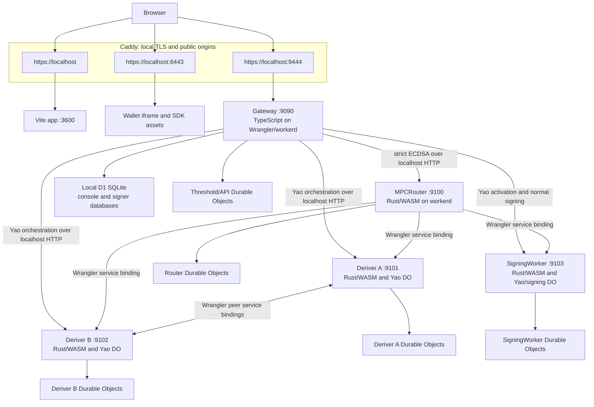

# Yao Router A/B Local Development

Status: current local architecture as of 2026-07-18.

This document describes the backend started by:

```sh
pnpm router
```

The local system has high application-topology parity with the Cloudflare
deployment. It runs Gateway and the four Router A/B roles as
Cloudflare Workers under Wrangler's local `workerd` runtime. Caddy supplies the
browser-facing HTTPS origins.

Operational parity is partial. Local ingress, SDK Router-to-worker transport,
state hosting, and secret custody differ from deployed Cloudflare.

## Service Topology

| Service           | Local origin             | Runtime                                      |
| ----------------- | ------------------------ | -------------------------------------------- |
| Gateway           | `http://127.0.0.1:9090`  | TypeScript Cloudflare Worker under `workerd` |
| MPCRouter         | `http://127.0.0.1:9100`  | Rust/WASM Cloudflare Worker under `workerd`  |
| Deriver A         | `http://127.0.0.1:9101`  | Rust/WASM Cloudflare Worker under `workerd`  |
| Deriver B         | `http://127.0.0.1:9102`  | Rust/WASM Cloudflare Worker under `workerd`  |
| SigningWorker     | `http://127.0.0.1:9103`  | Rust/WASM Cloudflare Worker under `workerd`  |
| Public Gateway    | `https://localhost:9444` | Caddy reverse proxy to `9090`                |
| Wallet origin     | `https://localhost:8443` | Caddy static file server                     |
| App origin        | `https://localhost`      | Caddy reverse proxy to Vite on `3600`        |

Ports `9091-9093` are obsolete. The four production-shaped Router A/B Workers
own `9100-9103`.



## Request Flows

### Browser ingress

The browser calls `https://localhost:9444`. Caddy terminates local TLS, applies
the local Router CORS policy, and forwards every Router request to
`http://127.0.0.1:9090`.

Caddy does not route public requests directly to `9100-9103`. Those ports are
private local worker origins used by Gateway and Wrangler service
bindings.

### Ed25519 Yao

Gateway owns the public registration, recovery, export, refresh, and
normal-signing routes. For a Yao ceremony it orchestrates requests to:

- Deriver A on `9101`;
- Deriver B on `9102`;
- SigningWorker on `9103`.

The local Gateway uses HTTP origins and the
`x-router-ab-internal-service-auth` header. In Cloudflare, the production Router
Gateway dispatches the same request shapes through `DERIVER_A`, `DERIVER_B`, and
`SIGNING_WORKER` service bindings.

Deriver A and Deriver B use Wrangler service bindings for their authenticated
peer protocol. SigningWorker owns activated Yao signing state and serves normal
Ed25519 signing.

### Strict ECDSA

Gateway sends strict ECDSA work to MPCRouter on `9100`. MPCRouter reaches
Deriver A, Deriver B, and SigningWorker through the same
named service bindings declared by the deployment Wrangler manifests.

### Normal signing

Gateway sends active normal-signing requests directly to
SigningWorker on `9103`. Deriver A and Deriver B remain outside the normal
signing hot path.

## Cloudflare Production Parity

| Concern                   | Local                                       | Cloudflare deployment                   |
| ------------------------- | ------------------------------------------- | --------------------------------------- |
| Public ingress            | Caddy and local CA                          | Cloudflare edge and deployed domain     |
| Gateway                   | Local-specific TypeScript Worker entrypoint | Deployment TypeScript Worker entrypoint |
| Router A/B implementation | Production Rust/WASM entrypoints            | Same Rust/WASM entrypoints              |
| Gateway-to-workers        | Localhost HTTP plus internal auth           | Cloudflare service bindings             |
| MPCRouter-to-workers      | Wrangler local service bindings             | Cloudflare service bindings             |
| Worker isolation          | Separate `workerd` processes                | Separate deployed Workers               |
| D1                        | Local SQLite-backed D1                      | Managed Cloudflare D1                   |
| Durable Objects           | Local SQLite-backed DO emulation            | Managed Durable Objects                 |
| Secrets                   | Generated files on the developer machine    | Worker Secrets and Secrets Store        |
| TLS and CORS edge         | Caddy                                       | Cloudflare edge and Worker policy       |

The process boundaries, role ownership, public and private routes, wire formats,
Rust worker code, WASM entrypoints, and Durable Object classes mirror the
deployment shape.

Local execution does not reproduce Cloudflare's distributed scheduling,
network, placement, managed durability, production TLS, or secret-custody
properties.

## Cloudflare Workers Locally

All five backend services are Cloudflare Workers in the local system:

1. Gateway is a TypeScript Worker started from
   `packages/console-server-ts/src/router/cloudflare/d1LocalDevWorker.ts`.
2. Router, Deriver A, Deriver B, and SigningWorker are Rust Workers compiled to
   role-specific WASM artifacts.
3. Wrangler starts each Worker with `--local`, which executes it under
   `workerd`.

The strict Rust workers use these build features:

```text
strict-worker-router-entrypoint
strict-worker-deriver-a-entrypoint
strict-worker-deriver-b-entrypoint
strict-worker-signing-worker-entrypoint
```

`pnpm build:sdk` builds the SDK and all four strict Worker artifacts.
`pnpm router:build` builds only the strict Workers. Each generated Wrangler
configuration points `main` at the corresponding
`build/<role>/worker/shim.mjs`.

Cargo compilation is incremental. Role packaging and `wasm-opt` still add
build time. `pnpm router` performs a fast artifact and build-profile check and
does not invoke `worker-build`.

## Native Rust Workers

The Router A/B Workers are already implemented in Rust. The local production
mirror executes their WASM builds inside `workerd`.

The repository also contains a native `router_ab_local_worker` development
binary for Deriver A, Deriver B, and SigningWorker. It uses custom TCP/HTTP
adapters and local SQLite storage. It has no strict Router role and does not
reproduce Cloudflare service-binding or Durable Object runtime behavior.

Making native processes the primary local stack would require native adapters
for:

- Durable Object identity, storage, and concurrency;
- Cloudflare service bindings;
- Worker request and environment APIs;
- role-specific storage ownership;
- MPCRouter;
- production route and failure-semantics parity.

A native mode can remain useful as a focused performance or protocol harness.
The Wrangler/workerd topology provides stronger deployment parity for normal
development.

## Environment And Secret Loading

### 1. Launcher environment

At startup, `dev-local-workers.mjs` loads `.env.intended.local` with `dotenv`.
Existing shell environment variables retain their normal process-level
precedence.

The launcher also accepts:

- `SEAMS_D1_LOCAL_PERSIST_TO`;
- `SEAMS_D1_LOCAL_WRANGLER_CONFIG`;
- `ROUTER_AB_INTERNAL_SERVICE_AUTH_SECRET`.

### 2. Generated role material

The launcher validates the following files:

```text
.env.router-ab.router.local
.env.router-ab.deriver-a.local
.env.router-ab.deriver-b.local
.env.router-ab.signing-worker.local
```

If required files are absent or invalid, the launcher runs
`router_ab_local_init` to generate a coherent keyset and role configuration.
`pnpm router -- --fresh` forces regeneration.

These source files contain local development key material. They are inputs to
the generated runtime configuration and are never production credentials.

### 3. Strict Worker configuration

`strict-local-runtime-config.mjs` reads the four role files and creates:

```text
.runtime/router-ab-strict/wrangler.router.toml
.runtime/router-ab-strict/wrangler.deriver-a.toml
.runtime/router-ab-strict/wrangler.deriver-b.toml
.runtime/router-ab-strict/wrangler.signing-worker.toml

.runtime/router-ab-strict/.dev.vars.router
.runtime/router-ab-strict/.dev.vars.deriver-a
.runtime/router-ab-strict/.dev.vars.deriver-b
.runtime/router-ab-strict/.dev.vars.signing-worker
```

The generated Wrangler manifests contain role URLs, public keys, key epochs,
binding names, and other non-secret runtime configuration.

Each `0600` `.dev.vars.<role>` file contains the minimum private material for
that Worker:

| Role          | Local secret material                                                         |
| ------------- | ----------------------------------------------------------------------------- |
| Router        | Internal service-auth secret                                                  |
| Deriver A     | Internal auth, root-share wire secret, A HPKE private key, A peer signing key |
| Deriver B     | Internal auth, root-share wire secret, B HPKE private key, B peer signing key |
| SigningWorker | Internal auth and server-output HPKE private key                              |

Wrangler receives the role file through an explicit `--env-file` argument.

### 4. Gateway configuration

`d1-local-runtime-config.mjs` projects the local topology into:

```text
.runtime/wrangler-d1-local/wrangler.d1-local.toml
```

This generated `0600` file contains:

- worker origins `9100-9103`;
- public HPKE and peer-verification keys;
- the local internal-auth value;
- the ECDSA registration topology;
- the ceremony JWT issuer, audience, key ID, and private JWK.

The ceremony private JWK is generated on first use and retained across ordinary
restarts by reading it from the existing generated config.

The SDK Router's Wrangler process also loads these files when present:

```text
packages/sdk-server-ts/.dev.vars
packages/console-server-ts/.dev.vars
```

They provide SDK Router secrets and local integration configuration outside the
Router A/B role files.

### 5. Caddy environment

Caddy receives `SEAMS_WALLET_PUBLIC_ROOT`, which points at
`packages/sdk-web/dist/public`. Router A/B secrets are not passed to Caddy.
Caddy uses `tls internal` and attempts to trust its local CA before startup.

## Local Persistence

Gateway stores local D1 and Threshold Durable Object data under:

```text
.runtime/router-d1-local
```

The four strict Workers use separate persistence roots:

```text
.runtime/router-ab-strict-state/router
.runtime/router-ab-strict-state/deriver-a
.runtime/router-ab-strict-state/deriver-b
.runtime/router-ab-strict-state/signing-worker
```

Separate roots reflect production ownership and prevent independent Wrangler
processes from contending over one local SQLite recovery database. A shared
root previously caused concurrent config reloads to fail with
`SQLITE_BUSY_RECOVERY`.

Regenerating role secrets changes the cryptographic topology. Existing local
accounts may become incompatible with the regenerated keys and persisted
worker state. Treat `--fresh` as a local key rotation and create fresh accounts
unless the associated state is intentionally migrated.

## Startup Sequence

`pnpm router` performs these steps:

1. Stop an existing repository-owned Wrangler topology on ports `9100-9103`.
2. Load launcher environment.
3. Validate or generate local role material.
4. Generate four strict Worker Wrangler configs and secret files.
5. Generate the Gateway D1 Wrangler config.
6. Verify that all strict Worker artifacts exist and match the selected build
   profile.
7. Verify that ports `9100-9103` are available.
8. Start the four Wrangler Worker processes.
9. Wait for the Worker origins and MPCRouter keyset route.
10. Start Gateway on `9090`.
11. Apply and seed the local D1 databases through `gateway:server`.
12. Verify the internal Router health and WebAuthn metadata routes.
13. Reuse a healthy Caddy process or start `pnpm caddy`.
14. Verify `https://localhost:9444/.well-known/webauthn`.

The stale-topology cleanup matches exact generated Wrangler config, persistence,
and fixed-port arguments. An unrelated process on a reserved port is left
running and reported as a conflict.

Run `pnpm build:sdk` after SDK or strict Router A/B Rust changes. Run
`pnpm build:sdk-full` after browser WASM changes. The lower-level
`pnpm router:build` command is available when only the strict Workers changed.
Stop the running Router topology before rebuilding; the build command refuses
to replace watched Worker artifacts while ports `9100-9103` are active.

Stopping the launcher terminates the Worker processes, Gateway process,
and Caddy process that it started. An independently running healthy Caddy
instance remains external to the launcher.

## Relevant Files

- `crates/router-ab-dev/scripts/dev-local-workers.mjs`
- `crates/router-ab-dev/scripts/strict-local-runtime-config.mjs`
- `crates/router-ab-dev/scripts/d1-local-runtime-config.mjs`
- `crates/router-ab-cloudflare/wrangler.router.toml`
- `crates/router-ab-cloudflare/wrangler.deriver-a.toml`
- `crates/router-ab-cloudflare/wrangler.deriver-b.toml`
- `crates/router-ab-cloudflare/wrangler.signing-worker.toml`
- `packages/console-server-ts/wrangler.d1-local.toml`
- `packages/console-server-ts/wrangler.d1-staging-gateway.toml`
- `apps/seams-site/Caddyfile`
- `apps/seams-site/run_caddy.sh`
