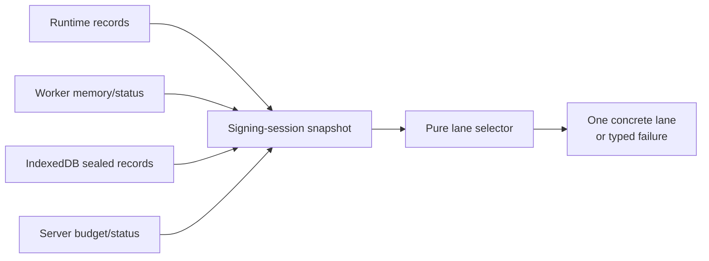
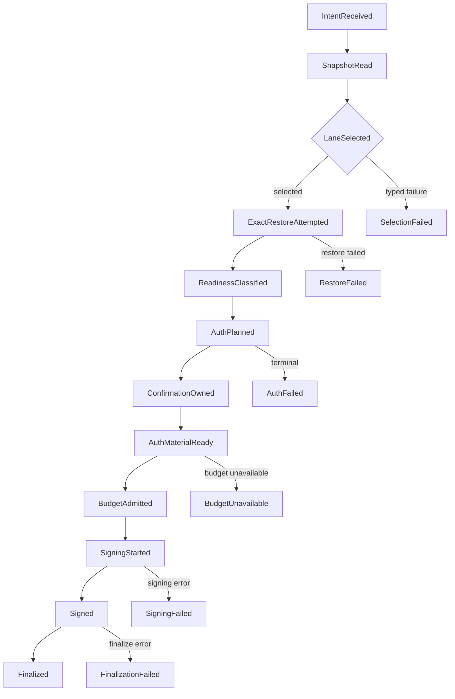
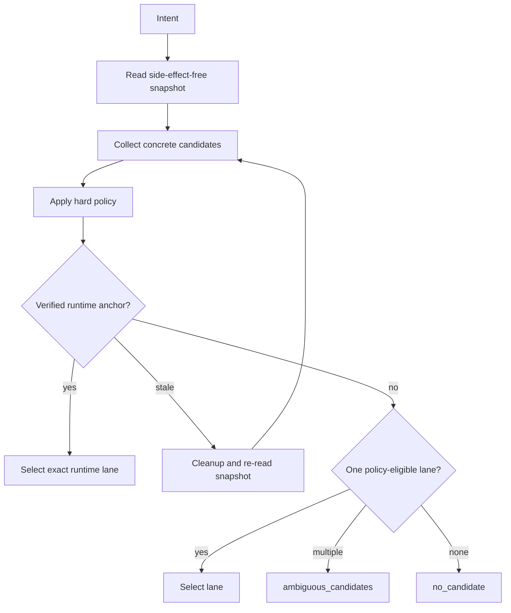
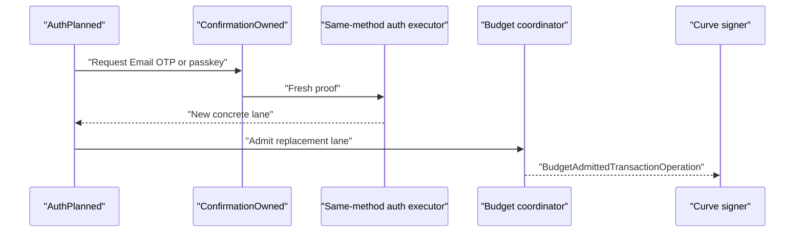
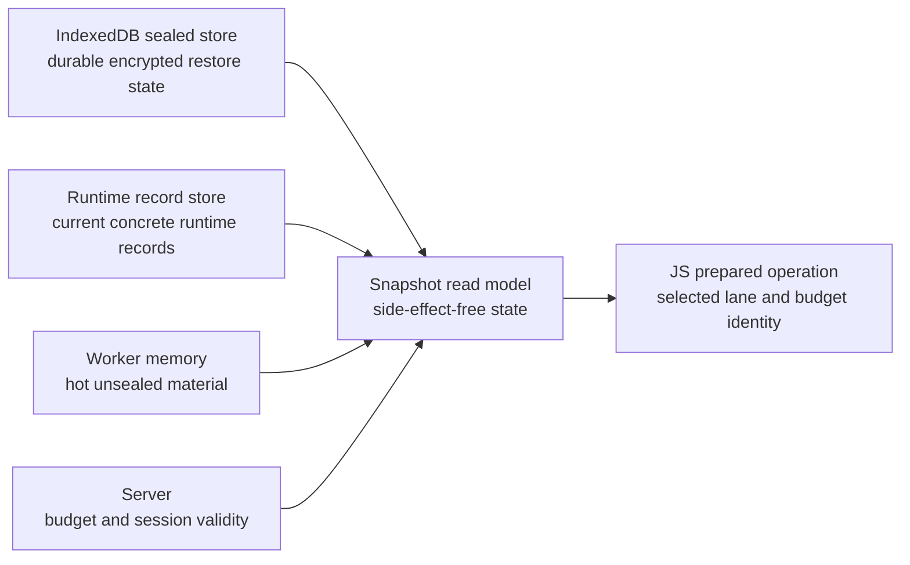
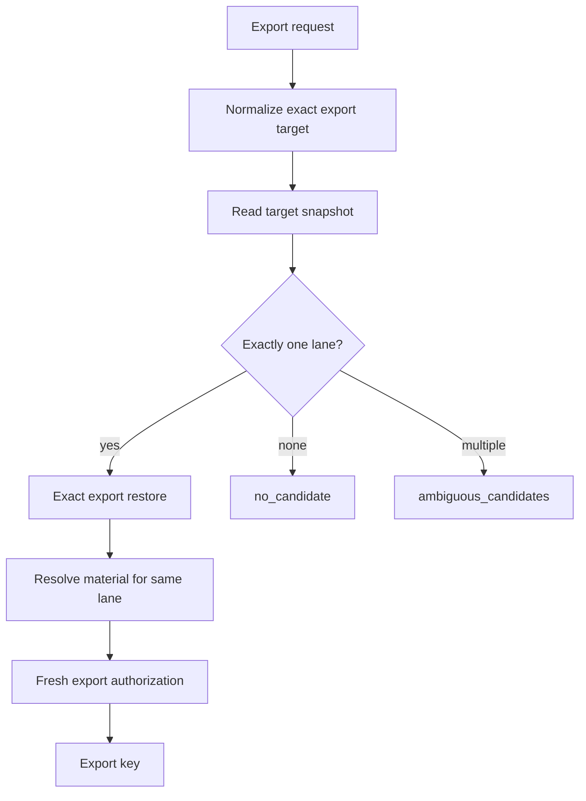

# Signing Session Architecture

Status: active source of truth for signing-session product intent,
state-machine architecture, auth planes, budget admission, sealed refresh,
transaction signing, key export, and the completed deterministic lane refactor.

This document consolidates the previous split signing-session docs:

1. signing-session product intent
2. deterministic state-machine refactor
3. auth and wallet-budget model
4. warm-session rearchitecture notes
5. signing-session architecture summary

Future signing-session work should update this document. Completed migration
history should stay in git history or in a short closeout section here.

## Current Architecture Summary

Transaction signing is a deterministic state machine over one concrete signing
lane. The lane is selected once, before restore, auth planning, budget admission,
signing, or finalization can mutate state.

Core rules:

1. A valid signing session survives page refresh.
2. Refresh is normal runtime loss.
3. Missing worker memory is normal runtime loss.
4. Durable sealed IndexedDB state is the restore source of truth.
5. Worker memory is only hot unsealed material.
6. Server status is authoritative for wallet signing-session validity and
   remaining budget.
7. Status and snapshot reads are side-effect-free.
8. Transaction signing and key export use exact selected lanes.
9. After budget exhaustion, Email OTP accounts step up with Email OTP and
   passkey accounts step up with passkey or TouchID.
10. NEAR Ed25519 and ECDSA restore independently and exactly.

## Terminology

Use auth-method-neutral terms for core signing-session, restore, budget, and
threshold flows:

- `factor-derived secret`: auth-owned secret material used as the client
  contribution to signing, share unwrapping, or sealed session refresh.
- `share unwrap secret`: factor-derived material used to unwrap protected
  share or session material.
- `signing_session_secret32`: the session-scoped secret sealed by
  `sealed_refresh_v1`.
- `WebAuthn PRF output` or `passkey PRF output`: passkey adapter vocabulary for
  the concrete browser primitive.

Core architecture docs and shared signing code should use factor-derived
terminology. Passkey/WebAuthn modules and passkey-specific tests may use PRF
vocabulary when they describe the concrete passkey primitive.

## Lane And Snapshot

Two terms show up throughout this architecture: lane and snapshot.

### Lane

A lane is the exact signing capability selected for one operation. It answers:

```text
Who is signing?
Which auth method owns this signing capability?
Which curve and chain target are being used?
Which wallet signing-session budget is being spent?
Which threshold session and threshold key material must be used?
```

The lane is the operation's identity contract. After lane selection, every
restore, readiness check, auth prompt, budget admission, signing call, and
finalization must carry the same lane identity.

Example NEAR Ed25519 lane:

```ts
type NearEd25519TransactionLane = {
  account: NearAccountRef;
  authMethod: 'email_otp' | 'passkey';
  curve: 'ed25519';
  chain: 'near';
  walletSigningSessionId: string;
  thresholdSessionId: string;
};
```

Example ECDSA lane:

```ts
type EcdsaTransactionLane = {
  walletId: string;
  authMethod: 'email_otp' | 'passkey';
  curve: 'ecdsa';
  chainTarget: ThresholdEcdsaChainTarget;
  ecdsaThresholdKeyId: string;
  signingRootId: string;
  signingRootVersion: string;
  walletSigningSessionId: string;
  thresholdSessionId: string;
};
```

The practical rule is simple: if two records differ in any lane identity field,
they are different lanes. Transaction and export code must fail with a typed
selection error when it cannot select exactly one lane.

### Snapshot

A snapshot is a side-effect-free read model of current signing-session state. It
answers:

```text
Which concrete lanes are visible right now?
Which lanes have hot runtime material?
Which lanes have durable sealed restore material?
Which lanes appear expired, exhausted, missing, or restorable?
```

A snapshot may combine several sources:

| Source | Snapshot Contribution |
| --- | --- |
| runtime record store | concrete lanes with hot session material |
| worker memory/status | hot material readiness hints |
| IndexedDB sealed store | durable restorable lane candidates |
| server budget/status | trusted remaining-use and TTL hints |

Snapshot reads do not mutate state. They do not unseal, restore, prompt, consume
budget, delete records, publish companion lanes, or choose a fallback auth
method.



Snapshots can contain messy raw state. The transaction operation cannot. The
selector turns snapshot candidates into one concrete lane, or returns a typed
failure such as `no_candidate`, `ambiguous_candidates`, or `runtime_mismatch`.

## Identity Model

Signing-session identity is protocol-specific after the system boundary.

| Scope | Type | Meaning |
| --- | --- | --- |
| Wallet session | `walletId` or `walletSessionUserId` | Authenticated wallet/session and audit scope |
| NEAR Ed25519 | `NearAccountRef` | NEAR account identity |
| ECDSA principal | `walletId` | Threshold ECDSA wallet principal |
| ECDSA target | `ThresholdEcdsaChainTarget` | Concrete EVM-family or Tempo target |
| Wallet signing session | `walletSigningSessionId` | Wallet-level budget and TTL id |
| Threshold session | `thresholdSessionId` | Curve-specific signing session id |

Funds-safety invariant: EVM SIGNERS MUST ALL SHARE THE SAME ADDRESS for the
same wallet, RP, signing root, and key version. `ThresholdEcdsaChainTarget`
selects a concrete lane/session/budget/nonce scope; it must not select a
different persistent ECDSA key or displayed owner address.

NEAR Ed25519 lanes carry a NEAR account reference. ECDSA lanes carry wallet id
and concrete chain target. A NEAR account id may appear in NEAR account
operations and diagnostic context; it is not the ECDSA principal.

Canonical ECDSA lane identity includes:

```ts
type EcdsaLaneIdentity = {
  walletId: string;
  authMethod: 'email_otp' | 'passkey';
  curve: 'ecdsa';
  chainTarget: ThresholdEcdsaChainTarget;
  ecdsaThresholdKeyId: string;
  signingRootId: string;
  signingRootVersion: string;
  walletSigningSessionId: string;
  thresholdSessionId: string;
};
```

Exact ECDSA comparisons use the canonical lane key for this complete identity.
Raw `evm` and `tempo` labels are request/config boundary inputs only; internal
transaction, export, restore, budget, nonce, store, and server payloads use
`ThresholdEcdsaChainTarget`.

## Auth Planes

Signing uses three separate auth planes.

### App Session

An app session proves the user is logged in and may request user-level
operations, such as Email OTP challenge issuance. App sessions are not signing
authority and cannot authorize threshold signing, key export, or HSS
continuation routes by themselves.

### Threshold Session

A threshold session proves active signing capability for one curve-specific
threshold session.

Use threshold-session auth for:

1. Ed25519 threshold signing and HSS continuation routes.
2. ECDSA threshold signing, presign, and HSS continuation routes.
3. Threshold export routes after the operation has fresh export authorization.

The threshold session token should be named `thresholdSessionAuthToken` in
client/server boundaries so it is never confused with app-session JWTs.

### Wallet Signing Session

`walletSigningSessionId` is the wallet-level signing-session budget id. It ties
curve-specific threshold sessions to one server-authoritative TTL and
`remainingUses` counter. `thresholdSessionId` identifies the concrete
curve-specific threshold session.

Both ids are required for transaction signing. The wallet id alone is
insufficient, and the threshold session id alone is insufficient.

## Lifecycle State Machine

One state machine handles NEAR, Tempo, Arc/EVM, Email OTP, and passkey signing.
Curve/auth adapters plug into the transitions; they do not select lanes or
re-plan auth after selection.



Transition rules:

| From | To | Owner | Rule |
| --- | --- | --- | --- |
| `IntentReceived` | `SnapshotRead` | snapshot reader | Read only. No restore, prompt, consume, publish, or cleanup. |
| `SnapshotRead` | `LaneSelected` | lane selector | Select one concrete lane or fail typed. No probing. |
| `LaneSelected` | `ExactRestoreAttempted` | restore executor | Restore only the selected lane identity. |
| `ExactRestoreAttempted` | `ReadinessClassified` | readiness reader | Classify selected lane only. |
| `ReadinessClassified` | `AuthPlanned` | planner | Map readiness to warm, same-method step-up, or terminal. |
| `AuthPlanned` | `ConfirmationOwned` | confirmer | User-visible confirmation owns prompts. |
| `ConfirmationOwned` | `AuthMaterialReady` | auth executor | Warm lane, OTP result, or passkey reconnect returns a concrete lane. |
| `AuthMaterialReady` | `BudgetAdmitted` | budget coordinator | Capture budget identity before signing. |
| `BudgetAdmitted` | `SigningStarted` | curve executor | Sign with the admitted lane only. |
| `SigningStarted` | `Signed` | curve executor | Return signed payload/result. |
| `Signed` | `Finalized` | finalizer | Finalize the same lane. No re-selection. |

## Operation Types

Lifecycle types are monotonic. Later states contain everything required by
earlier states plus the newly admitted or produced data.

```ts
type PreparedTransactionOperation = {
  intent: TransactionSigningIntent;
  lane: TransactionLane;
  readiness: TransactionReadiness;
  authPlan: TransactionAuthPlan;
};

type BudgetAdmittedTransactionOperation = PreparedTransactionOperation & {
  budget: BudgetAdmission;
};

type SignedTransactionOperation = BudgetAdmittedTransactionOperation & {
  signed: SigningResult;
};
```

Signing executors accept only `BudgetAdmittedTransactionOperation`. Finalizers
accept only `SignedTransactionOperation`.

## Lane Selection

Lane selection is pure and deterministic.

Inputs:

1. transaction intent
2. side-effect-free snapshot candidates
3. hard auth/session eligibility policy
4. verified current runtime candidate, when present

Outputs:

1. one concrete `TransactionLane`
2. or one typed `LaneSelectionFailure`

Selection policy:

1. Filter by wallet/session scope, curve, and concrete chain identity.
2. Read only concrete candidate lists.
3. Hard policy may exclude impossible or disallowed lanes.
4. Account preference and primary-auth metadata cannot hide a verified current
   runtime lane.
5. A current runtime record anchors selection only when it is verified as a
   concrete candidate.
6. Stale runtime state may be discarded with one cleanup/re-read pass.
7. Cleanup/re-read does not restore, prompt, consume, publish, or switch auth.
8. Runtime mismatch returns typed selection failure.
9. Multiple same-policy candidates use explicit selector policy.
10. Missing ordering metadata returns `ambiguous_candidates`.
11. Candidate array order is never selection policy.



## Readiness And Auth Planning

Readiness describes only the selected lane.

```ts
type TransactionReadiness =
  | { status: 'ready'; remainingUses: number; expiresAtMs: number }
  | { status: 'missing_hot_material' }
  | { status: 'expired' }
  | { status: 'exhausted' }
  | { status: 'restore_failed'; reason: string }
  | { status: 'budget_unknown'; reason: string }
  | { status: 'policy_blocked'; reason: string };
```

Planner mapping:

1. `ready` with enough trusted budget becomes warm signing.
2. `missing_hot_material`, `expired`, and `exhausted` become same-method
   step-up.
3. `restore_failed`, `budget_unknown`, and `policy_blocked` are terminal unless
   the typed error explicitly permits same-method step-up.
4. A selected Email OTP lane can only plan Email OTP step-up.
5. A selected passkey lane can only plan passkey step-up.

## Restore

Exact operation restore accepts concrete command inputs:

```ts
type ExactRestoreInput =
  | { reason: 'transaction'; lane: TransactionLane }
  | { reason: 'key_export'; lane: ConcreteKeyExportLane };
```

Rules:

1. Transaction restore cannot compile without concrete lane IDs.
2. Transaction restore cannot change auth method, curve, subject, chain target,
   threshold key, signing root, wallet signing-session id, or threshold session
   id.
3. Restore success publishes hot material for the selected lane only.
4. Restore failure returns readiness for that lane or a typed restore failure.
5. Maintenance restore is unavailable to transaction signing and key export.

## Reauth And Step-Up

Step-up is a state transition that creates a replacement prepared lane.



Rules:

1. Step-up does not mutate the exhausted lane.
2. Step-up returns a new concrete lane with its own session ids.
3. The old prepared operation is replaced.
4. Finalization targets the replacement lane.
5. Transaction step-up mints a single-operation session:
   `sessionBudgetUses = operationUsesNeeded`, normally `1`.
6. Reusable signing sessions require an explicit reusable-session command.

## Budget Model

Budget accounting is server-authoritative.

Terms:

1. `remainingUses`: trusted server remaining budget.
2. `operationUsesNeeded`: cost of the current signing operation, normally `1`.
3. `sessionBudgetUses`: capacity minted by step-up or reusable-session creation.
4. `projectionVersion`: opaque causal token for trusted server budget status.
5. `availableUses`: local admission hint after same-projection in-flight holds.
6. `inFlightReservedUses`: local holds against the same projection.

Rules:

1. One user-approved signing request costs one use by default.
2. One NEAR batched signing request is one use by default.
3. One EVM, Tempo, or Arc signing request is one use for the selected
   wallet id plus `ThresholdEcdsaChainTarget`.
4. Key export is separate from transaction signing budget.
5. Warm-session budget identity is captured before signing.
6. Step-up-created budget identity is captured immediately after mint/reconnect
   and before signing.
7. Finalization never prepares budget identity after signing.
8. Local in-flight holds never change trusted `remainingUses`.
9. Projection-version comparison is equality only.
10. Stale projection causes budget reprepare, not step-up.

## Storage Ownership



| Storage | Owns | Does Not Own |
| --- | --- | --- |
| IndexedDB sealed store | encrypted restore state and durable lane metadata | hot material, auth prompts, budget truth |
| runtime record store | current concrete runtime records | lane selection policy, budget truth |
| worker memory | hot unsealed material | durable identity, budget truth |
| server | authoritative budget and session validity | local lane selection |
| JS prepared operation | operation-local selected lane and budget identity | durable storage |
| sessionStorage | optional UI/session marker only | signing correctness |

Status reads and snapshots combine storage into a read model. They never repair,
restore, consume, publish, delete, or prompt.

## Refresh Semantics

Refresh should not force OTP or passkey when the selected lane has durable sealed
state and server budget remains valid.

Normal flow:

1. User unlocks with Email OTP or passkey.
2. App creates or restores Ed25519 and/or ECDSA signing sessions.
3. User signs while the wallet signing session is active and has budget.
4. User refreshes the page.
5. The next signing command restores the exact needed lane from sealed durable
   state.
6. The transaction signs without prompting.

Exhaustion flow:

1. Server budget reaches zero.
2. The next transaction selects the exact lane.
3. Readiness becomes `exhausted`.
4. Auth planning requests same-method step-up.
5. Step-up mints a one-operation replacement lane.
6. Budget is admitted before signing.
7. Signing and finalization target the replacement lane.

## Key Export

Key export is exact-purpose and uses fresh operation authorization.

Rules:

1. Export receives one explicit target or observes exactly one concrete export
   lane.
2. Multiple distinct lanes return `ambiguous_candidates`.
3. Missing requested target returns `no_candidate`.
4. Export does not select another chain target.
5. Export does not mint or renew transaction signing sessions.
6. Export does not consume transaction signing budget.
7. Export material lookup must match the selected export lane exactly.



## Linked Auth Accounts

Accounts may eventually have both Email OTP and passkey registered. The choice
must happen before restore, auth planning, budget admission, signing, or
finalization.

Current policy:

1. Explicit auth method selects that method or returns `no_candidate`.
2. Account-class policy selects the method implied by the current account class
   when it has a valid concrete candidate.
3. Current-lane policy keeps the exact verified current lane.

Future linked-auth UI can add persisted last-used and user-choice policy. That
policy must be explicit input to lane selection and must not be inferred from
whichever runtime record exists after restore or step-up side effects.

## Warm Session Model

The older warm-session rearchitecture described a useful conceptual split:

1. a manager owns readiness and restoration decisions.
2. capability provisioners create or reconnect Ed25519 and ECDSA capability
   state.
3. worker memory holds hot PRF or signing material.
4. sealed stores hold encrypted restore artifacts.

The current transaction architecture applies that split through the
state-machine boundary. Transaction, export, and status code may read readiness
through explicit APIs, but signing/export execution cannot call low-level PRF,
restore, or broad lookup helpers directly.

## Forbidden Production Paths

The following patterns caused the regressions this refactor fixed and must stay
deleted:

1. account auth metadata overriding a concrete selected lane.
2. collapsed snapshot lanes as transaction authority.
3. transaction restore by only auth method, curve, and chain.
4. transaction auth-method probing.
5. fallback from runtime mismatch to another durable candidate.
6. fallback from durable mismatch to account record.
7. finalization that reads mutable current global session state.
8. optional lane IDs in executable transaction state.
9. signing before budget admission.
10. budget admission after signing.
11. key export using maintenance restore.
12. ECDSA subject derivation from a NEAR account id inside core
    signing/export/restore paths.
13. ECDSA raw `evm` or `tempo` labels as internal lane identity.
14. broad keyRef/session lookup followed by `[0]` selection.

## Completed Refactor History

The completed implementation work closed these architecture gaps:

1. NEAR Ed25519 transaction prepare uses concrete candidate selection.
2. ECDSA transaction lanes carry full ECDSA lane identity.
3. Exact restore failure is terminal or typed readiness for the selected lane.
4. Step-up mints one-operation sessions for transaction signing.
5. Reauth replaces prepared operations.
6. EVM/Tempo signing receives budget-admitted state before signing.
7. Key export resolves exact lanes first.
8. Snapshot ECDSA identity uses concrete `ThresholdEcdsaChainTarget`.
9. Legacy collapsed ECDSA records are dropped rather than migrated.
10. Public/internal ECDSA boundaries use wallet id and exact lane identity.
11. HSS prepare binds ECDSA requests to wallet id and exact chain target.
12. Duplicate exact Ed25519 export candidates are normalized by canonical lane
    identity.

Manual release evidence recorded during the refactor:

1. new passkey registration succeeds.
2. new Email OTP unlock succeeds.
3. Ed25519 and ECDSA transaction signing work for passkey and Email OTP accounts.
4. Ed25519 and ECDSA key export work for passkey and Email OTP accounts.
5. Session exhaustion prompts the correct auth method and signs successfully for
   Ed25519 and ECDSA.

## Static Guard Targets

Guard tests should reject:

1. optional identity fields in executable transaction/export/budget types.
2. internal ECDSA raw collapsed chain identity.
3. production ECDSA paths deriving signer identity from `nearAccountId`.
4. `post_reauth_admission`, `reauth_required`, or callback admission across the
   signing boundary.
5. `budgetIdentity?` in prepared executable operations.
6. transaction/key-export imports of maintenance restore.
7. broad session/keyRef lookup followed by `[0]`.
8. stale split docs reintroduced as active authority.

## Related Docs

1. Email OTP architecture:
   [../otp/email-otp.md](../otp/email-otp.md).
2. Sealed refresh:
   [sealed-refresh.md](sealed-refresh.md).
3. Threshold session token naming:
   [threshold-session-auth-token.md](threshold-session-auth-token.md).
4. ECDSA model:
   [../ecdsa_threshold_signing.md](../ecdsa_threshold_signing.md).
5. Ed25519 model:
   [../threshold-ed25519/stateless-shared-root.md](../threshold-ed25519/stateless-shared-root.md).
6. Nonce coordinator:
   [../nonce-coordinator.md](../nonce-coordinator.md).
