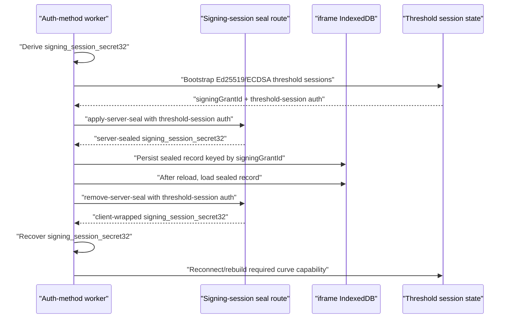

# Signing-Session Sealed Refresh (`sealed_refresh_v1`)

Last updated: 2026-04-21

## Purpose

Use `shamir3pass` to restore an already-authenticated signing grant after accidental iframe/page reload without prompting the user again, while keeping signing material out of browser storage in plaintext.

This is an auth-method-neutral signing-session feature for live wallet sessions.

Supported secret sources:

1. passkey accounts: `signing_session_secret32` derived from WebAuthn PRF output.
2. Email OTP accounts: `signing_session_secret32` derived inside the Email OTP worker after OTP-authorized `shamir3pass` unseal of `S`.

The active Email OTP architecture lives in
[../otp/email-otp.md](../otp/email-otp.md). The app-session,
threshold-session, and wallet-budget authority model lives in
[README.md](README.md).

## Current Model

`signingSessionPersistenceMode = 'sealed_refresh_v1'` enables sealed refresh for session-mode signing sessions.

The persisted artifact is:

```text
E_session_s(signing_session_secret32)
```

Do not persist in sealed-refresh records:

```text
plaintext signing_session_secret32
plaintext Email OTP S
device-local Email OTP enrollment escrow enc_s(S)
raw app-session JWTs in sealed-refresh records
raw threshold-session auth tokens in sealed-refresh records
```

The sealed artifact is useful only with live server participation and valid server-side signing-session state.

## Storage

Use iframe-origin IndexedDB, not app-origin storage.

Store:

```text
signing_session_seals_v1
```

Primary key:

```text
signingGrantId
```

Indexes:

1. `walletId`
2. `userId`
3. `authMethod`
4. `signingRootId`
5. `expiresAtMs`

Rules:

1. keep at most one active record per wallet/signing root/auth method;
2. delete older records on write;
3. bind each record to a browser-session `runtimeSessionId` stored in iframe-origin `sessionStorage`;
4. if the browser-session marker is missing or mismatched, delete the IndexedDB record before restore;
5. logout, lock, account switch, revocation, TTL expiry, and remaining-use exhaustion delete both worker material and sealed records.

## Route Model

Use signing-session seal routes:

```text
POST /v2/wallet-session/seal/apply
POST /v2/wallet-session/seal/remove
```

Route auth:

1. apply/remove requires threshold-session authority for the signing session being sealed or restored;
2. app-session auth alone is not sufficient to restore threshold signing capability;
3. server validates wallet, user, signing root, auth method, TTL, remaining uses, revocation state, and seal key version;
4. seal apply/remove is transaction-use neutral and must not increase TTL or remaining uses.

Do not reintroduce auth-method-specific route names, storage names, or request fields. The steady-state terminology is `signing-session`, `sealedSecretB64u`, `signing_session_secret32`, and `signingGrantId`.

## Flow



## Auth-Method Behavior

Passkey:

1. fresh passkey auth derives `signing_session_secret32` from the WebAuthn PRF output;
2. sealed refresh restores the same signing grant without another WebAuthn prompt while server policy allows it;
3. exhaustion or expiry routes the next transaction through WebAuthn/passkey confirmation.

Email OTP:

1. Google SSO authenticates the app/user;
2. Email OTP authorizes initial unseal of `S`;
3. the Email OTP worker derives `signing_session_secret32` and seals only that session-scoped secret;
4. sealed refresh restores the same signing grant without another OTP while server policy allows it;
5. exhaustion or expiry routes the next transaction through the Email OTP Tx Confirmer.

`per_operation` sessions never write or consume sealed-refresh records.

## Sensitive Operations

Sealed refresh only restores transaction signing capability. It does not authorize sensitive operations by itself.

Private-key export, link-device, and add-signer flows must:

1. request fresh operation-scoped auth;
2. verify the fresh OTP or passkey challenge;
3. keep operation material separate from the transaction signing session;
4. avoid consuming, replacing, clearing, or renewing the transaction `signingGrantId`.

After sealed refresh, restored signing-session route authority may request a fresh Email OTP challenge for a sensitive operation. It cannot directly authorize the operation without successful challenge verification and route-specific policy approval.

## Acceptance Criteria

1. Session-mode passkey and Email OTP accounts can survive accidental iframe/page reload while server TTL and remaining uses remain valid.
2. Email OTP sealed refresh does not store plaintext `S`, plaintext `signing_session_secret32`, or device-local `enc_s(S)`.
3. Ed25519 and ECDSA restored capabilities remain tied to the same `signingGrantId` budget.
4. Remaining-use exhaustion prompts with the registered auth method: Email OTP for Email OTP-only accounts and WebAuthn for passkey accounts.
5. Export and link-device/add-signer require fresh operation auth and do not clobber transaction signing sessions.
6. Wrong-token usage between app-session and threshold-session lanes fails closed.
7. No auth-method-specific sealed-refresh APIs, route names, storage names, or field names remain in steady-state code or specs.
