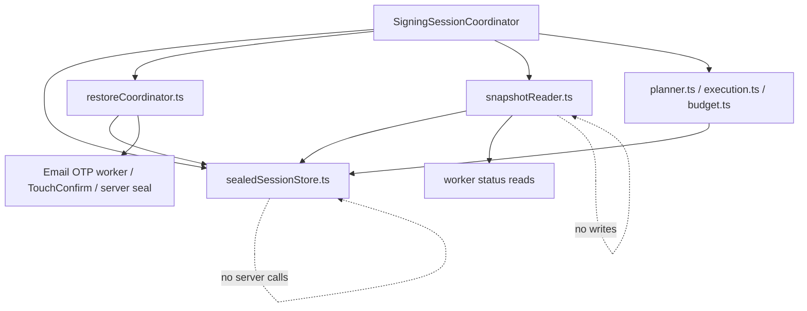

# Signing Session Restore Refactor Plan

Date created: 2026-04-27

## Objective

Eliminate reload, restore, and missing-lane regressions without adding another
large taxonomy of session services.

The target architecture keeps one public facade and three small internal modules
for this refactor:

```text
session/
  SigningSessionCoordinator.ts   public stateful facade, transaction boundary
  sealedSessionStore.ts          IndexedDB sealed records + runtime identity map
  restoreCoordinator.ts          explicit restore commands and leases
  snapshotReader.ts              side-effect-free status/snapshot composition
```

Keep existing `session/signingSession/planner.ts`, `execution.ts`, and
`budget.ts` where they are unless this refactor actively deletes a duplicate
call path. Moving pure planner/execution/budget files just to match a target tree
adds churn without addressing the restore bug.

The final model should be easy to explain:

1. `SigningSessionCoordinator` is the only public object chain signing imports.
2. `sealedSessionStore.ts` owns durable sealed-record access and runtime identity
   indexing.
3. `restoreCoordinator.ts` owns unseal/rehydrate side effects.
4. `snapshotReader.ts` owns read-only session snapshots.

## Problem Statement

The recent Email OTP reload issue exposed an ownership boundary bug:

1. Durable restore material lived in IndexedDB `signing_session_seals_v1`.
2. The ECDSA reload path treated volatile warm-session/session-record state as
   the entrypoint for finding durable restore material.
3. Generic status/readiness paths performed sealed-refresh restore as a read-side
   side effect.
4. `getWalletSession()` polling could repeatedly unseal, bootstrap, probe the
   wrong curve, or fail to publish a selected ECDSA signing lane.
5. Optional lane identity fields let planning proceed until later boundaries
   failed with "missing selected signing lane" errors.

The fix is not a bigger resolver. The fix is a smaller boundary:

```text
restore is a command
snapshot/status is a read
```

## Core Invariant

```text
Durable sealed session state is the source of truth for reload restore.
Read/status APIs must never perform restore side effects.
```

Corollaries:

1. `getWalletSession`, `getSnapshot`, status readers, capability readers, budget
   readers, and lane resolvers are query APIs.
2. Query APIs must not unseal, bootstrap, mutate durable stores, call server seal
   endpoints, or create runtime signing sessions.
3. Reload restore must enumerate durable sealed records directly by account and
   purpose, then publish resolved runtime identity into the coordinator store.
4. Transaction signing must receive a fully resolved selected lane before
   challenge preparation, budget reservation, signing, or finalization.
5. Durable sealed records are deleted only by explicit lifecycle decisions. A
   failed lookup of volatile runtime state is not a deletion signal.
6. Transaction signing restore is exact-purpose. It must not account-wide unseal
   unrelated lanes as a side effect of signing.

## Sealed-Record Deletion Rules

Durable sealed records are the reload restore source of truth. They must not be
deleted just because volatile state is missing.

Allowed deletion reasons:

1. explicit logout, account cleanup, or user-requested revoke
2. authoritative expiry or exhaustion from the sealed record policy or a
   successful worker/server lifecycle result
3. successful cleanup after a single-use or revoked session
4. exact-purpose cryptographic mismatch, for example the record decrypts or
   authenticates under the requested purpose but its authenticated metadata is
   inconsistent
5. schema migration that intentionally invalidates an obsolete sealed-record
   version

Delete only after a mismatch is proven against authenticated sealed payload
metadata or a trusted lifecycle result. IndexedDB index fields are lookup hints,
not authority.

Fields that must be authenticated before they can justify destructive cleanup:

1. wallet id or account id
2. auth method
3. curve
4. ECDSA chain
5. wallet signing-session id
6. threshold session id
7. companion threshold session ids
8. signing root id and version
9. key version

If a field is present only as unauthenticated IndexedDB metadata, a mismatch may
return `deferred`, `not_restored`, or `retryable`, but it must not delete the
durable sealed record.

Not deletion reasons:

1. missing `sessionStorage` runtime marker
2. missing volatile worker memory
3. missing runtime session record
4. missing Ed25519 companion lane metadata for an ECDSA sealed record
5. purpose mismatch found while probing with a different curve, auth method, or
   chain
6. restore lease unavailable
7. transient worker, IndexedDB, or server error

Required behavior for non-deletion failures:

1. missing volatile state returns `deferred` or `not_restored`
2. missing companion metadata defers or restores the ECDSA record independently
   when the sealed ECDSA record has enough authenticated metadata
3. lease unavailable returns `deferred`
4. transient errors return `retryable`
5. purpose mismatch logs at most once per exact cache key and does not delete
   other-purpose records

## Simplified Target Architecture



### SigningSessionCoordinator

The coordinator is the only public facade:

```ts
class SigningSessionCoordinator {
  prepareSigning(input): Promise<PreparedSigningSession>;
  restorePersistedSessionForSigning(input): Promise<RestorePersistedSessionForSigningResult>;
  restorePersistedSessionsForAccount(input): Promise<AccountRestoreSummary>;
  getSnapshot(input): Promise<SigningSessionSnapshot>;
  sign(input): Promise<SigningResult>;
}
```

Rules:

1. Chain signing code imports the coordinator, not lower-level restore/status
   modules.
2. The coordinator may call restore commands explicitly.
3. The coordinator may call snapshot reads explicitly.
4. The coordinator must not hide restore inside snapshot/status reads.
5. Public transaction entrypoints use `prepareSigning` or `sign`, which run the
   explicit restore step before lane selection.
6. Lane selection is an internal pure helper:
   `resolveLaneFromSnapshot(snapshot, request)`.
7. `prepareSigning` is the only transaction path that may call restore, and it
   may call only `restorePersistedSessionForSigning`, never the account-wide
   restore command.
8. `prepareSigning` returns the exact resolved identity and snapshot generation
   that budget, challenge preparation, signing, and finalization must reuse.

Do not expose a public `resolveLane(account)` API that callers can invoke before
restore. That preserves the stale-read bug under a cleaner name.

`restorePersistedSessionForSigning` is exact-purpose and is used by transaction
signing, key export, and session-status command paths that need a single lane.
Its input includes:

```ts
type RestorePersistedSessionForSigningInput = {
  walletId: string;
  authMethod: 'email_otp' | 'passkey';
  curve: 'ed25519' | 'ecdsa';
  chain: 'near' | 'tempo' | 'evm';
  reason: 'transaction' | 'export' | 'session_status';
};
```

Account-wide restore is separate and bounded. Use
`restorePersistedSessionsForAccount` only for startup/session initialization
flows that intentionally restore all eligible lanes for an account.

```ts
type RestorePersistedSessionsForAccountInput = {
  walletId: string;
  authMethod?: 'email_otp' | 'passkey';
  maxRecords?: number;
};
```

### sealedSessionStore.ts

Owns storage and in-memory identity indexing:

1. list/read/write/delete durable sealed records
2. hold the runtime identity map for restored and active sessions
3. expose purpose-exact sealed-record APIs
4. expose read-only identity queries
5. never call workers, server seal endpoints, or unseal code

Runtime identity is not the secret material. Worker memory remains the source of
truth for loaded PRF/signing material.

### restoreCoordinator.ts

Owns explicit restore commands:

1. enumerate durable sealed records by account and purpose
2. acquire restore leases
3. call Email OTP or passkey unseal/rehydrate paths
4. publish restored identity into `sealedSessionStore.ts`
5. cache successful and known-missing restore attempts
6. update/delete sealed records only as part of explicit command-side lifecycle

Only exact-purpose durable-record absence is cacheable as known-missing.
Transient errors, lease contention, missing volatile state, missing companion
metadata, worker failures, and server failures must not enter the known-missing
cache.

### snapshotReader.ts

Owns read-only snapshots:

1. read runtime identity from `sealedSessionStore.ts`
2. ask Email OTP worker or TouchConfirm worker for current status
3. compose account, curve, chain, budget, and readiness snapshots
4. never unseal
5. never call server seal endpoints
6. never write durable sealed records

Snapshot lane states:

1. `ready`: resolved identity exists and worker material is currently loaded and
   usable
2. `restorable`: durable sealed record exists for the exact purpose, but worker
   material is not loaded
3. `deferred`: restore may be possible, but the restore command is blocked by a
   lease, transient error, or missing non-authoritative companion state
4. `expired`: trusted worker/server status, or authenticated sealed payload
   metadata, says the durable/session material is expired
5. `exhausted`: trusted worker/server status, or authenticated sealed payload
   metadata, says no signing uses remain
6. `missing`: no runtime identity and no exact-purpose durable sealed record

`restorable` is derived from durable sealed-record presence without unsealing.
This prevents snapshot readers from either hiding restorable sessions as missing
or being tempted to restore during reads.

Raw IndexedDB index fields are not authoritative policy. When snapshot readers
only have unauthenticated durable metadata, they should report `restorable` with
a `policyHint` such as `{ expiresAtMs, remainingUses }`, not terminal
`expired` or `exhausted`. Terminal states require trusted worker/server status
or authenticated sealed payload metadata.

## Identity Model

Use type-state instead of making every intermediate object fully resolved.

```ts
type SigningSessionRequestIdentity = {
  walletId: string;
  authMethod?: 'email_otp' | 'passkey';
  curve?: 'ed25519' | 'ecdsa';
  chain?: 'near' | 'tempo' | 'evm';
};

type SelectedSigningLaneIdentity = {
  walletId: string;
  authMethod: 'email_otp' | 'passkey';
  curve: 'ed25519' | 'ecdsa';
  chain: 'near' | 'tempo' | 'evm';
  walletSigningSessionId: string;
};

type ResolvedSigningSessionIdentity =
  | {
      walletId: string;
      authMethod: 'email_otp' | 'passkey';
      curve: 'ed25519';
      chain: 'near';
      walletSigningSessionId: string;
      thresholdSessionId: string;
    }
  | {
      walletId: string;
      authMethod: 'email_otp' | 'passkey';
      curve: 'ecdsa';
      chain: 'tempo' | 'evm';
      walletSigningSessionId: string;
      thresholdSessionId: string;
    };
```

```ts
type PreparedSigningSession = {
  identity: ResolvedSigningSessionIdentity;
  snapshotGeneration: string;
  snapshot: SigningSessionSnapshot;
};
```

The prepared session is the handoff object for the rest of a transaction. Budget
reservation, challenge preparation, signing, post-sign policy, and finalization
reuse this identity instead of rediscovering lane state mid-flow.

Rules:

1. Optional fields are allowed only in request/input identity.
2. Selected identity requires wallet signing-session identity.
3. Resolved identity requires wallet signing-session id and threshold session id.
4. ECDSA resolved identity always includes chain.
5. Signing, budget, post-sign cleanup, and finalization require resolved
   identity.
6. No code may synthesize `walletSigningSessionId` from `thresholdSessionId`.

## Review Hardening Checklist

This plan is implementation-ready only if these constraints stay true during
the refactor:

1. Phase order must not create a broken intermediate state. Add explicit restore
   commands first, move policy writes to command boundaries next, add snapshots
   with `restorable`/`deferred` states, then remove read-side restore and writes.
2. Transaction signing restore must be exact-purpose. Use
   `restorePersistedSessionForSigning` with wallet id, auth method, curve,
   chain, and reason. Account-wide restore is only for intentionally bounded
   startup/session initialization.
3. Snapshots must represent durable sealed material that is present but not
   loaded. That state is `restorable`, not `missing`, and it is derived without
   unsealing.
4. Known-missing cache entries are allowed only for exact-purpose durable-record
   absence. Transient failures, lease contention, missing volatile state, and
   missing companion metadata remain retryable or deferred.
5. Destructive cleanup based on metadata mismatch is allowed only when the
   mismatch is proven against authenticated sealed payload metadata or a trusted
   lifecycle result. Plain IndexedDB index fields are lookup hints, not deletion
   authority.
6. `prepareSigning` is the transaction command boundary. It runs restore once,
   reads one snapshot, resolves one lane, and returns a `PreparedSigningSession`
   whose identity and snapshot generation are reused through the full signing
   lifecycle.

## Command/Query Rule

Allowed to mutate:

```ts
coordinator.restorePersistedSessionsForAccount(...)
coordinator.restorePersistedSessionForSigning(...)
coordinator.registerSigningSession(...)
coordinator.recordSessionMaterialClaimed(...)
coordinator.recordSessionUseConsumed(...)
coordinator.cleanupSigningSession(...)
```

Read-only:

```ts
coordinator.getSnapshot(...)
snapshotReader.readSnapshot(...)
resolveLaneFromSnapshot(...)
```

Temporary compatibility shims may exist during migration, but they must be named
as shims and deleted in the cleanup phase.

## Phased Todo List

### Phase 0: Freeze Current Good Behavior

Goal: protect the known-good fixes before moving architecture.

1. [x] Add or keep regression coverage for OTP reload then Ed25519 signing.
2. [x] Add or keep regression coverage for OTP reload then Tempo ECDSA signing.
3. [x] Add or keep regression coverage for OTP reload then ARC/EVM ECDSA
       signing.
4. [x] Add or keep regression coverage for passkey reload session persistence.
5. [x] Add a regression test that repeated wallet-session polling does not
       repeatedly call sealed rehydrate / `remove-server-seal` after a
       successful restore.
6. [x] Add a regression test that a known-missing or purpose-mismatched sealed
       record does not retry on every poll.
7. [x] Add a direct regression test that ECDSA sealed restore with a missing
       Ed25519 companion does not delete the ECDSA sealed record.
8. [x] Add a direct regression test that a missing `sessionStorage` runtime
       marker does not erase IndexedDB sealed material when refresh persistence
       is expected.
9. [x] Keep these tests stable before starting the structural move.

Acceptance checks:

1. [x] The current OTP reload to ECDSA signing fix is protected.
2. [x] The current unseal-spam fix is protected.
3. [x] The current passkey persistence behavior is protected by
   TouchConfirm explicit restore, single-flight, and lifecycle cleanup tests.
4. [x] The two known clobber regressions are protected directly.

### Phase 1: Name The Boundary In Current Docs

Goal: make the desired architecture visible before moving code.

1. [x] Link this plan from `docs/signing-session-architecture.md`.
2. [x] Add the invariant "sealed-refresh restore is a write-side operation, not
       a read-side side effect" to the current architecture doc.
3. [x] Add static guard TODOs to
       `docs/signing-session-coordinator-tests.md`:
   - status/snapshot modules cannot call restore
   - planner cannot import sealed-store modules
   - execution cannot resolve lanes ad hoc
   - query APIs cannot call server seal endpoints
4. [x] Inventory current read APIs that can trigger sealed restore:
       the previous `WarmSessionCapabilityResolver.getWarmSession()` path,
       the old `EmailOtpThresholdSessionCoordinator.getWarmSessionStatus()`,
       TouchConfirm warm-session status/claim/consume reads, and any helper
       wrappers.
5. [x] Inventory current generic sealed-store lookup APIs.

Current inventory:

1. `SigningEngine.getWarmThresholdEcdsaSessionStatus(...)` is now a
   side-effect-free runtime status read. It does not restore durable sealed
   records.
2. `SigningEngine.listWarmThresholdEcdsaSessionStatuses(...)` is now a
   side-effect-free runtime status read. It does not restore durable sealed
   records.
3. EVM-family transaction signing receives
   `restorePersistedSessionForSigning` through orchestration deps and invokes
   exact-purpose restore before signing.
4. `EmailOtpThresholdSessionCoordinator.readWarmSessionStatusOnly(...)` is the
   side-effect-free worker-status read. Restore remains on explicit signing,
   claim, and consume command paths.
5. `EmailOtpThresholdSessionCoordinator.restorePersistedSessionsForAccount(...)`
   remains the bounded account-scoped maintenance command; status/listing reads
   no longer call it.
6. `readExactSealedSession(...)` is purpose-filtered but still starts
   from a threshold-session-id lookup through private
   `readRecordByThresholdSessionId(...)`.
7. `deleteExactSealedSession(...)` also starts from threshold-session-id
   lookup through private `readRecordByThresholdSessionId(...)`; destructive
   cleanup must remain exact-purpose and lifecycle-driven.

Acceptance checks:

1. [x] The specs describe restore ownership in one place.
2. [x] The test plan has explicit drift-prevention guards.
3. [x] There is a concrete inventory of paths to refactor.

### Phase 2: Introduce Minimal Shared Identity Types

Goal: reduce optional-field ambiguity without breaking pre-auth flows.

1. [x] Add the new identity types to the existing session type module unless a
       new file removes real duplication.
2. [x] Define `SigningSessionRequestIdentity`.
3. [x] Define `SelectedSigningLaneIdentity`.
4. [x] Define `ResolvedSigningSessionIdentity`.
5. [x] Define curve-specific aliases:
       `ResolvedEd25519SigningSessionIdentity` and
       `ResolvedEcdsaSigningSessionIdentity`.
6. [x] Convert EVM-family resolved-lane helpers to return
       `ResolvedEcdsaSigningSessionIdentity`.
7. [x] Convert NEAR Ed25519 resolved-lane helpers to return
       `ResolvedEd25519SigningSessionIdentity`.
8. [x] Replace Email OTP signing-session auth lane shapes with discriminated
       required types.
9. [x] Keep optional fields only on request/pre-resolution inputs.
   - [x] Split NEAR transaction session-id resolution from ad-hoc delegate /
         NEP-413 session-id creation so the transaction path requires a
         `NearEd25519PreparedIdentity` instead of accepting optional identity.
   - [x] Tightened the shared signing-session budget finalizer so it accepts a
         `SelectedSigningLaneContext` and no longer accepts an optional
         `thresholdSessionId` override.
   - [x] Tightened `restorePersistedSessionForSigning(...)` to a
         curve-specific input: Ed25519 restore can only target `chain: 'near'`,
         and ECDSA restore can only target `chain: 'tempo' | 'evm'`.

Acceptance checks:

1. [x] No resolved signing-session type has optional
       `walletSigningSessionId`, `thresholdSessionId`, `curve`, or ECDSA
       `chain`.
2. [x] Challenge preparation cannot start without resolved identity.
3. [x] Budget reservation/finalization cannot start without resolved identity.

### Phase 3: Introduce sealedSessionStore.ts

Goal: create one local source for durable sealed records and runtime identity.

1. [x] Create `session/sealedSessionStore.ts`.
2. [x] Move durable sealed-record wrappers into `sealedSessionStore.ts` behind
       purpose-exact APIs.
3. [x] Add runtime identity map operations:
       `publishResolvedIdentity`, `readResolvedIdentity`,
       `listResolvedIdentitiesForAccount`, and `deleteResolvedIdentity`.
4. [x] Store runtime identity by exact purpose:
       wallet id, auth method, curve, chain, wallet signing-session id, and
       threshold session id.
5. [x] Keep worker PRF/signing material out of `sealedSessionStore.ts`.
6. [x] Keep budget accounting out of `sealedSessionStore.ts`.
7. [x] Keep server seal clients and worker clients out of
       `sealedSessionStore.ts`.
8. [x] Implement the sealed-record deletion rules from this plan.
   - [x] Email OTP restore no longer deletes durable sealed records from raw
         IndexedDB policy hints or unauthenticated store metadata mismatch.

Acceptance checks:

1. [x] `sealedSessionStore.ts` contains no server calls and no worker calls.
2. [x] Runtime identity has one local owner.
   - [x] `sealedSessionStore.ts` publishes and deletes resolved runtime
         identities for every lane represented by a durable sealed record,
         including Ed25519 companion identities on ECDSA seals.
3. [x] Status reads can read identity without reconstructing it from scattered
       session records.
   - [x] Email OTP snapshots now read runtime identity from
         `sealedSessionStore.ts` instead of falling back to volatile
         threshold-session record lookups.

### Phase 4: Restrict Sealed-Record APIs

Goal: make wrong-purpose sealed-record lookup structurally hard.

1. [x] Add purpose-exact sealed-record APIs:
       `listExactSealedSessionsForAccount`,
       `readExactSealedSession`, `writeExactSealedSession`,
       and `deleteExactSealedSession`.
   - [x] Add restore-specific
         `listExactSealedSessionsForAccount({ walletId, authMethod, curve, chain })`
         that enumerates durable IndexedDB records without requiring the
         volatile `sessionStorage` runtime marker.
   - [x] Renamed the old generic public sealed-record helpers so production
         call sites cannot accidentally import a non-purpose-explicit API.
2. [x] Require `authMethod` and `curve` on every sealed-record read/write/delete.
3. [x] Require `chain` for every ECDSA sealed-record read/write/delete.
4. [x] Include ECDSA `chain` in store keys, restore leases, and single-flight
       keys.
5. [x] Replace production uses of generic `readRecordByThresholdSessionId`.
6. [x] Keep generic threshold-session lookup private to tests or
       development-only diagnostics.
7. [x] Delete old generic production helpers once call sites are migrated.
8. [x] Ensure missing runtime/sessionStorage markers return a non-deleting
       result.
   - [x] Restore-specific durable listing must not hide exact-purpose records
         just because the volatile runtime marker is absent. Marker absence may
         make restore return `deferred` or `not_restored`, but not `missing`.
9. [x] Ensure missing companion lane metadata returns `deferred` or independent
       ECDSA restore, not delete.
   - [x] Missing Ed25519 companion no longer deletes the ECDSA sealed record;
         keep the regression test and remove this from the active bug list.

Acceptance checks:

1. [x] Production restore code cannot read sealed records without purpose.
2. [x] Purpose mismatch is rejected before unseal.
3. [x] Wrong-curve or wrong-chain threshold session collisions cannot trigger
       restore probes.

### Phase 5: Introduce restoreCoordinator.ts

Goal: make sealed-refresh restore a command with idempotency and single-flight
semantics.

1. [x] Create `session/restoreCoordinator.ts`.
2. [x] Move Email OTP sealed-refresh restore logic into
       `restoreCoordinator.ts`.
   - [x] `restoreCoordinator.ts` owns the command protocol and exact-purpose
         enumeration; Email OTP cryptographic restore remains inside the Email
         OTP coordinator as the implementation owner.
3. [x] Move passkey sealed-refresh restore logic into `restoreCoordinator.ts`.
   - [x] `restoreCoordinator.ts` owns account/signing restore commands for
         passkey lanes; TouchConfirm remains the worker/material owner.
4. [x] Add exact-purpose
       `restorePersistedSessionForSigning({ walletId, authMethod, curve, chain, reason })`.
5. [x] Add bounded account startup
       `restorePersistedSessionsForAccount({ walletId, authMethod, maxRecords })`.
6. [x] Make restore enumerate durable sealed records directly from
       `sealedSessionStore.ts` through
       `listExactSealedSessionsForAccount({ walletId, authMethod, curve, chain })`.
7. [x] Filter sealed records by exact purpose before any unseal:
       wallet id, auth method, curve, chain, wallet signing-session id, and
       threshold session id.
8. [x] Use a single-flight key containing:
       `walletId`, `authMethod`, `curve`, `chain`,
       `walletSigningSessionId`, and `thresholdSessionId`.
9. [x] Cache successful restores and exact-purpose durable-record absence so
       polling cannot repeatedly call `remove-server-seal`.
10. [x] Do not cache transient IndexedDB errors, worker/server failures, lease
        contention, missing volatile state, or missing companion metadata as
        known-missing.
11. [x] Invalidate known-missing caches whenever a matching sealed record is
        written, deleted, or has a newer `updatedAtMs` than the cache entry.
    - [x] Email OTP command-side register, cleanup, and policy update paths
          clear restore caches.
    - [x] Passkey restore does not maintain a known-missing cache; passkey
          sealed-record writes, deletes, and policy updates therefore cannot be
          hidden by stale negative restore state.
    - [x] Passkey explicit restore currently does not keep a known-missing
          cache, so newly written passkey sealed records cannot be suppressed by
          stale known-missing entries.
    - [x] Keep known-missing cache entries only for exact-purpose durable-record
          absence.
12. [x] Key restore caches by exact purpose:
        `walletId`, `authMethod`, `curve`, `chain`,
        `walletSigningSessionId`, `thresholdSessionId`, and sealed-record
        `updatedAtMs`.
13. [x] Publish restored identity into `sealedSessionStore.ts`.
14. [x] Delete remaining read-side restore/write behavior after Phase 6 command
        writes were wired and Phase 7 snapshot tests passed.
    - [x] Add a guard/test that wallet-session polling cannot call unseal or
          `remove-server-seal`.
    - [x] Delete the temporary ECDSA status-read restore shim once transaction
          signing had an explicit restore boundary.

In-place progress before `restoreCoordinator.ts` extraction:

1. [x] Added an Email OTP `restorePersistedSessionForSigning(...)` bridge that
       accepts exact wallet id, auth method, curve, chain, and reason.
2. [x] Wired EVM-family transaction signing to prefer
       `restorePersistedSessionForSigning(...)` before lane selection instead
       of the broad account-scoped restore.
3. [x] Removed the temporary account-scoped restore fallback from the EVM-family
       transaction path.
4. [x] Move this bridge into `restoreCoordinator.ts`.
5. [x] Added restore cache semantics for exact-purpose durable-record absence
       and successful record restores. Deferred restores and transient list
       failures remain retryable.
6. [x] Added bounded
       `restorePersistedSessionsForAccount({ walletId, authMethod, maxRecords })`
       and renamed the Email OTP account-scoped bridge away from warm-session
       language.
7. [x] Included auth method, curve, chain, wallet signing-session id, and
       threshold session id in the ECDSA restore single-flight key.
8. [x] Added a restore-specific exact-purpose durable sealed-record lister and
       wired Email OTP signing/account restore plus snapshots through it, so
       `sessionStorage` marker absence no longer hides durable records.
9. [x] Routed passkey signing claims through
       `restorePersistedSessionForSigning(...)` before worker material is
       claimed, so passkey reload restore is command-side rather than hidden in
       status polling.
10. [x] Removed TouchConfirm status-read rehydrate behavior. Passkey status
        reads now only ask the worker for current runtime status.

Acceptance checks:

1. [x] Page reload restore happens through
       `restorePersistedSessionForSigning` for transaction signing and bounded
       account restore for startup flows.
2. [x] `getWalletSession()` can explicitly call restore once at initialization,
       then read a side-effect-free snapshot.
3. [x] Polling cannot repeatedly unseal the same session.
4. [x] Ed25519 status reads cannot probe ECDSA sealed records.
5. [x] ECDSA status reads cannot probe Ed25519 sealed records except through an
       explicitly named companion lookup owned by `restoreCoordinator.ts`.
6. [x] Newly written sealed records are not suppressed by stale known-missing
       cache entries.

### Phase 6: Move Persistence Policy Writes Out Of Reads

Goal: avoid breaking persistence while making reads side-effect-free.

Previous reads also performed useful writes:

1. passkey status reads can persist sealed records
2. passkey status/claim/consume reads can update or delete sealed policy
3. Email OTP status reads can update or delete sealed policy

These writes must move to explicit command boundaries before read-side restore is
removed.

Todo:

1. [x] Add `registerSigningSession`, `recordSessionMaterialClaimed`,
       `recordSessionUseConsumed`, and `cleanupSigningSession` commands across
       all auth-method restore paths.
   - [x] Added Email OTP command-named boundaries:
         `registerSigningSession`, `recordSessionMaterialClaimed`,
         `recordSessionUseConsumed`, `recordSessionMaterialRestored`, and
         `cleanupSigningSession`.
   - [x] Added matching passkey / TouchConfirm command-named boundaries for
         registration, claim, consume, restore, status observation, and cleanup.
2. [x] Move sealed-record write/update/delete from status reads into those
       commands.
   - [x] Routed Email OTP claim/consume/status-observed/restored policy updates
         through command-named methods.
   - [x] Routed passkey / TouchConfirm claim/consume/restored policy updates
         through command-named methods.
3. [x] Ensure restore success updates sealed policy through a command.
   - [x] Email OTP restore success now records policy through
         `recordSessionMaterialRestored`.
   - [x] Passkey / TouchConfirm restore success now records policy through
         `recordSessionMaterialRestored`.
4. [x] Ensure expired/exhausted cleanup is explicit and idempotent.
   - [x] Email OTP expired/exhausted cleanup now routes through
         `cleanupSigningSession`.
   - [x] Passkey / TouchConfirm expired/exhausted cleanup now routes through
         `cleanupSigningSession`.
5. [x] Ensure missing durable record is not treated as expired/exhausted.
   - [x] Email OTP generic restore failure no longer deletes durable sealed
         records; only explicit cleanup paths can delete.
   - [x] Passkey / TouchConfirm status reads no longer treat durable-record
         absence or raw IndexedDB policy as a cleanup signal.
6. [x] Remove temporary write logic from status reads after command paths are
       wired and covered by tests.
7. [x] Add a static guard that Email OTP sealed persistence writes continue to
       use command-named boundaries instead of reintroducing generic policy
       helper calls.

Acceptance checks:

1. [x] Session persistence still works after reload for OTP and passkey.
   - [x] OTP reload then Ed25519/ECDSA persisted-session restore is covered by
         focused tests and manual verification.
   - [x] Passkey reload persistence is covered by explicit restore,
         single-flight, and lifecycle cleanup tests.
2. [x] Reads no longer write sealed records.
   - [x] Transitional read-side restore was removed after command paths were
         wired for Email OTP and passkey.
3. [x] Policy updates still happen after claim/consume/finalize.
   - [x] Email OTP claim/consume policy updates are routed through explicit
         command names.
   - [x] Passkey / TouchConfirm claim/consume policy updates are routed through
         explicit command names.

### Phase 7: Introduce snapshotReader.ts

Goal: replace capability/status split with one read-only snapshot builder.

1. [x] Create `session/snapshotReader.ts`.
2. [x] Add initial `readSigningSessionSnapshot({ walletId })`.
3. [x] Add snapshot generation/version output.
4. [x] Add lane states: `ready`, `restorable`, `deferred`, `expired`,
       `exhausted`, and `missing`.
5. [x] Derive `restorable` from exact-purpose durable sealed-record presence
       without unsealing.
6. [x] Move the remaining warm-session `getWarmSession()` read-model logic
       into `snapshotReader.ts`.
   - [x] Added optional runtime ECDSA record and claim overlay ports so
         `snapshotReader.ts` can represent `ready` runtime lanes without
         importing worker/status implementations.
   - [x] Added initial Ed25519/NEAR durable and runtime lane support so
         snapshots can represent NEAR signing-session identity from the same
         side-effect-free read model.
7. [x] Replace `EmailOtpThresholdSessionCoordinator.getWarmSessionStatus()` with
       a worker-status adapter used by `snapshotReader.ts`.
   - [x] Added `readWarmSessionStatusOnly(...)` for side-effect-free Email OTP
         worker status reads.
   - [x] Wired Email OTP persisted-session snapshots to overlay runtime ECDSA
         readiness through side-effect-free status reads.
8. [x] Convert TouchConfirm status reads into worker-status adapters used by
       `snapshotReader.ts`.
   - [x] Added TouchConfirm `readWarmSessionStatusOnly(...)` and
         `readWarmSessionStatusesOnly(...)` adapters that do not restore,
         persist, or delete sealed records.
   - [x] Wire passkey runtime records and claims into `snapshotReader.ts`.
   - [x] SigningEngine status snapshots now overlay Email OTP and passkey ECDSA
         runtime records through side-effect-free worker-status adapters.
   - [x] Wallet-session status polling now uses a status-only TouchConfirm view
         for passkey lanes, so polling cannot rehydrate sealed material or call
         server seal removal through `getWarmSessionStatus(...)`.
9. [x] Remove restore, unseal, durable-store writes, and server seal calls from
       all status/snapshot reads only after Phase 6 command writes are wired.
10. [x] Rename public read APIs from "warm session" language to snapshot/status
        language where practical.
11. [x] Change snapshot durable-record policy handling so raw IndexedDB metadata
        produces `restorable` plus `policyHint`; only trusted worker/server
        status or authenticated sealed payload metadata can produce terminal
        `expired` or `exhausted`.

In-place progress before replacing status readers:

1. [x] Added a side-effect-free `session/snapshotReader.ts` with initial
       Email OTP ECDSA durable sealed-record lanes.
2. [x] Snapshot lanes report `restorable`, `expired`, `exhausted`, and
       `missing` without unsealing or server seal calls.
   - [x] Raw IndexedDB policy fields now become `policyHint` instead of
         authoritative terminal `expired` or `exhausted`.
3. [x] Wire `SigningEngine.getWarmThresholdEcdsaSessionStatus(...)` and
       `listWarmThresholdEcdsaSessionStatuses(...)` through side-effect-free
       runtime status reads.
4. [x] Remove status/listing restore entirely; transaction signing now owns
       exact-purpose `restorePersistedSessionForSigning(...)`.
5. [x] Replace the Email OTP-only status snapshot helper with a unified
       SigningEngine snapshot helper that reads exact-purpose sealed records and
       overlays both Email OTP and passkey runtime claims without unsealing.
6. [x] Remove the transitional ECDSA status-read restore call after transaction
       signing received an explicit restore boundary.
7. [x] Route SigningEngine wallet-session status readers through a
       status-only `SigningSessionCoordinator` so UI polling reads passkey and
       Email OTP runtime state without restore side effects.

Acceptance checks:

1. [x] Snapshot reads do not mutate stores.
2. [x] Snapshot reads do not unseal.
3. [x] Snapshot reads do not call server seal endpoints.
4. [x] Snapshot output has enough identity to resolve signing lanes without
       fallback source searches.
5. [x] Restorable durable sessions are not reported as missing.
6. [x] Unauthenticated IndexedDB policy metadata does not cause destructive
       cleanup or terminal snapshot states.

### Phase 8: Wire Signing Flows Through The Coordinator

Goal: make all transaction signing use the same explicit restore, snapshot, lane,
plan, execution, and budget path.

1. [x] Make ECDSA transaction signing call explicit restore before lane
       selection when reload restore is allowed.
2. [x] Replace public `resolveLane(account)` style reads with prepared
       transaction boundaries that run restore once, read a snapshot, then
       resolve the lane internally.
   - [x] EVM-family signing now creates a prepared ECDSA signing-session
         identity immediately after explicit restore and lane selection.
   - [x] Extracted the EVM-family restore + lane-selection boundary into
         `prepareEvmFamilyEcdsaSigningSession(...)`.
   - [x] Moved `prepareEvmFamilyEcdsaSigningSession(...)` into a dedicated
         EVM-family helper module so the transaction flow consumes a prepared
         identity instead of owning restore and lane selection inline.
3. [x] Make prepared signing return a `PreparedSigningSession`-style object
       containing the exact resolved identity plus snapshot generation.
   - [x] EVM-family signing now carries a `PreparedEvmFamilyEcdsaSigningSession`
         with exact auth method, source, lane, record, keyRef, and reauth record.
   - [x] EVM-family prepared signing now reads a signing-session snapshot after
         explicit restore and carries `snapshotGeneration` alongside the
         resolved identity.
   - [x] Removed the EVM fallback that could synthesize a prepared ECDSA
         signing session with `snapshotGeneration: 0`; ECDSA signing now
         fails closed if the prepared boundary was not established.
4. [x] Require budget reservation, challenge preparation, signing,
       finalization, and cleanup to reuse the prepared identity.
   - [x] EVM-family auth planning, budget finalization, and post-sign cleanup
         now read resolved lane identity from the prepared ECDSA session object.
   - [x] EVM-family budget reservation/finalization, failed-spend recording,
         post-sign policy, nonce context, and executor handoff now prefer
         record/keyRef/source from the prepared ECDSA session instead of
         rediscovering identity from mutable locals.
   - [x] EVM-family reauth/keyRef refresh updates the prepared ECDSA session
         in place so later budget and cleanup observe the refreshed identity.
   - [x] Shared budget finalization now requires a selected lane context with
         wallet and threshold session ids, rather than a generic lane plus
         optional threshold-session override.
   - [x] Restore-for-signing inputs are now purpose-exact by type, so budget,
         challenge, signing, and cleanup cannot share a restore result created
         for the wrong curve/chain pair.
   - [x] ECDSA threshold-session readiness now takes the prepared resolved lane
         as its authority and passes that wallet/threshold-session identity to
         reconnect, instead of accepting optional session-id overrides.
   - [x] EVM-family budget reservation, success finalization, and failure
         recording now use the prepared resolved lane directly; they no longer
         accept record/keyRef overrides that could become a parallel identity
         source.
5. [x] Make NEAR Ed25519 signing use the same snapshot and resolved-lane helper
       path.
   - [x] Added a `PreparedNearEd25519TransactionSigningSession` boundary that
         groups NEAR transaction restore, warmup, auth planning, lane identity,
         Email OTP signing hook, and resolved session id before execution.
   - [x] Added Ed25519/NEAR snapshot lanes as the read-only substrate for
         moving NEAR lane resolution onto snapshot-derived identity.
   - [x] NEAR transaction prepared signing now reads the Ed25519 snapshot after
         restore and carries the snapshot generation with the prepared identity.
   - [x] NEAR transaction prepared signing now extracts a concrete Ed25519
         identity from the snapshot and fails closed if it disagrees with the
         runtime session record.
   - [x] NEAR transaction lane construction now uses the snapshot-derived
         Ed25519 identity for wallet signing-session and threshold-session ids;
         the runtime record only supplies lane metadata.
   - [x] NEAR transaction session-id resolution now requires the prepared
         Ed25519 identity and cannot fall back to source-less session-id
         discovery.
6. [x] Ensure Tempo, ARC/EVM, NEAR Ed25519, and export flows all receive
       resolved identity from the coordinator.
   - [x] Tempo and ARC/EVM signing no longer receive a direct Email OTP sealed
         ECDSA rehydrate dependency; their exposed restore boundary is the
         exact-purpose `restorePersistedSessionForSigning(...)` command.
   - [x] ECDSA key export now runs an exact-purpose Email OTP persisted-session
         restore with `reason: 'export'` before selecting ECDSA lane metadata.
   - [x] Tempo delegates to the shared EVM-family signing implementation,
         ARC/EVM calls `prepareEvmFamilyEcdsaSigningSession(...)`, NEAR calls
         `prepareNearEd25519TransactionSigningSession(...)`, and export runs
         exact-purpose restore before metadata selection.
7. [x] Ensure budget reservation and finalization receive resolved identity,
       never raw optional ids.
8. [x] Ensure post-sign cleanup receives resolved identity.
9. [x] Remove signer-specific fallback helpers after each flow is migrated.
   - [x] EVM-family selection no longer falls back from selected-lane reads to
         candidate records/keyRefs after lane resolution. Candidate material is
         either validated against the resolved lane or ignored.
   - [x] Email OTP ECDSA challenge preparation now recovers reauth material
         only through the resolved lane, so exhausted single-use sessions can
         prompt OTP without reintroducing partial-identity lookup.

Acceptance checks:

1. [x] There is one lane-resolution path for transaction signing flows.
2. [x] No signer-specific path bypasses the coordinator.
3. [x] Budget finalization never discovers missing lane identity.

### Phase 9: Add Static Guards

Goal: prevent architectural drift.

1. [x] Add guard that `snapshotReader.ts` cannot import
       `restoreCoordinator.ts`.
2. [x] Add guard that `sealedSessionStore.ts` cannot import workers, server seal
       clients, or restore helpers.
3. [x] Add guard that `planner.ts` cannot import sealed-store, worker, OTP,
       passkey, budget state, coordinator, or provisioner modules.
4. [x] Add guard that transaction flows cannot call generic source-less ECDSA
       lookup helpers.
5. [x] Add guard that production code cannot synthesize wallet signing-session
       ids from threshold session ids.
6. [x] Add guard that resolved identity fields are required in exported signing
       lane types.
7. [x] Add guard that query APIs do not import server seal clients.
8. [x] Add guard that only `restoreCoordinator.ts` imports sealed-refresh unseal
       command clients.
9. [x] Add guard that public transaction callers use `prepareSigning` or `sign`,
       not direct lane resolution from account state.

Acceptance checks:

1. [x] A future PR that reintroduces read-side restore fails tests.
2. [x] A future PR that reintroduces optional resolved identity fails tests.
3. [x] A future PR that reintroduces generic restore lookup in production fails
       tests.

### Phase 10: Cleanup And Removal

Goal: remove legacy code so the old model cannot be reused accidentally.

1. [x] Delete old generic restore helper paths after migration.
   - [x] Removed the unused EVM orchestration dependency that allowed direct
         `rehydrateEmailOtpEcdsaSigningSessionFromSealedRecord(...)` access;
         EVM signing now exposes only `restorePersistedSessionForSigning(...)`
         for sealed restore.
   - [x] Removed the old public `rehydrateEmailOtpEcdsaSigningSessionFromSealedRecord(...)`
         helper entirely; sealed ECDSA material restore is now reachable through
         command-named restore APIs, with only a private implementation helper
         inside the Email OTP coordinator.
2. [x] Delete deprecated optional resolved-lane types.
   - [x] Tightened EVM-family ECDSA lane construction so a signing lane cannot
         be built without both wallet signing-session id and threshold-session
         id.
   - [x] Tightened the shared ECDSA signing-lane builder inputs so Tempo/EVM
         transaction lanes require a threshold-session id at construction time,
         not only at later budget/finalizer boundaries.
   - [x] Removed optional wallet/threshold-session id override parameters from
         the EVM-family ECDSA readiness boundary; passkey reconnect policy ids
         are validated against the prepared lane rather than becoming a second
         source of truth.
   - [x] Split refreshed ECDSA identity updates into an explicit helper instead
         of keeping optional override parameters on the generic resolved-lane
         validator.
3. [x] Delete fallback resolver chains that search by partial identity.
   - [x] Removed the EVM-family post-sign cleanup fallback chain that searched
         keyRef, record, selected lane, and current record; cleanup now uses the
         resolved prepared lane's threshold-session id directly.
   - [x] Removed the EVM-family budget fallback chain that searched keyRef and
         record before the prepared lane; budget accounting now uses the
         prepared lane identity directly.
   - [x] Removed EVM-family selection-time fallback chains in
         `ecdsaSelection.ts`; record/keyRef candidates must validate against
         the resolved lane, and `ecdsaLanes.ts` rejects mismatched
         record/keyRef identities before lane construction.
4. [x] Delete or fold the old warm-session capability resolver once
       `snapshotReader.ts` owns snapshots.
   - [x] Removed the `capabilityResolver.ts` file and renamed its remaining
         reader implementation to `capabilityReaderCore.ts` so the older
         resolver taxonomy is no longer importable.
5. [x] Delete or fold `EmailOtpThresholdSessionCoordinator.getWarmSessionStatus`
       once it is only a worker-status adapter.
   - [x] Replaced the old generic status method with
         `readWarmSessionStatusOnly(...)`, making the read-only boundary
         explicit at call sites.
6. [x] Move or delete `warmSigning/sealedRefreshRestorer.ts` once
       `restoreCoordinator.ts` owns sealed-refresh restore.
7. [x] Remove temporary debug logs or downgrade them to single-shot diagnostics.
8. [x] Update docs to point to the final architecture and mark this plan
       complete.

Acceptance checks:

1. [x] The codebase no longer contains duplicate helper paths for the same
       signing-session operation.
2. [x] File names make ownership obvious.
   - [x] Sealed persistence now lives in `session/sealedSessionStore.ts`.
   - [x] The old `capabilityResolver.ts` name has been removed.
3. [x] The old read-side restore model is not available as an importable API.

## Completion Status

Status: complete as of 2026-04-28 for the signing-session restore refactor.
This plan is now archival. The current specs live in
[`signing-session-architecture.md`](signing-session-architecture.md), with
remaining non-restore hardening tracked in
[`signing-session-coordinator-tests.md`](signing-session-coordinator-tests.md).

## Recommended Implementation Order

1. Phase 0: freeze current good behavior.
2. Phase 1: document and guard the boundary.
3. Phase 2: introduce type-state identity.
4. Phase 3: introduce `sealedSessionStore.ts`.
5. Phase 4: restrict sealed-record APIs.
6. Phase 5: introduce `restoreCoordinator.ts`.
7. Phase 6: move persistence policy writes out of reads.
8. Phase 7: introduce `snapshotReader.ts`.
9. Phase 8: wire signing flows through the coordinator.
10. Phase 9: add static guards.
11. Phase 10: delete legacy code.

Do not remove read-side restore/write behavior until the explicit restore
command, policy-write commands, and snapshot reader are all wired and covered by
the Phase 0/Phase 6/Phase 7 tests. The safe sequence is:

```text
add restoreCoordinator
move policy writes to command boundaries
add snapshot states and generation
switch transaction signing to prepareSigning
remove read-side restore/write behavior
delete old helpers
```

Delete legacy paths as each phase makes them unreachable. Do not leave duplicate
compatibility layers behind a flag.

## Definition Of Done

1. `SigningSessionCoordinator` is the only public facade chain signing imports.
2. Reload restore is initiated only by explicit command-side restore APIs.
3. Snapshot/status APIs are side-effect-free by construction.
4. Durable sealed records are enumerated by account and exact purpose.
5. Durable sealed records are deleted only by explicit lifecycle decisions.
6. Missing volatile state never deletes durable sealed records.
7. Runtime signing identity is published through `sealedSessionStore.ts`.
8. Worker memory remains the source of truth for loaded secret material.
9. Signing flows receive required resolved identity.
10. No polling loop can repeatedly unseal or bootstrap the same session.
11. Static guards prevent read-side restore and optional resolved identity from
    returning.
12. Regression tests cover OTP reload to Ed25519, OTP reload to ECDSA, passkey
    reload persistence, unseal spam, purpose mismatch, and missing selected lane
    failures.
