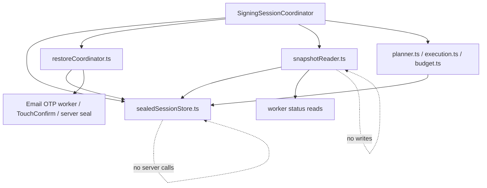

# Signing Session Restore Refactor Plan

Date created: 2026-04-27

## Objective

Eliminate reload, restore, and missing-lane regressions without adding another
large taxonomy of session services.

The target architecture keeps one public facade and three small internal modules
for this refactor:

```text
session/
  SigningSessionCoordinator.ts   public stateful facade, transaction boundary
  sealedSessionStore.ts          IndexedDB sealed records + runtime identity map
  restoreCoordinator.ts          explicit restore commands and leases
  snapshotReader.ts              side-effect-free status/snapshot composition
```

Keep existing `session/signingSession/planner.ts`, `execution.ts`, and
`budget.ts` where they are unless this refactor actively deletes a duplicate
call path. Moving pure planner/execution/budget files just to match a target tree
adds churn without addressing the restore bug.

The final model should be easy to explain:

1. `SigningSessionCoordinator` is the only public object chain signing imports.
2. `sealedSessionStore.ts` owns durable sealed-record access and runtime identity
   indexing.
3. `restoreCoordinator.ts` owns unseal/rehydrate side effects.
4. `snapshotReader.ts` owns read-only session snapshots.

## Problem Statement

The recent Email OTP reload issue exposed an ownership boundary bug:

1. Durable restore material lived in IndexedDB `signing_session_seals_v1`.
2. The ECDSA reload path treated volatile warm-session/session-record state as
   the entrypoint for finding durable restore material.
3. Generic status/readiness paths performed sealed-refresh restore as a read-side
   side effect.
4. `getWalletSession()` polling could repeatedly unseal, bootstrap, probe the
   wrong curve, or fail to publish a selected ECDSA signing lane.
5. Optional lane identity fields let planning proceed until later boundaries
   failed with "missing selected signing lane" errors.

The fix is not a bigger resolver. The fix is a smaller boundary:

```text
restore is a command
snapshot/status is a read
```

## Core Invariant

```text
Durable sealed session state is the source of truth for reload restore.
Read/status APIs must never perform restore side effects.
```

Corollaries:

1. `getWalletSession`, `getSnapshot`, status readers, capability readers, budget
   readers, and lane resolvers are query APIs.
2. Query APIs must not unseal, bootstrap, mutate durable stores, call server seal
   endpoints, or create runtime signing sessions.
3. Reload restore must enumerate durable sealed records directly by account and
   purpose, then publish resolved runtime identity into the coordinator store.
4. Transaction signing must receive a fully resolved selected lane before
   challenge preparation, budget reservation, signing, or finalization.
5. Durable sealed records are deleted only by explicit lifecycle decisions. A
   failed lookup of volatile runtime state is not a deletion signal.
6. Transaction signing restore is exact-purpose. It must not account-wide unseal
   unrelated lanes as a side effect of signing.

## Sealed-Record Deletion Rules

Durable sealed records are the reload restore source of truth. They must not be
deleted just because volatile state is missing.

Allowed deletion reasons:

1. explicit logout, account cleanup, or user-requested revoke
2. authoritative expiry or exhaustion from the sealed record policy or a
   successful worker/server lifecycle result
3. successful cleanup after a single-use or revoked session
4. exact-purpose cryptographic mismatch, for example the record decrypts or
   authenticates under the requested purpose but its authenticated metadata is
   inconsistent
5. schema migration that intentionally invalidates an obsolete sealed-record
   version

Delete only after a mismatch is proven against authenticated sealed payload
metadata or a trusted lifecycle result. IndexedDB index fields are lookup hints,
not authority.

Fields that must be authenticated before they can justify destructive cleanup:

1. wallet id or account id
2. auth method
3. curve
4. ECDSA chain
5. wallet signing-session id
6. threshold session id
7. companion threshold session ids
8. signing root id and version
9. key version

If a field is present only as unauthenticated IndexedDB metadata, a mismatch may
return `deferred`, `not_restored`, or `retryable`, but it must not delete the
durable sealed record.

Not deletion reasons:

1. missing `sessionStorage` runtime marker
2. missing volatile worker memory
3. missing runtime session record
4. missing Ed25519 companion lane metadata for an ECDSA sealed record
5. purpose mismatch found while probing with a different curve, auth method, or
   chain
6. restore lease unavailable
7. transient worker, IndexedDB, or server error

Required behavior for non-deletion failures:

1. missing volatile state returns `deferred` or `not_restored`
2. missing companion metadata defers or restores the ECDSA record independently
   when the sealed ECDSA record has enough authenticated metadata
3. lease unavailable returns `deferred`
4. transient errors return `retryable`
5. purpose mismatch logs at most once per exact cache key and does not delete
   other-purpose records

## Simplified Target Architecture



### SigningSessionCoordinator

The coordinator is the only public facade:

```ts
class SigningSessionCoordinator {
  prepareSigning(input): Promise<PreparedSigningSession>;
  restorePersistedSessionForSigning(input): Promise<RestorePersistedSessionForSigningResult>;
  restorePersistedSessionsForAccount(input): Promise<AccountRestoreSummary>;
  getSnapshot(input): Promise<SigningSessionSnapshot>;
  sign(input): Promise<SigningResult>;
}
```

Rules:

1. Chain signing code imports the coordinator, not lower-level restore/status
   modules.
2. The coordinator may call restore commands explicitly.
3. The coordinator may call snapshot reads explicitly.
4. The coordinator must not hide restore inside snapshot/status reads.
5. Public transaction entrypoints use `prepareSigning` or `sign`, which run the
   explicit restore step before lane selection.
6. Lane selection is an internal pure helper:
   `resolveLaneFromSnapshot(snapshot, request)`.
7. `prepareSigning` is the only transaction path that may call restore, and it
   may call only `restorePersistedSessionForSigning`, never the account-wide
   restore command.
8. `prepareSigning` returns the exact resolved identity and snapshot generation
   that budget, challenge preparation, signing, and finalization must reuse.

Do not expose a public `resolveLane(account)` API that callers can invoke before
restore. That preserves the stale-read bug under a cleaner name.

`restorePersistedSessionForSigning` is exact-purpose and is used by transaction
signing, key export, and session-status command paths that need a single lane.
Its input includes:

```ts
type RestorePersistedSessionForSigningInput = {
  walletId: string;
  authMethod: 'email_otp' | 'passkey';
  curve: 'ed25519' | 'ecdsa';
  chain: 'near' | 'tempo' | 'evm';
  reason: 'transaction' | 'export' | 'session_status';
};
```

Account-wide restore is separate and bounded. Use
`restorePersistedSessionsForAccount` only for startup/session initialization
flows that intentionally restore all eligible lanes for an account.

```ts
type RestorePersistedSessionsForAccountInput = {
  walletId: string;
  authMethod?: 'email_otp' | 'passkey';
  maxRecords?: number;
};
```

### sealedSessionStore.ts

Owns storage and in-memory identity indexing:

1. list/read/write/delete durable sealed records
2. hold the runtime identity map for restored and active sessions
3. expose purpose-exact sealed-record APIs
4. expose read-only identity queries
5. never call workers, server seal endpoints, or unseal code

Runtime identity is not the secret material. Worker memory remains the source of
truth for loaded PRF/signing material.

### restoreCoordinator.ts

Owns explicit restore commands:

1. enumerate durable sealed records by account and purpose
2. acquire restore leases
3. call Email OTP or passkey unseal/rehydrate paths
4. publish restored identity into `sealedSessionStore.ts`
5. cache successful and known-missing restore attempts
6. update/delete sealed records only as part of explicit command-side lifecycle

Only exact-purpose durable-record absence is cacheable as known-missing.
Transient errors, lease contention, missing volatile state, missing companion
metadata, worker failures, and server failures must not enter the known-missing
cache.

### snapshotReader.ts

Owns read-only snapshots:

1. read runtime identity from `sealedSessionStore.ts`
2. ask Email OTP worker or TouchConfirm worker for current status
3. compose account, curve, chain, budget, and readiness snapshots
4. never unseal
5. never call server seal endpoints
6. never write durable sealed records

Snapshot lane states:

1. `ready`: resolved identity exists and worker material is currently loaded and
   usable
2. `restorable`: durable sealed record exists for the exact purpose, but worker
   material is not loaded
3. `deferred`: restore may be possible, but the restore command is blocked by a
   lease, transient error, or missing non-authoritative companion state
4. `expired`: trusted worker/server status, or authenticated sealed payload
   metadata, says the durable/session material is expired
5. `exhausted`: trusted worker/server status, or authenticated sealed payload
   metadata, says no signing uses remain
6. `missing`: no runtime identity and no exact-purpose durable sealed record

`restorable` is derived from durable sealed-record presence without unsealing.
This prevents snapshot readers from either hiding restorable sessions as missing
or being tempted to restore during reads.

Raw IndexedDB index fields are not authoritative policy. When snapshot readers
only have unauthenticated durable metadata, they should report `restorable` with
a `policyHint` such as `{ expiresAtMs, remainingUses }`, not terminal
`expired` or `exhausted`. Terminal states require trusted worker/server status
or authenticated sealed payload metadata.

## Identity Model

Use type-state instead of making every intermediate object fully resolved.

```ts
type SigningSessionRequestIdentity = {
  walletId: string;
  authMethod?: 'email_otp' | 'passkey';
  curve?: 'ed25519' | 'ecdsa';
  chain?: 'near' | 'tempo' | 'evm';
};

type SelectedSigningLaneIdentity = {
  walletId: string;
  authMethod: 'email_otp' | 'passkey';
  curve: 'ed25519' | 'ecdsa';
  chain: 'near' | 'tempo' | 'evm';
  walletSigningSessionId: string;
};

type ResolvedSigningSessionIdentity =
  | {
      walletId: string;
      authMethod: 'email_otp' | 'passkey';
      curve: 'ed25519';
      chain: 'near';
      walletSigningSessionId: string;
      thresholdSessionId: string;
    }
  | {
      walletId: string;
      authMethod: 'email_otp' | 'passkey';
      curve: 'ecdsa';
      chain: 'tempo' | 'evm';
      walletSigningSessionId: string;
      thresholdSessionId: string;
    };
```

```ts
type PreparedSigningSession = {
  identity: ResolvedSigningSessionIdentity;
  snapshotGeneration: string;
  snapshot: SigningSessionSnapshot;
};
```

The prepared session is the handoff object for the rest of a transaction. Budget
reservation, challenge preparation, signing, post-sign policy, and finalization
reuse this identity instead of rediscovering lane state mid-flow.

Rules:

1. Optional fields are allowed only in request/input identity.
2. Selected identity requires wallet signing-session identity.
3. Resolved identity requires wallet signing-session id and threshold session id.
4. ECDSA resolved identity always includes chain.
5. Signing, budget, post-sign cleanup, and finalization require resolved
   identity.
6. No code may synthesize `walletSigningSessionId` from `thresholdSessionId`.

## Review Hardening Checklist

This plan is implementation-ready only if these constraints stay true during
the refactor:

1. Phase order must not create a broken intermediate state. Add explicit restore
   commands first, move policy writes to command boundaries next, add snapshots
   with `restorable`/`deferred` states, then remove read-side restore and writes.
2. Transaction signing restore must be exact-purpose. Use
   `restorePersistedSessionForSigning` with wallet id, auth method, curve,
   chain, and reason. Account-wide restore is only for intentionally bounded
   startup/session initialization.
3. Snapshots must represent durable sealed material that is present but not
   loaded. That state is `restorable`, not `missing`, and it is derived without
   unsealing.
4. Known-missing cache entries are allowed only for exact-purpose durable-record
   absence. Transient failures, lease contention, missing volatile state, and
   missing companion metadata remain retryable or deferred.
5. Destructive cleanup based on metadata mismatch is allowed only when the
   mismatch is proven against authenticated sealed payload metadata or a trusted
   lifecycle result. Plain IndexedDB index fields are lookup hints, not deletion
   authority.
6. `prepareSigning` is the transaction command boundary. It runs restore once,
   reads one snapshot, resolves one lane, and returns a `PreparedSigningSession`
   whose identity and snapshot generation are reused through the full signing
   lifecycle.

## Command/Query Rule

Allowed to mutate:

```ts
coordinator.restorePersistedSessionsForAccount(...)
coordinator.restorePersistedSessionForSigning(...)
coordinator.registerSigningSession(...)
coordinator.recordSessionMaterialClaimed(...)
coordinator.recordSessionUseConsumed(...)
coordinator.cleanupSigningSession(...)
```

Read-only:

```ts
coordinator.getSnapshot(...)
snapshotReader.readSnapshot(...)
resolveLaneFromSnapshot(...)
```

Temporary compatibility shims may exist during migration, but they must be named
as shims and deleted in the cleanup phase.

## Phased Todo List

### Phase 0: Freeze Current Good Behavior

Goal: protect the known-good fixes before moving architecture.

1. [x] Add or keep regression coverage for OTP reload then Ed25519 signing.
2. [x] Add or keep regression coverage for OTP reload then Tempo ECDSA signing.
3. [x] Add or keep regression coverage for OTP reload then ARC/EVM ECDSA
       signing.
4. [x] Add or keep regression coverage for passkey reload session persistence.
5. [x] Add a regression test that repeated wallet-session polling does not
       repeatedly call sealed rehydrate / `remove-server-seal` after a
       successful restore.
6. [x] Add a regression test that a known-missing or purpose-mismatched sealed
       record does not retry on every poll.
7. [x] Add a direct regression test that ECDSA sealed restore with a missing
       Ed25519 companion does not delete the ECDSA sealed record.
8. [x] Add a direct regression test that a missing `sessionStorage` runtime
       marker does not erase IndexedDB sealed material when refresh persistence
       is expected.
9. [x] Keep these tests stable before starting the structural move.

Acceptance checks:

1. [x] The current OTP reload to ECDSA signing fix is protected.
2. [x] The current unseal-spam fix is protected.
3. [x] The current passkey persistence behavior is protected by
   TouchConfirm explicit restore, single-flight, and lifecycle cleanup tests.
4. [x] The two known clobber regressions are protected directly.

### Phase 1: Name The Boundary In Current Docs

Goal: make the desired architecture visible before moving code.

1. [x] Link this plan from `docs/signing-session-architecture.md`.
2. [x] Add the invariant "sealed-refresh restore is a write-side operation, not
       a read-side side effect" to the current architecture doc.
3. [x] Add static guard TODOs to
       `docs/signing-session-coordinator-tests.md`:
   - status/snapshot modules cannot call restore
   - planner cannot import sealed-store modules
   - execution cannot resolve lanes ad hoc
   - query APIs cannot call server seal endpoints
4. [x] Inventory current read APIs that can trigger sealed restore:
       the previous `WarmSessionCapabilityResolver.getWarmSession()` path,
       the old `EmailOtpThresholdSessionCoordinator.getWarmSessionStatus()`,
       TouchConfirm warm-session status/claim/consume reads, and any helper
       wrappers.
5. [x] Inventory current generic sealed-store lookup APIs.

Current inventory:

1. `SigningEngine.getWarmThresholdEcdsaSessionStatus(...)` is now a
   side-effect-free runtime status read. It does not restore durable sealed
   records.
2. `SigningEngine.listWarmThresholdEcdsaSessionStatuses(...)` is now a
   side-effect-free runtime status read. It does not restore durable sealed
   records.
3. EVM-family transaction signing receives
   `restorePersistedSessionForSigning` through orchestration deps and invokes
   exact-purpose restore before signing.
4. `EmailOtpThresholdSessionCoordinator.readWarmSessionStatusOnly(...)` is the
   side-effect-free worker-status read. Restore remains on explicit signing,
   claim, and consume command paths.
5. `EmailOtpThresholdSessionCoordinator.restorePersistedSessionsForAccount(...)`
   remains the bounded account-scoped maintenance command; status/listing reads
   no longer call it.
6. `readExactSealedSession(...)` is purpose-filtered but still starts
   from a threshold-session-id lookup through private
   `readRecordByThresholdSessionId(...)`.
7. `deleteExactSealedSession(...)` also starts from threshold-session-id
   lookup through private `readRecordByThresholdSessionId(...)`; destructive
   cleanup must remain exact-purpose and lifecycle-driven.

Acceptance checks:

1. [x] The specs describe restore ownership in one place.
2. [x] The test plan has explicit drift-prevention guards.
3. [x] There is a concrete inventory of paths to refactor.

### Phase 2: Introduce Minimal Shared Identity Types

Goal: reduce optional-field ambiguity without breaking pre-auth flows.

1. [x] Add the new identity types to the existing session type module unless a
       new file removes real duplication.
2. [x] Define `SigningSessionRequestIdentity`.
3. [x] Define `SelectedSigningLaneIdentity`.
4. [x] Define `ResolvedSigningSessionIdentity`.
5. [x] Define curve-specific aliases:
       `ResolvedEd25519SigningSessionIdentity` and
       `ResolvedEcdsaSigningSessionIdentity`.
6. [x] Convert EVM-family resolved-lane helpers to return
       `ResolvedEcdsaSigningSessionIdentity`.
7. [x] Convert NEAR Ed25519 resolved-lane helpers to return
       `ResolvedEd25519SigningSessionIdentity`.
8. [x] Replace Email OTP signing-session auth lane shapes with discriminated
       required types.
9. [x] Keep optional fields only on request/pre-resolution inputs.
   - [x] Split NEAR transaction session-id resolution from ad-hoc delegate /
         NEP-413 session-id creation so the transaction path requires a
         `NearEd25519PreparedIdentity` instead of accepting optional identity.
   - [x] Tightened the shared signing-session budget finalizer so it accepts a
         `SelectedSigningLaneContext` and no longer accepts an optional
         `thresholdSessionId` override.
   - [x] Tightened `restorePersistedSessionForSigning(...)` to a
         curve-specific input: Ed25519 restore can only target `chain: 'near'`,
         and ECDSA restore can only target `chain: 'tempo' | 'evm'`.

Acceptance checks:

1. [x] No resolved signing-session type has optional
       `walletSigningSessionId`, `thresholdSessionId`, `curve`, or ECDSA
       `chain`.
2. [x] Challenge preparation cannot start without resolved identity.
3. [x] Budget reservation/finalization cannot start without resolved identity.

### Phase 3: Introduce sealedSessionStore.ts

Goal: create one local source for durable sealed records and runtime identity.

1. [x] Create `session/sealedSessionStore.ts`.
2. [x] Move durable sealed-record wrappers into `sealedSessionStore.ts` behind
       purpose-exact APIs.
3. [x] Add runtime identity map operations:
       `publishResolvedIdentity`, `readResolvedIdentity`,
       `listResolvedIdentitiesForAccount`, and `deleteResolvedIdentity`.
4. [x] Store runtime identity by exact purpose:
       wallet id, auth method, curve, chain, wallet signing-session id, and
       threshold session id.
5. [x] Keep worker PRF/signing material out of `sealedSessionStore.ts`.
6. [x] Keep budget accounting out of `sealedSessionStore.ts`.
7. [x] Keep server seal clients and worker clients out of
       `sealedSessionStore.ts`.
8. [x] Implement the sealed-record deletion rules from this plan.
   - [x] Email OTP restore no longer deletes durable sealed records from raw
         IndexedDB policy hints or unauthenticated store metadata mismatch.

Acceptance checks:

1. [x] `sealedSessionStore.ts` contains no server calls and no worker calls.
2. [x] Runtime identity has one local owner.
   - [x] `sealedSessionStore.ts` publishes and deletes resolved runtime
         identities for every lane represented by a durable sealed record,
         including Ed25519 companion identities on ECDSA seals.
3. [x] Status reads can read identity without reconstructing it from scattered
       session records.
   - [x] Email OTP snapshots now read runtime identity from
         `sealedSessionStore.ts` instead of falling back to volatile
         threshold-session record lookups.

### Phase 4: Restrict Sealed-Record APIs

Goal: make wrong-purpose sealed-record lookup structurally hard.

1. [x] Add purpose-exact sealed-record APIs:
       `listExactSealedSessionsForAccount`,
       `readExactSealedSession`, `writeExactSealedSession`,
       and `deleteExactSealedSession`.
   - [x] Add restore-specific
         `listExactSealedSessionsForAccount({ walletId, authMethod, curve, chain })`
         that enumerates durable IndexedDB records without requiring the
         volatile `sessionStorage` runtime marker.
   - [x] Renamed the old generic public sealed-record helpers so production
         call sites cannot accidentally import a non-purpose-explicit API.
2. [x] Require `authMethod` and `curve` on every sealed-record read/write/delete.
3. [x] Require `chain` for every ECDSA sealed-record read/write/delete.
4. [x] Include ECDSA `chain` in store keys, restore leases, and single-flight
       keys.
5. [x] Replace production uses of generic `readRecordByThresholdSessionId`.
6. [x] Keep generic threshold-session lookup private to tests or
       development-only diagnostics.
7. [x] Delete old generic production helpers once call sites are migrated.
8. [x] Ensure missing runtime/sessionStorage markers return a non-deleting
       result.
   - [x] Restore-specific durable listing must not hide exact-purpose records
         just because the volatile runtime marker is absent. Marker absence may
         make restore return `deferred` or `not_restored`, but not `missing`.
9. [x] Ensure missing companion lane metadata returns `deferred` or independent
       ECDSA restore, not delete.
   - [x] Missing Ed25519 companion no longer deletes the ECDSA sealed record;
         keep the regression test and remove this from the active bug list.

Acceptance checks:

1. [x] Production restore code cannot read sealed records without purpose.
2. [x] Purpose mismatch is rejected before unseal.
3. [x] Wrong-curve or wrong-chain threshold session collisions cannot trigger
       restore probes.

### Phase 5: Introduce restoreCoordinator.ts

Goal: make sealed-refresh restore a command with idempotency and single-flight
semantics.

1. [x] Create `session/restoreCoordinator.ts`.
2. [x] Move Email OTP sealed-refresh restore logic into
       `restoreCoordinator.ts`.
   - [x] `restoreCoordinator.ts` owns the command protocol and exact-purpose
         enumeration; Email OTP cryptographic restore remains inside the Email
         OTP coordinator as the implementation owner.
3. [x] Move passkey sealed-refresh restore logic into `restoreCoordinator.ts`.
   - [x] `restoreCoordinator.ts` owns account/signing restore commands for
         passkey lanes; TouchConfirm remains the worker/material owner.
4. [x] Add exact-purpose
       `restorePersistedSessionForSigning({ walletId, authMethod, curve, chain, reason })`.
5. [x] Add bounded account startup
       `restorePersistedSessionsForAccount({ walletId, authMethod, maxRecords })`.
6. [x] Make restore enumerate durable sealed records directly from
       `sealedSessionStore.ts` through
       `listExactSealedSessionsForAccount({ walletId, authMethod, curve, chain })`.
7. [x] Filter sealed records by exact purpose before any unseal:
       wallet id, auth method, curve, chain, wallet signing-session id, and
       threshold session id.
8. [x] Use a single-flight key containing:
       `walletId`, `authMethod`, `curve`, `chain`,
       `walletSigningSessionId`, and `thresholdSessionId`.
9. [x] Cache successful restores and exact-purpose durable-record absence so
       polling cannot repeatedly call `remove-server-seal`.
10. [x] Do not cache transient IndexedDB errors, worker/server failures, lease
        contention, missing volatile state, or missing companion metadata as
        known-missing.
11. [x] Invalidate known-missing caches whenever a matching sealed record is
        written, deleted, or has a newer `updatedAtMs` than the cache entry.
    - [x] Email OTP command-side register, cleanup, and policy update paths
          clear restore caches.
    - [x] Passkey restore does not maintain a known-missing cache; passkey
          sealed-record writes, deletes, and policy updates therefore cannot be
          hidden by stale negative restore state.
    - [x] Passkey explicit restore currently does not keep a known-missing
          cache, so newly written passkey sealed records cannot be suppressed by
          stale known-missing entries.
    - [x] Keep known-missing cache entries only for exact-purpose durable-record
          absence.
12. [x] Key restore caches by exact purpose:
        `walletId`, `authMethod`, `curve`, `chain`,
        `walletSigningSessionId`, `thresholdSessionId`, and sealed-record
        `updatedAtMs`.
13. [x] Publish restored identity into `sealedSessionStore.ts`.
14. [x] Delete remaining read-side restore/write behavior after Phase 6 command
        writes were wired and Phase 7 snapshot tests passed.
    - [x] Add a guard/test that wallet-session polling cannot call unseal or
          `remove-server-seal`.
    - [x] Delete the temporary ECDSA status-read restore shim once transaction
          signing had an explicit restore boundary.

In-place progress before `restoreCoordinator.ts` extraction:

1. [x] Added an Email OTP `restorePersistedSessionForSigning(...)` bridge that
       accepts exact wallet id, auth method, curve, chain, and reason.
2. [x] Wired EVM-family transaction signing to prefer
       `restorePersistedSessionForSigning(...)` before lane selection instead
       of the broad account-scoped restore.
3. [x] Removed the temporary account-scoped restore fallback from the EVM-family
       transaction path.
4. [x] Move this bridge into `restoreCoordinator.ts`.
5. [x] Added restore cache semantics for exact-purpose durable-record absence
       and successful record restores. Deferred restores and transient list
       failures remain retryable.
6. [x] Added bounded
       `restorePersistedSessionsForAccount({ walletId, authMethod, maxRecords })`
       and renamed the Email OTP account-scoped bridge away from warm-session
       language.
7. [x] Included auth method, curve, chain, wallet signing-session id, and
       threshold session id in the ECDSA restore single-flight key.
8. [x] Added a restore-specific exact-purpose durable sealed-record lister and
       wired Email OTP signing/account restore plus snapshots through it, so
       `sessionStorage` marker absence no longer hides durable records.
9. [x] Routed passkey signing claims through
       `restorePersistedSessionForSigning(...)` before worker material is
       claimed, so passkey reload restore is command-side rather than hidden in
       status polling.
10. [x] Removed TouchConfirm status-read rehydrate behavior. Passkey status
        reads now only ask the worker for current runtime status.

Acceptance checks:

1. [x] Page reload restore happens through
       `restorePersistedSessionForSigning` for transaction signing and bounded
       account restore for startup flows.
2. [x] `getWalletSession()` can explicitly call restore once at initialization,
       then read a side-effect-free snapshot.
3. [x] Polling cannot repeatedly unseal the same session.
4. [x] Ed25519 status reads cannot probe ECDSA sealed records.
5. [x] ECDSA status reads cannot probe Ed25519 sealed records except through an
       explicitly named companion lookup owned by `restoreCoordinator.ts`.
6. [x] Newly written sealed records are not suppressed by stale known-missing
       cache entries.

### Phase 6: Move Persistence Policy Writes Out Of Reads

Goal: avoid breaking persistence while making reads side-effect-free.

Previous reads also performed useful writes:

1. passkey status reads can persist sealed records
2. passkey status/claim/consume reads can update or delete sealed policy
3. Email OTP status reads can update or delete sealed policy

These writes must move to explicit command boundaries before read-side restore is
removed.

Todo:

1. [x] Add `registerSigningSession`, `recordSessionMaterialClaimed`,
       `recordSessionUseConsumed`, and `cleanupSigningSession` commands across
       all auth-method restore paths.
   - [x] Added Email OTP command-named boundaries:
         `registerSigningSession`, `recordSessionMaterialClaimed`,
         `recordSessionUseConsumed`, `recordSessionMaterialRestored`, and
         `cleanupSigningSession`.
   - [x] Added matching passkey / TouchConfirm command-named boundaries for
         registration, claim, consume, restore, status observation, and cleanup.
2. [x] Move sealed-record write/update/delete from status reads into those
       commands.
   - [x] Routed Email OTP claim/consume/status-observed/restored policy updates
         through command-named methods.
   - [x] Routed passkey / TouchConfirm claim/consume/restored policy updates
         through command-named methods.
3. [x] Ensure restore success updates sealed policy through a command.
   - [x] Email OTP restore success now records policy through
         `recordSessionMaterialRestored`.
   - [x] Passkey / TouchConfirm restore success now records policy through
         `recordSessionMaterialRestored`.
4. [x] Ensure expired/exhausted cleanup is explicit and idempotent.
   - [x] Email OTP expired/exhausted cleanup now routes through
         `cleanupSigningSession`.
   - [x] Passkey / TouchConfirm expired/exhausted cleanup now routes through
         `cleanupSigningSession`.
5. [x] Ensure missing durable record is not treated as expired/exhausted.
   - [x] Email OTP generic restore failure no longer deletes durable sealed
         records; only explicit cleanup paths can delete.
   - [x] Passkey / TouchConfirm status reads no longer treat durable-record
         absence or raw IndexedDB policy as a cleanup signal.
6. [x] Remove temporary write logic from status reads after command paths are
       wired and covered by tests.
7. [x] Add a static guard that Email OTP sealed persistence writes continue to
       use command-named boundaries instead of reintroducing generic policy
       helper calls.

Acceptance checks:

1. [x] Session persistence still works after reload for OTP and passkey.
   - [x] OTP reload then Ed25519/ECDSA persisted-session restore is covered by
         focused tests and manual verification.
   - [x] Passkey reload persistence is covered by explicit restore,
         single-flight, and lifecycle cleanup tests.
2. [x] Reads no longer write sealed records.
   - [x] Transitional read-side restore was removed after command paths were
         wired for Email OTP and passkey.
3. [x] Policy updates still happen after claim/consume/finalize.
   - [x] Email OTP claim/consume policy updates are routed through explicit
         command names.
   - [x] Passkey / TouchConfirm claim/consume policy updates are routed through
         explicit command names.

### Phase 7: Introduce snapshotReader.ts

Goal: replace capability/status split with one read-only snapshot builder.

1. [x] Create `session/snapshotReader.ts`.
2. [x] Add initial `readSigningSessionSnapshot({ walletId })`.
3. [x] Add snapshot generation/version output.
4. [x] Add lane states: `ready`, `restorable`, `deferred`, `expired`,
       `exhausted`, and `missing`.
5. [x] Derive `restorable` from exact-purpose durable sealed-record presence
       without unsealing.
6. [x] Move the remaining warm-session `getWarmSession()` read-model logic
       into `snapshotReader.ts`.
   - [x] Added optional runtime ECDSA record and claim overlay ports so
         `snapshotReader.ts` can represent `ready` runtime lanes without
         importing worker/status implementations.
   - [x] Added initial Ed25519/NEAR durable and runtime lane support so
         snapshots can represent NEAR signing-session identity from the same
         side-effect-free read model.
7. [x] Replace `EmailOtpThresholdSessionCoordinator.getWarmSessionStatus()` with
       a worker-status adapter used by `snapshotReader.ts`.
   - [x] Added `readWarmSessionStatusOnly(...)` for side-effect-free Email OTP
         worker status reads.
   - [x] Wired Email OTP persisted-session snapshots to overlay runtime ECDSA
         readiness through side-effect-free status reads.
8. [x] Convert TouchConfirm status reads into worker-status adapters used by
       `snapshotReader.ts`.
   - [x] Added TouchConfirm `readWarmSessionStatusOnly(...)` and
         `readWarmSessionStatusesOnly(...)` adapters that do not restore,
         persist, or delete sealed records.
   - [x] Wire passkey runtime records and claims into `snapshotReader.ts`.
   - [x] SigningEngine status snapshots now overlay Email OTP and passkey ECDSA
         runtime records through side-effect-free worker-status adapters.
   - [x] Wallet-session status polling now uses a status-only TouchConfirm view
         for passkey lanes, so polling cannot rehydrate sealed material or call
         server seal removal through `getWarmSessionStatus(...)`.
9. [x] Remove restore, unseal, durable-store writes, and server seal calls from
       all status/snapshot reads only after Phase 6 command writes are wired.
10. [x] Rename public read APIs from "warm session" language to snapshot/status
        language where practical.
11. [x] Change snapshot durable-record policy handling so raw IndexedDB metadata
        produces `restorable` plus `policyHint`; only trusted worker/server
        status or authenticated sealed payload metadata can produce terminal
        `expired` or `exhausted`.

In-place progress before replacing status readers:

1. [x] Added a side-effect-free `session/snapshotReader.ts` with initial
       Email OTP ECDSA durable sealed-record lanes.
2. [x] Snapshot lanes report `restorable`, `expired`, `exhausted`, and
       `missing` without unsealing or server seal calls.
   - [x] Raw IndexedDB policy fields now become `policyHint` instead of
         authoritative terminal `expired` or `exhausted`.
3. [x] Wire `SigningEngine.getWarmThresholdEcdsaSessionStatus(...)` and
       `listWarmThresholdEcdsaSessionStatuses(...)` through side-effect-free
       runtime status reads.
4. [x] Remove status/listing restore entirely; transaction signing now owns
       exact-purpose `restorePersistedSessionForSigning(...)`.
5. [x] Replace the Email OTP-only status snapshot helper with a unified
       SigningEngine snapshot helper that reads exact-purpose sealed records and
       overlays both Email OTP and passkey runtime claims without unsealing.
6. [x] Remove the transitional ECDSA status-read restore call after transaction
       signing received an explicit restore boundary.
7. [x] Route SigningEngine wallet-session status readers through a
       status-only `SigningSessionCoordinator` so UI polling reads passkey and
       Email OTP runtime state without restore side effects.

Acceptance checks:

1. [x] Snapshot reads do not mutate stores.
2. [x] Snapshot reads do not unseal.
3. [x] Snapshot reads do not call server seal endpoints.
4. [x] Snapshot output has enough identity to resolve signing lanes without
       fallback source searches.
5. [x] Restorable durable sessions are not reported as missing.
6. [x] Unauthenticated IndexedDB policy metadata does not cause destructive
       cleanup or terminal snapshot states.

### Phase 8: Wire Signing Flows Through The Coordinator

Goal: make all transaction signing use the same explicit restore, snapshot, lane,
plan, execution, and budget path.

1. [x] Make ECDSA transaction signing call explicit restore before lane
       selection when reload restore is allowed.
2. [x] Replace public `resolveLane(account)` style reads with prepared
       transaction boundaries that run restore once, read a snapshot, then
       resolve the lane internally.
   - [x] EVM-family signing now creates a prepared ECDSA signing-session
         identity immediately after explicit restore and lane selection.
   - [x] Extracted the EVM-family restore + lane-selection boundary into
         `prepareEvmFamilyEcdsaSigningSession(...)`.
   - [x] Moved `prepareEvmFamilyEcdsaSigningSession(...)` into a dedicated
         EVM-family helper module so the transaction flow consumes a prepared
         identity instead of owning restore and lane selection inline.
3. [x] Make prepared signing return a `PreparedSigningSession`-style object
       containing the exact resolved identity plus snapshot generation.
   - [x] EVM-family signing now carries a `PreparedEvmFamilyEcdsaSigningSession`
         with exact auth method, source, lane, record, keyRef, and reauth record.
   - [x] EVM-family prepared signing now reads a signing-session snapshot after
         explicit restore and carries `snapshotGeneration` alongside the
         resolved identity.
   - [x] Removed the EVM fallback that could synthesize a prepared ECDSA
         signing session with `snapshotGeneration: 0`; ECDSA signing now
         fails closed if the prepared boundary was not established.
4. [x] Require budget reservation, challenge preparation, signing,
       finalization, and cleanup to reuse the prepared identity.
   - [x] EVM-family auth planning, budget finalization, and post-sign cleanup
         now read resolved lane identity from the prepared ECDSA session object.
   - [x] EVM-family budget reservation/finalization, failed-spend recording,
         post-sign policy, nonce context, and executor handoff now prefer
         record/keyRef/source from the prepared ECDSA session instead of
         rediscovering identity from mutable locals.
   - [x] EVM-family reauth/keyRef refresh updates the prepared ECDSA session
         in place so later budget and cleanup observe the refreshed identity.
   - [x] Shared budget finalization now requires a selected lane context with
         wallet and threshold session ids, rather than a generic lane plus
         optional threshold-session override.
   - [x] Restore-for-signing inputs are now purpose-exact by type, so budget,
         challenge, signing, and cleanup cannot share a restore result created
         for the wrong curve/chain pair.
   - [x] ECDSA threshold-session readiness now takes the prepared resolved lane
         as its authority and passes that wallet/threshold-session identity to
         reconnect, instead of accepting optional session-id overrides.
   - [x] EVM-family budget reservation, success finalization, and failure
         recording now use the prepared resolved lane directly; they no longer
         accept record/keyRef overrides that could become a parallel identity
         source.
5. [x] Make NEAR Ed25519 signing use the same snapshot and resolved-lane helper
       path.
   - [x] Added a `PreparedNearEd25519TransactionSigningSession` boundary that
         groups NEAR transaction restore, warmup, auth planning, lane identity,
         Email OTP signing hook, and resolved session id before execution.
   - [x] Added Ed25519/NEAR snapshot lanes as the read-only substrate for
         moving NEAR lane resolution onto snapshot-derived identity.
   - [x] NEAR transaction prepared signing now reads the Ed25519 snapshot after
         restore and carries the snapshot generation with the prepared identity.
   - [x] NEAR transaction prepared signing now extracts a concrete Ed25519
         identity from the snapshot and fails closed if it disagrees with the
         runtime session record.
   - [x] NEAR transaction lane construction now uses the snapshot-derived
         Ed25519 identity for wallet signing-session and threshold-session ids;
         the runtime record only supplies lane metadata.
   - [x] NEAR transaction session-id resolution now requires the prepared
         Ed25519 identity and cannot fall back to source-less session-id
         discovery.
6. [x] Ensure Tempo, ARC/EVM, NEAR Ed25519, and export flows all receive
       resolved identity from the coordinator.
   - [x] Tempo and ARC/EVM signing no longer receive a direct Email OTP sealed
         ECDSA rehydrate dependency; their exposed restore boundary is the
         exact-purpose `restorePersistedSessionForSigning(...)` command.
   - [x] ECDSA key export now runs an exact-purpose Email OTP persisted-session
         restore with `reason: 'export'` before selecting ECDSA lane metadata.
   - [x] Tempo delegates to the shared EVM-family signing implementation,
         ARC/EVM calls `prepareEvmFamilyEcdsaSigningSession(...)`, NEAR calls
         `prepareNearEd25519TransactionSigningSession(...)`, and export runs
         exact-purpose restore before metadata selection.
7. [x] Ensure budget reservation and finalization receive resolved identity,
       never raw optional ids.
8. [x] Ensure post-sign cleanup receives resolved identity.
9. [x] Remove signer-specific fallback helpers after each flow is migrated.
   - [x] EVM-family selection no longer falls back from selected-lane reads to
         candidate records/keyRefs after lane resolution. Candidate material is
         either validated against the resolved lane or ignored.
   - [x] Email OTP ECDSA challenge preparation now recovers reauth material
         only through the resolved lane, so exhausted single-use sessions can
         prompt OTP without reintroducing partial-identity lookup.

Acceptance checks:

1. [x] There is one lane-resolution path for transaction signing flows.
2. [x] No signer-specific path bypasses the coordinator.
3. [x] Budget finalization never discovers missing lane identity.

### Phase 9: Add Static Guards

Goal: prevent architectural drift.

1. [x] Add guard that `snapshotReader.ts` cannot import
       `restoreCoordinator.ts`.
2. [x] Add guard that `sealedSessionStore.ts` cannot import workers, server seal
       clients, or restore helpers.
3. [x] Add guard that `planner.ts` cannot import sealed-store, worker, OTP,
       passkey, budget state, coordinator, or provisioner modules.
4. [x] Add guard that transaction flows cannot call generic source-less ECDSA
       lookup helpers.
5. [x] Add guard that production code cannot synthesize wallet signing-session
       ids from threshold session ids.
6. [x] Add guard that resolved identity fields are required in exported signing
       lane types.
7. [x] Add guard that query APIs do not import server seal clients.
8. [x] Add guard that only `restoreCoordinator.ts` imports sealed-refresh unseal
       command clients.
9. [x] Add guard that public transaction callers use `prepareSigning` or `sign`,
       not direct lane resolution from account state.

Acceptance checks:

1. [x] A future PR that reintroduces read-side restore fails tests.
2. [x] A future PR that reintroduces optional resolved identity fails tests.
3. [x] A future PR that reintroduces generic restore lookup in production fails
       tests.

### Phase 10: Cleanup And Removal

Goal: remove legacy code so the old model cannot be reused accidentally.

1. [x] Delete old generic restore helper paths after migration.
   - [x] Removed the unused EVM orchestration dependency that allowed direct
         `rehydrateEmailOtpEcdsaSigningSessionFromSealedRecord(...)` access;
         EVM signing now exposes only `restorePersistedSessionForSigning(...)`
         for sealed restore.
   - [x] Removed the old public `rehydrateEmailOtpEcdsaSigningSessionFromSealedRecord(...)`
         helper entirely; sealed ECDSA material restore is now reachable through
         command-named restore APIs, with only a private implementation helper
         inside the Email OTP coordinator.
2. [x] Delete deprecated optional resolved-lane types.
   - [x] Tightened EVM-family ECDSA lane construction so a signing lane cannot
         be built without both wallet signing-session id and threshold-session
         id.
   - [x] Tightened the shared ECDSA signing-lane builder inputs so Tempo/EVM
         transaction lanes require a threshold-session id at construction time,
         not only at later budget/finalizer boundaries.
   - [x] Removed optional wallet/threshold-session id override parameters from
         the EVM-family ECDSA readiness boundary; passkey reconnect policy ids
         are validated against the prepared lane rather than becoming a second
         source of truth.
   - [x] Split refreshed ECDSA identity updates into an explicit helper instead
         of keeping optional override parameters on the generic resolved-lane
         validator.
3. [x] Delete fallback resolver chains that search by partial identity.
   - [x] Removed the EVM-family post-sign cleanup fallback chain that searched
         keyRef, record, selected lane, and current record; cleanup now uses the
         resolved prepared lane's threshold-session id directly.
   - [x] Removed the EVM-family budget fallback chain that searched keyRef and
         record before the prepared lane; budget accounting now uses the
         prepared lane identity directly.
   - [x] Removed EVM-family selection-time fallback chains in
         `ecdsaSelection.ts`; record/keyRef candidates must validate against
         the resolved lane, and `ecdsaLanes.ts` rejects mismatched
         record/keyRef identities before lane construction.
4. [x] Delete or fold the old warm-session capability resolver once
       `snapshotReader.ts` owns snapshots.
   - [x] Removed the `capabilityResolver.ts` file and renamed its remaining
         reader implementation to `capabilityReaderCore.ts` so the older
         resolver taxonomy is no longer importable.
5. [x] Delete or fold `EmailOtpThresholdSessionCoordinator.getWarmSessionStatus`
       once it is only a worker-status adapter.
   - [x] Replaced the old generic status method with
         `readWarmSessionStatusOnly(...)`, making the read-only boundary
         explicit at call sites.
6. [x] Move or delete `warmSigning/sealedRefreshRestorer.ts` once
       `restoreCoordinator.ts` owns sealed-refresh restore.
7. [x] Remove temporary debug logs or downgrade them to single-shot diagnostics.
8. [x] Update docs to point to the final architecture and mark this plan
       complete.

Acceptance checks:

1. [x] The codebase no longer contains duplicate helper paths for the same
       signing-session operation.
2. [x] File names make ownership obvious.
   - [x] Sealed persistence now lives in `session/sealedSessionStore.ts`.
   - [x] The old `capabilityResolver.ts` name has been removed.
3. [x] The old read-side restore model is not available as an importable API.

### Phase 11: Carry Restore Purpose Through Execution

Goal: close the remaining exact-purpose leaks found after the Ed25519 reload
regression. The restore command already enumerates durable sealed records by
purpose, but some execution ports still receive only the raw record and then
rediscover the curve from primary record metadata or volatile runtime state.

This phase exists to make the invariant mechanical:

```text
exact-purpose lookup -> exact-purpose restore work item -> exact-purpose execution
```

The requested restore purpose must never be dropped after durable enumeration.
`record.curve` is the primary sealed-record curve, not authority for every lane
contained in `thresholdSessionIds`.

Todo:

1. [x] Change restore execution ports to carry the requested purpose:
       `{ accountId, record, purpose }`, where purpose is one of:
       `{ authMethod, curve: 'ed25519', chain: 'near', thresholdSessionId,
       walletSigningSessionId, reason }` or `{ authMethod, curve: 'ecdsa',
       chain: 'tempo' | 'evm', thresholdSessionId, walletSigningSessionId,
       reason }`.
2. [x] Update `restorePersistedSessionForSigningCommand(...)` so it passes the
       normalized exact-purpose work item to `restoreSealedRecordForAccount`.
       Do not let the restore port infer curve, chain, threshold-session id, or
       wallet signing-session id from `record.curve`.
3. [x] Update `restorePersistedSessionsForAccountCommand(...)` to enumerate
       `{ record, purpose }` work items for every matching lane. A single sealed
       record with both `thresholdSessionIds.ecdsa` and
       `thresholdSessionIds.ed25519` must produce two independent work items
       when both purposes are requested.
4. [x] Deduplicate account-wide restore by exact purpose, not by bare
       `record.storeKey`. The dedupe key must include wallet id, auth method,
       curve, chain, wallet signing-session id, threshold-session id, and
       record version or `updatedAtMs`.
5. [x] Split Email OTP sealed restore execution by purpose:
       - [x] ECDSA restore may use `ecdsaRestore` metadata and
             `thresholdSessionIds.ecdsa`.
       - [x] Ed25519 restore must either restore from authenticated durable
             Ed25519 metadata or return `deferred`.
       - [x] Ed25519 restore must not route through the ECDSA restore helper
             merely because the sealed record is ECDSA-primary.
6. [x] Add durable Ed25519 restore metadata if same-device Ed25519 reload is
       expected without volatile sessionStorage records. At minimum, persist
       the Ed25519 relayer/session metadata needed to rehydrate and publish the
       Ed25519 lane from IndexedDB alone.
7. [x] Update NEAR Ed25519 transaction preparation so restore does not require
       `getStoredThresholdEd25519SessionRecordForAccount(...)` to already
       return an Email OTP record. Durable sealed records are the reload
       entrypoint; volatile records are only runtime overlays.
8. [x] Keep the post-restore identity assertion, but assert against the exact
       prepared purpose. If volatile runtime state is absent and durable
       Ed25519 metadata cannot restore it, fail as `deferred` or
       `missing_session` with a diagnostic that names the missing durable field.
9. [x] Add regression tests:
       - [x] `restorePersistedSessionForSigningCommand` passes Ed25519 purpose
             through to the restore port for an ECDSA-primary companion record.
       - [x] Account-wide restore emits separate ECDSA and Ed25519 work items
             for one multi-curve sealed record.
       - [x] NEAR Ed25519 reload restore does not require a volatile
             `ThresholdEd25519SessionRecord` before consulting durable sealed
             records.
       - [x] Ed25519 restore without durable Ed25519 metadata returns
             `deferred` and does not mark the restore cache as successful.
       - [x] ECDSA restore still works when the Ed25519 companion is missing.
10. [x] Add static guards:
       - [x] Restore coordinator ports cannot expose bare
             `restoreSealedRecordForAccount({ accountId, record })`.
       - [x] Account-wide restore cannot branch on `record.curve` to decide the
             requested purpose.
       - [x] NEAR Ed25519 transaction prepare must call exact-purpose restore
             before lane selection without gating restore on volatile runtime
             record presence.

Acceptance checks:

1. [x] Exact-purpose restore lookup and restore execution use the same identity.
2. [x] `record.curve` is never used to collapse companion lanes during
       account-wide restore.
3. [x] Ed25519 reload restore either restores from durable Ed25519 metadata or
       clearly defers; it does not accidentally depend on ECDSA restore side
       effects.
4. [ ] OTP refresh then NEAR Ed25519 signing, OTP refresh then ECDSA signing,
       and account startup restore all pass with no read-side restore or unseal
       spam.

### Phase 12: Server-Authoritative Budget Projection

Goal: make wallet signing-session `remainingUses` mechanically server-owned and
make every client-side value a typed projection, reservation, material state, or
hint. This addresses the remaining class of false exhaustion bugs where worker
memory, sessionStorage records, IndexedDB policy hints, or local reservations can
look like budget truth.

Problem this fixes:

1. Server budget, worker hot-material uses, sessionStorage records, IndexedDB
   policy hints, and in-memory reservations all carry `remainingUses`-like
   values today. When those values are loosely combined, a stale client-side
   value can look authoritative and make a usable signing session appear
   exhausted.
2. The server already owns the real wallet signing-session budget, but client
   code can still create false negatives by double-counting local reservations,
   failing to release zero-spend attempts, trusting worker material exhaustion as
   wallet budget exhaustion, or treating raw durable policy metadata as terminal.
3. Optional budget/status/consume ports make production paths hard to reason
   about. A missing adapter can silently skip a budget boundary, while another
   path later observes stale local state and fails with an exhaustion or
   missing-session error.
4. Budget finalizers can regress if they rediscover lanes from read-side state
   instead of spending against the exact prepared signing identity chosen after
   restore and snapshot.
5. A restored lane can have valid hot material but no initialized trusted budget
   projection. That state must not collapse into generic `missing_session` or
   `not_found`; it is a distinct `budget_unknown` initialization failure that
   prepare-signing must resolve before reservation.

What this phase does:

1. Creates a single client budget projection path. The projection is derived from
   trusted server status or consume responses plus temporary local reservations.
2. Keeps local reservation as a concurrency guard only. It can reduce displayed
   availability while an operation is in flight, but it cannot permanently mark a
   wallet signing-session exhausted.
3. Splits authority by type: server budget status is authority, worker status is
   hot-material availability, IndexedDB policy is a hint, and sessionStorage is a
   runtime overlay.
4. Requires production budget ports at the coordinator boundary so missing
   status/consume implementations fail loudly during integration instead of
   drifting at runtime.
5. Forces EVM and NEAR finalizers to consume using the prepared signing identity:
   wallet signing-session id, threshold-session ids, backing material ids,
   operation id, and operation fingerprint.
6. Adds tests and guards that prevent terminal budget states from being created
   from worker missing status, sessionStorage records, or raw IndexedDB policy
   hints.
7. Makes `prepareSigning(...)` the only transaction boundary that can combine
   restore, snapshot, trusted budget projection refresh, reservation, challenge
   preparation, signing, and finalization identity.
8. Treats "restored material but no trusted budget projection" as
   `budget_unknown`. The transaction path must either refresh the trusted budget
   projection before reservation or fail with that explicit diagnostic before
   threshold signing begins.
9. Initializes restored-lane budget state explicitly during restore/prepare.
   Restore/prepare must fetch trusted server budget status when budget authority
   is needed, or return `budget_unknown`; it must not collapse unknown budget
   state into generic `not_found`.

Core invariant:

```text
server budget status or server consume response -> terminal wallet budget state
client reservation -> temporary local availability adjustment
worker/material status -> hot material availability only
IndexedDB policy -> non-authoritative hint only
restored material without trusted budget projection -> budget_unknown, not missing
```

Definitions:

1. `TrustedWalletBudgetStatus`: status returned by a server status or consume
   boundary for a wallet signing-session. It may mark `active`, `expired`,
   `exhausted`, or `not_found`.
2. `BudgetProjection`: the client view derived from the last trusted server
   status plus local uncommitted reservations.
3. `BudgetReservation`: an operation-scoped hold keyed by operation id and
   operation fingerprint.
4. `MaterialStatus`: worker hot-material state for an exact backing session.
   It can make a lane `deferred`, `restorable`, or `material_exhausted`, but it
   cannot mark the wallet budget exhausted.
5. `PolicyHint`: durable sealed-record metadata such as `remainingUses` and
   `expiresAtMs`. It is useful for UI and ordering, but it cannot produce a
   terminal wallet budget state.
6. `BudgetUnknown`: a non-terminal state returned when a lane is restored or
   prepared but no trusted server budget status or consume response has been
   observed yet. It blocks terminal UI decisions and budget-consuming
   finalization until resolved.
7. `PreparedSigningSession`: the transaction-scoped object returned by
   `prepareSigning(...)`. It carries exact material identity, budget identity,
   snapshot generation, budget projection generation, operation id, and
   operation fingerprint. Reservation, challenge preparation, signing, and
   finalization must reuse this object instead of rediscovering state.
8. `BudgetIdentity`: the wallet signing-session id plus exact threshold-session
   ids, backing material ids, operation id, and operation fingerprint that the
   server budget status/consume boundary recognizes.

Todo:

1. [x] Add `session/signingSession/budgetProjection.ts` with a pure reducer.
       Suggested events:
       - [x] `server_status_observed`
       - [x] `reserve_requested`
       - [x] `reservation_released`
       - [x] `server_consume_confirmed`
       - [x] `zero_spend_recorded`
       - [x] `budget_unknown_observed`
       The reducer output must expose `effectiveRemainingUses` as
       `serverRemainingUses - localReservedUses` only when server status is
       trusted and active. `budget_unknown` is non-terminal and cannot be used
       as a reservation source.
2. [x] Add strict budget types that separate authority from hints:
       - [x] `TrustedWalletBudgetStatus`
       - [x] `WalletBudgetProjection`
       - [x] `WalletBudgetMaterialStatus`
       - [x] `WalletBudgetPolicyHint`
       - [x] `WalletBudgetUnknown`
       Terminal states must be representable only by
       `TrustedWalletBudgetStatus`.
3. [ ] Replace optional production budget ports with required adapters at the
       `SigningSessionCoordinator` construction boundary. Tests may inject
       explicit no-op adapters, but production paths must not silently continue
       without status or consume capability when a prepared signing lane has a
       wallet signing-session id.
       - [x] Production `SigningEngine` transaction paths provide a trusted
             server-backed wallet budget status adapter.
       - [ ] Constructor/API shape still needs tightening so missing production
             adapters fail at assembly time instead of falling back to material
             status.
4. [ ] Keep `reserve(...)` local and temporary:
       - [ ] key by operation id and operation fingerprint
       - [ ] queue by wallet signing-session id
       - [ ] subtract reservations from trusted active server status
       - [ ] never persist reservations
       - [ ] release on zero-spend, cancellation, nonce failure, or pre-consume
             signing failure
5. [ ] Make `recordSuccess(...)` the only client path that updates budget truth
       after signing. It must consume through the server-backed port or consume a
       worker result that is already known to have consumed server budget for the
       same operation. The returned trusted status replaces the projection.
6. [ ] Preserve idempotency across retries:
       - [ ] operation id reuse with the same fingerprint dedupes
       - [ ] operation id reuse with a different fingerprint throws
       - [ ] server consume uses the same operation-derived idempotency key
       - [ ] duplicate server consume responses do not double-decrement the
             projection
7. [x] Change readiness composition so wallet-budget terminal states come only
       from trusted server status. Worker `not_found`, worker `exhausted`,
       missing volatile records, and raw IndexedDB `remainingUses: 0` should
       produce material/restorable/deferred states unless there is trusted server
       budget exhaustion.
8. [ ] Treat sealed-record policy writes as projection sync only. Updating
       `remainingUses` in IndexedDB after a trusted consume is fine, but later
       reads of that field remain `policyHint` until authenticated payload
       metadata or server status confirms it.
9. [ ] Make prepared signing carry the budget identity. NEAR and EVM finalizers
       must consume the prepared lane's wallet signing-session id,
       threshold-session ids, backing material ids, operation id, and fingerprint
       without rediscovering lanes from read-side state.
10. [ ] Make prepared signing carry the budget projection version observed during
       restore/prepare. Reservation and finalization must use that version or
       deliberately refresh the projection before proceeding.
11. [ ] Initialize budget for restored lanes explicitly:
       - [x] after successful restore, fetch trusted server budget status for the
             restored wallet signing-session id before reporting terminal budget
             availability
       - [x] if status cannot be fetched, return `budget_unknown`
       - [x] do not translate missing local material, missing sessionStorage,
             stale IndexedDB hints, or absent projection into `not_found`
       - [x] do not let `budget_unknown` mask material `exhausted`/`expired`;
             those states must still drive OTP/passkey step-up auth
       - [ ] require reservation/finalization to resolve `budget_unknown` before
             spending
12. [ ] Treat local `remainingUses` as display/policy hint only:
       - [x] worker `remainingUses` is material availability, not wallet budget
             authority
       - [ ] sessionStorage and IndexedDB `remainingUses` are hints only
       - [ ] no terminal `exhausted` or `not_found` is allowed without trusted
             server status or a trusted consume response
13. [ ] Add static guards:
       - [ ] `snapshotReader.ts` cannot import budget mutation helpers
       - [ ] budget projection code cannot import workers, sealed restore, or
             chain signing modules
       - [ ] transaction code cannot call budget consume without a prepared
             signing identity
       - [ ] transaction code cannot call budget reservation after
             `prepareSigning(...)` with only account id or loose lane filters
       - [ ] no production path may set wallet budget `exhausted` from
             `policyHint`, sessionStorage records, or worker missing status
14. [ ] Add regression tests:
      - [x] reducer handles reserve/release/consume idempotently
       - [ ] two concurrent operations cannot both reserve the last use
       - [ ] failed-before-consume releases the reservation and does not mark
             the wallet budget exhausted
       - [ ] failed-after-threshold-signature records success because the server
             budget was already consumed
       - [ ] stale IndexedDB `remainingUses: 0` with trusted server active status
             does not block signing
       - [ ] worker material missing with durable restorable state does not mark
             wallet budget exhausted
       - [ ] duplicate operation id with a different fingerprint throws before
             reservation or consume
       - [ ] EVM and NEAR finalizers spend from the prepared identity, not from
             rediscovered lane records
       - [x] passkey unlock, page refresh, then first NEAR sign with
             `remainingUses = 1` restores the lane, preserves active runtime
             identity after durable-seal exhaustion, and signs without false
             local exhaustion
       - [ ] passkey unlock, page refresh, then first Tempo/ARC sign with
             `remainingUses = 1` restores the lane, resolves budget from trusted
             status or consume, and signs without false exhaustion
       - [x] Email OTP unlock, page refresh, then first NEAR and Tempo sign
             reports active status from snapshot plus trusted budget projection
      - [x] restored lane with unavailable budget status reports
             `budget_unknown`, not `missing_session`, `not_found`, or synthetic
             wallet-budget exhaustion

Implementation instructions:

1. Start with the pure reducer and tests. Do not change signing flows until the
   reducer proves the intended state transitions.
2. Add typed adapter boundaries around current server-backed status and consume
   calls. If the server store cannot return a monotonic version yet, model the
   consume response as the freshest trusted snapshot and leave `version`
   optional.
3. Add the restored-lane budget initialization path before changing planners:
   restore/prepare should either attach trusted budget status and projection
   version to the prepared identity, or return `budget_unknown`.
4. Refactor `SigningSessionCoordinator` budget state to store projections and
   reservations through the reducer. Remove replaced mutable bookkeeping as soon
   as the reducer owns it.
5. Update readiness and snapshot composition so material availability and wallet
   budget availability are separate fields until a planner deliberately combines
   them.
6. Wire EVM and NEAR transaction finalizers to spend only the prepared signing
   identity and prepared budget projection version. Delete fallback lookup chains
   as each finalizer moves.
7. Sync sealed-record policy only after trusted server/worker consume results.
   Never use a later raw IndexedDB policy read as terminal authority.
8. Add static guards before deleting old code, then delete old optional/fallback
   paths in the same PR. Do not leave duplicate budget paths behind a flag.
9. Run the focused budget, restore, EVM, and NEAR signing tests before browser
   smoke testing reload flows.

Acceptance checks:

1. [ ] Only trusted server status or consume responses can mark a wallet signing
       session `expired`, `exhausted`, or `not_found`.
2. [ ] Client reservations affect only local availability and are always
       releasable before consume.
3. [ ] Worker/sessionStorage/IndexedDB state cannot permanently exhaust a wallet
       budget.
4. [ ] EVM and NEAR budget finalization use prepared signing identity only.
5. [ ] Operation idempotency prevents double spend without causing false
       exhaustion on retries.
6. [ ] There is one budget projection path in production code and no optional
       fallback budget consumers.
7. [x] Restored lanes without trusted budget status report `budget_unknown`, not
       `missing_session`, `not_found`, `expired`, `exhausted`, or synthetic
       wallet-budget exhaustion.
8. [ ] `prepareSigning` carries both material identity and budget projection
       version into reservation and finalization.
9. [x] Passkey unlock, refresh, first NEAR sign with `remainingUses = 1` succeeds
       or fails for a trusted server reason, never for local false exhaustion.
10. [ ] Passkey unlock, refresh, first Tempo/ARC sign with `remainingUses = 1`
        succeeds or fails for a trusted server reason, never for local false
        exhaustion.
11. [x] Email OTP unlock, refresh, first NEAR and Tempo sign compose UI status
        from snapshot plus trusted budget projection.

### Phase 13: Remove sessionStorage Session Identity

Goal: remove signing-session restore dependency on `sessionStorage` and
consolidate durable lane/session identity into IndexedDB. `sessionStorage` must
not be required for reload restore, lane selection, snapshot correctness, or
budget decisions.

Problem this fixes:

1. `sessionStorage` is volatile tab state. It usually survives same-tab reload,
   but it can disappear across iframe/origin changes, browser policies, tab
   duplication, or app reload paths. Durable restore must not depend on it.
2. The current system stores overlapping session identity in sessionStorage,
   in-memory maps, worker memory, and `signing_session_seals_v1`. Overlap makes
   it easy for a stale runtime record to disagree with the durable sealed
   record.
3. Missing sessionStorage previously caused durable IndexedDB material to be
   hidden or deleted. That failure mode should be impossible by construction.
4. Runtime records can make status and signing paths rediscover identity after
   restore. Signing should instead use the prepared identity derived from exact
   durable records and runtime worker confirmation.

Target ownership:

```text
IndexedDB signing_session_seals_v1 -> durable restore identity and sealed payload
IndexedDB signing_session_runtime_v1 -> non-secret durable lane metadata, if needed
worker memory -> loaded unsealed signing material only
in-memory maps -> current prepared identity and operation-local state only
sessionStorage -> no signing-session state
```

The new `signing_session_runtime_v1` store is optional only if all required
non-secret runtime metadata can be folded into `signing_session_seals_v1`
without mixing sealed payload lifecycle with runtime lane metadata. Do not keep
both stores if one store is enough.

Refinements:

1. Prefer one durable IndexedDB source. If `signing_session_seals_v1` can safely
   hold the exact non-secret lane metadata needed for restore, snapshot, and
   lane selection, extend that store instead of adding `signing_session_runtime_v1`.
   Add a second durable runtime store only when lifecycle separation is clearly
   simpler and it deletes an existing duplicate path.
2. Make sessionStorage removal absolute. It may be read once during migration,
   copied into IndexedDB, and deleted immediately. There must be no long-lived
   compatibility read path, and no restore, snapshot, lane selection, budget, or
   cleanup code may branch on sessionStorage after migration.

Non-negotiable invariant:

```text
sessionStorage absence or mismatch can never make a signing session missing,
exhausted, invalid, or deletable.
```

Todo:

1. [x] Inventory every signing-session sessionStorage key and call site:
       - [x] `seams:threshold-ecdsa-session:v3`
       - [x] `seams:threshold-ed25519-session:v1`
       - [x] `seams:signing-session-sealed:runtime-session-id:v1`
       - [x] ECDSA and Ed25519 session-index keys
       - [x] any TouchConfirm warm-session sessionStorage access
2. [x] Define the durable IndexedDB runtime record shape for non-secret lane
       metadata:
       - [x] first decide whether to extend `signing_session_seals_v1` instead
             of adding `signing_session_runtime_v1`
       - [x] wallet id
       - [x] auth method
       - [x] curve and chain
       - [x] wallet signing-session id
       - [x] threshold-session id
       - [x] signing-root binding
       - [x] relayer transport metadata needed for restore
       - [x] source and updatedAtMs
       - [x] optional policy hint fields only as non-authoritative hints
3. [x] Move ECDSA session record persistence from sessionStorage to IndexedDB.
       Keep the existing in-memory map as a per-tab cache only.
       Done by making `signing_session_seals_v1` the durable source and reducing
       threshold ECDSA session records to per-tab in-memory projections.
4. [x] Move Ed25519 session record persistence from sessionStorage to IndexedDB.
       Keep in-memory Ed25519 maps as per-tab caches only.
       Done by making `signing_session_seals_v1` the durable source and reducing
       threshold Ed25519 session records to per-tab in-memory projections.
5. [x] Remove the sealed-record runtime-session-id read gate. `readExactSealedSession`
       may require exact auth method, curve, and chain, but it must not require a
       volatile sessionStorage marker.
6. [x] Make snapshots read durable lane metadata from IndexedDB and overlay worker
       status. Missing worker material becomes `restorable` or `deferred` when a
       durable exact-purpose record exists.
7. [x] Make restore write refreshed runtime lane metadata back to IndexedDB after
       successful rehydrate. The write is a cache/projection update, not authority
       to delete sealed records.
       Done by publishing resolved runtime identity from exact sealed records and
       keeping hot threshold records in per-tab memory only.
8. [x] Delete sessionStorage write/read helpers for signing-session identity once
       the IndexedDB runtime store is wired.
9. [x] Add static guards:
       - [x] signing-session restore, snapshot, lane selection, and budget modules
             cannot import sessionStorage-backed threshold-session store helpers
       - [x] `sealedSessionStore.ts` cannot read sessionStorage
       - [x] production signing flows cannot branch on a sessionStorage runtime
             marker
10. [x] Remove migration behavior from the signing path:
       - [x] do not best-effort read old sessionStorage records
       - [x] do not copy legacy sessionStorage metadata into IndexedDB
       - [x] do not keep a long-lived compatibility read path
       - [x] stale or mismatched sessionStorage records are inert; they are never
             read as signing-session identity and cannot trigger durable
             sealed-record deletion or terminal status
11. [x] Add regression tests:
       - [x] empty sessionStorage plus valid sealed record restores ECDSA signing
       - [x] empty sessionStorage plus valid Ed25519 companion metadata restores
             or clearly defers NEAR signing
       - [x] empty sessionStorage never deletes `signing_session_seals_v1`
       - [x] stale sessionStorage with mismatched threshold-session id is ignored
       - [x] snapshot reports `restorable` from IndexedDB when worker memory is
             empty
       - [x] reload restore works after tab duplication or iframe sessionStorage
             loss

Implementation instructions:

1. Start with the inventory and tests that explicitly clear `sessionStorage`
   before reload restore. These tests should fail before the storage move.
2. Extend `signing_session_seals_v1` with the missing non-secret fields unless
   lifecycle coupling makes a separate IndexedDB runtime metadata store clearly
   simpler. The goal is one durable source of restore identity, not a second
   semi-authoritative taxonomy.
3. Move writers first. Every place that currently writes ECDSA or Ed25519
   session records to sessionStorage should write to IndexedDB and update the
   per-tab in-memory cache.
4. Move readers next. Snapshot, restore, export, and transaction lane selection
   should read IndexedDB-backed runtime metadata or exact sealed records, never
   sessionStorage.
5. Remove the runtime-session-id gate from sealed-record reads after the new
   exact-purpose IndexedDB readers are wired.
6. Delete the sessionStorage helpers and add static guards in the same PR. Do not
   leave a fallback path that can become authoritative again.
7. Keep worker memory unchanged: unsealed signing material remains worker-only and
   must not be persisted.

Acceptance checks:

1. [x] Signing-session restore and snapshot behavior is identical with
       `sessionStorage` empty.
2. [x] No signing-session durable sealed record read depends on a
       sessionStorage runtime marker.
3. [x] No signing-session identity is persisted to sessionStorage.
4. [x] IndexedDB stores all durable non-secret lane metadata needed for reload
       restore and snapshot composition.
5. [x] Stale or mismatched sessionStorage records are ignored because production
       signing-session code no longer reads sessionStorage.
6. [x] Worker memory remains the only location for unsealed signing material.
7. [x] Static guards prevent reintroducing sessionStorage-backed signing-session
       identity.
8. [x] sessionStorage absence or mismatch cannot produce `missing`, `not_found`,
       `exhausted`, `expired`, or durable sealed-record deletion.

### Phase 14: Unify Threshold Signing Operation Lifecycle

Goal: make Ed25519 and ECDSA transaction signing enter through one
signing-session lifecycle pipeline while keeping curve-specific cryptography in
small adapters. The shared pipeline owns restore, readiness, auth, budget, and
finalization decisions; curve adapters only load/use curve-specific signing
material.

Problem this fixes:

1. Ed25519 and ECDSA currently duplicate lifecycle decisions in separate paths.
   That lets one curve restore from durable IndexedDB records while another
   still gates on volatile runtime state.
2. Auth behavior can drift between paths. One path may prompt OTP/passkey
   correctly while another reports `missing_session` or `auth_unavailable`.
3. Budget reservation and finalization can rediscover a different lane/session
   identity than the one selected before confirmation.
4. Export, Tempo, ARC/EVM, and NEAR can each grow different restore/auth/budget
   behavior even though they all depend on the same signing-session lifecycle
   rules.

Target invariant:

```ts
const prepared = await prepareThresholdSigningOperation(intent, lifecycleAdapter);
const signed = await executePreparedThresholdSigning(prepared, payload, adapter);
await finalizePreparedThresholdSigning(prepared, signed);
```

The lifecycle pipeline owns:

1. exact-purpose restore
2. side-effect-free snapshot/readiness classification
3. lane selection
4. auth plan selection
5. trusted budget status read
6. budget reservation
7. confirmation boundary
8. budget finalization
9. post-sign cleanup and policy synchronization

Curve adapters own only:

1. curve-specific runtime material addressing
2. curve-specific worker/session restore execution for the selected prepared lane
3. threshold signing or key export execution
4. curve-specific result normalization

Lifecycle adapters own curve/account-specific reads needed by the shared prepare
boundary, but they do not make final lifecycle decisions themselves. The shared
prepare function calls a lifecycle adapter to perform exact-purpose restore,
side-effect-free snapshot reads, candidate discovery, and runtime material
addressing, then the shared prepare function resolves the lane, readiness,
auth plan, and budget identity.

Suggested intent shape:

```ts
type ThresholdSigningIntent =
  | {
      kind: 'transaction_sign';
      chain: 'near' | 'tempo' | 'evm';
      curve: 'ed25519' | 'ecdsa';
      walletId: string;
      reason: string;
    }
  | {
      kind: 'key_export';
      curve: 'ed25519' | 'ecdsa';
      walletId: string;
      reason: string;
      freshAuthRequired: true;
    };
```

Non-goals:

1. Do not unify Ed25519 and ECDSA cryptographic implementations.
2. Do not add a third lifecycle abstraction beside the current ECDSA and
   Ed25519 paths. Move one path at a time, then delete the old path.
3. Do not let curve adapters read budget state, select lanes, choose auth plans,
   call restore coordinators directly, or construct `SigningSessionCoordinator`.

Todo:

1. [ ] Define `ThresholdSigningIntent`,
       `PreparedThresholdSigningOperation`, `ThresholdCurveAdapter`, and
       `ThresholdSigningResult` in one signing-session module. The prepared
       object must carry material identity, wallet budget identity, snapshot
       generation, budget projection version, operation id, operation
       fingerprint, auth plan, and confirmation requirements.
2. [ ] Add `prepareThresholdSigningOperation(intent, lifecycleAdapter)`.
       It must run exact-purpose restore, read the side-effect-free snapshot,
       resolve one lane, choose the auth plan, read trusted budget status or
       return `budget_unknown`, and create the operation-scoped budget
       reservation input.
3. [ ] Tighten the prepare boundary so callers pass intent, not preselected
       lane/readiness. `prepareThresholdSigningOperation(...)` must not accept
       externally computed lane or readiness as its normal production input.
       Existing transitional call sites that pass lane/readiness should be
       deleted as each transaction/export path migrates.
       This is the core invariant: if callers pass lane/readiness into shared
       prepare, lane selection and readiness classification still happen before
       the shared boundary and the old bug class survives.
4. [ ] Move restore behind the shared prepare boundary:
       - [x] NEAR Ed25519 transaction signing must stop calling Ed25519 restore
             before `prepareThresholdSigningOperation(...)`.
       - [ ] ECDSA transaction signing must stop calling ECDSA restore in a
             separate prepared-signing helper before the shared prepare step.
       - [ ] The shared prepare function should invoke the lifecycle adapter for
             exact-purpose restore before snapshot/lane selection.
5. [ ] Move side-effect-free snapshot, lane selection, and readiness
       classification behind the shared prepare boundary. NEAR/EVM-specific code
       may provide adapter ports, but it must not decide the selected lane or
       terminal readiness before calling `prepareThresholdSigningOperation(...)`.
6. [ ] Replace broad ECDSA transaction restore with exact-purpose restore.
       `prepareEvmFamilyEcdsaSigningSession(...)` currently restores both
       `email_otp` and `passkey` ECDSA lanes before selection. For transaction
       signing, restore should be bounded by explicit signing intent and the
       selected snapshot candidate. Broad account/auth-method probing belongs
       only in startup/session-status maintenance paths, not transaction
       prepare. Account-wide startup restore may remain separate and explicitly
       named.
7. [ ] Add `executePreparedThresholdSigning(prepared, payload, adapter)`.
       This function should be a thin dispatch boundary. It passes the prepared
       lane to the adapter and must not let the adapter rediscover lane,
       readiness, auth, or budget state.
8. [ ] Add `finalizePreparedThresholdSigning(prepared, result)`.
       It must finalize budget truth from the prepared budget identity and
       projection version, release zero-spend reservations, sync policy hints
       from trusted consume/status responses, and perform post-sign cleanup.
9. [ ] Wire production transaction paths through the shared execute/finalize
       helpers. It is not enough for `executePreparedThresholdSigning(...)` and
       `finalizePreparedThresholdSigning(...)` to exist as unused helpers:
       - [ ] NEAR Ed25519 transaction signing must call shared execute/finalize.
       - [ ] Tempo ECDSA transaction signing must call shared execute/finalize.
       - [ ] ARC/EVM ECDSA transaction signing must call shared execute/finalize.
       - [ ] Key export must call shared execute/finalize when it migrates.
10. [ ] Create an ECDSA lifecycle adapter plus ECDSA signing adapters for Tempo
       and ARC/EVM transaction signing, then
       migrate ECDSA transaction entrypoints through the shared prepare/execute/
       finalize pipeline. Delete replaced direct readiness, restore, and budget
       calls in the same change. The ECDSA lifecycle adapter is the only
       transaction path allowed to perform ECDSA restore/snapshot/candidate
       reads, and it is called only by shared prepare.
11. [ ] Create an Ed25519 lifecycle adapter plus Ed25519 signing adapter for
       NEAR transaction signing, then migrate NEAR Ed25519 entrypoints through
       the same pipeline. Delete Ed25519-specific readiness/auth planner
       branches once the adapter is wired. The Ed25519 lifecycle adapter is the
       only transaction path allowed to perform Ed25519 restore/snapshot/
       candidate reads, and it is called only by shared prepare.
12. [ ] Migrate Ed25519 and ECDSA key export to the same pipeline with an explicit
       `key_export` intent and stricter fresh-auth policy. Export must not reuse
       transaction auth assumptions.
13. [ ] Move confirmation gating behind the prepared operation boundary. UI
       confirmation should receive the prepared auth/budget decision and return
       an approval for that exact operation id and fingerprint.
14. [ ] Strengthen static guards so they require production usage, not just
       helper definitions:
       - [ ] transaction/export entrypoints must call
             `prepareThresholdSigningOperation(...)`
       - [ ] transaction/export entrypoints must call
             `executePreparedThresholdSigning(...)`
       - [ ] transaction/export entrypoints must call
             `finalizePreparedThresholdSigning(...)`
       - [ ] architecture tests must fail if shared execute/finalize helpers are
             defined but unused by production signing paths
15. [ ] Add static guards:
       - [ ] transaction and export entrypoints cannot import restore,
             readiness, snapshot, or budget mutation helpers directly
       - [ ] transaction and export entrypoints cannot classify readiness
             directly before shared prepare
       - [ ] curve adapters cannot import `SigningSessionCoordinator`,
             `restoreCoordinator`, `snapshotReader`, budget projection modules,
             or lane selection helpers
       - [ ] transaction and export entrypoints cannot construct or
             fallback-create `SigningSessionCoordinator`
       - [ ] curve adapters cannot construct or resolve lanes from account id
       - [ ] budget consume/finalize APIs require a prepared operation identity
16. [ ] Add regression tests:
       - [ ] OTP refresh, first ECDSA sign uses the restored session without OTP
       - [ ] OTP refresh, Ed25519 export uses OTP auth, not passkey auth
       - [ ] passkey unlock, first ECDSA sign succeeds without false
             `threshold_ecdsa_session_not_ready`
       - [ ] passkey refresh, ARC/Tempo ECDSA with `remainingUses = 1` signs once
             without TouchID, then reauths once without budget-exhausted failure
       - [ ] OTP and passkey Ed25519 transaction with `remainingUses = 1` signs
             without prompt
       - [ ] OTP and passkey Ed25519 transaction after exhaustion prompts the
             correct auth method and signs
       - [ ] budget reservation and finalization use the same prepared material
             identity and budget projection version
       - [ ] curve adapters cannot compile if they attempt direct lane, budget,
             or restore decisions
17. [ ] Add focused regression coverage for the boundary ownership itself:
       - [x] a production transaction path cannot restore before shared prepare
       - [ ] a production transaction path cannot compute readiness before
             shared prepare
       - [ ] ECDSA transaction signing restores only the selected exact auth
             method, not both `email_otp` and `passkey`
       - [ ] a helper-name-only implementation fails guards if production
             transaction paths do not use shared execute/finalize
18. [x] Close remaining Phase 14 identity leaks:
       - [x] NEAR Ed25519 reads a side-effect-free snapshot before restore.
       - [x] NEAR Ed25519 restores only the selected snapshot identity with
             exact `authMethod`, `walletSigningSessionId`, and
             `thresholdSessionId`.
       - [x] NEAR Ed25519 no longer probes fallback auth methods such as
             `email_otp` then `passkey`.
       - [x] ECDSA reconnect/provisioning requires explicit
             `sessionBudgetUses` when minting a refreshed wallet signing
             session; lower-level provision code no longer treats
             `usesNeeded` as minted capacity.
       - [x] Static guards enforce the exact Ed25519 restore boundary and the
             ECDSA minted-capacity invariant.
19. [ ] Delete obsolete lifecycle code as each path moves:
       - [ ] Ed25519 per-path readiness/auth planner
       - [ ] ECDSA transaction entrypoint budget/readiness fallback lookups
       - [ ] export-specific auth/session lookup branches that duplicate the
             prepared operation pipeline
       - [ ] status/query-side restore or budget writes that remain reachable
             from signing operations

Implementation instructions:

1. Start by introducing only the types and static guards. Keep the initial
   implementation thin and route one existing stable ECDSA flow through it.
2. Migrate ECDSA transaction signing first because it is currently closest to
   the prepared identity model. Remove replaced direct calls in the same PR.
3. Migrate NEAR Ed25519 second. This is the path that has repeatedly regressed,
   so its old readiness/auth planner should be deleted as soon as the adapter is
   covered by tests.
4. Migrate key export last with a separate `key_export` intent. Do not let export
   inherit transaction auth policy by accident.
5. After each migration, run the focused wallet-iframe regression tests and the
   signing-session unit/static-guard tests before moving the next path.

Acceptance checks:

1. [ ] NEAR Ed25519, Tempo, ARC/EVM, and key export all enter through
       `prepareThresholdSigningOperation(...)`.
2. [ ] Curve-specific modules only load/use prepared material and execute
       signing/export. They do not decide restore, readiness, auth, lane
       selection, or budget state.
3. [ ] Reservation, confirmation, signing, and finalization all reuse the same
       prepared material identity, operation id, operation fingerprint, wallet
       budget identity, and budget projection version.
4. [ ] Ed25519 and ECDSA exhaustion behavior is identical at the lifecycle layer:
       both prompt the correct step-up auth and retry through the same prepared
       operation path.
5. [ ] No transaction/export entrypoint can bypass the prepared operation
       boundary to read session readiness or consume budget directly.
6. [ ] The old Ed25519 and ECDSA lifecycle branches are deleted as their paths
       migrate; there is no compatibility flag or duplicate fallback pipeline.

### Phase 15: Causal Wallet Budget Projection

Goal: fix the fast-sign race where the third operation can incorrectly trigger
step-up even though the server still has one trusted wallet signing-session use
remaining.

Problem statement:

The budget layer currently mixes two clocks. `remainingUses` comes from the
server and can already include earlier fast in-flight consumes. At the same
time, the client keeps local reservations for those same operations until
finalization releases them. `getAvailableStatus(...)` overlays local
reservations on top of a fresh server status, then readiness consumes
`availableUses` and can classify the session as exhausted. That can double count
one operation:

```text
server starts: remainingUses = 3

op1 starts: local reserved = 1
op1 server consume lands: server remainingUses = 2
op1 local reservation has not released yet

op2 starts: local reserved = 2
op3 prepares quickly:
  server remainingUses = 2
  local reserved = 2
  projection-mixed availableUses = 0
  planner classifies as exhausted
  step-up prompt appears
```

Slow signing works because finalization has time to release local reservations
before the next prepare. Fast signing fails because stale local reservations are
subtracted from a newer authoritative server projection.

Target model:

```ts
operationUsesNeeded = 1;        // one approved signing operation
displayTransactionCount = txs.length;
displayActionCount = totalActions;
sessionBudgetUses = 3;          // minted capacity after unlock/reauth
remainingUses = server truth;   // authoritative remaining budget
inFlightReservedUses = local holds tied to one server projection
availableUses = remainingUses - sameProjectionReservedUses;
```

Important invariant:

```ts
remainingUses = trusted server truth
availableUses = trusted server truth minus local holds from the same projection only
```

`availableUses` is useful for admission control only inside a coherent budget
projection. It must not be used as terminal exhaustion when it combines fresh
server state with stale reservations.

Design:

1. Reservation records must store causal metadata:
   - `operationId`
   - `operationFingerprint`
   - `walletSigningSessionId`
   - `uses`
   - `reservedAgainstProjectionVersion`
   - `reservedAgainstRemainingUses`
   - `createdAtMs`
2. `reserve(...)` must create reservations only after reading trusted server
   status with a non-empty projection version.
3. `getAvailableStatus(...)` must compute:
   - `remainingUses` from trusted server status only
   - `inFlightReservedUses` from same-projection reservations only
   - `availableUses` as `remainingUses - inFlightReservedUses`
4. Keep the name `projectionVersion` for the causal budget token. It is an
   opaque equality token for this phase, not an ordered revision. A reservation
   is subtractable only when
   `reservedAgainstProjectionVersion === trustedStatus.projectionVersion`. Any
   mismatch is non-subtracting for local availability and admission.
5. Reservation admission must use the same causal rule. Reserve checks may
   subtract only same-projection reservations from the trusted server
   `remainingUses`. If admission is blocked only by same-projection local holds,
   return or surface local contention/admission-control behavior; do not classify
   the wallet session as terminally exhausted or trigger step-up.
   If the caller prepared against an older projection but the fresh trusted
   server status still has capacity, admit against the fresh projection and
   store that projection on the reservation for finalization.
6. Readiness/step-up classification must use trusted `remainingUses` for
   terminal `exhausted` decisions. A same-projection `availableUses` shortfall is
   local contention and should wait, retry, or report a local admission-control
   state; it must not prompt step-up.
7. UI/status should display `remainingUses` as server truth. It may display
   `inFlightReservedUses` and `availableUses` as local planning hints, but must
   not conflate them with the server budget.

Todo:

1. [x] Replace `reservedUsesByWalletSessionId: Map<string, number>` with a
       reservation ledger keyed by operation id and grouped by wallet session id.
       Each entry must include the projection version and remaining-use count
       observed when the hold was admitted.
2. [x] Rename local reservation output from `locallyReservedUses` to
       `inFlightReservedUses` in internal status/projection code. Keep API JSON
       camelCase; do not introduce snake_case unless doing a separate API
       cleanup.
3. [x] Make `applySigningSessionBudgetReservationsToStatus(...)` subtract only
       reservations whose `reservedAgainstProjectionVersion` equals the trusted
       status `projectionVersion`.
4. [x] Make `assertSigningSessionBudgetReservationAvailable(...)` use the same
       same-projection subtraction rule. It must not subtract stale reservations
       from fresh server `remainingUses`.
5. [x] Add an explicit admission-control result/error for local contention:
       - [x] same-projection holds can block a new same-runtime operation
       - [x] local contention must not be mapped to terminal `exhausted`
       - [x] local contention must not render OTP/passkey step-up
6. [x] Add a reconciliation step for trusted projection changes:
       - [x] if server `projectionVersion` differs from the reservation's
             projection version, do not subtract it from `availableUses` or
             reserve/admission checks
       - [ ] if the operation has already been recorded successful, release it
       - [x] if the server projection differs and the operation is still
             unresolved, keep it in the ledger for zero-spend cleanup but mark it
             non-subtracting for availability/admission
7. [x] Split status projection from auth readiness:
       - [x] `remainingUses < operationUsesNeeded` from trusted server status can
             produce terminal `exhausted`
       - [x] same-projection `availableUses < operationUsesNeeded` can only
             produce local contention/admission-control behavior
       - [x] projection-mixed `availableUses` must never produce step-up
8. [x] Add a planner/readiness state or return channel for local budget
       contention if needed, for example `budget_in_flight`, and ensure the UI
       does not render it as OTP/passkey step-up.
9. [x] Ensure Ed25519 server-authoritative consume still does not create a
       duplicate visible spend. Its finalizer should sync/release any local hold
       and record already-consumed threshold session ids without reducing
       `remainingUses` twice.
10. [x] Ensure ECDSA pre-sign reservation still protects same-runtime concurrent
       admission, but only within the reservation's trusted projection.
11. [x] Add a focused unit test for causal projection:
       - [x] reserve op1 against projection `P0: remainingUses = 3`
       - [x] observe server projection `P1: remainingUses = 2`
       - [x] keep op1 unresolved locally
       - [x] assert status reports `remainingUses = 2`
       - [x] assert op1's stale reservation is not subtracted from `availableUses`
12. [x] Add a reservation admission test for stale projection holds:
       - [x] reserve op1 against projection `P0: remainingUses = 3`
       - [x] observe server projection `P1: remainingUses = 2`
       - [x] assert admitting op2 subtracts only same-projection holds
       - [x] assert stale `P0` holds do not produce terminal exhausted
13. [x] Add a signing planner test for the manual bug:
       - [x] three session uses minted
       - [x] two quick operations leave stale local reservations while server
             reports `remainingUses = 1`
       - [x] third operation plans as warm/session-ready, not step-up
14. [ ] Add wallet-iframe regression coverage:
       - [ ] OTP account: quickly sign three NEAR Ed25519 operations; third does
             not show OTP step-up
       - [ ] passkey account: quickly sign three NEAR Ed25519 operations; third
             does not show TouchID step-up
       - [ ] repeat with ECDSA transaction signing where the path uses pre-sign
             reservations
15. [x] Add architecture/static guards:
       - [x] readiness cannot inspect `availableUses` for terminal exhaustion
       - [x] reservation admission cannot subtract reservations without
             matching projection versions
       - [x] status/UI cannot overwrite server `remainingUses` with local
             availability
       - [x] reservation records cannot be stored without projection version
16. [x] Delete legacy raw reservation counters after the projection-versioned
       ledger is wired. Do not leave compatibility fallbacks.
17. [x] Refresh stale prepared budget projections during reservation admission:
       - [x] require the caller to provide a prepared projection token
       - [x] if the fresh trusted server projection differs but has capacity,
             admit against the fresh projection instead of throwing stale
             projection
       - [x] store the fresh projection on the reservation so finalization uses
             the admitted budget identity
18. [x] Upgrade `budgetProjection.ts` to the same causal model:
       - [x] reservation projections include `reservedAgainstProjectionVersion`
       - [x] status projection subtracts only same-projection holds
       - [x] static guards prevent reintroducing unversioned reservation
             subtraction
19. [x] Handle local in-flight contention as admission control:
       - [x] shared budget finalizer retries short-lived
             `SIGNING_SESSION_BUDGET_IN_FLIGHT_ERROR` contention
       - [x] unit coverage proves local contention can clear without surfacing
             as a signing/auth failure

Acceptance checks:

1. [ ] A fast third signature with `sessionBudgetUses = 3` does not prompt
       step-up when trusted server `remainingUses = 1`.
2. [ ] A genuinely exhausted server status still prompts the correct auth method
       for step-up.
3. [ ] `remainingUses` is never reduced by local reservations in status/UI.
4. [x] `availableUses` is reported only when it is causally tied to the same
       server projection as the local reservations.
5. [x] Reservations with projection-version mismatch are non-subtracting.
6. [ ] Slow signing and fast signing produce the same auth plan for the same
       server budget state.
7. [ ] Ed25519 batched NEAR transaction signing remains one wallet budget use
       per approved signing operation, not one use per transaction/action.
8. [x] Reservation admission and status projection apply the same causal
       projection rule.

### Phase 16: Exact Transaction Lane Identity

Problem:

The restore and budget fixes now depend on a concrete lane identity:
`walletSigningSessionId` plus `thresholdSessionId`. That pair is what prevents
the bad behaviors seen during the refactor: OTP/passkey probing, restoring the
wrong auth method, charging or finalizing a stale lane, and refreshing with the
wrong budget scope.

The remaining risk is partial adoption. If any transaction path can still enter
restore/signing with only `authMethod + curve + chain`, optional session ids, a
collapsed snapshot lane, or fallback auth selection, then the same class of bugs
can return. Broad restore remains acceptable only for explicit non-transaction
maintenance flows such as status and export. Transaction signing must receive a
resolved lane identity where both ids are mandatory before restore, auth,
budget, execution, or finalization runs.

Target invariant:

```ts
type TransactionSigningLaneIdentity = {
  walletId: string;
  authMethod: 'email_otp' | 'passkey';
  curve: 'ed25519' | 'ecdsa';
  chain: 'near' | 'tempo' | 'evm';
  walletSigningSessionId: string;
  thresholdSessionId: string;
};

const identity = await selectExactTransactionLane(intent);
await restorePersistedSessionForSigning({
  ...identity,
  reason: 'transaction',
});
const prepared = await prepareThresholdSigningOperation({ intent, identity });
```

Design:

1. Transaction restore has a distinct input variant where
   `reason: 'transaction'` requires both `walletSigningSessionId` and
   `thresholdSessionId`.
2. Export/status/session-maintenance restore may keep broader inputs, but those
   paths must not be callable from transaction signing.
3. Snapshot reads expose enough candidates to select one exact transaction lane
   before restore:
   - ECDSA candidates remain per chain.
   - Ed25519 needs an equivalent candidate list, not only one collapsed
     `lanes.ed25519.near` value.
4. Transaction lane selection must be explicit and policy-driven:
   - apply account auth selection before candidate collapse
   - reject ambiguous multi-auth candidates instead of probing both auth methods
   - never fall back from an intended OTP lane to passkey, or from passkey to OTP
5. Prepared-operation identity, restore input, budget identity, runtime material,
   and finalization target must all carry the same canonical pair. If any
   boundary re-selects or recomputes identity, it must assert equality with the
   prepared identity before mutating budget or cleanup state.
6. Partial candidate ids are invalid for transaction signing. If a candidate is
   missing either id, classify it as missing/deferred and prompt the correct
   reauth path; do not broaden restore.

Todo:

1. [x] Split `RestorePersistedSessionForSigningInput` so
       `reason: 'transaction'` requires `walletSigningSessionId` and
       `thresholdSessionId`, while `export` and `session_status` retain broader
       maintenance semantics.
2. [x] Make ECDSA transaction restore fail before restore when the selected
       snapshot candidate lacks either required id.
3. [x] Remove conditional spreading of transaction restore ids from ECDSA
       prepare. The transaction call must always pass both ids.
4. [x] Add `candidates.ed25519.near` to `SigningSessionSnapshot`, with entries
       that include:
       - [x] `authMethod`
       - [x] `walletSigningSessionId`
       - [x] `thresholdSessionId`
       - [x] `state`
       - [x] `source`
       - [x] `updatedAtMs` or equivalent ordering metadata
5. [x] Update `snapshotReader.ts` so Ed25519 candidate enumeration preserves
       multiple OTP/passkey durable/runtime candidates instead of collapsing to
       one lane first.
6. [x] Update NEAR Ed25519 transaction prepare to select from
       `candidates.ed25519.near` using the account auth selector and explicit
       transaction policy. The collapsed `lanes.ed25519.near` value may be used
       for display/status, but not as the transaction restore selector.
7. [x] Until Ed25519 candidates exist, filter the Ed25519 signing snapshot by
       the selected auth method before reading the collapsed lane, and reject
       ambiguous cached identities when no selector is available.
8. [ ] Add a canonical transaction identity type shared by NEAR/EVM signing
       prepare and restore, for example `TransactionSigningLaneIdentity`.
9. [ ] Make `prepareThresholdSigningOperation(...)` accept the resolved
       transaction identity or return one in its prepared output, and require
       budget/finalization to use that same identity.
10. [ ] Strengthen lane assertions to compare the full canonical transaction
       identity, not only the wallet/threshold session ids and auth method.
11. [ ] Delete fallback auth selection in transaction signing paths once
       candidate selection is wired:
       - no OTP then passkey probing
       - no passkey then OTP probing
       - no account-primary fallback after a concrete transaction candidate was
         selected
12. [ ] Add linked-auth regression coverage:
       - OTP and passkey Ed25519 durable lanes both exist; OTP account signs
         after refresh using the OTP lane
       - OTP and passkey ECDSA durable lanes both exist; selected EVM/Tempo
         transaction uses the intended lane after refresh
       - stale runtime record exists for the other auth method; transaction
         restore still uses the selected candidate ids
13. [x] Add architecture guards:
       - [x] transaction restore calls must pass both session ids
       - [x] transaction restore types cannot make those ids optional
       - [x] NEAR Ed25519 transaction prepare cannot select directly from collapsed
         `lanes.ed25519.near` after candidates are introduced
       - [x] transaction signing modules cannot contain broad restore calls scoped
         only by `authMethod + curve + chain`
14. [ ] Remove compatibility code that accepts partial transaction identity once
       tests pass. Do not leave optional-id transaction fallbacks behind.

Acceptance checks:

1. [x] Every transaction restore call is exact by type and by call site.
2. [ ] An OTP account with both OTP and passkey durable lanes never shows a
       passkey prompt for OTP Ed25519 transaction signing after refresh.
3. [ ] A passkey account with both passkey and OTP durable lanes never shows an
       OTP prompt for passkey transaction signing after refresh.
4. [x] ECDSA transaction prepare cannot restore unless the selected candidate
       has both `walletSigningSessionId` and `thresholdSessionId`.
5. [x] NEAR Ed25519 transaction prepare selects an explicit candidate before
       restore; it does not depend on the collapsed snapshot lane.
6. [ ] Budget reservation/finalization receives the same canonical pair that
       restore selected.
7. [ ] Fresh-auth retry returns or replaces a prepared identity with the new
       canonical pair; it cannot finalize against the stale prepared lane.
8. [x] Static guards fail if any transaction path reintroduces broad restore,
       optional transaction ids, or auth-method probing.

### Phase 17: Transaction Lifecycle Ownership Consolidation

Problem:

The remaining regressions are not isolated Ed25519 or ECDSA bugs. They come from
distributed lifecycle ownership: transaction paths can still mint, publish,
restore, select, classify, reserve, and finalize signing sessions in separate
places. That means the active transaction lane can become whichever side effect
won most recently instead of the lane selected by the transaction prepare
boundary.

The observable failures all fit that model:

1. Passkey transaction step-up can mint a reusable session because reconnect
   paths use configured warm-session capacity instead of the operation cost.
2. OTP ECDSA transaction step-up can publish an Ed25519 companion as selectable
   current state, allowing the next Ed25519 transaction to skip OTP even though
   the user only stepped up for ECDSA.
3. The leaked companion can then fail on the next Ed25519 transaction as
   `missing_session`, because it was per-operation, single-use, or missing
   volatile auth material.
4. OTP accounts can still show passkey if transaction selection falls back from
   the exact OTP lane to account metadata, a stale passkey runtime record, or a
   broad durable candidate.

Target rule:

For transaction signing, `prepareThresholdSigningOperation(...)` owns the
transaction lifecycle. The selected exact transaction lane is the only lane that
may be restored, published as current transaction runtime state, refreshed,
reserved, executed, and finalized. Curve-specific code may perform crypto, but
it must not rediscover or replace lifecycle identity.

Design:

1. Treat transaction step-up as a single confirmed operation by default:
   `sessionBudgetUses = operationUsesNeeded`, normally `1`.
2. Mint a reusable signing session only through an explicit reusable-session
   creation flow, not as a side effect of transaction step-up.
3. Split durable companion persistence from current transaction runtime
   publication. ECDSA OTP may persist Ed25519 companion material for later
   exact-purpose restore, but it must not publish that companion as the current
   NEAR transaction lane unless the prepared operation intent is Ed25519.
4. Make transaction publication command-scoped. A transaction path may publish
   only the prepared lane identity for its own `curve`, `chain`, `authMethod`,
   `walletSigningSessionId`, and `thresholdSessionId`.
5. Make transaction restore command-scoped. Restore receives the prepared
   identity and cannot broaden to `authMethod + curve + chain` discovery.
6. Make transaction selection fail closed. If the exact selected lane is
   unavailable, the lifecycle returns a typed not-ready reason that maps to the
   selected lane's auth method. It must not select another auth method, another
   curve, or another durable record.
7. Keep account-auth metadata as a pre-selection policy input only. After a
   concrete transaction candidate is selected, account metadata cannot override
   the candidate.
8. Keep companion lanes out of transaction readiness unless they are selected by
   the transaction prepare policy. Companion state can be visible to status or
   startup maintenance, but not to transaction lane selection by default.
9. Carry the same prepared identity through budget reservation, confirmation,
   execution, finalization, post-sign cleanup, and retry. Fresh-auth retry must
   return or replace the prepared operation; it cannot update mutable lane state
   behind an existing prepared operation.

Todo:

1. [ ] Inventory every transaction lifecycle mutation:
       - [ ] session mint/reconnect
       - [ ] runtime identity publication
       - [ ] durable companion persistence
       - [ ] restore
       - [ ] snapshot/candidate selection
       - [ ] readiness classification
       - [ ] budget reservation/finalization
       - [ ] post-sign cleanup
2. [ ] Introduce a transaction-scoped lifecycle identity type used by both
       Ed25519 and ECDSA:
       - [ ] `operationId`
       - [ ] `walletId`
       - [ ] `authMethod`
       - [ ] `curve`
       - [ ] `chain`
       - [ ] `walletSigningSessionId`
       - [ ] `thresholdSessionId`
       - [ ] `operationUsesNeeded`
       - [ ] `sessionBudgetUses`
       - [ ] `reusableSessionRequested`
3. [ ] Make transaction step-up minting explicit:
       - [ ] transaction step-up sets `sessionBudgetUses =
             operationUsesNeeded`
       - [ ] reusable warm-session creation is a separate command
       - [ ] no transaction reconnect path reads configured warm-session
             defaults unless `reusableSessionRequested === true`
4. [ ] Split "persist companion" from "publish current transaction lane":
       - [ ] ECDSA OTP can persist Ed25519 companion material as durable
             restorable state
       - [ ] ECDSA OTP cannot publish Ed25519 as current NEAR transaction
             runtime identity
       - [ ] Ed25519 transaction prepare can publish only the selected Ed25519
             lane
       - [ ] ECDSA transaction prepare can publish only the selected ECDSA lane
5. [ ] Replace broad transaction publication helpers with scoped commands:
       - [ ] `publishPreparedTransactionLaneIdentity(prepared)`
       - [ ] `publishDurableCompanionOnly(...)`
       - [ ] delete generic transaction writes that accept only account/auth
             metadata
6. [ ] Tighten NEAR Ed25519 selection:
       - [ ] if a current OTP runtime record exists for the selected account,
             it anchors OTP lane selection
       - [ ] if account policy selects OTP, stale passkey runtime state cannot
             win
       - [ ] if the exact OTP lane is unavailable, return OTP reauth/not-ready,
             not passkey
       - [ ] remove fallback from missing exact lane to the first durable
             candidate
       - [ ] remove fallback from account primary auth after a concrete
             transaction candidate was selected
7. [ ] Tighten ECDSA selection:
       - [ ] require a concrete ECDSA transaction candidate by type
       - [ ] use `candidate.authMethod` directly
       - [ ] do not fall back to account auth after candidate selection
       - [ ] exact restore failure for a durable/restorable candidate becomes
             a restore failure or reauth plan, not a swallowed warning
8. [ ] Ensure fresh-auth retry replaces the prepared identity:
       - [ ] ECDSA passkey retry returns a fresh prepared operation
       - [ ] ECDSA OTP retry returns a fresh prepared operation
       - [ ] Ed25519 passkey retry returns a fresh prepared operation
       - [ ] Ed25519 OTP retry returns a fresh prepared operation
       - [ ] finalization always targets the refreshed prepared identity
9. [ ] Update budget integration:
       - [ ] reserve/finalize only with prepared identity
       - [ ] step-up single-use sessions report `remainingUses = 1`
       - [ ] local display never treats companion records as available
             transaction budget unless selected
10. [ ] Add static guards:
       - [ ] transaction code cannot call generic publish identity helpers
       - [ ] ECDSA transaction paths cannot publish Ed25519 as current runtime
             identity
       - [ ] Ed25519 transaction paths cannot publish ECDSA as current runtime
             identity
       - [ ] transaction reconnect paths cannot read warm-session default
             budget capacity
       - [ ] transaction selection cannot contain OTP/passkey probing arrays
       - [ ] transaction restore cannot omit `walletSigningSessionId` or
             `thresholdSessionId`
11. [ ] Add regression tests:
       - [ ] passkey account: exhaustion -> passkey step-up mints one-use
             transaction session
       - [ ] OTP account: exhaustion -> Ed25519 shows OTP, never passkey
       - [ ] OTP account: ECDSA OTP step-up does not let the next Ed25519
             transaction skip OTP via a companion leak
       - [ ] OTP account: after ECDSA OTP step-up and spend, Ed25519 maps exact
             missing lane to OTP reauth, not `missing_session`
       - [ ] linked-auth account with stale passkey runtime and OTP durable lane
             selects OTP for OTP transaction signing
       - [ ] linked-auth account with stale OTP runtime and passkey durable lane
             selects passkey for passkey transaction signing
       - [ ] fresh-auth retry finalizes against the refreshed prepared identity
             for Ed25519 and ECDSA

Acceptance checks:

1. [ ] Transaction step-up mints one operation use unless an explicit reusable
       session command is used.
2. [ ] No ECDSA transaction auth path can publish an Ed25519 lane as the current
       transaction runtime identity.
3. [ ] No Ed25519 transaction auth path can publish an ECDSA lane as the current
       transaction runtime identity.
4. [ ] A durable companion written by one curve cannot become selectable by
       another curve without that curve's transaction prepare selecting it
       explicitly.
5. [ ] OTP Ed25519 transaction signing never falls through to passkey when the
       selected exact OTP lane is unavailable.
6. [ ] Passkey Ed25519 transaction signing never falls through to OTP when the
       selected exact passkey lane is unavailable.
7. [ ] Missing exact lane state maps to the selected lane's reauth plan or a
       typed restore failure, not generic `missing_session`.
8. [ ] Budget reservation, execution, finalization, and cleanup all receive the
       same prepared lane identity.
9. [ ] Fresh-auth retry returns or replaces the prepared operation before
       finalization.
10. [ ] Static guards fail if a transaction path reintroduces broad restore,
       broad publication, cross-curve runtime publication, account-auth fallback
       after candidate selection, or warm-session default minting.

### Phase 18: Cross-Context Wallet Budget Leases

Problem:

Phase 15 makes budget reservations causally correct inside one
`SigningSessionCoordinator` instance. That protects normal same-tab signing and
prevents stale local reservations from triggering step-up. It does not provide a
pre-confirm guarantee across multiple runtimes, tabs, iframes, or a page refresh
that starts a new coordinator instance while another operation is still in
flight.

Server-side budget consume remains the source of truth and must stay atomic and
idempotent, so cross-context drift should not overspend the wallet session. The
remaining issue is UX: two contexts can both believe the final use is available,
both show confirmation, and one later fails after the user approves. That is not
the same severity as the same-runtime fast-sign race, but it should be handled
explicitly instead of being an accidental limitation.

Design:

1. Keep server `remainingUses` as authoritative. Cross-context leases are
   admission hints, not budget truth.
2. Add a durable or broadcast lease keyed by:
   - `walletSigningSessionId`
   - `projectionVersion`
   - `operationId`
3. Use IndexedDB for crash/reload visibility and `BroadcastChannel` for low
   latency updates between active contexts.
4. Leases must expire quickly and be releasable on cancellation/finalization.
5. A lease is subtractable only when its `projectionVersion` equals the trusted
   server status projection. Do not introduce ordering assumptions for opaque
   projection versions.
6. If a cross-context lease blocks admission, report local contention/wait/retry.
   Do not render OTP/passkey step-up unless fresh trusted server status is truly
   exhausted.
7. If the server projection changes, stale leases become non-subtracting and
   are eligible for cleanup.

Todo:

1. [ ] Decide whether same-tab protection plus server idempotency is sufficient
       for the current release. If yes, document cross-context contention as a
       known UX limitation and stop here.
2. [ ] If pre-confirm cross-tab guarantees are required, add a
       `walletSigningSessionBudgetLeaseStore` in IndexedDB.
3. [ ] Add a `BroadcastChannel` notifier for lease acquire/release/finalize so
       active contexts can retry promptly.
4. [ ] Extend reservation admission to include same-projection durable leases in
       `inFlightReservedUses`, separate from server `remainingUses`.
5. [ ] Ensure lease acquisition is best-effort and cannot override server truth:
       failed lease writes should fail closed or retry, not silently proceed as
       if there were no contention.
6. [ ] Add stale lease cleanup:
       - [ ] TTL expiry
       - [ ] operation finalized
       - [ ] projection version mismatch observed
       - [ ] explicit logout/session clear
7. [ ] Add tests for two coordinator instances sharing one wallet session:
       - [ ] same projection, final use, second context sees local contention
       - [ ] projection changes after first server consume, stale lease becomes
             non-subtracting
       - [ ] canceled operation releases its lease
       - [ ] refresh/new coordinator does not forget an active lease until TTL

Acceptance checks:

1. [ ] Two tabs cannot both present the same final use as freely available when
       they observe the same projection.
2. [ ] A stale cross-context lease cannot force step-up after the server reports
       a newer projection with remaining capacity.
3. [ ] Server consume remains authoritative and idempotent; the lease layer is
       only local admission control.
4. [ ] Cross-context contention is surfaced as wait/retry/local contention, not
       as OTP/passkey reauth.

## Completion Status

Status: implementation complete through Phase 13 as of 2026-04-29. Phase 14 is
planned and should be implemented before deeper signing-session lifecycle work
adds more curve-specific branches. The remaining Phase 11 acceptance item is
manual browser smoke coverage for OTP/passkey reload signing flows. The current specs live in
[`signing-session-architecture.md`](signing-session-architecture.md), with
remaining non-restore hardening tracked in
[`signing-session-coordinator-tests.md`](signing-session-coordinator-tests.md).

## Recommended Implementation Order

1. Phase 0: freeze current good behavior.
2. Phase 1: document and guard the boundary.
3. Phase 2: introduce type-state identity.
4. Phase 3: introduce `sealedSessionStore.ts`.
5. Phase 4: restrict sealed-record APIs.
6. Phase 5: introduce `restoreCoordinator.ts`.
7. Phase 6: move persistence policy writes out of reads.
8. Phase 7: introduce `snapshotReader.ts`.
9. Phase 8: wire signing flows through the coordinator.
10. Phase 9: add static guards.
11. Phase 10: delete legacy code.
12. Phase 11: carry restore purpose through execution.
13. Phase 12: server-authoritative budget projection.
14. Phase 13: remove sessionStorage session identity.
15. Phase 14: unify threshold signing operation lifecycle.
16. Phase 15: causal wallet budget projection.
17. Phase 16: exact transaction lane identity.
18. Phase 17: transaction lifecycle ownership consolidation.
19. Phase 18: cross-context wallet budget leases.

Do not remove read-side restore/write behavior until the explicit restore
command, policy-write commands, and snapshot reader are all wired and covered by
the Phase 0/Phase 6/Phase 7 tests. The safe sequence is:

```text
add restoreCoordinator
move policy writes to command boundaries
add snapshot states and generation
switch transaction signing to prepareSigning
remove read-side restore/write behavior
delete old helpers
```

Delete legacy paths as each phase makes them unreachable. Do not leave duplicate
compatibility layers behind a flag.

## Definition Of Done

1. `SigningSessionCoordinator` is the only public facade chain signing imports.
2. Reload restore is initiated only by explicit command-side restore APIs.
3. Snapshot/status APIs are side-effect-free by construction.
4. Durable sealed records are enumerated by account and exact purpose.
5. Durable sealed records are deleted only by explicit lifecycle decisions.
6. Missing volatile state never deletes durable sealed records.
7. Runtime signing identity is published through `sealedSessionStore.ts`.
8. Worker memory remains the source of truth for loaded secret material.
9. Signing flows receive required resolved identity.
10. No polling loop can repeatedly unseal or bootstrap the same session.
11. Static guards prevent read-side restore and optional resolved identity from
    returning.
12. Regression tests cover OTP reload to Ed25519, OTP reload to ECDSA, passkey
    reload persistence, unseal spam, purpose mismatch, and missing selected lane
    failures.
13. Restore execution ports receive exact-purpose work items, not bare sealed
    records.
14. Wallet signing-session budget terminal states are produced only by trusted
    server budget status or consume responses.
15. Signing-session restore and snapshot correctness does not depend on
    sessionStorage.
16. Ed25519 and ECDSA transaction/export flows share one prepared signing
    operation lifecycle, with curve-specific behavior isolated to adapters.
17. Wallet signing-session local reservations are causally tied to trusted
    server projection versions, and stale local holds cannot trigger step-up.
18. Transaction signing cannot restore, reserve, execute, or finalize without a
    mandatory `walletSigningSessionId` and `thresholdSessionId` pair selected by
    the transaction lane policy.
19. Transaction signing lifecycle ownership is centralized in prepared
    operation identity; curve-specific code cannot publish, restore, refresh, or
    finalize a lane other than the selected transaction lane.
20. Cross-context budget contention is either explicitly deferred as a known UX
    limitation or protected by a same-projection IndexedDB/BroadcastChannel lease
    that never overrides server budget truth.
