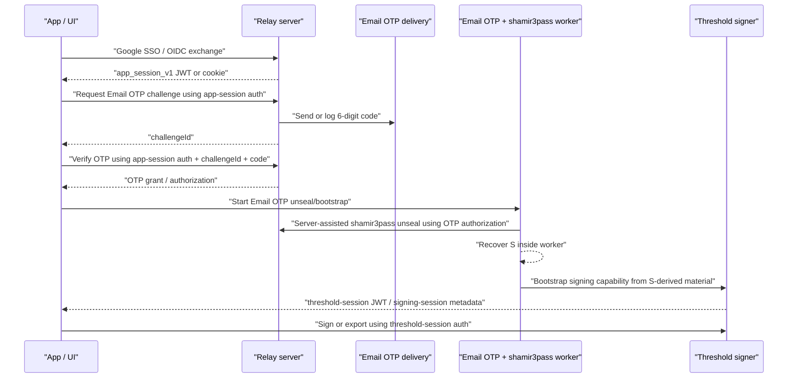
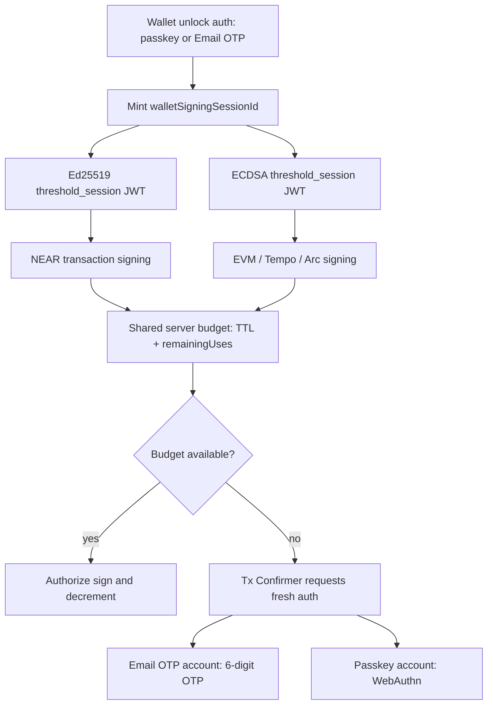

# Threshold Signing Warm Sessions

Last updated: 2026-04-18

## 1. Core Rules

1. Login performs one passkey assertion and uses that single `PRF.first` derivation to warm all enabled threshold signers.
2. In current default config, login warms `ed25519` and `ecdsa` together, with `ecdsa` depending on `ed25519`.
3. Tempo/EVM sign flows must not trigger hidden bootstrap as a normal path; they consume already-warm session state or use explicit reconnect flow.
4. Confirmer UI must open immediately; network-dependent preparation is hydrated after mount.

## 2. Session Token Model

Signing flows use two different session-token authority lanes. They are intentionally not interchangeable.

### App-session JWT

`app_session_v1` represents authenticated app/user state.

It answers:

```text
Is this browser/app session currently authenticated as this user for this wallet/app?
```

Use app-session auth for:

1. Google SSO or passkey app-session exchange.
2. `session/*` routes such as refresh, state, revoke, and lock.
3. Email OTP challenge issuance and verification.
4. Email OTP `export_key` challenge issuance and verification.
5. Email OTP bootstrap authorization, because OTP verification and app-session binding prove the user is allowed to begin unseal/bootstrap.
6. Wallet metadata reads that require authenticated end-user context.

Do not use app-session auth as generic signing authority. A valid app session means the user is logged in; it does not by itself prove an active threshold signer is ready or authorized to sign.

### Threshold-session JWT

Threshold-session JWTs represent active signing capability for a specific threshold signer family and session.

They answer:

```text
Is this client allowed to use this already-bootstrapped threshold signing session?
```

Use threshold-session auth for:

1. Threshold Ed25519 signing and HSS continuation routes after bootstrap.
2. Threshold ECDSA signing, presign, and HSS export routes after bootstrap.
3. Threshold key export routes that require an already-established threshold signing capability.
4. Low-level threshold continuation routes whose authorization is scoped to threshold session claims.

Do not use threshold-session auth as generic app/session authority. A valid threshold session means a signing capability exists; it must not be accepted for Email OTP challenge issuance, app-session refresh, app-session state, or other end-user session routes.

### Shared Route Auth Type

Client and worker plumbing should use one discriminated route-auth type while preserving the two security meanings:

```ts
type RouteAuth =
  | { kind: 'app_session'; jwt: string }
  | { kind: 'threshold_session'; jwt: string };
```

The shared type simplifies call sites, but each route must still require the correct variant. Wrong-token usage must fail closed before or at the route boundary.

### Email OTP Session Flow



Practical rule:

1. Fresh Email OTP authorization is reserved for private-key export and link-device/add-signer flows, or for ordinary signing only when the configured signing-session policy is `per_operation`.
2. Successful bootstrap creates or refreshes threshold-session auth.
3. Normal signing and threshold HSS export use threshold-session auth.
4. Export with Email OTP uses both lanes: app-session auth for the export-scoped OTP challenge, then threshold-session auth for the threshold export protocol.
5. Ordinary transaction signing must not force Email OTP step-up when a valid session-mode signing session already exists.

Policy model:

```ts
type SigningSessionPolicy = 'session' | 'per_operation';

type AuthMethod = 'passkey' | 'email_otp';

type SensitiveOperationPolicy =
  | 'inherit_session_policy'
  | 'require_fresh_same_method'
  | 'require_passkey'
  | 'deny_email_otp';
```

### Wallet Signing Session Budget

`walletSigningSessionId` is the wallet-level signing-session budget created during wallet unlock or signing-session refresh.

It answers:

```text
How long may this wallet keep signing, and how many transaction signatures remain, regardless of curve?
```

It is different from both token lanes above:

1. `app_session_v1` proves the app/user is logged in and may request Email OTP challenges.
2. curve-specific threshold-session JWTs authorize a concrete Ed25519 or ECDSA threshold route.
3. `walletSigningSessionId` ties those curve-specific capabilities to one shared TTL and `remainingUses` budget.

Required behavior:

1. A wallet unlock creates one `walletSigningSessionId`.
2. Ed25519 and ECDSA threshold sessions minted for that unlock must reference the same `walletSigningSessionId`.
3. NEAR Ed25519 signing and EVM/Tempo/Arc ECDSA signing consume the same server-authoritative `remainingUses` counter.
4. TTL expiry or use-count exhaustion invalidates both curve capabilities.
5. Private-key export and link-device/add-signer flows use operation-scoped auth and must not consume, replace, or invalidate the transaction-signing `walletSigningSessionId`.
6. The client may clear local worker material earlier than the server budget, but it must not extend the server TTL or remaining-use count.



Prompt routing on exhaustion:

1. Email OTP-only accounts must show the Email OTP Tx Confirmer and dispatch a transaction-sign OTP challenge.
2. Passkey accounts must show WebAuthn/passkey confirmation.
3. Mixed accounts default to passkey unless project policy explicitly allows Email OTP fallback.
4. Exhaustion must not surface as a generic “session not ready” error to the app when a reauth path is available.

## 3. One-Touch Warmup Architecture

Primary implementation:

- `client/src/core/SeamsPasskey/login.ts`
- `client/src/core/signingEngine/threshold/workflows/connectEd25519Session.ts`
- `client/src/core/signingEngine/threshold/workflows/bootstrapEcdsaSession.ts`

Current unlock warm path:

1. `auth.unlock(...)` decides whether warmup is required (threshold mode with non-zero TTL and remaining uses).
2. `maybeWarmThresholdSigningSessions(...)` loads threshold key material and clears stale warm session state.
3. `primeThresholdLoginWarmSigners(...)` builds signer tasks and runs them via dependency graph.
4. `ed25519` task calls `connectEd25519Session(...)`:
   - prompts passkey once,
   - extracts `PRF.first`,
   - caches `PRF.first` in passkey worker by `sessionId`,
   - mints session JWT,
   - derives and returns `ecdsaHssClientRootShare32B64u`.
5. `ecdsa` task calls `bootstrapEcdsaSession(...)` with:
   - `sessionId` and explicit threshold-route auth from the `ed25519` task,
   - `clientRootShare32B64u` from the same passkey derivation.
6. Login requires `getWarmSigningSessionStatus(...)` to return `active`; otherwise login fails closed.

## 4. Enabled Signers and Dependency Graph

The warm planner already supports a signer set (`signersToWarm`) and dependency execution:

1. Defaults to `['ed25519', 'ecdsa']`.
2. Rejects invalid graph requests (`ecdsa` without `ed25519`).
3. Executes dependency-ready tasks in parallel (`Promise.all`) for future plug-n-play signers.

This is the canonical place to extend when more signer families become configurable.

## 5. Confirmer UX Contract (No Pre-Modal Blocking)

Primary implementation:

- `client/src/core/signingEngine/orchestration/evm/evmSigningFlow.ts`
- `client/src/core/signingEngine/orchestration/tempo/tempoSigningFlow.ts`
- `client/src/core/signingEngine/touchConfirm/handlers/flows/signing.ts`
- `client/src/core/signingEngine/touchConfirm/intentDigestPreparationRegistry.ts`

Required behavior:

1. Start intent preparation and managed nonce reservation in background.
2. Open confirmer immediately with pending digest placeholders.
3. Hydrate title/body/model/challenge after preparation resolves.
4. Keep confirm action loading/disabled until hydration is complete.

Do not block modal mount on:

1. RPC calls (nonce fetch, block/receipt reads, fee reads).
2. Intent building and digest generation.
3. Threshold key reconnect checks.
4. Presign handshake/refill.

## 6. Finalization Polling Issues to Watch

Finalization bugs are usually post-broadcast issues, not signing failures.

1. RPC request timeout only is insufficient; response body parsing can also hang. Bound both request and response parsing by deadline.
2. `eth_getTransactionReceipt` can return `null` for long periods even when tx is known; enforce explicit finality deadline and useful error surface.
3. Underpriced pending transactions can look like stuck finalization. Compare `maxFeePerGas` hint against latest base fee and fail with explicit retry guidance when persistently underpriced.
4. On Tempo flows, receipt polling alone can be noisy; keep state-based confirmation fallback (for example, expected contract state change) where available.
5. Reset per-attempt UI state before each flow start so stale tx-hash metadata is never shown on a new transaction.

## 7. Nonce Issues to Watch

Primary implementation:

- `client/src/core/rpcClients/evm/nonceBackend.ts`
- `client/src/core/signingEngine/api/evmSigning.ts`

Critical rules:

1. Always reserve nonce before signing and transition lifecycle explicitly (`markBroadcastAccepted` -> `markFinalized|markDroppedOrReplaced`).
2. Always mark reservation rejected on sign/broadcast failure or user cancellation.
3. On nonce-conflict or blocked-lane broadcast errors, map to retryable typed error and reconcile lane state from chain.
4. Keep nonce scope concrete and deterministic: `chain + networkKey + chainId + sender (+ nonceKey for tempo)`.
5. Fail closed on ambiguous/misconfigured chain routing; do not guess network mapping.
6. Do not reintroduce caller-managed nonce injection as default behavior.

## 8. Regression Checklist

1. Login warmup with threshold mode enabled results in one TouchID prompt and active warm session.
2. EVM and Tempo signer confirms open immediately while nonce/intent work continues in background.
3. Second transaction in the same UI flow never shows previous tx hash in loading toast.
4. Broadcast reporting always calls lifecycle hooks (`accepted`/`rejected`/`finalized`/`dropped|replaced`) so nonce lanes cannot drift silently.
5. Reconcile surfaces unresolved nonce gaps deterministically and dropped/replaced transitions recover lane progress.
6. Finalization wait always terminates with either confirmed state or typed timeout/underpriced guidance.

## 9. Sealed Refresh (`sealed_refresh_v1`) Integration

Use this only when the server-side signing-session seal module is enabled.

Client config (opt-in):

```ts
const seams = createSeamsPasskey({
  signingSessionPersistenceMode: 'sealed_refresh_v1',
  signingSessionSeal: {
    keyVersion: 'kek-s-2026-02',
    shamirPrimeB64u: '<base64url-prime-no-padding>',
  },
});
```

Requirements:

1. `signingSessionSeal.shamirPrimeB64u` must be valid base64url without padding.
2. Server exposes authenticated signing-session seal routes:
   - `POST /threshold/signing-session-seal/apply-server-seal`
   - `POST /threshold/signing-session-seal/remove-server-seal`
3. Wallet iframe and touchConfirm worker run under wallet origin with sessionStorage available.

Key material generation:

1. Run `pnpm signing-session-seal:keygen` from the repo root.
2. Copy server outputs into relay env:
   - `SIGNING_SESSION_SEAL_KEY_VERSION`
   - `SIGNING_SESSION_SHAMIR_P_B64U`
   - `SIGNING_SESSION_SEAL_E_S_B64U`
   - `SIGNING_SESSION_SEAL_D_S_B64U`
3. Copy client outputs into app env:
   - `VITE_SIGNING_SESSION_PERSISTENCE_MODE=sealed_refresh_v1`
   - `VITE_SIGNING_SESSION_SEAL_KEY_VERSION`
   - `VITE_SIGNING_SESSION_SHAMIR_P_B64U`

Behavior:

1. Same-tab refresh rehydrates from sealed session record and avoids an extra TouchID prompt.
2. New tab/window still requires TouchID (sessionStorage scope is per-tab).
3. If sealed record is missing/expired/exhausted/invalid, flow fails closed and requests normal re-auth.

Operational guidance:

1. Keep default mode as `none`; enable `sealed_refresh_v1` per app or per cohort.
2. Monitor sealed apply/remove failure rates before broad rollout.
3. Runtime is lazy-loaded only when `sealed_refresh_v1` is enabled.
