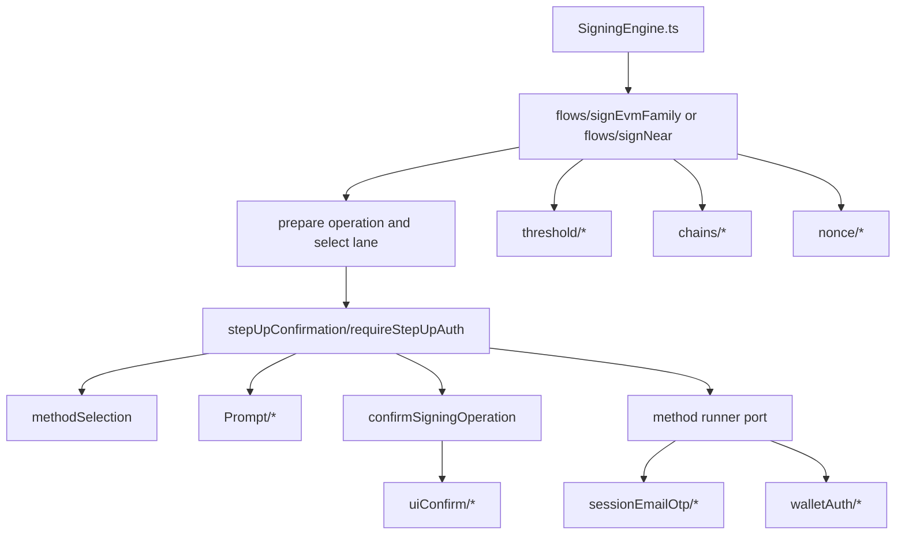
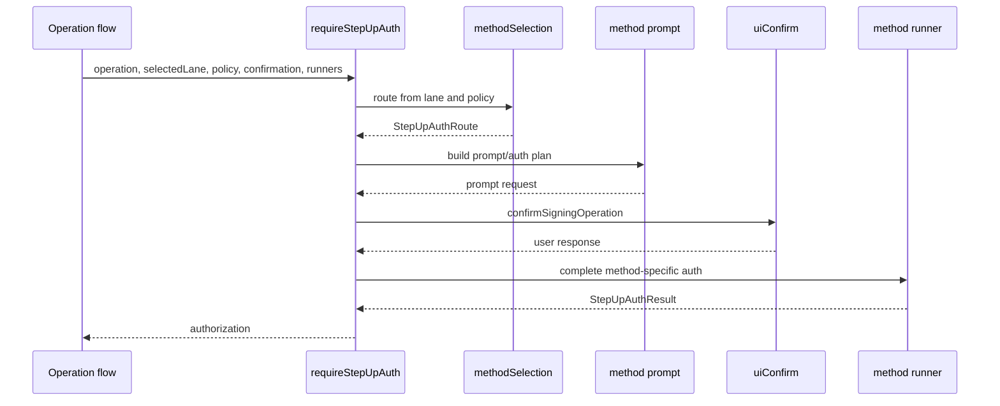

# Step-Up Adaptor Refactor Plan

Date created: 2026-05-07
Status: proposed

## Purpose

Main transaction signing flows should ask for signing authorization through one
operation-facing boundary. They should not route directly to Email OTP, passkey,
or future auth methods.

The target API is:

```ts
const stepUp = await requireStepUpAuth({
  operation,
  selectedLane,
  policy,
  confirmation,
  methods,
});
```

`requireStepUpAuth` chooses the required auth method from the selected signing
lane, operation policy, readiness state, and available method runners. It then
builds the correct prompt/auth plan, invokes the concrete confirmation runtime,
and returns a narrow authorization result.

## Goals

1. Keep transaction flows linear and auth-method agnostic.
2. Treat passkey, Email OTP, authenticator OTP, magic links, password, and future
   methods through the same operation-facing contract.
3. Keep method-specific prompt/auth-plan construction under
   `stepUpConfirmation/`.
4. Keep method-specific lifecycle coordination in the real owner:
   operation-local code, `sessionEmailOtp/`, generic `session/`, or a future
   method session folder when it owns durable lifecycle state.
5. Delete direct operation imports of `otpPrompt/*`, `passkeyPrompt/*`, and
   auth-plan enum switches after call sites move.
6. Avoid adapter classes and registries unless they own state or enforce an
   external boundary.

## Target Structure

```text
client/src/core/signingEngine/
  flows/
    signEvmFamily/
      requireEvmFamilyStepUpAuth.ts
      emailOtpSigningSession.ts
      signingFlow.ts
    signNear/
      requireNearStepUpAuth.ts
      signNear.ts
    shared/
      signingStateMachine.ts

  stepUpConfirmation/
    requireStepUpAuth.ts
    methodSelection.ts
    methodRunners.ts
    types.ts
    passkeyPrompt/
      touchIdPrompt.ts
      webauthnKeyRef.ts
    otpPrompt/
      authLane.ts
      signingPrompt.ts
      exportAuthorization.ts
      promptText.ts
    authenticatorOtpPrompt/
    magicLinkPrompt/
    passwordPrompt/

  session/
    ...

  sessionEmailOtp/
    EmailOtpThresholdSessionCoordinator.ts

  walletAuth/
    ...

  uiConfirm/
    UiConfirmManager.ts
```

The operation folders may keep small operation-specific builders such as
`requireEvmFamilyStepUpAuth.ts` when they assemble chain-specific method
runners. Shared routing and prompt contracts stay under `stepUpConfirmation/`.

## Call Graph



Runtime calls may pass through a method runner to `sessionEmailOtp/` or
`walletAuth/`. Import direction stays controlled by defining runner interfaces
in `stepUpConfirmation/` and passing implementations in from the operation or
assembly layer.

## Dependency Contract

| From | May import | Must not import |
| --- | --- | --- |
| `flows/*` | `stepUpConfirmation/requireStepUpAuth`, `stepUpConfirmation/types`, operation-local runner builders | `stepUpConfirmation/*Prompt`, `SigningAuthPlanKind` switches, concrete `uiConfirm/*` internals |
| `stepUpConfirmation/requireStepUpAuth.ts` | `methodSelection`, `types`, prompt builders, `confirmOperation` | `flows/*`, `SigningEngine.ts`, concrete session lifecycle modules |
| `stepUpConfirmation/*Prompt` | prompt-local types and primitive auth/display types | operation flows, `SigningEngine.ts`, threshold protocol execution |
| `sessionEmailOtp/*` | `stepUpConfirmation` Email OTP contracts, `session/*`, `threshold/*`, `workerManager/*` | operation flows, `SigningEngine.ts`, passkey prompt internals |
| `walletAuth/*` | reusable auth primitives only | `stepUpConfirmation/*`, operation flows, session lifecycle modules |
| `uiConfirm/*` | confirmation contracts and concrete UI runtime dependencies | operation flows, `SigningEngine.ts` |

## Core Data Types

The adaptor needs explicit state shapes. Required lifecycle fields must be
required on the relevant branch.

```ts
type StepUpMethod =
  | 'passkey'
  | 'email_otp'
  | 'authenticator_otp'
  | 'magic_link'
  | 'password';
```

```ts
type RequireStepUpAuthRequest =
  | RequireEcdsaStepUpAuthRequest
  | RequireEd25519StepUpAuthRequest;

type RequireEcdsaStepUpAuthRequest = {
  curve: 'ecdsa';
  operation: EvmFamilySigningOperationContext;
  selectedLane: SelectedEcdsaSigningLane;
  policy: StepUpAuthPolicy;
  confirmation: StepUpConfirmationRequest;
  methods: StepUpMethodRunners;
};

type RequireEd25519StepUpAuthRequest = {
  curve: 'ed25519';
  operation: NearSigningOperationContext;
  selectedLane: SelectedEd25519SigningLane;
  policy: StepUpAuthPolicy;
  confirmation: StepUpConfirmationRequest;
  methods: StepUpMethodRunners;
};
```

```ts
type StepUpAuthRoute =
  | {
      method: 'passkey';
      prompt: PasskeyPromptPlan;
      runner: PasskeyStepUpRunner;
    }
  | {
      method: 'email_otp';
      prompt: EmailOtpPromptPlan;
      authLane: EmailOtpAuthLane;
      runner: EmailOtpStepUpRunner;
    }
  | {
      method: 'authenticator_otp';
      prompt: AuthenticatorOtpPromptPlan;
      runner: AuthenticatorOtpStepUpRunner;
    }
  | {
      method: 'magic_link';
      prompt: MagicLinkPromptPlan;
      runner: MagicLinkStepUpRunner;
    }
  | {
      method: 'password';
      prompt: PasswordPromptPlan;
      runner: PasswordStepUpRunner;
    };
```

```ts
type StepUpAuthResult =
  | {
      method: 'passkey';
      authorization: PasskeyStepUpAuthorization;
    }
  | {
      method: 'email_otp';
      authorization: EmailOtpStepUpAuthorization;
    }
  | {
      method: 'authenticator_otp';
      authorization: AuthenticatorOtpStepUpAuthorization;
    }
  | {
      method: 'magic_link';
      authorization: MagicLinkStepUpAuthorization;
    }
  | {
      method: 'password';
      authorization: PasswordStepUpAuthorization;
    };
```

During migration, `requireStepUpAuth` may also return an existing warm-session
authorization branch if that keeps the first slice small. The final shape should
make warm-session reuse a session-planning result and reserve step-up branches
for reauth methods.

## Method Runner Pattern

`requireStepUpAuth` should own routing and prompt sequencing. Method runners own
side effects that belong outside generic confirmation routing.

```ts
type StepUpMethodRunners = {
  passkey?: PasskeyStepUpRunner;
  emailOtp?: EmailOtpStepUpRunner;
  authenticatorOtp?: AuthenticatorOtpStepUpRunner;
  magicLink?: MagicLinkStepUpRunner;
  password?: PasswordStepUpRunner;
};
```

Example Email OTP runner:

```ts
type EmailOtpStepUpRunner = {
  prepareChallenge(input: EmailOtpPrepareChallengeInput): Promise<EmailOtpChallenge>;
  complete(input: EmailOtpCompleteInput): Promise<EmailOtpStepUpAuthorization>;
  resend?(input: EmailOtpResendInput): Promise<EmailOtpChallenge>;
};
```

Example passkey runner:

```ts
type PasskeyStepUpRunner = {
  prepare(input: PasskeyPrepareInput): Promise<PasskeyPromptPlan>;
  complete(input: PasskeyCompleteInput): Promise<PasskeyStepUpAuthorization>;
};
```

This keeps `stepUpConfirmation` free of operation-specific Email OTP refresh
logic while still giving operations a single `requireStepUpAuth` call.

## Target Flow



## Phased Todo List

### Phase 0: Inventory Current Direct Auth Routing

- [ ] List every flow importing `stepUpConfirmation/otpPrompt/*`.
- [ ] List every flow importing `stepUpConfirmation/passkeyPrompt/*`.
- [ ] List every flow switching on `SigningAuthPlanKind`.
- [ ] List every flow that builds Email OTP challenge, resend, or completion
      closures.
- [ ] Identify EVM-family, Tempo, NEAR, recovery, and export call sites that
      should call `requireStepUpAuth`.

Exit criteria:

- [ ] Inventory names exact files, imported symbols, and replacement owner.
- [ ] No implementation changes in this phase.

### Phase 1: Define The Adaptor Contract

- [ ] Add `stepUpConfirmation/requireStepUpAuth.ts`.
- [ ] Add `stepUpConfirmation/methodSelection.ts`.
- [ ] Add `stepUpConfirmation/methodRunners.ts`.
- [ ] Replace shared optional auth fields with discriminated route/result
      branches.
- [ ] Keep existing `SigningAuthPlan` only where the UI confirmation runtime
      still consumes it during migration.
- [ ] Add tests for method selection from selected lane, policy, and available
      runners.

Exit criteria:

- [ ] The adaptor compiles without moving operation flows.
- [ ] Type tests or unit tests prove missing method runners fail before UI
      confirmation starts.
- [ ] No new internal barrel files are introduced.

### Phase 2: EVM-Family Vertical Slice

- [ ] Add `flows/signEvmFamily/requireEvmFamilyStepUpAuth.ts` to assemble
      EVM-family method runners and call `requireStepUpAuth`.
- [ ] Move EVM-family Email OTP challenge, resend, and completion wiring out of
      broad auth-planning code into `flows/signEvmFamily/emailOtpSigningSession.ts`.
- [ ] Change `flows/signEvmFamily/signingFlow.ts` and
      `flows/signEvmFamily/signingFlowRuntime.ts` to call the new operation-local
      helper.
- [ ] Remove direct imports of `otpPrompt/*` and `passkeyPrompt/*` from moved
      EVM-family call sites.
- [ ] Keep threshold signing and nonce sequencing in the existing operation
      flow.

Exit criteria:

- [ ] EVM-family transaction signing has one step-up call site.
- [ ] EVM-family operation code imports `requireStepUpAuth` or the
      operation-local helper, with no prompt-module imports.
- [ ] Existing EVM-family signing tests pass.

### Phase 3: Tempo Coverage

- [ ] Verify Tempo uses the EVM-family helper instead of its own method routing.
- [ ] Move Tempo-specific passkey/WebAuthn P-256 keyRef preparation into the
      EVM-family runner path or a Tempo-local runner helper.
- [ ] Keep chain display builders under `chains/tempo/display.ts`.

Exit criteria:

- [ ] Tempo has no separate step-up routing path.
- [ ] Tempo call graph is `flow -> requireEvmFamilyStepUpAuth -> requireStepUpAuth`.

### Phase 4: NEAR Vertical Slice

- [ ] Add `flows/signNear/requireNearStepUpAuth.ts`.
- [ ] Move NEAR transaction Email OTP prompt setup into the NEAR helper or a
      shared runner builder if it is auth-method neutral.
- [ ] Route NEAR transaction, delegate, and NEP-413 signing through the same
      adaptor shape.
- [ ] Keep NEAR-specific Ed25519 threshold material resolution in `signNear` or
      `threshold/ed25519`.

Exit criteria:

- [ ] NEAR operation code has one step-up entrypoint.
- [ ] NEAR imports no prompt modules directly.
- [ ] NEAR still uses the shared signing state machine.

### Phase 5: Recovery And Export Flows

- [ ] Decide whether recovery/export flows use the same `requireStepUpAuth`
      request shape or a narrower `requireExportStepUpAuth` wrapper over it.
- [ ] Move key-export Email OTP and passkey confirmation routing to the adaptor.
- [ ] Keep export-specific display and policy data in the recovery/export flow
      folders.

Exit criteria:

- [ ] Recovery/export flows share method routing with transaction signing.
- [ ] Export-specific auth policy remains explicit in the flow request.

### Phase 6: Future Auth Method Slots

- [ ] Add compile-time placeholders only as types or tests. Avoid empty runtime
      folders for methods without implementation.
- [ ] Document how to add a method:
      `StepUpMethod` branch, prompt module, runner interface, method-selection
      branch, operation runner implementation, and tests.
- [ ] Add a sample test-only fake method to verify the routing extension point
      if useful.

Exit criteria:

- [ ] Adding authenticator OTP or magic link requires no transaction-flow
      rewrites.
- [ ] New methods require explicit runner implementations and tests.

### Phase 7: Delete Old Routing Paths

- [ ] Delete `flows/emailOtp/` after its files move.
- [ ] Rename `sessionsEmailOtp/` to `sessionEmailOtp/` if that has not already
      landed.
- [ ] Delete direct operation imports of:
      `stepUpConfirmation/otpPrompt/*`,
      `stepUpConfirmation/passkeyPrompt/*`,
      and `SigningAuthPlanKind`.
- [ ] Add guard tests for the deleted paths and blocked imports.
- [ ] Update ownership READMEs and `docs/refactor-33.md` cross references.

Exit criteria:

- [ ] Main signing flows call one step-up boundary.
- [ ] Prompt modules are method-local implementation details.
- [ ] Email OTP and passkey are symmetric at the flow boundary.
- [ ] Refactor 33 guard tests and `pnpm build:sdk` pass.

## Guard Tests

Add or extend `tests/unit/signingEngine.refactor33.guard.unit.test.ts`:

- [ ] `flows/*` cannot import `stepUpConfirmation/otpPrompt/*`.
- [ ] `flows/*` cannot import `stepUpConfirmation/passkeyPrompt/*`.
- [ ] `flows/*` cannot switch on `SigningAuthPlanKind`.
- [ ] `flows/emailOtp/` is a deleted path.
- [ ] `flows/passkey/` is a blocked path.
- [ ] `stepUpConfirmation/requireStepUpAuth.ts` cannot import `flows/*`,
      `SigningEngine.ts`, or concrete session lifecycle modules.
- [ ] Auth-method runner interfaces live under `stepUpConfirmation/`.
- [ ] Operation-specific runner implementations live under the operation folder
      or the real lifecycle owner.

## Success Metrics

1. Each main signing operation has exactly one step-up auth call.
2. EVM-family, Tempo, and NEAR use the same `requireStepUpAuth` contract.
3. Adding authenticator OTP, magic link, or password does not require changing
   transaction signing flow control.
4. Method-specific lifecycle code has one owner.
5. Prompt modules are no longer imported by operation flows.
6. Refactor guards enforce the import direction and deleted paths.
7. `pnpm build:sdk` and the relevant signing-flow suites pass.

## Open Decisions

1. Final name: keep `requireStepUpAuth` for the operation-facing API, or use
   `resolveSigningAuth` if warm-session reuse remains in the same function.
2. Result boundary: return method-specific authorization directly, or return a
   normalized signing authorization consumed by threshold admission.
3. Future prompt layout: keep flat folders like `otpPrompt/` and
   `passkeyPrompt/`, or move to `stepUpConfirmation/authMethods/<method>/` once
   the number of methods grows.
