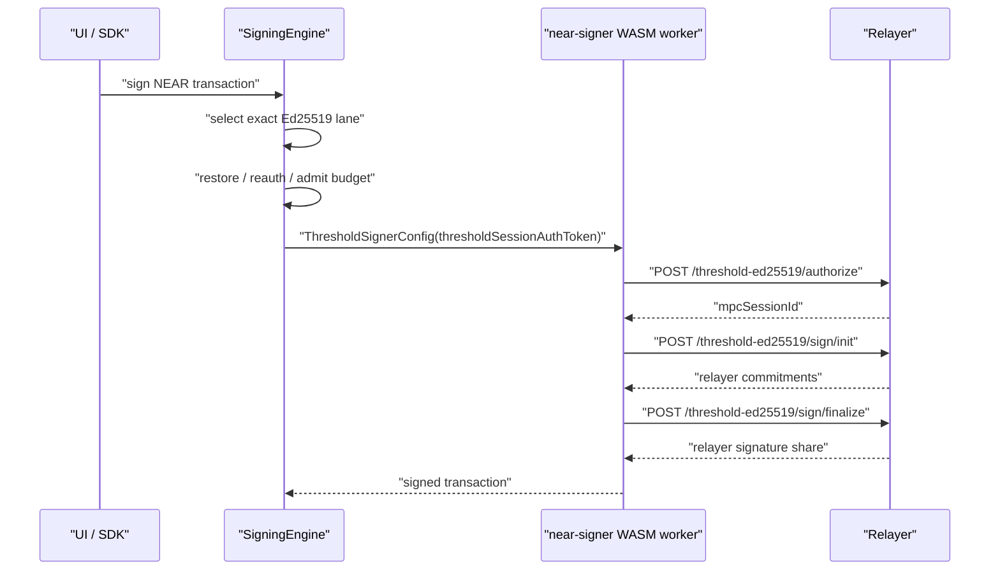

# Threshold Ed25519 Session Auth Token

Date updated: May 7, 2026

Status: active architecture for threshold Ed25519 signing-session authorization.

## Summary

`thresholdSessionAuthToken` is the short-lived authorization material for a
concrete threshold Ed25519 signing session.

It is carried from TypeScript into the near-signer WASM worker so the worker can
ask the relayer for per-signature authorization before it runs the Ed25519
threshold signing protocol.

The auth token can be delivered as:

- a bearer token returned by `POST /threshold-ed25519/session`
- an HttpOnly cookie when `thresholdSessionKind` is `cookie`

The public TypeScript and Rust/WASM field name is always
`thresholdSessionAuthToken` / `threshold_session_auth_token` for bearer-token
delivery. The underlying bearer token may still be JWT-backed internally.

## Why It Exists

Threshold Ed25519 signing has two authorization layers:

- the user/app session proves the caller has an app-level session
- the threshold signing session proves the caller is allowed to use one concrete
  threshold signing lane

The relayer must enforce the threshold signing-session boundary before it helps
produce a signature. That boundary includes:

- `nearAccountId`
- `relayerKeyId`
- `thresholdSessionId`
- `walletSigningSessionId`
- participant ids
- RP / runtime policy scope
- expiration
- remaining-use budget
- signing purpose and digest

`thresholdSessionAuthToken` is the compact capability that lets the signer worker
ask the relayer for a one-operation `mpcSessionId` under that exact session.

Without it, the WASM signer has only local signing material and transaction
data. The relayer would have no authenticated proof that the worker is operating
inside the selected threshold session.

## Threshold Signing Protocol Session

This is a threshold-signing-specific session. It exists because threshold
signing is an interactive protocol, not a single stateless HTTP request.

For one transaction, the client and relayer may need several network round
trips:

1. authorize the selected signing lane and digest
2. exchange signing commitments
3. exchange signature shares and finalize the signature

The threshold session gives those requests one shared authorization boundary.
The relayer can check that every round belongs to the same selected lane,
session id, wallet signing-session id, budget state, purpose, and digest.

The app session says the user can use the wallet. The threshold session says
this exact threshold signer can perform this exact signing operation under the
current signing-session constraints.

Warm sessions may already have valid threshold-session authority, so signing can
reuse it until the session expires or its budget is exhausted. After exhaustion,
step-up authentication creates fresh threshold-session authority before signing
continues.

## Latency And Prefetching

For a warm session that already has `thresholdSessionAuthToken`, the token adds
one lightweight relayer round trip before the threshold signing rounds:

1. call `/threshold-ed25519/authorize` to get a per-operation `mpcSessionId`
2. run `/threshold-ed25519/sign/init`
3. run `/threshold-ed25519/sign/finalize`

That added request is mostly network latency plus a server-side claim, session,
and budget check. Cold, missing, expired, or exhausted sessions are slower
because the flow must first perform step-up auth and mint fresh threshold-session
authority.

The safe optimization is intent-triggered prefetch. For example, the UI can
start threshold-session readiness work when the user hovers, focuses, or presses
near a transaction-signing button:

- read current status without restoring or minting sessions
- prepare the exact transaction signing intent
- mint or refresh threshold-session authority only when the user is clearly
  entering the signing command path
- discard prefetched authority if the user leaves the flow or the prepared
  transaction identity changes

This should not become passive polling. Status reads should not unseal durable
material, mint threshold sessions, consume budget, or prompt the user.

## How It Differs From `appSessionJwt`

`appSessionJwt` is app/session boundary auth.

- issued by login / SSO / Email OTP app-session flows
- proves the caller has an app session for a wallet/user scope
- used for app routes such as challenge creation, unlock, enrollment, and
  account/session management
- never passed to the near-signer WASM worker as threshold signing authority

`thresholdSessionAuthToken` is threshold signing-session auth.

- issued for a concrete threshold signing session
- scoped to the selected signing lane and signing-session identity
- used by `/threshold-ed25519/authorize` and session-bound HSS routes
- passed into the near-signer WASM worker through `ThresholdSignerConfig`
- can authorize only threshold-session work covered by the token claims and
  server-side policy

The two token types can both be JWT-shaped on the wire. Their field names,
claim kinds, validation paths, and callsites must stay separate.

## Signing Flow



The `mpcSessionId` returned by `/threshold-ed25519/authorize` is the immediate
per-signature authorization used by `sign/init`. The threshold session auth
token is the broader session capability that authorizes that per-signature
request.

## WASM Worker Decision Tree

The near-signer WASM backend resolves signing authorization in this order:

1. If `mpcSessionId` is already present, use it directly.
2. If `thresholdSessionAuthToken` is present, call
   `/threshold-ed25519/authorize` with `Authorization: Bearer <token>`.
3. If `thresholdSessionPolicyJson` and a WebAuthn credential are present, call
   `/threshold-ed25519/session` to mint a fresh threshold session auth token or
   cookie, then call `/threshold-ed25519/authorize`.
4. If none of those are available, fail before signing.

That fail-closed behavior is intentional. A signer worker without threshold
session authorization cannot ask the relayer to participate in threshold
signing.

## Threaded Modules

### TypeScript Boundary Types

- `client/src/core/types/signer-worker.ts`
  - defines `ThresholdSignerConfig.thresholdSessionAuthToken`
  - mirrors the Rust/WASM config shape

- `shared/src/utils/sessionTokens.ts`
  - distinguishes app-session JWTs from threshold-session auth tokens by
    `kind`
  - exposes `requireThresholdSessionAuthToken(...)`

### Near Signing Orchestration

- `client/src/core/signingEngine/orchestration/near/shared/workerRequestAssembly.ts`
  - places `thresholdSessionAuthToken` into the worker request payload

- `client/src/core/signingEngine/orchestration/near/shared/thresholdSessionAuth.ts`
  - resolves threshold session auth material from the selected Ed25519 record

- `client/src/core/signingEngine/flows/signNear/signTransactions.ts`
  - carries the selected Ed25519 session state into transaction signing

- `client/src/core/signingEngine/flows/signNear/signDelegate.ts`
  - carries the same auth token for delegate signing

- `client/src/core/signingEngine/flows/signNear/signNep413.ts`
  - carries the same auth token for NEP-413 signing

### HSS Reconstruction And Repair

- `client/src/core/signingEngine/threshold/ed25519/hssClientBase.ts`
  - requires `thresholdSessionAuthToken` when single-key HSS reconstruction
    needs server participation

- `client/src/core/signingEngine/threshold/ed25519/hssLifecycle.ts`
  - sends the auth token to session-bound Ed25519 HSS server routes

- `client/src/core/signingEngine/threshold/ed25519/repairMissingRelayerKey.ts`
  - carries the token into relayer-key repair when the hot relayer-share cache
    is missing

### Session State And Persistence

- `client/src/core/signingEngine/session/persistence/records.ts`
  - stores canonical threshold Ed25519 session records with
    `thresholdSessionAuthToken` for bearer-token sessions

- `client/src/core/signingEngine/session/persistence/sealedSessionStore.ts`
  - preserves sealed refresh transport metadata that may include the token

- `client/src/core/signingEngine/session/warmCapabilities/readModel.ts`
  - exposes warm-session auth state used by signing orchestration

### Email OTP Paths

- `client/src/core/signingEngine/emailOtp/EmailOtpThresholdSessionCoordinator.ts`
  - receives threshold-session auth from Email OTP unlock/step-up and persists
    it into Ed25519/ECDSA session records

- `client/src/core/signingEngine/workerManager/workers/email-otp.worker.ts`
  - handles Email OTP worker-side threshold-session transport data

### Rust / WASM Boundary

- `wasm/near_signer/src/types/signing.rs`
  - defines `ThresholdSignerConfig.threshold_session_auth_token`
  - Serde camelCase exposes it to TypeScript as `thresholdSessionAuthToken`

- `wasm/near_signer/src/threshold/signer_backend.rs`
  - reads the token from `ThresholdSignerConfig`
  - calls the transport authorization path before signing

- `wasm/near_signer/src/threshold/transport.rs`
  - returns minted threshold session auth material to the signer backend

- `wasm/near_signer/src/threshold/relayer_http.rs`
  - sends bearer auth to `/threshold-ed25519/authorize`
  - mints session auth through `/threshold-ed25519/session`

### Server Routes And Validation

- `server/src/router/commonRouterUtils.ts`
  - parses route auth and separates app-session auth from threshold-session
    auth

- `server/src/router/routeAuthPolicy.ts`
  - applies route policy to threshold-session auth claims

- `server/src/router/express/routes/thresholdEd25519.ts`
  - exposes `/threshold-ed25519/session` and `/threshold-ed25519/authorize`

- `server/src/router/cloudflare/routes/thresholdEd25519.ts`
  - Cloudflare equivalent of the Ed25519 session and authorize routes

- `server/src/core/ThresholdService/validation.ts`
  - validates `threshold_ed25519_session_v1` claims

- `server/src/core/ThresholdService/ThresholdSigningService.ts`
  - consumes validated claims when authorizing threshold Ed25519 operations

## Route Responsibilities

### `POST /threshold-ed25519/session`

Mints a threshold session auth token or cookie from:

- a session policy
- a matching WebAuthn assertion or approved route auth
- server-side validation of the threshold signing-session identity

The response can include `jwt` because the transport can still be JWT-backed.
Callers store it under `thresholdSessionAuthToken`.

### `POST /threshold-ed25519/authorize`

Consumes threshold-session auth and returns `mpcSessionId` for a concrete
signature request.

The request binds:

- purpose
- signing digest
- optional signing payload

The response authorizes the next signing protocol step. It is shorter-lived than
the threshold session auth token.

## Naming Rules

- Use `appSessionJwt` only for app/SSO/session auth.
- Use `thresholdSessionAuthToken` for threshold signing-session bearer auth.
- Use `thresholdSessionKind` for transport mode: `jwt` or `cookie`.
- Use `mpcSessionId` for per-signature authorization returned by
  `/threshold-ed25519/authorize`.
- Avoid threshold-session field names ending in `Jwt`; the token implementation
  can change while the threshold-session capability semantics remain stable.

## Regression Lesson

The TypeScript and Rust/WASM config shapes form a wire boundary. Renaming
`thresholdSessionAuthToken` on the TypeScript side requires the matching Rust
field:

```rust
pub threshold_session_auth_token: Option<String>
```

With Serde camelCase, that field is read from JavaScript as
`thresholdSessionAuthToken`.

If the Rust side expects the old field name, the WASM signer receives no token
and fails before it can authorize threshold signing.
