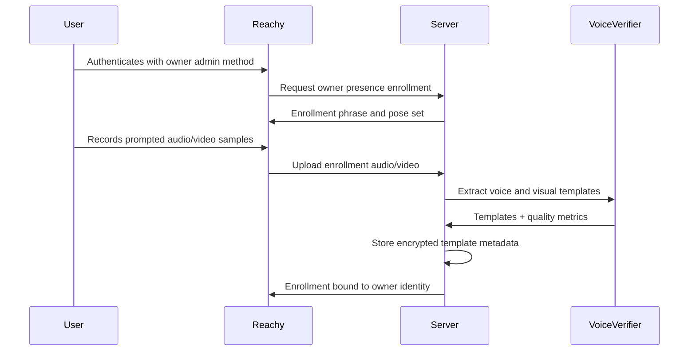
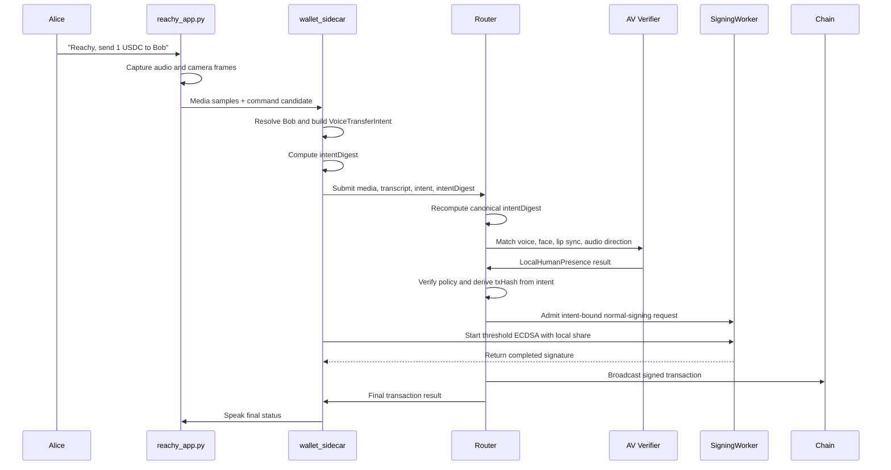

# Voice Biometrics And Spoken Intent

Status: exploratory design spec.

This document explores voice-based authentication for wallet signing sessions
and physical robotics command authorization. It is a product and architecture
sketch, not an implementation commitment.

## Purpose

Voice authentication should be evaluated as a human-presence method for MPC
wallet signing and robot command authorization. The Reachy Mini MVP combines
four checks:

1. Speech recognition verifies that the captured audio contains one exact
   supported command.
2. Speaker verification compares the recorded voice to an enrolled voice
   template for the owner.
3. Visual matching and lip/audio alignment compare the camera feed to enrolled
   owner samples and the live audio source.
4. Intent digest binding ties the accepted command to one canonical transfer or
   robot action.

The core form binds the spoken command to one concrete signing intent, such as
"send 100 USDC to Tom". The server authorizes a narrowly scoped signing
capability for the exact intent digest that the owner spoke.

For robotics, the same primitive can act as an authority filter in a shared
physical environment. A robot may hear commands from many nearby people. It
should execute privileged commands only when the speaker, command, role,
workspace state, and safety controller all authorize that exact action.

## Goals

1. Add a future human-presence method for owner commands and wallet signing.
2. Bind user intent to the exact transaction or session policy that will be
   signed.
3. Keep transaction parsing deterministic by resolving natural-language labels,
   assets, chains, amounts, and addresses before the voice command is admitted.
4. Keep biometric verification isolated at authentication boundaries.
5. Treat raw audio and speaker templates as sensitive personal information.
6. Preserve passkey as the highest-assurance authentication path.
7. Explore physical robotics cases where voice is safer and less awkward than
   requiring the operator to touch a robot or place their face near it.
8. Keep robot safety independent from voice identity. Authorized speakers cannot
   override emergency stops, tool guards, human-detection zones, or other safety
   interlocks.
9. Make the Reachy owner happy path feel like natural speech: the owner speaks,
   Reachy validates local presence, and Reachy responds.

## Non-Goals

1. Replacing passkeys as the preferred signing-session authenticator.
2. Allowing free-form natural language to directly construct transactions.
3. Treating a voice match as a deterministic cryptographic proof.
4. Storing raw enrollment or authentication audio indefinitely.
5. Sharing voice templates across projects, relying parties, wallets, or users.
6. Supporting legacy behavior during an exploratory prototype.
7. Treating voice biometrics as a safety-rated robot control.
8. Gating emergency stop, pause, or other protective actions behind identity
   checks.
9. Requiring phone, watch, QR, or OTP approval in the Reachy owner happy path.

## External Guidance

Voice biometrics are probabilistic and have a materially different assurance
profile from passkeys. NIST SP 800-63B-4 limits the role of biometrics in remote
authentication, requires biometrics to be paired with a physical authenticator
in its authentication model, and explicitly excludes voice biometric comparison
from that model:

https://pages.nist.gov/800-63-4/sp800-63b.html#use-of-biometrics

FIDO/passkey systems keep biometric verification local to the user's device and
send only a cryptographic assertion to the server:

https://fidoalliance.org/specifications/

This project can still experiment with server-side voice verification. The
assurance label should remain below passkey unless the design is backed by a
device-bound cryptographic key.

Robotics deployments also need a separate safety case. ISO 10218-1:2025 covers
industrial robot safety requirements, and ISO/TS 15066:2016 supplements
collaborative robot application safety:

https://www.iso.org/standard/73933.html

https://www.iso.org/standard/62996.html

## Terms

| Term | Meaning |
| --- | --- |
| Spoken command | The exact supported command phrase the user speaks for one authorization attempt. |
| Voice template | Enrolled speaker representation derived from prior voice samples. |
| Visual template | Enrolled face/body representation derived from prior camera samples. |
| Speaker verification | Probabilistic comparison of a new recording against a stored voice template. |
| Audio-visual liveness | Probabilistic check that the voice, face/body track, lip motion, and audio direction describe one nearby live person. |
| Phrase verification | Speech-to-text or constrained ASR check that the user spoke a supported command. |
| Intent digest | Hash of the canonical signing intent and command context. |
| Spoken intent | Human-readable phrase derived from the signing intent and bound to the intent digest. |
| Voice authorization | Server-side result that permits one exact signing intent or a narrow bounded session. |
| Authority filter | Authentication and policy layer that decides whether a speaker may issue a command. |
| Robot command intent | Canonical command object derived from a constrained command grammar and current robot state. |
| Safety controller | Independent robot safety layer that decides whether an authorized command can execute safely. |

## Threat Model

The design should assume attackers may:

1. Control the app session after phishing or malware.
2. Compromise an optional phone/watch/OTP channel when that future step-up is
   enabled.
3. Record the user's voice from calls, videos, meetings, or voicemails.
4. Generate synthetic speech from public or stolen samples.
5. Replay a prior recording into the microphone or upload path.
6. Try many noisy samples to find a permissive matching threshold.
7. Modify transaction fields after the user has approved a generic session.
8. Steal server-side voice templates or stored authentication artifacts.
9. Stand near a robot and issue commands meant to sound plausible.
10. Replay or synthesize an authorized operator's voice over a speaker.
11. Confuse speaker diarization in a room with multiple simultaneous talkers.
12. Issue a valid command while the robot is in an unsafe tool or workspace
    state.

Voice and visual verification help against attackers who can play or synthesize
the owner's voice and cannot convincingly present the enrolled owner as a nearby
live person. This does not remove the need for rate limits, replay resistance,
transaction binding, template protection, explicit consent, and fallback auth
methods.

## Authentication Posture

Voice should be modeled as its own method, separate from Email OTP and passkey:

```ts
type StepUpMethod =
  | 'passkey'
  | 'email_otp'
  | 'voice_challenge';
```

Voice has command and presence sub-checks:

```ts
type VoicePresenceCheck =
  | {
      kind: 'phrase_match';
      admissionId: VoiceAdmissionId;
      transcript: SpokenCommandTranscript;
    }
  | {
      kind: 'speaker_match';
      enrollmentId: VoiceEnrollmentId;
      templateVersion: VoiceTemplateVersion;
      score: VoiceMatchScore;
    }
  | {
      kind: 'visual_liveness_match';
      enrollmentId: VoiceEnrollmentId;
      templateVersion: VisualTemplateVersion;
      score: VisualLivenessScore;
    };
```

A successful voice flow requires these checks plus anti-spoof, freshness, and
policy validation:

```ts
type VoiceAuthorization =
  | {
      kind: 'single_intent';
      method: 'voice_challenge';
      walletId: WalletId;
      subjectId: WalletSubjectId;
      intentDigest: IntentDigest;
      admissionId: VoiceAdmissionId;
      enrollmentId: VoiceEnrollmentId;
      expiresAt: IsoDateTime;
    }
  | {
      kind: 'bounded_session';
      method: 'voice_challenge';
      walletId: WalletId;
      subjectId: WalletSubjectId;
      allowedIntentDigests: IntentDigest[];
      maxTotalValueUsd: DecimalString;
      admissionId: VoiceAdmissionId;
      enrollmentId: VoiceEnrollmentId;
      expiresAt: IsoDateTime;
    };
```

`single_intent` is the preferred shape for transaction signing. It prevents a
valid voice check from becoming broad signing authority that malware can spend
on a different operation.

## Transaction Intent Binding

The client must resolve the requested operation into exact transaction fields
before the voice command is admitted. A phrase like "send 100 USDC to Tom" is
acceptable only after `Tom`, `USDC`, chain, token address, amount units, and
recipient address have all resolved to canonical values.

Example structured intent:

```ts
type VoiceTransferIntent = {
  kind: 'erc20_transfer';
  walletId: WalletId;
  subjectId: WalletSubjectId;
  chainTarget: ThresholdEcdsaChainTarget;
  chainId: number;
  tokenAddress: EvmAddress;
  tokenSymbol: TokenSymbol;
  amountBaseUnits: DecimalString;
  displayAmount: DecimalString;
  recipientAddress: EvmAddress;
  recipientLabel: ContactLabel;
  nonce: IntentNonce;
  expiresAt: IsoDateTime;
};
```

The digest should cover a domain separator and canonical encoding:

```text
intentDigest = HASH(
  "seams.voice_intent.v1" ||
  canonicalEncode(VoiceTransferIntent) ||
  voiceCommandNonce ||
  voiceCommandExpiresAt
)
```

Wallet-only or higher-risk flows may include human-checkable details and a
short digest-derived code in the spoken phrase:

```text
Authorize sending 100 USDC on Base to Tom, address ending 7F3A.
Confirmation words: walking cloud river 482913.
```

The server accepts the voice authorization only for a transaction whose
canonical intent recomputes the same digest. If the recipient, amount, token,
chain, wallet, subject, nonce, expiry, or media-binding context changes, the
digest changes and the voice authorization is invalid.

## MPC Signing Boundary

MPC signing starts only after human-presence verification, intent digest
verification, and policy admission have all succeeded.

The Cloudflare signing architecture is the existing Router A/B signer plan in
`docs/router-a-b-SPEC.md`. Voice verification feeds Router admission.
Normal signing remains `Client -> Router -> SigningWorker -> Router -> Client`;
Deriver A and Deriver B remain setup/export/recovery/SigningWorker-refresh
roles and do not enter the normal voice-authorized signing path.

The `intentDigest` is the authorization object:

```text
intentDigest = HASH(canonical owner command + exact transfer intent + nonce + expiry)
```

The threshold ECDSA protocol signs the actual chain transaction hash:

```text
txHash = HASH(rlp_or_typed_transaction)
```

Router admission must connect those two objects before forwarding normal signing
to SigningWorker:

```text
accepted human presence for Alice
+ accepted command transcript
+ canonical VoiceTransferIntent recomputes intentDigest
+ prepared transaction is derived from VoiceTransferIntent
+ Router policy allows this digest
= Router forwards admitted normal-signing request to SigningWorker for txHash
```

Router and SigningWorker must refuse participation when any field in the
prepared transaction does not derive from the accepted `VoiceTransferIntent`.
The robot's local share and the SigningWorker server-side material produce one
wallet signature only for that admitted transaction.

For the Reachy Mini MVP, verifier placement is server-side:

```text
Reachy captures audio/video
Reachy builds VoiceTransferIntent and intentDigest
Reachy sends audio/video samples, transcript, intent, and digest to server
Server matches voice and visual samples against enrolled owner templates
Server verifies transcript, liveness signals, policy, and intentDigest
Server joins MPC signing for the derived txHash
```

Raw audio/video should be retained only for the verification window unless the
owner explicitly enables diagnostic retention. A later privacy-focused version
can move voice/face/liveness matching to Reachy and send a device-signed
`LocalHumanPresence` result to the server.

## Physical Robotics Use Case

Voice biometrics are a better fit for physical robots than many wallet flows.
TouchID and FaceID assume the user can safely approach a trusted device and
perform a close-range ceremony. A cooking robot, shop robot, cleaning robot, or
tool-using arm may be hot, sharp, moving, contaminated, or surrounded by people.
The operator may need to stay outside the work envelope while still giving
commands.

The robotics design should treat voice as command authority, then let the robot
safety system decide execution:

```text
room audio
  -> wake word or push-to-talk gate
  -> speaker diarization
  -> speech-to-text
  -> constrained command parser
  -> speaker verification
  -> role and policy check
  -> workspace and robot-state safety check
  -> exact command execution
```

Emergency and protective commands should be available to anyone:

1. "Stop", "pause", "freeze", and physical emergency-stop buttons bypass voice
   identity.
2. Privileged resume, tool activation, mode changes, material handling, and
   task reassignment require a recognized speaker with the right role.
3. Dangerous commands require explicit spoken intent, a fresh command digest,
   safe workspace state, and safety-controller admission.

Example command policy:

```text
Any nearby speaker:
  "Robot, stop."

Enrolled kitchen operator:
  "Robot, resume chopping carrots."

Enrolled maintenance operator:
  "Robot, enter blade-cleaning mode."
```

The robot should resolve a spoken command into a canonical intent before acting:

```ts
type RobotCommandIntent =
  | {
      kind: 'protective_stop';
      robotId: RobotId;
      command: 'stop' | 'pause' | 'freeze';
      observedAt: IsoDateTime;
    }
  | {
      kind: 'privileged_command';
      robotId: RobotId;
      command: RobotPrivilegedCommand;
      taskId: RobotTaskId;
      toolId: RobotToolId;
      workspaceZone: RobotWorkspaceZone;
      authorizedSpeakerId: PersonId;
      speakerRole: RobotOperatorRole;
      observedSafetyStateDigest: SafetyStateDigest;
      nonce: IntentNonce;
      expiresAt: IsoDateTime;
    };
```

The robot command digest should cover both the command and the observed safety
state:

```text
robotCommandDigest = HASH(
  "seams.robot_voice_intent.v1" ||
  canonicalEncode(RobotCommandIntent) ||
  voiceCommandNonce ||
  voiceCommandExpiresAt
)
```

For example:

```text
Alice says: "Robot, resume chopping carrots."

Parsed intent:
  robotId = kitchen-arm-1
  command = resume_task
  taskId = chop-carrots
  toolId = knife
  workspaceZone = kitchen-counter
  authorizedSpeakerId = alice
  observedSafetyStateDigest = 0x...
```

Execution requires all of these conditions:

1. The phrase parser maps the command to one exact allowed command.
2. The speaker matches an enrolled authorized operator.
3. The role policy permits that operator to issue the command.
4. The current robot and workspace state still match the safety digest.
5. The independent safety controller admits the action.
6. The command digest has not been consumed.

The robot should reject ambiguous commands. "Clean that" or "move it over
there" needs clarification before any privileged command is constructed. If the
command affects tools, heat, pressure, motion, or people nearby, the robot
should use a confirmation phrase tied to the canonical command:

```text
"Confirm resume chopping carrots with knife in kitchen zone A. Code river 482913."
```

### Robotics Auth State

Robot command authorization should keep identity, parsed command, and safety
state separate:

```ts
type RobotVoiceAuthorization =
  | {
      kind: 'protective_command';
      robotId: RobotId;
      command: 'stop' | 'pause' | 'freeze';
      issuedAt: IsoDateTime;
    }
  | {
      kind: 'privileged_command';
      robotId: RobotId;
      authorizedSpeakerId: PersonId;
      speakerRole: RobotOperatorRole;
      commandDigest: RobotCommandDigest;
      enrollmentId: VoiceEnrollmentId;
      safetyStateDigest: SafetyStateDigest;
      expiresAt: IsoDateTime;
    };
```

The robot controller should accept `RobotVoiceAuthorization` only for a command
whose current canonical intent recomputes the same `commandDigest`. The safety
controller remains the final gate before motion, heat, pressure, cutting,
gripping, dispensing, or mode changes.

### MPC Robot Command Foundation

The current MPC wallet architecture is a useful foundation for robot command
authorization if robot commands are modeled like transaction intents. The robot
owns one local share, the server or fleet service owns the coordinating share,
and neither side can authorize privileged robot action alone.

Recommended topology:

```text
robot:
  local MPC share
  device identity key or secure storage
  microphone and local safety-state observation
  local command parser for constrained commands

server or fleet service:
  coordinating MPC share
  voice and visual enrollment policy
  audio/video verifier for MVP
  command policy
  revocation, audit, and rate limits
```

A privileged command should require multiple independent facts:

1. The robot heard and parsed one exact command intent.
2. The speaker matched an enrolled authorized operator.
3. Audio-visual liveness produced a strong nearby human-presence signal.
4. The robot contributed its local MPC share.
5. The server or fleet service admitted the command and contributed its share.
6. The current safety state still matches the command's safety digest.
7. The safety controller admitted the action immediately before execution.

The Reachy owner happy path has no phone/watch approval. Optional
phone/watch/operator-console approval is future hardening for degraded sensors,
voice-only operation, new recipient risk, or higher-value commands. When that
future step-up is enabled, it must be bound to the same digest.

Example flow:

```text
Alice says: "Robot, resume chopping carrots."
Robot computes RobotCommandIntent and robotCommandDigest.
Robot confirms strong audio-visual liveness for Alice.
Server co-signs only robotCommandDigest.
Robot co-signs with its local share.
Safety controller admits or rejects execution.
```

This is materially stronger than local voice verification alone. A synthetic
voice attack still needs a strong audio-visual liveness match, the robot's local
share, server policy admission, a fresh command digest, and a safe robot state.
A stolen robot alone cannot mint broad command authority if the server revokes
its device identity or refuses to co-sign.

The target robot UX is natural speech with no separate approval ceremony in the
happy path:

```text
Alice speaks
  -> robot matches Alice's voice and face/body track
  -> robot parses one exact command
  -> policy allows the command with local human presence
  -> robot responds and acts
```

The product should feel like the robot simply responds to its owner while the
authorization system runs invisibly behind that interaction.

WASM helps make this portable across browser, server, and edge Linux robot
stacks. The portable pieces are canonical intent encoding, digest calculation,
threshold crypto helpers, policy evaluation, and deterministic test fixtures.
Very small MCUs may need native bindings or a reduced runtime if a full WASM
engine is too heavy.

### Reachy Mini Payment MVP

Reachy Mini is a good proof-of-concept target for a robot wallet because it is
small, expressive, networked, and already exposes the right media primitives.
The Wireless version runs onboard on a Raspberry Pi CM4 with WiFi, microphone
array, speaker, camera, and enough memory for a local app plus a wallet sidecar.
The SDK exposes camera frames, 16 kHz audio samples, speech detection, and
direction-of-arrival helpers.

MVP command:

```text
"Reachy, send 1 USDC to Bob."
```

MVP behavior:

```text
Reachy hears owner command
  -> verifies owner voice + face/body track
  -> transcribes exact grammar
  -> resolves Bob from a local allowlist
  -> builds VoiceTransferIntent
  -> computes intentDigest
  -> asks server to admit and co-sign the exact digest
  -> broadcasts testnet transfer
  -> speaks final status
```

Ideal owner UX:

```text
Alice: "Reachy, send 1 USDC to Bob."
Reachy: "Sending 1 USDC to Bob."
Reachy: "Done."
```

Initial scope should stay deliberately narrow:

1. Use testnet USDC, a mock ERC-20, or a tiny capped mainnet amount.
2. Support one command grammar: `send <amount> usdc to <contact>`.
3. Support a fixed contact allowlist, for example `Bob -> 0x...`.
4. Reject raw addresses spoken aloud.
5. Reject swaps, approvals, contract calls, recurring payments, and arbitrary
   wallet commands.
6. Require strong audio-visual liveness for owner transfers.
7. Send audio/video samples to the server-side verifier for the MVP.
8. Require the MPC server to co-sign only after the canonical `intentDigest`
   matches the prepared transaction.
9. Add rate limits and a daily demo budget.
10. Deny uncertain liveness, new recipients, unsupported commands, and amounts
    above the local cap during the first MVP.
11. Keep the happy path free of QR codes, OTP entry, button taps, and extra
    confirmation screens.

Recommended process split:

```text
Reachy Python app:
  thin Reachy SDK adapter
  audio/video capture
  robot speech and gestures

Rust wallet sidecar:
  command parser
  contact allowlist
  canonical intent encoder
  media preprocessing
  local MPC client
  local robot share

server:
  coordinating MPC share
  audio/video verifier
  policy, rate limits, audit, and broadcast
  future step-up hooks outside the MVP happy path
```

The first demo can fake speaker verification with a known local profile and
fixed threshold, then replace that fake verifier after the intent, liveness,
MPC, and broadcast path works end-to-end. The demo should make the robot speak
a short action acknowledgement in the happy path and reserve longer summaries
for step-up paths:

```text
"Sending 1 USDC to Bob."
```

### Paid Guest Commands With x402

Reachy can use the same voice classification layer to separate owner commands
from guest commands. Owner voice enters the privileged wallet or robot command
flow. Unknown voices can receive a payment challenge for low-risk commands:

```text
Owner voice:
  "Reachy, send 1 USDC to Bob."
  -> owner voice match
  -> privileged wallet authorization

Guest voice:
  "Reachy, dance."
  -> no owner voice match
  -> low-risk payable command
  -> x402 Payment Required
  -> guest pays
  -> Reachy executes only that command digest
```

x402 is a good fit because the command service can behave like an HTTP
pay-per-use API. A request without payment receives HTTP `402 Payment Required`
with payment requirements. The paying client submits a payment proof, retries,
and receives the command execution result.

Reachy should translate the HTTP payment challenge into physical UX:

```text
"That command costs 0.10 USDC. Scan the code or open the link to pay."
```

Paid guest commands must be restricted to low-risk actions:

1. Allow gestures, dance, wave, speak a phrase, answer a public question, take a
   selfie, or play a sound.
2. Reject wallet transfers, admin settings, private data, contact access,
   enrollment, device binding, and safety-affecting commands.
3. Bind payment to one exact `RobotCommandDigest`.
4. Enforce maximum duration, queue length, cooldown, and daily earning caps.
5. Run the same safety and motion limits after payment.
6. Treat payment as command admission, never as robot ownership or broad
   control authority.

Domain shape:

```ts
type RobotCommandAdmission =
  | {
      kind: 'owner_authorized';
      speakerId: PersonId;
      commandDigest: RobotCommandDigest;
    }
  | {
      kind: 'payment_required';
      speakerClass: 'guest';
      commandDigest: RobotCommandDigest;
      price: {
        amount: DecimalString;
        asset: 'USDC';
        network: 'base' | 'base_sepolia';
      };
      expiresAt: IsoDateTime;
    }
  | {
      kind: 'paid_guest_authorized';
      payerAddress: EvmAddress;
      commandDigest: RobotCommandDigest;
      paymentReceiptId: PaymentReceiptId;
      expiresAt: IsoDateTime;
    };
```

Recommended command API:

```http
POST /robot/commands
```

```json
{
  "robotId": "reachy-mini-1",
  "command": "dance",
  "speakerClass": "guest",
  "commandDigest": "0x..."
}
```

If payment is required, the local sidecar or server returns `402 Payment
Required` with x402 payment requirements. The retry must carry a payment proof
for the same `commandDigest`; a payment for one command must not authorize a
different command, longer duration, different robot, or later replay.

## Flow

### Enrollment

Enrollment must happen after an existing strong authentication method, ideally
passkey or an owner admin ceremony. Enrollment records prompted voice samples
and face/video samples to create owner templates. The server stores only the
minimum template data needed for future matching.



Enrollment rules:

1. Require explicit consent and a clear deletion path.
2. Require multiple audio and visual samples across phrase and pose variants.
3. Measure enrollment quality before binding the method.
4. Encrypt templates with a scoped server key.
5. Delete raw enrollment audio/video after template extraction unless the owner
   explicitly opts into retention for diagnostics or model improvement.
6. Version template extractors and matching thresholds.

### Reachy Owner Transfer Authorization



Server verification order:

1. Parse the submitted transcript and intent at the request boundary.
2. Recompute `intentDigest` from canonical transaction fields.
3. Reject mismatched, expired, consumed, or unsupported intents.
4. Verify the spoken phrase matches the supported command grammar.
5. Verify the speaker matches the enrolled owner template.
6. Verify face/body match, lip sync, audio direction, and anti-spoof signals.
7. Apply attempt limits, rate limits, value caps, recipient policy, and budget.
8. Derive the prepared transaction from the same `VoiceTransferIntent`.
9. Recompute the prepared transaction's chain `txHash`.
10. Forward to SigningWorker only for that `txHash`.
11. Mark the `intentDigest` consumed before broadcast.

## Domain State

Voice state should follow the same discriminated-union discipline used by the
signing engine.

```ts
type VoiceEnrollmentState =
  | {
      kind: 'not_enrolled';
      walletId: WalletId;
      subjectId: WalletSubjectId;
      enrollmentId?: never;
      templateVersion?: never;
    }
  | {
      kind: 'enrollment_pending';
      walletId: WalletId;
      subjectId: WalletSubjectId;
      enrollmentId: VoiceEnrollmentId;
      phraseSetId: VoicePhraseSetId;
      expiresAt: IsoDateTime;
      templateVersion?: never;
    }
  | {
      kind: 'enrolled';
      walletId: WalletId;
      subjectId: WalletSubjectId;
      enrollmentId: VoiceEnrollmentId;
      templateVersion: VoiceTemplateVersion;
      enrolledAt: IsoDateTime;
      disabledAt?: never;
    }
  | {
      kind: 'disabled';
      walletId: WalletId;
      subjectId: WalletSubjectId;
      enrollmentId: VoiceEnrollmentId;
      templateVersion: VoiceTemplateVersion;
      disabledAt: IsoDateTime;
    };
```

```ts
type VoiceIntentAdmissionState =
  | {
      kind: 'issued';
      admissionId: VoiceAdmissionId;
      walletId: WalletId;
      subjectId: WalletSubjectId;
      intentDigest: IntentDigest;
      spokenCommand: SpokenCommand;
      expiresAt: IsoDateTime;
      consumedAt?: never;
      failureReason?: never;
    }
  | {
      kind: 'consumed';
      admissionId: VoiceAdmissionId;
      walletId: WalletId;
      subjectId: WalletSubjectId;
      intentDigest: IntentDigest;
      spokenCommand: SpokenCommand;
      expiresAt: IsoDateTime;
      consumedAt: IsoDateTime;
      failureReason?: never;
    }
  | {
      kind: 'failed';
      admissionId: VoiceAdmissionId;
      walletId: WalletId;
      subjectId: WalletSubjectId;
      intentDigest: IntentDigest;
      spokenCommand: SpokenCommand;
      expiresAt: IsoDateTime;
      consumedAt?: never;
      failureReason: VoiceIntentAdmissionFailureReason;
    };
```

```ts
type VoiceIntentAdmissionFailureReason =
  | 'expired'
  | 'phrase_mismatch'
  | 'speaker_mismatch'
  | 'spoof_detected'
  | 'too_many_attempts'
  | 'intent_digest_mismatch'
  | 'policy_denied'
  | 'verifier_unavailable';
```

Raw server records, request bodies, worker responses, ASR transcripts, and
vendor score payloads should be parsed once at their boundary into these
internal types. Core signing logic should accept `VoiceAuthorization`, never raw
audio metadata, raw score objects, broad optional bags, or vendor payloads.

## Storage Ownership

| Store | Owns |
| --- | --- |
| Client memory | Active microphone recording before upload, UI prompt state, local recording errors |
| Server presence enrollment store | Encrypted voice/visual templates, enrollment metadata, extractor version, threshold version |
| Server intent store | Pending intent digest, expiry, attempt count, consumed marker |
| Voice verifier runtime | Temporary audio processing, transcript, speaker score, spoof score |
| Threshold session store | Exact signing authorization derived from successful voice verification |
| Audit log | Non-sensitive event metadata, digest, method, scores bucketed by policy band |

Raw authentication audio should be deleted immediately after verification unless
there is a separate explicitly consented retention mode. Audit logs should avoid
storing transcripts beyond the expected command text, raw scores when coarse
bands are sufficient, and any audio-derived biometric material.

## Policy

Voice policy should be explicit per operation type:

```ts
type VoiceStepUpPolicy =
  | {
      kind: 'disabled';
      reason: VoicePolicyDisabledReason;
    }
  | {
      kind: 'single_intent_allowed';
      maxValueUsd: DecimalString;
      requireAddressSuffixInPhrase: true;
      requireAntiSpoof: true;
      maxAttempts: number;
      expiresInSeconds: number;
    }
  | {
      kind: 'bounded_session_allowed';
      maxTotalValueUsd: DecimalString;
      maxIntentCount: number;
      requireAntiSpoof: true;
      maxAttempts: number;
      expiresInSeconds: number;
    };
```

Robot voice policy should make the Reachy MVP decision explicit:

```ts
type LocalHumanPresence =
  | {
      kind: 'matched_owner';
      personId: PersonId;
      voiceMatch: 'accepted';
      faceMatch: 'accepted' | 'same_track';
      lipSync: 'matched';
      audioDirection: 'matched';
      confidence: number;
    }
  | {
      kind: 'guest_or_unknown';
      voiceMatch: 'unknown';
      faceTrack: 'present';
      confidence: number;
    }
  | {
      kind: 'uncertain';
      reason:
        | 'no_face'
        | 'mouth_occluded'
        | 'noisy_audio'
        | 'multi_speaker'
        | 'low_light';
    }
  | {
      kind: 'rejected';
      reason:
        | 'wrong_speaker'
        | 'face_voice_mismatch'
        | 'spoof_likely'
        | 'lip_sync_mismatch';
    };

type RobotOwnerCommandDecision =
  | {
      kind: 'allow_with_local_presence';
      commandDigest: RobotCommandDigest | IntentDigest;
      presence: Extract<LocalHumanPresence, { kind: 'matched_owner' }>;
      expiresAt: IsoDateTime;
    }
  | {
      kind: 'deny_for_mvp';
      commandDigest: RobotCommandDigest | IntentDigest;
      reason:
        | 'liveness_uncertain'
        | 'amount_above_local_cap'
        | 'new_recipient'
        | 'dangerous_robot_action'
        | 'policy_denied';
    }
  | {
      kind: 'future_step_up_candidate';
      commandDigest: RobotCommandDigest | IntentDigest;
      reason:
        | 'voice_only_mode'
        | 'degraded_sensor_quality'
        | 'higher_value_command';
    };
```

Initial policy recommendation:

1. Allow voice for single-intent transaction authorization only.
2. Require passkey for enrollment, template reset, template deletion, and
   high-value policy changes.
3. Use voice for low-value transfers, recovery assistance, or explicit
   user-selected accessibility flows.
4. Require passkey or a stronger method for key export, authenticator binding,
   email/phone changes, and unrestricted signing sessions.
5. Disable voice automatically after repeated spoof, mismatch, or risk failures
   until the user reauthenticates with passkey.
6. For robotics, allow unauthenticated protective stops and require voice
   authority plus safety-controller admission for privileged robot commands.
7. Reject privileged robot commands when multiple speakers overlap or speaker
   diarization is uncertain.
8. Allow low-value owner wallet commands with strong audio-visual liveness and
   exact digest binding.
9. Deny uncertain liveness, elevated value, new recipients, degraded sensors,
   and dangerous robot actions in the first Reachy MVP.
10. For offline robot operation, issue only bounded local authority with short
   expiries, explicit command classes, and no ability to mint unrestricted
   sessions.
11. Optimize the Reachy owner path for "user speaks, robot responds"; all
    friction belongs in exception paths.
12. Treat phone/watch/operator approval as future hardening for voice-only or
    degraded-sensor modes after the audio-visual MVP works.

## Matching And Verification

The Reachy system should be framed as **Owner Presence ID**, not voice-only
identity. A robust verifier is a score-fusion system:

```text
audio command match
+ speaker verification
+ replay / synthetic-speech detection
+ visual owner match
+ lip-sync / active-speaker detection
+ mic-array direction consistency
= LocalHumanPresence
```

The implementation should use proven speaker-verification and liveness
components. Hand-written Fourier-transform matching is too brittle for this
role. Modern speaker systems usually:

1. Convert audio to frame features such as log-mel spectrograms or MFCC-like
   features.
2. Run a speaker model that produces a fixed-size embedding, such as x-vector
   or ECAPA-style embeddings.
3. Compare the new embedding against the enrolled template with cosine,
   PLDA-style, or calibrated neural scoring.

Anti-spoofing should run as a separate path:

1. Detect replayed audio, TTS, voice conversion, and deepfake speech.
2. Treat replay/synthetic detection as a rejection signal for owner wallet
   commands.
3. Track model version and dataset assumptions because spoof detectors can fail
   under domain shift.

Audio-visual liveness is the robot-specific advantage:

1. Match the visible face/body track to the enrolled owner.
2. Check that mouth motion aligns with the recognized speech.
3. Check that mic-array direction-of-arrival matches the visible speaker track.
4. Reject or mark uncertain when the face is missing, mouth is occluded, lighting
   is poor, several people overlap, or the audio direction is ambiguous.

The threshold should be configured per model version and deployment risk. It
should not be adjusted per user to force acceptance. Per-user quality metadata
can decide whether enrollment is allowed, whether more samples are required, or
whether voice is unavailable for that user.

### Speaker Verification Pipeline

Speaker verification answers: "does this recording sound like the enrolled
owner?" It is separate from ASR command parsing and separate from replay/deepfake
detection.

Input:

```text
audio clip
sample rate
capture device metadata
speech time range
expected owner enrollment id
```

Step 1: normalize and segment the audio.

1. Resample to the verifier's expected rate, commonly 16 kHz.
2. Convert to mono or a selected mic-array channel.
3. Apply voice activity detection to isolate speech frames.
4. Reject clips that are too short, clipped, saturated, mostly silence, or too
   noisy.
5. Keep timing metadata so lip-sync and direction-of-arrival checks can align
   the same speech window.

Step 2: convert waveform into frame features.

Modern systems split the waveform into short overlapping windows, for example
25 ms frames with a 10 ms hop:

```text
waveform
  -> pre-emphasis / normalization
  -> framed windows
  -> FFT or filterbank analysis
  -> log-mel spectrogram or MFCC-like features
```

The FFT step exposes frequency energy over time. The speaker verifier usually
does not compare raw Fourier coefficients. It uses log-mel or MFCC-like feature
sequences because they are more stable across microphones, pitch variation,
room acoustics, and speaking rate.

Step 3: extract a speaker embedding.

The feature sequence is fed into a trained speaker model:

```text
log-mel or MFCC features
  -> x-vector / ECAPA-TDNN / similar speaker encoder
  -> fixed-size speaker embedding
```

The embedding is a compact vector that represents speaker traits such as vocal
tract shape, timbre, formant structure, pitch tendencies, and temporal speaking
patterns. The exact dimensions depend on the model.

Step 4: build enrollment templates.

Enrollment should use several samples:

```text
sample_1 -> embedding_1
sample_2 -> embedding_2
sample_3 -> embedding_3
...
```

The verifier can average normalized embeddings, store a small cluster of
embeddings, or store model-specific template statistics. It should store:

```ts
type SpeakerEnrollmentTemplate = {
  enrollmentId: VoiceEnrollmentId;
  personId: PersonId;
  modelVersion: SpeakerModelVersion;
  templateVersion: VoiceTemplateVersion;
  embeddings: SpeakerEmbedding[];
  quality: SpeakerEnrollmentQuality;
  createdAt: IsoDateTime;
};
```

Raw enrollment audio should be deleted after template extraction unless the
owner explicitly enables diagnostic retention.

Step 5: score the runtime embedding against the template.

At runtime:

```text
runtime audio -> runtime embedding
runtime embedding + enrolled template -> similarity score
```

Scoring options:

1. **Cosine similarity**: simple and common for normalized neural embeddings.
2. **PLDA-style scoring**: classical speaker-recognition scoring that models
   within-speaker and between-speaker variation.
3. **Calibrated neural scoring**: model-specific scorer trained for target
   deployment conditions.

The scorer returns a score and quality metadata:

```ts
type SpeakerMatchResult =
  | {
      kind: 'accepted';
      enrollmentId: VoiceEnrollmentId;
      modelVersion: SpeakerModelVersion;
      score: VoiceMatchScore;
      threshold: VoiceMatchThreshold;
      quality: RuntimeAudioQuality;
    }
  | {
      kind: 'rejected';
      enrollmentId: VoiceEnrollmentId;
      modelVersion: SpeakerModelVersion;
      score: VoiceMatchScore;
      threshold: VoiceMatchThreshold;
      quality: RuntimeAudioQuality;
      reason:
        | 'below_threshold'
        | 'insufficient_speech'
        | 'low_audio_quality'
        | 'wrong_speaker';
    };
```

Step 6: calibrate thresholds by model version and risk.

The verifier should choose thresholds from validation data, not per-user
tuning. For Reachy:

1. Use a stricter threshold for wallet transfers than for harmless robot
   gestures.
2. Reject or mark uncertain when audio quality is outside the model's validated
   range.
3. Version every model, threshold, and enrollment template.
4. Record score bands for audit without storing raw biometric material.

Step 7: fuse speaker verification with the rest of Owner Presence ID.

Speaker verification alone cannot admit the wallet action. It feeds the fused
presence decision:

```text
speaker accepted
+ phrase parsed
+ anti-spoof accepted
+ visual owner match
+ lip-sync matched
+ audio direction matched
= matched_owner
```

The server admits MPC signing only after the fused `LocalHumanPresence` and the
`intentDigest` both pass policy.

### Research Baseline

The implementation should be grounded in current speaker verification,
anti-spoofing, and audio-visual liveness literature:

1. **i-vector + PLDA baseline**: Dehak et al., "Front-End Factor Analysis for
   Speaker Verification", IEEE TASLP 2011. This is the classical embedding and
   scoring reference point for speaker verification.
2. **x-vectors**: Snyder et al., "X-Vectors: Robust DNN Embeddings for Speaker
   Recognition", ICASSP 2018. This is the common deep speaker embedding
   baseline.
3. **ECAPA-TDNN**: Desplanques et al., "ECAPA-TDNN: Emphasized Channel
   Attention, Propagation and Aggregation in TDNN Based Speaker Verification",
   Interspeech 2020. This is a strong modern architecture family for speaker
   embeddings.
4. **Deep speaker-recognition survey**: Bai and Zhang, "Speaker recognition
   based on deep learning: An overview", Neural Networks 2021. Use this as a
   survey of model families and tradeoffs.
5. **ASVspoof benchmark**: ASVspoof 2019/2021 and the TASLP ASVspoof 2021
   summary. Use these benchmarks for replay, synthetic speech, voice conversion,
   and deepfake spoofing countermeasures.
6. **AASIST anti-spoofing**: Jung et al., "AASIST: Audio Anti-Spoofing Using
   Integrated Spectro-Temporal Graph Attention Networks", ICASSP 2022. Use this
   as a representative modern anti-spoofing model.
7. **Audio-video liveness**: Chetty and Wagner, "Liveness Verification in
   Audio-Video Speaker Authentication", 2005. Use this as an early reference
   for fusing lip/voice evidence in speaker authentication.
8. **NIST SRE audio-visual work**: NIST SRE21 overview notes that audio-visual
   fusion can improve over audio-only and visual-only systems. Use this as
   validation for a fused owner-presence approach.

### Patent Watchlist

Patent literature should be used as design input and freedom-to-operate review
input before commercialization:

1. Random/passphrase voice liveness, for example US8442824B2.
2. Replay detection in speaker verification, for example US20170200451A1.
3. Speaker liveness detection using acoustic responses, for example US8589167B2.
4. Voice-based liveness verification, for example US20180060552A1.
5. Audio-visual liveness using mouth/audio synchronization, for example
   US20220318349A1.

These references should not drive API design. They identify implementation
areas that need patent counsel before a production launch.

### MVP Verifier Bias

For the first Reachy MVP, run the full verifier server-side:

```text
Reachy sends:
  audio clip
  video clip or selected frames
  transcript
  VoiceTransferIntent
  intentDigest

Server returns:
  VoiceVerifierResult
  LocalHumanPresence
  policy admission or denial
```

This simplifies model deployment and keeps heavy AV models off the Raspberry Pi.
Reachy should still do lightweight preprocessing in Rust: trimming, sample-rate
normalization, short-clip extraction, compression, and metadata capture. Later
versions can move voice/face/liveness matching local and send a device-signed
`LocalHumanPresence` result.

Verification result should be typed:

```ts
type VoiceVerifierResult =
  | {
      kind: 'accepted';
      admissionId: VoiceAdmissionId;
      phrase: PhraseMatchResult;
      speaker: SpeakerMatchResult;
      visual: VisualLivenessResult;
      spoof: SpoofDetectionResult;
      verifierVersion: VoiceVerifierVersion;
    }
  | {
      kind: 'rejected';
      admissionId: VoiceAdmissionId;
      reason: VoiceIntentAdmissionFailureReason;
      phrase?: PhraseMatchResult;
      speaker?: SpeakerMatchResult;
      visual?: VisualLivenessResult;
      spoof?: SpoofDetectionResult;
      verifierVersion: VoiceVerifierVersion;
    };
```

## UX Constraints

Voice UX must reduce ambiguity:

1. Display the exact canonical transaction summary before recording.
2. Include chain, amount, token, recipient label, and address suffix in the
   spoken phrase.
3. Use short confirmation words plus digits derived from the digest.
4. Avoid homophones and ambiguous numbers in generated command phrases.
5. Require rerecording when the transcript is uncertain.
6. Provide non-voice fallback for illness, noisy environments, privacy, and
   accessibility.
7. Never ask the user to speak secret recovery material or private keys.
8. For robots, keep operators outside unsafe work envelopes and use
   far-field-friendly prompts.
9. For robots, make rejected privileged commands audibly and visibly clear
   without blocking emergency stop.
10. For Reachy owner commands, prefer a short action acknowledgement over a
    verbose confirmation when local presence is strong and policy allows the
    command.

The UI should treat voice as an intentional owner command. Passive capture,
background capture, or automatic face/voice checks should not establish wallet
signing intent.

## Open Questions

1. Should all voice matching be server-side, or should mobile clients support
   local voice verification plus a device-bound signature?
2. Which vendor or open model can satisfy latency, anti-spoof, privacy, and
   audit requirements?
3. What value limits are acceptable for voice-only single-intent signing?
4. Should the spoken phrase include the full contact label, the address suffix,
   or both?
5. How should voice enrollment interact with project-level bring-your-own-auth
   policy?
6. What deletion and export rights apply to voice templates in each deployment
   region?
7. Which support flow restores access when voice is disabled after false
   rejects?
8. Which robot commands are protective, low-risk, privileged, or dangerous?
9. Which safety-state fields must be included in `SafetyStateDigest` for each
   robot application?
10. How should the robot handle command authority when several enrolled people
    speak near the robot?
11. Should robot-side verification run locally for latency and availability, or
    use a server verifier for centralized policy and template management?
12. Which robot hardware profiles can run the WASM threshold runtime directly,
    and which need native or MCU-specific ports?
13. Which local caps are acceptable for strong audio-visual liveness in the
    Reachy happy path?
14. Which degraded-sensor cases should become future step-up candidates?
15. How should fleet revocation work when a robot is reported stolen or fails
    remote attestation?
16. Should the Reachy Mini MVP run the wallet sidecar onboard, on a paired
    laptop, or on a local network service during the first demo?
17. Which test network and mock USDC contract should be used for the payment
    demo?
18. Should Reachy use camera presence only for UX feedback, or should face
    recognition become a later step-up signal?
19. Which Reachy guest commands are safe enough to monetize through x402?
20. Should paid guest command revenue go to the robot wallet, the owner wallet,
    or a split policy?
21. How should Reachy present x402 payment requirements: QR code, local
    dashboard link, spoken URL, nearby phone handoff, or all of these?
22. Which x402 facilitator, network, and asset should the demo use?

## Architecture

The Reachy MVP should stay close to the metal on the robot. Python should be
limited to Reachy SDK glue when the hardware SDK requires it. Rust should own
the local wallet sidecar, intent parsing, digesting, media preprocessing, local
state, and MPC client behavior.

Runtime boundary:

```text
Reachy Mini Raspberry Pi:
  reachy_app.py
    - talks to Reachy SDK
    - captures audio/video
    - triggers speech and gesture responses
    - calls local Rust sidecar over localhost or Unix socket

  reachy-sidecar-rs
    - parses constrained commands
    - resolves local contacts
    - builds VoiceTransferIntent
    - computes intentDigest
    - preprocesses/compresses media
    - owns local MPC share
    - submits media + intent + digest to server
    - runs threshold signing after server admission

Server:
  TypeScript service
    - verifies audio/video against enrolled owner templates
    - recomputes intentDigest
    - checks policy, caps, replay, and audit
    - admits txHash for MPC server share
    - broadcasts transaction
    - verifies x402 paid guest commands
```

Recommended folder structure:

```text
crates/
  robot-intent/
    Cargo.toml
    src/
      lib.rs
      command.rs
      transfer_intent.rs
      canonical_encode.rs
      digest.rs
      policy.rs
      errors.rs

examples/
  reachy-mini/
    README.md
    pyproject.toml

    reachy_app/
      __init__.py
      main.py
      reachy_io.py
      media_capture.py
      speech_events.py
      sidecar_client.py

    sidecar-rs/
      Cargo.toml
      src/
        main.rs
        api.rs
        config.rs
        contacts.rs
        media.rs
        verifier_client.rs
        mpc_client.rs
        tx_builder.rs
        store.rs

    fixtures/
      contacts.json
      demo-policy.json
      sample-intents.json

    scripts/
      run-reachy.sh
      run-sidecar.sh
```

`crates/robot-intent` should contain reusable, deterministic primitives that
must match across robot, server tests, and future bindings. The Reachy sidecar
should remain under `examples/reachy-mini/sidecar-rs` until the daemon becomes
productized beyond this robot.

Python-to-Rust transport:

1. Start with localhost HTTP for observability and easy debugging.
2. Move to Unix domain sockets when the local API stabilizes.
3. Avoid JSON for large media blobs. Use multipart clips for the MVP, then move
   to temp-file handles or shared memory for larger streams.

Do not add a Node/TypeScript sidecar for Reachy. Node remains useful for the
existing SDK and server tooling. The embedded robot process should use Rust for
lower memory overhead, native library integration, local secret handling, and
predictable long-running behavior.

## Prototype Plan

1. Add internal domain types for `voice_challenge` without exposing a public
   auth method.
2. Implement a fake verifier for deterministic local tests.
3. Add intent-digest generation for one EVM-family transfer shape.
4. Wire a server-side audio/video verification boundary that returns typed
   `VoiceAuthorization` and `LocalHumanPresence`.
5. Gate threshold signing on `single_intent` digest equality and prepared
   transaction derivation from the same intent.
6. Add type fixtures rejecting invalid voice lifecycle states.
7. Run an internal experiment with recorded fixtures before enabling user data.
8. Add a real verifier behind a feature flag after privacy and security review.
9. Add a robotics-only command-intent prototype with a fake verifier, a
   constrained command grammar, and a mock safety controller.
10. Test protective stop bypass, privileged command rejection, command digest
    equality, speaker mismatch, overlapping-speaker rejection, and stale safety
    state rejection.
11. Add a robot command MPC prototype where the fake server co-signs only a
    matching `RobotCommandDigest`.
12. Add `crates/robot-intent` for command parsing, canonical encoding,
    digesting, and policy fixtures.
13. Build a Reachy Mini demo app for `send <amount> usdc to <contact>`.
14. Add `examples/reachy-mini/sidecar-rs` as the Rust local wallet daemon that
    resolves contacts, encodes `VoiceTransferIntent`, computes `intentDigest`,
    and calls the MPC client.
15. Send Reachy audio/video samples, transcript, intent, and digest to the
    server verifier for the MVP.
16. Use testnet USDC or a mock ERC-20 with a fixed demo budget.
17. Make Reachy use short owner acknowledgements in the happy path and speak
    final status after broadcast.
18. Add a paid guest-command endpoint that returns x402 `402 Payment Required`
    for low-risk commands from unknown voices.
19. Add a testnet x402 payment verification path bound to
    `RobotCommandDigest`.
20. Add Reachy UX for paid guest commands: speak price, show QR or dashboard
    link, execute after payment, and speak final status.

## Static Checks And Tests

The first code change should include type fixtures for invalid state
construction:

1. `consumedAt` cannot appear on `issued`.
2. `templateVersion` cannot appear on `not_enrolled`.
3. `disabledAt` cannot appear on `enrolled`.
4. `VoiceAuthorization.kind === 'single_intent'` requires one `intentDigest`.
5. `VoiceAuthorization.kind === 'bounded_session'` requires explicit bounds.
6. Core signing admission cannot accept raw verifier payloads.
7. A transaction with any changed canonical field fails digest equality.

Runtime tests should cover:

1. Expired intent rejection.
2. Replay rejection after consumed intent.
3. Phrase mismatch rejection.
4. Speaker mismatch rejection.
5. Spoof rejection.
6. Intent digest mismatch rejection.
7. Successful single-intent authorization for exact digest.
8. Denial for key export and unrestricted signing sessions under initial policy.
9. Protective robot commands bypass identity checks.
10. Privileged robot commands require speaker, role, digest, and safety
    admission.
11. Robot commands fail when the safety-state digest changes before execution.
12. Reachy payment commands reject unknown contacts, raw addresses, unsupported
    tokens, unsupported chains, and amounts above the demo cap.
13. Low-value Reachy owner payment commands can proceed only when audio-visual
    liveness is strong and the server admits the exact digest.
14. The server refuses MPC signing when the prepared transaction differs from
    the admitted `VoiceTransferIntent`.
15. Paid guest commands reject privileged command kinds even after payment.
16. Paid guest command payment proof is valid only for the exact
    `RobotCommandDigest`.
17. Paid guest commands respect queue, cooldown, and duration caps.
