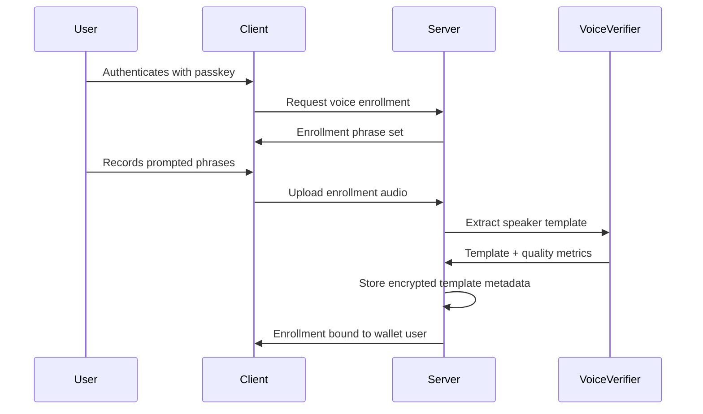
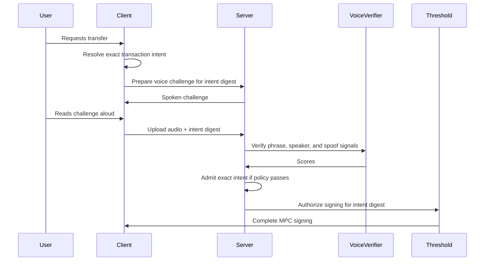

# Voice Biometrics And Spoken Intent

Status: exploratory design spec.

This document explores voice-based authentication for wallet signing sessions
and physical robotics command authorization. It is a product and architecture
sketch, not an implementation commitment.

## Purpose

Voice authentication should be evaluated as a step-up method for MPC wallet
signing. The strongest version combines three checks:

1. The user receives a short-lived challenge phrase over an existing
   out-of-band channel.
2. Speech recognition verifies that the recorded audio contains the exact
   challenge phrase.
3. Speaker verification compares the recorded voice to an enrolled voice
   template for the wallet user.

The more interesting form binds the spoken phrase to one concrete signing
intent, such as "send 100 USDC to Tom". The server should authorize a narrowly
scoped signing capability for the exact intent digest that the user spoke.

For robotics, the same primitive can act as an authority filter in a shared
physical environment. A robot may hear commands from many nearby people. It
should execute privileged commands only when the speaker, command, role,
workspace state, and safety controller all authorize that exact action.

## Goals

1. Add a future step-up method that is comparable to Email OTP in product
   posture and stronger than Email OTP for some account-takeover cases.
2. Bind user intent to the exact transaction or session policy that will be
   signed.
3. Keep transaction parsing deterministic by resolving natural-language labels,
   assets, chains, amounts, and addresses before the voice challenge is issued.
4. Keep biometric verification isolated at authentication boundaries.
5. Treat raw audio and speaker templates as sensitive personal information.
6. Preserve passkey as the highest-assurance authentication path.
7. Explore physical robotics cases where voice is safer and less awkward than
   requiring the operator to touch a robot or place their face near it.
8. Keep robot safety independent from voice identity. Authorized speakers cannot
   override emergency stops, tool guards, human-detection zones, or other safety
   interlocks.

## Non-Goals

1. Replacing passkeys as the preferred signing-session authenticator.
2. Allowing free-form natural language to directly construct transactions.
3. Treating a voice match as a deterministic cryptographic proof.
4. Storing raw enrollment or authentication audio indefinitely.
5. Sharing voice templates across projects, relying parties, wallets, or users.
6. Supporting legacy behavior during an exploratory prototype.
7. Treating voice biometrics as a safety-rated robot control.
8. Gating emergency stop, pause, or other protective actions behind identity
   checks.

## External Guidance

Voice biometrics are probabilistic and have a materially different assurance
profile from passkeys. NIST SP 800-63B-4 limits the role of biometrics in remote
authentication, requires biometrics to be paired with a physical authenticator
in its authentication model, and explicitly excludes voice biometric comparison
from that model:

https://pages.nist.gov/800-63-4/sp800-63b.html#use-of-biometrics

FIDO/passkey systems keep biometric verification local to the user's device and
send only a cryptographic assertion to the server:

https://fidoalliance.org/specifications/

This project can still experiment with server-side voice verification, but the
assurance label should remain below passkey unless the design is backed by a
device-bound cryptographic key.

Robotics deployments also need a separate safety case. ISO 10218-1:2025 covers
industrial robot safety requirements, and ISO/TS 15066:2016 supplements
collaborative robot application safety:

https://www.iso.org/standard/73933.html

https://www.iso.org/standard/62996.html

## Terms

| Term | Meaning |
| --- | --- |
| Spoken challenge | The exact phrase the user must speak for one authorization attempt. |
| Voice template | Enrolled speaker representation derived from prior voice samples. |
| Speaker verification | Probabilistic comparison of a new recording against a stored voice template. |
| Phrase verification | Speech-to-text or constrained ASR check that the user spoke the expected challenge. |
| Intent digest | Hash of the canonical signing intent and challenge context. |
| Spoken intent | Human-readable phrase derived from the signing intent and bound to the intent digest. |
| Voice authorization | Server-side result that permits one exact signing intent or a narrow bounded session. |
| Authority filter | Authentication and policy layer that decides whether a speaker may issue a command. |
| Robot command intent | Canonical command object derived from a constrained command grammar and current robot state. |
| Safety controller | Independent robot safety layer that decides whether an authorized command can execute safely. |

## Threat Model

The design should assume attackers may:

1. Control the app session after phishing or malware.
2. Compromise the user's email or SMS channel.
3. Record the user's voice from calls, videos, meetings, or voicemails.
4. Generate synthetic speech from public or stolen samples.
5. Replay a prior recording into the microphone or upload path.
6. Try many noisy samples to find a permissive matching threshold.
7. Modify transaction fields after the user has approved a generic session.
8. Steal server-side voice templates or stored authentication artifacts.
9. Stand near a robot and issue commands meant to sound plausible.
10. Replay or synthesize an authorized operator's voice over a speaker.
11. Confuse speaker diarization in a room with multiple simultaneous talkers.
12. Issue a valid command while the robot is in an unsafe tool or workspace
    state.

Voice verification helps when the attacker has the out-of-band challenge but
cannot convincingly reproduce the enrolled user's voice for the live phrase.
It does not remove the need for rate limits, replay resistance, transaction
binding, template protection, explicit consent, and fallback auth methods.

## Authentication Posture

Voice should be modeled as its own method, separate from Email OTP and passkey:

```ts
type StepUpMethod =
  | 'passkey'
  | 'email_otp'
  | 'voice_challenge';
```

Voice has two sub-checks:

```ts
type VoiceChallengeCheck =
  | {
      kind: 'phrase_match';
      challengeId: VoiceChallengeId;
      transcript: SpokenChallengeTranscript;
    }
  | {
      kind: 'speaker_match';
      enrollmentId: VoiceEnrollmentId;
      templateVersion: VoiceTemplateVersion;
      score: VoiceMatchScore;
    };
```

A successful voice flow requires both checks plus anti-spoof, freshness, and
policy validation:

```ts
type VoiceAuthorization =
  | {
      kind: 'single_intent';
      method: 'voice_challenge';
      walletId: WalletId;
      subjectId: WalletSubjectId;
      intentDigest: IntentDigest;
      challengeId: VoiceChallengeId;
      enrollmentId: VoiceEnrollmentId;
      expiresAt: IsoDateTime;
    }
  | {
      kind: 'bounded_session';
      method: 'voice_challenge';
      walletId: WalletId;
      subjectId: WalletSubjectId;
      allowedIntentDigests: IntentDigest[];
      maxTotalValueUsd: DecimalString;
      challengeId: VoiceChallengeId;
      enrollmentId: VoiceEnrollmentId;
      expiresAt: IsoDateTime;
    };
```

`single_intent` is the preferred shape for transaction signing. It prevents a
valid voice check from becoming broad signing authority that malware can spend
on a different operation.

## Transaction Intent Binding

The client must resolve the requested operation into exact transaction fields
before the voice challenge is issued. A phrase like "send 100 USDC to Tom" is
acceptable only after `Tom`, `USDC`, chain, token address, amount units, and
recipient address have all resolved to canonical values.

Example structured intent:

```ts
type VoiceTransferIntent = {
  kind: 'erc20_transfer';
  walletId: WalletId;
  subjectId: WalletSubjectId;
  chainTarget: ThresholdEcdsaChainTarget;
  chainId: number;
  tokenAddress: EvmAddress;
  tokenSymbol: TokenSymbol;
  amountBaseUnits: DecimalString;
  displayAmount: DecimalString;
  recipientAddress: EvmAddress;
  recipientLabel: ContactLabel;
  nonce: IntentNonce;
  expiresAt: IsoDateTime;
};
```

The digest should cover a domain separator and canonical encoding:

```text
intentDigest = HASH(
  "seams.voice_intent.v1" ||
  canonicalEncode(VoiceTransferIntent) ||
  voiceChallengeNonce ||
  voiceChallengeExpiresAt
)
```

The spoken phrase should include human-checkable details and a short
digest-derived code:

```text
Authorize sending 100 USDC on Base to Tom, address ending 7F3A.
Confirmation words: walking cloud river 482913.
```

The server accepts the voice authorization only for a transaction whose
canonical intent recomputes the same digest. If the recipient, amount, token,
chain, wallet, subject, nonce, expiry, or challenge changes, the digest changes
and the voice authorization is invalid.

## Physical Robotics Use Case

Voice biometrics are a better fit for physical robots than many wallet flows.
TouchID and FaceID assume the user can safely approach a trusted device and
perform a close-range ceremony. A cooking robot, shop robot, cleaning robot, or
tool-using arm may be hot, sharp, moving, contaminated, or surrounded by people.
The operator may need to stay outside the work envelope while still giving
commands.

The robotics design should treat voice as command authority, then let the robot
safety system decide execution:

```text
room audio
  -> wake word or push-to-talk gate
  -> speaker diarization
  -> speech-to-text
  -> constrained command parser
  -> speaker verification
  -> role and policy check
  -> workspace and robot-state safety check
  -> exact command execution
```

Emergency and protective commands should be available to anyone:

1. "Stop", "pause", "freeze", and physical emergency-stop buttons bypass voice
   identity.
2. Privileged resume, tool activation, mode changes, material handling, and
   task reassignment require a recognized speaker with the right role.
3. Dangerous commands require explicit spoken intent, a fresh command digest,
   safe workspace state, and safety-controller admission.

Example command policy:

```text
Any nearby speaker:
  "Robot, stop."

Enrolled kitchen operator:
  "Robot, resume chopping carrots."

Enrolled maintenance operator:
  "Robot, enter blade-cleaning mode."
```

The robot should resolve a spoken command into a canonical intent before acting:

```ts
type RobotCommandIntent =
  | {
      kind: 'protective_stop';
      robotId: RobotId;
      command: 'stop' | 'pause' | 'freeze';
      observedAt: IsoDateTime;
    }
  | {
      kind: 'privileged_command';
      robotId: RobotId;
      command: RobotPrivilegedCommand;
      taskId: RobotTaskId;
      toolId: RobotToolId;
      workspaceZone: RobotWorkspaceZone;
      authorizedSpeakerId: PersonId;
      speakerRole: RobotOperatorRole;
      observedSafetyStateDigest: SafetyStateDigest;
      nonce: IntentNonce;
      expiresAt: IsoDateTime;
    };
```

The robot command digest should cover both the command and the observed safety
state:

```text
robotCommandDigest = HASH(
  "seams.robot_voice_intent.v1" ||
  canonicalEncode(RobotCommandIntent) ||
  voiceChallengeNonce ||
  voiceChallengeExpiresAt
)
```

For example:

```text
Alice says: "Robot, resume chopping carrots."

Parsed intent:
  robotId = kitchen-arm-1
  command = resume_task
  taskId = chop-carrots
  toolId = knife
  workspaceZone = kitchen-counter
  authorizedSpeakerId = alice
  observedSafetyStateDigest = 0x...
```

Execution requires all of these conditions:

1. The phrase parser maps the command to one exact allowed command.
2. The speaker matches an enrolled authorized operator.
3. The role policy permits that operator to issue the command.
4. The current robot and workspace state still match the safety digest.
5. The independent safety controller admits the action.
6. The command digest has not been consumed.

The robot should reject ambiguous commands. "Clean that" or "move it over
there" needs clarification before any privileged command is constructed. If the
command affects tools, heat, pressure, motion, or people nearby, the robot
should use a confirmation phrase tied to the canonical command:

```text
"Confirm resume chopping carrots with knife in kitchen zone A. Code river 482913."
```

### Robotics Auth State

Robot command authorization should keep identity, parsed command, and safety
state separate:

```ts
type RobotVoiceAuthorization =
  | {
      kind: 'protective_command';
      robotId: RobotId;
      command: 'stop' | 'pause' | 'freeze';
      issuedAt: IsoDateTime;
    }
  | {
      kind: 'privileged_command';
      robotId: RobotId;
      authorizedSpeakerId: PersonId;
      speakerRole: RobotOperatorRole;
      commandDigest: RobotCommandDigest;
      enrollmentId: VoiceEnrollmentId;
      safetyStateDigest: SafetyStateDigest;
      expiresAt: IsoDateTime;
    };
```

The robot controller should accept `RobotVoiceAuthorization` only for a command
whose current canonical intent recomputes the same `commandDigest`. The safety
controller remains the final gate before motion, heat, pressure, cutting,
gripping, dispensing, or mode changes.

### MPC Robot Command Foundation

The current MPC wallet architecture is a useful foundation for robot command
authorization if robot commands are modeled like transaction intents. The robot
owns one local share, the server or fleet service owns the coordinating share,
and neither side can authorize privileged robot action alone.

Recommended topology:

```text
robot:
  local MPC share
  device identity key or secure storage
  microphone and local safety-state observation
  local command parser for constrained commands

server or fleet service:
  coordinating MPC share
  voice enrollment policy
  command policy
  revocation, audit, and rate limits

phone or watch:
  out-of-band OTP or approval prompt
  displays the exact command summary and digest-derived code
```

A dangerous command should require multiple independent facts:

1. The robot heard and parsed one exact command intent.
2. The speaker matched an enrolled authorized operator.
3. The phone, watch, or other out-of-band channel confirmed the same command
   digest.
4. The robot contributed its local MPC share.
5. The server or fleet service admitted the command and contributed its share.
6. The current safety state still matches the command's safety digest.
7. The safety controller admitted the action immediately before execution.

Example flow:

```text
Alice says: "Robot, resume chopping carrots."
Robot computes RobotCommandIntent and robotCommandDigest.
Watch displays: "Resume chopping carrots, knife, kitchen zone A."
Alice approves or reads a digest-derived OTP.
Server co-signs only robotCommandDigest.
Robot co-signs with its local share.
Safety controller admits or rejects execution.
```

This is materially stronger than local voice verification alone. A synthetic
voice attack still needs the phone/watch confirmation, the robot's local share,
server policy admission, a fresh command digest, and a safe robot state. A
stolen robot alone cannot mint broad command authority if the server revokes its
device identity or refuses to co-sign.

WASM helps make this portable across browser, server, and edge Linux robot
stacks. The portable pieces are canonical intent encoding, digest calculation,
threshold crypto helpers, policy evaluation, and deterministic test fixtures.
Very small MCUs may need native bindings or a reduced runtime if a full WASM
engine is too heavy.

### Reachy Mini Payment MVP

Reachy Mini is a good proof-of-concept target for a robot wallet because it is
small, expressive, networked, and already exposes the right media primitives.
The Wireless version runs onboard on a Raspberry Pi CM4 with WiFi, microphone
array, speaker, camera, and enough memory for a local app plus a wallet sidecar.
The SDK exposes camera frames, 16 kHz audio samples, speech detection, and
direction-of-arrival helpers.

MVP command:

```text
"Reachy, send 1 USDC to Bob."
```

MVP behavior:

```text
Reachy hears command
  -> transcribes exact grammar
  -> verifies speaker
  -> resolves Bob from a local allowlist
  -> builds VoiceTransferIntent
  -> computes intentDigest
  -> asks phone/watch/server for OTP or approval
  -> MPC signs only that digest
  -> broadcasts testnet transfer
  -> speaks final status
```

Initial scope should stay deliberately narrow:

1. Use testnet USDC, a mock ERC-20, or a tiny capped mainnet amount.
2. Support one command grammar: `send <amount> usdc to <contact>`.
3. Support a fixed contact allowlist, for example `Bob -> 0x...`.
4. Reject raw addresses spoken aloud.
5. Reject swaps, approvals, contract calls, recurring payments, and arbitrary
   wallet commands.
6. Require out-of-band OTP or approval that displays the exact recipient,
   amount, token, chain, and address suffix.
7. Require the MPC server to co-sign only the canonical `intentDigest`.
8. Add rate limits and a daily demo budget.

Recommended process split:

```text
Reachy Python app:
  audio capture
  camera access
  robot speech and gestures
  command loop

local wallet sidecar:
  command parser
  contact allowlist
  canonical intent encoder
  WASM threshold helper or local MPC client
  local robot share

server:
  coordinating MPC share
  OTP or approval issuance
  policy, rate limits, audit, and broadcast
  optional speaker-verification service
```

The first demo can fake speaker verification with a known local profile and
fixed threshold, then replace that fake verifier after the intent, OTP, MPC, and
broadcast path works end-to-end. The demo should make the robot speak the
canonical summary before asking for approval:

```text
"I heard: send 1 USDC on Base Sepolia to Bob, address ending 7F3A.
Approve on your phone or say cancel."
```

### Paid Guest Commands With x402

Reachy can use the same voice classification layer to separate owner commands
from guest commands. Owner voice enters the privileged wallet or robot command
flow. Unknown voices can receive a payment challenge for low-risk commands:

```text
Owner voice:
  "Reachy, send 1 USDC to Bob."
  -> owner voice match
  -> privileged wallet authorization

Guest voice:
  "Reachy, dance."
  -> no owner voice match
  -> low-risk payable command
  -> x402 Payment Required
  -> guest pays
  -> Reachy executes only that command digest
```

x402 is a good fit because the command service can behave like an HTTP
pay-per-use API. A request without payment receives HTTP `402 Payment Required`
with payment requirements. The paying client submits a payment proof, retries,
and receives the command execution result.

Reachy should translate the HTTP payment challenge into physical UX:

```text
"That command costs 0.10 USDC. Scan the code or open the link to pay."
```

Paid guest commands must be restricted to low-risk actions:

1. Allow gestures, dance, wave, speak a phrase, answer a public question, take a
   selfie, or play a sound.
2. Reject wallet transfers, admin settings, private data, contact access,
   enrollment, device binding, and safety-affecting commands.
3. Bind payment to one exact `RobotCommandDigest`.
4. Enforce maximum duration, queue length, cooldown, and daily earning caps.
5. Run the same safety and motion limits after payment.
6. Treat payment as command admission, never as robot ownership or broad
   control authority.

Domain shape:

```ts
type RobotCommandAdmission =
  | {
      kind: 'owner_authorized';
      speakerId: PersonId;
      commandDigest: RobotCommandDigest;
    }
  | {
      kind: 'payment_required';
      speakerClass: 'guest';
      commandDigest: RobotCommandDigest;
      price: {
        amount: DecimalString;
        asset: 'USDC';
        network: 'base' | 'base_sepolia';
      };
      expiresAt: IsoDateTime;
    }
  | {
      kind: 'paid_guest_authorized';
      payerAddress: EvmAddress;
      commandDigest: RobotCommandDigest;
      paymentReceiptId: PaymentReceiptId;
      expiresAt: IsoDateTime;
    };
```

Recommended command API:

```http
POST /robot/commands
```

```json
{
  "robotId": "reachy-mini-1",
  "command": "dance",
  "speakerClass": "guest",
  "commandDigest": "0x..."
}
```

If payment is required, the local sidecar or server returns `402 Payment
Required` with x402 payment requirements. The retry must carry a payment proof
for the same `commandDigest`; a payment for one command must not authorize a
different command, longer duration, different robot, or later replay.

## Flow

### Enrollment

Enrollment must happen after an existing strong authentication method, ideally
passkey. Enrollment records several prompted phrases to create a voice template.
The server stores only the minimum template data needed for future matching.



Enrollment rules:

1. Require explicit consent and a clear deletion path.
2. Require multiple samples across phrase variants.
3. Measure enrollment quality before binding the method.
4. Encrypt templates with a scoped server key.
5. Delete raw enrollment audio after template extraction unless the user
   explicitly opts into retention for support or model improvement.
6. Version template extractors and matching thresholds.

### Single-Intent Authorization



Server verification order:

1. Load the pending challenge by `challengeId`.
2. Reject expired, consumed, cancelled, or mismatched challenges.
3. Recompute `intentDigest` from canonical transaction fields.
4. Verify the spoken phrase matches the challenge.
5. Verify the speaker matches the enrolled template.
6. Verify anti-spoof and replay signals.
7. Apply attempt limits and risk policy.
8. Mark the challenge consumed before issuing signing authorization.
9. Authorize only the exact digest or exact bounded session policy.

## Domain State

Voice state should follow the same discriminated-union discipline used by the
signing engine.

```ts
type VoiceEnrollmentState =
  | {
      kind: 'not_enrolled';
      walletId: WalletId;
      subjectId: WalletSubjectId;
      enrollmentId?: never;
      templateVersion?: never;
    }
  | {
      kind: 'enrollment_pending';
      walletId: WalletId;
      subjectId: WalletSubjectId;
      enrollmentId: VoiceEnrollmentId;
      phraseSetId: VoicePhraseSetId;
      expiresAt: IsoDateTime;
      templateVersion?: never;
    }
  | {
      kind: 'enrolled';
      walletId: WalletId;
      subjectId: WalletSubjectId;
      enrollmentId: VoiceEnrollmentId;
      templateVersion: VoiceTemplateVersion;
      enrolledAt: IsoDateTime;
      disabledAt?: never;
    }
  | {
      kind: 'disabled';
      walletId: WalletId;
      subjectId: WalletSubjectId;
      enrollmentId: VoiceEnrollmentId;
      templateVersion: VoiceTemplateVersion;
      disabledAt: IsoDateTime;
    };
```

```ts
type VoiceChallengeState =
  | {
      kind: 'issued';
      challengeId: VoiceChallengeId;
      walletId: WalletId;
      subjectId: WalletSubjectId;
      intentDigest: IntentDigest;
      spokenChallenge: SpokenChallenge;
      expiresAt: IsoDateTime;
      consumedAt?: never;
      failureReason?: never;
    }
  | {
      kind: 'consumed';
      challengeId: VoiceChallengeId;
      walletId: WalletId;
      subjectId: WalletSubjectId;
      intentDigest: IntentDigest;
      spokenChallenge: SpokenChallenge;
      expiresAt: IsoDateTime;
      consumedAt: IsoDateTime;
      failureReason?: never;
    }
  | {
      kind: 'failed';
      challengeId: VoiceChallengeId;
      walletId: WalletId;
      subjectId: WalletSubjectId;
      intentDigest: IntentDigest;
      spokenChallenge: SpokenChallenge;
      expiresAt: IsoDateTime;
      consumedAt?: never;
      failureReason: VoiceChallengeFailureReason;
    };
```

```ts
type VoiceChallengeFailureReason =
  | 'expired'
  | 'phrase_mismatch'
  | 'speaker_mismatch'
  | 'spoof_detected'
  | 'too_many_attempts'
  | 'intent_digest_mismatch'
  | 'policy_denied'
  | 'verifier_unavailable';
```

Raw server records, request bodies, worker responses, ASR transcripts, and
vendor score payloads should be parsed once at their boundary into these
internal types. Core signing logic should accept `VoiceAuthorization`, never raw
audio metadata, raw score objects, broad optional bags, or vendor payloads.

## Storage Ownership

| Store | Owns |
| --- | --- |
| Client memory | Active microphone recording before upload, UI prompt state, local recording errors |
| Server voice enrollment store | Encrypted templates, enrollment metadata, extractor version, threshold version |
| Server challenge store | Pending challenge, intent digest, expiry, attempt count, consumed marker |
| Voice verifier runtime | Temporary audio processing, transcript, speaker score, spoof score |
| Threshold session store | Exact signing authorization derived from successful voice verification |
| Audit log | Non-sensitive event metadata, digest, method, scores bucketed by policy band |

Raw authentication audio should be deleted immediately after verification unless
there is a separate explicitly consented retention mode. Audit logs should avoid
storing transcripts beyond the expected challenge text, raw scores when coarse
bands are sufficient, and any audio-derived biometric material.

## Policy

Voice policy should be explicit per operation type:

```ts
type VoiceStepUpPolicy =
  | {
      kind: 'disabled';
      reason: VoicePolicyDisabledReason;
    }
  | {
      kind: 'single_intent_allowed';
      maxValueUsd: DecimalString;
      requireAddressSuffixInPhrase: true;
      requireAntiSpoof: true;
      maxAttempts: number;
      expiresInSeconds: number;
    }
  | {
      kind: 'bounded_session_allowed';
      maxTotalValueUsd: DecimalString;
      maxIntentCount: number;
      requireAntiSpoof: true;
      maxAttempts: number;
      expiresInSeconds: number;
    };
```

Initial policy recommendation:

1. Allow voice for single-intent transaction authorization only.
2. Require passkey for enrollment, template reset, template deletion, and
   high-value policy changes.
3. Use voice for low-value transfers, recovery assistance, or explicit
   user-selected accessibility flows.
4. Require passkey or a stronger method for key export, authenticator binding,
   email/phone changes, and unrestricted signing sessions.
5. Disable voice automatically after repeated spoof, mismatch, or risk failures
   until the user reauthenticates with passkey.
6. For robotics, allow unauthenticated protective stops and require voice
   authority plus safety-controller admission for privileged robot commands.
7. Reject privileged robot commands when multiple speakers overlap or speaker
   diarization is uncertain.
8. For dangerous robot commands, require an out-of-band confirmation on a phone,
   watch, or operator console bound to the same command digest.
9. For offline robot operation, issue only bounded local authority with short
   expiries, explicit command classes, and no ability to mint unrestricted
   sessions.

## Matching And Verification

The implementation should use a proven speaker-verification system.
Hand-written Fourier-transform matching is too brittle for this role. Modern
systems usually:

1. Convert audio to frame features such as log-mel spectrograms or MFCC-like
   features.
2. Run a speaker model that produces a fixed-size embedding.
3. Compare the new embedding against the enrolled template with a calibrated
   similarity score.
4. Run separate anti-spoof detection for replayed or synthetic audio.
5. Combine scores through fixed policy thresholds.

The threshold should be configured per model version and deployment risk. It
should not be adjusted per user to force acceptance. Per-user quality metadata
can decide whether enrollment is allowed, whether more samples are required, or
whether voice is unavailable for that user.

Verification result should be typed:

```ts
type VoiceVerifierResult =
  | {
      kind: 'accepted';
      challengeId: VoiceChallengeId;
      phrase: PhraseMatchResult;
      speaker: SpeakerMatchResult;
      spoof: SpoofDetectionResult;
      verifierVersion: VoiceVerifierVersion;
    }
  | {
      kind: 'rejected';
      challengeId: VoiceChallengeId;
      reason: VoiceChallengeFailureReason;
      phrase?: PhraseMatchResult;
      speaker?: SpeakerMatchResult;
      spoof?: SpoofDetectionResult;
      verifierVersion: VoiceVerifierVersion;
    };
```

## UX Constraints

Voice UX must reduce ambiguity:

1. Display the exact canonical transaction summary before recording.
2. Include chain, amount, token, recipient label, and address suffix in the
   spoken phrase.
3. Use short confirmation words plus digits derived from the digest.
4. Avoid homophones and ambiguous numbers in the generated challenge.
5. Require rerecording when the transcript is uncertain.
6. Provide non-voice fallback for illness, noisy environments, privacy, and
   accessibility.
7. Never ask the user to speak secret recovery material or private keys.
8. For robots, keep operators outside unsafe work envelopes and use
   far-field-friendly prompts.
9. For robots, make rejected privileged commands audibly and visibly clear
   without blocking emergency stop.

The UI should present voice as an explicit approval operation. Passive capture,
background capture, or automatic face/voice checks should not establish signing
intent.

## Open Questions

1. Should all voice matching be server-side, or should mobile clients support
   local voice verification plus a device-bound signature?
2. Which vendor or open model can satisfy latency, anti-spoof, privacy, and
   audit requirements?
3. What value limits are acceptable for voice-only single-intent signing?
4. Should the spoken phrase include the full contact label, the address suffix,
   or both?
5. How should voice enrollment interact with project-level bring-your-own-auth
   policy?
6. What deletion and export rights apply to voice templates in each deployment
   region?
7. Which support flow restores access when voice is disabled after false
   rejects?
8. Which robot commands are protective, low-risk, privileged, or dangerous?
9. Which safety-state fields must be included in `SafetyStateDigest` for each
   robot application?
10. How should the robot handle command authority when several enrolled people
    speak near the robot?
11. Should robot-side verification run locally for latency and availability, or
    use a server verifier for centralized policy and template management?
12. Which robot hardware profiles can run the WASM threshold runtime directly,
    and which need native or MCU-specific ports?
13. What is the minimum out-of-band approval surface for robots: phone, watch,
    local console, hardware pendant, or all of these?
14. How should fleet revocation work when a robot is reported stolen or fails
    remote attestation?
15. Should the Reachy Mini MVP run the wallet sidecar onboard, on a paired
    laptop, or on a local network service during the first demo?
16. Which test network and mock USDC contract should be used for the payment
    demo?
17. Should Reachy use camera presence only for UX feedback, or should face
    recognition become a later step-up signal?
18. Which Reachy guest commands are safe enough to monetize through x402?
19. Should paid guest command revenue go to the robot wallet, the owner wallet,
    or a split policy?
20. How should Reachy present x402 payment requirements: QR code, local
    dashboard link, spoken URL, nearby phone handoff, or all of these?
21. Which x402 facilitator, network, and asset should the demo use?

## Prototype Plan

1. Add internal domain types for `voice_challenge` without exposing a public
   auth method.
2. Implement a fake verifier for deterministic local tests.
3. Add intent-digest challenge generation for one EVM-family transfer shape.
4. Wire a server-only verification boundary that returns typed
   `VoiceAuthorization`.
5. Gate threshold signing on `single_intent` digest equality.
6. Add type fixtures rejecting invalid voice lifecycle states.
7. Run an internal experiment with recorded fixtures before enabling user data.
8. Add a real verifier behind a feature flag after privacy and security review.
9. Add a robotics-only command-intent prototype with a fake verifier, a
   constrained command grammar, and a mock safety controller.
10. Test protective stop bypass, privileged command rejection, command digest
    equality, speaker mismatch, overlapping-speaker rejection, and stale safety
    state rejection.
11. Add a robot command MPC prototype where the fake server co-signs only a
    matching `RobotCommandDigest`.
12. Add a fake phone/watch OTP approval tied to the same digest.
13. Run the portable crypto and digest path through the existing WASM build, then
    document any embedded runtime limits.
14. Build a Reachy Mini demo app for `send <amount> usdc to <contact>`.
15. Add a local wallet sidecar that resolves contacts, encodes
    `VoiceTransferIntent`, computes `intentDigest`, and calls the MPC client.
16. Use testnet USDC or a mock ERC-20 with a fixed demo budget.
17. Make Reachy speak the canonical summary before OTP approval and final status
    after broadcast.
18. Add a paid guest-command endpoint that returns x402 `402 Payment Required`
    for low-risk commands from unknown voices.
19. Add a testnet x402 payment verification path bound to
    `RobotCommandDigest`.
20. Add Reachy UX for paid guest commands: speak price, show QR or dashboard
    link, execute after payment, and speak final status.

## Static Checks And Tests

The first code change should include type fixtures for invalid state
construction:

1. `consumedAt` cannot appear on `issued`.
2. `templateVersion` cannot appear on `not_enrolled`.
3. `disabledAt` cannot appear on `enrolled`.
4. `VoiceAuthorization.kind === 'single_intent'` requires one `intentDigest`.
5. `VoiceAuthorization.kind === 'bounded_session'` requires explicit bounds.
6. Core signing admission cannot accept raw verifier payloads.
7. A transaction with any changed canonical field fails digest equality.

Runtime tests should cover:

1. Expired challenge rejection.
2. Replay rejection after consumed challenge.
3. Phrase mismatch rejection.
4. Speaker mismatch rejection.
5. Spoof rejection.
6. Intent digest mismatch rejection.
7. Successful single-intent authorization for exact digest.
8. Denial for key export and unrestricted signing sessions under initial policy.
9. Protective robot commands bypass identity checks.
10. Privileged robot commands require speaker, role, digest, and safety
    admission.
11. Robot commands fail when the safety-state digest changes before execution.
12. Reachy payment commands reject unknown contacts, raw addresses, unsupported
    tokens, unsupported chains, and amounts above the demo cap.
13. Reachy payment approval fails when the phone/watch OTP is bound to a
    different `intentDigest`.
14. Paid guest commands reject privileged command kinds even after payment.
15. Paid guest command payment proof is valid only for the exact
    `RobotCommandDigest`.
16. Paid guest commands respect queue, cooldown, and duration caps.
