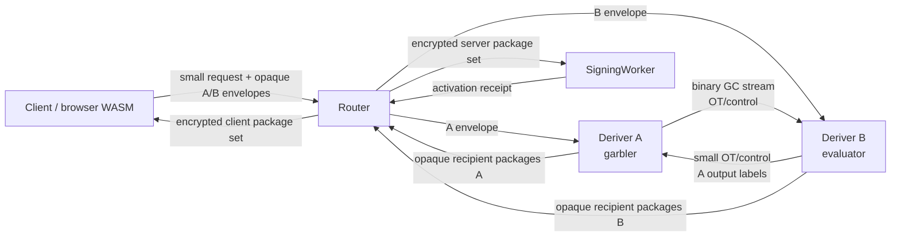

# Streaming Yao for Deriver A and Deriver B

Date created: July 10, 2026

Status: approved replacement and current implementation plan. Phase 0 closed on
July 10, 2026. Streaming Yao is the sole Ed25519 split-derivation target.
Production remains blocked until Phase 6A selects the strongest reviewed
security profile that meets the latency SLO and the separate-account,
recipient-output, constant-time, exact-claim, and independent-review gates in
this document pass.

Companion documents:

- [Router A/B solution refactor](./router-a-b-sol-refactor.md)
- [Router A/B specification](./router-a-b-SPEC.md)
- [Router A/B deployment](./router-a-b-deployment.md)
- [Optimization 8](../crates/ed25519-hss/docs/optimization-8.md)
- Legacy/reference-oracle input:
  [Ed25519 derivation specification](../crates/ed25519-hss/specs/derivation.md)
- Legacy/reference-oracle input:
  [Ed25519 protocol specification](../crates/ed25519-hss/specs/protocol.md)

Primary external references:

- [Half-Gates](https://eprint.iacr.org/2014/756)
- [Authenticated Garbling and Efficient Maliciously Secure Two-Party Computation](https://doi.org/10.1145/3133956.3134053)
- [Optimizing Authenticated Garbling for Faster Secure Two-Party Computation](https://doi.org/10.1007/978-3-319-96878-0_13)
- [Ferret: Fast Extension for Correlated OT with Small Communication](https://eprint.iacr.org/2020/924)
- [Fast Cut-and-Choose-Based Protocols for Malicious and Covert Adversaries](https://eprint.iacr.org/2013/079)
- [Dual Execution: Optimization and Leakage Analysis](https://www.usenix.org/conference/usenixsecurity16/technical-sessions/presentation/rindal)
- [Swanky](https://github.com/GaloisInc/swanky)
- [EMP-ag2pc](https://github.com/emp-toolkit/emp-ag2pc)
- [Bristol Fashion circuits](https://nigelsmart.github.io/MPC-Circuits/)
- [A Unified Framework for Succinct Garbling from HSS](https://eprint.iacr.org/2025/442)
- [Cloudflare Workers pricing](https://developers.cloudflare.com/workers/platform/pricing/)
- [Cloudflare Workers limits](https://developers.cloudflare.com/workers/platform/limits/)
- [Cloudflare Service Bindings](https://developers.cloudflare.com/workers/runtime-apis/bindings/service-bindings/)
- [Cloudflare Streams](https://developers.cloudflare.com/workers/runtime-apis/streams/)
- [Cloudflare Request and FixedLengthStream behavior](https://developers.cloudflare.com/workers/runtime-apis/request/)
- [Cloudflare Durable Objects pricing](https://developers.cloudflare.com/durable-objects/platform/pricing/)
- [Cloudflare Containers](https://developers.cloudflare.com/containers/)

## Executive Decision

Implement one fixed-function Streaming Yao protocol between Deriver A and
Deriver B for the exact Ed25519 seed-to-scalar derivation. Deriver A is the
garbler. Deriver B is the evaluator. The role assignment is fixed by the
protocol and cannot be selected by a request.

The large garbled-circuit stream travels directly between A and B:

```text
Client -> Router: compact public request and two small HPKE envelopes
Router -> A: compact A envelope
Router -> B: compact B envelope
A <-> B: OT/control messages and the binary garbled-circuit stream
A -> Router: small encrypted A output shares
B -> Router: small encrypted B output shares
Router -> recipients: opaque recipient package sets
```

The client never uploads or downloads the approximately 2 MiB garbled circuit.
The Router never proxies, buffers, logs, or persists it. Normal signing remains
outside the Deriver path after activation.

The preferred strict production profile uses independently administered
Cloudflare Worker accounts for A and B. Phase 6A may select the documented
platform fallback while preserving independent administrative domains and the
same cryptographic claim. Same-account Service Bindings provide a valuable
latency lower bound and runtime-compromise containment. They do not provide
independent deployer or account security. Same-account deployment is limited to
local development, staging, and performance experiments.

Plain free-XOR/half-gates Yao supplies the latency baseline. Fully active
security remains the preferred production result. Phase 6A may select an
operationally hardened passive construction when every reviewed active profile
misses the approved online-latency SLO. The selected construction, its exact
corruption model, and every excluded attack are frozen in the signed release
manifest and capability document.

If Streaming Yao passes the release gates, delete the Ed25519-HSS simulator,
succinct-HSS placeholders, generic threshold service, old routes, client
garbler/evaluator sessions, and their legacy fixtures. There will be one
Ed25519 split-derivation implementation.

ECDSA also remains strict Router A/B. It uses threshold-PRF derivation and
additive secp256k1 scalar shares under its separately specified strict protocol.
ECDSA has no dependency on the Ed25519 Yao crate or stream and must finish its
migration before `ThresholdSigningService` is deleted.

## Security-Performance 80/20 Priority

User-visible latency is the primary product selection criterion. Phase 6A
selects the strongest coherent security profile that meets the signed p95 and
p99 SLO on the real independent-domain topology. Total CPU, preprocessing,
storage, and attempted-ceremony cost remain release inputs, while work moved
fully offline may be accepted when it preserves the online SLO.

Hardening is evaluated as complete reviewed profiles. Individual mechanisms
cannot be combined into an inflated security claim. Malicious OT without
garbling correctness, for example, does not establish security against a
malicious garbler.

| Profile                                 | Composition                                                                                                                                                                                                                      | Eligible production claim                                                                                                                                     |
| --------------------------------------- | -------------------------------------------------------------------------------------------------------------------------------------------------------------------------------------------------------------------------------- | ------------------------------------------------------------------------------------------------------------------------------------------------------------- |
| P0 — operationally hardened passive Yao | Half-Gates/free-XOR, ordinary reviewed OT, independent administrators, pinned artifacts, fresh per-ceremony material, authenticated transcripts, strict framing, replay controls, recipient encryption, and public output checks | privacy and correctness while both Derivers execute the approved protocol; confidentiality against passive compromise of one Deriver; no active-Deriver claim |
| P1 — reviewed targeted hardening        | P0 plus a complete reviewer-approved set of malicious OT, input consistency, selective-failure, provenance, or output-authentication mechanisms                                                                                  | only the exact one-sided or attack-specific claim proved for the complete composition                                                                         |
| P2 — prepositioned full active          | reviewed active compiler plus malicious OT, provenance, authenticated private outputs, correctness-with-abort, and one-use prepositioning                                                                                        | Router plus at most one malicious Deriver, subject to the frozen assumptions                                                                                  |
| P3 — just-in-time full active           | the P2 security composition with preprocessing on the online path                                                                                                                                                                | same cryptographic claim as P2, with higher expected online latency                                                                                           |

Phase 6A first attempts P2, then any coherent P1 profile, then P0. P3 is a
correctness and total-cost comparator unless it independently meets the online
SLO. Dual execution remains disqualified because its adversarial leakage can
compound across retries involving long-lived inputs.

The following controls are mandatory for every selected profile because they
provide high security value with bounded expected latency:

- independent A and B administrative domains in production;
- pinned protocol, circuit, schedule, binary, and deployment-manifest digests;
- mutually authenticated role-bound transport and signed transcripts;
- strict binary framing, size, sequence, timeout, and replay enforcement;
- fresh labels, OT state, randomness, nonces, and session domains;
- recipient-bound encryption and public output-share consistency checks;
- export authorization, epoch binding, rate limits, and abuse controls;
- constant-time review for the selected cryptographic kernels and platform.

Phase 6A freezes exactly one security profile and one platform profile. Public
requests contain no security-level selector, downgrade field, or backend
negotiation. Losing implementations are deleted before product integration.

## Critical Risk Register

Phase 6A owns the critical-path decision record. Each owner must close the
listed tripwire or explicitly activate its fallback before dependent work
starts.

| Risk                                          | Owner                                     | Tripwire                                                                                 | Required fallback                                                                |
| --------------------------------------------- | ----------------------------------------- | ---------------------------------------------------------------------------------------- | -------------------------------------------------------------------------------- |
| No acceptable active construction             | protocol lead and independent reviewer    | leakage, unsupported composition, rejected assumptions, or active profile misses the SLO | evaluate a coherent P1 profile, then P0 with an explicitly reduced claim         |
| No reviewable implementation path             | Rust crypto lead and independent reviewer | no auditable build-or-port plan inside the approved effort budget                        | select the next security profile; stop only when P0 also lacks a reviewable path |
| Worker garbling primitive is unsafe           | constant-time reviewer and Worker lead    | compiled WASM review finds secret-dependent memory or control flow                       | move both roles to separate-account Containers or independent native VMs         |
| Worker latency, memory, or round budget fails | performance owner and protocol lead       | Phase 6A projection exceeds reissued release budgets                                     | compare prepositioning, the next security profile, and the platform ladder       |
| Security claim exceeds selected profile       | product-security owner and reviewer       | capability or release text claims an attack class absent from the proof                  | stop release and reduce the claim or select a stronger measured profile          |
| Durable state dominates the critical path     | Cloudflare runtime owner                  | measured transaction graph misses the reissued p95 or p99 budget                         | coalesce safe local transitions, remove network waits, then change platform      |
| Ticket burning enables cost exhaustion        | abuse and operations owner                | wallet, organization, tenant, or global burn budget is exceeded                          | throttle admission, open the circuit breaker, and suspend preprocessing          |
| Epoch state can roll back                     | release-security owner                    | either role accepts an epoch below the independent signed floor                          | stop issuance and rotate the entire base-OT channel epoch                        |
| Circuit rollout revives stale tickets         | release owner                             | an old digest can activate after its floor or reappear after restore                     | stop issuance, destroy stale material, and complete only the bounded drain set   |

## Platform Fallback Ladder

The independent-administrator requirement and exact-claim requirement are
fixed. Phase 6A chooses the first feasible execution platform for each serious
security profile in this order:

1. separate-account Cloudflare Workers;
2. separate-account Cloudflare Containers;
3. independently administered native services or VMs.

Each transition requires a new deployment profile, cost and placement
measurements, dependency and supply-chain review, constant-time and compiled
code review, erasure analysis, and independent approval. Containers and VMs
change the trusted computing base and operational model. Hardware acceleration,
including AES instructions, is measured and never assumed. Succinct HSS is
outside this fallback ladder.

Same-account Workers remain the development, staging, and transport lower-bound
profile for every selected construction.

## Normative Spec Extraction

This document tracks architecture, decisions, experiments, and phase status.
Frozen protocol material belongs in small versioned specifications. Continue
the existing `ideal-functionalities-v1.md` and `input-provenance-v1.md` pattern
with versioned specifications for:

- fixed circuit encodings, constants, KDFs, and golden vectors;
- the Phase 6A security-profile, construction, and assumption decision;
- the binary stream manifest and frame grammar;
- the selected session lifecycle, optional preprocessing-ticket lifecycle,
  epoch floor, and circuit rollout;
- approved deployment profiles and peer identity rules;
- the reissued release SLO and resource budgets.

CI regenerates all prose golden bytes and digests from
`tools/ed25519-yao-generator`, diffs them against the versioned specifications,
and fails on unexplained drift. The living plan references those artifacts and
does not become their sole normative source.

## Document Authority and Resolved Conflicts

The July 10, 2026 Phase 0 decision resolved these prior conflicts:

- `router-a-b-sol-refactor.md` classified Yao as a benchmark-only oracle and
  required genuine succinct HSS as the production implementation.
- `router-a-b-deployment.md` described same-account Cloudflare as a production
  profile.
- protocol identifiers and routes used HSS and `SignerA` / `SignerB`
  terminology for derivation roles.

The three implementation plans and the normative Router A/B documents were
checkpointed together when Phase 0 closed. From that checkpoint:

- this document is authoritative for the Ed25519 secure-computation backend;
- `router-a-b-sol-refactor.md` remains authoritative for the wider strict
  Router A/B and ECDSA migration;
- `router-a-b-SPEC.md` remains authoritative for product lifecycle and public
  route behavior;
- `router-a-b-deployment.md` remains authoritative for deployment mechanics,
  with separate accounts promoted to the strict production profile.

The July 10, 2026 performance-priority amendment supersedes the prior rule that
production must stop when full active security misses the SLO. Streaming Yao
remains the sole backend and independent A/B administration remains mandatory.
Phase 6A may now select P0, P1, P2, or P3 under the 80/20 policy. The Router and
formal-verification companion plans must be aligned with the selected profile
before their corresponding gates close.

No active, normative, capability, or release document may continue to advertise
the current HSS simulator as a succinct-HSS implementation. Historical
optimization records may retain dated descriptions of what was measured.

## Goal

Produce the exact Ed25519 derivation:

```text
d = LE32(y_client + y_server mod 2^256)
h = SHA-512(d)
a = clamp(h[0..32]) mod l
```

while preserving these custody rules during honest execution and against the
corruption class claimed by the selected profile:

```text
Deriver A never learns B inputs or a joined output.
Deriver B never learns A inputs or a joined output.
Router never learns either Deriver plaintext.
Client receives only x_client_base and an authorized seed export.
SigningWorker receives only x_server_base.
No server role reconstructs d or a.
```

The preferred P2/P3 production claim is:

> The Streaming Yao Router A/B ceremony provides privacy and
> correctness-with-abort against the Router plus at most one malicious Deriver,
> assuming independent A and B administrative domains, a reviewed actively
> secure two-party protocol, an approved proof binding each role input to its
> provisioned root and epoch, authenticated role-bound transport, one-use
> preprocessing, and no A+B collusion.

If Phase 6A selects P0, the production claim is reduced to:

> The Streaming Yao Router A/B ceremony provides privacy and correctness while
> both Derivers execute the approved protocol, and confidentiality against
> passive compromise of at most one Deriver, assuming independent A and B
> administrative domains, authenticated role-bound transport, fresh
> per-ceremony cryptographic material, and no A+B collusion. It provides no
> protection against an actively deviating Deriver.

P1 uses only the narrower corruption and attack-specific claim approved in its
decision record. Public capability text always identifies the selected profile
and its exclusions.

## Scope

In scope:

- Ed25519 registration, activation, recovery, refresh, and authorized export;
- exact seed-derived Ed25519 identity and export parity;
- a fixed circuit and fixed role assignment;
- just-in-time binary streaming;
- one-use OT and garbling preprocessing;
- optional prepositioning of one-use garbled circuits for lower online latency;
- same-account Cloudflare benchmarking;
- separate-account Workers as the preferred production transport, with
  Containers or independently administered native services as approved Phase
  6A fallbacks;
- strict Router A/B product integration;
- measured Streaming Yao latency and cost evidence, with historical HSS
  measurements retained only as dated context;
- selection of the strongest reviewed P0-P3 security profile meeting the
  approved latency SLO;
- deletion of the losing Ed25519 production path.

Out of scope:

- a general-purpose garbled-circuit framework;
- caller-selected MPC backends or runtime protocol negotiation;
- routing ECDSA through the Ed25519 circuit;
- normal Ed25519 signing after activation;
- protection against A+B collusion;
- protection against a Cloudflare platform-wide compromise;
- fairness or guaranteed output delivery;
- seed secrecy from the client during an explicitly authorized export.

## Exact Functionality

### Field and Byte Conventions

Freeze all conventions in test vectors before circuit work:

- `y` contributions are 256-bit little-endian integers in
  `Z_(2^256)`.
- `tau` contributions and signing outputs are canonical scalars in
  `Z_l`.
- `d` is the 32-byte little-endian encoding of the joined `y` sum.
- SHA-512 consumes exactly those 32 bytes with standard SHA-512 padding.
- clamp clears bits 0, 1, and 2 of byte 0, clears bit 7 of byte 31, and sets
  bit 6 of byte 31.
- `a` is the clamped first half of SHA-512 interpreted little-endian and
  reduced modulo `l` for scalar arithmetic.
- every scalar decoder rejects non-canonical encodings.
- circuit bit numbering, wire order, gate order, and output order are fixed in
  the circuit manifest.

### Stable Key Context and Ceremony Context

Existing key derivation hashes HSS-named scheme and domain bytes in
`crates/signer-core/src/near_ed25519_recovery.rs`. Renaming those bytes changes
`d` and the Ed25519 public key. Separate two contexts:

- `StableKeyDerivationContext` contains only immutable, key-affecting bytes;
- `CeremonyTranscriptContext` contains request kind, Yao protocol/circuit IDs,
  tickets, roles, epochs, authorization, and transport metadata.

The approved development cutover reprovisions every affected Ed25519 wallet
under one new frozen Yao-era `StableKeyDerivationContext`. Phase 1 freezes its
exact bytes and golden vectors before product integration. There is no runtime
compatibility flag, retained HSS backend, per-request context choice, or secure
conversion path for existing development wallets.

The version-one stable context encoding and its binding are now frozen:

```text
context_domain = ASCII("seams/router-ab/ed25519-yao/stable-key-context/v1")
binding_domain = ASCII("seams/router-ab/ed25519-yao/stable-key-context-binding/v1")

participant_low  = min(participant_id_1, participant_id_2)
participant_high = max(participant_id_1, participant_id_2)

StableKeyDerivationContextV1 =
    context_domain
    || application_binding_digest[32]
    || BE16(participant_low)
    || BE16(participant_high)

StableKeyDerivationContextBindingV1 =
    SHA-256(binding_domain || StableKeyDerivationContextV1)
```

Both participant identifiers are unsigned 16-bit integers, nonzero, and
distinct. Sorting makes the encoding independent of caller order. The
application binding digest is an immutable SDK-owned 32-byte value. Lifecycle,
authorization, transport, deployment, key-epoch, ticket, and circuit metadata
remain in `CeremonyTranscriptContext` and never enter this stable encoding.

The upstream application-binding preimage and canonical encoder are frozen as:

```text
LP32(x) = BE32(byte_length(x)) || x

application_binding_domain =
    ASCII("seams/router-ab/ed25519-yao/application-binding/v1")

Ed25519YaoApplicationBindingV1 =
    LP32(application_binding_domain)
    || LP32(ASCII("walletId"))
    || LP32(UTF8(walletId))
    || LP32(ASCII("nearEd25519SigningKeyId"))
    || LP32(UTF8(nearEd25519SigningKeyId))
    || LP32(ASCII("signingRootId"))
    || LP32(UTF8(signingRootId))
    || LP32(ASCII("keyCreationSignerSlot"))
    || LP32(BE32(keyCreationSignerSlot))

application_binding_digest = SHA-256(Ed25519YaoApplicationBindingV1)
```

Each of the three string values contains one or more visible ASCII bytes in the
inclusive range `0x21..=0x7e`. Spaces, control bytes, non-ASCII code points,
trimming, and Unicode normalization are outside the version-one grammar. The
encoder preserves the exact validated bytes, and every byte length must fit an
unsigned 32-bit integer. SDK integration must construct these facts from
authenticated domain records through parsers that enforce this same grammar.
`keyCreationSignerSlot` is a positive unsigned 32-bit integer encoded as four
big-endian bytes inside its `LP32` value.

`keyCreationSignerSlot` means the signer slot fixed when this wallet key is
created. It is immutable, key-affecting identity. Same-root recovery retains
it. Changing it changes the application digest, `d`, and public key and is an
explicit wallet-key creation or rekey. Adding a recipient for the same logical
key retains the original key-creation slot; the recipient slot stays in the
ceremony transcript and provenance statement.

The binding excludes `nearAccountId` because an implicit NEAR account ID is
derived from the final public key and would create a circular KDF input. It also
excludes `signingRootVersion`, deployment/root/key/activation epochs,
lifecycle/request/auth/transport/ticket data, and mutable active, default, or
recipient signer slots. These values bind the ceremony or provenance record.
They do not enter the stable KDF identity.

The committed golden fixture uses `wallet-fixture`, `ed25519ks_fixture`,
`project-fixture:env-fixture`, and key-creation slot `1`. Its canonical encoding
is:

```text
000000327365616d732f726f757465722d61622f656432353531392d79616f2f6170706c69636174696f6e2d62696e64696e672f76310000000877616c6c657449640000000e77616c6c65742d66697874757265000000176e656172456432353531395369676e696e674b6579496400000011656432353531396b735f666978747572650000000d7369676e696e67526f6f7449640000001b70726f6a6563742d666978747572653a656e762d66697874757265000000156b65794372656174696f6e5369676e6572536c6f740000000400000001
```

Its application-binding digest is
`b1dbafce5fd696ae4bd5611e3684a778febfdf7f716e2dfe3211ce0cff708121`.
With participant identifiers `1` and `2`, the resulting stable-context binding
is `b5601ad156882b545a2e4a4a694e87c7982842d37a4c666645302604b2720655`.

A separate stable-context unit vector with
`application_binding_digest = 0x42 * 32` and participant identifiers `1` and
`2` ends in `00010002`; its binding digest is
`ce5305908b0c31bfe09072b549cb349b0c901f7d3fde60c63fa8e2dfb088a42d`.

The version-one role-local contribution KDF is also frozen:

```text
extract_salt = ASCII("seams/router-ab/ed25519-yao/contribution-kdf/hkdf-sha256/extract/v1")
expand_domain = ASCII("seams/router-ab/ed25519-yao/contribution-kdf/hkdf-sha256/expand/v1")

role_tag   = A:0x01 | B:0x02
source_tag = client:0x01 | server:0x02
output_tag = y:0x01 | tau:0x02

PRK = HKDF-Extract-SHA256(extract_salt, root[32])
info = expand_domain || 0x00 || role_tag || source_tag || output_tag
       || StableKeyDerivationContextBindingV1[32]

y = HKDF-Expand-SHA256(PRK, info(output=y), 32)
tau_wide = HKDF-Expand-SHA256(PRK, info(output=tau), 64)
tau = LE512(tau_wide) mod l, encoded as one canonical LE32 scalar
```

One stable client derivation root produces the role-separated client/A and
client/B contributions. Deriver A's independent stable root produces only the
server/A contribution. Deriver B's independent stable root produces only the
server/B contribution. The KDF runs at initial provisioning or explicit wallet
key rotation. Activation consumes committed packages. Version-one recovery
rewraps the same logical client derivation root under the replacement
credential. Version-one refresh applies the explicit correlated zero-sum
transition defined below. An unavailable or compromised client root requires an
explicit wallet rekey with a new public identity.

Request kind, authorization, transport, deployment, HPKE, storage, ticket,
activation, root-share, and SigningWorker epochs never enter `info`. They bind
the ceremony and input-provenance statement separately. The isolated reference
implementation and committed continuity corpus live under
`tools/ed25519-yao-generator`; production root custody and provenance proof
remain later security gates.

The circuit receives four `y` contributions:

```text
y_A = y_client_A + y_server_A mod 2^256
y_B = y_client_B + y_server_B mod 2^256
d   = LE32(y_A + y_B mod 2^256)
```

It also receives four `tau` contributions:

```text
tau_A = tau_client_A + tau_server_A mod l
tau_B = tau_client_B + tau_server_B mod l
tau   = tau_A + tau_B mod l
```

The unshared mathematical outputs are:

```text
x_client_base = a + tau mod l
x_server_base = a + 2 * tau mod l
```

Neither mathematical output is decoded to either Deriver.

### Fixed Circuit Families

The target has two production circuit artifact families:

1. `ed25519_yao_activation_v1`
   - registration;
   - recovery;
   - refresh;
   - packages consumed by activation without another circuit evaluation;
   - output shares for `x_client_base` and `x_server_base`;
   - no seed output wires.
2. `ed25519_yao_export_v1`
   - explicitly authorized export;
   - masked `d` shares to the authorized client;
   - public transcript evidence and no other secret output;
   - a distinct circuit digest, authorization scope, and transcript domain.

Request kind remains part of the transcript even when several lifecycle
operations use the same activation circuit. A normal ceremony cannot carry an
export field, export recipient, or seed-output branch.

The product/control operation, canonical request kind, ideal functionality, and
circuit family mapping is fixed as follows:

| Product/control operation   | Request kind   | Ideal functionality         | Circuit family                                 |
| --------------------------- | -------------- | --------------------------- | ---------------------------------------------- |
| `registration_prepare`      | `registration` | `F_ed25519_registration_v1` | `ed25519_yao_activation_v1`                    |
| `signing_worker_activation` | `activation`   | `F_ed25519_activation_v1`   | committed `ed25519_yao_activation_v1` packages |
| `recovery`                  | `recovery`     | `F_ed25519_recovery_v1`     | `ed25519_yao_activation_v1`                    |
| `server_share_refresh`      | `refresh`      | `F_ed25519_refresh_v1`      | `ed25519_yao_activation_v1`                    |
| `key_export`                | `export`       | `F_ed25519_export_v1`       | `ed25519_yao_export_v1`                        |

Router performs this conversion at the admitted request boundary. Callers never
select the ideal functionality or circuit family. Activation consumes and
verifies the previously committed activation-family packages; registration,
recovery, and refresh perform the Yao evaluation that creates them. Only
`F_ed25519_export_v1` has seed-output wires or seed-share packages.

Phase 2A emits provisional construction-independent compiler, evaluator,
schedule, and gate-count evidence. Phase 2B reconciles that evidence against the
completed Phase 1 contract and freezes a deterministic core-function digest and
passive benchmark artifact. Phase 6A selects the security profile and
randomized-output realization. Phase 6B freezes the production composition,
regenerates the final production circuit manifests and digests, and freezes
them. Neither a Phase 2A artifact nor the Phase 2B benchmark artifact ID can be
used in production, including when P0 is selected; Phase 6B emits a distinct
production security-suite digest.

The activation circuit covers the derivation and output-activation portion of a
refresh. Any protocol that refreshes role roots or persisted contributions must
preserve the joined `y` and `tau`, run as a separately reviewed strict A/B
state transition, and avoid reconstructing either joined value.

Use disjoint request and state-transition types:

| Operation    | Required pre-state                                  | Persisted change                                                                                 | Identity invariant                                          |
| ------------ | --------------------------------------------------- | ------------------------------------------------------------------------------------------------ | ----------------------------------------------------------- |
| Registration | no registered Ed25519 key                           | create roots, contributions, recipients, and registered key                                      | establish one new `A_pub`                                   |
| Activation   | registered key and inactive output shares           | activate recipient shares                                                                        | preserve registered `A_pub`                                 |
| Recovery     | registered key plus approved recovery authorization | rewrap the same logical client root, issue fresh activation packages, and promote the credential | `d_after = d_before` and `A_pub_after = A_pub_before`       |
| Refresh      | registered key plus current role epochs             | apply correlated deltas, issue fresh activation packages, and advance role/worker epochs         | joined `y`, joined `tau`, `d`, and `A_pub` remain unchanged |
| Export       | registered key plus explicit export authorization   | audit/consume state only                                                                         | reconstructed `d` derives registered `A_pub`                |

Version-one recovery is a same-root rewrap. Admission suspends the old
credential, unwraps the exact same logical 32-byte client derivation root under
approved recovery authorization, and rewraps it for the replacement credential.
The stable context, immutable key-creation signer slot, client contributions,
server contributions, `d`, `a`, `tau`, scalar bases, public points, and
registered `A_pub` remain identical. The ceremony uses fresh protocol coins,
activation packages, ticket, and activation epoch. Successful activation
promotes the replacement credential and tombstones the old credential binding.

Recovery never exposes seed shares and has no compensating-root branch. If the
logical client root is unavailable or suspected compromised, the wallet enters
an explicit rekey flow that creates a new `d` and public key. Production root
custody and proof that both role inputs came from the retained root remain
stop-ship blockers.

Version-one refresh keeps every stable root, the stable context, and both client
contributions unchanged. It updates the effective persisted server
contributions with explicit nonzero deltas:

```text
y_server_A'   = y_server_A + delta_y mod 2^256
y_server_B'   = y_server_B - delta_y mod 2^256
tau_server_A' = tau_server_A + delta_tau mod l
tau_server_B' = tau_server_B - delta_tau mod l
```

The joined `y` and `tau`, and therefore `d`, `a`, both scalar bases, public
points, and `A_pub`, remain unchanged. The host lifecycle is frozen as:

```text
Active(current)
  -> Prepared(next)
  -> OutputCommitted(next)
  -> WorkerActivated(next)
  -> Active(next) + RetiredTombstone(current)
```

Before `OutputCommitted`, an abort discards the prepared next epoch and leaves
the current epoch active. At and after `OutputCommitted`, the refresh transition
advances forward-only: the parties may redeliver the exact committed
ciphertexts, and they may not re-evaluate with new randomness, replace either
delta, or roll back to the prior epoch. A partial cutover freezes new derivation
admission until the committed next epoch reaches `WorkerActivated`; activation
rejects stale role/worker epochs and retires the previous epoch.

This refresh preserves identity against static corruption. It makes no
proactive or mobile-adversary healing claim. Deployed A/B delta-contribution
origination, entropy and anti-bias, role-local custody and provenance, selected
output generation and binding, and atomic distributed persistence remain
stop-ship blockers.
Registration
cannot require a pre-existing account public key. The current
`Recovery -> Export` request mapping and conflicting registration preconditions
must be deleted when the disjoint product types land.

### Protocol-Generated Output Sharing

Ordinary Yao gives decoded outputs to the evaluator. That behavior would let
Deriver B learn a joined signing value. Each output must instead use a
protocol-generated random sharing whose distribution cannot be biased by either
party within the protocol.

For every scalar output `x`:

```text
R <- Z_l inside the approved randomized 2PC functionality
z_A = R
z_B = x - R mod l
```

The circuit privately outputs:

```text
z_A only to Deriver A
z_B only to Deriver B
```

Neither Deriver supplies `R` as a freely chosen linear mask. A construction such
as protocol-native random output sharing or committed private seeds passed
through a reviewed in-circuit PRF/extractor may realize the functionality. The
P2/P3 proof must show that one corrupt role cannot force the honest role's
decoded share to equal the joined output through a degenerate seed, selective
failure, or abort pattern. P0 assumes honest execution of the approved
randomized-output algorithm and retains public output checks; P1 states only its
reviewed coverage.

For seed export:

```text
U <- Z_(2^256) inside the approved randomized 2PC functionality
d_A = U
d_B = d - U mod 2^256
```

Private garbler output requires a two-output construction. A generates and
retains the semantic translation map for A-output wires. B receives no semantic
mapping for those wires and returns only A's selected opaque labels after any
verification required by the selected profile. B receives translation data only
for B-output wires. P1-P3 authenticate output paths to the extent required by
their selected claim. P0 uses recipient encryption, transcript binding, signed
package digests, and public consistency checks under its honest-execution
assumption.

A and B separately encrypt their scalar shares to the authorized recipient.
Packages bind:

- protocol and circuit digest;
- lifecycle and operation;
- wallet, account, and key identity;
- root and deployment epochs;
- Deriver role and peer identities;
- recipient role and public key;
- selected session or preprocessing-ticket ID;
- transcript root;
- output kind;
- expiration and replay domain.

Each scalar share includes a public point commitment. An individual additive
share may be zero, in which case its canonical point commitment is the Edwards
identity. Rejecting or retrying that valid outcome would change the randomized
sharing distribution. P1-P3 use any selected active-output MAC, proof, or
authenticated-label opening to bind the decoded scalar, its point, the recipient
ciphertext digest, and the transcript to the 2PC output. P0 uses signed
transcript/package binding and public consistency checks under honest execution.
A self-consistent scalar and point supplied after circuit execution is
insufficient for an active-Deriver claim because correlated changes to the two
outputs can preserve the public relation below.

The recipient verifies the selected output binding and its scalar against the
point before combining. A public output receipt carries `X_client`, `X_server`,
`A_pub`, the complete recipient-package digest set, the session/ticket ID, and
the transcript root to both recipients. Both Derivers sign that receipt. The
combined public points must satisfy:

```text
X_client = x_client_base * B
X_server = x_server_base * B
A_pub    = a * B

2 * X_client - X_server = A_pub
```

Before this check, parse every share verification point, `X_client`, `X_server`,
and `A_pub` from a canonical Edwards encoding and reject small-order, torsion,
and non-prime-subgroup points. Permit identity only for an individual additive
share whose decoded scalar is exactly zero, and verify strict scalar-to-point
equality for every private share received by that recipient. Reject identity for
the joined `X_client`, joined `X_server`, and `A_pub`; an identity joined signing
share gives the other recipient the complete signing scalar and violates the
two-party authorization boundary.

Freeze the normal-signing verifying-share mapping:

```text
V_client = 2 * X_client
V_server = -X_server
V_client + V_server = A_pub
```

Move the still-valid mapping helper from `ed25519-hss::role_signing` into
`signer-core` and protect it with golden point-encoding and signing vectors.

During export, the client reconstructs `d`, recomputes
`d -> SHA-512(d) -> clamp -> a`, derives the Ed25519 public key, and compares it
with the registered identity.

### Input Provenance

Active 2PC proves correct computation over the supplied inputs. It does not by
itself prove that a malicious Deriver supplied the role input committed during
wallet provisioning.

The production design must bind each role input to:

- the role-local root or stable provisioned material;
- wallet and key identity;
- derivation context and path;
- root epoch;
- request kind;
- client envelope commitment;
- authorization digest.

Phase 6A must select the input-provenance scope. P2/P3 require a reviewed
commitment and proof mechanism. P1 covers only its reviewed subset. P0 binds the
declared root, context, request, and epoch into signed transcripts while assuming
each Deriver honestly derives its role input. The active anti-bias target is a
Deriver that adaptively chooses an input, selectively aborts, or retries after
learning peer-dependent information to bias an accepted `A_pub`; only profiles
whose proof prevents that strategy may claim active anti-bias. Recovery and
refresh must preserve the registered public identity in every profile. A
public-key parity check detects an identity change but does not prove that a P0
Deriver used the correct role root.

Client selection of its own root contribution, including vanity-key grinding,
is a separate product and admission-control policy. If the product permits it,
the release claim states that choice explicitly and applies authenticated
wallet, organization, and tenant rate limits. The protocol must never claim to
prevent client-selected grinding.

## Target Architecture



### Payload Boundaries

| Link                    | Allowed payload                               |                                         Size class | Forbidden payload                                |
| ----------------------- | --------------------------------------------- | -------------------------------------------------: | ------------------------------------------------ |
| Client to Router        | public intent, authorization, A/B ciphertexts |                                                KiB | garbled tables, labels, clear Deriver inputs     |
| Router to A             | A-scoped envelope and public metadata         |                                                KiB | B plaintext, joined input, circuit stream        |
| Router to B             | B-scoped envelope and public metadata         |                                                KiB | A plaintext, joined input, circuit stream        |
| A to B                  | signed control, OT, binary garbled stream     | approximately 2 MiB plus selected-profile overhead | client-readable encoding, JSON/base64 table      |
| B to A                  | signed control, OT, A-output labels, receipt  |                                                KiB | decoded joined output                            |
| A/B to Router           | recipient ciphertexts and public receipt      |                                                KiB | recipient plaintext or joined output             |
| Router to Client        | client-encrypted package set                  |                                                KiB | server plaintext, joined `a`, normal seed output |
| Router to SigningWorker | server-encrypted package set                  |                                                KiB | client plaintext, `d`, joined `a`                |
| Router logs             | identifiers, public digests, status, timings  |                                              bytes | labels, masks, OT state, input/output plaintext  |

### Network and Administrative Edges

Freeze every production edge, rather than only A-to-B:

| Edge                    | Production transport                                                         | Authentication and secrecy                                           |
| ----------------------- | ---------------------------------------------------------------------------- | -------------------------------------------------------------------- |
| Client to Router        | public HTTPS                                                                 | application auth, authorization, replay binding, role HPKE envelopes |
| Router to A             | cross-account HTTPS                                                          | Router signature, A endpoint pin, A HPKE ciphertext                  |
| Router to B             | cross-account HTTPS                                                          | Router signature, B endpoint pin, B HPKE ciphertext                  |
| A to B and B to A       | direct cross-account HTTPS                                                   | pinned peer identity, signed session, binary frame MACs              |
| A/B to Router           | response or signed HTTPS callback                                            | recipient ciphertext and signed public receipt only                  |
| Router to Client        | original HTTPS response or authenticated poll                                | client-recipient ciphertexts                                         |
| Router to SigningWorker | Service Binding only when administratively co-hosted; signed HTTPS otherwise | SigningWorker envelope and Router/Worker identity                    |
| SigningWorker to Router | bound response                                                               | signed activation or signing receipt                                 |

The Router relays compact recipient ciphertexts. A and B never require a direct
browser connection. The product/control account owns Router and SigningWorker;
Deriver A and Deriver B each use a different Cloudflare account, administrator,
deployment credential, storage boundary, and audit trail. Router-to-
SigningWorker may use a Service Binding inside the product account. Every A or
B edge uses signed cross-account HTTPS. Production deletes `.internal` Service
Binding URLs for every edge that crosses an account boundary.

### Online Ceremony

1. The client derives and splits `y_client` and `tau_client`.
2. The client creates distinct HPKE envelopes for A and B.
3. The Router authenticates the lifecycle request, freezes recipient keys, and
   dispatches the compact role envelopes.
4. Each Deriver validates its envelope and derives its role-local server input.
5. A and B establish the selected one-use session. Profiles with preprocessing
   run the signed two-phase reservation handshake and burn ambiguous tickets;
   P0 activates fresh just-in-time state without a preprocessing reservation.
6. A and B complete the selected construction's bounded pre-stream control
   rounds. Every unpredictable challenge is sampled only after all challenged
   commitments are durably persisted and authenticated.
7. A begins the direct binary request stream only when the selected construction
   authorizes release.
8. A garbles in fixed topological order while the transport applies
   backpressure.
9. B parses, authenticates, and evaluates each chunk as it arrives.
10. B decodes only its authenticated share, enters `OutputPrepared` for its
    packages, then returns A's opaque selected output labels, B's package
    digests, and its signed transcript root in the response to A's stream.
11. A decodes only its authenticated share.
12. A builds and persists its exact recipient ciphertexts and selected output
    bindings in `OutputPrepared` state.
13. A sends one small output-commit request containing the complete digest set
    and A's signature. B verifies, co-signs, enters `OutputCommitted`, consumes,
    and returns its signature. A verifies, enters `OutputCommitted`, and
    consumes.
14. Only consumed sessions or tickets release the persisted packages to the
    Router for opaque relay. Recipients validate the selected output bindings,
    combine their shares, and verify the public receipt.
15. The Router records only public terminal receipts. Exact ciphertext
    redelivery remains allowed; cryptographic reevaluation does not.

Normal signing after activation is:

```text
Client -> Router -> SigningWorker -> Router -> Client
```

It performs zero Deriver calls and zero Yao operations.

## Fixed-Circuit and Garbling Design

### Circuit Compilation

Build a fixed, generated circuit rather than a generic runtime circuit loader.
The compiler pipeline should:

1. encode the exact reference functionality;
2. specialize the fixed SHA-512 IV and 32-byte message padding;
3. constant-fold public values;
4. synthesize 256-bit addition, clamping, reduction modulo `l`, `tau`
   arithmetic, and deterministic mathematical outputs;
5. assign a canonical topological gate order;
6. compute live-wire intervals and compact reusable wire slots;
7. emit compact binary IR/schedule files; Phase 2A attaches only its canonical
   reproducibility index;
8. digest the compiler version, source IR, schedule, constants, input schema,
   output schema, and gate counts.

Phase 2A exposes mathematical outputs only inside a provisional local passive
benchmark/test harness. Phase 2B freezes the reviewed benchmark artifact after
the Phase 1 exit. Phase 6B composes the Phase 6A-selected input handling,
compiler, hardening, and randomized-output functionality, then generates the
production artifacts.

CI regenerates each artifact and fails on an unexplained digest or gate-count
change. Production embeds only the reviewed Phase 6B artifacts. Runtime uploads
and caller-provided circuits are rejected.

### Initial Size Budget

The published Bristol SHA-512 compression circuit contains:

- 57,947 AND gates;
- 286,724 XOR gates;
- 4,946 inversions;
- AND depth 3,303.

Half-Gates sends two 128-bit ciphertexts per AND and uses free-XOR:

```text
57,947 AND * 32 bytes = 1,854,304 bytes = 1.768 MiB
```

Specializing the fixed IV and fixed padding is expected to reduce the SHA-512
portion to approximately 49,000 AND gates, or about 1.50 MiB of half-gate
tables. Addition, reduction, `tau` arithmetic, randomized output sharing, OT
material, input provenance, active security, and framing add to that value.

Planning budgets before synthesis:

| Artifact                               | Provisional budget |
| -------------------------------------- | -----------------: |
| Specialized semi-honest SHA-512 tables |         `1.50 MiB` |
| Complete passive benchmark circuit     |    `1.65-2.10 MiB` |
| Base64 representation                  |          forbidden |
| Input-provenance proof/setup           |   must be measured |
| Production selected-profile overhead   |   must be measured |
| Peak Worker isolate memory             | less than `96 MiB` |

The production report includes selected input-provenance bytes, setup, rounds,
A/B CPU, verification CPU, and any added circuit gates alongside the selected-
profile overhead. Those costs cannot disappear into an unmeasured provisioning
bucket.

Garbled tables are pseudorandom and effectively incompressible. HTTP
compression is disabled. All size gates use binary bytes on the wire.

### Garbling Core

The implementation must freeze and review:

- security parameter;
- free-XOR and Half-Gates construction;
- the Phase 6A garbling-hash decision: constant-time bitsliced or fixsliced
  software AES for WASM, or another reviewed correlation-robust primitive with
  a written proof and composition rationale;
- gate-tweak domain and uniqueness;
- label representation;
- point-and-permute convention;
- global-delta lifecycle;
- OT suite;
- selected security-profile compiler and checks;
- transcript hash;
- peer authentication;
- recipient HPKE/AEAD suites;
- random-number source.

Every primitive must have an explicit proof reference or review rationale.
Convenient general-purpose hashes cannot be substituted for the garbling hash
without analyzing the required correlation-robustness property.

Review the selected primitive in Rust source, native assembly where used, and
the final compiled WASM. Table-indexed software AES and any secret-dependent
memory or control flow fail the Worker profile. A native fallback must repeat
the compiled-output review for its actual target CPU and enabled features.

The passive protocol API is benchmark-only until Phase 6A. If P0 is selected,
the operationally hardened passive ceremony becomes the sole production
entrypoint and the benchmark-only harness remains isolated. If P1, P2, or P3 is
selected, delete every externally callable passive ceremony entrypoint. Shared
internal garbling primitives may remain where the selected construction uses
them.

## Binary Streaming Protocol

### Control Plane and Data Plane

Keep control messages small, canonical, and signed. The garbled-circuit data
plane uses `application/octet-stream` and a dedicated direct A-to-B route.

Do not pass the stream through:

- `router-ab-core::WireMessageV1`;
- JSON;
- base64;
- `post_service_json`;
- a JavaScript string;
- a whole-body `arrayBuffer()`;
- Router relay or persistence.

The existing whole-message path clones and re-encodes owned byte vectors. It
prevents incremental evaluation and adds avoidable memory copies.

### Stream Manifest

The signed opening manifest includes:

- protocol identifier;
- selected security suite and exact claim identifier;
- circuit identifier and digest;
- compiler and parameter digest;
- ceremony and ticket IDs;
- role identities and peer key fingerprints;
- account, wallet, key, and operation;
- root and deployment epochs;
- authorization and recipient-key digests;
- exact `body_bytes`, including every frame header and payload;
- exact `table_payload_bytes`;
- exact count and payload bytes for every frame type;
- chunk-size limit;
- transcript nonce;
- expiry;
- previous peer-message digest.

B authenticates and reserves the ticket before reading the body.

A wraps the body in Cloudflare's `FixedLengthStream` using the manifest's exact
byte count. Cloudflare can then set `Content-Length`; an ordinary
`ReadableStream` uses chunked transfer encoding. B rejects a missing or
mismatched fixed length before consuming table frames.

### Frame Format

Use a compact fixed-width binary header:

```text
magic
format version
frame type
sequence number
public gate-range start
public gate count
payload length
previous-frame digest
payload digest or session MAC
payload
```

Requirements:

- fixed maximum frame size, initially benchmarked at 64, 128, and 256 KiB;
- a `FixedLengthStream` whose total equals the signed manifest;
- exact monotonic sequence;
- no gaps, duplicates, or reordering;
- public gate ranges only;
- incremental transcript hashing;
- session authentication derived from a signed ephemeral peer handshake;
- a session MAC over the canonical frame header, previous-frame digest, and
  payload bytes;
- terminal signed transcript roots from both roles;
- exact EOF and total-length verification;
- abort and ticket destruction on overflow, truncation, malformed framing,
  digest mismatch, timeout, disconnect, or trailing bytes.

TLS protects the network hop. Transcript authentication binds the cryptographic
ceremony to role identities and survives differences between Service Binding
and public HTTPS transports.

### Incremental Evaluation

A:

- generates tables in canonical gate order;
- keeps only current garbling state, live labels, and the current output chunk;
- sends through a backpressure-aware `ReadableStream`;
- never materializes the whole table in JavaScript memory.

B:

- validates each frame before evaluation;
- evaluates XOR/inversion gates from the embedded schedule;
- consumes AND tables sequentially;
- uses liveness-based wire-slot reuse;
- keeps no full table copy;
- rejects any mismatch before releasing output;
- zeroizes live labels and ticket keys on termination.

These disposal rules describe the one-pass baseline. Phase 5 may prototype only
the framing and disposal patterns permitted by the Phase 6A construction
decision. The selected construction may require commitments, an
unpredictable challenge, checked-circuit retention, or a second pass before
evaluation. Phase 6A defines the construction-level retention and challenge
rules; Phase 6B freezes the exact production frame graph and earliest safe
evaluation and disposal point. If retention is required, keep encrypted chunks
in bounded role-local storage and preserve the selected platform's memory gate.

Frame authentication proves that A sent the bytes in the stream. P2/P3 garbling
correctness comes from the selected active construction. P0 assumes the approved
garbler executed honestly; framing does not upgrade that claim.

The target wall time approaches:

```text
max(garbling CPU, transfer time, evaluation CPU) + protocol round trips
```

Same-thread Service Binding execution may schedule the two Workers differently
from cross-account HTTPS. Measure both instead of assuming perfect overlap.

## One-Use Preprocessing

### Lifecycle

Phase 6A freezes the minimum lifecycle for the selected profile. A P0
just-in-time candidate uses fresh per-ceremony state and a compact lifecycle such
as:

```text
Created -> Activated -> OutputPrepared -> OutputCommitted -> Consumed
```

Every nonterminal state may transition to `Destroyed`. P0 has no
`Generated`, `Paired`, `Available`, `Reserved`, or `Prepositioning` states unless
a separately reviewed optimization requires them and still meets the SLO.

The following fuller lifecycles apply to profiles with reusable channels,
preprocessing pools, or prepositioned material.

The just-in-time lifecycle is:

```text
Generated -> Paired -> Available -> Reserved -> Activated
  -> OutputPrepared -> OutputCommitted -> Consumed
```

The prepositioned lifecycle inserts one state:

```text
Generated -> Paired -> Prepositioning -> Available -> Reserved -> Activated
  -> OutputPrepared -> OutputCommitted -> Consumed
```

Every nonterminal state may transition to `Destroyed`.

Rules:

- `Reserved` never returns to `Available`.
- each transition is atomic only within the role-local Durable Object;
- a signed two-phase handshake coordinates the two local reservations;
- peer ambiguity after local reservation destroys the local ticket;
- `Prepositioning` may release only input-independent material permitted by the
  selected security-profile proof or reviewed P0 construction;
- a partial prepositioning upload destroys the ticket;
- `Available` is reached after B authenticates the complete stored object and
  both roles sign its digest;
- `Activated` is committed before the first input-dependent OT correction, wire
  label, randomized-output message, or just-in-time table byte leaves a role;
- timeout, crash, cancellation, peer uncertainty, malformed input, partial send,
  and rollback destroy the ticket;
- retry allocates a fresh ticket and transcript;
- `OutputPrepared` persists the exact recipient ciphertexts and bindings;
- `OutputCommitted` requires both roles' signatures over the complete package
  digest set;
- local `Consumed` occurs before any recipient ciphertext is released;
- `Consumed` allows exact encrypted package redelivery only;
- restoring a backup destroys every restored nonterminal ticket;
- duplicated state or a monotonic generation regression fails closed.

Never reuse:

- extended OT correlations;
- circuit labels;
- global delta;
- garbling seed;
- gate-tweak range;
- randomized-output seed or share;
- transcript nonce;
- recipient-encryption nonce.

Long-lived base-OT channel seeds are reusable only when the selected
malicious-secure OT protocol explicitly proves that usage. Every derived range
still receives a unique monotonic domain and a one-use ticket.

After restore, rollback, duplicated state, or counter uncertainty, rotate the
entire base-OT channel epoch and destroy every ticket derived from the old
epoch.

`EpochFloorAuthorityV1` is required before Phase 7 enables reusable base-OT
channels, preprocessing, or prepositioning. It is an independently administered,
append-only signed release ledger with offline root keys and a monotonic epoch.
Both administrative domains cross-check its signed view before issuance,
reservation, activation, restore, or peer-key rotation. Its authentication keys,
signed floors, and revocation tombstones are excluded from role-state backups.
Both peers reject an epoch below that floor. High-water marks stored only in the
two restorable role databases are insufficient. P0 may pin a signed monotonic
deployment/circuit floor at startup and avoid a ceremony-path authority call
when it uses no reusable preprocessing; Phase 6A must prove the resulting
rollback boundary and measure its latency.

Admission applies authenticated per-wallet, per-organization, per-tenant, and
global ticket-generation and burn budgets. Every destroyed ticket records a
public reason class, responsible admission principal, and attributed CPU,
storage, and preprocessing cost. Exceeding any budget rejects new work with a
typed retryable response or opens the global preprocessing circuit breaker.
IP-address-only limits cannot satisfy this requirement.

Circuit rollout is monotonic. Raising the accepted circuit-digest floor first
stops old issuance and prepositioning, then destroys every old ticket in
`Generated` through `Reserved`. Tickets already in `Activated`,
`OutputPrepared`, or `OutputCommitted` may complete or redeliver within a
bounded, signed drain window. New activation under the old digest is rejected.
Rollback never revives an old digest or ticket.

### Persistence

Profiles with distributed tickets or preprocessing give each role an
independent Durable Object namespace for:

- ticket state;
- public peer commitment;
- encrypted small role-local ticket secret;
- base-OT channel epoch and generation high-water mark;
- output-prepared package ciphertexts and selected output bindings;
- signed output-commitment digest set;
- consume marker for idempotent redelivery.

Durable Objects do not store a whole just-in-time garbled stream.

P0 persists only the selected minimum replay, epoch/circuit floor, terminal
package digest, and exact encrypted redelivery state. It must not acquire the
full ticket-store schema by compatibility or shared abstraction.

If prepositioned garbled circuits are retained:

- B stores encrypted, chunked table objects in B-only blob storage;
- A stores only its encrypted ticket secret and decoding material;
- the Durable Object stores lifecycle metadata and object digests;
- a per-ticket wrapping key is destroyed at terminal transition;
- object deletion is asynchronous defense in depth;
- table storage, reads, writes, duration, and cleanup are added to the measured
  cost model.

Prepositioning is available only when the selected profile's construction
proves that its material can be stored and later bound to one online execution.
A compiler requiring unpredictable checks may preposition
commitments and encrypted chunks while delaying challenge-dependent opening or
evaluation.

Workers cannot prove physical memory erasure. Zeroize WASM buffers, destroy
per-ticket keys, remove references, and document the residual platform-erasure
assumption.

### Prepositioned Online Mode

Prepositioning moves the large stream out of the online ceremony:

```text
offline:
  A garbles -> streams one-use tables -> B stores and acknowledges

online:
  reserve paired ticket
  exchange input labels and OT corrections
  B streams stored chunks into the evaluator
  deliver recipient shares
```

This mode is the first latency optimization after the just-in-time protocol is
correct. It shares the same production circuit, selected security suite, output
format, and ticket lifecycle. It is not a second protocol or fallback.

## Security-Profile Requirement

### Baseline Classification

Free-XOR, Half-Gates, and ordinary reviewed OT provide the passive/semi-honest
core. Peer signatures establish message origin. Neither mechanism proves that a
malicious garbler built the required circuit.

The passive milestone measures:

- actual gate count;
- binary payload;
- garbling and evaluation CPU;
- streaming behavior;
- memory;
- cross-account throughput.

Before Phase 6A, it remains a benchmark and correctness oracle. Phase 6A may
promote it to P0 only after every mandatory 80/20 control, exact passive claim,
independent-domain deployment, and release gate passes.

### Full Active Capabilities

P2 and P3 require one concrete, reviewed actively secure fixed-circuit 2PC
construction that provides:

- malicious-secure base OT and OT extension;
- sender and receiver consistency checks;
- garbled-circuit correctness through authenticated garbling, an optimized
  cut-and-choose construction, or an equivalent reviewed compiler;
- input consistency across every checked/evaluated instance;
- binding of private inputs to provisioned role commitments;
- selective-failure resistance;
- private authenticated output to both roles;
- output-label authenticity and anti-equivocation;
- transcript-safe uniform aborts;
- correctness-with-abort against either corrupt role.

An optimized cut-and-choose candidate may multiply the table payload far beyond
2 MiB. Record that outcome honestly. The production selection gate considers:

- proof and assumptions;
- exact online and offline bytes;
- online rounds;
- Worker/WASM CPU and memory;
- implementation maturity;
- constant-time behavior;
- audit surface.

Prototype competing profiles and active compilers in isolated branches or
experiment modules. Select one complete profile. Delete losing implementations
before product integration.

### P0 And P1 Claim Discipline

P0 assumes both Derivers execute the approved circuit, OT, input derivation,
output-sharing, and abort behavior. Independent administration, artifact
pinning, signed transcripts, strict framing, fresh per-ceremony state,
recipient encryption, replay controls, and public output checks remain
mandatory. These controls limit operational and passive compromise risk. They
do not establish garbling correctness, input provenance against a dishonest
role, or selective-failure resistance against active deviation.

P1 is eligible only when an independent reviewer defines a complete
composition, corruption set, simulator or equivalent argument, attack coverage,
and explicit residual exclusions. A list of independently useful checks cannot
be labeled partially malicious-secure without that composition.

### Bounded Phase 6A Candidate Set

| Candidate                                             | Phase 6A treatment                                                                                                         |
| ----------------------------------------------------- | -------------------------------------------------------------------------------------------------------------------------- |
| WRK17 authenticated garbling with KRRW18 improvements | primary active-garbling candidate; verify the exact proof and output composition used by the implementation                |
| SoftSpoken, KOS, or Ferret-family malicious OT        | separate OT shortlist; select by proof composition, WASM/native cost, preprocessing, and implementation maturity           |
| Lindell-style and batched cut-and-choose              | bounded comparator; presumed infeasible when measured payload or rounds exceed the reissued release budget                 |
| dual execution                                        | disqualified because an adversary can choose a leaked predicate bit per run and retries reuse long-lived derivation inputs |

Ferret is a candidate rather than a preset default. Its LPN setup, compute,
communication, reusable-state assumptions, and implementation maturity must be
measured against the other OT suites.

Phase 6A also records the implementation strategy: port and harden a reviewed
research implementation such as Swanky, mpz, or EMP; compose reviewed narrow
components; or implement the selected construction in this repository. The
record includes license, maintenance, auditability, WASM and native support,
dependency surface, estimated effort, and the approved effort budget. The plan
must acknowledge that a production-grade maliciously secure Rust/WASM 2PC
library may be unavailable.

### Explicit Exclusions

Every production claim excludes:

- A+B collusion;
- sequential compromise of both retained role states without a reviewed
  proactive refresh and erasure model;
- a principal controlling both deployment pipelines;
- Cloudflare platform-wide compromise;
- common dependency or source compromise approved by both deployers;
- availability and fairness;
- client and SigningWorker collusion.

P0 additionally excludes any Deriver that deviates from the approved protocol,
including wrong-circuit garbling, chosen role inputs, malformed OT, selective
failure, adaptive abort, output equivocation beyond public checks, and malicious
reuse. P1 lists every excluded active behavior not covered by its reviewed
composition. P2/P3 retain the one-malicious-Deriver claim.

Dual execution is also excluded as a construction choice. Its per-execution
adversarial leakage compounds across aborts and retries involving long-lived
root-derived inputs.

Client plus SigningWorker can reconstruct:

```text
a = 2 * x_client_base - x_server_base mod l
```

That is the expected threshold-compromise boundary.

## Same-Account Security

### Exact Claim

The same-account profile may claim:

> Same-account Router A/B contains a compromise confined to one Worker runtime
> while the shared Cloudflare account and deployment control plane remain
> honest. It does not protect against the account operator, account takeover,
> shared CI compromise, or any principal able to modify both Workers.

This is a useful defense-in-depth property. It is a narrower property than
strict production Router A/B. Its cryptographic corruption claim is further
bounded by the Phase 6A security profile: P0 covers passive inspection only;
P1 covers its reviewed attack set; P2/P3 cover one malicious peer Worker.

### Properties Retained

With honest account administration and correctly separated bindings:

- A and B inputs remain in separate Worker environments and role-local Durable
  Object namespaces.
- A runtime exploit confined to one Worker does not automatically expose the
  other Worker's environment or storage binding.
- the selected Yao profile protects the honest Worker's input only against the
  corruption class named by its decision record;
- the Router and network observer see only ciphertext, public metadata, and
  timing.
- protocol-generated output shares, recipient encryption, replay protection, and
  one-use tickets remain effective.
- separate Worker entrypoints and environments reduce accidental joined-state
  logging and application blast radius.
- no honest Worker receives a joined `d`, `a`, `x_client_base`, or
  `x_server_base`.

### Properties Lost

A single Cloudflare account creates a common control plane:

- an account administrator can replace both Worker programs;
- one account-wide API token or CI principal can deploy exfiltration code to
  both roles;
- a malicious deployment can attach both secret sets or storage namespaces;
- shared recovery, backup, audit, and incident authority affects both roles;
- one account takeover creates effective A+B collusion;
- independent destruction evidence and independent deployment attestations are
  unavailable.

Service Bindings preserve separate Worker code and environment bindings during
honest operation. They do not restrict the account administrator who controls
both deployments.

### Threat Matrix

| Compromised set            | Separate accounts                                                                           | Same account                                                              |
| -------------------------- | ------------------------------------------------------------------------------------------- | ------------------------------------------------------------------------- |
| Network observer           | protected by TLS and transcript authentication                                              | same                                                                      |
| Router runtime             | metadata and denial of service                                                              | same                                                                      |
| Deriver A runtime          | P0 protects passive inspection; P1-P3 provide only their reviewed active claim              | same cryptographic profile while the shared control plane remains honest  |
| Deriver B runtime          | P0 protects passive inspection; P1-P3 provide only their reviewed active claim              | same cryptographic profile while the shared control plane remains honest  |
| Router + A runtimes        | B remains independently administered; cryptographic protection follows the selected profile | retained only within the selected profile and honest shared control plane |
| Router + B runtimes        | A remains independently administered; cryptographic protection follows the selected profile | retained only within the selected profile and honest shared control plane |
| Account A administrator    | B account remains independent                                                               | can modify both roles                                                     |
| Account B administrator    | A account remains independent                                                               | can modify both roles                                                     |
| Shared CI/deploy principal | forbidden production configuration                                                          | effective A+B compromise                                                  |
| A+B                        | security claim fails                                                                        | security claim fails                                                      |
| Cloudflare platform        | security claim excluded/fails                                                               | security claim excluded/fails                                             |
| Client + SigningWorker     | reconstructs `a`                                                                            | same                                                                      |

### Same-Account Controls

The development/staging profile still enforces:

- separate Worker entrypoints;
- separate secrets and environment schemas;
- separate Durable Object namespaces;
- no A binding to B storage and no B binding to A storage;
- role-specific deploy tokens where Cloudflare permits;
- distinct peer-signing and recipient-encryption keys;
- source guards rejecting opposite-role secret names;
- negative runtime probes for opposite-role bindings;
- the same selected protocol, circuit digest, lifecycle, and transcript checks
  used by production.

These controls improve containment. The account super-administrator remains a
shared authority.

### Production Policy

`router_ab_cloudflare_same_account_dev_v1` is local, staging, and
benchmark-only.
Production domain types do not contain a same-account branch.

`router_ab_cloudflare_separate_accounts_v1` is the preferred strict production
profile:

- distinct Cloudflare account IDs;
- distinct deploy principals and OIDC trust;
- no token capable of deploying both roles;
- separate secrets, storage, logs, backups, approvers, and incident controls;
- independently signed deployment manifests and artifact digests;
- negative access tests proving A credentials cannot deploy or read B;
- authenticated HTTPS between pinned peer endpoints;
- production startup/deployment rejection when account or deploy-principal
  identities coincide.

Development and staging may also select the separate-account profile for
production-parity testing. Both deployment profiles run the same protocol and
circuit artifacts; only deployment configuration selects the account topology.
The client request has no topology selector.

Phase 6A may authorize
`router_ab_cloudflare_separate_containers_v1` or
`router_ab_independent_native_v1` after the Worker profile crosses a documented
tripwire. These strict profiles preserve distinct administrators, credentials,
storage, logs, approvers, and incident authority. Each has its own boundary
parser, manifest, resource limits, placement evidence, constant-time review,
and cost model. Same-account deployment remains absent from every production
configuration union.

Router may share A's administrative domain only if the approved corruption
model continues to cover Router+A and Router credentials have no B authority.

## Cloudflare Transport and Placement

### Same Account

Cloudflare documents Service Bindings as having zero added latency and normally
running the Workers on the same thread of the same server. The target Worker
must be in the caller's account.

Use HTTP-style Service Bindings for the binary stream so the same parser,
backpressure, framing, and transcript code runs in both deployment profiles.
RPC object serialization is unsuitable for the table stream.

Service Binding calls still consume the caller's subrequest quota and each call
counts toward Cloudflare's maximum of 32 Worker invocations in one request
chain. Keep the ceremony shallow. Avoid alternating nested A/B callbacks.

This profile provides:

- an optimistic transport lower bound;
- a way to isolate crypto CPU from network time;
- early validation of streaming and memory;
- no independent-account security.

### Separate Accounts

Service Bindings cannot cross Cloudflare accounts. Production uses direct
authenticated HTTPS on pinned Custom Domains:

```text
Deriver A account -- HTTPS binary stream --> Deriver B account
Deriver B account -- HTTPS control -------> Deriver A account
```

Requirements:

- A and B communicate directly;
- Router never relays the binary body;
- construction-defined bounded pre-stream control rounds with no recursive
  callbacks;
- durable authentication of all challenged commitments before challenge
  sampling;
- one A-to-B table stream whose response carries B's prepared-output digests;
- one small A-to-B output-commit request whose response carries B's terminal
  signature;
- no separate post-stream B-to-A callback;
- TLS plus signed ephemeral session binding;
- strict peer identity and deployment-manifest pinning;
- request size, frame size, duration, and concurrency limits;
- circuit breaker and per-peer rate limits;
- recorded `cf.colo`, connection reuse, time-to-first-byte, and
  time-to-last-byte metrics;
- placement experiments using the actual production account topology;
- uniform failure responses without secret-bearing diagnostic bodies.

Any selected security construction requiring more rounds must state the exact
request graph and increment the cost counters. Recursive A/B request chains are
forbidden.

### Worker Resource Budget

As of July 10, 2026, Cloudflare documents:

- 128 MB memory per isolate;
- at least 100 MB request-body allowance on every account plan;
- no enforced response-body limit;
- Paid Worker CPU up to five minutes per HTTP invocation, with a 30-second
  default;
- network wait time excluded from CPU time;
- 10,000 subrequests per paid invocation by default;
- six simultaneously pending outgoing connections while waiting for response
  headers;
- at most 32 Worker invocations in one Service Binding request chain.

The semi-honest 2 MiB stream fits the platform limits. The selected
construction must publish its exact request size and remain within the deployed
account's body limit. The 128 MB isolate cap makes whole-message copies, JS
object-per-gate representations, base64, and duplicate WASM/JS buffers
unacceptable.

Initial production admission allows one selected Yao ceremony per isolate. The
memory proof must satisfy:

```text
M_static + 1 * (M_live_labels + M_chunk + M_security_profile + M_transport)
  + M_headroom <= 128 MiB
```

The measured target is at most 96 MiB total, leaving at least 32 MiB runtime
headroom. Increasing the per-isolate cap requires a new measured formula and
admission-control review.

`CeremonyAdmissionGuard` enforces the local cap. Each role acquires the
isolate-local guard synchronously before its first `await`, holds it through
terminal cleanup, and returns a typed retryable busy result when acquisition
fails. The guard cannot rely on asynchronous read-then-write logic. Load tests
must prove that concurrent requests never pass the cap and that rejection does
not reserve or burn tickets. Cloudflare may create more isolates under load;
that behavior is an availability optimization rather than a security or cost
control.

Durable admission enforces per-wallet, per-organization, per-tenant, and global
active and burn budgets before ticket allocation. The global circuit breaker
can stop new preprocessing and ceremonies across isolates. Local admission and
durable budgets are both required.

HTTP wall time has no hard limit only while the caller stays connected. A
disconnect or completed response can cancel outstanding subrequests;
`waitUntil()` extends work for at most 30 seconds. The online ceremony keeps its
request chain connected through terminal output. A disconnect burns the ticket.
Offline preprocessing uses a durable trigger or queue with its own measured
limits and cost. A Durable Object must not remain active across the network
stream solely to keep a request alive.

## Cloudflare Cost Analysis With Historical Succinct-HSS Context

### Pricing Snapshot

This model uses Cloudflare's published Workers Standard pricing on July 10,
2026:

- `$5` monthly minimum per paid account;
- 10 million included requests per account per month;
- `$0.30` per additional million requests;
- 30 million included CPU-ms per account per month;
- `$0.02` per additional million CPU-ms;
- no additional Workers data-transfer, egress, throughput, or bandwidth charge;
- outbound Worker subrequests are unbilled; the recipient Worker invocation is
  an inbound request.

Enterprise contracts may differ. Recheck pricing before a production decision.

### Comparison Assumptions

The formulas below assume dedicated Deriver accounts whose monthly request and
CPU allowances are otherwise unused. Shared accounts must subtract all other
monthly usage first. The `$5` minimum is incremental only when an account is not
already subscribed to Workers Paid.

Let:

- `N` be attempted ceremonies per month;
- `r_A` and `r_B` be average billed inbound Worker invocations per attempt in
  the two Deriver accounts;
- `t_A` and `t_B` be average CPU-ms per attempt, including rejected, aborted,
  replayed, retried, and failed invocations;
- `s_Y` be measured Yao online and offline bytes;
- `s_H` be the dated analytical succinct-HSS byte estimate retained from the
  closed HSS investigation.

The planning comparison uses:

| Candidate                                          | Reference payload                                                           | Compute character                                  | Evidence status                                         |
| -------------------------------------------------- | --------------------------------------------------------------------------- | -------------------------------------------------- | ------------------------------------------------------- |
| Semi-honest Streaming Yao core                     | `1.65-2.10 MiB`                                                             | symmetric-key hashes/XORs over fixed gates         | must be synthesized and measured                        |
| Actively secure Streaming Yao                      | unknown until compiler selection                                            | symmetric-key core plus active checks              | production comparison target                            |
| Size-oriented succinct-HSS analytical candidate    | `138,256 B` (`0.132 MiB`) global data plus gate bits, labels, and framing   | group-heavy HSS plus high digit-decomposition cost | repository calculation from paper formulas, unamplified |
| Compute-oriented succinct-HSS analytical candidate | `5,320,016 B` (`5.074 MiB`) global data plus gate bits, labels, and framing | lower decomposition cost and group-heavy HSS       | repository calculation from paper formulas, unamplified |
| Current repository HSS path                        | `138,256 B` deterministically padded scaffold artifact                      | simulator/wrapper work                             | invalid as cited-construction evidence                  |

The succinct-HSS paper trades substantially more computation for smaller public
data in its size-oriented setting. A complete transfer estimate is:

```text
s_H = amortized or transferred global public data
    + ceil(circuit_gate_count / 8)
    + encoded input labels
    + protocol and selected-profile framing
```

For the 349,617-gate SHA-512 reference alone, the one-bit-per-gate term is about
43.7 KB before the Ed25519 addition, reduction, output sharing, input labels, and
framing. The closed analysis did not determine whether global data would be
cached, prepositioned, or transferred per ceremony, so it produced no complete
network-volume projection.

The paper's optimistic concrete sizes also rely on a conjectural HSS-friendly
PRG with a 128-bit seed and output length tied to the circuit. There is no
measured production implementation of that PRG in this repository. The paper's
unamplified inverse-polynomial privacy and correctness errors require
amplification for a target comparable to 128-bit Yao. Amplification increases
global data and computation. The analytic estimates also exclude the
repository-specific Ed25519 arithmetic, selected security composition,
persistence, retries, and deployment overhead.

The HSS rows are historical analytical context. They do not authorize a new
kernel, feasibility measurement, amplification experiment, active composition,
or production candidate. Only the selected Yao security profile receives new
deployment measurements.

### Separate-Account Formula

Independent A and B paid accounts have a combined `$10` monthly minimum when
both subscriptions are incremental. Router and SigningWorker costs are common
to both candidates and excluded here.

```text
request overage =
  $0.30 * (
    max(0, N * r_A - 10,000,000) +
    max(0, N * r_B - 10,000,000)
  ) / 1,000,000

CPU overage =
  $0.02 * (
    max(0, N * t_A - 30,000,000) +
    max(0, N * t_B - 30,000,000)
  ) / 1,000,000

Workers bandwidth charge = $0
```

The exact `r_A` and `r_B` values come from the selected OT and security-profile
round structure. Each cross-account peer call is an inbound request on its
recipient. Count Router dispatches, peer requests, retries, replay attempts,
rejected requests, and aborted runs. A B-to-A message carried in A's streaming
response adds no new A invocation; a separate B-to-A `fetch()` increments
`r_A`. The output-commit request increments `r_B`. Even several peer rounds
usually leave one million attempts inside each dedicated account's
ten-million-request allowance. Above the allowance, each extra inbound round
costs `$0.30` per million attempts.

At one million attempts:

- a 2 MiB just-in-time semi-honest Yao stream transfers about 2.10 TB decimal;
- P1-P3 Yao volume is unknown until the security profile and compiler are
  selected;
- the closed HSS analysis did not project volume because `s_H` and global-data
  caching were unresolved;
- Cloudflare's Workers bandwidth charge remains `$0` for each case.

The byte difference still affects latency, storage, logging policy, and any
non-Workers service on the path.

### CPU Examples

Assume one million successful attempts with no retries, equal CPU on A and B,
dedicated separate accounts, and request counts inside the included allowance:

| CPU per side per ceremony | Combined CPU overage | Monthly total including two paid accounts |
| ------------------------: | -------------------: | ----------------------------------------: |
|                   `30 ms` |              `$0.00` |                                  `$10.00` |
|                   `50 ms` |              `$0.80` |                                  `$10.80` |
|                  `100 ms` |              `$2.80` |                                  `$12.80` |
|                  `500 ms` |             `$18.80` |                                  `$28.80` |
|                `1 second` |             `$38.80` |                                  `$48.80` |
|               `5 seconds` |            `$198.80` |                                 `$208.80` |

After allowances are consumed:

```text
variable cost per ceremony =
  aggregate CPU-ms * $0.00000002
  + billed inbound invocations * $0.00000030
```

One additional aggregate CPU-second costs approximately `$20` per million
ceremonies. Network byte volume contributes no Workers fee.

The table shows the scenario directly: an implementation using 100 CPU-ms per
side costs about `$12.80`, while one using one CPU-second per side costs about
`$48.80`, under the stated assumptions. Deployed active-Yao measurements
determine which row applies; the HSS rows remain dated context only.

### Same-Account Formula

When A and B share one otherwise-unused paid account and peer calls use Service
Bindings:

```text
monthly base = $5

request overage =
  $0.30 * max(0, N * r_external - 10,000,000) / 1,000,000

CPU overage =
  $0.02 * max(0, N * (t_A + t_B) - 30,000,000) / 1,000,000
```

Service Binding calls do not add request fees. The exact external request count
depends on whether Router shares the account. This profile is an optimistic
cost and latency benchmark under the weaker same-account security model.

### Preprocessing and Storage

The formulas above exclude:

- Durable Object requests and active duration;
- SQLite, R2, KV, D1, Queue, and log storage;
- prepositioned garbled-circuit objects;
- cleanup and abandoned tickets;
- retries and protocol restarts;
- WAF, Argo or placement products, Workers Logs/Logpush, and Enterprise contract
  charges.

Cloudflare currently includes 5 GB-month of SQLite-backed Durable Object storage
on Workers Paid and charges `$0.20/GB-month` beyond it. The account also includes
one million Durable Object requests and 400,000 GB-s each month; overages are
`$0.15` per million requests and `$12.50` per million GB-s. SQLite row reads and
writes have separate allowances and rates.

A Durable Object held active across network streaming accrues wall-clock
duration even while Worker network wait consumes no CPU. Use short atomic calls
for reserve, activate, output commit, consume, and destroy. Keep the large
prepositioned table in role-local blob storage and measure its actual read,
write, storage, and cleanup bill.

The selected lifecycle specification must publish the exact critical-path
transaction and storage-write graph per role. A and B may perform independent
transitions concurrently, and a role may coalesce transitions only when the
typed state machine and crash proof preserve every invariant. Benchmarks record
transaction count plus p50, p95, and p99 latency for reserve, activate,
output-prepare, output-commit, consume, destroy, and epoch-floor checks. The
release budget uses the measured sequential critical path rather than a fixed
assumption that every named transition is a separate round trip.

### Latency Floor

The semi-honest 2 MiB baseline has these serialization floors:

| Effective throughput | Payload time |
| -------------------: | -----------: |
|            `50 Mbps` |     `336 ms` |
|           `100 Mbps` |     `168 ms` |
|           `250 Mbps` |      `67 ms` |
|           `500 Mbps` |      `34 ms` |
|             `1 Gbps` |      `17 ms` |
|             `2 Gbps` |       `8 ms` |

Add routing, connection setup, RTT, authentication, cold starts, and tail
latency. Streaming overlaps transfer with garbling and evaluation. Prepositioned
mode removes the large payload from the online path.

Scale each floor by `measured_selected_bytes / 2 MiB`. A cut-and-choose compiler
may multiply the payload, so the table is not a production estimate until the
security suite is frozen.

### Cost Decision

Cloudflare billing is unlikely to justify succinct HSS by itself:

- the measured selected-profile Yao transfer has no added Workers bandwidth
  charge;
- Worker CPU and optional preprocessing storage drive variable cost;
- the proposed prime-order succinct-HSS candidates use group-oriented
  computation to reduce communication;
- the current HSS simulator supplies no valid implementation-cost evidence for
  the cited construction, while its measurements remain evidence for wrapper
  and runtime overhead;
- selected hardening can materially change Yao's payload and CPU.

These Cloudflare Worker formulas do not transfer to Containers or native VMs.
Phase 6A and Phase 13 must re-price compute, memory, instance minimums, storage,
cross-domain ingress and egress, load balancing, and observability for the
selected fallback profile.

Advance Streaming Yao as the selected Ed25519 implementation. Stop all
succinct-HSS feasibility, kernel, amplification, and optimization work. Existing
measurements remain historical evidence and cannot qualify a production
backend.

## Target Source Ownership

```text
crates/ed25519-yao
  embedded reviewed production circuits and manifests
  Half-Gates/free-XOR primitives
  OT and selected security-profile construction
  incremental garbler and evaluator
  Deriver A and Deriver B consuming state machines
  protocol-generated output sharing and role-private output decode
  selected one-use session or ticket cryptographic state
  no clear joined evaluator or circuit generator in production features

crates/ed25519-yao/formal-verification
  phased Verus implementation proofs and production anti-drift tests
  handwritten Lean functionality and selected-profile conditional model
  narrow Aeneas/Charon Rust-to-Lean boundaries
  explicit assumption ledger, spec corpus, and compliance baseline
  no production reverse dependency or inherited HSS security claim

tools/ed25519-yao-generator
  exact clear reference oracle
  circuit compiler and liveness schedule generator
  deterministic artifact and Phase 2A reproducibility-index emission
  developer/CI executable with no production reverse dependency

crates/ed25519-yao/tests/support
  vectors and clear schedule evaluator compiled only for tests

crates/router-ab-ed25519-yao
  adapter from typed Router A/B contracts to ed25519-yao
  mapping of admitted requests to role-local protocol inputs
  transcript and recipient-package composition
  no HTTP, Cloudflare, Durable Object, or browser policy

crates/router-ab-core
  typed public control-plane requests and results
  Ed25519 Yao lifecycle unions
  public circuit/protocol IDs and manifests
  peer identity, transcript, receipt, and error contracts
  no labels, tables, masks, OT secrets, or whole-stream Vec

crates/router-ab-cloudflare
  Router admission and compact dispatch
  Deriver A Worker adapter
  Deriver B Worker adapter
  direct binary streaming transport
  signed cross-account peer authentication
  role-local Durable Object ticket stores
  recipient ciphertext forwarding and public receipts

crates/signer-core and browser WASM
  client input derivation and split
  A/B HPKE envelope construction
  client recipient-share combine
  export reconstruction and public-key verification
  no garbler/evaluator session

wasm/near_signer
  one canonical browser binding for client-input and recipient operations
  valid ECDSA exports moved here before hss_client_signer deletion

SigningWorker
  server recipient-share combine
  public commitment verification
  active Ed25519 server share
  normal signing with zero Deriver calls

packages/sdk-web
  lifecycle orchestration and worker handles
  no raw Yao state or 2 MiB transport

packages/sdk-server-ts
  application authentication and Router grant issuance
  no threshold signing or secure-computation service
```

Use canonical derivation role names `DeriverA` and `DeriverB`. Delete
derivation-time `SignerA` / `SignerB` aliases when the shared protocol types
move. `SigningWorker` remains the only signing-server role name.

## Domain-State Rules

- Use disjoint registration, activation, recovery, refresh, and export request
  and state-transition types.
- Use distinct state families for Deriver A and Deriver B.
- Consume secret states by value.
- Make every state in the Phase 6A-selected lifecycle a distinct consuming
  type. P0 omits preprocessing-only states; profiles with preprocessing make
  `Prepositioning`, `Available`, `Reserved`, `Activated`, `OutputPrepared`,
  `OutputCommitted`, `Consumed`, and `Destroyed` different types.
- Make client-output, SigningWorker-output, and seed-export packages different
  types.
- Make seed fields impossible in non-export branches.
- Make same-account development and the selected strict production profile
  different deployment types.
- Exclude the same-account variant from production configuration unions.
- Exclude security-profile and platform choice from request types; production
  types contain only the Phase 6A-frozen suite.
- Validate raw HTTP, persistence, HPKE, and peer data once at the boundary.
- Keep raw strings, JSON values, partial records, and compatibility shapes out
  of core logic.
- Exhaustively match every role, circuit, lifecycle, recipient, ticket, stream,
  and terminal-state union.
- Avoid `Clone`, serializable `Debug`, and broad object construction for
  secret state.
- Add static/source fixtures that reject role mixing, output-recipient mixing,
  optional identity, stale circuit IDs, ticket reuse, same-account production,
  base64 tables, and legacy service calls.

## Phase Overview

Formal verification is a parallel gated workstream. Its phased scaffold,
claim-to-evidence matrix, topology assumptions, and implementation-readiness
gates are defined in
[`crates/ed25519-yao/docs/formal-verification-plan.md`](../crates/ed25519-yao/docs/formal-verification-plan.md).

| Phase | Name                                                  | Depends on                                      | Exit result                                      |
| ----: | ----------------------------------------------------- | ----------------------------------------------- | ------------------------------------------------ |
|     0 | Approve replacement and freeze claim                  | none                                            | one authoritative architecture                   |
|     1 | Freeze reference functionality and vectors            | Phase 0                                         | exact oracle and party views                     |
|    2A | Build construction-independent benchmark scaffold     | Phase 0 and frozen Phase 1 arithmetic/vectors   | provisional compiler, evaluator, and gate counts |
|    2B | Close deterministic core and passive artifact         | Phase 1 exit and Phase 2A                       | Phase 2 exit: core digest and real gate counts   |
|     3 | Build isolated passive Yao core                       | Phase 2 exit                                    | local correctness and performance baseline       |
|     4 | Add private randomized output sharing                 | Phase 3                                         | no Deriver learns a joined output                |
|    6A | Select security profile and reissue feasibility gates | Phase 1 exit and Phase 2 exit                   | signed profile and construction decision         |
|     5 | Add construction-shaped binary streaming              | Phases 3-4 and 6A                              | incremental A-to-B evaluation                    |
|    6B | Implement selected suite and freeze circuits          | Phases 2-5 and 6A                              | exact-claim production artifacts                 |
|     7 | Add selected lifecycle and optional preprocessing     | Phases 5 and 6B                                | crash-safe session or ticket protocol            |
|     8 | Add Router contracts and composition adapter          | Phases 1, 5-7                                  | typed strict lifecycle                           |
|     9 | Deploy same-account benchmark profile                 | Phases 5, 7-8                                  | optimistic latency evidence                      |
|    10 | Deploy selected strict production profile             | Phases 7-8 and 6A                              | independent A/B execution                        |
|    11 | Integrate client and SigningWorker                    | Phases 8 and 10                                | complete Ed25519 lifecycles                      |
|    12 | Finish strict ECDSA residual migration                | wider Router A/B plan                          | generic service has no caller                    |
|    13 | Run security, latency, and cost comparison            | Phases 9-11                                    | release/no-go evidence                           |
|    14 | Hard cutover and legacy deletion                      | Phases 12-13                                   | one Ed25519 implementation                       |
|    15 | Independent review and production burn-in             | Phase 14                                       | signed release evidence                          |

### Cross-Plan Phase Crosswalk And Status Rules

This document owns Ed25519 Yao phase gates. The wider Router plan groups those
phases into product-level milestones; the formal plan is a parallel evidence
track and cannot open an implementation gate. A checked task records only that
exact deliverable. Early isolated scaffolding may be checked while its parent
phase remains blocked on an earlier exit gate.

| Workstream                                     | Yao phases in this document | Wider Router A/B phases | Formal-verification phases  |
| ---------------------------------------------- | --------------------------- | ----------------------- | --------------------------- |
| Architecture and claim freeze                  | 0                           | 0                       | planning only               |
| Functionality, vectors, and party views        | 1                           | 1                       | FV0-FV1                     |
| Deterministic circuit and passive core         | 2A-3                        | 2A-2B                   | FV2-FV4                     |
| Security-profile and construction decision     | 6A                          | 3A                      | selected-profile proof gate |
| Private outputs and construction-shaped stream | 4-5                         | 3B                      | FV5                         |
| Selected-suite implementation                  | 6B                          | 3B                      | FV4-FV6 by selected claim   |
| One-use preprocessing and typed composition    | 7-8                         | 4-5                     | FV7                         |
| Benchmark and selected strict runtime          | 9-10                        | 6                       | FV8                         |
| Ed25519 lifecycle completion                   | 11                          | 7                       | FV7-FV8 evidence            |
| ECDSA residual migration                       | 12                          | 8                       | outside Ed25519 Yao proofs  |
| Security, latency, cost, and release decision  | 13                          | 9                       | FV8                         |
| Hard cutover and verification-gate replacement | 14                          | 10                      | FV9                         |
| Independent review and production burn-in      | 15                          | 11                      | FV10                        |

Current cross-plan status is: Phase 0 is closed and Phase 1 is in progress.
Construction-independent Phase 2A is complete as provisional benchmark
evidence against the frozen arithmetic and vector contract.
Yao Phase 2 as a whole, Phase 2B, and the wider Router Phase 2 exit remain
gate-closed. Phase 2A outputs are provisional benchmark evidence only; they do
not authorize Phase 3, Phase 6A selection, a production artifact or security
claim, or any Router, Cloudflare, SigningWorker, SDK, persistence, or route
integration.

### Current Execution Checkpoint

- [x] Phase 0 is closed: architecture, role assignment, topology, and the
      profile-selection policy are frozen.
- [ ] Phase 1 is the active gate. The oracle, construction-independent
      arithmetic, lifecycle ownership, output sharing, recipient delivery,
      authenticated store resolution, SigningWorker activation, recovery
      credential transition, refresh promotion, corpora, and current formal
      evidence are implemented. The remaining critical path is listed below.
- [x] Phase 2A is complete as early provisional benchmark evidence. This does
      not close Phase 2 or authorize a later phase.
- [ ] Phase 2B and the Phase 2 exit remain blocked on the Phase 1 exit and
      independent circuit-semantics review.
- [ ] Phase 3 and every production, deployment, SDK, Router, and cleanup phase
      remain blocked.

## Phase 0: Approve Replacement and Freeze the Claim

Status: **complete — closed July 10, 2026**

Goal: remove conflicting architectural authority before implementation.

### TODO

- [x] Approve Streaming Yao as the sole Ed25519 split-derivation target.
- [x] Approve Deriver A as fixed garbler and Deriver B as fixed evaluator.
- [x] Approve the production claim and explicit exclusions in this document.
- [x] Amend the production decision so Phase 6A selects the strongest reviewed
      P0-P3 profile meeting the latency SLO, with an exact reduced claim when P0
      or P1 wins.
- [x] Approve independent administrative domains as the strict production
      requirement, with separate-account Workers preferred and the Phase 6A
      platform fallback ladder available.
- [x] Classify same-account Service Bindings as development, staging, and
      benchmark-only.
- [x] Freeze `router_ab_ed25519_yao_v1` as the protocol identifier.
- [x] Freeze backend-neutral public Ed25519 product routes.
- [x] Remove caller-selectable `ed25519_hss_v1` and
      `MpcThresholdPrfV1` choices from the target design.
- [x] Update `router-a-b-sol-refactor.md` to supersede its Yao benchmark-only and
      genuine-HSS production decisions.
- [x] Supersede that document's source-ownership section, genuine-HSS Phases
      2-3, Gate 1, and HSS-specific completion criteria explicitly.
- [x] Update `router-a-b-deployment.md` to remove same-account strict-production
      claims.
- [x] Update `router-a-b-SPEC.md` with the original active-security requirement
      and role names; Phase 6A must align it with the 80/20 amendment before
      product integration.
- [x] Record unconditional reprovisioning for existing development wallets.
- [x] Approve a new frozen Yao-era `StableKeyDerivationContext`; Phase 1 owns its
      exact bytes and golden vectors.
- [x] Freeze Router and SigningWorker account ownership plus every network edge.
- [x] Assign an independent cryptographic reviewer to the Phase 6A/6B gates and an
      independent deployment reviewer to the Phase 10 gate. Named reviewers are
      required before those phases start.

### Exit Gate

- [x] Active documents describe one Ed25519 backend, threat model, role model,
      and production topology.
- [x] Product, security, and engineering direction approves the stop-ship gates.

### Decision Record

- Ed25519 uses Streaming Yao between independently administered Deriver A and
  Deriver B domains. Phase 6A selects the strongest reviewed P0-P3 profile that
  meets the approved online-latency SLO.
- Full active security is preferred. Operationally hardened passive P0 is an
  eligible production result with an explicit honest-execution/passive-
  corruption claim.
- ECDSA uses strict Router A/B threshold-PRF derivation and additive scalar
  shares. ECDSA has no Yao dependency.
- Succinct HSS receives no further implementation or optimization work.
- The first implementation slice contains only isolated Rust crates. Router,
  Cloudflare, SigningWorker, SDK, persistence, and route integration remain
  deferred until the isolated security and circuit gates pass.

## Phase 1: Freeze Reference Functionality, Vectors, and Party Views

Status: **in progress — isolated oracle, canonical five-branch ceremony DAGs,
sealed provenance binding, typed host-reference request/pre-state/session
ownership, move-owned issuance and package sets, a uniform profile-neutral public
abort, lean activation persistence projections, and a strict five-branch public
semantic-artifact lifecycle corpus plus five-stage/seven-role construction-
independent output and accepted-evaluation input/coin views plus authenticated
request-bound store/state-version and immutable identity bindings exist; export
output commitment, Client release, authorization consumption, uncertainty, and
redelivery are now explicit construction-independent transitions; atomic
activation recipient release and strict host SigningWorker activation have
narrow typed views; authenticated recovery suspension, replacement promotion,
old-credential tombstoning, and pinned-authority receipt evidence are frozen;
the typed export evaluator now requires independently signed, role-distinct A/B
authorization acceptance before one evaluation; the complete construction-
independent registration evaluator now consumes one sealed ideal admission,
commits one candidate, and retains terminal selection across success and abort;
the complete recovery evaluator now consumes one sealed store-authenticated
admission, suspends the active credential, and retains terminal authority across
commitment, abort, worker activation, and promotion; the refresh evaluator plus
semantic role views remain open; selected
runtime frames, durable delivery, the production opener, and production
wire/storage are explicitly deferred to Phases 6B-7**

Goal: establish an exact oracle before circuit synthesis.

### Phase 1 / Phase 6A / Phase 6B Dependency Rule

Phase 1 freezes construction-independent ideal semantics. It defines exact
private inputs, public leakage, randomized-output distributions, semantic
package and receipt bodies, persistence transitions, party views, abort
envelopes, and typed opaque slots for authenticated provenance and
profile-specific evidence. It does not choose or implement the cryptographic
mechanism occupying those slots.

Phase 6A selects one coherent P0-P3 profile, platform, provenance mechanism,
registration input-selection realization, output-protection construction, and
minimum lifecycle. Phase 6B instantiates the Phase 1 slots and relations with
that selected construction and freezes its wire artifacts. The Phase 1 exit is
independent of the Phase 6A decision. This ordering prevents profile selection
from depending on an exit that itself requires the selected profile.

### TODO

- [x] Move the valid exact reference derivation into
      `tools/ed25519-yao-generator` and test-only support without simulator
      dependencies.
- [x] Freeze and test clear-oracle byte order, field arithmetic, clamp, scalar
      reduction, and stable-context encoding rules.
- [x] Freeze the role-local KDF labels and bind the stable context into every
      contribution derivation.
- [x] Extract the implemented fixed-reference identifiers, application-binding
      and stable-context encodings, KDF definitions and rows, arithmetic
      fixtures, and corpus commitments into the versioned normative
      `tools/ed25519-yao-generator/docs/fixed-reference-v1.md` specification.
- [ ] Extend the remaining normative corpus with transport, selected circuit-
      wire, durable-storage, and production-artifact encodings as their owning
      phases close. Canonical ceremony/provenance and host-only semantic package,
      receipt, and persistence-projection encodings are committed.
- [x] Regenerate and check the `fixed-reference-v1.md` generated region,
      twenty-two companion specifications, and eighteen attached vector corpora through
      `cargo yao-fv reference-spec-check` and
      `cargo yao-fv vectors-check` in CI, failing on prose/code drift.
- [ ] Extend generated-spec drift checks to each later normative artifact as it
      freezes.
- [x] Freeze evidence-backed request, pre-state, success, output-custody, and
      identity shapes for five disjoint lifecycle boundary contracts in
      `tools/ed25519-yao-generator/docs/ideal-functionalities-v1.md`.
- [x] Implement nonserializable host-only semantic types for all five request,
      pre-state, success, and output-custody branches, with dispatch derived
      from the branch.
- [x] Implement a metadata/control-only activation continuation over move-owned,
      output-committed registration-, recovery-, and refresh-origin artifacts.
      It derives a distinct canonical activation-control DAG, retains the exact
      pending state on rejection, exposes one profile-neutral public abort,
      preserves origin-specific state without credential or refresh promotion,
      and returns an exact zero-reevaluation witness. It makes no SigningWorker
      activation claim.
- [x] Commit and independently verify the six-case host-only lifecycle corpus
      covering synthetic registration-candidate metadata, all three activation
      origins, same-root recovery, and opposite-delta refresh. The registration
      metadata case represents zero evaluator work.
- [x] Freeze same-root recovery preservation plus explicit-delta refresh and
      forward-only cutover semantics.
- [x] Implement the deterministic host-only same-root recovery preparation and
      output-sharing composition. It checks exact root and KDF-contribution
      equality, unchanged server inputs, and complete activation-output
      continuity without claiming authoritative store authentication, old-to-
      replacement credential evidence, production custody/package crypto,
      signed receipt verification, durable cutover, or the complete recovery
      evaluator.
- [x] Implement the deterministic host-only opposite-delta refresh preparation
      and output-sharing composition. It consumes move-owned role-local ideal
      fixture contributions, derives their nonzero joint delta, preserves client
      inputs, checks exact A-positive/B-inverse server updates and complete
      activation continuity, and exercises wrap boundaries in six counted
      tests. Deployed role-separated contribution origination, entropy,
      anti-bias and custody; authenticated store/provenance/epoch authority;
      production output-package crypto and receipt verification; durable
      promotion/cutover; and the complete refresh evaluator remain open.
- [x] Freeze construction-independent role-input and provenance acceptance
      relations, the registration acceptance/retry relation, the ideal joint
      refresh-delta distribution, and the output-binding relation using typed
      opaque evidence slots. Phase 6B instantiates those slots at the strength
      selected in Phase 6A. The provenance outer pair, profile-indexed
      registration contract, semantic package/output-binding slots, and ideal
      joint-delta contract now own these construction-independent relations;
      their deployed cryptographic realizations remain excluded.
- [x] Freeze the construction-independent ideal joint refresh-delta distribution
      in `joint-refresh-delta-v1.md`. Refresh preparation now consumes distinct
      move-owned A/B fixture contributions, derives the nonzero sum internally
      in `Z_(2^256)` and `Z_l`, and exposes no direct combined-delta constructor
      or public application path. Six focused Rust tests cover role parsing,
      wrapping, zero-local validity, cancellation, and canonicality. The strict
      lifecycle corpus records both role contributions; the independent Python
      verifier recomputes both sums and opposite updates. Deployed entropy,
      commitment/anti-bias, proof, and retry-grinding resistance remain Phase
      6A/6B obligations.
- [x] Freeze each operation's public pre-state class, success-state class,
      output family, and identity invariant.
- [x] Freeze the recovery/refresh host lifecycle and the pre-commit abort versus
      post-commit forward-only policy.
- [ ] Freeze the remaining opaque provenance/evidence slots, complete lifecycle
      records, complete frame/delivery views, and executable
      reference evaluators. The lean activation projections are implemented;
      registration, export, and recovery evaluator admission are complete;
      refresh evaluator admission remains open.
      Phase 6B and Phase 7 own authenticated record authority, production bytes,
      and distributed transactions.
- [x] Replace the `Recovery -> Export` mapping in the isolated target contract.
- [ ] Delete the superseded `Recovery -> Export` implementation during Router
      integration.
- [x] Specify recovery as a non-export rewrap of the same logical client root;
      an unavailable or compromised root requires wallet rekey.
- [x] Freeze registration with an unregistered pre-state and no pre-existing
      account public-key requirement.
- [ ] Delete conflicting product-path registration preconditions during Router
      integration.
- [x] Freeze common public inputs/leakage, allowed outputs, forbidden values,
      ideal output-sharing distributions, and the uniform abort envelope.
- [x] Freeze and implement the typed deterministic host-only output-sharing
      reference for client/SigningWorker scalars and export-only seed shares in
      `tools/ed25519-yao-generator/docs/output-sharing-v1.md`.
- [x] Commit the complete output-sharing specification bytes through the
      generated fixed-reference block and count it among the twenty-one companion
      specifications within the twenty-two-document `reference-spec-check` gate.
- [x] Commit and independently reproduce its strict six-case corpus from copied
      source inputs, including zero, small, and wraparound coins.
- [x] Freeze and implement the construction-independent output-stage party
      views in `tools/ed25519-yao-generator/docs/output-party-views-v1.md`.
      Five stages compose one equal common-public value with seven closed role
      extensions; A/B observation uses separate consuming methods and has no
      runtime role selector.
- [x] Commit the complete output-party-view specification through the generated
      fixed-reference block and attach its strict five-case corpus. Three core
      relation tests, two compile/static boundary tests, six corpus tests, and
      nine independent Python tests plus nine Lean structural theorems establish
      host-only custody shape without a noninterference or protocol-security
      claim.
- [x] Freeze and implement accepted-evaluation input custody and ideal-function
      coin custody in
      `tools/ed25519-yao-generator/docs/evaluation-input-party-views-v1.md`.
      Registration, recovery, and refresh give each Deriver exactly its four
      typed `y`/`tau` inputs; export is y-only; activation and infrastructure
      roles have no private evaluation input; branch-specific host coins remain
      outside every party view.
- [x] Commit the complete evaluation-input party-view specification through the
      generated fixed-reference block and attach its strict five-case corpus.
      Five core tests, two compile/static boundary tests with 16 rejection
      fixtures, seven corpus tests, nine independent Python mutation tests, and
      22 Lean structural theorems establish companion-linked host-only custody
      and output reproduction without a runtime-delivery, noninterference,
      randomness-security, or protocol-security claim.
- [x] Freeze the exact construction-independent uniform abort envelope in
      `tools/ed25519-yao-generator/docs/uniform-abort-envelope-v1.md`. All five
      request kinds expose only request kind, public transcript digest, one
      redacted `rejected` code, and the `aborted` terminal state.
- [x] Implement the sealed `UniformLifecycleAbortV1` host type, derive it from
      the validated ceremony DAG, and remove the extra request-context digest
      from the public abort surface.
- [x] Commit its strict five-case ceremony-linked corpus and independently
      enforce exact field order, canonical bytes, common code/terminal values,
      and recursive exclusion of authorization, blame, peer-frame, and private
      payload fields through four Rust tests, five Python mutation tests, and
      four Lean structural theorems.
- [x] Route every admitted registration, recovery, refresh, and export host-
      reference evaluation error through the same public abort. Keep the
      detailed semantic cause crate-private and redact it from `Debug` output;
      activation metadata rejection uses the same envelope. Selected-profile
      protocol failures, timing equivalence, selective-failure resistance,
      ticket destruction, and P0-P3 correctness with abort remain open.
- [x] Freeze branch-typed admitted evaluator-abort persistence and seven
      common-only role views in
      `tools/ed25519-yao-generator/docs/evaluator-abort-state-party-views-v1.md`.
      Registration remains unregistered; recovery retains its exact credential-
      suspended state; refresh and export retain their exact registered state.
      Every request and one-use identity is burned. Commit and independently
      verify the strict four-case corpus.
- [x] Implement profile-neutral semantic activation/export package descriptors,
      fixed four/two-member package sets, and output-committed receipt bodies.
      Package production uses move-only branch-specific ceremony contexts that
      run host-reference preparation, output sharing, and package construction
      in one call; no package constructor accepts an independently precomputed
      success, and export gets its expected key only from its context. Their typed
      A/B and Client/SigningWorker boundaries bind one-use execution,
      recipient/key, transcript, provenance, ciphertext digest/BE64 length,
      public share commitments, separate A/B receipt evidence, and export
      authorization consumption through opaque construction slots. This closes
      Phase 1 call-local same-branch ceremony/evaluation mixing. Opaque provenance
      and evidence still do not authenticate the supplied synthetic inputs. Zero
      additive shares remain valid; only the final
      `2*X_client-X_server=A_pub` relation is enforced. Selected encryption,
      authentication, proofs, signatures, and wire bytes remain Phase 6B work.
- [x] Add canonical branch-typed host-reference lifecycle ownership. Each
      registration, recovery, refresh, or export request owns one validated
      request/authorization/transcript DAG; registered branches also own one
      non-Clone store projection and can create only their matching consuming
      semantic session.
- [x] Check exact equality between registered host-reference state and sealed
      provenance before recovery, refresh, or export evaluation, including the
      registered key, stable KDF scope, both role-root records/bindings/epochs,
      and both role input-state records/epochs. Refresh additionally checks its
      current and proposed role epochs against authorization and provenance.
- [x] Implement move-owned registration, recovery, refresh, and export issuance.
      Stale epoch proposals recover all pre-evaluation inputs. Once admitted,
      evaluation failure burns the request and one-use execution identity,
      returns only a non-callable audit identity, preserves registered state for
      refresh/export, and preserves credential suspension for recovery.
- [x] Implement the construction-independent activation persistence family:
      output-committed artifact identity, rejected-attempt exact self-loop, and
      metadata-consumed projection. Metadata/control consumption performs zero
      Yao evaluations, Deriver calls, contribution derivations, or output-share
      sampling.
- [x] Implement the deterministic host-only registration preparation and
      scalar-output-sharing composition. It derives all four role/source
      contribution pairs from three purpose-typed public synthetic roots and
      the stable context, evaluates only the seed-free activation family, and
      has six counted independent-arithmetic and compile-boundary tests.
      Unregistered admission, root custody, authenticated provenance, the
      selected input-selection claim, production package crypto and receipt
      evidence, durable persistence, and the complete registration evaluator
      remain open.
- [x] Implement the deterministic host-only export key-equality and seed-sharing
      composition. It requires a caller-supplied canonical expected public key,
      rejects a mismatch before sharing, consumes the prepared joined output,
      and returns only typed A/B seed shares, the expected key, and a private
      equality witness. Six counted tests cover rejection/retry, carry/wrap
      arithmetic, zero/one/max coins, RFC 8032 signing parity, and API guards.
      The lifecycle composition now supplies authenticated registered-state and
      provenance verification. Distributed randomness, production delivery,
      durable replay/persistence, and selected-profile execution remain open.
- [x] Freeze and implement the construction-independent export-delivery
      lifecycle in `export-delivery-lifecycle-v1.md`. Export output commitment
      retains the exact package set and A/B seed shares from one evaluation with
      authorization unconsumed. Delivery uncertainty preserves that identity;
      Client release consumes authorization and binds the preceding receipt;
      redelivery is an exact released-state self-loop with zero private
      reevaluation. The Client output view can only be built by consuming this
      released transition. Four Rust tests, five independent Python tests,
      compile/static API guards, a strict one-case corpus, and seven Lean
      structural theorems cover the host claim. Phase 6B still owns the opener,
      transport, durable replay, acknowledgement, and P0-P3 evidence.
- [ ] Freeze the remaining semantic frame classes and complete parameterized
      runtime role views. Phase 6A selects the coherent profile and Phase 6B
      freezes that profile's exact frame graph and bytes. Abort timing
      equivalence and durable realization remain Phase 6B-7 work; the exact
      common public abort shape and lean activation projections are implemented.
- [x] Freeze output-custody views for Client, Router, A, B, SigningWorker,
      observers, and logs.
- [x] Add executable construction-independent output views for Client, Router,
      A, B, SigningWorker, observers, and logs across package preparation,
      activation metadata consumption, and export release.
- [x] Retain activation package artifacts and their exact typed A/B shares in
      one move-only same-evaluation output commitment across registration,
      recovery, refresh, and metadata consumption. The package-prepared
      party-view builder now consumes only the typed pending lifecycle state;
      independently supplied artifacts/shares and their obsolete fixture/test
      paths are deleted.
- [x] Add the first activation-recipient delivery slice in
      `activation-delivery-lifecycle-v1.md`. Metadata consumption retains the
      consumed authorization state and exact output identity through delivery
      uncertainty, then atomically yields disjoint Client and SigningWorker
      release capabilities. SigningWorker preparation requires its capability,
      returns it unchanged on rejection, and constant-time compares opened
      worker shares with the retained same-evaluation shares. Two focused Rust
      tests cover all three origins, cross-output rejection, retry, redelivery,
      and zero reevaluation.
- [x] Remove the package-prepared Client scalar projection. The committed
      output-party-view corpus, independent verifier, and Lean policy model now
      keep the Client extension empty until the separate activation-recipient
      release capability exists.
- [x] Commit the strict three-origin activation-delivery corpus, independent
      Python mutation checks, and Lean authorization/capability theorems for
      `YAO-DELIVERY-002`.
- [x] Add the separate host-only activation recipient-party-view companion.
      Its strict three-origin corpus covers atomic recipient release and
      receipt-verified SigningWorker activation across seven closed role views.
      Client custody retains only `x_client_base`; the pre-activation worker
      view contains opaque release authority; the activated Rust view keeps the
      worker scalar sealed. Six corpus tests, four core tests, two compile/static
      guards, seven independent Python tests, and twelve Lean theorems cover the
      structural claim. Frames, durable records, noninterference, and profile
      security remain open.
- [ ] Add complete executable party views covering frames, activation Client/
      SigningWorker delivery, durable
      transitions, and abort behavior plus construction-
      independent corruption-game interfaces. Phase 6B supplies the selected
      profile's executable adversarial harness and proof evidence.
- [x] Add RFC 8032-compatible seed-to-public-key vectors.
- [x] Add cross-language vectors for split `y`, split `tau`, joined `d`,
      `a`, `x_client_base`, `x_server_base`, and public commitments.
- [x] Add deterministic pseudorandom differential vectors against an
      independent standard-library Ed25519 implementation.
- [x] Add the strict five-branch public semantic-artifact lifecycle corpus for
      registration, activation, recovery, refresh, and export. It commits exact
      descriptor/package-set/receipt encodings, output-committed, rejected-
      attempt, and metadata-consumed projections, all three activation origins,
      four reconstructed uniform abort self-loops, and recursive secret
      exclusion through seven Rust and ten independent Python tests.
- [ ] Add the remaining complete frame and activation-delivery lifecycle views, corruption-game
      interfaces, durable transition records, and selected-profile wire
      fixtures. Encryption, signatures, proof bytes, and production storage
      encodings remain Phase 6B-7 work.
- [x] Add a committed five-case request-kind-tagged clear-arithmetic corpus
      containing the complete synthetic joined trace, RFC 8032 cases,
      arithmetic wrap boundaries, and an export-only authorized seed result.
- [x] Add exact golden `StableKeyDerivationContext` encoding and binding vectors
      for the Phase 0 policy.
- [x] Freeze the visible-ASCII identifier grammar, LP32 Yao-only
      application-binding preimage, and golden vector over wallet ID, Ed25519
      signing-key ID, logical signing-root ID, and immutable key-creation signer
      slot; exclude circular/mutable fields.
- [x] Bind the frozen stable context into the role-local KDF and add public-key
      continuity vectors.
- [x] Freeze the proof-system-neutral role-input provenance outer statement,
      A/B pair invariants, evidence slots, and root/input-state epoch semantics
      in `tools/ed25519-yao-generator/docs/input-provenance-v1.md`.
- [x] Implement sealed A/B host-only provenance statement types,
      branch-specific constructors, strict structural LP32 decoders, nonzero
      role-typed epochs, registered-point validation, ordered pair checks, and
      construction-independent mutation/compile-fail tests.
- [x] Commit and independently reproduce the four-case provenance outer corpus,
      including all nested encodings, eight artifact-wrapper goldens, fixed
      A/B envelope ordering, statement/pair digests, and refresh epoch checks.
- [x] Define typed opaque provenance/evidence slots and the
      construction-independent relations they must authenticate. Production
      root records, custody, selected artifacts, and verification are Phase 6B
      realization work.
- [x] Specify the registered `A_pub` as the public identity checked during
      recovery and refresh.
- [x] Specify profile-indexed registration input-selection and retry
      requirements.
- [x] Freeze the profile-indexed registration input-selection acceptance,
      retry, and residual-claim requirements. Phase 6B implements signed/public
      P0 bindings or the coherent reviewed P1-P3 anti-bias mechanism selected
      in Phase 6A.
- [x] Add the versioned authenticated store-resolution contract and a move-only
      strictly verified Ed25519 authority wrapper. It binds authority key epoch,
      active state version, activation epoch, exact request/authorization/
      transcript digests, ordered provenance-pair digest, registered state, and
      the frozen wallet/organization/project/environment/signing-root/chain plus
      application-binding identity. Recovery, refresh, and export issuance can
      no longer accept a raw store projection. Production parsing, rollback
      floors, and durable transactions remain later-phase work.
- [x] Add authenticated recovery evidence binding the signed active credential
      and state version to the distinct authorized replacement credential and
      the common A/B same-root evidence artifact. Retain the sealed binding
      through output commitment and activation metadata consumption; production
      custody and proof-system-specific artifact verification remain stop-ship
      gates.
- [x] Freeze and implement the authenticated recovery credential transition.
      Recovery admission suspends the old credential through evaluator abort,
      output commitment, metadata consumption, recipient release, and strictly
      verified worker activation. Only recovery-origin activation can promote
      the distinct replacement. Promotion inherits the store authority pinned
      by the authenticated old state, advances state and activation versions,
      preserves the complete A/B state, and tombstones the old credential at its
      retired version. Seven core tests, five strict corpus tests, seven
      independent Python tests including coherent authority re-signing, and
      twelve Lean theorems cover this host-only claim.
- [x] Freeze and implement the authenticated host refresh-promotion transition.
      It accepts only a strictly receipt-verified refresh activation, preserves
      the registered key, credential, and stable scope, advances activation and
      active-state versions, installs the sealed proposed A/B next bindings,
      binds both retirement edges and the complete old/next state digests into a
      strict store-authority signature, and retains the activated secret on all
      retry paths. Six focused Rust tests cover success, stale version, invalid
      signature, authority substitution, deterministic bytes, and nonzero
      transaction evidence.
- [ ] Implement the production durable adapter that atomically writes the
      promoted state and retirement tombstones, creates the bound transaction-
      receipt digest, enforces rollback/replay floors, and survives every crash
      boundary. The host transition does not prove database atomicity. This is
      a Phase 7-owned follow-on and does not block the Phase 1 exit.
- [x] Freeze and implement the profile-neutral post-opener SigningWorker
      activation engine. Sealed role-specific opened shares retain selected-
      profile verification authority; the engine independently checks worker,
      recipient, key epoch, activation epoch, request context, package
      authentication, role share points, the joined worker point, and
      `2*X_client-X_server=A_pub`. Secret scalar state is nonserializable and
      zeroized on drop. Activation remains receipt-pending until strict
      verification of a deterministic, worker-bound Ed25519 receipt. Ten
      focused Rust tests cover registration, recovery, refresh, splice and
      authority failures, canonical scalar rejection, retry retention, and
      idempotent receipt bytes.
- [ ] Implement the Phase 6A-selected profile's authenticated ciphertext opener
      that constructs the sealed opened-share inputs, then complete production
      wire/storage transactions and the runtime party-view/lifecycle corpus.
      This is a Phase 6B-owned follow-on and does not block the Phase 1 exit.

### July 11, 2026 Implementation Checkpoint

The current isolated Phase 1 slice is implemented in
`tools/ed25519-yao-generator`. It provides the frozen application-binding and
stable-context encoders, role-separated HKDF-SHA256 contribution derivation,
strict request-kind-tagged JSON DTOs, byte-for-byte corpus generation, complete
synthetic clear traces, RFC 8032 export/signature parity, deterministic
differential generation, arithmetic-boundary coverage, and production
dependency guards. It also contains nonserializable five-branch semantic types,
a metadata/control-only activation continuation over move-owned
output-committed artifacts, and a separate strict six-case
lifecycle-continuity JSON corpus reproduced by Rust and independent Python. The
host-only provenance module adds sealed role types,
canonical request/authorization/transcript DAG witnesses, branch-bound outer
statement/pair bytes, structural parsers, and a strict four-case corpus with
independent Python reproduction. Typed nonserializable
output-sharing APIs and a strict six-case Rust/Python corpus now establish the
activation scalar and export seed reconstruction equations for public fixture
coins. A typed host-only registration reference derives all four KDF
contribution pairs internally from three purpose-typed synthetic roots,
evaluates the seed-free activation family, and composes it with scalar sharing.
Its six focused tests independently reproduce HKDF/Ed25519 arithmetic and close
role-swap and seed-access escape hatches. A separate typed host-only recovery
reference now validates exact same-root re-derivation, preserves current server
inputs, checks all joined and downstream activation fields, and composes with
activation scalar sharing. Its six focused Rust tests are counted independently
inside the formal parity gate.
A parallel host-only refresh reference consumes the move-owned A/B ideal fixture
contributions, derives their nonzero joint result, checks exact opposite server
updates and all downstream equalities, and composes with the same activation
scalar-sharing boundary. Its six focused tests cover role-local zero values,
carry, cancellation, and scalar canonicality; six refresh-reference tests cover
the opposite update and output-share boundaries. The lifecycle corpus now
commits distinct A/B contributions plus their independently checked combined
result. The joined traces are test-only and do not model party-visible outputs.
The provenance corpus uses
public synthetic opaque digest slots and supplies no production proof. The
activation continuation does not verify ciphertexts, open recipient packages,
or establish deployed one-use behavior.

A host-only export reference now closes the arithmetic composition between the
export oracle and seed sharing. It checks one canonical expected public key
before releasing typed A/B shares, privately retains the joined output only
until sharing, and has six focused tests for mismatch handling,
modulo-`2^256` sharing, and RFC 8032 key/signature parity. The lifecycle wrapper
derives that key from its bound request and provenance and retains registered
state after commitment. The opaque store projection and provenance records
now resolves authenticated registered state and exact provenance before
evaluation. Production replay authority and private delivery remain open.

The export path now separates output commitment from Client release.
Commitment retains the exact package set and exact typed A/B shares produced by
the same evaluation while authorization remains unconsumed. Delivery uncertainty
preserves that identity for retry. Release consumes authorization, links an
opaque Client-delivery evidence slot to the output-committed receipt, and is the
only input accepted by the crate-private Client seed-view builder. Exact receipt
and seed redelivery performs zero private reevaluation. A strict one-case corpus
is reproduced by four Rust tests and five independent Python tests; seven Lean
theorems freeze the structural state and recipient policy. This is host-only
transition evidence. The production opener, transport, durable replay,
acknowledgement, and selected-profile security remain Phase 6B-7 work.

The profile-neutral semantic-artifact layer now constructs the exact four
activation and two export package descriptors only through branch-specific,
move-only ceremony contexts that run host-reference preparation, output sharing,
and package construction in one call. No package constructor accepts a
precomputed success, and export derives its expected key from its authorization-
and provenance-bound context. The layer derives input-provenance bytes from a
sealed A/B pair after matching the exact request, authorization, transcript, and
branch, separates activation-client and export-client binding types, commits
ciphertext metadata and public activation-share points, and derives
activation/export receipt bodies with role-distinct evidence slots. Registration
derives its candidate public key from joined points; recovery and refresh compare
that result with the provenance-bound registered identity. Ten focused
integration tests plus unit and compile-fail guards cover fixed ordering, digest
binding, valid zero individual additive shares, rejection of identity joined
signing shares, export non-disclosure, branch/family separation, reference-error
propagation, and the Ed25519 public relation. This closes call-local type-level
ceremony/evaluation mixing. The remaining opaque slots do not authenticate the
supplied synthetic inputs and carry no authentication, proof, or P0-P3 claim.

The strict five-case semantic-artifact lifecycle corpus now commits the exact
public descriptor sets, receipt bodies, lifecycle projections, three accepted
activation origins, and four uniform freshness-rejection self-loops. Seven Rust
tests and ten independent Python tests reconstruct every LP32 layer and typed
digest, cross-link the ceremony and provenance corpora, check public-share
subgroup membership and the Ed25519 public relation, reject coherent registered-
key forks and wrong-origin retry self-loops, and reject secret-bearing fields
recursively. Ceremony, provenance, and semantic fixtures now share one KDF-
derived canonical registered key. Refresh fixtures use the authorization's exact
A/B epoch transitions while preserving the registered key and stable root
bindings.

The construction-independent output-party-view layer now composes those
artifacts into five closed output stages: registration, recovery, and refresh
package preparation; activation metadata consumption; and export release. Every
stage carries one equal common-public value across seven structurally distinct
role extensions. Separate consuming Deriver A and Deriver B observation methods
provide no runtime role-selector API and cannot project both roles from one moved
set. The strict five-case corpus checks scalar-share points and reconstruction,
all three zero-output
activation origins, export seed reconstruction and registered-key continuity,
static observation, and recursive forbidden-value exclusion. Its synthetic
role-private values are verifier evidence, not public runtime leakage or a
production format. Nine Lean theorems establish policy shape only. Runtime
delivery, memory erasure, noninterference, simulator equivalence, protocol
privacy, adaptive-corruption security, and every P0-P3 claim remain open.

The accepted-evaluation input-party-view layer now freezes the complementary
pre-evaluation custody shape. Registration, recovery, and refresh project four
typed inputs to each matching Deriver. Export projects only two `y` inputs per
Deriver, preserving direct RFC 8032 seed export while excluding every `tau`
field. Activation projects no private input and records zero evaluations,
Deriver calls, contribution derivations, and output-share samples. Explicit
branch-specific host coins reproduce the companion scalar or seed shares while
remaining outside every role view. The strict five-case corpus cross-links the
ceremony, provenance, semantic-lifecycle, and output-party-view attachments;
checks recovery equality and exact opposite refresh server deltas; and enforces
static consuming A/B observations. Twenty-two Lean theorems establish
structural role, family, and coin-custody shape plus the exact finite stage/
request/plan/count, pre-state-class, seven-role, and static-observation tables.
The model does not establish companion pre-state authority, runtime frames and delivery, noninterference,
randomness quality, anti-bias, selective-abort resistance, and every P0-P3
claim remain open.

The construction-independent abort layer now freezes one exact public envelope
for registration, activation, recovery, refresh, and export. The sealed host
type derives request kind and public transcript digest from the validated
ceremony DAG, exposes one redacted `rejected` code and one `aborted` terminal
state, and has no request-context digest, authorization detail, Deriver blame,
peer frame, or private payload. Its strict five-case corpus is linked to the
ceremony-context corpus and reproduced independently in Python. Four Lean
theorems establish only the structural field and branch uniformity. Activation
metadata rejection and all four admitted host-reference evaluator failure paths
now use this envelope. Detailed semantic causes remain crate-private and are
absent from `Debug` output. Selected-profile protocol failures, production
encoding, frame/ticket handling, timing equivalence, selective-failure
resistance, and selected-profile correctness with abort remain open.

The canonical lifecycle ownership layer now wraps registration, recovery,
refresh, and export in branch-typed requests that own one validated ceremony
DAG. Registered branches take a non-Clone host-reference pre-state and require
exact equality with the sealed provenance key, stable scope, role-root records
and bindings, root epochs, input-state records, and input-state epochs before a
crate-private semantic session can be formed. Recovery and refresh issuance
enforce strict epoch advancement; refresh also checks current/next role epochs
against its authorization and provenance. Issuance, sessions, package sets, and
commitments move through consuming APIs. An admitted evaluation failure burns
the request and one-use identity and exposes only a non-callable audit digest
set. Refresh/export retain registered state; recovery retains its authenticated
credential suspension. Session-construction failures and stale issuance retain
every input because evaluation has not begun.

The same layer implements one uniform public rejection envelope and three lean,
digest-only persistence projections: output committed, rejected-attempt
self-loop, and metadata consumed. Activation consumes metadata/control authority
for registration, recovery, or refresh artifacts while preserving recovery
state and leaving refresh's proposed next bindings non-promotable. Its witness
records zero Yao evaluations, Deriver invocations, contribution derivations, and
output-share samples. This state makes no activated-key or SigningWorker claim.

The host lifecycle now requires a strictly verified request-bound store
resolution. Seven focused store tests reject signature mutation, authority-key epoch or
key substitution, incoherent registered state, and cross-request-family reuse while
retaining the authenticated wrapper through abort and metadata-continuation
paths. The signed record binds the active state version, activation epoch, and
active credential binding to
the exact request, authorization, transcript, provenance pair, and frozen
wallet/organization/project/environment/signing-root/chain plus application-
binding identity. Production record parsing, independently enforced rollback
floors, key distribution, and durable transactions remain open. Recovery now
retains a sealed authenticated binding across the suspended old credential, distinct
authorized replacement, active state version, registered identity, stable scope,
and common A/B same-root evidence artifact. Its promotion engine inherits the
store authority authenticated by the old state, accepts only verified recovery-
origin worker activation, preserves every A/B root/input-state field, promotes
the replacement, and tombstones the old credential at its retired version. A
strict corpus independently reconstructs the state digests, tombstone, receipt,
digest, and pinned-authority signature. Production custody and verification of
that proof-system-specific artifact remain open. The authenticated host
refresh-promotion engine now requires the verified worker receipt, preserves
identity/credential/scope, installs the sealed proposed A/B next bindings, and
binds complete old/next state plus retirement edges into a strict store-
authority receipt while retaining the activated secret across retries.
Production database atomicity, rollback/replay floors, and crash recovery remain
open. The profile-neutral SigningWorker activation engine consumes only sealed, selected-
profile-verified opened shares. It independently checks exact worker,
recipient, activation/key epoch, request-context, package-authentication,
role-share, joined-point, and registered-key bindings before consuming
metadata. Its secret scalar state is nonserializable and zeroized on drop.
Strict verification of a deterministic worker-bound Ed25519 receipt is required
before activated state is released; receipt failure retains the prepared state
for idempotent retry. Ten focused Rust tests cover all three activation origins
and the principal splice, authority, signature, scalar-canonicality, and retry
paths. The Phase 6A-selected authenticated ciphertext opener remains open. Production
root/delta custody and provenance, deployed role-separated delta origination and
anti-bias, Phase 6A-selected input selection and private output protection, the
complete runtime party-view/lifecycle corpus, and production wire/storage
transactions also remain blocked.

The fixed-reference gate now pins 23 reference documents—the generated fixed
reference plus 22 companions—and 18 attached vector corpora, including the
one-case export-evaluator authorization, registration evaluator-admission, and
recovery evaluator-admission corpora. The companion FV1 tree under
`crates/ed25519-yao/formal-verification` now pins 368 generator tests, including
16 Phase 2A circuit tests, 11 artifact-bundle,
six benchmark-manifest, seven authenticated-store, ten SigningWorker-activation,
six refresh-promotion, seven recovery credential-transition core, and five
recovery credential-transition corpus tests, seven semantic-lifecycle vector
tests, 11 output-party-view tests, and 14
evaluation-input party-view tests, four uniform-abort corpus tests, four
evaluator-abort state/party-view tests, four export-delivery core tests, and four
export-delivery corpus tests, plus two activation-delivery core and four
activation-delivery corpus tests, four activation-recipient party-view core
tests, two compile/static guards, six activation-recipient party-view corpus
tests, seven export-evaluator authorization core tests, five strict one-case
export-evaluator authorization corpus tests, eight registration evaluator-
admission core tests, and five strict registration evaluator-admission corpus
tests, eight recovery evaluator-admission core tests, and five strict recovery
evaluator-admission corpus tests. The same parity gate separately
pins six ideal joint-refresh-delta tests and three host-only artifact-filesystem-
policy tests. Its
independent verifier pins the semantic, output-party-view, evaluation-input
party-view, uniform-abort, evaluator-abort, export-delivery,
activation-delivery, recovery credential-transition, export-evaluator
authorization, and benchmark-manifest mutation suites separately within the
166-test aggregate Python gate, including
nine tests for the original output
and input party-view corpora, five tests for each abort corpus, five export-
delivery tests, five activation-delivery tests, seven activation-recipient
party-view tests, seven recovery credential-transition tests, and seven export-
evaluator authorization tests, seven registration evaluator-admission tests,
and seven recovery evaluator-admission tests.
The Lean gate pins 122 theorems, including twelve recovery transition, twelve
export-evaluator authorization, twelve registration evaluator-admission, and
twelve recovery evaluator-admission theorems. Nine
counted local tracks cover fixed-reference
specification drift, vectors, independent Python reproduction, isolated clean-
build benchmark-manifest reproduction, Rust parity including compile-fail
doctests, anti-drift, Aeneas/Lean boundary extraction, the Lean model, and Verus. CI runs the
construction-independent fixed-reference and committed-vector checks as focused
steps. The empty-cache Aeneas bootstrap remains open because the ambient opam
package set is not yet locked. Phase 1 still needs the complete refresh
construction-independent evaluator, remaining semantic
frame and delivery classes, construction-independent corruption-game
interfaces, and closure of role-learning ambiguity. Profile-selected provenance
artifacts, proof verification, ciphertext opening, runtime wire formats, and
production storage belong to Phase 6B. Durable transactions, rollback floors,
and crash recovery belong to Phase 7.

### Remaining Phase 1 Critical Path

Complete these items in order. They refine the aggregate open TODOs above and
avoid pulling Phase 6B or Phase 7 implementation into the construction-
independent reference gate.

- [x] Complete the typed export evaluator and A/B export-authorization
      acceptance evidence in `export-evaluator-authorization-v1.md`. Distinct
      non-weak A/B authorities strictly verify role-typed signed capabilities
      over the exact request, replay nonce, expiry, Client recipient key,
      authorization, transcript, provenance pair and role statement, signed
      registered-store resolution, state version, registered key, and one-use
      execution identity. The export session requires and consumes the verified
      pair, runs exactly one export evaluation, and retains its pair digest
      through output commitment and authorization-consuming Client release. A
      strict one-case corpus is covered by seven core and five corpus Rust tests,
      seven independent Python tests, and twelve Lean theorems, including
      signature, expiry, replay/execution splice, role/key swap and reuse,
      coherent authority substitution, state/receipt splice, and canonical-byte
      drift rejection. Production authority distribution, authorization-record
      policy validation, transport, recipient protection, durable nonce/replay
      coordination, production constant-time evidence, and P0-P3 protocol
      security remain Phase 6B-7 obligations.
- [x] Complete the construction-independent registration evaluator around a
      sealed move-owned admission binding the public identity scope, exact
      ceremony DAG, authorization intent, ordered A/B provenance pair, both
      opaque input-selection evidence identities, checked-at time, first
      activation epoch, execution identity, and terminal selection attempt. It
      runs one evaluation, enforces the admitted stable scope, commits one
      candidate/receipt identity, and retains the typed terminal selection
      through pending activation, metadata consumption, verified worker
      activation, and evaluator abort. Eight core and five corpus Rust tests,
      seven independent Python tests, and twelve Lean theorems close
      `YAO-SPEC-022` and `YAO-REG-002`. Authenticated absence, durable
      uniqueness, production input opening, selected-profile security,
      production promotion, and constant-time evidence remain Phase 6B-7.
- [x] Complete the recovery construction-independent evaluator around the
      frozen preparation, output-sharing, continuity, authenticated store
      resolution, credential suspension, worker activation, and promotion
      transitions. The move-only admission binds the exact request DAG,
      authority-authenticated store state, active and replacement credential,
      registered identity, stable scope, A/B provenance, separate same-root and
      selected-mechanism evidence identities, freshness, advancing activation
      epoch, and one-use execution. Its digest is the sole evaluation evidence.
      The committed one-case corpus independently verifies the store-authority
      Ed25519 signature and every admission/output/retry binding. Eight core and
      five corpus Rust tests, seven Python tests, and twelve Lean theorems close
      `YAO-SPEC-023` and `YAO-REC-002`. Production same-root proof verification,
      durable replay/suspension, transactions, transport, selected-profile
      security, and constant-time execution remain Phase 6B-7 obligations.
- [ ] Complete the refresh construction-independent evaluator around the
      frozen preparation, output-sharing, authenticated store resolution, and
      promotion transitions. Activation remains the frozen zero-private-
      evaluation metadata continuation.
- [ ] Freeze the remaining construction-independent semantic frame and delivery
      classes, complete the seven closed role views, and add the profile-neutral
      corruption-game interfaces. Exact runtime frame bytes stay in Phase 6B.
- [ ] Attach every new Phase 1 artifact to the normative corpus, generated-spec
      drift checks, Rust/Python parity gates, and the applicable Lean or static
      obligations.
- [ ] Close the remaining Phase 1 exit item by showing an unambiguous value-
      learning table for every role, stage, success path, abort path, uncertainty
      state, retry, and redelivery transition.

### Exit Gate

- [x] Independent Rust and Python implementations reproduce every committed
      construction-independent vector.
- [ ] No lifecycle ambiguity remains about who learns each value.
- [x] Export is the only functionality with seed output shares.
- [x] Recovery and refresh preserve their byte-level identity invariants.

## Phase 2: Compile the Deterministic Core and Passive Artifact

Status: **open but incomplete — benchmark-only Phase 2A is complete; Phase 2B
and the Phase 2 exit remain blocked on the Phase 1 exit**

Goal: replace analytic estimates with a real deterministic core and passive
benchmark artifact, while leaving the production digest unfrozen until Phase
6B.

Phase 2A consumes only the frozen construction-independent arithmetic, byte
order, circuit-family separation, and vector contract. Its generated artifacts,
digests, schedules, and counts use benchmark-only identities and remain
provisional. Phase 2A cannot freeze a production schema, protocol composition,
security profile, party-view claim, or production artifact.

### Phase 2A: Construction-Independent Benchmark Scaffold

Status: **complete — closed July 10, 2026 as provisional benchmark evidence;
no Phase 2 exit or production authority**

#### TODO

- [x] Implement the minimal fixed Boolean circuit IR with XOR/AND/INV gates,
      constant folding, canonical commutative operands, deterministic dead-gate
      pruning, topology validation, and a versioned canonical byte encoding.
- [x] Implement exact SHA-512 specialization for a fixed 32-byte input, including
      the standard IV and rounds, fixed padding words, endian conversion, and
      final-carry elimination.
- [x] Freeze all three components' scopes, exact field schemas and order,
      bit/wire order, encoding, purpose-specific digest types, digests, metrics,
      evaluator claims, and non-promotable status in
      `tools/ed25519-yao-generator/docs/circuit-ir-v1.md`.
- [x] Implement 256-bit wrapping addition and canonical-scalar addition modulo
      `l`.
- [x] Implement RFC 8032 clamp and seven-round fixed reduction modulo `l`.
- [x] Implement canonical-`tau` host validation, `tau` aggregation, and both
      scalar-output equations.
- [x] Generate deterministic seed-free activation and seed-only export core
      functions for the local passive harness, with distinct tags `0x91` and
      `0x92` and distinct provisional digest types.
- [x] Generate deterministic liveness-based wire-slot schedules with terminal
      output pinning, last-use release, read-before-write reuse, smallest-free
      allocation, and the schema-bound `EYAOSC01` encoding.
- [x] Implement deterministic CLI emission/checking for the six fixed IR and
      schedule files. Keep generated blobs intentionally uncommitted.
- [x] Freeze the `ed25519-yao-phase2a-bundle-v1.bin` reproducibility index with
      magic `EYAOBA01`, six ordered tag/name/BE64-length/SHA-256 entries, 387
      canonical bytes, and digest
      `aa62b83b38163bf898c90084f2eb25df1c95ba41274d0f7826250f9168b80db1`.
      The index has no Phase 2B or production-manifest authority.
- [x] Reject missing, extra, mutated, and nondirectory emitted-bundle inputs;
      retain idempotent emission into a directory containing only expected
      names.
- [x] Emit the distinct benchmark-only fixed SHA-512/32 component with digest
      `11488ae3b47722d42d4fc7e2d03fa2684312887ab93c3c9a0b080021b468f53b`.
- [x] Freeze the provisional activation core digest
      `747fa6f1815e3a0c70f0077ffc10508882f321ad6e7bb422f4eef695a853b5a5`
      and the provisional export core digest
      `3cc95694e01966642db7eaed9d68a4116c66bc4d72f14908d0d3b5e25ee79838`.
- [x] Record AND, XOR, inversion, total gate, full depth, AND depth, wire,
      input, output, encoded-byte, and passive table-byte counts for all three
      components.
- [x] Record the exact high-water reusable-slot and schedule metrics: fixed SHA
      uses 4737 slots and 2317081 schedule bytes with digest
      `0d7c79a0ab31b2ae04b91319355bb79aef32c5f3d5f8532a3db632b121f627da`;
      activation uses 5761 slots and 2571762 bytes with digest
      `e0f9dfb3f3b85eab28fbab81788e0efea25dac7c8de207af8ce9e57567c6ad25`;
      export uses 1025 slots and 32658 bytes with digest
      `bb4b0b1de87baa1bf7b190c8c57538a67367091483a4cb08abc1a2392f55b071`.
      All three use two-byte slots and seven-byte scheduled-gate records.
- [x] Freeze the fixed SHA-512/32 component at 54868 AND, 269622 XOR, 6367 INV,
      330857 total gates, full depth 10675, AND depth 3301, 331113 wires,
      2979847 encoded bytes, and 1755776 estimated passive table bytes.
- [x] Freeze the provisional activation core at 62716 AND, 294021 XOR, 10503
      INV, 367240 total gates, full depth 17903, AND depth 5723, 369288 wires,
      2048 inputs, 512 outputs, 3307294 encoded bytes, and 2006912 estimated
      passive table bytes.
- [x] Freeze the provisional export core at 765 AND, 3819 XOR, 0 INV, 4584
      total gates, full depth 766, AND depth 255, 5608 wires, 1024 inputs, 256
      outputs, 42366 encoded bytes, and 24480 estimated passive table bytes.
- [x] Run byte-for-byte IR/schedule regeneration, digest/metric goldens,
      scheduled-evaluator parity, and emitted-file bundle regeneration through
      the counted `cargo yao-fv parity` CI step: 368 generator tests, including
      16 circuit tests, 11 bundle tests, seven semantic-lifecycle vector tests,
      11 output-party-view tests, 14 evaluation-input party-view tests, and four
      uniform-abort plus four evaluator-abort state/party-view corpus tests,
      four export-delivery core and four export-delivery corpus tests, two
      activation-delivery core and four activation-delivery corpus tests,
      four activation-recipient party-view core, two compile/static guard, and
      six activation-recipient party-view corpus tests, seven export-evaluator
      authorization core tests, and five one-case authorization corpus tests,
      eight recovery evaluator-admission core tests, and five one-case recovery
      evaluator-admission corpus tests,
      plus six joint-refresh-delta tests, together with three isolated artifact-
      filesystem-policy tests.
- [x] Add schedule-driven clear evaluators for the fixed SHA-512/32 component
      and both provisional cores under test/generator-only ownership.
- [x] Differential-test SHA-512 against `sha2::Sha512`, exercise the exact
      add/clamp/scalar fragments, reject every noncanonical `tau` position, and
      run every committed five-case arithmetic vector plus 128 deterministic
      differential vectors through both provisional cores without claiming the
      Phase 1 or Phase 2 exit.

### Phase 2B: Reconcile and Close the Deterministic Core

Status: **blocked on the Phase 1 exit and Phase 2A evidence**

The independent stdlib-Python decoder/evaluator was implemented early against
the provisional Phase 2A bundle and five committed arithmetic cases. This adds
FV2 evidence only. It does not reconcile the incomplete Phase 1 contract,
freeze a Phase 2B manifest, or close the Phase 2 or FV2-FV4 exits.

#### TODO

- [ ] Reconcile the compiler, clear evaluator, schemas, and benchmark artifacts
      against the complete reviewed Phase 1 corpus and party-output semantics.
- [x] Freeze a generator-owned 1973-byte Phase 2B candidate benchmark manifest
      with magic `EYAOBM01` and digest
      `c9c969fd23998509ae07f04fdc9982e2f3b5b21aa92aac9cf62db5ed2f0cce81`.
      It binds the compiler contract, explicit bit/wire order, exact schemas,
      the complete `EYAOBA01` index, IR/schedule digests, compiler-derived
      metrics, and `32*AND` passive table counts for all three fixed components.
      Its builder accepts no caller artifacts and exposes no production
      conversion. Six focused Rust tests freeze regeneration, ordering,
      schemas, count relations, mutation rejection, and the non-production API.
- [ ] Reconcile and reviewer-approve that candidate as the final Phase 2B
      benchmark manifest after the complete Phase 1 corpus closes.
- [x] Regenerate the candidate manifest through two isolated clean Cargo target
      directories and require exact equality of its bytes/digest plus the
      wrapped bundle-index bytes/digest in the counted
      `benchmark-manifest-reproducibility` CI track.
- [ ] Require explicit reviewer approval for every future compiler-contract,
      artifact, schema, digest, schedule, metric, or count change.
- [x] Reject unknown, stale, mixed, mutated, or caller-provided benchmark
      manifests at the generator boundary by accepting only exact internal
      compiler regeneration. Production artifact acceptance remains absent.
- [x] Independently decode and validate `EYAOBM01` in stdlib Python, including
      the compiler/order/schema surface, wrapped index, three fixed components,
      IR/schedule metrics, and passive counts. Four focused mutation tests bring
      the independent artifact suite to 20 tests and the aggregate Python gate
      to 166 tests.
- [x] Implement a strict independent stdlib-Python byte decoder/evaluator for
      `EYAOBA01`, `EYAOIR01`, and `EYAOSC01`. It independently rederives the
      canonical last-use schedule, compares encoded records byte for byte,
      evaluates IR and schedule identically, and reproduces activation/export
      outputs for the five committed cases. Phase 2B review and the wider
      reconciliation remain open.
- [x] Close artifact-filesystem handling for every supported host. Linux/macOS
      descriptor-relative no-follow path walking, bounded single-link regular-
      file reads bracketed by metadata snapshots, and same-parent atomic
      no-replace publication are implemented. POSIX ownership/mode checks now
      cover every path component, bundle directory, and file; unsafe shared-
      write ancestors, symlinks, hardlinks, concurrent mutation, extra names,
      and oversized files fail focused Rust/Python regressions. The normative
      `artifact-filesystem-policy-v1.md` requires descriptor-based `MNT_LOCAL`
      plus no authority-expanding allow ACL entry on macOS and a closed local-
      filesystem allowlist plus no recognized ACL xattr on Linux. Deny-only
      macOS ACLs add no authority and remain valid. NFS/NFSv4, CIFS/SMB, FUSE,
      OverlayFS, remote, stacked, and unknown filesystems fail closed. The
      narrow macOS ACL ABI wrapper lives in an isolated host-only crate,
      preserving the generator's `forbid(unsafe_code)` boundary. Three
      platform-stable policy tests, including real macOS deny/allow fixtures,
      run in counted parity.

### Exit Gate

- [x] Deterministic activation and export core artifacts reproduce all five
      committed vectors in Rust and the independent Python verifier, plus 128
      deterministic differential cases in Rust.
- [x] Semi-honest activation table estimate is 2006912 bytes, below 2.10 MiB.
- [x] Core digests, schedule digests, metrics, and passive gate counts are bound
      by the candidate manifest and stable across two isolated clean builds.
- [ ] Reviewer approves circuit semantics and bit ordering.
- [x] Production Rust and WASM runtime dependency closures have no dependency on
      the generator, filesystem-policy helper, clear evaluator, or joined
      reference oracle. The counted production-dependency guard follows local
      runtime/build edges recursively and scans Cargo lockfiles so a local,
      registry, or Git facade cannot hide either host-only package; dev-only
      edges remain outside the runtime closure.

## Phase 3: Build the Isolated Passive Yao Core

Status: **blocked on the Phase 2 exit through Phase 2B; the draft manifest-only
crate exists ahead of gate**

Goal: measure the symmetric-key core and establish a differential oracle.

### TODO

- [x] Create `crates/ed25519-yao`.
- [ ] Implement fixed-size zeroizing wire labels.
- [ ] Implement reviewed free-XOR and Half-Gates primitives.
- [ ] Implement unique public gate tweaks.
- [ ] Implement fixed garbler and evaluator roles.
- [ ] Implement a benchmark-only OT interface and local deterministic harness.
- [ ] Use cryptographic randomness in all non-vector runs.
- [ ] Implement compact schedule traversal without per-gate heap objects.
- [ ] Implement liveness-based evaluator storage.
- [ ] Add known-answer tests for each gate primitive.
- [ ] Add randomized circuit differential tests.
- [ ] Record native and Worker/WASM garble/evaluate CPU and memory.
- [ ] Label every passive entrypoint as pre-selection and non-production until
      Phase 6A selects P0 and Phase 6B applies the mandatory hardening bundle.

### Exit Gate

- [ ] A and B in separate test processes reproduce Phase 1 outputs.
- [ ] Neither process serializes both input sides.
- [ ] Local table bytes match the manifest exactly.
- [ ] Peak memory is measured against every candidate profile. Exceeding 96 MiB
      disqualifies Workers through the Phase 6A tripwire instead of blocking a
      lower platform rung.
- [ ] No production route or SDK caller reaches the passive protocol before a
      P0 Phase 6A decision and completed Phase 6B production composition.

## Phase 4: Add Private Randomized Output Sharing

Status: **blocked on Phase 3**

Goal: ensure each Deriver learns only its output share.

### TODO

- [x] Specify the ideal randomized-output functionality for scalar and seed
      shares.
- [x] Implement a typed host-only randomized-output reference and strict
      cross-language corpus ahead of this phase.
- [ ] Integrate the randomized-output interface into the isolated passive Yao
      harness after Phase 3; defer its selected production realization to Phase
      6B.
- [ ] Implement private evaluator output.
- [ ] Implement private garbler output using opaque returned labels.
- [ ] Bind output decode information to role, circuit, and transcript.
- [ ] Implement distinct client and SigningWorker recipient packages.
- [ ] Implement the export-only seed packages.
- [ ] Define the selected output binding over decoded scalar, point, ciphertext
      digest, recipient, and transcript; distinguish P0 signed/public checks
      from P1-P3 active authentication.
- [ ] Add scalar-share point commitments.
- [ ] Add a jointly signed public output receipt for both recipients.
- [ ] Enforce canonical Edwards encoding, identity/small-order/torsion rejection,
      prime-subgroup validation, and strict scalar-to-point equality.
- [ ] Verify `2 * X_client - X_server = A_pub`.
- [ ] Add adversarial degenerate-seed, output replacement, and correlated-delta
      tests for A and B.
- [ ] Add output-recipient swap and output-kind swap tests.
- [ ] Add party-view tests proving a single role cannot reconstruct joined
      output.
- [ ] Add idempotent ciphertext redelivery with no reevaluation.

### Exit Gate

- [ ] A learns no B output share or joined result.
- [ ] B learns no A output share or joined result.
- [ ] Client and SigningWorker receive only their intended output.
- [ ] Test fixtures define how a self-consistent replacement scalar and point
      is detected by the selected profile or recorded as outside its claim.
- [ ] Seed shares exist only in the export circuit and export package types.

## Phase 6A: Select the Security Profile and Reissue Feasibility Gates

Status: **selection blocked on the Phase 1 and Phase 2 exits; bounded candidate
research may inspect provisional Phase 2A counts, but cannot select or freeze a
profile before both exits pass**

Goal: select the strongest coherent security profile meeting the online-latency
SLO, then freeze its implementation, platform, stream, lifecycle, exact claim,
and release budgets before those designs become production-shaped.

This is a bounded decision phase. It may build narrow proof-of-concept kernels
and microbenchmarks. It does not create a product entrypoint. P0 becomes
production-eligible only through this phase's signed decision and the remaining
release gates.

### TODO

- [ ] Write the construction and composition map for malicious OT, garbling
      correctness, input consistency, private randomized output, provenance,
      active-output binding, selective failure, and uniform abort.
- [ ] Freeze the P0 operational hardening bundle, passive-corruption model,
      honest-execution assumptions, excluded active attacks, and mandatory
      release evidence.
- [ ] Benchmark P0 as the canonical online-latency baseline on every serious
      platform profile.
- [ ] Evaluate the bounded candidate set in this document: WRK17/KRRW18
      authenticated garbling, SoftSpoken/KOS/Ferret-family OT choices, and
      Lindell-style or batched cut-and-choose.
- [ ] Group candidates into coherent P1, P2, and P3 profiles with an exact claim
      for each complete composition; reject feature lists without a reviewed
      composition argument.
- [ ] Record dual execution as disqualified because adversarial leakage
      compounds across aborts and retries involving long-lived inputs.
- [ ] Freeze the selected profile, compiler, OT suite, input-provenance scope,
      randomized-output realization, output-authentication scope, garbling
      hash, and residual exclusions.
- [ ] Decide whether the garbling hash is constant-time bitsliced/fixsliced AES
      in WASM or another reviewed correlation-robust primitive.
- [ ] Compare porting and hardening Swanky, mpz, or EMP components against a
      repository implementation; record license, maintenance, dependency,
      audit, WASM/native, and effort consequences.
- [ ] Obtain approval for a concrete implementation and review effort budget.
- [ ] Derive projected online and offline bytes, preprocessing storage, rounds,
      request graph, CPU, peak memory, retained state, and disposal points from
      the frozen Phase 2 exit counts and narrow microbenchmarks. Provisional
      Phase 2A counts may inform candidate research only.
- [ ] Publish the exact lifecycle transaction/write graph and identify which
      A/B operations can safely overlap or coalesce.
- [ ] Freeze `EpochFloorAuthorityV1` and the circuit-version drain/destroy
      policy as construction inputs to Phase 7.
- [ ] Select the preferred feasible platform from the fallback ladder and
      record the tripwire that activates each lower rung.
- [ ] Reissue the Phase 13 construction-specific payload, round, latency, CPU,
      memory, storage, and cost objectives before implementation begins.
- [ ] Freeze the maximum permitted absolute and percentage p95/p99 latency
      increase over P0 and apply it before comparing total cost.
- [ ] Select the strongest profile that meets the reissued SLO; record every
      stronger rejected profile and its measured latency tripwire.
- [ ] Align `router-a-b-sol-refactor.md`, `router-a-b-SPEC.md`, the deployment
      specification, and the formal-verification plan with the selected claim
      before Phase 6B closes.
- [ ] Produce a signed Phase 6A construction decision record with the named
      cryptographic, constant-time, deployment, and performance reviewers.

### Kill Criteria

Phase 6A rejects a candidate, lowers the security profile, changes platform, or
stops when one of these conditions holds:

- its stated proof omits an attack claimed by that profile, leaks beyond its
  explicit exclusions, or fails the long-lived-input retry model;
- no reviewable build-or-port path fits the approved effort budget;
- the Worker garbling primitive fails compiled constant-time review;
- projected payload, rounds, CPU, memory, or Durable Object critical-path
  latency exceeds the reissued budget;
- the implementation cannot preserve independent administrative domains;
- an independent reviewer rejects the assumptions or composition.

P2/P3 failure moves to a coherent P1 candidate and then P0. Platform evaluation
uses Workers, then Containers, then independently administered native services.
P0 failure on mandatory controls, correctness, privacy under honest execution,
constant-time review, independent administration, or the latency SLO stops the
protocol.

### Exit Gate

- [ ] The signed decision record freezes one P0-P3 profile, one platform,
      every construction and composition choice, the exact corruption claim,
      and every exclusion.
- [ ] Gate-count-based projections and microbenchmarks account for all online
      and offline bytes, rounds, CPU, memory, storage, and state retention.
- [ ] The reissued Phase 13 budget table identifies hard platform limits,
      provisional product objectives, and candidate-specific thresholds.
- [ ] The selected implementation path fits an approved effort and review
      budget.
- [ ] The selected platform profile preserves two independent administrators
      and has a reviewed constant-time strategy.
- [ ] The selected profile meets the absolute and incremental p95/p99 SLO
      against the measured P0 baseline.
- [ ] Capability, Router, deployment, and formal plans match the selected claim
      and contain no stronger residual wording.
- [ ] Every kill criterion has evidence-backed disposition and no unresolved
      critical or high finding remains.

## Phase 5: Add Construction-Shaped Bounded Binary Streaming

Status: **blocked on Phases 3, 4, and 6A**

Goal: stream the Phase 6A construction's messages directly between A and B with
the required retention, challenge, and disposal semantics.

### TODO

- [ ] Define canonical stream manifest and frame encodings.
- [ ] Freeze the selected manifest, frame grammar, request graph, and disposal
      rules in a versioned stream-wire specification.
- [ ] Derive the request graph, pass count, frame types, retention, and earliest
      disposal point from the Phase 6A decision record.
- [ ] Implement incremental transcript hashing and frame authentication.
- [ ] Implement A's backpressure-aware producer.
- [ ] Implement B's bounded parser and incremental evaluator.
- [ ] Benchmark 64, 128, and 256 KiB frames.
- [ ] Enforce exact length, count, sequence, gate range, and EOF.
- [ ] Abort and destroy selected session or test-ticket state on truncation,
      overflow, trailing bytes, duplicate, reordering, timeout, and disconnect.
- [ ] Add slow-producer and slow-consumer tests.
- [ ] Add memory-copy counters across Rust/WASM/JS boundaries.
- [ ] Add source guards against JSON, base64, whole-body buffers, Router relay,
      and `post_service_json`.
- [ ] Measure time to first frame, final frame, evaluation completion, and
      transcript finalization.

### Exit Gate

- [ ] A and B never buffer the whole stream.
- [ ] The Router and client never carry a table frame.
- [ ] Peak memory meets the Phase 6A-reissued platform budget; a Worker profile
      remains below 96 MiB at the initial one-ceremony-per-isolate admission
      cap.
- [ ] Streaming output matches the selected construction's local harness
      byte-for-byte.
- [ ] Framing, retention, and disposal match the Phase 6A proof assumptions.

## Phase 6B: Implement the Selected Suite and Freeze Production Circuits

Status: **blocked on Phases 2 through 5 and Phase 6A**

Goal: implement the exact Phase 6A profile and produce the only artifacts and
entrypoint eligible for production.

### TODO

- [ ] Implement every mandatory 80/20 control and the selected P0-P3 protocol
      composition without dormant security-profile branches.
- [ ] Instantiate every Phase 1 opaque provenance/evidence slot with the
      Phase 6A-selected authenticated root record, custody boundary, input
      binding, and verification mechanism.
- [ ] Implement the selected registration input-selection realization and its
      retry/acceptance state machine without widening the approved claim.
- [ ] Implement the selected joint refresh-delta generation, output binding,
      abort-equivalence, and minimum durable-lifecycle realization against the
      construction-independent Phase 1 relations.
- [ ] For P0, implement ordinary reviewed OT, fresh per-ceremony labels and
      randomness, pinned artifacts, authenticated transcripts, strict framing,
      replay controls, recipient encryption, and public output checks.
- [ ] For P1-P3, implement only the Phase 6A-selected malicious OT,
      garbler-correctness, input-consistency, selective-failure, provenance, and
      active-output mechanisms required by the approved composition.
- [ ] Prove randomized-output privacy and bias resistance to the extent claimed
      by the selected profile.
- [ ] Compose the selected input handling, garbling, randomized output,
      recipient authentication, and lifecycle-specific functionality in the
      final activation and export circuits/protocols.
- [ ] Regenerate final production schedules, manifests, gate counts, byte
      counts, and circuit digests.
- [ ] Embed only those production artifacts in `crates/ed25519-yao`.
- [ ] Scan the selected production dependency graphs and runtime bundles for the
      clear evaluator, reference oracle, and generator.
- [ ] Make abort messages uniform and transcript-verifiable.
- [ ] Add corrupt-A and corrupt-B protocol harnesses.
- [ ] Add wrong-circuit, wrong-input, malformed-OT, selective-failure,
      inconsistent-output, and early-abort tests.
- [ ] Delete losing P0-P3 prototypes, inactive hardening paths, and unused
      dependencies.
- [ ] Obtain independent design review before product composition.

### Exit Gate

- [ ] The implementation satisfies the exact Phase 6A corruption and
      correctness claim; P2/P3 require a valid committed result or detectable
      abort from one malicious Deriver.
- [ ] The honest role's input and recipient outputs remain private under the
      selected profile's corruption model.
- [ ] The implemented proof claim matches the approved construction exactly.
- [ ] Selected-profile online/offline bytes, rounds, CPU, and memory are
      recorded against P0.
- [ ] Input-provenance setup, proof bytes, rounds, and verification CPU are
      recorded separately.
- [ ] Production circuit and security-suite digests reproduce across clean
      builds and are distinct from benchmark-only artifact IDs.
- [ ] No critical or high cryptographic review finding remains.

## Phase 7: Add the Selected One-Use Lifecycle and Optional Prepositioning

Status: **blocked on Phases 5 and 6B**

Goal: enforce the selected profile's minimum safe one-use/session lifecycle and
move work offline only when the measured latency benefit exceeds persistence
and tail-latency cost.

P0 just-in-time execution uses fresh labels, OT state, randomness, nonces, and
session domains plus replay and output-commit records. It does not inherit a
preprocessing pool, base-OT reuse, distributed ticket states, or Durable Object
round trips that its reviewed passive construction does not require. P1-P3 add
only the lifecycle states required by their selected preprocessing and active
security composition.

### Common TODO

- [ ] Freeze the minimal P0-P3 lifecycle selected by Phase 6A and make unused
      states, stores, pools, and transitions absent from production types.
- [ ] Generate fresh per-ceremony labels, OT state, garbling randomness, nonces,
      and session domains for every profile.
- [ ] Bind the selected circuit, security suite, wallet, request, roles,
      recipients, epochs, authorization, and transcript into replay and terminal
      records.
- [ ] Persist only the minimum selected state required for replay prevention,
      exact encrypted redelivery, rollback safety, and the approved claim.

### Conditional Preprocessing TODO

- [ ] Implement consuming ticket types and transition APIs.
- [ ] Implement paired public ticket commitments.
- [ ] Implement independent role-local generation counters.
- [ ] Implement the signed two-phase reservation handshake with locally atomic
      transitions.
- [ ] Add `Prepositioning`, `OutputPrepared`, and `OutputCommitted` state types.
- [ ] Reserve and activate before input-dependent release.
- [ ] Burn both sides after distributed reservation uncertainty.
- [ ] Add crash injection at every transition.
- [ ] Add concurrent reserve, double consume, rollback, restore, and retry tests.
- [ ] Encrypt persisted secrets under per-ticket keys.
- [ ] Destroy terminal per-ticket keys.
- [ ] Persist exact recipient ciphertexts and selected output bindings before
      output commit.
- [ ] Exchange both roles' signed package-digest set before local consumption.
- [ ] Release recipient packages only from consumed state.
- [ ] Rotate the base-OT channel epoch after restore, rollback, or counter
      uncertainty.
- [ ] Add peer-verifiable generation high-water marks.
- [ ] Implement `EpochFloorAuthorityV1` as an independently administered,
      append-only signed release ledger with offline roots and cross-account
      verification.
- [ ] Freeze the ticket lifecycle, epoch-floor authority, burn accounting, and
      circuit rollout in a versioned normative specification.
- [ ] Prove that restore, deployment rollback, and peer-key rotation cannot
      lower the accepted epoch floor.
- [ ] Implement per-wallet, per-organization, per-tenant, and global generation,
      activation, and burn budgets before ticket allocation.
- [ ] Attribute each burn reason and its CPU, storage, and preprocessing cost to
      the authenticated admission principal.
- [ ] Add a durable abuse circuit breaker that stops new preprocessing and
      ceremonies across isolates.
- [ ] Implement the circuit rollout rule: stop old issuance, destroy old
      pre-activation tickets, bound the activated drain set, and reject old
      digests for every new activation.
- [ ] Implement a shallow just-in-time OT pool only when the selected OT suite
      proves its reuse/domain rules and measurements justify the added state.
- [ ] Implement prepositioned garbled-circuit storage only for a selected
      profile whose proof permits it and whose online p95 improves materially.
- [ ] Stream stored chunks directly into B's evaluator.
- [ ] Add pool depth, expiry, burn rate, cleanup, and starvation metrics.
- [ ] Add storage and preprocessing cost to benchmark reports.

### Exit Gate

- [ ] No selected session or ticket material can be reused, cloned, rolled back,
      or returned to available.
- [ ] Backup restore cannot revive nonterminal material.
- [ ] Neither epoch-floor rollback nor circuit rollback can revive stale
      material.
- [ ] Burn caps and the global circuit breaker contain adversarial disconnect
      cost without weakening one-use semantics.
- [ ] A crash after output preparation permits exact ciphertext redelivery and
      no reevaluation.
- [ ] When prepositioning is selected, online output matches just-in-time output
      and online p95 improves without weakening the selected claim.
- [ ] P0 incurs no preprocessing or persistence transition absent from its
      reviewed minimum lifecycle.

## Phase 8: Add Router Contracts and the Composition Adapter

Status: **blocked on Phases 1, 5, 6B, and 7**

Goal: expose a strict typed lifecycle while keeping crypto and transport
ownership separate.

### TODO

- [ ] Add `crates/router-ab-core/src/protocol/ed25519_yao.rs`.
- [ ] Define disjoint registration, activation, recovery, refresh, and export
      request/state unions.
- [ ] Add boundary parsers/builders that read the three application-binding
      identifiers and immutable key-creation slot from authenticated domain
      records, enforce the frozen visible-ASCII/positive-`u32` grammar, and hash
      only the resulting typed facts.
- [ ] Delete `Recovery -> Export` mapping and export-shaped recovery fields.
- [ ] Make registration valid before an account public key exists.
- [ ] Define public manifests, receipts, errors, and terminal results.
- [ ] Define typed stream, selected session/ticket lifecycle, optional
      prepositioning, and output-commit contracts without unused profile states.
- [ ] Keep table bytes and secret protocol state out of `router-ab-core`.
- [ ] Create `crates/router-ab-ed25519-yao`.
- [ ] Map admitted requests into narrow role-local inputs.
- [ ] Map role outputs into distinct recipient packages.
- [ ] Fix protocol and circuit IDs by request kind.
- [ ] Rename derivation roles to `DeriverA` and `DeriverB`.
- [ ] Remove Ed25519 `MpcThresholdPrfV1` selection.
- [ ] Add canonical cross-language control-plane vectors.
- [ ] Add compile/source guards against joined state and legacy backend types.
- [ ] Prove normal signing contracts contain no Deriver branch.

### Exit Gate

- [ ] Invalid role, lifecycle, circuit, recipient, and ticket combinations fail
      at parsing or compilation.
- [ ] Core control-plane types contain no secret Yao payload.
- [ ] Production adapter imports no Cloudflare or browser policy.

## Phase 9: Deploy the Same-Account Benchmark Profile

Status: **blocked on Phases 5, 7, and 8**

Goal: validate Cloudflare streaming and establish an optimistic lower bound.

### TODO

- [ ] Add separate A and B Worker entrypoints.
- [ ] Add separate secrets and Durable Object namespaces.
- [ ] Add HTTP Service Binding stream transport.
- [ ] Enforce `CeremonyAdmissionGuard` synchronously before the first `await`
      and return the typed retryable busy result before ticket allocation.
- [ ] Load-test concurrent requests to prove the per-isolate cap and verify that
      rejected requests reserve or burn no ticket.
- [ ] Enforce durable wallet, organization, tenant, and global selected/burn
      budgets independently of isolate admission.
- [ ] Run the same binary parser and transcript code intended for HTTPS.
- [ ] Add opposite-role binding and secret negative tests.
- [ ] Record warm/cold p50, p95, p99, CPU, memory, bytes, and frame timing.
- [ ] Record same-thread scheduling and overlap behavior.
- [ ] Record the exact Durable Object transaction/write count and p50, p95, and
      p99 latency for every critical-path transition, including safe overlap or
      coalescing.
- [ ] Label every deployment manifest and metric as same-account development.
- [ ] Reject this profile in production configuration parsing.

### Exit Gate

- [ ] Full fixed-circuit streaming works under the 128 MB isolate limit.
- [ ] The profile cannot be mistaken for strict production.
- [ ] Same-account results are stored as a lower-bound benchmark only.

## Phase 10: Deploy the Selected Strict Production Profile

Status: **blocked on Phases 6A, 7, and 8**

Goal: run A and B under independent administrators on the Phase 6A-selected
production platform.

### TODO

- [ ] Freeze exactly one production security profile and one deployment profile
      from Phase 6A; exclude runtime negotiation, downgrade, and dormant
      production paths.
- [ ] Publish its administrator, identity, transport, placement, persistence,
      and review rules in a versioned deployment-profile specification.
- [ ] Provision distinct accounts or infrastructure domains, CI environments,
      deploy credentials, approvers, secrets, logs, storage, backups, and
      incident ownership.
- [ ] Add pinned peer endpoints and identities for A and B.
- [ ] Implement signed Router-to-A and Router-to-B cross-account dispatch.
- [ ] Implement signed ephemeral peer-session establishment.
- [ ] Implement direct A-to-B streaming HTTPS.
- [ ] Implement B-to-A OT/control HTTPS.
- [ ] Remove A-to-B Service Bindings and shared bearer credentials from every
      production profile.
- [ ] Implement signed A/B-to-Router recipient-package return.
- [ ] Implement Router-to-SigningWorker and SigningWorker-to-Router transport
      for the frozen account placement.
- [ ] Delete cross-account `.internal` URLs and Service Binding configurations
      from the Worker profile.
- [ ] Add administrative-domain and deploy-principal inequality checks, plus
      account-ID inequality checks for Cloudflare profiles.
- [ ] Add independent artifact and manifest signatures.
- [ ] Add negative cross-account deploy/storage access probes.
- [ ] Add rate, size, concurrency, timeout, and circuit-breaker controls.
- [ ] Connect admission to the Phase 7-selected session/ticket and burn budgets;
      record rejection or burn attribution by authenticated wallet,
      organization, and tenant.
- [ ] Verify epoch-floor and circuit-rollout enforcement across independent
      deployments and backups.
- [ ] For a Containers or native profile, repeat dependency, constant-time,
      compiled-output, erasure, placement, request, storage, and cost review;
      measure available CPU features instead of assuming AES acceleration.
- [ ] Measure placement and connection reuse across intended client regions.
- [ ] Add transcript correlation without secret logs.

### Exit Gate

- [ ] No credential can deploy or read both Derivers.
- [ ] Every cross-domain edge uses the frozen signed direct transport contract;
      a Worker deployment contains no cross-account `.internal` Service
      Binding URL.
- [ ] A and B execute the Phase 6A-selected protocol and exact claim over the
      selected direct transport.
- [ ] Router carries zero table bytes.
- [ ] Strict-profile latency, memory, CPU, storage, and byte measurements are
      recorded as Phase 13 inputs; Phase 13 applies the release thresholds after
      Phase 11.

## Phase 11: Integrate Client and SigningWorker Lifecycles

Status: **blocked on Phases 8 and 10**

Goal: complete every Ed25519 strict Router A/B lifecycle.

### TODO

- [ ] Add client split-input and role-envelope builders.
- [ ] Make `signer-core` exposed through `wasm/near_signer` the one canonical
      client-input implementation.
- [ ] Delete the duplicated client-input derivation from
      `wasm/hss_client_signer` after valid ECDSA exports move in Phase 12.
- [ ] Remove browser garbler/evaluator sessions and serialized HSS handles.
- [ ] Add client recipient-package combine and commitment checks.
- [ ] Add SigningWorker server-package combine and commitment checks.
- [ ] Deliver the jointly signed public output receipt to both recipients.
- [ ] Verify the Phase 6A-selected output bindings before either recipient
      combines shares.
- [ ] Add registration, activation, recovery, refresh, and export orchestration.
- [ ] Add explicit export authorization and reconstructed-seed verification.
- [ ] Add public identity continuity checks.
- [ ] Move the FROST verifying-share mapping into `signer-core` and verify
      `V_client = 2*X_client`, `V_server = -X_server`, and their sum.
- [ ] Add end-to-end tests with A and B in separate processes and accounts.
- [ ] Add traces proving normal signing makes zero Deriver calls.
- [ ] Add retry tests using new tickets and idempotent completed ciphertexts.

### Exit Gate

- [ ] Every Ed25519 lifecycle uses strict Router A/B.
- [ ] Exact seed export reproduces the registered Ed25519 key.
- [ ] Normal signing latency contains no Yao work.
- [ ] No product caller reaches the old HSS lifecycle.

## Phase 12: Finish Strict ECDSA Residual Migration

Status: **owned by the wider Router A/B refactor**

Goal: remove the final reason for the generic threshold service to exist.

### TODO

- [ ] Inventory remaining ECDSA callers of `ThresholdSigningService`.
- [ ] Move bootstrap, signing, presign-pool, export, recovery, and refresh to
      strict ECDSA Router A/B.
- [ ] Preserve ECDSA identity and signature vectors.
- [ ] Remove generic service getters and stores from ECDSA routes.
- [ ] Add source guards rejecting generic threshold service usage.
- [ ] Confirm ECDSA does not depend on the Ed25519 Yao crate.
- [ ] Move valid ECDSA exports out of the mixed
      `wasm/hss_client_signer/src/threshold_hss.rs` owner before deleting its
      Ed25519 path.
- [ ] Enforce separate A/B Cloudflare accounts, signed HTTPS, independent deploy
      principals, and no production A/B Service Binding or shared bearer for
      ECDSA.

### Exit Gate

- [ ] Every ECDSA lifecycle uses strict Router A/B.
- [ ] ECDSA A and B satisfy the same independent-account deployment guards.
- [ ] `ThresholdSigningService` has zero Ed25519 and ECDSA callers.

## Phase 13: Security, Latency, and Cost Validation

Status: **blocked on Phases 9 through 11**

Goal: validate the Phase 6A-selected profile against measured latency first,
then its exact security, correctness, memory, reliability, and cost gates.

### Benchmark Matrix

- [ ] Random incompressible 2.10 MiB stream, same-account, no crypto.
- [ ] Random incompressible 2.10 MiB stream, separate-account, no crypto.
- [ ] Local garbling only.
- [ ] Local evaluation only.
- [ ] Passive just-in-time full ceremony.
- [ ] Every coherent P1 targeted-hardening ceremony.
- [ ] P2 prepositioned full-active online ceremony.
- [ ] P3 just-in-time full-active ceremony.
- [ ] Every Phase 6A candidate and selected-platform profile needed to validate
      the signed decision record.
- [ ] Cold and warm runs.
- [ ] Intended client regions and recorded placement identifiers, including
      A/B `cf.colo` for Worker profiles.
- [ ] Preserve the dated HSS analytical estimates and existing simulator
      measurements as historical context; run no new HSS kernel or protocol.

Record:

- time to selected session activation or preprocessing-ticket reservation;
- input-provenance setup, proof bytes, rounds, proving CPU, and verification CPU;
- OT rounds;
- time to first and final stream byte;
- garbling CPU;
- evaluation CPU;
- transcript and output time;
- total wall p50, p95, and p99;
- absolute and percentage p50/p95/p99 increase over P0;
- cold-start rate;
- A and B CPU-ms;
- A-to-B and B-to-A bytes;
- online and offline bytes;
- peak isolate/WASM memory and memory drift;
- enforced per-isolate admission cap and rejected-concurrency count;
- local-guard and durable-budget rejection latency and reason;
- selected session/ticket destruction and burn rate by wallet, organization,
  tenant, and global budget;
- CPU, storage, and preprocessing cost attributed to each burn reason and
  authenticated admission principal;
- storage reads, writes, and retained bytes;
- exact critical-path lifecycle transaction/write count plus p50, p95, and p99
  latency per transition;
- safe A/B overlap and same-role transition coalescing;
- requests per role;
- projected cost per million ceremonies.

### Performance Gates

The numeric payload, latency, and CPU values below are provisional planning
objectives until Phase 6A. Phase 6A must replace them with a signed, versioned
profile-and-platform SLO table, including the maximum permitted incremental
p95/p99 over P0, before Phase 5 or Phase 6B begins. The selected platform's hard
memory, request-size, duration, and security limits remain binding.

- [ ] Publish and verify the Phase 6A-reissued values in the versioned release
      SLO specification.

- [ ] Semi-honest fixed-circuit tables are at most 2.10 MiB.
- [ ] Every selected-profile hardening and preprocessing cost is recorded
      without hidden offline bytes.
- [ ] Selected input-provenance setup, binding, proof, verification, and
      persistence costs are recorded without hidden provisioning work.
- [ ] Cross-account 2.10 MiB semi-honest control transfer p95 is below 75 ms, or
      prepositioned mode meets the full ceremony SLO.
- [ ] P0 establishes the canonical production-topology latency baseline.
- [ ] The selected production ceremony p95 is at most 250 ms and within the
      Phase 6A incremental budget over P0.
- [ ] The selected production ceremony p99 is at most 500 ms and within the
      Phase 6A incremental budget over P0.
- [ ] Combined A+B CPU is at most 150 ms at p95.
- [ ] Peak isolate memory is below 96 MiB.
- [ ] Initial production enforces the selected per-isolate ceremony cap.
- [ ] Concurrent admission tests prove the local guard, durable budgets, typed
      retryable rejection, and global circuit breaker under load.
- [ ] Lifecycle persistence fits the reissued critical-path transaction and
      tail-latency budget.
- [ ] No JSON/base64 or whole-body copy appears in production profiles.
- [ ] Normal signing has zero added latency from this protocol.

After Phase 6A, targets may change only through a dated product/SLO decision
with measured evidence and independent reviewer approval.

### Security and Correctness Gates

- [ ] All reference and randomized differential vectors pass.
- [ ] P0 honest-execution and passive-corruption party-view tests pass; P1-P3
      pass every adversarial property named by their selected claim.
- [ ] Corrupt-A and corrupt-B harnesses run for every candidate. Behaviors
      outside P0/P1 are documented as exclusions rather than silently counted as
      passing security tests.
- [ ] P2/P3 ensure one malicious A or B obtains no joined secret and produces a
      valid output or transcript-verifiable abort.
- [ ] Selected provenance, selective-failure, and output-equivocation tests pass
      to the extent claimed by the frozen profile.
- [ ] Degenerate output-randomness and post-circuit scalar replacement tests are
      rejected to the extent claimed; P0/P1 residual active attacks are recorded
      explicitly.
- [ ] Noncanonical, identity, small-order, torsion, and non-prime-subgroup point
      vectors are rejected.
- [ ] Selected session/ticket crash, replay, rollback, restore, and retry tests
      pass.
- [ ] Epoch-floor rollback, circuit rollback, stale-ticket activation, and
      post-drain replay tests pass.
- [ ] Output commitments and `2 * X_client - X_server = A_pub` pass.
- [ ] FROST verifying shares satisfy `V_client + V_server = A_pub` and all
      golden signing vectors.
- [ ] Logs, errors, traces, and persistence contain no labels, OT state, masks,
      inputs, seed shares, or plaintext output shares.
- [ ] Constant-time review passes for native and compiled WASM.
- [ ] Dependency, supply-chain, fuzz, and malformed-input reviews pass.
- [ ] Independent cryptographic and deployment reviews approve the exact
      artifacts, selected claim, and explicit exclusions.

### Cost Gate

- [ ] Recheck pricing and contract terms for the selected production platform.
- [ ] Report account minimums, requests, CPU, storage, preprocessing, burn, and
      logging costs separately.
- [ ] Replace illustrative CPU scenarios with deployed per-candidate
      measurements.
- [ ] Exclude the HSS simulator from Yao release evidence.
- [ ] Record cost per one million successful ceremonies and per attempted
      ceremony.
- [ ] Report adversarial disconnect and burn cost at every wallet,
      organization, tenant, and global cap.

### Decision Rule

Release the strongest reviewed profile that passes the absolute and incremental
latency SLO plus every gate required by its exact claim. Evaluate P2 first, then
coherent P1 profiles, then P0. P3 releases only when its just-in-time latency
independently wins the same comparison. Total cost breaks ties between profiles
that meet the online SLO.

For each serious security profile, evaluate separate-account Workers, then
separate-account Containers, then independently administered native services
when a platform tripwire fires. Select exactly one security profile and one
platform. P0 is the production fallback when stronger profiles exceed latency,
effort, or operational budgets; its capability document must state the honest-
execution and passive-corruption assumptions prominently.

Stop when P0 misses the SLO, mandatory 80/20 controls, honest-execution
correctness, passive privacy, constant-time, independent-administration, or
review gates. No request may downgrade the frozen deployment profile.

Succinct HSS is outside the release decision and receives no further
implementation work.

## Phase 14: Hard Cutover and Legacy Deletion

Status: **blocked on Phase 12 completion and Phase 13 go decision**

Goal: leave one production implementation and no compatibility path.

### TODO

- [ ] Delete `crates/ed25519-hss` simulator/backend modules:
      `candidate`, `artifact*`, `ddh`, old `client`, old `server`, old runtime,
      old wire, simulator binaries, and simulator-only tests/reports.
- [ ] Classify and then delete or relocate every remaining
      `crates/ed25519-hss` owner: `protocol`, `benchmark`, `formal-verification`,
      `examples`, `scripts`, `specs`, `web`, `fixtures`, and `reports`.
- [ ] Move only the valid exact reference oracle, valid vectors, and any
      still-used normal-signing helper to correctly named owners.
- [ ] Delete planned `router-ab-ed25519-hss` references from the superseded
      refactor document; that crate does not currently exist.
- [ ] Delete external `benchmarks/ed25519-hss-*` artifacts and root package
      scripts that build or measure the obsolete backend.
- [ ] Replace direct `ed25519-hss` dependencies in `router-ab-cloudflare`,
      `router-ab-dev`, `wasm/near_signer`, and `wasm/hss_client_signer`, then
      delete the mixed HSS WASM crate when Phase 12 exports have moved.
- [ ] Delete `threshold_hss.rs`, `client_inputs.rs`, the duplicate near-signer
      Ed25519 input handler, `hss-client-exports`, `hss-client.worker.ts`,
      `hssLifecycle.ts`, public HSS ports/types, and shared-TS HSS brands.
- [ ] Delete server ceremony stores, Durable Object records, build paths, and
      generated bindings owned only by the old Ed25519 flow.
- [ ] Delete old `/ed25519/hss/*` routes and route literals.
- [ ] Rename and then guard old `signer-a` / `signer-b` derivation Worker
      features, paths, environment names, and deployment artifacts.
- [ ] Delete `router-ab-core/src/derivation/candidate_mpc_prf.rs`, its
      tests/bench/vectors, Ed25519 `MpcThresholdPrfV1`, public candidate
      selectors, and downgrade fields such as `CorrectnessLevel::MinimumLevelC`.
- [ ] Delete `/router-ab/split-derivation` if no current non-Ed25519 owner remains.
- [ ] Delete `ThresholdSigningService`, its factory/getters, ceremony stores,
      route handlers, mocks, and tests after Phase 12.
- [ ] Delete same-account production manifests and configuration branches.
- [ ] Delete every losing P0-P3 ceremony entrypoint, security-profile spike, and
      inactive dependency path.
- [ ] Delete tests, fixtures, snapshots, and guards that protect obsolete
      behavior.
- [ ] Add scoped production/test/build source guards for every deleted symbol,
      route, backend ID, base64 table field, and shared A/B credential.
- [ ] Update all specs, examples, READMEs, capability responses, and diagrams.

### Exit Gate

- [ ] Production, test, fixture, manifest, package, and build globs contain no
      legacy Ed25519 HSS path outside explicit guard-pattern allowlists.
- [ ] Those globs contain no `ThresholdSigningService` reference outside the
      guard pattern; historical plans may retain dated prose.
- [ ] Production configuration contains only the Phase 6A-selected
      separate-account Streaming Yao security and platform profile for Ed25519.
- [ ] ECDSA contains only its strict Router A/B path.
- [ ] Full focused and workspace security-sensitive suites pass.

## Phase 15: Independent Review and Production Burn-In

Status: **blocked on Phase 14**

Goal: produce durable release evidence under the real operator model.

### TODO

- [ ] Obtain final independent cryptographic audit.
- [ ] Obtain an independent boundary and credential audit for the selected
      production platform.
- [ ] Have A and B operators independently reproduce artifact digests.
- [ ] Sign deployment manifests and account-separation attestations.
- [ ] Run staged traffic with the selected lifecycle and a conservative pool
      depth only when prepositioning is selected.
- [ ] Monitor p50/p95/p99, CPU, memory, burn rate, retries, storage, and cost.
- [ ] Exercise account credential revocation and peer-key rotation.
- [ ] Exercise one unavailable role and every corruption behavior covered by the
      selected profile; record P0/P1 active deviations as explicit exclusions.
- [ ] Record incident, rollback, and wallet-continuity procedures.
- [ ] Publish the exact production security claim and exclusions.

### Exit Gate

- [ ] Audit findings are closed or explicitly accepted at the required level.
- [ ] Burn-in meets security, latency, reliability, and cost gates.
- [ ] Independent operators attest to distinct control planes and artifact
      identity.

## Constant-Time and Side-Channel Checklist

Review native and generated WASM independently:

- [x] Install the constant-time analyzer with its executable Python project and
      verify the CLI locally.
- [x] Pin the analyzer and Python lockfile digests; add a Cargo-aware native
      assembly qualification harness with branchless-safe and intentionally
      vulnerable fixtures at `O0` and `O3`.
- [x] Add a clean sparse-checkout of the pinned upstream analyzer revision and
      the qualification harness to CI.
- [ ] Confirm the clean CI analyzer-qualification job passes on Linux x86-64.
- [ ] Connect the native harness only to production secret-bearing kernels as
      they land; the variable-time generator and clear oracle remain excluded
      from production evidence.
- [ ] Add a dedicated generated-WASM inspection lane. Native qualification does
      not establish the Cloudflare Worker constant-time claim.

- [ ] no secret-dependent branch in label selection, mask handling, scalar
      arithmetic, OT, or output decode;
- [ ] no secret-dependent memory index or variable-size allocation;
- [ ] fixed public circuit loop counts and gate order;
- [ ] constant-time conditional XOR/select for label control bits;
- [ ] no integer division or remainder on secrets unless lowered to a reviewed
      constant-time sequence;
- [ ] no secret-bearing panic, formatting, `Debug`, tracing, or metrics;
- [ ] zeroizing fixed-size buffers for labels, masks, OT state, `d`, SHA state,
      and scalars;
- [ ] compiled native assembly inspection for critical kernels;
- [ ] generated WASM inspection for branches, table indexes, and helper imports;
- [ ] statistical timing tests across adversarial secret classes;
- [ ] cold/warm and success/abort timing distributions reviewed for selective
      failure.

Automated tools provide evidence. Manual dataflow and compiled-output review
remain mandatory for the cryptographic core.

## Source Guards

Run guards over explicit production, test, fixture, manifest, package, and build
globs. Historical plans and the guard source itself need narrow path/line
allowlists so a literal guard pattern does not fail its own search.

Fail CI when the guarded surface contains:

- old Ed25519 HSS route literals;
- `ThresholdSigningService` or its getter/factory names;
- Ed25519 `MpcThresholdPrfV1`;
- `/router-ab/split-derivation` without a documented current owner;
- public `CandidateId`, backend selector, or `CorrectnessLevel` downgrade fields;
- caller-selected security profiles, active/passive switches, or request-time
  downgrade fields;
- joined A/B secret-state types;
- `Vec<u8>` whole garbled-table fields in Router contracts;
- base64 or JSON garbled-table encoding;
- garbled-table use of `post_service_json`;
- Router table relay;
- browser garbler/evaluator sessions;
- production Service Bindings between A and B;
- old signer-role Worker feature or environment names;
- shared A/B bearer credentials;
- same Cloudflare account ID in production manifests;
- the same administrative domain or deploy principal on both sides of any
  production profile;
- dormant or runtime-selectable production platform backends after Phase 10
  freezes the selected profile;
- opposite-role secrets or storage bindings;
- seed-output fields in non-export types;
- party-controlled linear output masks;
- recipient scalars lacking the selected-profile output binding, recipient
  encryption, transcript binding, and public commitment checks;
- output release from a state earlier than `Consumed`;
- a direct production dependency on `ed25519-hss`;
- linkage from a production bundle to the clear oracle, evaluator, or circuit
  generator;
- reusable `Clone` implementations on consuming ticket state.

## Validation Command Inventory

Finalize exact commands as crates land. The release evidence must include:

```bash
cargo fmt --manifest-path crates/ed25519-yao/Cargo.toml -- --check
cargo fmt --manifest-path crates/router-ab-ed25519-yao/Cargo.toml -- --check
cargo fmt --manifest-path crates/router-ab-core/Cargo.toml -- --check
cargo fmt --manifest-path crates/router-ab-cloudflare/Cargo.toml -- --check
cargo fmt --manifest-path crates/router-ab-dev/Cargo.toml -- --check
cargo fmt --manifest-path crates/signer-core/Cargo.toml -- --check
cargo fmt --manifest-path wasm/near_signer/Cargo.toml -- --check
cargo fmt --manifest-path tools/ed25519-yao-generator/Cargo.toml -- --check

cargo clippy --manifest-path crates/ed25519-yao/Cargo.toml --all-targets -- -D warnings
cargo clippy --manifest-path crates/router-ab-ed25519-yao/Cargo.toml --all-targets -- -D warnings
cargo clippy --manifest-path crates/router-ab-core/Cargo.toml --all-targets -- -D warnings
cargo clippy --manifest-path crates/router-ab-cloudflare/Cargo.toml --all-targets -- -D warnings
cargo clippy --manifest-path crates/signer-core/Cargo.toml --all-targets -- -D warnings
cargo clippy --manifest-path wasm/near_signer/Cargo.toml --all-targets -- -D warnings
cargo clippy --manifest-path tools/ed25519-yao-generator/Cargo.toml --all-targets -- -D warnings

cargo test --manifest-path crates/ed25519-yao/Cargo.toml
cargo test --manifest-path crates/router-ab-ed25519-yao/Cargo.toml
cargo test --manifest-path crates/router-ab-core/Cargo.toml
cargo test --manifest-path crates/router-ab-cloudflare/Cargo.toml
cargo test --manifest-path crates/router-ab-dev/Cargo.toml
cargo test --manifest-path crates/signer-core/Cargo.toml
cargo test --manifest-path wasm/near_signer/Cargo.toml
cargo test --manifest-path tools/ed25519-yao-generator/Cargo.toml

cargo check --manifest-path crates/ed25519-yao/Cargo.toml --target wasm32-unknown-unknown
cargo check --manifest-path crates/router-ab-cloudflare/Cargo.toml --target wasm32-unknown-unknown --features strict-worker-router-entrypoint
cargo check --manifest-path crates/router-ab-cloudflare/Cargo.toml --target wasm32-unknown-unknown --features strict-worker-deriver-a-entrypoint
cargo check --manifest-path crates/router-ab-cloudflare/Cargo.toml --target wasm32-unknown-unknown --features strict-worker-deriver-b-entrypoint
cargo check --manifest-path crates/router-ab-cloudflare/Cargo.toml --target wasm32-unknown-unknown --features strict-worker-signing-worker-entrypoint
cargo check --manifest-path wasm/near_signer/Cargo.toml --target wasm32-unknown-unknown

pnpm -C packages/sdk-web type-check
pnpm -C packages/sdk-server-ts type-check
pnpm -C packages/shared-ts type-check
pnpm -C packages/sdk-web build:wasm
pnpm test:source-guards
pnpm router:deploy:check
```

Also run:

- circuit regeneration and digest checks;
- cross-language vector tests;
- two-process role-view tests;
- active adversary and fault-injection tests;
- compiled constant-time analysis for native and WASM;
- fuzzing for every boundary parser and frame decoder;
- production `cargo tree` and Worker-bundle scans proving no generator, clear
  evaluator, `ed25519-hss`, or deleted feature is linked;
- WASM export-surface and deleted-build-script checks;
- same-account Cloudflare benchmark;
- selected strict-production platform benchmark;
- browser/SDK registration, recovery, refresh, export, and signing tests;
- repository-wide deleted-symbol source guards.

## Experiment Record Template

Record each Yao, transport, security-profile, or preprocessing experiment:

```markdown
### Experiment ID and title

- Date:
- Commit:
- Owner:
- Hypothesis:
- Security level:
- Circuit digest:
- Protocol/security suite:
- Construction decision record/version:
- Deployment profile:
- Platform and measured CPU features:
- A account/colo:
- B account/colo:
- Toolchain:
- Commands:
- Sample count and warmup:
- Online/offline bytes:
- A/B request count:
- A CPU p50/p95/p99:
- B CPU p50/p95/p99:
- Wall p50/p95/p99:
- First/final byte p50/p95/p99:
- Peak memory:
- Lifecycle transaction count and p50/p95/p99:
- Admission rejections by reason:
- Ticket burn rate:
- Burn cost by principal and reason:
- Storage:
- Cost per one million:
- Correctness digest:
- Security checks:
- Constant-time checks:
- Phase 6A tripwire disposition:
- Decision:
- Follow-up:
```

## Completion Criteria

This plan is complete when:

- the exact Ed25519 derivation and export functionality run through one
  Phase 6A-selected fixed-circuit Yao security profile;
- the selected profile is the strongest reviewed P0-P3 composition meeting the
  absolute and incremental latency SLO;
- capability and release documents state its exact corruption model and every
  exclusion without claiming stronger security;
- the large payload travels only between A and B;
- client and Router payloads remain compact;
- no Deriver learns joined `d`, `a`, `x_client_base`, or `x_server_base` under
  the selected profile's corruption model;
- production A and B use independently administered domains on the approved
  Phase 6A platform profile;
- same-account deployment is clearly limited to development and benchmarking;
- the selected one-use session or preprocessing lifecycle survives its required
  crash, replay, rollback, and restore tests;
- exact Ed25519 key export matches the registered identity;
- normal Ed25519 signing makes zero Deriver calls;
- ECDSA uses only strict Router A/B;
- `ThresholdSigningService` and the Ed25519-HSS simulator are deleted;
- measured Cloudflare latency and cost evidence supports the decision;
- independent cryptographic and deployment reviews approve the selected
  profile, reduced claim when applicable, platform, and release.
