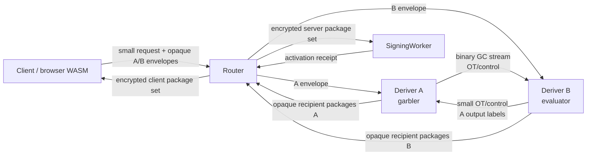

# Streaming Yao for Deriver A and Deriver B

Date created: July 10, 2026

Status: approved replacement and active implementation plan. Phase 0 closed on
July 10, 2026. Streaming Yao is the sole Ed25519 split-derivation target.
Production remains blocked until the active-security, separate-account,
recipient-output, constant-time, and independent-review gates in this document
pass.

Companion documents:

- [Router A/B solution refactor](./router-a-b-sol-refactor.md)
- [Router A/B specification](./router-a-b-SPEC.md)
- [Router A/B deployment](./router-a-b-deployment.md)
- [Optimization 8](../crates/ed25519-hss/docs/optimization-8.md)
- Legacy/reference-oracle input:
  [Ed25519 derivation specification](../crates/ed25519-hss/specs/derivation.md)
- Legacy/reference-oracle input:
  [Ed25519 protocol specification](../crates/ed25519-hss/specs/protocol.md)

Primary external references:

- [Half-Gates](https://eprint.iacr.org/2014/756)
- [Bristol Fashion circuits](https://nigelsmart.github.io/MPC-Circuits/)
- [A Unified Framework for Succinct Garbling from HSS](https://eprint.iacr.org/2025/442)
- [Cloudflare Workers pricing](https://developers.cloudflare.com/workers/platform/pricing/)
- [Cloudflare Workers limits](https://developers.cloudflare.com/workers/platform/limits/)
- [Cloudflare Service Bindings](https://developers.cloudflare.com/workers/runtime-apis/bindings/service-bindings/)
- [Cloudflare Streams](https://developers.cloudflare.com/workers/runtime-apis/streams/)
- [Cloudflare Request and FixedLengthStream behavior](https://developers.cloudflare.com/workers/runtime-apis/request/)
- [Cloudflare Durable Objects pricing](https://developers.cloudflare.com/durable-objects/platform/pricing/)

## Executive Decision

Implement one fixed-function Streaming Yao protocol between Deriver A and
Deriver B for the exact Ed25519 seed-to-scalar derivation. Deriver A is the
garbler. Deriver B is the evaluator. The role assignment is fixed by the
protocol and cannot be selected by a request.

The large garbled-circuit stream travels directly between A and B:

```text
Client -> Router: compact public request and two small HPKE envelopes
Router -> A: compact A envelope
Router -> B: compact B envelope
A <-> B: OT/control messages and the binary garbled-circuit stream
A -> Router: small encrypted A output shares
B -> Router: small encrypted B output shares
Router -> recipients: opaque recipient package sets
```

The client never uploads or downloads the approximately 2 MiB garbled circuit.
The Router never proxies, buffers, logs, or persists it. Normal signing remains
outside the Deriver path after activation.

Strict production uses independently administered Cloudflare accounts for A and
B. Same-account Service Bindings provide a valuable latency lower bound and
runtime-compromise containment. They do not provide independent deployer or
account security. Same-account deployment is limited to local development,
staging, and performance experiments.

Plain free-XOR/half-gates Yao supplies a semi-honest benchmark. Production needs
a reviewed actively secure construction. That construction must enforce
malicious-secure OT, garbling correctness, input consistency, selective-failure
resistance, private authenticated outputs, and correctness-with-abort against
one malicious Deriver.

If Streaming Yao passes the release gates, delete the Ed25519-HSS simulator,
succinct-HSS placeholders, generic threshold service, old routes, client
garbler/evaluator sessions, and their legacy fixtures. There will be one
Ed25519 split-derivation implementation.

ECDSA also remains strict Router A/B. It uses threshold-PRF derivation and
additive secp256k1 scalar shares under its separately specified strict protocol.
ECDSA has no dependency on the Ed25519 Yao crate or stream and must finish its
migration before `ThresholdSigningService` is deleted.

## Document Authority and Resolved Conflicts

The July 10, 2026 Phase 0 decision resolved these prior conflicts:

- `router-a-b-sol-refactor.md` classified Yao as a benchmark-only oracle and
  required genuine succinct HSS as the production implementation.
- `router-a-b-deployment.md` described same-account Cloudflare as a production
  profile.
- protocol identifiers and routes used HSS and `SignerA` / `SignerB`
  terminology for derivation roles.

The three implementation plans and the normative Router A/B documents were
checkpointed together when Phase 0 closed. From that checkpoint:

- this document is authoritative for the Ed25519 secure-computation backend;
- `router-a-b-sol-refactor.md` remains authoritative for the wider strict
  Router A/B and ECDSA migration;
- `router-a-b-SPEC.md` remains authoritative for product lifecycle and public
  route behavior;
- `router-a-b-deployment.md` remains authoritative for deployment mechanics,
  with separate accounts promoted to the strict production profile.

No active, normative, capability, or release document may continue to advertise
the current HSS simulator as a succinct-HSS implementation. Historical
optimization records may retain dated descriptions of what was measured.

## Goal

Produce the exact Ed25519 derivation:

```text
d = LE32(y_client + y_server mod 2^256)
h = SHA-512(d)
a = clamp(h[0..32]) mod l
```

while preserving these custody rules:

```text
Deriver A never learns B inputs or a joined output.
Deriver B never learns A inputs or a joined output.
Router never learns either Deriver plaintext.
Client receives only x_client_base and an authorized seed export.
SigningWorker receives only x_server_base.
No server role reconstructs d or a.
```

The target production claim is:

> The Streaming Yao Router A/B ceremony provides privacy and
> correctness-with-abort against the Router plus at most one malicious Deriver,
> assuming independent A and B administrative domains, a reviewed actively
> secure two-party protocol, an approved proof binding each role input to its
> provisioned root and epoch, authenticated role-bound transport, one-use
> preprocessing, and no A+B collusion.

## Scope

In scope:

- Ed25519 registration, activation, recovery, refresh, and authorized export;
- exact seed-derived Ed25519 identity and export parity;
- a fixed circuit and fixed role assignment;
- just-in-time binary streaming;
- one-use OT and garbling preprocessing;
- optional prepositioning of one-use garbled circuits for lower online latency;
- same-account Cloudflare benchmarking;
- separate-account Cloudflare production transport;
- strict Router A/B product integration;
- measured Streaming Yao latency and cost evidence, with historical HSS
  measurements retained only as dated context;
- deletion of the losing Ed25519 production path.

Out of scope:

- a general-purpose garbled-circuit framework;
- caller-selected MPC backends or runtime protocol negotiation;
- routing ECDSA through the Ed25519 circuit;
- normal Ed25519 signing after activation;
- protection against A+B collusion;
- protection against a Cloudflare platform-wide compromise;
- fairness or guaranteed output delivery;
- seed secrecy from the client during an explicitly authorized export.

## Exact Functionality

### Field and Byte Conventions

Freeze all conventions in test vectors before circuit work:

- `y` contributions are 256-bit little-endian integers in
  `Z_(2^256)`.
- `tau` contributions and signing outputs are canonical scalars in
  `Z_l`.
- `d` is the 32-byte little-endian encoding of the joined `y` sum.
- SHA-512 consumes exactly those 32 bytes with standard SHA-512 padding.
- clamp clears bits 0, 1, and 2 of byte 0, clears bit 7 of byte 31, and sets
  bit 6 of byte 31.
- `a` is the clamped first half of SHA-512 interpreted little-endian and
  reduced modulo `l` for scalar arithmetic.
- every scalar decoder rejects non-canonical encodings.
- circuit bit numbering, wire order, gate order, and output order are fixed in
  the circuit manifest.

### Stable Key Context and Ceremony Context

Existing key derivation hashes HSS-named scheme and domain bytes in
`crates/signer-core/src/near_ed25519_recovery.rs`. Renaming those bytes changes
`d` and the Ed25519 public key. Separate two contexts:

- `StableKeyDerivationContext` contains only immutable, key-affecting bytes;
- `CeremonyTranscriptContext` contains request kind, Yao protocol/circuit IDs,
  tickets, roles, epochs, authorization, and transport metadata.

The approved development cutover reprovisions every affected Ed25519 wallet
under one new frozen Yao-era `StableKeyDerivationContext`. Phase 1 freezes its
exact bytes and golden vectors before product integration. There is no runtime
compatibility flag, retained HSS backend, per-request context choice, or secure
conversion path for existing development wallets.

The version-one stable context encoding and its binding are now frozen:

```text
context_domain = ASCII("seams/router-ab/ed25519-yao/stable-key-context/v1")
binding_domain = ASCII("seams/router-ab/ed25519-yao/stable-key-context-binding/v1")

participant_low  = min(participant_id_1, participant_id_2)
participant_high = max(participant_id_1, participant_id_2)

StableKeyDerivationContextV1 =
    context_domain
    || application_binding_digest[32]
    || BE16(participant_low)
    || BE16(participant_high)

StableKeyDerivationContextBindingV1 =
    SHA-256(binding_domain || StableKeyDerivationContextV1)
```

Both participant identifiers are unsigned 16-bit integers, nonzero, and
distinct. Sorting makes the encoding independent of caller order. The
application binding digest is an immutable SDK-owned 32-byte value. Lifecycle,
authorization, transport, deployment, key-epoch, ticket, and circuit metadata
remain in `CeremonyTranscriptContext` and never enter this stable encoding.

The upstream application-binding preimage and canonical encoder are frozen as:

```text
LP32(x) = BE32(byte_length(x)) || x

application_binding_domain =
    ASCII("seams/router-ab/ed25519-yao/application-binding/v1")

Ed25519YaoApplicationBindingV1 =
    LP32(application_binding_domain)
    || LP32(ASCII("walletId"))
    || LP32(UTF8(walletId))
    || LP32(ASCII("nearEd25519SigningKeyId"))
    || LP32(UTF8(nearEd25519SigningKeyId))
    || LP32(ASCII("signingRootId"))
    || LP32(UTF8(signingRootId))
    || LP32(ASCII("keyCreationSignerSlot"))
    || LP32(BE32(keyCreationSignerSlot))

application_binding_digest = SHA-256(Ed25519YaoApplicationBindingV1)
```

Each of the three string values contains one or more visible ASCII bytes in the
inclusive range `0x21..=0x7e`. Spaces, control bytes, non-ASCII code points,
trimming, and Unicode normalization are outside the version-one grammar. The
encoder preserves the exact validated bytes, and every byte length must fit an
unsigned 32-bit integer. SDK integration must construct these facts from
authenticated domain records through parsers that enforce this same grammar.
`keyCreationSignerSlot` is a positive unsigned 32-bit integer encoded as four
big-endian bytes inside its `LP32` value.

`keyCreationSignerSlot` means the signer slot fixed when this wallet key is
created. It is immutable, key-affecting identity. Same-root recovery retains
it. Changing it changes the application digest, `d`, and public key and is an
explicit wallet-key creation or rekey. Adding a recipient for the same logical
key retains the original key-creation slot; the recipient slot stays in the
ceremony transcript and provenance statement.

The binding excludes `nearAccountId` because an implicit NEAR account ID is
derived from the final public key and would create a circular KDF input. It also
excludes `signingRootVersion`, deployment/root/key/activation epochs,
lifecycle/request/auth/transport/ticket data, and mutable active, default, or
recipient signer slots. These values bind the ceremony or provenance record.
They do not enter the stable KDF identity.

The committed golden fixture uses `wallet-fixture`, `ed25519ks_fixture`,
`project-fixture:env-fixture`, and key-creation slot `1`. Its canonical encoding
is:

```text
000000327365616d732f726f757465722d61622f656432353531392d79616f2f6170706c69636174696f6e2d62696e64696e672f76310000000877616c6c657449640000000e77616c6c65742d66697874757265000000176e656172456432353531395369676e696e674b6579496400000011656432353531396b735f666978747572650000000d7369676e696e67526f6f7449640000001b70726f6a6563742d666978747572653a656e762d66697874757265000000156b65794372656174696f6e5369676e6572536c6f740000000400000001
```

Its application-binding digest is
`b1dbafce5fd696ae4bd5611e3684a778febfdf7f716e2dfe3211ce0cff708121`.
With participant identifiers `1` and `2`, the resulting stable-context binding
is `b5601ad156882b545a2e4a4a694e87c7982842d37a4c666645302604b2720655`.

A separate stable-context unit vector with
`application_binding_digest = 0x42 * 32` and participant identifiers `1` and
`2` ends in `00010002`; its binding digest is
`ce5305908b0c31bfe09072b549cb349b0c901f7d3fde60c63fa8e2dfb088a42d`.

The version-one role-local contribution KDF is also frozen:

```text
extract_salt = ASCII("seams/router-ab/ed25519-yao/contribution-kdf/hkdf-sha256/extract/v1")
expand_domain = ASCII("seams/router-ab/ed25519-yao/contribution-kdf/hkdf-sha256/expand/v1")

role_tag   = A:0x01 | B:0x02
source_tag = client:0x01 | server:0x02
output_tag = y:0x01 | tau:0x02

PRK = HKDF-Extract-SHA256(extract_salt, root[32])
info = expand_domain || 0x00 || role_tag || source_tag || output_tag
       || StableKeyDerivationContextBindingV1[32]

y = HKDF-Expand-SHA256(PRK, info(output=y), 32)
tau_wide = HKDF-Expand-SHA256(PRK, info(output=tau), 64)
tau = LE512(tau_wide) mod l, encoded as one canonical LE32 scalar
```

One stable client derivation root produces the role-separated client/A and
client/B contributions. Deriver A's independent stable root produces only the
server/A contribution. Deriver B's independent stable root produces only the
server/B contribution. The KDF runs at initial provisioning or explicit wallet
key rotation. Activation consumes committed packages. Version-one recovery
rewraps the same logical client derivation root under the replacement
credential. Version-one refresh applies the explicit correlated zero-sum
transition defined below. An unavailable or compromised client root requires an
explicit wallet rekey with a new public identity.

Request kind, authorization, transport, deployment, HPKE, storage, ticket,
activation, root-share, and SigningWorker epochs never enter `info`. They bind
the ceremony and input-provenance statement separately. The isolated reference
implementation and committed continuity corpus live under
`tools/ed25519-yao-generator`; production root custody and provenance proof
remain later security gates.

The circuit receives four `y` contributions:

```text
y_A = y_client_A + y_server_A mod 2^256
y_B = y_client_B + y_server_B mod 2^256
d   = LE32(y_A + y_B mod 2^256)
```

It also receives four `tau` contributions:

```text
tau_A = tau_client_A + tau_server_A mod l
tau_B = tau_client_B + tau_server_B mod l
tau   = tau_A + tau_B mod l
```

The unshared mathematical outputs are:

```text
x_client_base = a + tau mod l
x_server_base = a + 2 * tau mod l
```

Neither mathematical output is decoded to either Deriver.

### Fixed Circuit Families

The target has two production circuit artifact families:

1. `ed25519_yao_activation_v1`
   - registration;
   - recovery;
   - refresh;
   - packages consumed by activation without another circuit evaluation;
   - output shares for `x_client_base` and `x_server_base`;
   - no seed output wires.
2. `ed25519_yao_export_v1`
   - explicitly authorized export;
   - masked `d` shares to the authorized client;
   - public transcript evidence and no other secret output;
   - a distinct circuit digest, authorization scope, and transcript domain.

Request kind remains part of the transcript even when several lifecycle
operations use the same activation circuit. A normal ceremony cannot carry an
export field, export recipient, or seed-output branch.

The product/control operation, canonical request kind, ideal functionality, and
circuit family mapping is fixed as follows:

| Product/control operation   | Request kind   | Ideal functionality         | Circuit family                                 |
| --------------------------- | -------------- | --------------------------- | ---------------------------------------------- |
| `registration_prepare`      | `registration` | `F_ed25519_registration_v1` | `ed25519_yao_activation_v1`                    |
| `signing_worker_activation` | `activation`   | `F_ed25519_activation_v1`   | committed `ed25519_yao_activation_v1` packages |
| `recovery`                  | `recovery`     | `F_ed25519_recovery_v1`     | `ed25519_yao_activation_v1`                    |
| `server_share_refresh`      | `refresh`      | `F_ed25519_refresh_v1`      | `ed25519_yao_activation_v1`                    |
| `key_export`                | `export`       | `F_ed25519_export_v1`       | `ed25519_yao_export_v1`                        |

Router performs this conversion at the admitted request boundary. Callers never
select the ideal functionality or circuit family. Activation consumes and
verifies the previously committed activation-family packages; registration,
recovery, and refresh perform the Yao evaluation that creates them. Only
`F_ed25519_export_v1` has seed-output wires or seed-share packages.

Phase 2 freezes a deterministic core-function digest and a passive benchmark
artifact. Phase 6 selects the active protocol and randomized-output realization,
then regenerates and freezes the final production circuit manifests and digests.
The passive digest cannot be used in production.

The activation circuit covers the derivation and output-activation portion of a
refresh. Any protocol that refreshes role roots or persisted contributions must
preserve the joined `y` and `tau`, run as a separately reviewed strict A/B
state transition, and avoid reconstructing either joined value.

Use disjoint request and state-transition types:

| Operation    | Required pre-state                                  | Persisted change                                                                                 | Identity invariant                                          |
| ------------ | --------------------------------------------------- | ------------------------------------------------------------------------------------------------ | ----------------------------------------------------------- |
| Registration | no registered Ed25519 key                           | create roots, contributions, recipients, and registered key                                      | establish one new `A_pub`                                   |
| Activation   | registered key and inactive output shares           | activate recipient shares                                                                        | preserve registered `A_pub`                                 |
| Recovery     | registered key plus approved recovery authorization | rewrap the same logical client root, issue fresh activation packages, and promote the credential | `d_after = d_before` and `A_pub_after = A_pub_before`       |
| Refresh      | registered key plus current role epochs             | apply correlated deltas, issue fresh activation packages, and advance role/worker epochs         | joined `y`, joined `tau`, `d`, and `A_pub` remain unchanged |
| Export       | registered key plus explicit export authorization   | audit/consume state only                                                                         | reconstructed `d` derives registered `A_pub`                |

Version-one recovery is a same-root rewrap. Admission suspends the old
credential, unwraps the exact same logical 32-byte client derivation root under
approved recovery authorization, and rewraps it for the replacement credential.
The stable context, immutable key-creation signer slot, client contributions,
server contributions, `d`, `a`, `tau`, scalar bases, public points, and
registered `A_pub` remain identical. The ceremony uses fresh protocol coins,
activation packages, ticket, and activation epoch. Successful activation
promotes the replacement credential and tombstones the old credential binding.

Recovery never exposes seed shares and has no compensating-root branch. If the
logical client root is unavailable or suspected compromised, the wallet enters
an explicit rekey flow that creates a new `d` and public key. Production root
custody and proof that both role inputs came from the retained root remain
stop-ship blockers.

Version-one refresh keeps every stable root, the stable context, and both client
contributions unchanged. It updates the effective persisted server
contributions with explicit nonzero deltas:

```text
y_server_A'   = y_server_A + delta_y mod 2^256
y_server_B'   = y_server_B - delta_y mod 2^256
tau_server_A' = tau_server_A + delta_tau mod l
tau_server_B' = tau_server_B - delta_tau mod l
```

The joined `y` and `tau`, and therefore `d`, `a`, both scalar bases, public
points, and `A_pub`, remain unchanged. The host lifecycle is frozen as:

```text
Active(current)
  -> Prepared(next)
  -> OutputCommitted(next)
  -> WorkerActivated(next)
  -> Active(next) + RetiredTombstone(current)
```

Before `OutputCommitted`, an abort discards the prepared next epoch and leaves
the current epoch active. At and after `OutputCommitted`, the refresh transition
advances forward-only: the parties may redeliver the exact committed
ciphertexts, and they may not re-evaluate with new randomness, replace either
delta, or roll back to the prior epoch. A partial cutover freezes new derivation
admission until the committed next epoch reaches `WorkerActivated`; activation
rejects stale role/worker epochs and retires the previous epoch.

This refresh preserves identity against static corruption. It makes no
proactive or mobile-adversary healing claim. Joint delta generation and
anti-bias, role-local delta custody and provenance, active output generation,
and atomic distributed persistence remain stop-ship blockers. Registration
cannot require a pre-existing account public key. The current
`Recovery -> Export` request mapping and conflicting registration preconditions
must be deleted when the disjoint product types land.

### Protocol-Generated Output Sharing

Ordinary Yao gives decoded outputs to the evaluator. That behavior would let
Deriver B learn a joined signing value. Each output must instead use a
protocol-generated random sharing whose distribution cannot be biased by either
party within the protocol.

For every scalar output `x`:

```text
R <- Z_l inside the approved randomized 2PC functionality
z_A = R
z_B = x - R mod l
```

The circuit privately outputs:

```text
z_A only to Deriver A
z_B only to Deriver B
```

Neither Deriver supplies `R` as a freely chosen linear mask. A construction such
as protocol-native random output sharing or committed private seeds passed
through a reviewed in-circuit PRF/extractor may realize the functionality. The
active-security proof must show that one corrupt role cannot force the honest
role's decoded share to equal the joined output through a degenerate seed,
selective failure, or abort pattern.

For seed export:

```text
U <- Z_(2^256) inside the approved randomized 2PC functionality
d_A = U
d_B = d - U mod 2^256
```

Private garbler output requires a two-output construction. A generates and
retains the semantic translation map for A-output wires. B receives no semantic
mapping for those wires and returns only A's selected opaque labels after active
verification. B receives translation data only for B-output wires. The
active-security layer must authenticate both output paths and prevent
equivocation.

A and B separately encrypt their scalar shares to the authorized recipient.
Packages bind:

- protocol and circuit digest;
- lifecycle and operation;
- wallet, account, and key identity;
- root and deployment epochs;
- Deriver role and peer identities;
- recipient role and public key;
- preprocessing ticket ID;
- transcript root;
- output kind;
- expiration and replay domain.

Each scalar share includes a public point commitment. An active-output MAC,
proof, or authenticated-label opening binds the decoded scalar, its point, the
recipient ciphertext digest, and the transcript to the authenticated 2PC
output. A self-consistent scalar and point supplied after circuit execution is
insufficient: correlated changes to the two outputs can preserve the public
relation below.

The recipient verifies the active-output binding and its scalar against the
point before combining. A public output receipt carries `X_client`, `X_server`,
`A_pub`, the complete recipient-package digest set, the ticket ID, and the
transcript root to both recipients. Both Derivers sign that receipt. The
combined public points must satisfy:

```text
X_client = x_client_base * B
X_server = x_server_base * B
A_pub    = a * B

2 * X_client - X_server = A_pub
```

Before this check, parse every share verification point, `X_client`,
`X_server`, and `A_pub` from a canonical Edwards encoding; reject identity,
small-order, torsion, and non-prime-subgroup points; and verify strict
scalar-to-point equality for each private share received by that recipient.

Freeze the normal-signing verifying-share mapping:

```text
V_client = 2 * X_client
V_server = -X_server
V_client + V_server = A_pub
```

Move the still-valid mapping helper from `ed25519-hss::role_signing` into
`signer-core` and protect it with golden point-encoding and signing vectors.

During export, the client reconstructs `d`, recomputes
`d -> SHA-512(d) -> clamp -> a`, derives the Ed25519 public key, and compares it
with the registered identity.

### Input Provenance

Active 2PC proves correct computation over the supplied inputs. It does not by
itself prove that a malicious Deriver supplied the role input committed during
wallet provisioning.

The production design must bind each role input to:

- the role-local root or stable provisioned material;
- wallet and key identity;
- derivation context and path;
- root epoch;
- request kind;
- client envelope commitment;
- authorization digest.

Phase 6 must select a reviewed input-commitment and proof mechanism. Registration
must include an anti-bias analysis. Recovery and refresh must prove continuity
with the registered public identity. A public-key parity check detects an
identity change; it does not replace a proof that the correct role root was
used.

## Target Architecture



### Payload Boundaries

| Link                    | Allowed payload                               |                                        Size class | Forbidden payload                                |
| ----------------------- | --------------------------------------------- | ------------------------------------------------: | ------------------------------------------------ |
| Client to Router        | public intent, authorization, A/B ciphertexts |                                               KiB | garbled tables, labels, clear Deriver inputs     |
| Router to A             | A-scoped envelope and public metadata         |                                               KiB | B plaintext, joined input, circuit stream        |
| Router to B             | B-scoped envelope and public metadata         |                                               KiB | A plaintext, joined input, circuit stream        |
| A to B                  | signed control, OT, binary garbled stream     | approximately 2 MiB plus active-security overhead | client-readable encoding, JSON/base64 table      |
| B to A                  | signed control, OT, A-output labels, receipt  |                                               KiB | decoded joined output                            |
| A/B to Router           | recipient ciphertexts and public receipt      |                                               KiB | recipient plaintext or joined output             |
| Router to Client        | client-encrypted package set                  |                                               KiB | server plaintext, joined `a`, normal seed output |
| Router to SigningWorker | server-encrypted package set                  |                                               KiB | client plaintext, `d`, joined `a`                |
| Router logs             | identifiers, public digests, status, timings  |                                             bytes | labels, masks, OT state, input/output plaintext  |

### Network and Administrative Edges

Freeze every production edge, rather than only A-to-B:

| Edge                    | Production transport                                                         | Authentication and secrecy                                           |
| ----------------------- | ---------------------------------------------------------------------------- | -------------------------------------------------------------------- |
| Client to Router        | public HTTPS                                                                 | application auth, authorization, replay binding, role HPKE envelopes |
| Router to A             | cross-account HTTPS                                                          | Router signature, A endpoint pin, A HPKE ciphertext                  |
| Router to B             | cross-account HTTPS                                                          | Router signature, B endpoint pin, B HPKE ciphertext                  |
| A to B and B to A       | direct cross-account HTTPS                                                   | pinned peer identity, signed session, binary frame MACs              |
| A/B to Router           | response or signed HTTPS callback                                            | recipient ciphertext and signed public receipt only                  |
| Router to Client        | original HTTPS response or authenticated poll                                | client-recipient ciphertexts                                         |
| Router to SigningWorker | Service Binding only when administratively co-hosted; signed HTTPS otherwise | SigningWorker envelope and Router/Worker identity                    |
| SigningWorker to Router | bound response                                                               | signed activation or signing receipt                                 |

The Router relays compact recipient ciphertexts. A and B never require a direct
browser connection. The product/control account owns Router and SigningWorker;
Deriver A and Deriver B each use a different Cloudflare account, administrator,
deployment credential, storage boundary, and audit trail. Router-to-
SigningWorker may use a Service Binding inside the product account. Every A or
B edge uses signed cross-account HTTPS. Production deletes `.internal` Service
Binding URLs for every edge that crosses an account boundary.

### Online Ceremony

1. The client derives and splits `y_client` and `tau_client`.
2. The client creates distinct HPKE envelopes for A and B.
3. The Router authenticates the lifecycle request, freezes recipient keys, and
   dispatches the compact role envelopes.
4. Each Deriver validates its envelope and derives its role-local server input.
5. A and B run a signed two-phase reservation handshake. Each role performs a
   locally atomic reservation; any ambiguous peer state burns both tickets.
6. A and B complete the selected construction's bounded pre-stream control
   rounds. Every unpredictable challenge is sampled only after all challenged
   commitments are durably persisted and authenticated.
7. A begins the direct binary request stream only when the active construction
   authorizes release.
8. A garbles in fixed topological order while the transport applies
   backpressure.
9. B parses, authenticates, and evaluates each chunk as it arrives.
10. B decodes only its authenticated share, enters `OutputPrepared` for its
    packages, then returns A's opaque selected output labels, B's package
    digests, and its signed transcript root in the response to A's stream.
11. A decodes only its authenticated share.
12. A builds and persists its exact recipient ciphertexts and active output
    bindings in `OutputPrepared` state.
13. A sends one small output-commit request containing the complete digest set
    and A's signature. B verifies, co-signs, enters `OutputCommitted`, consumes,
    and returns its signature. A verifies, enters `OutputCommitted`, and
    consumes.
14. Only consumed tickets release the persisted packages to the Router for
    opaque relay. Recipients validate active-output bindings, combine their
    shares, and verify the public receipt.
15. The Router records only public terminal receipts. Exact ciphertext
    redelivery remains allowed; cryptographic reevaluation does not.

Normal signing after activation is:

```text
Client -> Router -> SigningWorker -> Router -> Client
```

It performs zero Deriver calls and zero Yao operations.

## Fixed-Circuit and Garbling Design

### Circuit Compilation

Build a fixed, generated circuit rather than a generic runtime circuit loader.
The compiler pipeline should:

1. encode the exact reference functionality;
2. specialize the fixed SHA-512 IV and 32-byte message padding;
3. constant-fold public values;
4. synthesize 256-bit addition, clamping, reduction modulo `l`, `tau`
   arithmetic, and deterministic mathematical outputs;
5. assign a canonical topological gate order;
6. compute live-wire intervals and compact reusable wire slots;
7. emit a compact binary schedule and immutable manifest;
8. digest the compiler version, source IR, schedule, constants, input schema,
   output schema, and gate counts.

The Phase 2 artifact exposes mathematical outputs only inside a local passive
benchmark/test harness. Phase 6 composes the selected input-provenance proof,
active compiler, and randomized-output functionality, then generates the
production artifacts.

CI regenerates each artifact and fails on an unexplained digest or gate-count
change. Production embeds only the reviewed Phase 6 artifacts. Runtime uploads
and caller-provided circuits are rejected.

### Initial Size Budget

The published Bristol SHA-512 compression circuit contains:

- 57,947 AND gates;
- 286,724 XOR gates;
- 4,946 inversions;
- AND depth 3,303.

Half-Gates sends two 128-bit ciphertexts per AND and uses free-XOR:

```text
57,947 AND * 32 bytes = 1,854,304 bytes = 1.768 MiB
```

Specializing the fixed IV and fixed padding is expected to reduce the SHA-512
portion to approximately 49,000 AND gates, or about 1.50 MiB of half-gate
tables. Addition, reduction, `tau` arithmetic, randomized output sharing, OT
material, input provenance, active security, and framing add to that value.

Planning budgets before synthesis:

| Artifact                               | Provisional budget |
| -------------------------------------- | -----------------: |
| Specialized semi-honest SHA-512 tables |         `1.50 MiB` |
| Complete passive benchmark circuit     |    `1.65-2.10 MiB` |
| Base64 representation                  |          forbidden |
| Input-provenance proof/setup           |   must be measured |
| Production active-security overhead    |   must be measured |
| Peak Worker isolate memory             | less than `96 MiB` |

The production report includes input-provenance proof bytes, setup, rounds, A/B
CPU, verification CPU, and any added circuit gates alongside the active-security
overhead. Those costs cannot disappear into an unmeasured provisioning bucket.

Garbled tables are pseudorandom and effectively incompressible. HTTP
compression is disabled. All size gates use binary bytes on the wire.

### Garbling Core

The implementation must freeze and review:

- security parameter;
- free-XOR and Half-Gates construction;
- correlation-robust fixed-key hash or approved equivalent;
- gate-tweak domain and uniqueness;
- label representation;
- point-and-permute convention;
- global-delta lifecycle;
- OT suite;
- active-security compiler;
- transcript hash;
- peer authentication;
- recipient HPKE/AEAD suites;
- random-number source.

Every primitive must have an explicit proof reference or review rationale.
Convenient general-purpose hashes cannot be substituted for the garbling hash
without analyzing the required correlation-robustness property.

The passive protocol API is benchmark-only. Once the active construction lands,
delete any externally callable semi-honest ceremony entrypoint. Shared internal
garbling primitives may remain where the active construction uses them.

## Binary Streaming Protocol

### Control Plane and Data Plane

Keep control messages small, canonical, and signed. The garbled-circuit data
plane uses `application/octet-stream` and a dedicated direct A-to-B route.

Do not pass the stream through:

- `router-ab-core::WireMessageV1`;
- JSON;
- base64;
- `post_service_json`;
- a JavaScript string;
- a whole-body `arrayBuffer()`;
- Router relay or persistence.

The existing whole-message path clones and re-encodes owned byte vectors. It
prevents incremental evaluation and adds avoidable memory copies.

### Stream Manifest

The signed opening manifest includes:

- protocol identifier;
- active-security suite;
- circuit identifier and digest;
- compiler and parameter digest;
- ceremony and ticket IDs;
- role identities and peer key fingerprints;
- account, wallet, key, and operation;
- root and deployment epochs;
- authorization and recipient-key digests;
- exact `body_bytes`, including every frame header and payload;
- exact `table_payload_bytes`;
- exact count and payload bytes for every frame type;
- chunk-size limit;
- transcript nonce;
- expiry;
- previous peer-message digest.

B authenticates and reserves the ticket before reading the body.

A wraps the body in Cloudflare's `FixedLengthStream` using the manifest's exact
byte count. Cloudflare can then set `Content-Length`; an ordinary
`ReadableStream` uses chunked transfer encoding. B rejects a missing or
mismatched fixed length before consuming table frames.

### Frame Format

Use a compact fixed-width binary header:

```text
magic
format version
frame type
sequence number
public gate-range start
public gate count
payload length
previous-frame digest
payload digest or session MAC
payload
```

Requirements:

- fixed maximum frame size, initially benchmarked at 64, 128, and 256 KiB;
- a `FixedLengthStream` whose total equals the signed manifest;
- exact monotonic sequence;
- no gaps, duplicates, or reordering;
- public gate ranges only;
- incremental transcript hashing;
- session authentication derived from a signed ephemeral peer handshake;
- a session MAC over the canonical frame header, previous-frame digest, and
  payload bytes;
- terminal signed transcript roots from both roles;
- exact EOF and total-length verification;
- abort and ticket destruction on overflow, truncation, malformed framing,
  digest mismatch, timeout, disconnect, or trailing bytes.

TLS protects the network hop. Transcript authentication binds the cryptographic
ceremony to role identities and survives differences between Service Binding
and public HTTPS transports.

### Incremental Evaluation

A:

- generates tables in canonical gate order;
- keeps only current garbling state, live labels, and the current output chunk;
- sends through a backpressure-aware `ReadableStream`;
- never materializes the whole table in JavaScript memory.

B:

- validates each frame before evaluation;
- evaluates XOR/inversion gates from the embedded schedule;
- consumes AND tables sequentially;
- uses liveness-based wire-slot reuse;
- keeps no full table copy;
- rejects any mismatch before releasing output;
- zeroizes live labels and ticket keys on termination.

These disposal rules describe the one-pass baseline. The selected active
compiler may require commitments, an unpredictable challenge, checked-circuit
retention, or a second pass before evaluation. Phase 6 must define the earliest
safe evaluation and disposal point. If retention is required, keep encrypted
chunks in bounded role-local storage and preserve the Worker memory gate.

Frame authentication proves that A sent the bytes in the stream. Garbling
correctness comes only from the selected active-security construction.

The target wall time approaches:

```text
max(garbling CPU, transfer time, evaluation CPU) + protocol round trips
```

Same-thread Service Binding execution may schedule the two Workers differently
from cross-account HTTPS. Measure both instead of assuming perfect overlap.

## One-Use Preprocessing

### Lifecycle

The just-in-time lifecycle is:

```text
Generated -> Paired -> Available -> Reserved -> Activated
  -> OutputPrepared -> OutputCommitted -> Consumed
```

The prepositioned lifecycle inserts one state:

```text
Generated -> Paired -> Prepositioning -> Available -> Reserved -> Activated
  -> OutputPrepared -> OutputCommitted -> Consumed
```

Every nonterminal state may transition to `Destroyed`.

Rules:

- `Reserved` never returns to `Available`.
- each transition is atomic only within the role-local Durable Object;
- a signed two-phase handshake coordinates the two local reservations;
- peer ambiguity after local reservation destroys the local ticket;
- `Prepositioning` may release only input-independent material permitted by the
  selected active-security proof;
- a partial prepositioning upload destroys the ticket;
- `Available` is reached after B authenticates the complete stored object and
  both roles sign its digest;
- `Activated` is committed before the first input-dependent OT correction, wire
  label, randomized-output message, or just-in-time table byte leaves a role;
- timeout, crash, cancellation, peer uncertainty, malformed input, partial send,
  and rollback destroy the ticket;
- retry allocates a fresh ticket and transcript;
- `OutputPrepared` persists the exact recipient ciphertexts and bindings;
- `OutputCommitted` requires both roles' signatures over the complete package
  digest set;
- local `Consumed` occurs before any recipient ciphertext is released;
- `Consumed` allows exact encrypted package redelivery only;
- restoring a backup destroys every restored nonterminal ticket;
- duplicated state or a monotonic generation regression fails closed.

Never reuse:

- extended OT correlations;
- circuit labels;
- global delta;
- garbling seed;
- gate-tweak range;
- randomized-output seed or share;
- transcript nonce;
- recipient-encryption nonce.

Long-lived base-OT channel seeds are reusable only when the selected
malicious-secure OT protocol explicitly proves that usage. Every derived range
still receives a unique monotonic domain and a one-use ticket.

After restore, rollback, duplicated state, or counter uncertainty, rotate the
entire base-OT channel epoch and destroy every ticket derived from the old
epoch. Epoch authentication keys and revocation tombstones are excluded from
role-state backups and pinned in an independently administered, non-rollback
deployment manifest or equivalent authority. Both peers reject an epoch below
that floor. High-water marks stored only in the two restorable role databases
are insufficient.

### Persistence

Each role owns an independent Durable Object namespace for:

- ticket state;
- public peer commitment;
- encrypted small role-local ticket secret;
- base-OT channel epoch and generation high-water mark;
- output-prepared package ciphertexts and active-output bindings;
- signed output-commitment digest set;
- consume marker for idempotent redelivery.

Durable Objects do not store a whole just-in-time garbled stream.

If prepositioned garbled circuits are retained:

- B stores encrypted, chunked table objects in B-only blob storage;
- A stores only its encrypted ticket secret and decoding material;
- the Durable Object stores lifecycle metadata and object digests;
- a per-ticket wrapping key is destroyed at terminal transition;
- object deletion is asynchronous defense in depth;
- table storage, reads, writes, duration, and cleanup are added to the measured
  cost model.

Prepositioning is available only when the selected active compiler proves that
its pre-challenge material can be stored and later bound to one online
execution. A compiler requiring unpredictable checks may preposition
commitments and encrypted chunks while delaying challenge-dependent opening or
evaluation.

Workers cannot prove physical memory erasure. Zeroize WASM buffers, destroy
per-ticket keys, remove references, and document the residual platform-erasure
assumption.

### Prepositioned Online Mode

Prepositioning moves the large stream out of the online ceremony:

```text
offline:
  A garbles -> streams one-use tables -> B stores and acknowledges

online:
  reserve paired ticket
  exchange input labels and OT corrections
  B streams stored chunks into the evaluator
  deliver recipient shares
```

This mode is the first latency optimization after the just-in-time protocol is
correct. It shares the same production circuit, active-security suite, output
format, and ticket lifecycle. It is not a second protocol or fallback.

## Active-Security Requirement

### Baseline Classification

Free-XOR, Half-Gates, and ordinary OT provide a passive/semi-honest baseline.
Peer signatures establish message origin. Neither mechanism proves that a
malicious garbler built the required circuit.

The passive milestone may answer:

- actual gate count;
- binary payload;
- garbling and evaluation CPU;
- streaming behavior;
- memory;
- cross-account throughput.

It cannot close the current critical security issue or support a production
claim.

### Production Capabilities

Select one concrete, reviewed actively secure fixed-circuit 2PC construction
that provides:

- malicious-secure base OT and OT extension;
- sender and receiver consistency checks;
- garbled-circuit correctness through authenticated garbling, an optimized
  cut-and-choose construction, or an equivalent reviewed compiler;
- input consistency across every checked/evaluated instance;
- binding of private inputs to provisioned role commitments;
- selective-failure resistance;
- private authenticated output to both roles;
- output-label authenticity and anti-equivocation;
- transcript-safe uniform aborts;
- correctness-with-abort against either corrupt role.

An optimized cut-and-choose candidate may multiply the table payload far beyond
2 MiB. Record that outcome honestly. The production selection gate considers:

- proof and assumptions;
- exact online and offline bytes;
- online rounds;
- Worker/WASM CPU and memory;
- implementation maturity;
- constant-time behavior;
- audit surface.

Prototype competing active compilers in isolated branches or experiment
modules. Select one. Delete losing implementations before product integration.

### Explicit Exclusions

The production claim excludes:

- A+B collusion;
- sequential compromise of both retained role states without a reviewed
  proactive refresh and erasure model;
- a principal controlling both deployment pipelines;
- Cloudflare platform-wide compromise;
- common dependency or source compromise approved by both deployers;
- availability and fairness;
- client and SigningWorker collusion.

Client plus SigningWorker can reconstruct:

```text
a = 2 * x_client_base - x_server_base mod l
```

That is the expected threshold-compromise boundary.

## Same-Account Security

### Exact Claim

The same-account profile may claim:

> Same-account Router A/B contains a compromise confined to one Worker runtime
> while the shared Cloudflare account and deployment control plane remain
> honest. It does not protect against the account operator, account takeover,
> shared CI compromise, or any principal able to modify both Workers.

This is a useful defense-in-depth property. It is a narrower property than
strict production Router A/B.

### Properties Retained

With honest account administration and correctly separated bindings:

- A and B inputs remain in separate Worker environments and role-local Durable
  Object namespaces.
- A runtime exploit confined to one Worker does not automatically expose the
  other Worker's environment or storage binding.
- actively secure Yao protects the honest Worker's input against one malicious
  peer Worker.
- the Router and network observer see only ciphertext, public metadata, and
  timing.
- protocol-generated output shares, recipient encryption, replay protection, and
  one-use tickets remain effective.
- separate Worker entrypoints and environments reduce accidental joined-state
  logging and application blast radius.
- no honest Worker receives a joined `d`, `a`, `x_client_base`, or
  `x_server_base`.

### Properties Lost

A single Cloudflare account creates a common control plane:

- an account administrator can replace both Worker programs;
- one account-wide API token or CI principal can deploy exfiltration code to
  both roles;
- a malicious deployment can attach both secret sets or storage namespaces;
- shared recovery, backup, audit, and incident authority affects both roles;
- one account takeover creates effective A+B collusion;
- independent destruction evidence and independent deployment attestations are
  unavailable.

Service Bindings preserve separate Worker code and environment bindings during
honest operation. They do not restrict the account administrator who controls
both deployments.

### Threat Matrix

| Compromised set            | Separate accounts                                                   | Same account                                       |
| -------------------------- | ------------------------------------------------------------------- | -------------------------------------------------- |
| Network observer           | protected by TLS and transcript authentication                      | same                                               |
| Router runtime             | metadata and denial of service                                      | same                                               |
| Deriver A runtime          | B input and joined secrets remain hidden after active-security gate | retained while shared control plane remains honest |
| Deriver B runtime          | A input and joined secrets remain hidden after active-security gate | retained while shared control plane remains honest |
| Router + A runtimes        | B remains an independent trust boundary                             | retained only under runtime-confined corruption    |
| Router + B runtimes        | A remains an independent trust boundary                             | retained only under runtime-confined corruption    |
| Account A administrator    | B account remains independent                                       | can modify both roles                              |
| Account B administrator    | A account remains independent                                       | can modify both roles                              |
| Shared CI/deploy principal | forbidden production configuration                                  | effective A+B compromise                           |
| A+B                        | security claim fails                                                | security claim fails                               |
| Cloudflare platform        | security claim excluded/fails                                       | security claim excluded/fails                      |
| Client + SigningWorker     | reconstructs `a`                                                    | same                                               |

### Same-Account Controls

The development/staging profile still enforces:

- separate Worker entrypoints;
- separate secrets and environment schemas;
- separate Durable Object namespaces;
- no A binding to B storage and no B binding to A storage;
- role-specific deploy tokens where Cloudflare permits;
- distinct peer-signing and recipient-encryption keys;
- source guards rejecting opposite-role secret names;
- negative runtime probes for opposite-role bindings;
- the same active protocol, circuit digest, ticket lifecycle, and transcript
  checks used by production.

These controls improve containment. The account super-administrator remains a
shared authority.

### Production Policy

`router_ab_cloudflare_same_account_dev_v1` is local, staging, and
benchmark-only.
Production domain types do not contain a same-account branch.

`router_ab_cloudflare_separate_accounts_v1` is the strict production profile:

- distinct Cloudflare account IDs;
- distinct deploy principals and OIDC trust;
- no token capable of deploying both roles;
- separate secrets, storage, logs, backups, approvers, and incident controls;
- independently signed deployment manifests and artifact digests;
- negative access tests proving A credentials cannot deploy or read B;
- authenticated HTTPS between pinned peer endpoints;
- production startup/deployment rejection when account or deploy-principal
  identities coincide.

Development and staging may also select the separate-account profile for
production-parity testing. Both deployment profiles run the same protocol and
circuit artifacts; only deployment configuration selects the account topology.
The client request has no topology selector.

Router may share A's administrative domain only if the approved corruption
model continues to cover Router+A and Router credentials have no B authority.

## Cloudflare Transport and Placement

### Same Account

Cloudflare documents Service Bindings as having zero added latency and normally
running the Workers on the same thread of the same server. The target Worker
must be in the caller's account.

Use HTTP-style Service Bindings for the binary stream so the same parser,
backpressure, framing, and transcript code runs in both deployment profiles.
RPC object serialization is unsuitable for the table stream.

Service Binding calls still consume the caller's subrequest quota and each call
counts toward Cloudflare's maximum of 32 Worker invocations in one request
chain. Keep the ceremony shallow. Avoid alternating nested A/B callbacks.

This profile provides:

- an optimistic transport lower bound;
- a way to isolate crypto CPU from network time;
- early validation of streaming and memory;
- no independent-account security.

### Separate Accounts

Service Bindings cannot cross Cloudflare accounts. Production uses direct
authenticated HTTPS on pinned Custom Domains:

```text
Deriver A account -- HTTPS binary stream --> Deriver B account
Deriver B account -- HTTPS control -------> Deriver A account
```

Requirements:

- A and B communicate directly;
- Router never relays the binary body;
- construction-defined bounded pre-stream control rounds with no recursive
  callbacks;
- durable authentication of all challenged commitments before challenge
  sampling;
- one A-to-B table stream whose response carries B's prepared-output digests;
- one small A-to-B output-commit request whose response carries B's terminal
  signature;
- no separate post-stream B-to-A callback;
- TLS plus signed ephemeral session binding;
- strict peer identity and deployment-manifest pinning;
- request size, frame size, duration, and concurrency limits;
- circuit breaker and per-peer rate limits;
- recorded `cf.colo`, connection reuse, time-to-first-byte, and
  time-to-last-byte metrics;
- placement experiments using the actual production account topology;
- uniform failure responses without secret-bearing diagnostic bodies.

Any active-security construction requiring more rounds must state the exact
request graph and increment the cost counters. Recursive A/B request chains are
forbidden.

### Worker Resource Budget

As of July 10, 2026, Cloudflare documents:

- 128 MB memory per isolate;
- at least 100 MB request-body allowance on every account plan;
- no enforced response-body limit;
- Paid Worker CPU up to five minutes per HTTP invocation, with a 30-second
  default;
- network wait time excluded from CPU time;
- 10,000 subrequests per paid invocation by default;
- six simultaneously pending outgoing connections while waiting for response
  headers;
- at most 32 Worker invocations in one Service Binding request chain.

The semi-honest 2 MiB stream fits the platform limits. The selected active
construction must publish its exact request size and remain within the deployed
account's body limit. The 128 MB isolate cap makes whole-message copies, JS
object-per-gate representations, base64, and duplicate WASM/JS buffers
unacceptable.

Initial production admission allows one active Yao ceremony per isolate. The
memory proof must satisfy:

```text
M_static + 1 * (M_live_labels + M_chunk + M_active_security + M_transport)
  + M_headroom <= 128 MiB
```

The measured target is at most 96 MiB total, leaving at least 32 MiB runtime
headroom. Increasing the per-isolate cap requires a new measured formula and
admission-control review.

HTTP wall time has no hard limit only while the caller stays connected. A
disconnect or completed response can cancel outstanding subrequests;
`waitUntil()` extends work for at most 30 seconds. The online ceremony keeps its
request chain connected through terminal output. A disconnect burns the ticket.
Offline preprocessing uses a durable trigger or queue with its own measured
limits and cost. A Durable Object must not remain active across the network
stream solely to keep a request alive.

## Cloudflare Cost Analysis With Historical Succinct-HSS Context

### Pricing Snapshot

This model uses Cloudflare's published Workers Standard pricing on July 10,
2026:

- `$5` monthly minimum per paid account;
- 10 million included requests per account per month;
- `$0.30` per additional million requests;
- 30 million included CPU-ms per account per month;
- `$0.02` per additional million CPU-ms;
- no additional Workers data-transfer, egress, throughput, or bandwidth charge;
- outbound Worker subrequests are unbilled; the recipient Worker invocation is
  an inbound request.

Enterprise contracts may differ. Recheck pricing before a production decision.

### Comparison Assumptions

The formulas below assume dedicated Deriver accounts whose monthly request and
CPU allowances are otherwise unused. Shared accounts must subtract all other
monthly usage first. The `$5` minimum is incremental only when an account is not
already subscribed to Workers Paid.

Let:

- `N` be attempted ceremonies per month;
- `r_A` and `r_B` be average billed inbound Worker invocations per attempt in
  the two Deriver accounts;
- `t_A` and `t_B` be average CPU-ms per attempt, including rejected, aborted,
  replayed, retried, and failed invocations;
- `s_Y` be measured Yao online and offline bytes;
- `s_H` be the dated analytical succinct-HSS byte estimate retained from the
  closed HSS investigation.

The planning comparison uses:

| Candidate                                          | Reference payload                                                           | Compute character                                  | Evidence status                                         |
| -------------------------------------------------- | --------------------------------------------------------------------------- | -------------------------------------------------- | ------------------------------------------------------- |
| Semi-honest Streaming Yao core                     | `1.65-2.10 MiB`                                                             | symmetric-key hashes/XORs over fixed gates         | must be synthesized and measured                        |
| Actively secure Streaming Yao                      | unknown until compiler selection                                            | symmetric-key core plus active checks              | production comparison target                            |
| Size-oriented succinct-HSS analytical candidate    | `138,256 B` (`0.132 MiB`) global data plus gate bits, labels, and framing   | group-heavy HSS plus high digit-decomposition cost | repository calculation from paper formulas, unamplified |
| Compute-oriented succinct-HSS analytical candidate | `5,320,016 B` (`5.074 MiB`) global data plus gate bits, labels, and framing | lower decomposition cost and group-heavy HSS       | repository calculation from paper formulas, unamplified |
| Current repository HSS path                        | `138,256 B` deterministically padded scaffold artifact                      | simulator/wrapper work                             | invalid as cited-construction evidence                  |

The succinct-HSS paper trades substantially more computation for smaller public
data in its size-oriented setting. A complete transfer estimate is:

```text
s_H = amortized or transferred global public data
    + ceil(circuit_gate_count / 8)
    + encoded input labels
    + protocol and active-security framing
```

For the 349,617-gate SHA-512 reference alone, the one-bit-per-gate term is about
43.7 KB before the Ed25519 addition, reduction, output sharing, input labels, and
framing. The closed analysis did not determine whether global data would be
cached, prepositioned, or transferred per ceremony, so it produced no complete
network-volume projection.

The paper's optimistic concrete sizes also rely on a conjectural HSS-friendly
PRG with a 128-bit seed and output length tied to the circuit. There is no
measured production implementation of that PRG in this repository. The paper's
unamplified inverse-polynomial privacy and correctness errors require
amplification for a target comparable to 128-bit Yao. Amplification increases
global data and computation. The analytic estimates also exclude the
repository-specific Ed25519 arithmetic, active-security composition,
persistence, retries, and deployment overhead.

The HSS rows are historical analytical context. They do not authorize a new
kernel, feasibility measurement, amplification experiment, active composition,
or production candidate. Only the selected active Yao construction receives new
deployment measurements.

### Separate-Account Formula

Independent A and B paid accounts have a combined `$10` monthly minimum when
both subscriptions are incremental. Router and SigningWorker costs are common
to both candidates and excluded here.

```text
request overage =
  $0.30 * (
    max(0, N * r_A - 10,000,000) +
    max(0, N * r_B - 10,000,000)
  ) / 1,000,000

CPU overage =
  $0.02 * (
    max(0, N * t_A - 30,000,000) +
    max(0, N * t_B - 30,000,000)
  ) / 1,000,000

Workers bandwidth charge = $0
```

The exact `r_A` and `r_B` values come from the selected OT and active-security
round structure. Each cross-account peer call is an inbound request on its
recipient. Count Router dispatches, peer requests, retries, replay attempts,
rejected requests, and aborted runs. A B-to-A message carried in A's streaming
response adds no new A invocation; a separate B-to-A `fetch()` increments
`r_A`. The output-commit request increments `r_B`. Even several peer rounds
usually leave one million attempts inside each dedicated account's
ten-million-request allowance. Above the allowance, each extra inbound round
costs `$0.30` per million attempts.

At one million attempts:

- a 2 MiB just-in-time semi-honest Yao stream transfers about 2.10 TB decimal;
- active Yao volume is unknown until the compiler is selected;
- the closed HSS analysis did not project volume because `s_H` and global-data
  caching were unresolved;
- Cloudflare's Workers bandwidth charge remains `$0` for each case.

The byte difference still affects latency, storage, logging policy, and any
non-Workers service on the path.

### CPU Examples

Assume one million successful attempts with no retries, equal CPU on A and B,
dedicated separate accounts, and request counts inside the included allowance:

| CPU per side per ceremony | Combined CPU overage | Monthly total including two paid accounts |
| ------------------------: | -------------------: | ----------------------------------------: |
|                   `30 ms` |              `$0.00` |                                  `$10.00` |
|                   `50 ms` |              `$0.80` |                                  `$10.80` |
|                  `100 ms` |              `$2.80` |                                  `$12.80` |
|                  `500 ms` |             `$18.80` |                                  `$28.80` |
|                `1 second` |             `$38.80` |                                  `$48.80` |
|               `5 seconds` |            `$198.80` |                                 `$208.80` |

After allowances are consumed:

```text
variable cost per ceremony =
  aggregate CPU-ms * $0.00000002
  + billed inbound invocations * $0.00000030
```

One additional aggregate CPU-second costs approximately `$20` per million
ceremonies. Network byte volume contributes no Workers fee.

The table shows the scenario directly: an implementation using 100 CPU-ms per
side costs about `$12.80`, while one using one CPU-second per side costs about
`$48.80`, under the stated assumptions. Deployed active-Yao measurements
determine which row applies; the HSS rows remain dated context only.

### Same-Account Formula

When A and B share one otherwise-unused paid account and peer calls use Service
Bindings:

```text
monthly base = $5

request overage =
  $0.30 * max(0, N * r_external - 10,000,000) / 1,000,000

CPU overage =
  $0.02 * max(0, N * (t_A + t_B) - 30,000,000) / 1,000,000
```

Service Binding calls do not add request fees. The exact external request count
depends on whether Router shares the account. This profile is an optimistic
cost and latency benchmark under the weaker same-account security model.

### Preprocessing and Storage

The formulas above exclude:

- Durable Object requests and active duration;
- SQLite, R2, KV, D1, Queue, and log storage;
- prepositioned garbled-circuit objects;
- cleanup and abandoned tickets;
- retries and protocol restarts;
- WAF, Argo or placement products, Workers Logs/Logpush, and Enterprise contract
  charges.

Cloudflare currently includes 5 GB-month of SQLite-backed Durable Object storage
on Workers Paid and charges `$0.20/GB-month` beyond it. The account also includes
one million Durable Object requests and 400,000 GB-s each month; overages are
`$0.15` per million requests and `$12.50` per million GB-s. SQLite row reads and
writes have separate allowances and rates.

A Durable Object held active across network streaming accrues wall-clock
duration even while Worker network wait consumes no CPU. Use short atomic calls
for reserve, activate, output commit, consume, and destroy. Keep the large
prepositioned table in role-local blob storage and measure its actual read,
write, storage, and cleanup bill.

### Latency Floor

The semi-honest 2 MiB baseline has these serialization floors:

| Effective throughput | Payload time |
| -------------------: | -----------: |
|            `50 Mbps` |     `336 ms` |
|           `100 Mbps` |     `168 ms` |
|           `250 Mbps` |      `67 ms` |
|           `500 Mbps` |      `34 ms` |
|             `1 Gbps` |      `17 ms` |
|             `2 Gbps` |       `8 ms` |

Add routing, connection setup, RTT, authentication, cold starts, and tail
latency. Streaming overlaps transfer with garbling and evaluation. Prepositioned
mode removes the large payload from the online path.

Scale each floor by `measured_active_bytes / 2 MiB`. A cut-and-choose compiler
may multiply the payload, so the table is not a production estimate until the
active suite is frozen.

### Cost Decision

Cloudflare billing is unlikely to justify succinct HSS by itself:

- the measured active-Yao transfer has no added Workers bandwidth charge;
- Worker CPU and optional preprocessing storage drive variable cost;
- the proposed prime-order succinct-HSS candidates use group-oriented
  computation to reduce communication;
- the current HSS simulator supplies no valid implementation-cost evidence for
  the cited construction, while its measurements remain evidence for wrapper
  and runtime overhead;
- active-security overhead can materially change Yao's payload and CPU.

Advance Streaming Yao as the selected Ed25519 implementation. Stop all
succinct-HSS feasibility, kernel, amplification, and optimization work. Existing
measurements remain historical evidence and cannot qualify a production
backend.

## Target Source Ownership

```text
crates/ed25519-yao
  embedded reviewed production circuits and manifests
  Half-Gates/free-XOR primitives
  OT and selected active-security construction
  incremental garbler and evaluator
  Deriver A and Deriver B consuming state machines
  protocol-generated output sharing and role-private output decode
  one-use ticket cryptographic state
  no clear joined evaluator or circuit generator in production features

crates/ed25519-yao/formal-verification
  phased Verus implementation proofs and production anti-drift tests
  handwritten Lean functionality and conditional active-security model
  narrow Aeneas/Charon Rust-to-Lean boundaries
  explicit assumption ledger, spec corpus, and compliance baseline
  no production reverse dependency or inherited HSS security claim

tools/ed25519-yao-generator
  exact clear reference oracle
  circuit compiler and liveness schedule generator
  deterministic artifact and manifest emission
  developer/CI executable with no production reverse dependency

crates/ed25519-yao/tests/support
  vectors and clear schedule evaluator compiled only for tests

crates/router-ab-ed25519-yao
  adapter from typed Router A/B contracts to ed25519-yao
  mapping of admitted requests to role-local protocol inputs
  transcript and recipient-package composition
  no HTTP, Cloudflare, Durable Object, or browser policy

crates/router-ab-core
  typed public control-plane requests and results
  Ed25519 Yao lifecycle unions
  public circuit/protocol IDs and manifests
  peer identity, transcript, receipt, and error contracts
  no labels, tables, masks, OT secrets, or whole-stream Vec

crates/router-ab-cloudflare
  Router admission and compact dispatch
  Deriver A Worker adapter
  Deriver B Worker adapter
  direct binary streaming transport
  signed cross-account peer authentication
  role-local Durable Object ticket stores
  recipient ciphertext forwarding and public receipts

crates/signer-core and browser WASM
  client input derivation and split
  A/B HPKE envelope construction
  client recipient-share combine
  export reconstruction and public-key verification
  no garbler/evaluator session

wasm/near_signer
  one canonical browser binding for client-input and recipient operations
  valid ECDSA exports moved here before hss_client_signer deletion

SigningWorker
  server recipient-share combine
  public commitment verification
  active Ed25519 server share
  normal signing with zero Deriver calls

packages/sdk-web
  lifecycle orchestration and worker handles
  no raw Yao state or 2 MiB transport

packages/sdk-server-ts
  application authentication and Router grant issuance
  no threshold signing or secure-computation service
```

Use canonical derivation role names `DeriverA` and `DeriverB`. Delete
derivation-time `SignerA` / `SignerB` aliases when the shared protocol types
move. `SigningWorker` remains the only signing-server role name.

## Domain-State Rules

- Use disjoint registration, activation, recovery, refresh, and export request
  and state-transition types.
- Use distinct state families for Deriver A and Deriver B.
- Consume secret states by value.
- Make `Prepositioning`, `Available`, `Reserved`, `Activated`,
  `OutputPrepared`, `OutputCommitted`, `Consumed`, and `Destroyed` different
  types.
- Make client-output, SigningWorker-output, and seed-export packages different
  types.
- Make seed fields impossible in non-export branches.
- Make same-account development and separate-account production different
  deployment types.
- Exclude the same-account variant from production configuration unions.
- Validate raw HTTP, persistence, HPKE, and peer data once at the boundary.
- Keep raw strings, JSON values, partial records, and compatibility shapes out
  of core logic.
- Exhaustively match every role, circuit, lifecycle, recipient, ticket, stream,
  and terminal-state union.
- Avoid `Clone`, serializable `Debug`, and broad object construction for
  secret state.
- Add static/source fixtures that reject role mixing, output-recipient mixing,
  optional identity, stale circuit IDs, ticket reuse, same-account production,
  base64 tables, and legacy service calls.

## Phase Overview

Formal verification is a parallel gated workstream. Its phased scaffold,
claim-to-evidence matrix, topology assumptions, and implementation-readiness
gates are defined in
[`crates/ed25519-yao/docs/formal-verification-plan.md`](../crates/ed25519-yao/docs/formal-verification-plan.md).

| Phase | Name                                                  | Depends on            | Exit result                                |
| ----: | ----------------------------------------------------- | --------------------- | ------------------------------------------ |
|     0 | Approve replacement and freeze claim                  | none                  | one authoritative architecture             |
|     1 | Freeze reference functionality and vectors            | Phase 0               | exact oracle and party views               |
|     2 | Compile deterministic core and passive artifact       | Phase 1               | core digest and real gate counts           |
|     3 | Build isolated passive Yao core                       | Phase 2               | local correctness and performance baseline |
|     4 | Add private randomized output sharing                 | Phase 3               | no Deriver learns a joined output          |
|     5 | Add bounded binary streaming                          | Phases 3-4            | incremental A-to-B evaluation              |
|     6 | Select active security and freeze production circuits | Phases 2-4            | one-malicious-Deriver production artifacts |
|     7 | Add one-use preprocessing and prepositioning          | Phases 5-6            | crash-safe ticket protocol                 |
|     8 | Add Router contracts and composition adapter          | Phases 1, 5-7         | typed strict lifecycle                     |
|     9 | Deploy same-account benchmark profile                 | Phases 5, 7-8         | optimistic latency evidence                |
|    10 | Deploy separate-account production profile            | Phases 7-8            | independent A/B execution                  |
|    11 | Integrate client and SigningWorker                    | Phases 8, 10          | complete Ed25519 lifecycles                |
|    12 | Finish strict ECDSA residual migration                | wider Router A/B plan | generic service has no caller              |
|    13 | Run security, latency, and cost comparison            | Phases 9-11           | release/no-go evidence                     |
|    14 | Hard cutover and legacy deletion                      | Phases 12-13          | one Ed25519 implementation                 |
|    15 | Independent review and production burn-in             | Phase 14              | signed release evidence                    |

### Cross-Plan Phase Crosswalk And Status Rules

This document owns Ed25519 Yao phase gates. The wider Router plan groups those
phases into product-level milestones; the formal plan is a parallel evidence
track and cannot open an implementation gate. A checked task records only that
exact deliverable. Early isolated scaffolding may be checked while its parent
phase remains blocked on an earlier exit gate.

| Workstream                                          | Yao phases in this document | Wider Router A/B phases | Formal-verification phases |
| --------------------------------------------------- | --------------------------- | ----------------------- | -------------------------- |
| Architecture and claim freeze                       | 0                           | 0                       | planning only              |
| Functionality, vectors, and party views             | 1                           | 1                       | FV0-FV1                    |
| Deterministic circuit and passive core              | 2-3                         | 2                       | FV2-FV4                    |
| Private outputs, streaming, and active suite        | 4-6                         | 3                       | FV5-FV6                    |
| One-use preprocessing and typed composition         | 7-8                         | 4-5                     | FV7                        |
| Same-account benchmark and separate-account runtime | 9-10                        | 6                       | FV8                        |
| Ed25519 lifecycle completion                        | 11                          | 7                       | FV7-FV8 evidence           |
| ECDSA residual migration                            | 12                          | 8                       | outside Ed25519 Yao proofs |
| Security, latency, cost, and release decision       | 13                          | 9                       | FV8                        |
| Hard cutover and verification-gate replacement      | 14                          | 10                      | FV9                        |
| Independent review and production burn-in           | 15                          | 11                      | FV10                       |

Current cross-plan status is: Phase 0 is closed; Phase 1 is in progress; Yao
Phase 2 and wider Router Phase 2 remain gate-closed. The existing oracle, draft
manifest, identifier, and test foundations are partial deliverables completed
ahead of those gates. They do not authorize circuit synthesis, passive Yao,
active protocol, or product integration work.

## Phase 0: Approve Replacement and Freeze the Claim

Status: **complete — closed July 10, 2026**

Goal: remove conflicting architectural authority before implementation.

### TODO

- [x] Approve Streaming Yao as the sole Ed25519 split-derivation target.
- [x] Approve Deriver A as fixed garbler and Deriver B as fixed evaluator.
- [x] Approve the production claim and explicit exclusions in this document.
- [x] Approve separate Cloudflare accounts as the only strict production
      profile.
- [x] Classify same-account Service Bindings as development, staging, and
      benchmark-only.
- [x] Freeze `router_ab_ed25519_yao_v1` as the protocol identifier.
- [x] Freeze backend-neutral public Ed25519 product routes.
- [x] Remove caller-selectable `ed25519_hss_v1` and
      `MpcThresholdPrfV1` choices from the target design.
- [x] Update `router-a-b-sol-refactor.md` to supersede its Yao benchmark-only and
      genuine-HSS production decisions.
- [x] Supersede that document's source-ownership section, genuine-HSS Phases
      2-3, Gate 1, and HSS-specific completion criteria explicitly.
- [x] Update `router-a-b-deployment.md` to remove same-account strict-production
      claims.
- [x] Update `router-a-b-SPEC.md` with the active-security requirement and role
      names.
- [x] Record unconditional reprovisioning for existing development wallets.
- [x] Approve a new frozen Yao-era `StableKeyDerivationContext`; Phase 1 owns its
      exact bytes and golden vectors.
- [x] Freeze Router and SigningWorker account ownership plus every network edge.
- [x] Assign an independent cryptographic reviewer to the Phase 6 gate and an
      independent deployment reviewer to the Phase 10 gate. Named reviewers are
      required before those phases start.

### Exit Gate

- [x] Active documents describe one Ed25519 backend, threat model, role model,
      and production topology.
- [x] Product, security, and engineering direction approves the stop-ship gates.

### Decision Record

- Ed25519 uses actively secure Streaming Yao between independent Deriver A and
  Deriver B accounts.
- ECDSA uses strict Router A/B threshold-PRF derivation and additive scalar
  shares. ECDSA has no Yao dependency.
- Succinct HSS receives no further implementation or optimization work.
- The first implementation slice contains only isolated Rust crates. Router,
  Cloudflare, SigningWorker, SDK, persistence, and route integration remain
  deferred until the isolated security and circuit gates pass.

## Phase 1: Freeze Reference Functionality, Vectors, and Party Views

Status: **in progress — isolated oracle, KDF, portable-vector, manifest, and
partial lifecycle/party-boundary foundations only**

Goal: establish an exact oracle before circuit synthesis.

### TODO

- [x] Move the valid exact reference derivation into
      `tools/ed25519-yao-generator` and test-only support without simulator
      dependencies.
- [x] Freeze and test clear-oracle byte order, field arithmetic, clamp, scalar
      reduction, and stable-context encoding rules.
- [x] Freeze the role-local KDF labels and bind the stable context into every
      contribution derivation.
- [x] Freeze evidence-backed request, pre-state, success, output-custody, and
      identity shapes for five disjoint lifecycle boundary contracts in
      `tools/ed25519-yao-generator/docs/ideal-functionalities-v1.md`.
- [x] Freeze same-root recovery preservation plus explicit-delta refresh and
      forward-only cutover semantics.
- [ ] Close role-input provenance/anti-bias, joint refresh-delta generation and
      custody, and active-output blockers required for five executable ideal
      functionalities.
- [x] Freeze each operation's public pre-state class, success-state class,
      output family, and identity invariant.
- [x] Freeze the recovery/refresh host lifecycle and the pre-commit abort versus
      post-commit forward-only policy.
- [ ] Freeze complete role-private inputs/provenance, exact persisted records
      and transactions, and executable evaluators.
- [x] Replace the `Recovery -> Export` mapping in the isolated target contract.
- [ ] Delete the superseded `Recovery -> Export` implementation during Router
      integration.
- [x] Specify recovery as a non-export rewrap of the same logical client root;
      an unavailable or compromised root requires wallet rekey.
- [x] Freeze registration with an unregistered pre-state and no pre-existing
      account public-key requirement.
- [ ] Delete conflicting product-path registration preconditions during Router
      integration.
- [x] Freeze common public inputs/leakage, allowed outputs, forbidden values,
      ideal output-sharing distributions, and the uniform abort envelope.
- [ ] Freeze complete role-private inputs, protocol randomness/frames,
      lifecycle-specific abort equivalence, and persistence views.
- [x] Freeze output-custody views for Client, Router, A, B, SigningWorker,
      observers, and logs.
- [ ] Add complete executable party views and both corruption games after the
      private-input and active-protocol decisions close.
- [x] Add RFC 8032-compatible seed-to-public-key vectors.
- [x] Add cross-language vectors for split `y`, split `tau`, joined `d`,
      `a`, `x_client_base`, `x_server_base`, and public commitments.
- [x] Add deterministic pseudorandom differential vectors against an
      independent standard-library Ed25519 implementation.
- [ ] Add registration, activation, recovery, refresh, and export vectors.
- [x] Add a committed five-case request-kind-tagged clear-arithmetic corpus
      containing the complete synthetic joined trace, RFC 8032 cases,
      arithmetic wrap boundaries, and an export-only authorized seed result.
- [x] Add exact golden `StableKeyDerivationContext` encoding and binding vectors
      for the Phase 0 policy.
- [x] Freeze the visible-ASCII identifier grammar, LP32 Yao-only
      application-binding preimage, and golden vector over wallet ID, Ed25519
      signing-key ID, logical signing-root ID, and immutable key-creation signer
      slot; exclude circular/mutable fields.
- [x] Bind the frozen stable context into the role-local KDF and add public-key
      continuity vectors.
- [x] Freeze the proof-system-neutral role-input provenance outer statement,
      A/B pair invariants, evidence slots, and root/input-state epoch semantics
      in `tools/ed25519-yao-generator/docs/input-provenance-v1.md`.
- [ ] Select and implement hiding/binding provenance artifacts, production root
      records/custody, proof verification, and ceremony encoders.
- [x] Specify the registered `A_pub` as the public identity checked during
      recovery and refresh.
- [x] Specify registration anti-bias acceptance and retry requirements.
- [ ] Select, review, and implement the registration anti-bias mechanism.

### July 10, 2026 Implementation Checkpoint

The current isolated Phase 1 slice is implemented in
`tools/ed25519-yao-generator`. It provides the frozen application-binding and
stable-context encoders, role-separated HKDF-SHA256 contribution derivation,
strict request-kind-tagged JSON DTOs, byte-for-byte corpus generation, complete
synthetic clear traces, RFC 8032 export/signature parity, deterministic
differential generation, arithmetic-boundary coverage, and production
dependency guards. The joined trace is test-only and does not model
party-visible outputs. The companion ideal-functionality boundary freezes
disjoint lifecycle shapes, value custody, same-root recovery, and explicit-delta
refresh with forward-only cutover.

Production root/delta custody and provenance, joint delta generation and
anti-bias, active output generation, and atomic distributed persistence remain
blocked.

The companion FV1 tree under `crates/ed25519-yao/formal-verification` now runs
seven counted local tracks: vectors, independent Python reproduction, Rust
parity including compile-fail doctests, anti-drift, Aeneas/Lean boundary
extraction, the Lean model, and Verus. Its empty-cache Aeneas bootstrap remains
open because the ambient opam package set is not yet locked. Complete lifecycle
vectors and evaluators, production provenance artifacts/proofs, executable
party views, and active-protocol semantics remain Phase 1 work.

### Exit Gate

- [ ] Independent implementations reproduce every vector.
- [ ] No lifecycle ambiguity remains about who learns each value.
- [ ] Export is the only functionality with seed output shares.
- [ ] Recovery and refresh preserve their byte-level identity invariants.

## Phase 2: Compile the Deterministic Core and Passive Artifact

Status: **blocked on Phase 1; draft manifest foundations exist ahead of gate**

Goal: replace analytic estimates with a real deterministic core and passive
benchmark artifact, while leaving the production digest unfrozen until Phase 6.

### TODO

- [ ] Implement the minimal fixed circuit IR.
- [ ] Implement exact SHA-512 specialization for the fixed IV and padding.
- [ ] Implement 256-bit modular addition.
- [ ] Implement clamp and reduction modulo `l`.
- [ ] Implement `tau` aggregation and both output equations.
- [ ] Generate deterministic activation and export core functions for the
      local passive harness.
- [ ] Generate liveness-based wire-slot schedules.
- [ ] Emit canonical binary manifests and circuit digests.
- [ ] Record AND, XOR, inversion, total gate, depth, live-wire, input, output,
      and table-byte counts.
- [ ] Add deterministic regeneration checks to CI.
- [ ] Add a simple clear evaluator under test/generator-only ownership.
- [ ] Differential-test the clear evaluator against Phase 1 vectors.
- [ ] Reject unknown, stale, mixed, or caller-provided circuit artifacts.

### Exit Gate

- [ ] Deterministic activation and export core artifacts reproduce all vectors.
- [ ] Semi-honest table estimate is at most 2.10 MiB or a reviewed exception is
      recorded.
- [ ] Core-function digest and passive gate counts are stable across clean
      builds.
- [ ] Reviewer approves circuit semantics and bit ordering.
- [ ] Production Cloudflare crates have no dependency on the generator, clear
      evaluator, or joined reference oracle.

## Phase 3: Build the Isolated Passive Yao Core

Status: **blocked on Phase 2; the draft manifest-only crate exists ahead of gate**

Goal: measure the symmetric-key core and establish a differential oracle.

### TODO

- [x] Create `crates/ed25519-yao`.
- [ ] Implement fixed-size zeroizing wire labels.
- [ ] Implement reviewed free-XOR and Half-Gates primitives.
- [ ] Implement unique public gate tweaks.
- [ ] Implement fixed garbler and evaluator roles.
- [ ] Implement a benchmark-only OT interface and local deterministic harness.
- [ ] Use cryptographic randomness in all non-vector runs.
- [ ] Implement compact schedule traversal without per-gate heap objects.
- [ ] Implement liveness-based evaluator storage.
- [ ] Add known-answer tests for each gate primitive.
- [ ] Add randomized circuit differential tests.
- [ ] Record native and Worker/WASM garble/evaluate CPU and memory.
- [ ] Label every passive entrypoint as non-production.

### Exit Gate

- [ ] A and B in separate test processes reproduce Phase 1 outputs.
- [ ] Neither process serializes both input sides.
- [ ] Local table bytes match the manifest exactly.
- [ ] Peak Worker/WASM memory is below 96 MiB.
- [ ] No production route or SDK caller reaches the passive protocol.

## Phase 4: Add Private Randomized Output Sharing

Status: **blocked on Phase 3**

Goal: ensure each Deriver learns only its output share.

### TODO

- [ ] Specify the ideal randomized-output functionality for scalar and seed
      shares.
- [ ] Prototype the randomized-output interface in the isolated harness; defer
      its malicious-secure realization to Phase 6.
- [ ] Implement private evaluator output.
- [ ] Implement private garbler output using opaque returned labels.
- [ ] Bind output decode information to role, circuit, and transcript.
- [ ] Implement distinct client and SigningWorker recipient packages.
- [ ] Implement the export-only seed packages.
- [ ] Define the required active-output binding over decoded scalar, point,
      ciphertext digest, recipient, and transcript.
- [ ] Add scalar-share point commitments.
- [ ] Add a jointly signed public output receipt for both recipients.
- [ ] Enforce canonical Edwards encoding, identity/small-order/torsion rejection,
      prime-subgroup validation, and strict scalar-to-point equality.
- [ ] Verify `2 * X_client - X_server = A_pub`.
- [ ] Add adversarial degenerate-seed, output replacement, and correlated-delta
      tests for A and B.
- [ ] Add output-recipient swap and output-kind swap tests.
- [ ] Add party-view tests proving a single role cannot reconstruct joined
      output.
- [ ] Add idempotent ciphertext redelivery with no reevaluation.

### Exit Gate

- [ ] A learns no B output share or joined result.
- [ ] B learns no A output share or joined result.
- [ ] Client and SigningWorker receive only their intended output.
- [ ] Test fixtures define how a self-consistent replacement scalar and point
      must fail the future active-output verification.
- [ ] Seed shares exist only in the export circuit and export package types.

## Phase 5: Add Bounded Binary Streaming

Status: **blocked on Phases 3 and 4**

Goal: stream A's tables directly into B's incremental evaluator.

### TODO

- [ ] Define canonical stream manifest and frame encodings.
- [ ] Implement incremental transcript hashing and frame authentication.
- [ ] Implement A's backpressure-aware producer.
- [ ] Implement B's bounded parser and incremental evaluator.
- [ ] Benchmark 64, 128, and 256 KiB frames.
- [ ] Enforce exact length, count, sequence, gate range, and EOF.
- [ ] Abort and destroy test tickets on truncation, overflow, trailing bytes,
      duplicate, reordering, timeout, and disconnect.
- [ ] Add slow-producer and slow-consumer tests.
- [ ] Add memory-copy counters across Rust/WASM/JS boundaries.
- [ ] Add source guards against JSON, base64, whole-body buffers, Router relay,
      and `post_service_json`.
- [ ] Measure time to first frame, final frame, evaluation completion, and
      transcript finalization.

### Exit Gate

- [ ] A and B never buffer the whole stream.
- [ ] The Router and client never carry a table frame.
- [ ] Peak memory remains below 96 MiB at the initial one-ceremony-per-isolate
      admission cap.
- [ ] Streaming output matches local passive evaluation byte-for-byte.

## Phase 6: Select Active Security and Freeze Production Circuits

Status: **blocked on Phases 2 through 4**

Goal: meet the Router-plus-one-malicious-Deriver security target and produce the
only circuit artifacts eligible for production.

### TODO

- [ ] Write a construction map for malicious OT, garbling correctness, input
      consistency, private output, and abort composition.
- [ ] Evaluate authenticated garbling, optimized cut-and-choose, and other
      reviewed fixed-circuit compilers.
- [ ] Measure exact payload and rounds for each serious candidate.
- [ ] Select one construction with the protocol reviewer.
- [ ] Implement malicious-secure base OT and OT extension.
- [ ] Implement garbler-correctness enforcement.
- [ ] Implement evaluator-input consistency and selective-failure defenses.
- [ ] Select and implement the proof binding role inputs to provisioned roots,
      epochs, derivation context, client envelope, and request authorization.
- [ ] Prove the randomized-output sharing is unbiased within the malicious
      protocol and private from each individual role.
- [ ] Implement active-output bindings and prevent equivocation.
- [ ] Compose input provenance, active garbling, randomized output, recipient
      authentication, and lifecycle-specific functionality in the final
      activation and export circuits/protocols.
- [ ] Regenerate final production schedules, manifests, gate counts, byte
      counts, and circuit digests.
- [ ] Embed only those production artifacts in `crates/ed25519-yao`.
- [ ] Scan Cloudflare production dependency graphs and bundles for the clear
      evaluator, reference oracle, and generator.
- [ ] Make abort messages uniform and transcript-verifiable.
- [ ] Add corrupt-A and corrupt-B protocol harnesses.
- [ ] Add wrong-circuit, wrong-input, malformed-OT, selective-failure,
      inconsistent-output, and early-abort tests.
- [ ] Delete losing active-security prototypes.
- [ ] Obtain independent design review before product composition.

### Exit Gate

- [ ] A malicious Deriver produces a valid committed result or detectable abort.
- [ ] The honest role's input and recipient outputs remain private.
- [ ] The implemented proof claim matches the approved construction exactly.
- [ ] Active online/offline bytes, rounds, CPU, and memory are recorded.
- [ ] Input-provenance setup, proof bytes, rounds, and verification CPU are
      recorded separately.
- [ ] Production circuit digests reproduce across clean builds and supersede
      every passive artifact ID.
- [ ] No critical or high cryptographic review finding remains.

## Phase 7: Add One-Use Preprocessing and Prepositioning

Status: **blocked on Phases 5 and 6**

Goal: minimize online work without introducing reuse or rollback.

### TODO

- [ ] Implement consuming ticket types and transition APIs.
- [ ] Implement paired public ticket commitments.
- [ ] Implement independent role-local generation counters.
- [ ] Implement the signed two-phase reservation handshake with locally atomic
      transitions.
- [ ] Add `Prepositioning`, `OutputPrepared`, and `OutputCommitted` state types.
- [ ] Reserve and activate before input-dependent release.
- [ ] Burn both sides after distributed reservation uncertainty.
- [ ] Add crash injection at every transition.
- [ ] Add concurrent reserve, double consume, rollback, restore, and retry tests.
- [ ] Encrypt persisted secrets under per-ticket keys.
- [ ] Destroy terminal per-ticket keys.
- [ ] Persist exact recipient ciphertexts and active-output bindings before
      output commit.
- [ ] Exchange both roles' signed package-digest set before local consumption.
- [ ] Release recipient packages only from consumed state.
- [ ] Rotate the base-OT channel epoch after restore, rollback, or counter
      uncertainty.
- [ ] Add peer-verifiable generation high-water marks.
- [ ] Implement a shallow just-in-time OT pool.
- [ ] Implement optional prepositioned garbled-circuit storage.
- [ ] Stream stored chunks directly into B's evaluator.
- [ ] Add pool depth, expiry, burn rate, cleanup, and starvation metrics.
- [ ] Add storage and preprocessing cost to benchmark reports.

### Exit Gate

- [ ] No ticket can be reused, cloned, rolled back, or returned to available.
- [ ] Backup restore cannot revive nonterminal material.
- [ ] A crash after output preparation permits exact ciphertext redelivery and
      no reevaluation.
- [ ] Prepositioned online output matches just-in-time output.
- [ ] Prepositioned mode reduces online p95 without weakening the claim.

## Phase 8: Add Router Contracts and the Composition Adapter

Status: **blocked on Phases 1 and 5 through 7**

Goal: expose a strict typed lifecycle while keeping crypto and transport
ownership separate.

### TODO

- [ ] Add `crates/router-ab-core/src/protocol/ed25519_yao.rs`.
- [ ] Define disjoint registration, activation, recovery, refresh, and export
      request/state unions.
- [ ] Add boundary parsers/builders that read the three application-binding
      identifiers and immutable key-creation slot from authenticated domain
      records, enforce the frozen visible-ASCII/positive-`u32` grammar, and hash
      only the resulting typed facts.
- [ ] Delete `Recovery -> Export` mapping and export-shaped recovery fields.
- [ ] Make registration valid before an account public key exists.
- [ ] Define public manifests, receipts, errors, and terminal results.
- [ ] Define typed stream, ticket, prepositioning, and output-commit contracts.
- [ ] Keep table bytes and secret protocol state out of `router-ab-core`.
- [ ] Create `crates/router-ab-ed25519-yao`.
- [ ] Map admitted requests into narrow role-local inputs.
- [ ] Map role outputs into distinct recipient packages.
- [ ] Fix protocol and circuit IDs by request kind.
- [ ] Rename derivation roles to `DeriverA` and `DeriverB`.
- [ ] Remove Ed25519 `MpcThresholdPrfV1` selection.
- [ ] Add canonical cross-language control-plane vectors.
- [ ] Add compile/source guards against joined state and legacy backend types.
- [ ] Prove normal signing contracts contain no Deriver branch.

### Exit Gate

- [ ] Invalid role, lifecycle, circuit, recipient, and ticket combinations fail
      at parsing or compilation.
- [ ] Core control-plane types contain no secret Yao payload.
- [ ] Production adapter imports no Cloudflare or browser policy.

## Phase 9: Deploy the Same-Account Benchmark Profile

Status: **blocked on Phases 5, 7, and 8**

Goal: validate Cloudflare streaming and establish an optimistic lower bound.

### TODO

- [ ] Add separate A and B Worker entrypoints.
- [ ] Add separate secrets and Durable Object namespaces.
- [ ] Add HTTP Service Binding stream transport.
- [ ] Run the same binary parser and transcript code intended for HTTPS.
- [ ] Add opposite-role binding and secret negative tests.
- [ ] Record warm/cold p50, p95, p99, CPU, memory, bytes, and frame timing.
- [ ] Record same-thread scheduling and overlap behavior.
- [ ] Label every deployment manifest and metric as same-account development.
- [ ] Reject this profile in production configuration parsing.

### Exit Gate

- [ ] Full fixed-circuit streaming works under the 128 MB isolate limit.
- [ ] The profile cannot be mistaken for strict production.
- [ ] Same-account results are stored as a lower-bound benchmark only.

## Phase 10: Deploy the Separate-Account Production Profile

Status: **blocked on Phases 7 and 8**

Goal: run A and B under independent Cloudflare operators.

### TODO

- [ ] Provision distinct Cloudflare accounts, CI environments, deploy tokens,
      approvers, secrets, logs, storage, and incident ownership.
- [ ] Add pinned Custom Domains for A and B.
- [ ] Implement signed Router-to-A and Router-to-B cross-account dispatch.
- [ ] Implement signed ephemeral peer-session establishment.
- [ ] Implement direct A-to-B streaming HTTPS.
- [ ] Implement B-to-A OT/control HTTPS.
- [ ] Remove A-to-B Service Bindings and shared bearer credentials from
      production.
- [ ] Implement signed A/B-to-Router recipient-package return.
- [ ] Implement Router-to-SigningWorker and SigningWorker-to-Router transport
      for the frozen account placement.
- [ ] Delete cross-account `.internal` URLs and Service Binding configurations.
- [ ] Add account-ID and deploy-principal inequality checks.
- [ ] Add independent artifact and manifest signatures.
- [ ] Add negative cross-account deploy/storage access probes.
- [ ] Add rate, size, concurrency, timeout, and circuit-breaker controls.
- [ ] Measure placement and connection reuse across intended client regions.
- [ ] Add transcript correlation without secret logs.

### Exit Gate

- [ ] No credential can deploy or read both Derivers.
- [ ] Every cross-account edge uses the frozen signed HTTPS contract and no
      `.internal` Service Binding URL.
- [ ] A and B execute the approved active protocol over direct HTTPS.
- [ ] Router carries zero table bytes.
- [ ] Cross-account latency, memory, CPU, and byte measurements are recorded as
      Phase 13 inputs; Phase 13 applies the release thresholds after Phase 11.

## Phase 11: Integrate Client and SigningWorker Lifecycles

Status: **blocked on Phases 8 and 10**

Goal: complete every Ed25519 strict Router A/B lifecycle.

### TODO

- [ ] Add client split-input and role-envelope builders.
- [ ] Make `signer-core` exposed through `wasm/near_signer` the one canonical
      client-input implementation.
- [ ] Delete the duplicated client-input derivation from
      `wasm/hss_client_signer` after valid ECDSA exports move in Phase 12.
- [ ] Remove browser garbler/evaluator sessions and serialized HSS handles.
- [ ] Add client recipient-package combine and commitment checks.
- [ ] Add SigningWorker server-package combine and commitment checks.
- [ ] Deliver the jointly signed public output receipt to both recipients.
- [ ] Verify active-output bindings before either recipient combines shares.
- [ ] Add registration, activation, recovery, refresh, and export orchestration.
- [ ] Add explicit export authorization and reconstructed-seed verification.
- [ ] Add public identity continuity checks.
- [ ] Move the FROST verifying-share mapping into `signer-core` and verify
      `V_client = 2*X_client`, `V_server = -X_server`, and their sum.
- [ ] Add end-to-end tests with A and B in separate processes and accounts.
- [ ] Add traces proving normal signing makes zero Deriver calls.
- [ ] Add retry tests using new tickets and idempotent completed ciphertexts.

### Exit Gate

- [ ] Every Ed25519 lifecycle uses strict Router A/B.
- [ ] Exact seed export reproduces the registered Ed25519 key.
- [ ] Normal signing latency contains no Yao work.
- [ ] No product caller reaches the old HSS lifecycle.

## Phase 12: Finish Strict ECDSA Residual Migration

Status: **owned by the wider Router A/B refactor**

Goal: remove the final reason for the generic threshold service to exist.

### TODO

- [ ] Inventory remaining ECDSA callers of `ThresholdSigningService`.
- [ ] Move bootstrap, signing, presign-pool, export, recovery, and refresh to
      strict ECDSA Router A/B.
- [ ] Preserve ECDSA identity and signature vectors.
- [ ] Remove generic service getters and stores from ECDSA routes.
- [ ] Add source guards rejecting generic threshold service usage.
- [ ] Confirm ECDSA does not depend on the Ed25519 Yao crate.
- [ ] Move valid ECDSA exports out of the mixed
      `wasm/hss_client_signer/src/threshold_hss.rs` owner before deleting its
      Ed25519 path.
- [ ] Enforce separate A/B Cloudflare accounts, signed HTTPS, independent deploy
      principals, and no production A/B Service Binding or shared bearer for
      ECDSA.

### Exit Gate

- [ ] Every ECDSA lifecycle uses strict Router A/B.
- [ ] ECDSA A and B satisfy the same independent-account deployment guards.
- [ ] `ThresholdSigningService` has zero Ed25519 and ECDSA callers.

## Phase 13: Security, Latency, and Cost Validation

Status: **blocked on Phases 9 through 11**

Goal: decide release from measured Yao security, latency, and cost evidence.

### Benchmark Matrix

- [ ] Random incompressible 2.10 MiB stream, same-account, no crypto.
- [ ] Random incompressible 2.10 MiB stream, separate-account, no crypto.
- [ ] Local garbling only.
- [ ] Local evaluation only.
- [ ] Passive just-in-time full ceremony.
- [ ] Active just-in-time full ceremony.
- [ ] Active prepositioned online ceremony.
- [ ] Cold and warm runs.
- [ ] Intended client regions and recorded A/B `cf.colo`.
- [ ] Preserve the dated HSS analytical estimates and existing simulator
      measurements as historical context; run no new HSS kernel or protocol.

Record:

- time to ticket reservation;
- input-provenance setup, proof bytes, rounds, proving CPU, and verification CPU;
- OT rounds;
- time to first and final stream byte;
- garbling CPU;
- evaluation CPU;
- transcript and output time;
- total wall p50, p95, and p99;
- cold-start rate;
- A and B CPU-ms;
- A-to-B and B-to-A bytes;
- online and offline bytes;
- peak isolate/WASM memory and memory drift;
- enforced per-isolate admission cap and rejected-concurrency count;
- ticket burn rate;
- storage reads, writes, and retained bytes;
- requests per role;
- projected cost per million ceremonies.

### Performance Gates

- [ ] Semi-honest fixed-circuit tables are at most 2.10 MiB.
- [ ] Production active-security payload and preprocessing are recorded without
      hidden offline bytes.
- [ ] Input-provenance setup, proof, verification, and persistence costs are
      recorded without hidden provisioning work.
- [ ] Cross-account 2.10 MiB semi-honest control transfer p95 is below 75 ms, or
      prepositioned mode meets the full ceremony SLO.
- [ ] Active full ceremony p95 is at most 250 ms.
- [ ] Active full ceremony p99 is at most 500 ms.
- [ ] Combined A+B CPU is at most 150 ms at p95.
- [ ] Peak isolate memory is below 96 MiB.
- [ ] Initial production enforces one active ceremony per isolate.
- [ ] No JSON/base64 or whole-body copy appears in production profiles.
- [ ] Normal signing has zero added latency from this protocol.

Targets may change only through a dated product/SLO decision with measured
evidence.

### Security and Correctness Gates

- [ ] All reference and randomized differential vectors pass.
- [ ] One malicious A or B obtains no joined secret in party-view tests.
- [ ] A malicious role produces a valid output or transcript-verifiable abort.
- [ ] Input provenance, selective-failure, and output-equivocation tests pass.
- [ ] Degenerate output-randomness and post-circuit scalar replacement tests
      pass.
- [ ] Noncanonical, identity, small-order, torsion, and non-prime-subgroup point
      vectors are rejected.
- [ ] Concurrent reserve, crash, replay, rollback, restore, and retry tests pass.
- [ ] Output commitments and `2 * X_client - X_server = A_pub` pass.
- [ ] FROST verifying shares satisfy `V_client + V_server = A_pub` and all
      golden signing vectors.
- [ ] Logs, errors, traces, and persistence contain no labels, OT state, masks,
      inputs, seed shares, or plaintext output shares.
- [ ] Constant-time review passes for native and compiled WASM.
- [ ] Dependency, supply-chain, fuzz, and malformed-input reviews pass.
- [ ] Independent cryptographic and deployment reviews approve the exact
      artifacts.

### Cost Gate

- [ ] Recheck Cloudflare pricing and Enterprise terms.
- [ ] Report account minimums, requests, CPU, storage, preprocessing, burn, and
      logging costs separately.
- [ ] Replace illustrative CPU scenarios with deployed per-candidate
      measurements.
- [ ] Exclude the HSS simulator from Yao release evidence.
- [ ] Record cost per one million successful ceremonies and per attempted
      ceremony.

### Decision Rule

Release Streaming Yao when every security/correctness gate passes and the
production profile meets the approved latency, memory, and operational budgets.

Stop or redesign when the active-security construction cannot meet Worker
limits, the separate-account path misses the SLO, or independent review rejects
the composition.

Succinct HSS is outside the release decision and receives no further
implementation work.

## Phase 14: Hard Cutover and Legacy Deletion

Status: **blocked on Phase 12 completion and Phase 13 go decision**

Goal: leave one production implementation and no compatibility path.

### TODO

- [ ] Delete `crates/ed25519-hss` simulator/backend modules:
      `candidate`, `artifact*`, `ddh`, old `client`, old `server`, old runtime,
      old wire, simulator binaries, and simulator-only tests/reports.
- [ ] Classify and then delete or relocate every remaining
      `crates/ed25519-hss` owner: `protocol`, `benchmark`, `formal-verification`,
      `examples`, `scripts`, `specs`, `web`, `fixtures`, and `reports`.
- [ ] Move only the valid exact reference oracle, valid vectors, and any
      still-used normal-signing helper to correctly named owners.
- [ ] Delete planned `router-ab-ed25519-hss` references from the superseded
      refactor document; that crate does not currently exist.
- [ ] Delete external `benchmarks/ed25519-hss-*` artifacts and root package
      scripts that build or measure the obsolete backend.
- [ ] Replace direct `ed25519-hss` dependencies in `router-ab-cloudflare`,
      `router-ab-dev`, `wasm/near_signer`, and `wasm/hss_client_signer`, then
      delete the mixed HSS WASM crate when Phase 12 exports have moved.
- [ ] Delete `threshold_hss.rs`, `client_inputs.rs`, the duplicate near-signer
      Ed25519 input handler, `hss-client-exports`, `hss-client.worker.ts`,
      `hssLifecycle.ts`, public HSS ports/types, and shared-TS HSS brands.
- [ ] Delete server ceremony stores, Durable Object records, build paths, and
      generated bindings owned only by the old Ed25519 flow.
- [ ] Delete old `/ed25519/hss/*` routes and route literals.
- [ ] Rename and then guard old `signer-a` / `signer-b` derivation Worker
      features, paths, environment names, and deployment artifacts.
- [ ] Delete `router-ab-core/src/derivation/candidate_mpc_prf.rs`, its
      tests/bench/vectors, Ed25519 `MpcThresholdPrfV1`, public candidate
      selectors, and downgrade fields such as `CorrectnessLevel::MinimumLevelC`.
- [ ] Delete `/router-ab/split-derivation` if no current non-Ed25519 owner remains.
- [ ] Delete `ThresholdSigningService`, its factory/getters, ceremony stores,
      route handlers, mocks, and tests after Phase 12.
- [ ] Delete same-account production manifests and configuration branches.
- [ ] Delete passive ceremony entrypoints and losing active-security spikes.
- [ ] Delete tests, fixtures, snapshots, and guards that protect obsolete
      behavior.
- [ ] Add scoped production/test/build source guards for every deleted symbol,
      route, backend ID, base64 table field, and shared A/B credential.
- [ ] Update all specs, examples, READMEs, capability responses, and diagrams.

### Exit Gate

- [ ] Production, test, fixture, manifest, package, and build globs contain no
      legacy Ed25519 HSS path outside explicit guard-pattern allowlists.
- [ ] Those globs contain no `ThresholdSigningService` reference outside the
      guard pattern; historical plans may retain dated prose.
- [ ] Production configuration contains only separate-account Streaming Yao for
      Ed25519.
- [ ] ECDSA contains only its strict Router A/B path.
- [ ] Full focused and workspace security-sensitive suites pass.

## Phase 15: Independent Review and Production Burn-In

Status: **blocked on Phase 14**

Goal: produce durable release evidence under the real operator model.

### TODO

- [ ] Obtain final independent cryptographic audit.
- [ ] Obtain independent Cloudflare boundary and credential audit.
- [ ] Have A and B operators independently reproduce artifact digests.
- [ ] Sign deployment manifests and account-separation attestations.
- [ ] Run staged traffic with conservative ticket-pool depth.
- [ ] Monitor p50/p95/p99, CPU, memory, burn rate, retries, storage, and cost.
- [ ] Exercise account credential revocation and peer-key rotation.
- [ ] Exercise fail-closed behavior for one unavailable or malicious role.
- [ ] Record incident, rollback, and wallet-continuity procedures.
- [ ] Publish the exact production security claim and exclusions.

### Exit Gate

- [ ] Audit findings are closed or explicitly accepted at the required level.
- [ ] Burn-in meets security, latency, reliability, and cost gates.
- [ ] Independent operators attest to distinct control planes and artifact
      identity.

## Constant-Time and Side-Channel Checklist

Review native and generated WASM independently:

- [ ] no secret-dependent branch in label selection, mask handling, scalar
      arithmetic, OT, or output decode;
- [ ] no secret-dependent memory index or variable-size allocation;
- [ ] fixed public circuit loop counts and gate order;
- [ ] constant-time conditional XOR/select for label control bits;
- [ ] no integer division or remainder on secrets unless lowered to a reviewed
      constant-time sequence;
- [ ] no secret-bearing panic, formatting, `Debug`, tracing, or metrics;
- [ ] zeroizing fixed-size buffers for labels, masks, OT state, `d`, SHA state,
      and scalars;
- [ ] compiled native assembly inspection for critical kernels;
- [ ] generated WASM inspection for branches, table indexes, and helper imports;
- [ ] statistical timing tests across adversarial secret classes;
- [ ] cold/warm and success/abort timing distributions reviewed for selective
      failure.

Automated tools provide evidence. Manual dataflow and compiled-output review
remain mandatory for the cryptographic core.

## Source Guards

Run guards over explicit production, test, fixture, manifest, package, and build
globs. Historical plans and the guard source itself need narrow path/line
allowlists so a literal guard pattern does not fail its own search.

Fail CI when the guarded surface contains:

- old Ed25519 HSS route literals;
- `ThresholdSigningService` or its getter/factory names;
- Ed25519 `MpcThresholdPrfV1`;
- `/router-ab/split-derivation` without a documented current owner;
- public `CandidateId`, backend selector, or `CorrectnessLevel` downgrade fields;
- joined A/B secret-state types;
- `Vec<u8>` whole garbled-table fields in Router contracts;
- base64 or JSON garbled-table encoding;
- garbled-table use of `post_service_json`;
- Router table relay;
- browser garbler/evaluator sessions;
- production Service Bindings between A and B;
- old signer-role Worker feature or environment names;
- shared A/B bearer credentials;
- same Cloudflare account ID in production manifests;
- opposite-role secrets or storage bindings;
- seed-output fields in non-export types;
- party-controlled linear output masks;
- recipient scalars lacking an active-output binding;
- output release from a state earlier than `Consumed`;
- a direct production dependency on `ed25519-hss`;
- linkage from a production bundle to the clear oracle, evaluator, or circuit
  generator;
- reusable `Clone` implementations on consuming ticket state.

## Validation Command Inventory

Finalize exact commands as crates land. The release evidence must include:

```bash
cargo fmt --manifest-path crates/ed25519-yao/Cargo.toml -- --check
cargo fmt --manifest-path crates/router-ab-ed25519-yao/Cargo.toml -- --check
cargo fmt --manifest-path crates/router-ab-core/Cargo.toml -- --check
cargo fmt --manifest-path crates/router-ab-cloudflare/Cargo.toml -- --check
cargo fmt --manifest-path crates/router-ab-dev/Cargo.toml -- --check
cargo fmt --manifest-path crates/signer-core/Cargo.toml -- --check
cargo fmt --manifest-path wasm/near_signer/Cargo.toml -- --check
cargo fmt --manifest-path tools/ed25519-yao-generator/Cargo.toml -- --check

cargo clippy --manifest-path crates/ed25519-yao/Cargo.toml --all-targets -- -D warnings
cargo clippy --manifest-path crates/router-ab-ed25519-yao/Cargo.toml --all-targets -- -D warnings
cargo clippy --manifest-path crates/router-ab-core/Cargo.toml --all-targets -- -D warnings
cargo clippy --manifest-path crates/router-ab-cloudflare/Cargo.toml --all-targets -- -D warnings
cargo clippy --manifest-path crates/signer-core/Cargo.toml --all-targets -- -D warnings
cargo clippy --manifest-path wasm/near_signer/Cargo.toml --all-targets -- -D warnings
cargo clippy --manifest-path tools/ed25519-yao-generator/Cargo.toml --all-targets -- -D warnings

cargo test --manifest-path crates/ed25519-yao/Cargo.toml
cargo test --manifest-path crates/router-ab-ed25519-yao/Cargo.toml
cargo test --manifest-path crates/router-ab-core/Cargo.toml
cargo test --manifest-path crates/router-ab-cloudflare/Cargo.toml
cargo test --manifest-path crates/router-ab-dev/Cargo.toml
cargo test --manifest-path crates/signer-core/Cargo.toml
cargo test --manifest-path wasm/near_signer/Cargo.toml
cargo test --manifest-path tools/ed25519-yao-generator/Cargo.toml

cargo check --manifest-path crates/ed25519-yao/Cargo.toml --target wasm32-unknown-unknown
cargo check --manifest-path crates/router-ab-cloudflare/Cargo.toml --target wasm32-unknown-unknown --features strict-worker-router-entrypoint
cargo check --manifest-path crates/router-ab-cloudflare/Cargo.toml --target wasm32-unknown-unknown --features strict-worker-deriver-a-entrypoint
cargo check --manifest-path crates/router-ab-cloudflare/Cargo.toml --target wasm32-unknown-unknown --features strict-worker-deriver-b-entrypoint
cargo check --manifest-path crates/router-ab-cloudflare/Cargo.toml --target wasm32-unknown-unknown --features strict-worker-signing-worker-entrypoint
cargo check --manifest-path wasm/near_signer/Cargo.toml --target wasm32-unknown-unknown

pnpm -C packages/sdk-web type-check
pnpm -C packages/sdk-server-ts type-check
pnpm -C packages/shared-ts type-check
pnpm -C packages/sdk-web build:wasm
pnpm test:source-guards
pnpm router:deploy:check
```

Also run:

- circuit regeneration and digest checks;
- cross-language vector tests;
- two-process role-view tests;
- active adversary and fault-injection tests;
- compiled constant-time analysis for native and WASM;
- fuzzing for every boundary parser and frame decoder;
- production `cargo tree` and Worker-bundle scans proving no generator, clear
  evaluator, `ed25519-hss`, or deleted feature is linked;
- WASM export-surface and deleted-build-script checks;
- same-account Cloudflare benchmark;
- separate-account Cloudflare benchmark;
- browser/SDK registration, recovery, refresh, export, and signing tests;
- repository-wide deleted-symbol source guards.

## Experiment Record Template

Record each Yao, transport, active-security, or preprocessing experiment:

```markdown
### Experiment ID and title

- Date:
- Commit:
- Owner:
- Hypothesis:
- Security level:
- Circuit digest:
- Protocol/active suite:
- Deployment profile:
- A account/colo:
- B account/colo:
- Toolchain:
- Commands:
- Sample count and warmup:
- Online/offline bytes:
- A/B request count:
- A CPU p50/p95/p99:
- B CPU p50/p95/p99:
- Wall p50/p95/p99:
- First/final byte p50/p95/p99:
- Peak memory:
- Ticket burn rate:
- Storage:
- Cost per one million:
- Correctness digest:
- Security checks:
- Constant-time checks:
- Decision:
- Follow-up:
```

## Completion Criteria

This plan is complete when:

- the exact Ed25519 derivation and export functionality run through one
  actively secure fixed-circuit Yao protocol;
- the large payload travels only between A and B;
- client and Router payloads remain compact;
- no Deriver learns joined `d`, `a`, `x_client_base`, or
  `x_server_base`;
- production A and B use independently administered Cloudflare accounts;
- same-account deployment is clearly limited to development and benchmarking;
- one-use preprocessing survives crash, replay, rollback, and restore tests;
- exact Ed25519 key export matches the registered identity;
- normal Ed25519 signing makes zero Deriver calls;
- ECDSA uses only strict Router A/B;
- `ThresholdSigningService` and the Ed25519-HSS simulator are deleted;
- measured Cloudflare latency and cost evidence supports the decision;
- independent cryptographic and deployment reviews approve release.
