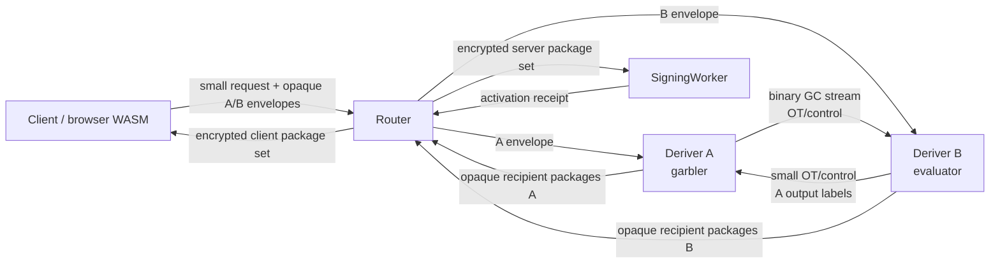

# Streaming Yao for Deriver A and Deriver B

Date created: July 10, 2026

Status: **local implementation closed July 16, 2026**. The viability-first
implementation, hard cutover, Phase 14B artifact split, bounded local security
assurance, and final readiness checkpoint are complete. Cloudflare deployment,
deployed benchmarking, profile selection, and production release evidence remain
deferred to [yaos-ab-deployment.md](./yaos-ab-deployment.md).
Streaming Yao is the sole Ed25519 split-derivation target. The benchmark-only
passive kernel and complete local circuits now pass. Phase 9C local lifecycle
usability is complete. The role-separated ceremony, bounded
streaming engine, Worker-compatible adapters, fault artifacts, and instrumented
release baseline are ready. Recipient-isolated activation, SigningWorker state,
ordinary signing, and low-level exact export pass locally. Local Router admission, fresh
runtime provisioning, same-root recovery, correlated zero-sum refresh, stale
epoch rejection, and post-refresh signing/export now pass the local gate. SDK
Router registration and ordinary signing now pass end to end. The public
passkey `registerWallet` path now executes that same Yao lifecycle, persists
the canonical wallet/account signer projection, and immediately produces a
verified Ed25519 signature through Router A/B normal signing. Mixed public
registration now retains Ed25519 Yao and strict Router A/B ECDSA, including
two exact ECDSA threshold sessions bound to one EVM-family key slot. One
wallet-level signing grant, expiry, and remaining-use counter are shared across
NEAR Ed25519, Tempo ECDSA, and EVM ECDSA; each curve retains its exact
threshold-session and participant binding. Exhausted
Ed25519 signing budget is refreshed by fresh passkey authorization while the
active Client, threshold session, signing grant, and public key remain fixed.
Public passkey `syncAccount` recovery now performs the same-root Yao ceremony,
checks exact credential and lifecycle continuity, commits the replacement
Client only after server promotion, and disposes failed candidates. Browser
persistence retains only the public capability identity; page lifecycle and
explicit lock destroy the live Rust/WASM Client owner.
Phase 9F is complete. The public Ed25519 export lifecycle and the actual React
demo's NEAR identity/readiness projection pass through the managed local
product gate. Cloudflare deployment remains deferred.
The deprecated Rust Ed25519-HSS crate, its benchmarks, and every active Rust
dependency have
been deleted early. Public SDK HSS registration/recovery paths and their stale
fixtures are also deleted. Add-signer, prepared iframe, and Email OTP Ed25519
product orchestration are complete through the shared local Yao lifecycle.
Production integration is owned by Phase 11. Production remains blocked until the deployment, Profile
Selection, and Production Suite Freeze gates pass.

Companion documents:

- [Router A/B solution refactor](./router-a-b-sol-refactor.md)
- [Router A/B specification](./router-a-b-SPEC.md)
- [Router A/B deployment](./router-a-b-deployment.md)
- [Yao A/B deployment and production release](./yaos-ab-deployment.md)
- [Final local readiness receipt](./evidence/yaos-ab-final-local-readiness-v1.json)

Primary external references:

- [Half-Gates](https://eprint.iacr.org/2014/756)
- [Authenticated Garbling and Efficient Maliciously Secure Two-Party Computation](https://doi.org/10.1145/3133956.3134053)
- [Optimizing Authenticated Garbling for Faster Secure Two-Party Computation](https://doi.org/10.1007/978-3-319-96878-0_13)
- [Ferret: Fast Extension for Correlated OT with Small Communication](https://eprint.iacr.org/2020/924)
- [Fast Cut-and-Choose-Based Protocols for Malicious and Covert Adversaries](https://eprint.iacr.org/2013/079)
- [Dual Execution: Optimization and Leakage Analysis](https://www.usenix.org/conference/usenixsecurity16/technical-sessions/presentation/rindal)
- [Swanky](https://github.com/GaloisInc/swanky)
- [EMP-ag2pc](https://github.com/emp-toolkit/emp-ag2pc)
- [Bristol Fashion circuits](https://nigelsmart.github.io/MPC-Circuits/)
- [A Unified Framework for Succinct Garbling from HSS](https://eprint.iacr.org/2025/442)
- [Cloudflare Workers pricing](https://developers.cloudflare.com/workers/platform/pricing/)
- [Cloudflare Workers limits](https://developers.cloudflare.com/workers/platform/limits/)
- [Cloudflare Service Bindings](https://developers.cloudflare.com/workers/runtime-apis/bindings/service-bindings/)
- [Cloudflare Streams](https://developers.cloudflare.com/workers/runtime-apis/streams/)
- [Cloudflare Request and FixedLengthStream behavior](https://developers.cloudflare.com/workers/runtime-apis/request/)
- [Cloudflare Durable Objects pricing](https://developers.cloudflare.com/durable-objects/platform/pricing/)
- [Cloudflare Containers](https://developers.cloudflare.com/containers/)

## Executive Decision

Implement one fixed-function Streaming Yao protocol between Deriver A and
Deriver B for the exact Ed25519 seed-to-scalar derivation. Deriver A is the
garbler. Deriver B is the evaluator. The role assignment is fixed by the
protocol and cannot be selected by a request.

The large garbled-circuit stream travels directly between A and B:

```text
Client -> Router: compact public request and two small HPKE envelopes
Router -> A: compact A envelope
Router -> B: compact B envelope
A <-> B: OT/control messages and the binary garbled-circuit stream
A -> Router: small encrypted A output shares
B -> Router: small encrypted B output shares
Router -> recipients: opaque recipient package sets
```

The client never uploads or downloads the approximately 2 MiB garbled circuit.
The Router never proxies, buffers, logs, or persists it. Normal signing remains
outside the Deriver path after activation.

The preferred strict production profile uses independently administered
Cloudflare Worker accounts for A and B. The post-viability Profile Selection
Gate may select the documented platform fallback while preserving independent
administrative domains and the same cryptographic claim. Same-account Service Bindings provide a valuable
latency lower bound and runtime-compromise containment. They do not provide
independent deployer or account security. Same-account deployment is limited to
local development, staging, and performance experiments.

Plain free-XOR/half-gates Yao is implemented first and supplies the latency
baseline. Fully active security remains the preferred production result. The
post-viability Profile Selection Gate may select an
operationally hardened passive construction when every reviewed active profile
misses the approved online-latency SLO. The selected construction, its exact
corruption model, and every excluded attack are frozen in the signed release
manifest and capability document.

The Ed25519-HSS simulator, succinct-HSS placeholders, old routes, client
garbler/evaluator sessions, and their legacy fixtures are deleted during the
local cutover. The generic threshold service is deleted when its remaining
ECDSA callers complete their strict Router A/B migration. There is one
Ed25519 split-derivation implementation.

ECDSA also remains strict Router A/B. It uses threshold-PRF derivation and
additive secp256k1 scalar shares under its separately specified strict protocol.
ECDSA has no dependency on the Ed25519 Yao crate or stream and must finish its
migration before `ThresholdSigningService` is deleted.

## Security-Performance 80/20 Priority

The implementation order is fixed:

1. freeze one passive benchmark suite;
2. implement wire labels, free-XOR, Half-Gates, tweaks, and gate KATs;
3. execute the complete activation and export circuits;
4. run separate A/B processes with realistic passive OT and private outputs;
5. stream incrementally with bounded memory;
6. make registration, activation, ordinary signing, recovery, refresh, and
   exact seed export usable through the complete local A/B service graph;
7. benchmark that same flow in same-account and separate-account Cloudflare
   deployments;
8. make the Phase 13A viability go/no-go decision; and
9. only after `go`, select/harden a production profile, deepen formal proofs,
   run external review, add durable lifecycle and production integration, and
   delete legacy paths.

Until Phase 13A, work that does not directly improve gate correctness, complete
circuit execution, role separation, realistic bytes/rounds, streaming,
local lifecycle usability and key continuity, or Cloudflare latency, memory,
CPU, and cost is off the critical path. User-visible latency is the primary
product selection criterion. After a viability `go`, the Profile Selection Gate
chooses the strongest coherent security profile meeting the signed p95 and p99
SLO on the real independent-domain topology.

Hardening is evaluated as complete reviewed profiles. Individual mechanisms
cannot be combined into an inflated security claim. Malicious OT without
garbling correctness, for example, does not establish security against a
malicious garbler.

| Profile                                 | Composition                                                                                                                                                                                                                      | Eligible production claim                                                                                                                                     |
| --------------------------------------- | -------------------------------------------------------------------------------------------------------------------------------------------------------------------------------------------------------------------------------- | ------------------------------------------------------------------------------------------------------------------------------------------------------------- |
| P0 — operationally hardened passive Yao | Half-Gates/free-XOR, ordinary reviewed OT, independent administrators, pinned artifacts, fresh per-ceremony material, authenticated transcripts, strict framing, replay controls, recipient encryption, and public output checks | privacy and correctness while both Derivers execute the approved protocol; confidentiality against passive compromise of one Deriver; no active-Deriver claim |
| P1 — reviewed targeted hardening        | P0 plus a complete reviewer-approved set of malicious OT, input consistency, selective-failure, provenance, or output-authentication mechanisms                                                                                  | only the exact one-sided or attack-specific claim proved for the complete composition                                                                         |
| P2 — prepositioned full active          | reviewed active compiler plus malicious OT, provenance, authenticated private outputs, correctness-with-abort, and one-use prepositioning                                                                                        | Router plus at most one malicious Deriver, subject to the frozen assumptions                                                                                  |
| P3 — just-in-time full active           | the P2 security composition with preprocessing on the online path                                                                                                                                                                | same cryptographic claim as P2, with higher expected online latency                                                                                           |

After viability, Phase 6A first attempts P2, then any coherent P1 profile, then P0. P3 is a
correctness and total-cost comparator unless it independently meets the online
SLO. Dual execution remains disqualified because its adversarial leakage can
compound across retries involving long-lived inputs.

Before viability, mandatory controls are limited to an isolated crate, one
compile-time suite, fixed A/B roles, OS randomness outside vectors, exact KATs
and differential tests, bounded parsing, basic constant-time qualification, and
zero production callers. The following additional controls are mandatory before
production promotion:

- independent A and B administrative domains in production;
- pinned protocol, circuit, schedule, binary, and deployment-manifest digests;
- mutually authenticated role-bound transport and signed transcripts;
- strict binary framing, size, sequence, timeout, and replay enforcement;
- fresh labels, OT state, randomness, nonces, and session domains;
- recipient-bound encryption and public output-share consistency checks;
- export authorization, epoch binding, rate limits, and abuse controls;
- constant-time review for the selected cryptographic kernels and platform.

Phase 6A freezes exactly one security profile and one platform profile after
Phase 13A. Public
requests contain no security-level selector, downgrade field, or backend
negotiation. Losing implementations are deleted before product integration.

## Critical Risk Register

Phase 13A owns the viability decision; Phase 6A owns the later production
profile decision. Each owner must close the relevant tripwire before dependent
production work starts.

| Risk                                          | Owner                                     | Tripwire                                                                                 | Required fallback                                                                |
| --------------------------------------------- | ----------------------------------------- | ---------------------------------------------------------------------------------------- | -------------------------------------------------------------------------------- |
| No acceptable active construction             | protocol lead and independent reviewer    | leakage, unsupported composition, rejected assumptions, or active profile misses the SLO | evaluate a coherent P1 profile, then P0 with an explicitly reduced claim         |
| No reviewable implementation path             | Rust crypto lead and independent reviewer | no auditable build-or-port plan inside the approved effort budget                        | select the next security profile; stop only when P0 also lacks a reviewable path |
| Worker garbling primitive is unsafe           | constant-time reviewer and Worker lead    | compiled WASM review finds secret-dependent memory or control flow                       | move both roles to separate-account Containers or independent native VMs         |
| Worker latency, memory, or round budget fails | performance owner and protocol lead       | measured Phase 13A passive baseline exceeds viability budgets                            | stop, or explicitly test the next platform rung before hardening                 |
| Security claim exceeds selected profile       | product-security owner and reviewer       | capability or release text claims an attack class absent from the proof                  | stop release and reduce the claim or select a stronger measured profile          |
| Durable state dominates the critical path     | Cloudflare runtime owner                  | measured transaction graph misses the reissued p95 or p99 budget                         | coalesce safe local transitions, remove network waits, then change platform      |
| Ticket burning enables cost exhaustion        | abuse and operations owner                | wallet, organization, tenant, or global burn budget is exceeded                          | throttle admission, open the circuit breaker, and suspend preprocessing          |
| Epoch state can roll back                     | release-security owner                    | either role accepts an epoch below the independent signed floor                          | stop issuance and rotate the entire base-OT channel epoch                        |
| Circuit rollout revives stale tickets         | release owner                             | an old digest can activate after its floor or reappear after restore                     | stop issuance, destroy stale material, and complete only the bounded drain set   |

## Platform Fallback Ladder

The independent-administrator requirement and exact-claim requirement are
fixed. Phase 13A measures Workers in both account modes first. After a `go`,
Phase 6A chooses the first feasible execution platform for each serious
security profile in this order:

1. separate-account Cloudflare Workers;
2. separate-account Cloudflare Containers;
3. independently administered native services or VMs.

Each transition requires a new deployment profile, cost and placement
measurements, dependency and supply-chain review, constant-time and compiled
code review, erasure analysis, and independent approval. Containers and VMs
change the trusted computing base and operational model. Hardware acceleration,
including AES instructions, is measured and never assumed. Succinct HSS is
outside this fallback ladder.

Same-account Workers remain the development, staging, and transport lower-bound
profile for every selected construction.

## Normative Spec Extraction

This document tracks architecture, decisions, experiments, and phase status.
Frozen protocol material belongs in small versioned specifications. Continue
the existing `ideal-functionalities-v1.md` and `input-provenance-v1.md` pattern
with versioned specifications for:

- fixed circuit encodings, constants, KDFs, and golden vectors;
- the passive benchmark suite, labels, delta, gate tweaks, garbling hash, gate
  equations, and viability report;
- the Phase 6A security-profile, construction, and assumption decision;
- the binary stream manifest and frame grammar;
- the selected session lifecycle, optional preprocessing-ticket lifecycle,
  epoch floor, and circuit rollout;
- approved deployment profiles and peer identity rules;
- the reissued release SLO and resource budgets.

CI regenerates all prose golden bytes and digests from
`tools/ed25519-yao-generator`, diffs them against the versioned specifications,
and fails on unexplained drift. The living plan references those artifacts and
does not become their sole normative source.

## Document Authority and Resolved Conflicts

The July 10, 2026 Phase 0 decision resolved these prior conflicts:

- `router-a-b-sol-refactor.md` classified Yao as a benchmark-only oracle and
  required genuine succinct HSS as the production implementation.
- `router-a-b-deployment.md` described same-account Cloudflare as a production
  profile.
- protocol identifiers and routes used HSS and `SignerA` / `SignerB`
  terminology for derivation roles.

The three implementation plans and the normative Router A/B documents were
checkpointed together when Phase 0 closed. From that checkpoint:

- this document is authoritative for the Ed25519 secure-computation backend;
- `router-a-b-sol-refactor.md` remains authoritative for the wider strict
  Router A/B and ECDSA migration;
- `router-a-b-SPEC.md` remains authoritative for product lifecycle and public
  route behavior;
- `router-a-b-deployment.md` remains authoritative for deployment mechanics,
  with separate accounts promoted to the strict production profile.

The July 10, 2026 performance-priority amendment supersedes the prior rule that
production must stop when full active security misses the SLO. Streaming Yao
remains the sole backend and independent A/B administration remains mandatory.
Phase 6A may now select P0, P1, P2, or P3 under the 80/20 policy. The Router and
formal-verification companion plans must be aligned with the selected profile
before their corresponding gates close.

No active, normative, capability, or release document may continue to advertise
the current HSS simulator as a succinct-HSS implementation. Historical
optimization records may retain dated descriptions of what was measured.

## Goal

Produce the exact Ed25519 derivation:

```text
d = LE32(y_client + y_server mod 2^256)
h = SHA-512(d)
a = clamp(h[0..32]) mod l
```

while preserving these custody rules during honest execution and against the
corruption class claimed by the selected profile:

```text
Deriver A never learns B inputs or a joined output.
Deriver B never learns A inputs or a joined output.
Router never learns either Deriver plaintext.
Client receives only x_client_base and an authorized seed export.
SigningWorker receives only x_server_base.
No server role reconstructs d or a.
```

The preferred P2/P3 production claim is:

> The Streaming Yao Router A/B ceremony provides privacy and
> correctness-with-abort against the Router plus at most one malicious Deriver,
> assuming independent A and B administrative domains, a reviewed actively
> secure two-party protocol, an approved proof binding each role input to its
> provisioned root and epoch, authenticated role-bound transport, one-use
> preprocessing, and no A+B collusion.

If Phase 6A selects P0, the production claim is reduced to:

> The Streaming Yao Router A/B ceremony provides privacy and correctness while
> both Derivers execute the approved protocol, and confidentiality against
> passive compromise of at most one Deriver, assuming independent A and B
> administrative domains, authenticated role-bound transport, fresh
> per-ceremony cryptographic material, and no A+B collusion. It provides no
> protection against an actively deviating Deriver.

P1 uses only the narrower corruption and attack-specific claim approved in its
decision record. Public capability text always identifies the selected profile
and its exclusions.

## Scope

In scope:

- Ed25519 registration, activation, recovery, refresh, and authorized export;
- exact seed-derived Ed25519 identity and export parity;
- a fixed circuit and fixed role assignment;
- just-in-time binary streaming;
- one-use OT and garbling preprocessing;
- optional prepositioning of one-use garbled circuits for lower online latency;
- same-account Cloudflare benchmarking;
- separate-account Workers as the preferred production transport, with
  Containers or independently administered native services as approved Phase
  6A fallbacks;
- strict Router A/B product integration;
- measured Streaming Yao latency and cost evidence, with historical HSS
  measurements retained only as dated context;
- selection of the strongest reviewed P0-P3 security profile meeting the
  approved latency SLO;
- deletion of the losing Ed25519 production path.

Out of scope:

- a general-purpose garbled-circuit framework;
- caller-selected MPC backends or runtime protocol negotiation;
- routing ECDSA through the Ed25519 circuit;
- normal Ed25519 signing after activation;
- protection against A+B collusion;
- protection against a Cloudflare platform-wide compromise;
- fairness or guaranteed output delivery;
- seed secrecy from the client during an explicitly authorized export.

## Exact Functionality

### Field and Byte Conventions

Freeze all conventions in test vectors before circuit work:

- `y` contributions are 256-bit little-endian integers in
  `Z_(2^256)`.
- `tau` contributions and signing outputs are canonical scalars in
  `Z_l`.
- `d` is the 32-byte little-endian encoding of the joined `y` sum.
- SHA-512 consumes exactly those 32 bytes with standard SHA-512 padding.
- clamp clears bits 0, 1, and 2 of byte 0, clears bit 7 of byte 31, and sets
  bit 6 of byte 31.
- `a` is the clamped first half of SHA-512 interpreted little-endian and
  reduced modulo `l` for scalar arithmetic.
- every scalar decoder rejects non-canonical encodings.
- circuit bit numbering, wire order, gate order, and output order are fixed in
  the circuit manifest.

### Stable Key Context and Ceremony Context

Existing key derivation hashes HSS-named scheme and domain bytes in
`crates/signer-core/src/near_ed25519_recovery.rs`. Renaming those bytes changes
`d` and the Ed25519 public key. Separate two contexts:

- `StableKeyDerivationContext` contains only immutable, key-affecting bytes;
- `CeremonyTranscriptContext` contains request kind, Yao protocol/circuit IDs,
  tickets, roles, epochs, authorization, and transport metadata.

The approved development cutover reprovisions every affected Ed25519 wallet
under one new frozen Yao-era `StableKeyDerivationContext`. Phase 1 freezes its
exact bytes and golden vectors before product integration. There is no runtime
compatibility flag, retained HSS backend, per-request context choice, or secure
conversion path for existing development wallets.

The version-one stable context encoding and its binding are now frozen:

```text
context_domain = ASCII("seams/router-ab/ed25519-yao/stable-key-context/v1")
binding_domain = ASCII("seams/router-ab/ed25519-yao/stable-key-context-binding/v1")

participant_low  = min(participant_id_1, participant_id_2)
participant_high = max(participant_id_1, participant_id_2)

StableKeyDerivationContextV1 =
    context_domain
    || application_binding_digest[32]
    || BE16(participant_low)
    || BE16(participant_high)

StableKeyDerivationContextBindingV1 =
    SHA-256(binding_domain || StableKeyDerivationContextV1)
```

Both participant identifiers are unsigned 16-bit integers, nonzero, and
distinct. Sorting makes the encoding independent of caller order. The
application binding digest is an immutable SDK-owned 32-byte value. Lifecycle,
authorization, transport, deployment, key-epoch, ticket, and circuit metadata
remain in `CeremonyTranscriptContext` and never enter this stable encoding.

The upstream application-binding preimage and canonical encoder are frozen as:

```text
LP32(x) = BE32(byte_length(x)) || x

application_binding_domain =
    ASCII("seams/router-ab/ed25519-yao/application-binding/v1")

Ed25519YaoApplicationBindingV1 =
    LP32(application_binding_domain)
    || LP32(ASCII("walletId"))
    || LP32(UTF8(walletId))
    || LP32(ASCII("nearEd25519SigningKeyId"))
    || LP32(UTF8(nearEd25519SigningKeyId))
    || LP32(ASCII("signingRootId"))
    || LP32(UTF8(signingRootId))
    || LP32(ASCII("keyCreationSignerSlot"))
    || LP32(BE32(keyCreationSignerSlot))

application_binding_digest = SHA-256(Ed25519YaoApplicationBindingV1)
```

Each of the three string values contains one or more visible ASCII bytes in the
inclusive range `0x21..=0x7e`. Spaces, control bytes, non-ASCII code points,
trimming, and Unicode normalization are outside the version-one grammar. The
encoder preserves the exact validated bytes, and every byte length must fit an
unsigned 32-bit integer. SDK integration must construct these facts from
authenticated domain records through parsers that enforce this same grammar.
`keyCreationSignerSlot` is a positive unsigned 32-bit integer encoded as four
big-endian bytes inside its `LP32` value.

`keyCreationSignerSlot` means the signer slot fixed when this wallet key is
created. It is immutable, key-affecting identity. Same-root recovery retains
it. Changing it changes the application digest, `d`, and public key and is an
explicit wallet-key creation or rekey. Adding a recipient for the same logical
key retains the original key-creation slot; the recipient slot stays in the
ceremony transcript and provenance statement.

The binding excludes `nearAccountId` because an implicit NEAR account ID is
derived from the final public key and would create a circular KDF input. It also
excludes `signingRootVersion`, deployment/root/key/activation epochs,
lifecycle/request/auth/transport/ticket data, and mutable active, default, or
recipient signer slots. These values bind the ceremony or provenance record.
They do not enter the stable KDF identity.

The committed golden fixture uses `wallet-fixture`, `ed25519ks_fixture`,
`project-fixture:env-fixture`, and key-creation slot `1`. Its canonical encoding
is:

```text
000000327365616d732f726f757465722d61622f656432353531392d79616f2f6170706c69636174696f6e2d62696e64696e672f76310000000877616c6c657449640000000e77616c6c65742d66697874757265000000176e656172456432353531395369676e696e674b6579496400000011656432353531396b735f666978747572650000000d7369676e696e67526f6f7449640000001b70726f6a6563742d666978747572653a656e762d66697874757265000000156b65794372656174696f6e5369676e6572536c6f740000000400000001
```

Its application-binding digest is
`b1dbafce5fd696ae4bd5611e3684a778febfdf7f716e2dfe3211ce0cff708121`.
With participant identifiers `1` and `2`, the resulting stable-context binding
is `b5601ad156882b545a2e4a4a694e87c7982842d37a4c666645302604b2720655`.

A separate stable-context unit vector with
`application_binding_digest = 0x42 * 32` and participant identifiers `1` and
`2` ends in `00010002`; its binding digest is
`ce5305908b0c31bfe09072b549cb349b0c901f7d3fde60c63fa8e2dfb088a42d`.

The version-one role-local contribution KDF is also frozen:

```text
extract_salt = ASCII("seams/router-ab/ed25519-yao/contribution-kdf/hkdf-sha256/extract/v1")
expand_domain = ASCII("seams/router-ab/ed25519-yao/contribution-kdf/hkdf-sha256/expand/v1")

role_tag   = A:0x01 | B:0x02
source_tag = client:0x01 | server:0x02
output_tag = y:0x01 | tau:0x02

PRK = HKDF-Extract-SHA256(extract_salt, root[32])
info = expand_domain || 0x00 || role_tag || source_tag || output_tag
       || StableKeyDerivationContextBindingV1[32]

y = HKDF-Expand-SHA256(PRK, info(output=y), 32)
tau_wide = HKDF-Expand-SHA256(PRK, info(output=tau), 64)
tau = LE512(tau_wide) mod l, encoded as one canonical LE32 scalar
```

One stable client derivation root produces the role-separated client/A and
client/B contributions. Deriver A's independent stable root produces only the
server/A contribution. Deriver B's independent stable root produces only the
server/B contribution. The KDF runs at initial provisioning or explicit wallet
key rotation. Activation consumes committed packages. Version-one recovery
rewraps the same logical client derivation root under the replacement
credential. Version-one refresh applies the explicit correlated zero-sum
transition defined below. An unavailable or compromised client root requires an
explicit wallet rekey with a new public identity.

Request kind, authorization, transport, deployment, HPKE, storage, ticket,
activation, root-share, and SigningWorker epochs never enter `info`. They bind
the ceremony and input-provenance statement separately. The isolated reference
implementation and committed continuity corpus live under
`tools/ed25519-yao-generator`; production root custody and provenance proof
remain later security gates.

The circuit receives four `y` contributions:

```text
y_A = y_client_A + y_server_A mod 2^256
y_B = y_client_B + y_server_B mod 2^256
d   = LE32(y_A + y_B mod 2^256)
```

It also receives four `tau` contributions:

```text
tau_A = tau_client_A + tau_server_A mod l
tau_B = tau_client_B + tau_server_B mod l
tau   = tau_A + tau_B mod l
```

The unshared mathematical outputs are:

```text
x_client_base = a + tau mod l
x_server_base = a + 2 * tau mod l
```

Neither mathematical output is decoded to either Deriver.

### Fixed Circuit Families

The target has two production circuit artifact families:

1. `ed25519_yao_activation_v1`
   - registration;
   - recovery;
   - refresh;
   - packages consumed by activation without another circuit evaluation;
   - output shares for `x_client_base` and `x_server_base`;
   - no seed output wires.
2. `ed25519_yao_export_v1`
   - explicitly authorized export;
   - masked `d` shares to the authorized client;
   - public transcript evidence and no other secret output;
   - a distinct circuit digest, authorization scope, and transcript domain.

Request kind remains part of the transcript even when several lifecycle
operations use the same activation circuit. A normal ceremony cannot carry an
export field, export recipient, or seed-output branch.

The product/control operation, canonical request kind, ideal functionality, and
circuit family mapping is fixed as follows:

| Product/control operation   | Request kind   | Ideal functionality         | Circuit family                                 |
| --------------------------- | -------------- | --------------------------- | ---------------------------------------------- |
| `registration_prepare`      | `registration` | `F_ed25519_registration_v1` | `ed25519_yao_activation_v1`                    |
| `signing_worker_activation` | `activation`   | `F_ed25519_activation_v1`   | committed `ed25519_yao_activation_v1` packages |
| `recovery`                  | `recovery`     | `F_ed25519_recovery_v1`     | `ed25519_yao_activation_v1`                    |
| `server_share_refresh`      | `refresh`      | `F_ed25519_refresh_v1`      | `ed25519_yao_activation_v1`                    |
| `key_export`                | `export`       | `F_ed25519_export_v1`       | `ed25519_yao_export_v1`                        |

Router performs this conversion at the admitted request boundary. Callers never
select the ideal functionality or circuit family. Activation consumes and
verifies the previously committed activation-family packages; registration,
recovery, and refresh perform the Yao evaluation that creates them. Only
`F_ed25519_export_v1` has seed-output wires or seed-share packages.

Phase 2A emits provisional construction-independent compiler, evaluator,
schedule, and gate-count evidence. Phase 2B reconciles that evidence against the
completed Phase 1 contract and freezes a deterministic core-function digest and
benchmark manifest, schedule, gate counts, and `32 * AND` table-byte estimate.
Phase 3 creates the first actual garbled tables and evaluator execution. Phase
6A selects the security profile and
randomized-output realization. Phase 6B freezes the production composition,
regenerates the final production circuit manifests and digests, and freezes
them. Neither a Phase 2A artifact nor the Phase 2B benchmark manifest ID can be
used in production, including when P0 is selected; Phase 6B emits a distinct
production security-suite digest.

The activation circuit covers the derivation and output-activation portion of a
refresh. Any protocol that refreshes role roots or persisted contributions must
preserve the joined `y` and `tau`, run as a separately reviewed strict A/B
state transition, and avoid reconstructing either joined value.

Use disjoint request and state-transition types:

| Operation    | Required pre-state                                  | Persisted change                                                                                 | Identity invariant                                          |
| ------------ | --------------------------------------------------- | ------------------------------------------------------------------------------------------------ | ----------------------------------------------------------- |
| Registration | no registered Ed25519 key                           | create roots, contributions, recipients, and registered key                                      | establish one new `A_pub`                                   |
| Activation   | registered key and inactive output shares           | activate recipient shares                                                                        | preserve registered `A_pub`                                 |
| Recovery     | registered key plus approved recovery authorization | rewrap the same logical client root, issue fresh activation packages, and promote the credential | `d_after = d_before` and `A_pub_after = A_pub_before`       |
| Refresh      | registered key plus current role epochs             | apply correlated deltas, issue fresh activation packages, and advance role/worker epochs         | joined `y`, joined `tau`, `d`, and `A_pub` remain unchanged |
| Export       | registered key plus explicit export authorization   | audit/consume state only                                                                         | reconstructed `d` derives registered `A_pub`                |

Version-one recovery is a same-root rewrap. Admission suspends the old
credential, unwraps the exact same logical 32-byte client derivation root under
approved recovery authorization, and rewraps it for the replacement credential.
The stable context, immutable key-creation signer slot, client contributions,
server contributions, `d`, `a`, `tau`, scalar bases, public points, and
registered `A_pub` remain identical. The ceremony uses fresh protocol coins,
activation packages, ticket, and activation epoch. Successful activation
promotes the replacement credential and tombstones the old credential binding.

Recovery never exposes seed shares and has no compensating-root branch. If the
logical client root is unavailable or suspected compromised, the wallet enters
an explicit rekey flow that creates a new `d` and public key. Production root
custody and proof that both role inputs came from the retained root remain
stop-ship blockers.

Version-one refresh keeps every stable root, the stable context, and both client
contributions unchanged. It updates the effective persisted server
contributions with explicit nonzero deltas:

```text
y_server_A'   = y_server_A + delta_y mod 2^256
y_server_B'   = y_server_B - delta_y mod 2^256
tau_server_A' = tau_server_A + delta_tau mod l
tau_server_B' = tau_server_B - delta_tau mod l
```

The joined `y` and `tau`, and therefore `d`, `a`, both scalar bases, public
points, and `A_pub`, remain unchanged. The host lifecycle is frozen as:

```text
Active(current)
  -> Prepared(next)
  -> OutputCommitted(next)
  -> WorkerActivated(next)
  -> Active(next) + RetiredTombstone(current)
```

Before `OutputCommitted`, an abort discards the prepared next epoch and leaves
the current epoch active. At and after `OutputCommitted`, the refresh transition
advances forward-only: the parties may redeliver the exact committed
ciphertexts, and they may not re-evaluate with new randomness, replace either
delta, or roll back to the prior epoch. A partial cutover freezes new derivation
admission until the committed next epoch reaches `WorkerActivated`; activation
rejects stale role/worker epochs and retires the previous epoch.

This refresh preserves identity against static corruption. It makes no
proactive or mobile-adversary healing claim. Deployed A/B delta-contribution
origination, entropy and anti-bias, role-local custody and provenance, selected
output generation and binding, and atomic distributed persistence remain
stop-ship blockers.
Registration
cannot require a pre-existing account public key. The current
`Recovery -> Export` request mapping and conflicting registration preconditions
must be deleted when the disjoint product types land.

### Protocol-Generated Output Sharing

Ordinary Yao gives decoded outputs to the evaluator. That behavior would let
Deriver B learn a joined signing value. Each output must instead use a
protocol-generated random sharing whose distribution cannot be biased by either
party within the protocol.

For every scalar output `x`:

```text
R <- Z_l inside the approved randomized 2PC functionality
z_A = R
z_B = x - R mod l
```

The circuit privately outputs:

```text
z_A only to Deriver A
z_B only to Deriver B
```

Neither Deriver supplies `R` as a freely chosen linear mask. A construction such
as protocol-native random output sharing or committed private seeds passed
through a reviewed in-circuit PRF/extractor may realize the functionality. The
P2/P3 proof must show that one corrupt role cannot force the honest role's
decoded share to equal the joined output through a degenerate seed, selective
failure, or abort pattern. P0 assumes honest execution of the approved
randomized-output algorithm and retains public output checks; P1 states only its
reviewed coverage.

For seed export:

```text
U <- Z_(2^256) inside the approved randomized 2PC functionality
d_A = U
d_B = d - U mod 2^256
```

Private garbler output requires a two-output construction. A generates and
retains the semantic translation map for A-output wires. B receives no semantic
mapping for those wires and returns only A's selected opaque labels after any
verification required by the selected profile. B receives translation data only
for B-output wires. P1-P3 authenticate output paths to the extent required by
their selected claim. P0 uses recipient encryption, transcript binding, signed
package digests, and public consistency checks under its honest-execution
assumption.

A and B separately encrypt their scalar shares to the authorized recipient.
Packages bind:

- protocol and circuit digest;
- lifecycle and operation;
- wallet, account, and key identity;
- root and deployment epochs;
- Deriver role and peer identities;
- recipient role and public key;
- selected session or preprocessing-ticket ID;
- transcript root;
- output kind;
- expiration and replay domain.

Each scalar share includes a public point commitment. An individual additive
share may be zero, in which case its canonical point commitment is the Edwards
identity. Rejecting or retrying that valid outcome would change the randomized
sharing distribution. P1-P3 use any selected active-output MAC, proof, or
authenticated-label opening to bind the decoded scalar, its point, the recipient
ciphertext digest, and the transcript to the 2PC output. P0 uses signed
transcript/package binding and public consistency checks under honest execution.
A self-consistent scalar and point supplied after circuit execution is
insufficient for an active-Deriver claim because correlated changes to the two
outputs can preserve the public relation below.

The recipient verifies the selected output binding and its scalar against the
point before combining. A public output receipt carries `X_client`, `X_server`,
`A_pub`, the complete recipient-package digest set, the session/ticket ID, and
the transcript root to both recipients. Both Derivers sign that receipt. The
combined public points must satisfy:

```text
X_client = x_client_base * B
X_server = x_server_base * B
A_pub    = a * B

2 * X_client - X_server = A_pub
```

Before this check, parse every share verification point, `X_client`, `X_server`,
and `A_pub` from a canonical Edwards encoding and reject small-order, torsion,
and non-prime-subgroup points. Permit identity only for an individual additive
share whose decoded scalar is exactly zero, and verify strict scalar-to-point
equality for every private share received by that recipient. Reject identity for
the joined `X_client`, joined `X_server`, and `A_pub`; an identity joined signing
share gives the other recipient the complete signing scalar and violates the
two-party authorization boundary.

Freeze the normal-signing verifying-share mapping:

```text
V_client = 2 * X_client
V_server = -X_server
V_client + V_server = A_pub
```

The normal-signing mapping helper now lives in `signer-core` and is protected
by golden point-encoding and signing vectors.

During export, the client reconstructs `d`, recomputes
`d -> SHA-512(d) -> clamp -> a`, derives the Ed25519 public key, and compares it
with the registered identity.

### Input Provenance

Active 2PC proves correct computation over the supplied inputs. It does not by
itself prove that a malicious Deriver supplied the role input committed during
wallet provisioning.

The production design must bind each role input to:

- the role-local root or stable provisioned material;
- wallet and key identity;
- derivation context and path;
- root epoch;
- request kind;
- client envelope commitment;
- authorization digest.

Phase 6A must select the input-provenance scope. P2/P3 require a reviewed
commitment and proof mechanism. P1 covers only its reviewed subset. P0 binds the
declared root, context, request, and epoch into signed transcripts while assuming
each Deriver honestly derives its role input. The active anti-bias target is a
Deriver that adaptively chooses an input, selectively aborts, or retries after
learning peer-dependent information to bias an accepted `A_pub`; only profiles
whose proof prevents that strategy may claim active anti-bias. Recovery and
refresh must preserve the registered public identity in every profile. A
public-key parity check detects an identity change but does not prove that a P0
Deriver used the correct role root.

Client selection of its own root contribution, including vanity-key grinding,
is a separate product and admission-control policy. If the product permits it,
the release claim states that choice explicitly and applies authenticated
wallet, organization, and tenant rate limits. The protocol must never claim to
prevent client-selected grinding.

## Target Architecture



### Payload Boundaries

| Link                    | Allowed payload                               |                                         Size class | Forbidden payload                                |
| ----------------------- | --------------------------------------------- | -------------------------------------------------: | ------------------------------------------------ |
| Client to Router        | public intent, authorization, A/B ciphertexts |                                                KiB | garbled tables, labels, clear Deriver inputs     |
| Router to A             | A-scoped envelope and public metadata         |                                                KiB | B plaintext, joined input, circuit stream        |
| Router to B             | B-scoped envelope and public metadata         |                                                KiB | A plaintext, joined input, circuit stream        |
| A to B                  | signed control, OT, binary garbled stream     | approximately 2 MiB plus selected-profile overhead | client-readable encoding, JSON/base64 table      |
| B to A                  | signed control, OT, A-output labels, receipt  |                                                KiB | decoded joined output                            |
| A/B to Router           | recipient ciphertexts and public receipt      |                                                KiB | recipient plaintext or joined output             |
| Router to Client        | client-encrypted package set                  |                                                KiB | server plaintext, joined `a`, normal seed output |
| Router to SigningWorker | server-encrypted package set                  |                                                KiB | client plaintext, `d`, joined `a`                |
| Router logs             | identifiers, public digests, status, timings  |                                              bytes | labels, masks, OT state, input/output plaintext  |

### Network and Administrative Edges

Freeze every production edge, rather than only A-to-B:

| Edge                    | Production transport                                                         | Authentication and secrecy                                           |
| ----------------------- | ---------------------------------------------------------------------------- | -------------------------------------------------------------------- |
| Client to Router        | public HTTPS                                                                 | application auth, authorization, replay binding, role HPKE envelopes |
| Router to A             | cross-account HTTPS                                                          | Router signature, A endpoint pin, A HPKE ciphertext                  |
| Router to B             | cross-account HTTPS                                                          | Router signature, B endpoint pin, B HPKE ciphertext                  |
| A to B and B to A       | direct cross-account HTTPS                                                   | pinned peer identity, signed session, binary frame MACs              |
| A/B to Router           | response or signed HTTPS callback                                            | recipient ciphertext and signed public receipt only                  |
| Router to Client        | original HTTPS response or authenticated poll                                | client-recipient ciphertexts                                         |
| Router to SigningWorker | Service Binding only when administratively co-hosted; signed HTTPS otherwise | SigningWorker envelope and Router/Worker identity                    |
| SigningWorker to Router | bound response                                                               | signed activation or signing receipt                                 |

The Router relays compact recipient ciphertexts. A and B never require a direct
browser connection. The product/control account owns Router and SigningWorker;
Deriver A and Deriver B each use a different Cloudflare account, administrator,
deployment credential, storage boundary, and audit trail. Router-to-
SigningWorker may use a Service Binding inside the product account. Every A or
B edge uses signed cross-account HTTPS. Production deletes `.internal` Service
Binding URLs for every edge that crosses an account boundary.

### Online Ceremony

1. The client derives and splits `y_client` and `tau_client`.
2. The client creates distinct HPKE envelopes for A and B.
3. The Router authenticates the lifecycle request, freezes recipient keys, and
   dispatches the compact role envelopes.
4. Each Deriver validates its envelope and derives its role-local server input.
5. A and B establish the selected one-use session. Profiles with preprocessing
   run the signed two-phase reservation handshake and burn ambiguous tickets;
   P0 activates fresh just-in-time state without a preprocessing reservation.
6. A and B complete the selected construction's bounded pre-stream control
   rounds. Every unpredictable challenge is sampled only after all challenged
   commitments are durably persisted and authenticated.
7. A begins the direct binary request stream only when the selected construction
   authorizes release.
8. A garbles in fixed topological order while the transport applies
   backpressure.
9. B parses, authenticates, and evaluates each chunk as it arrives.
10. B decodes only its authenticated share, enters `OutputPrepared` for its
    packages, then returns A's opaque selected output labels, B's package
    digests, and its signed transcript root in the response to A's stream.
11. A decodes only its authenticated share.
12. A builds and persists its exact recipient ciphertexts and selected output
    bindings in `OutputPrepared` state.
13. A sends one small output-commit request containing the complete digest set
    and A's signature. B verifies, co-signs, enters `OutputCommitted`, consumes,
    and returns its signature. A verifies, enters `OutputCommitted`, and
    consumes.
14. Only consumed sessions or tickets release the persisted packages to the
    Router for opaque relay. Recipients validate the selected output bindings,
    combine their shares, and verify the public receipt.
15. The Router records only public terminal receipts. Exact ciphertext
    redelivery remains allowed; cryptographic reevaluation does not.

Normal signing after activation is:

```text
Client -> Router -> SigningWorker -> Router -> Client
```

It performs zero Deriver calls and zero Yao operations.

## Fixed-Circuit and Garbling Design

### Circuit Compilation

Build a fixed, generated circuit rather than a generic runtime circuit loader.
The compiler pipeline should:

1. encode the exact reference functionality;
2. specialize the fixed SHA-512 IV and 32-byte message padding;
3. constant-fold public values;
4. synthesize 256-bit addition, clamping, reduction modulo `l`, `tau`
   arithmetic, and deterministic mathematical outputs;
5. assign a canonical topological gate order;
6. compute live-wire intervals and compact reusable wire slots;
7. emit compact binary IR/schedule files; Phase 2A attaches only its canonical
   reproducibility index;
8. digest the compiler version, source IR, schedule, constants, input schema,
   output schema, and gate counts.

Phase 2A exposes mathematical outputs only inside a provisional local passive
benchmark/test harness. Phase 2B mechanically reconciles that benchmark
artifact with the closed Phase 1 contract. Phase 6B later composes the Phase
6A-selected input handling,
compiler, hardening, and randomized-output functionality, then generates the
production artifacts.

CI regenerates each artifact and fails on an unexplained digest or gate-count
change. Production embeds only the reviewed Phase 6B artifacts. Runtime uploads
and caller-provided circuits are rejected.

### Initial Size Budget

The published Bristol SHA-512 compression circuit contains:

- 57,947 AND gates;
- 286,724 XOR gates;
- 4,946 inversions;
- AND depth 3,303.

Half-Gates sends two 128-bit ciphertexts per AND and uses free-XOR:

```text
57,947 AND * 32 bytes = 1,854,304 bytes = 1.768 MiB
```

Specializing the fixed IV and fixed padding is expected to reduce the SHA-512
portion to approximately 49,000 AND gates, or about 1.50 MiB of half-gate
tables. Addition, reduction, `tau` arithmetic, randomized output sharing, OT
material, input provenance, active security, and framing add to that value.

Planning budgets before synthesis:

| Artifact                               |                     Provisional budget |
| -------------------------------------- | -------------------------------------: |
| Specialized semi-honest SHA-512 tables |                             `1.50 MiB` |
| Complete passive benchmark circuit     |                        `1.65-2.10 MiB` |
| Base64 representation                  |                              forbidden |
| Input-provenance proof/setup           |                       must be measured |
| Production selected-profile overhead   |                       must be measured |
| Sampled shared-isolate memory gate     | P999 `< 96 MiB`, zero `exceededMemory` |

The production report includes selected input-provenance bytes, setup, rounds,
A/B CPU, verification CPU, and any added circuit gates alongside the selected-
profile overhead. Those costs cannot disappear into an unmeasured provisioning
bucket.

Garbled tables are pseudorandom and effectively incompressible. HTTP
compression is disabled. All size gates use binary bytes on the wire.

### Garbling Core

The implementation must freeze and review:

- security parameter;
- free-XOR and Half-Gates construction;
- the Phase 3 benchmark garbling hash: one compile-time-fixed implementation
  with exact known-answer tests and basic native/WASM constant-time
  qualification; Phase 6A either promotes and hardens it or deletes and replaces
  it with a reviewed correlation-robust primitive and written composition
  rationale;
- gate-tweak domain and uniqueness;
- label representation;
- point-and-permute convention;
- global-delta lifecycle;
- OT suite;
- selected security-profile compiler and checks;
- transcript hash;
- peer authentication;
- recipient HPKE/AEAD suites;
- random-number source.

Every primitive must have an explicit proof reference or review rationale.
Convenient general-purpose hashes cannot be substituted for the garbling hash
without analyzing the required correlation-robustness property.

Review the selected primitive in Rust source, native assembly where used, and
the final compiled WASM. Table-indexed software AES and any secret-dependent
memory or control flow fail the Worker profile. A native fallback must repeat
the compiled-output review for its actual target CPU and enabled features.

The passive protocol API is benchmark-only until Phase 6A. If P0 is selected,
the operationally hardened passive ceremony becomes the sole production
entrypoint and the benchmark-only harness remains isolated. If P1, P2, or P3 is
selected, delete every externally callable passive ceremony entrypoint. Shared
internal garbling primitives may remain where the selected construction uses
them.

## Binary Streaming Protocol

### Control Plane and Data Plane

Keep control messages small, canonical, and signed. The garbled-circuit data
plane uses `application/octet-stream` and a dedicated direct A-to-B route.

Do not pass the stream through:

- `router-ab-core::WireMessageV1`;
- JSON;
- base64;
- `post_service_json`;
- a JavaScript string;
- a whole-body `arrayBuffer()`;
- Router relay or persistence.

The existing whole-message path clones and re-encodes owned byte vectors. It
prevents incremental evaluation and adds avoidable memory copies.

### Stream Manifest

The signed opening manifest includes:

- protocol identifier;
- selected security suite and exact claim identifier;
- circuit identifier and digest;
- compiler and parameter digest;
- ceremony and ticket IDs;
- role identities and peer key fingerprints;
- account, wallet, key, and operation;
- root and deployment epochs;
- authorization and recipient-key digests;
- exact `body_bytes`, including every frame header and payload;
- exact `table_payload_bytes`;
- exact count and payload bytes for every frame type;
- chunk-size limit;
- transcript nonce;
- expiry;
- previous peer-message digest.

B authenticates and reserves the ticket before reading the body.

A wraps the body in Cloudflare's `FixedLengthStream` using the manifest's exact
byte count. Cloudflare can then set `Content-Length`; an ordinary
`ReadableStream` uses chunked transfer encoding. B rejects a missing or
mismatched fixed length before consuming table frames.

### Frame Format

Use a compact fixed-width binary header:

```text
magic
format version
frame type
sequence number
public gate-range start
public gate count
payload length
previous-frame digest
payload digest or session MAC
payload
```

Requirements:

- fixed maximum frame size, initially benchmarked at 64, 128, and 256 KiB;
- a `FixedLengthStream` whose total equals the signed manifest;
- exact monotonic sequence;
- no gaps, duplicates, or reordering;
- public gate ranges only;
- incremental transcript hashing;
- session authentication derived from a signed ephemeral peer handshake;
- a session MAC over the canonical frame header, previous-frame digest, and
  payload bytes;
- terminal signed transcript roots from both roles;
- exact EOF and total-length verification;
- abort and ticket destruction on overflow, truncation, malformed framing,
  digest mismatch, timeout, disconnect, or trailing bytes.

TLS protects the network hop. Transcript authentication binds the cryptographic
ceremony to role identities and survives differences between Service Binding
and public HTTPS transports.

### Incremental Evaluation

A:

- generates tables in canonical gate order;
- keeps only current garbling state, live labels, and the current output chunk;
- sends through a backpressure-aware `ReadableStream`;
- never materializes the whole table in JavaScript memory.

B:

- validates each frame before evaluation;
- evaluates XOR/inversion gates from the embedded schedule;
- consumes AND tables sequentially;
- uses liveness-based wire-slot reuse;
- keeps no full table copy;
- rejects any mismatch before releasing output;
- zeroizes live labels and ticket keys on termination.

These disposal rules define the Phase 5 passive one-pass baseline and are
implemented before Phase 6A. The later selected construction may require
commitments, an
unpredictable challenge, checked-circuit retention, or a second pass before
evaluation. Phase 6A defines the construction-level retention and challenge
rules; Phase 6B freezes the exact production frame graph and earliest safe
evaluation and disposal point. If retention is required, keep encrypted chunks
in bounded role-local storage and preserve the selected platform's memory gate.

Frame authentication proves that A sent the bytes in the stream. P2/P3 garbling
correctness comes from the selected active construction. P0 assumes the approved
garbler executed honestly; framing does not upgrade that claim.

The target wall time approaches:

```text
max(garbling CPU, transfer time, evaluation CPU) + protocol round trips
```

Same-thread Service Binding execution may schedule the two Workers differently
from cross-account HTTPS. Measure both instead of assuming perfect overlap.

## One-Use Preprocessing

### Lifecycle

Phase 6A freezes the minimum lifecycle for the selected profile. A P0
just-in-time candidate uses fresh per-ceremony state and a compact lifecycle such
as:

```text
Created -> Activated -> OutputPrepared -> OutputCommitted -> Consumed
```

Every nonterminal state may transition to `Destroyed`. P0 has no
`Generated`, `Paired`, `Available`, `Reserved`, or `Prepositioning` states unless
a separately reviewed optimization requires them and still meets the SLO.

The following fuller lifecycles apply to profiles with reusable channels,
preprocessing pools, or prepositioned material.

The just-in-time lifecycle is:

```text
Generated -> Paired -> Available -> Reserved -> Activated
  -> OutputPrepared -> OutputCommitted -> Consumed
```

The prepositioned lifecycle inserts one state:

```text
Generated -> Paired -> Prepositioning -> Available -> Reserved -> Activated
  -> OutputPrepared -> OutputCommitted -> Consumed
```

Every nonterminal state may transition to `Destroyed`.

Rules:

- `Reserved` never returns to `Available`.
- each transition is atomic only within the role-local Durable Object;
- a signed two-phase handshake coordinates the two local reservations;
- peer ambiguity after local reservation destroys the local ticket;
- `Prepositioning` may release only input-independent material permitted by the
  selected security-profile proof or reviewed P0 construction;
- a partial prepositioning upload destroys the ticket;
- `Available` is reached after B authenticates the complete stored object and
  both roles sign its digest;
- `Activated` is committed before the first input-dependent OT correction, wire
  label, randomized-output message, or just-in-time table byte leaves a role;
- timeout, crash, cancellation, peer uncertainty, malformed input, partial send,
  and rollback destroy the ticket;
- retry allocates a fresh ticket and transcript;
- `OutputPrepared` persists the exact recipient ciphertexts and bindings;
- `OutputCommitted` requires both roles' signatures over the complete package
  digest set;
- local `Consumed` occurs before any recipient ciphertext is released;
- `Consumed` allows exact encrypted package redelivery only;
- restoring a backup destroys every restored nonterminal ticket;
- duplicated state or a monotonic generation regression fails closed.

Never reuse:

- extended OT correlations;
- circuit labels;
- global delta;
- garbling seed;
- gate-tweak range;
- randomized-output seed or share;
- transcript nonce;
- recipient-encryption nonce.

Long-lived base-OT channel seeds are reusable only when the selected
malicious-secure OT protocol explicitly proves that usage. Every derived range
still receives a unique monotonic domain and a one-use ticket.

After restore, rollback, duplicated state, or counter uncertainty, rotate the
entire base-OT channel epoch and destroy every ticket derived from the old
epoch.

`EpochFloorAuthorityV1` is required before Phase 7 enables reusable base-OT
channels, preprocessing, or prepositioning. It is an independently administered,
append-only signed release ledger with offline root keys and a monotonic epoch.
Both administrative domains cross-check its signed view before issuance,
reservation, activation, restore, or peer-key rotation. Its authentication keys,
signed floors, and revocation tombstones are excluded from role-state backups.
Both peers reject an epoch below that floor. High-water marks stored only in the
two restorable role databases are insufficient. P0 may pin a signed monotonic
deployment/circuit floor at startup and avoid a ceremony-path authority call
when it uses no reusable preprocessing; Phase 6A must prove the resulting
rollback boundary and measure its latency.

Admission applies authenticated per-wallet, per-organization, per-tenant, and
global ticket-generation and burn budgets. Every destroyed ticket records a
public reason class, responsible admission principal, and attributed CPU,
storage, and preprocessing cost. Exceeding any budget rejects new work with a
typed retryable response or opens the global preprocessing circuit breaker.
IP-address-only limits cannot satisfy this requirement.

Circuit rollout is monotonic. Raising the accepted circuit-digest floor first
stops old issuance and prepositioning, then destroys every old ticket in
`Generated` through `Reserved`. Tickets already in `Activated`,
`OutputPrepared`, or `OutputCommitted` may complete or redeliver within a
bounded, signed drain window. New activation under the old digest is rejected.
Rollback never revives an old digest or ticket.

### Persistence

Profiles with distributed tickets or preprocessing give each role an
independent Durable Object namespace for:

- ticket state;
- public peer commitment;
- encrypted small role-local ticket secret;
- base-OT channel epoch and generation high-water mark;
- output-prepared package ciphertexts and selected output bindings;
- signed output-commitment digest set;
- consume marker for idempotent redelivery.

Durable Objects do not store a whole just-in-time garbled stream.

P0 persists only the selected minimum replay, epoch/circuit floor, terminal
package digest, and exact encrypted redelivery state. It must not acquire the
full ticket-store schema by compatibility or shared abstraction.

If prepositioned garbled circuits are retained:

- B stores encrypted, chunked table objects in B-only blob storage;
- A stores only its encrypted ticket secret and decoding material;
- the Durable Object stores lifecycle metadata and object digests;
- a per-ticket wrapping key is destroyed at terminal transition;
- object deletion is asynchronous defense in depth;
- table storage, reads, writes, duration, and cleanup are added to the measured
  cost model.

Prepositioning is available only when the selected profile's construction
proves that its material can be stored and later bound to one online execution.
A compiler requiring unpredictable checks may preposition
commitments and encrypted chunks while delaying challenge-dependent opening or
evaluation.

Workers cannot prove physical memory erasure. Zeroize WASM buffers, destroy
per-ticket keys, remove references, and document the residual platform-erasure
assumption.

### Prepositioned Online Mode

Prepositioning moves the large stream out of the online ceremony:

```text
offline:
  A garbles -> streams one-use tables -> B stores and acknowledges

online:
  reserve paired ticket
  exchange input labels and OT corrections
  B streams stored chunks into the evaluator
  deliver recipient shares
```

This mode is the first latency optimization after the just-in-time protocol is
correct. It shares the same production circuit, selected security suite, output
format, and ticket lifecycle. It is not a second protocol or fallback.

## Security-Profile Requirement

### Baseline Classification

Free-XOR, Half-Gates, and ordinary passive OT provide the passive/semi-honest
core. Before viability they use cited constructions, exact KATs, differential
tests, and basic native/WASM qualification. Independent implementation and
composition review is mandatory after a Phase 13A `go` and before production.
Peer signatures establish message origin. Neither mechanism proves that a
malicious garbler built the required circuit.

The passive milestone measures:

- actual gate count;
- binary payload;
- garbling and evaluation CPU;
- streaming behavior;
- memory;
- cross-account throughput.

Before Phase 6A, it remains a benchmark and correctness oracle. Phase 6A may
promote it to P0 only after every mandatory 80/20 control, exact passive claim,
independent-domain deployment, and release gate passes.

### Full Active Capabilities

P2 and P3 require one concrete, reviewed actively secure fixed-circuit 2PC
construction that provides:

- malicious-secure base OT and OT extension;
- sender and receiver consistency checks;
- garbled-circuit correctness through authenticated garbling, an optimized
  cut-and-choose construction, or an equivalent reviewed compiler;
- input consistency across every checked/evaluated instance;
- binding of private inputs to provisioned role commitments;
- selective-failure resistance;
- private authenticated output to both roles;
- output-label authenticity and anti-equivocation;
- transcript-safe uniform aborts;
- correctness-with-abort against either corrupt role.

An optimized cut-and-choose candidate may multiply the table payload far beyond
2 MiB. Record that outcome honestly. The production selection gate considers:

- proof and assumptions;
- exact online and offline bytes;
- online rounds;
- Worker/WASM CPU and memory;
- implementation maturity;
- constant-time behavior;
- audit surface.

Prototype competing profiles and active compilers in isolated branches or
experiment modules. Select one complete profile. Delete losing implementations
before product integration.

### P0 And P1 Claim Discipline

P0 assumes both Derivers execute the approved circuit, OT, input derivation,
output-sharing, and abort behavior. Independent administration, artifact
pinning, signed transcripts, strict framing, fresh per-ceremony state,
recipient encryption, replay controls, and public output checks remain
mandatory. These controls limit operational and passive compromise risk. They
do not establish garbling correctness, input provenance against a dishonest
role, or selective-failure resistance against active deviation.

P1 is eligible only when an independent reviewer defines a complete
composition, corruption set, simulator or equivalent argument, attack coverage,
and explicit residual exclusions. A list of independently useful checks cannot
be labeled partially malicious-secure without that composition.

### Bounded Phase 6A Candidate Set

| Candidate                                             | Phase 6A treatment                                                                                                         |
| ----------------------------------------------------- | -------------------------------------------------------------------------------------------------------------------------- |
| WRK17 authenticated garbling with KRRW18 improvements | primary active-garbling candidate; verify the exact proof and output composition used by the implementation                |
| SoftSpoken, KOS, or Ferret-family malicious OT        | separate OT shortlist; select by proof composition, WASM/native cost, preprocessing, and implementation maturity           |
| Lindell-style and batched cut-and-choose              | bounded comparator; presumed infeasible when measured payload or rounds exceed the reissued release budget                 |
| dual execution                                        | disqualified because an adversary can choose a leaked predicate bit per run and retries reuse long-lived derivation inputs |

Ferret is a candidate rather than a preset default. Its LPN setup, compute,
communication, reusable-state assumptions, and implementation maturity must be
measured against the other OT suites.

Phase 6A also records the implementation strategy: port and harden a reviewed
research implementation such as Swanky, mpz, or EMP; compose reviewed narrow
components; or implement the selected construction in this repository. The
record includes license, maintenance, auditability, WASM and native support,
dependency surface, estimated effort, and the approved effort budget. The plan
must acknowledge that a production-grade maliciously secure Rust/WASM 2PC
library may be unavailable.

### Explicit Exclusions

Every production claim excludes:

- A+B collusion;
- sequential compromise of both retained role states without a reviewed
  proactive refresh and erasure model;
- a principal controlling both deployment pipelines;
- Cloudflare platform-wide compromise;
- common dependency or source compromise approved by both deployers;
- availability and fairness;
- client and SigningWorker collusion.

P0 additionally excludes any Deriver that deviates from the approved protocol,
including wrong-circuit garbling, chosen role inputs, malformed OT, selective
failure, adaptive abort, output equivocation beyond public checks, and malicious
reuse. P1 lists every excluded active behavior not covered by its reviewed
composition. P2/P3 retain the one-malicious-Deriver claim.

Dual execution is also excluded as a construction choice. Its per-execution
adversarial leakage compounds across aborts and retries involving long-lived
root-derived inputs.

Client plus SigningWorker can reconstruct:

```text
a = 2 * x_client_base - x_server_base mod l
```

That is the expected threshold-compromise boundary.

## Same-Account Security

### Exact Claim

The same-account profile may claim:

> Same-account Router A/B contains a compromise confined to one Worker runtime
> while the shared Cloudflare account and deployment control plane remain
> honest. It does not protect against the account operator, account takeover,
> shared CI compromise, or any principal able to modify both Workers.

This is a useful defense-in-depth property. It is a narrower property than
strict production Router A/B. Its cryptographic corruption claim is further
bounded by the Phase 6A security profile: P0 covers passive inspection only;
P1 covers its reviewed attack set; P2/P3 cover one malicious peer Worker.

### Properties Retained

With honest account administration and correctly separated bindings:

- A and B inputs remain in separate Worker environments and role-local Durable
  Object namespaces.
- A runtime exploit confined to one Worker does not automatically expose the
  other Worker's environment or storage binding.
- the selected Yao profile protects the honest Worker's input only against the
  corruption class named by its decision record;
- the Router and network observer see only ciphertext, public metadata, and
  timing.
- protocol-generated output shares, recipient encryption, replay protection, and
  one-use tickets remain effective.
- separate Worker entrypoints and environments reduce accidental joined-state
  logging and application blast radius.
- no honest Worker receives a joined `d`, `a`, `x_client_base`, or
  `x_server_base`.

### Properties Lost

A single Cloudflare account creates a common control plane:

- an account administrator can replace both Worker programs;
- one account-wide API token or CI principal can deploy exfiltration code to
  both roles;
- a malicious deployment can attach both secret sets or storage namespaces;
- shared recovery, backup, audit, and incident authority affects both roles;
- one account takeover creates effective A+B collusion;
- independent destruction evidence and independent deployment attestations are
  unavailable.

Service Bindings preserve separate Worker code and environment bindings during
honest operation. They do not restrict the account administrator who controls
both deployments.

### Threat Matrix

| Compromised set            | Separate accounts                                                                           | Same account                                                              |
| -------------------------- | ------------------------------------------------------------------------------------------- | ------------------------------------------------------------------------- |
| Network observer           | protected by TLS and transcript authentication                                              | same                                                                      |
| Router runtime             | metadata and denial of service                                                              | same                                                                      |
| Deriver A runtime          | P0 protects passive inspection; P1-P3 provide only their reviewed active claim              | same cryptographic profile while the shared control plane remains honest  |
| Deriver B runtime          | P0 protects passive inspection; P1-P3 provide only their reviewed active claim              | same cryptographic profile while the shared control plane remains honest  |
| Router + A runtimes        | B remains independently administered; cryptographic protection follows the selected profile | retained only within the selected profile and honest shared control plane |
| Router + B runtimes        | A remains independently administered; cryptographic protection follows the selected profile | retained only within the selected profile and honest shared control plane |
| Account A administrator    | B account remains independent                                                               | can modify both roles                                                     |
| Account B administrator    | A account remains independent                                                               | can modify both roles                                                     |
| Shared CI/deploy principal | forbidden production configuration                                                          | effective A+B compromise                                                  |
| A+B                        | security claim fails                                                                        | security claim fails                                                      |
| Cloudflare platform        | security claim excluded/fails                                                               | security claim excluded/fails                                             |
| Client + SigningWorker     | reconstructs `a`                                                                            | same                                                                      |

### Same-Account Controls

The development/staging profile still enforces:

- separate Worker entrypoints;
- separate secrets and environment schemas;
- separate Durable Object namespaces;
- no A binding to B storage and no B binding to A storage;
- role-specific deploy tokens where Cloudflare permits;
- distinct peer-signing and recipient-encryption keys;
- source guards rejecting opposite-role secret names;
- negative runtime probes for opposite-role bindings;
- the same selected protocol, circuit digest, lifecycle, and transcript checks
  used by production.

These controls improve containment. The account super-administrator remains a
shared authority.

### Production Policy

`router_ab_cloudflare_same_account_dev_v1` is local, staging, and
benchmark-only.
Production domain types do not contain a same-account branch.

`router_ab_cloudflare_separate_accounts_v1` is the preferred strict production
profile:

- distinct Cloudflare account IDs;
- distinct deploy principals and OIDC trust;
- no token capable of deploying both roles;
- separate secrets, storage, logs, backups, approvers, and incident controls;
- independently signed deployment manifests and artifact digests;
- negative access tests proving A credentials cannot deploy or read B;
- authenticated HTTPS between pinned peer endpoints;
- production startup/deployment rejection when account or deploy-principal
  identities coincide.

Development and staging may also select the separate-account profile for
production-parity testing. Both deployment profiles run the same protocol and
circuit artifacts; only deployment configuration selects the account topology.
The client request has no topology selector.

Phase 6A may authorize
`router_ab_cloudflare_separate_containers_v1` or
`router_ab_independent_native_v1` after the Worker profile crosses a documented
tripwire. These strict profiles preserve distinct administrators, credentials,
storage, logs, approvers, and incident authority. Each has its own boundary
parser, manifest, resource limits, placement evidence, constant-time review,
and cost model. Same-account deployment remains absent from every production
configuration union.

Router may share A's administrative domain only if the approved corruption
model continues to cover Router+A and Router credentials have no B authority.

## Cloudflare Transport and Placement

### Same Account

Cloudflare documents Service Bindings as having zero added latency and normally
running the Workers on the same thread of the same server. The target Worker
must be in the caller's account.

Use HTTP-style Service Bindings for the binary stream so the same parser,
backpressure, framing, and transcript code runs in both deployment profiles.
RPC object serialization is unsuitable for the table stream.

Service Binding calls still consume the caller's subrequest quota and each call
counts toward Cloudflare's maximum of 32 Worker invocations in one request
chain. Keep the ceremony shallow. Avoid alternating nested A/B callbacks.

This profile provides:

- an optimistic transport lower bound;
- a way to isolate crypto CPU from network time;
- early validation of streaming and memory;
- no independent-account security.

### Separate Accounts

Service Bindings cannot cross Cloudflare accounts. Production uses direct
authenticated HTTPS on pinned Custom Domains:

```text
Deriver A account -- HTTPS binary stream --> Deriver B account
Deriver B account -- HTTPS control -------> Deriver A account
```

Requirements:

- A and B communicate directly;
- Router never relays the binary body;
- construction-defined bounded pre-stream control rounds with no recursive
  callbacks;
- durable authentication of all challenged commitments before challenge
  sampling;
- one A-to-B table stream whose response carries B's prepared-output digests;
- one small A-to-B output-commit request whose response carries B's terminal
  signature;
- no separate post-stream B-to-A callback;
- TLS plus signed ephemeral session binding;
- strict peer identity and deployment-manifest pinning;
- request size, frame size, duration, and concurrency limits;
- circuit breaker and per-peer rate limits;
- recorded `cf.colo`, connection reuse, time-to-first-byte, and
  time-to-last-byte metrics;
- placement experiments using the actual production account topology;
- uniform failure responses without secret-bearing diagnostic bodies.

Any selected security construction requiring more rounds must state the exact
request graph and increment the cost counters. Recursive A/B request chains are
forbidden.

### Worker Resource Budget

As of July 13, 2026, Cloudflare's
[Workers limits](https://developers.cloudflare.com/workers/platform/limits/)
document:

- 128 MB memory per isolate;
- at least 100 MB request-body allowance on every account plan;
- no enforced response-body limit;
- Paid Worker CPU up to five minutes per HTTP invocation, with a 30-second
  default;
- network wait time excluded from CPU time;
- 10,000 subrequests per paid invocation by default;
- six simultaneously pending outgoing connections while waiting for response
  headers;
- at most 32 Worker invocations in one Service Binding request chain.

The semi-honest 2 MiB stream fits the platform limits. The selected
construction must publish its exact request size and remain within the deployed
account's body limit. The 128 MB isolate cap makes whole-message copies, JS
object-per-gate representations, base64, and duplicate WASM/JS buffers
unacceptable.

Initial production admission allows one selected Yao ceremony per isolate. The
deterministic application-owned memory budget must satisfy:

```text
M_static + 1 * (M_live_labels + M_chunk + M_security_profile + M_transport)
  + M_headroom <= 128,000,000 bytes
```

The deployed operational gate requires Cloudflare reservoir-sampled shared-
isolate `memoryUsageBytesP999 < 100,663,296`, zero observed
`exceededMemory` outcomes, and `exact_peak_proven = false`. Cloudflare's
[memory metric](https://developers.cloudflare.com/workers/observability/metrics-and-analytics/#memory-usage)
is sampled isolate-wide telemetry and may include concurrent requests; it is
not a per-invocation peak proof. Increasing the admission budget requires a new
formula, sampled deployment evidence, and admission-control review.

`CeremonyAdmissionGuard` enforces the local cap. Each role acquires the
isolate-local guard synchronously before its first `await`, holds it through
terminal cleanup, and returns a typed retryable busy result when acquisition
fails. The guard cannot rely on asynchronous read-then-write logic. Load tests
must prove that concurrent requests never pass the cap and that rejection does
not reserve or burn tickets. Cloudflare may create more isolates under load;
that behavior is an availability optimization rather than a security or cost
control.

Durable admission enforces per-wallet, per-organization, per-tenant, and global
active and burn budgets before ticket allocation. The global circuit breaker
can stop new preprocessing and ceremonies across isolates. Local admission and
durable budgets are both required.

HTTP wall time has no hard limit only while the caller stays connected. A
disconnect or completed response can cancel outstanding subrequests;
`waitUntil()` extends work for at most 30 seconds. The online ceremony keeps its
request chain connected through terminal output. A disconnect burns the ticket.
Offline preprocessing uses a durable trigger or queue with its own measured
limits and cost. A Durable Object must not remain active across the network
stream solely to keep a request alive.

## Cloudflare Cost Analysis With Historical Succinct-HSS Context

### Pricing Snapshot

This model uses Cloudflare's published Workers Standard pricing on July 10,
2026:

- `$5` monthly minimum per paid account;
- 10 million included requests per account per month;
- `$0.30` per additional million requests;
- 30 million included CPU-ms per account per month;
- `$0.02` per additional million CPU-ms;
- no additional Workers data-transfer, egress, throughput, or bandwidth charge;
- outbound Worker subrequests are unbilled; the recipient Worker invocation is
  an inbound request.

Enterprise contracts may differ. Recheck pricing before a production decision.

### Comparison Assumptions

The formulas below assume dedicated Deriver accounts whose monthly request and
CPU allowances are otherwise unused. Shared accounts must subtract all other
monthly usage first. The `$5` minimum is incremental only when an account is not
already subscribed to Workers Paid.

Let:

- `N` be attempted ceremonies per month;
- `r_A` and `r_B` be average billed inbound Worker invocations per attempt in
  the two Deriver accounts;
- `t_A` and `t_B` be average CPU-ms per attempt, including rejected, aborted,
  replayed, retried, and failed invocations;
- `s_Y` be measured Yao online and offline bytes;
- `s_H` be the dated analytical succinct-HSS byte estimate retained from the
  closed HSS investigation.

The planning comparison uses:

| Candidate                                          | Reference payload                                                           | Compute character                                  | Evidence status                                         |
| -------------------------------------------------- | --------------------------------------------------------------------------- | -------------------------------------------------- | ------------------------------------------------------- |
| Semi-honest Streaming Yao core                     | `1.65-2.10 MiB`                                                             | symmetric-key hashes/XORs over fixed gates         | must be synthesized and measured                        |
| Actively secure Streaming Yao                      | unknown until compiler selection                                            | symmetric-key core plus active checks              | production comparison target                            |
| Size-oriented succinct-HSS analytical candidate    | `138,256 B` (`0.132 MiB`) global data plus gate bits, labels, and framing   | group-heavy HSS plus high digit-decomposition cost | repository calculation from paper formulas, unamplified |
| Compute-oriented succinct-HSS analytical candidate | `5,320,016 B` (`5.074 MiB`) global data plus gate bits, labels, and framing | lower decomposition cost and group-heavy HSS       | repository calculation from paper formulas, unamplified |
| Current repository HSS path                        | `138,256 B` deterministically padded scaffold artifact                      | simulator/wrapper work                             | invalid as cited-construction evidence                  |

The succinct-HSS paper trades substantially more computation for smaller public
data in its size-oriented setting. A complete transfer estimate is:

```text
s_H = amortized or transferred global public data
    + ceil(circuit_gate_count / 8)
    + encoded input labels
    + protocol and selected-profile framing
```

For the 349,617-gate SHA-512 reference alone, the one-bit-per-gate term is about
43.7 KB before the Ed25519 addition, reduction, output sharing, input labels, and
framing. The closed analysis did not determine whether global data would be
cached, prepositioned, or transferred per ceremony, so it produced no complete
network-volume projection.

The paper's optimistic concrete sizes also rely on a conjectural HSS-friendly
PRG with a 128-bit seed and output length tied to the circuit. There is no
measured production implementation of that PRG in this repository. The paper's
unamplified inverse-polynomial privacy and correctness errors require
amplification for a target comparable to 128-bit Yao. Amplification increases
global data and computation. The analytic estimates also exclude the
repository-specific Ed25519 arithmetic, selected security composition,
persistence, retries, and deployment overhead.

The HSS rows are historical analytical context. They do not authorize a new
kernel, feasibility measurement, amplification experiment, active composition,
or production candidate. Only the selected Yao security profile receives new
deployment measurements.

### Separate-Account Formula

Independent A and B paid accounts have a combined `$10` monthly minimum when
both subscriptions are incremental. Router and SigningWorker costs are common
to both candidates and excluded here.

```text
request overage =
  $0.30 * (
    max(0, N * r_A - 10,000,000) +
    max(0, N * r_B - 10,000,000)
  ) / 1,000,000

CPU overage =
  $0.02 * (
    max(0, N * t_A - 30,000,000) +
    max(0, N * t_B - 30,000,000)
  ) / 1,000,000

Workers bandwidth charge = $0
```

The exact `r_A` and `r_B` values come from the selected OT and security-profile
round structure. Each cross-account peer call is an inbound request on its
recipient. Count Router dispatches, peer requests, retries, replay attempts,
rejected requests, and aborted runs. A B-to-A message carried in A's streaming
response adds no new A invocation; a separate B-to-A `fetch()` increments
`r_A`. The output-commit request increments `r_B`. Even several peer rounds
usually leave one million attempts inside each dedicated account's
ten-million-request allowance. Above the allowance, each extra inbound round
costs `$0.30` per million attempts.

At one million attempts:

- a 2 MiB just-in-time semi-honest Yao stream transfers about 2.10 TB decimal;
- P1-P3 Yao volume is unknown until the security profile and compiler are
  selected;
- the closed HSS analysis did not project volume because `s_H` and global-data
  caching were unresolved;
- Cloudflare's Workers bandwidth charge remains `$0` for each case.

The byte difference still affects latency, storage, logging policy, and any
non-Workers service on the path.

### CPU Examples

Assume one million successful attempts with no retries, equal CPU on A and B,
dedicated separate accounts, and request counts inside the included allowance:

| CPU per side per ceremony | Combined CPU overage | Monthly total including two paid accounts |
| ------------------------: | -------------------: | ----------------------------------------: |
|                   `30 ms` |              `$0.00` |                                  `$10.00` |
|                   `50 ms` |              `$0.80` |                                  `$10.80` |
|                  `100 ms` |              `$2.80` |                                  `$12.80` |
|                  `500 ms` |             `$18.80` |                                  `$28.80` |
|                `1 second` |             `$38.80` |                                  `$48.80` |
|               `5 seconds` |            `$198.80` |                                 `$208.80` |

After allowances are consumed:

```text
variable cost per ceremony =
  aggregate CPU-ms * $0.00000002
  + billed inbound invocations * $0.00000030
```

One additional aggregate CPU-second costs approximately `$20` per million
ceremonies. Network byte volume contributes no Workers fee.

The table shows the scenario directly: an implementation using 100 CPU-ms per
side costs about `$12.80`, while one using one CPU-second per side costs about
`$48.80`, under the stated assumptions. Deployed active-Yao measurements
determine which row applies; the HSS rows remain dated context only.

### Same-Account Formula

When A and B share one otherwise-unused paid account and peer calls use Service
Bindings:

```text
monthly base = $5

request overage =
  $0.30 * max(0, N * r_external - 10,000,000) / 1,000,000

CPU overage =
  $0.02 * max(0, N * (t_A + t_B) - 30,000,000) / 1,000,000
```

Service Binding calls do not add request fees. The exact external request count
depends on whether Router shares the account. This profile is an optimistic
cost and latency benchmark under the weaker same-account security model.

### Preprocessing and Storage

The formulas above exclude:

- Durable Object requests and active duration;
- SQLite, R2, KV, D1, Queue, and log storage;
- prepositioned garbled-circuit objects;
- cleanup and abandoned tickets;
- retries and protocol restarts;
- WAF, Argo or placement products, Workers Logs/Logpush, and Enterprise contract
  charges.

Cloudflare currently includes 5 GB-month of SQLite-backed Durable Object storage
on Workers Paid and charges `$0.20/GB-month` beyond it. The account also includes
one million Durable Object requests and 400,000 GB-s each month; overages are
`$0.15` per million requests and `$12.50` per million GB-s. SQLite row reads and
writes have separate allowances and rates.

A Durable Object held active across network streaming accrues wall-clock
duration even while Worker network wait consumes no CPU. Use short atomic calls
for reserve, activate, output commit, consume, and destroy. Keep the large
prepositioned table in role-local blob storage and measure its actual read,
write, storage, and cleanup bill.

The selected lifecycle specification must publish the exact critical-path
transaction and storage-write graph per role. A and B may perform independent
transitions concurrently, and a role may coalesce transitions only when the
typed state machine and crash proof preserve every invariant. Benchmarks record
transaction count plus p50, p95, and p99 latency for reserve, activate,
output-prepare, output-commit, consume, destroy, and epoch-floor checks. The
release budget uses the measured sequential critical path rather than a fixed
assumption that every named transition is a separate round trip.

### Latency Floor

The semi-honest 2 MiB baseline has these serialization floors:

| Effective throughput | Payload time |
| -------------------: | -----------: |
|            `50 Mbps` |     `336 ms` |
|           `100 Mbps` |     `168 ms` |
|           `250 Mbps` |      `67 ms` |
|           `500 Mbps` |      `34 ms` |
|             `1 Gbps` |      `17 ms` |
|             `2 Gbps` |       `8 ms` |

Add routing, connection setup, RTT, authentication, cold starts, and tail
latency. Streaming overlaps transfer with garbling and evaluation. Prepositioned
mode removes the large payload from the online path.

Scale each floor by `measured_selected_bytes / 2 MiB`. A cut-and-choose compiler
may multiply the payload, so the table is not a production estimate until the
security suite is frozen.

### Cost Decision

Cloudflare billing is unlikely to justify succinct HSS by itself:

- the measured selected-profile Yao transfer has no added Workers bandwidth
  charge;
- Worker CPU and optional preprocessing storage drive variable cost;
- the proposed prime-order succinct-HSS candidates use group-oriented
  computation to reduce communication;
- the current HSS simulator supplies no valid implementation-cost evidence for
  the cited construction, while its measurements remain evidence for wrapper
  and runtime overhead;
- selected hardening can materially change Yao's payload and CPU.

These Cloudflare Worker formulas do not transfer to Containers or native VMs.
Phase 13A prices the passive Worker baseline. Phase 6A and Phase 13B re-price
compute, memory, instance minimums, storage, cross-domain ingress and egress,
load balancing, and observability for the selected production profile.

Advance Streaming Yao as the selected Ed25519 implementation. Stop all
succinct-HSS feasibility, kernel, amplification, and optimization work. Existing
measurements remain historical evidence and cannot qualify a production
backend.

## Target Source Ownership

```text
crates/ed25519-yao
  embedded reviewed production circuits and manifests
  Half-Gates/free-XOR primitives
  OT and selected security-profile construction
  incremental garbler and evaluator
  Deriver A and Deriver B consuming state machines
  protocol-generated output sharing and role-private output decode
  selected one-use session or ticket cryptographic state
  no clear joined evaluator or circuit generator in production features

crates/ed25519-yao/formal-verification
  phased Verus implementation proofs and production anti-drift tests
  handwritten Lean functionality and selected-profile conditional model
  narrow Aeneas/Charon Rust-to-Lean boundaries
  explicit assumption ledger, spec corpus, and compliance baseline
  no production reverse dependency or inherited HSS security claim

tools/ed25519-yao-generator
  exact clear reference oracle
  circuit compiler and liveness schedule generator
  deterministic artifact and Phase 2A reproducibility-index emission
  developer/CI executable with no production reverse dependency

crates/ed25519-yao/tests/support
  vectors and clear schedule evaluator compiled only for tests

crates/router-ab-ed25519-yao
  adapter from typed Router A/B contracts to ed25519-yao
  mapping of admitted requests to role-local protocol inputs
  transcript and recipient-package composition
  no HTTP, Cloudflare, Durable Object, or browser policy

crates/router-ab-core
  typed public control-plane requests and results
  Ed25519 Yao lifecycle unions
  public circuit/protocol IDs and manifests
  peer identity, transcript, receipt, and error contracts
  no labels, tables, masks, OT secrets, or whole-stream Vec

crates/router-ab-cloudflare
  Router admission and compact dispatch
  Deriver A Worker adapter
  Deriver B Worker adapter
  direct binary streaming transport
  signed cross-account peer authentication
  role-local Durable Object ticket stores
  recipient ciphertext forwarding and public receipts

crates/signer-core and browser WASM
  client input derivation and split
  A/B HPKE envelope construction
  client recipient-share combine
  export reconstruction and public-key verification
  no garbler/evaluator session

wasm/near_signer
  one canonical browser binding for client-input and recipient operations
  valid ECDSA exports moved here before hss_client_signer deletion

SigningWorker
  server recipient-share combine
  public commitment verification
  active Ed25519 server share
  normal signing with zero Deriver calls

packages/sdk-web
  lifecycle orchestration and worker handles
  no raw Yao state or 2 MiB transport

packages/sdk-server-ts
  application authentication and Router grant issuance
  no threshold signing or secure-computation service
```

Use canonical derivation role names `DeriverA` and `DeriverB`. Delete
derivation-time `SignerA` / `SignerB` aliases when the shared protocol types
move. `SigningWorker` remains the only signing-server role name.

## Domain-State Rules

- Use disjoint registration, activation, recovery, refresh, and export request
  and state-transition types.
- Use distinct state families for Deriver A and Deriver B.
- Consume secret states by value.
- Make every state in the Phase 6A-selected lifecycle a distinct consuming
  type. P0 omits preprocessing-only states; profiles with preprocessing make
  `Prepositioning`, `Available`, `Reserved`, `Activated`, `OutputPrepared`,
  `OutputCommitted`, `Consumed`, and `Destroyed` different types.
- Make client-output, SigningWorker-output, and seed-export packages different
  types.
- Make seed fields impossible in non-export branches.
- Make same-account development and the selected strict production profile
  different deployment types.
- Exclude the same-account variant from production configuration unions.
- Exclude security-profile and platform choice from request types; production
  types contain only the Phase 6A-frozen suite.
- Validate raw HTTP, persistence, HPKE, and peer data once at the boundary.
- Keep raw strings, JSON values, partial records, and compatibility shapes out
  of core logic.
- Exhaustively match every role, circuit, lifecycle, recipient, ticket, stream,
  and terminal-state union.
- Avoid `Clone`, serializable `Debug`, and broad object construction for
  secret state.
- Add static/source fixtures that reject role mixing, output-recipient mixing,
  optional identity, stale circuit IDs, ticket reuse, same-account production,
  base64 tables, and legacy service calls.

## Phase Overview

### Authoritative 80/20 Execution Order

Phase identifiers remain stable so specifications, experiments, and the wider
Router plan retain unambiguous references. The priority order in this table is
authoritative. A numerically later benchmark phase may execute before a
numerically earlier production-hardening phase.

The first objective is a complete locally usable Yao A/B lifecycle. It must
prove real client inputs, Router orchestration, separate Deriver A/B execution,
SigningWorker activation, ordinary signing, recovery, refresh, and exact
Ed25519 seed export before any cloud deployment. The same implementation must
then replace the public SDK's fail-closed Ed25519 placeholders in a local
product run. Cloudflare measurements then
answer whether that same flow is fast enough, small enough, and affordable in
the intended topology. External release governance, deep formal proof,
active-security variants, production durability, and legacy deletion follow
the local-usability and deployed-viability gates.

### Local-Only Remaining Queue

Cloudflare deployment and deployed benchmarking are deferred. Local work
proceeds in this order:

- [x] Make the complete passkey and Email OTP intended-behaviour suite green,
      including registration, unlock, shared budget exhaustion, page-refresh
      hydration, step-up, and both key exports.
      On July 16, 2026, all 11 managed browser scenarios passed in 3.4 minutes.
      The run covers passkey and Email OTP registration/unlock, refresh
      hydration, ordinary and one-use step-up signing, Ed25519 and ECDSA key
      export, add-signer, prepared iframe registration, concurrent ECDSA
      presigning, and shared-budget exhaustion.
- [x] Close one exact ECDSA lifecycle matrix covering registration/bootstrap,
      SigningWorker activation, presign creation/refill, ordinary signing,
      recovery, refresh, add-signer, and export.
      The strict Router routes now have one exhaustive owner matrix plus exact
      registration-purpose checks. Client-safe builders match the core bytes
      for registration, add-signer, export, recovery, and refresh, including
      lifecycle, recipient, authorization, nonce, transcript, AAD, and epoch
      drift rejection.
- [x] Implement the authenticated ECDSA root-share commitment registry, bind
      DLEQ verification to registry records, and cover rollback, rotation,
      revocation, substitution, stale-epoch, wrong-role, and replay failures.
      The core registry and Cloudflare composition now verify registry-owned
      DLEQ commitments, exact A/B role/share bindings, and a separately signed
      trust policy. The build pins the external release authority, exact policy
      digest, and monotonic release floor. Runtime records cannot supply trust
      anchors; rollback, revocation, substitution, malformed policy, and replay
      cases fail closed in focused tests.
- [x] Finish the three responsibility-local ECDSA browser workers for
      derivation, presign, and online signing.
      Derivation, presign, and online signing now use separate narrow Wasm
      leaves and direct worker-to-worker channels. A dedicated server-only
      SigningWorker Wasm owns relayer derivation and server presign state;
      host messages carry opaque handles rather than additive shares.
- [x] Close the fixed ECDSA2P type model. The client/relayer identities,
      participant set, threshold, peer routing, and additive-to-threshold share
      mapping are construction constants. Worker requests accept one exact
      topology discriminant and cannot express alternate roles or thresholds.
- [x] Finish generated-bundle exclusion guards plus clean locked bundle size,
      operation-lazy loading, initialization, memory, and first-operation
      measurements. The machine-readable Phase 14B receipt records every
      generated worker-to-Wasm ownership edge and operation-lazy closure.
- [x] Run the bounded local parser mutation corpus, statistical timing smoke,
      pinned analyzer qualification, and manual native/WASM constant-time
      dataflow review. Coverage-guided campaign fuzzing remains an independent
      review activity rather than a local refactor exit gate.
- [x] Rerun all local native, WASM, TypeScript, source-guard, process, and
      product gates, regenerate the local readiness receipt, and reconcile this
      document. On July 16, 2026, both `pnpm validate:yaos-ab-local` and the
      lower-level `npm run validate:local-readiness` artifact matrix passed.
      The receipts bind 2,356 files, 37,908,659 bytes, and source digest
      `33b84b42888a6cefd7ea7085a19f5d054d54d9714354c1d8adc8d4d79209fdce`.

Phase 9D, the deployed part of Phase 13A, Phase 6A profile selection, Phases
6B-8 and 10, independent-account provisioning, deployed Phase 13B evidence,
and Phase 15 are tracked in
[yaos-ab-deployment.md](./yaos-ab-deployment.md) and remain outside this queue
until deployment resumes.

### Work-In-Progress Rule

There is one implementation queue. Work proceeds down the Priority column and
does not skip ahead. The only permitted parallel work is a test, benchmark, or
specification needed by the currently active priority. Deep formal proof,
external release ceremony, active-profile research, Durable Objects,
production deployment and production SDK cutover stay paused until their
priority opens. Phase 9C expressly authorizes the narrow nonproduction Router,
client, and SigningWorker composition required for local usability. It also
authorizes deletion-safe legacy slices once all Rust callers have moved to the
passing Yao path.

Phases 5, 9A, 9B, 9C, and 9E are closed for local viability. The public SDK
cutover and the fail-closed Phase 13A local preflight are complete. Cloudflare
deployment remains deferred by product decision. The queue state is:

1. **Complete:** create the isolated Worker benchmark crate and compile
   separate Deriver A and Deriver B entrypoints over the Phase 9A fixed facade;
2. **Complete for local workerd:** drive one full-duplex Service Binding
   POST with capacity-one backpressure, incremental envelopes, physical EOF
   gating, and no Router, SDK, Durable Object, or product-route dependency;
3. **Complete:** pass the local fault matrix for early response, bounded adapter
   memory, copy accounting, deadlock behavior, fragmentation, disconnect,
   cancellation initiation, wrong-peer, and trailing-data handling;
4. **Complete:** finish a reproducible instrumented local release baseline,
   validate every same/cross-account and fault artifact, freeze the local
   runbook, and close every task that requires no external deployment;
5. **Complete:** compose the real local Client, Router, Deriver A/B, and
   SigningWorker flow; prove registration, ordinary signing, recovery, refresh,
   activation, and exact seed export under separate local processes;
6. **Complete:** public passkey and Email OTP registration, budget refresh,
   recovery, add-signer, prepared iframe, and ordinary-signing entrypoints use
   the locally proven Yao lifecycle. The active Client remains Rust/WASM-owned,
   public persistence contains no scalar, and no typed-unavailable or HSS
   fallback remains. Mixed registration mints one wallet-level grant and
   remaining-use counter shared by NEAR, Tempo, and EVM;
7. **Deferred by product decision after Phase 9E closure:** deploy the
   identical protocol in one and two Cloudflare accounts and record warm plus
   fresh-version first-request proxy latency, CPU, isolate memory, bytes,
   requests, placement, connection behavior, and cost;
8. make the Phase 13A viability decision after deployed evidence is resumed,
   before any production hardening,
   deep formal proof, external release ceremony, or production integration.

Lightweight executable formal safeguards travel with the active viability
priority. Deep proof work resumes only after a Phase 13A `go`. The full phased
scaffold, claim-to-evidence matrix, topology assumptions, and production
readiness gates are defined in
[`crates/ed25519-yao/docs/formal-verification-plan.md`](../crates/ed25519-yao/docs/formal-verification-plan.md).

| Priority | Phase | Name                                                     | Depends on                        | Exit result                                         |
| -------: | ----: | -------------------------------------------------------- | --------------------------------- | --------------------------------------------------- |
|        0 |     0 | Approve replacement and freeze claim                     | none                              | one authoritative architecture                      |
|        1 |     1 | Freeze reference functionality and vectors               | Phase 0                           | exact oracle and party views                        |
|        2 | 2A-2B | Compile and mechanically reconcile deterministic cores   | frozen Phase 1 arithmetic/vectors | real circuits, schedules, digests, and gate counts  |
|        3 |     3 | Freeze the benchmark suite and build the passive kernel  | Phase 2 mechanical reconciliation | real garbling/evaluation correctness                |
|        4 |     4 | Add minimal private randomized output sharing            | Phase 3                           | role-private outputs in the benchmark protocol      |
|        5 |     5 | Add bounded binary streaming                             | Phases 3-4                        | incremental direct A-to-B execution                 |
|        6 |    9A | Build the full transport-neutral split A/B runtime       | Phase 5                           | independently hostable passive protocol             |
|        7 |    9B | Add isolated local Worker-compatible adapters            | Phase 9A                          | validated local split-role transport                |
|        8 |    9C | Make Yao A/B usable through the complete local lifecycle | Phases 1, 5, 9A-9B                | one-command local Client-to-SigningWorker flow      |
|        9 |    9E | Cut the public SDK over in a local product run           | Phase 9C                          | public local Ed25519 lifecycle without placeholders |
|       10 |    9F | Complete the user-facing local product surface           | Phase 9E                          | actionable NEAR and exact-seed export evidence      |
|       11 |    9D | Benchmark same- and separate-account Cloudflare profiles | Phase 9F                          | real topology latency, memory, bytes, and cost      |
|       12 |   13A | Make the viability go/no-go decision                     | Phases 3-5 and 9D                 | stop, or authorize productionization                |
|       13 |    6A | Select the strongest viable P0-P3 profile and platform   | Phase 13A go decision             | signed productionization decision                   |
|       14 |    6B | Harden the selected suite and freeze production circuits | Phases 6A and 3-5                 | exact-claim production artifacts                    |
|       15 |     7 | Add selected lifecycle and optional preprocessing        | Phases 5 and 6B                   | crash-safe session or ticket protocol               |
|       16 |     8 | Promote local contracts into the production adapter      | Phases 6B, 7, and 9F              | typed strict production lifecycle                   |
|       17 |    10 | Deploy the selected strict production profile            | Phases 7-8 and 6A                 | independent production A/B execution                |
|       18 |    11 | Promote local client and SigningWorker integration       | Phases 8, 9F, and 10              | complete production Ed25519 lifecycles              |
|       19 |    12 | Finish strict ECDSA residual migration                   | wider Router A/B plan             | generic service has no caller                       |
|       20 |   13B | Run full release security, latency, and cost validation  | Phases 10-12                      | release/no-go evidence                              |
|       21 |    14 | Hard cutover and legacy deletion                         | Phases 12 and 13B                 | one Ed25519 implementation                          |
|       22 |   14B | Retire ECDSA HSS naming and slim client WASM boundaries  | Phases 12 and 14                  | exact owners and client-only dependency closures    |
|       23 |    15 | Independent review and production burn-in                | Phase 14B                         | signed release evidence                             |

### Cross-Plan Phase Crosswalk And Status Rules

This document owns Ed25519 Yao phase gates. The wider Router plan groups those
phases into product-level milestones. Before Phase 13A, the formal track supplies
only lightweight executable safeguards needed by the active local-usability and
benchmark work and cannot delay the implementation queue. Deep proof and
external review become mandatory after `go` against the surviving
implementation.

| Workstream                                      | Yao phases in this document | Wider Router A/B phases     | Formal-verification phases                |
| ----------------------------------------------- | --------------------------- | --------------------------- | ----------------------------------------- |
| Architecture and claim freeze                   | 0                           | 0                           | planning only                             |
| Functionality, vectors, and party views         | 1                           | 1                           | FV0-FV1                                   |
| Deterministic circuits and passive kernel       | 2A-3                        | 2A-2B                       | executable FV2 safeguards                 |
| Realistic private-output/OT baseline and stream | 4-5                         | isolated benchmark          | KAT/differential evidence                 |
| Full split A/B host-neutral runtime             | 9A                          | isolated benchmark          | executable protocol evidence              |
| Local Worker-compatible adapters                | 9B                          | isolated benchmark          | executable transport evidence             |
| Complete local lifecycle usability              | 9C                          | local composition precursor | lifecycle differential evidence           |
| Public SDK local-product completion             | 9E-9F                       | local product precursor     | intended-behaviour and lifecycle evidence |
| Cloudflare benchmark and viability decision     | 9D and 13A                  | isolated benchmark          | measured evidence only                    |
| Security-profile and construction decision      | 6A                          | 3A                          | selected-profile proof gate               |
| Selected-suite implementation                   | 6B                          | 3B                          | FV4-FV6 by selected claim                 |
| One-use preprocessing and typed composition     | 7-8                         | 4-5                         | FV7                                       |
| Selected strict production runtime              | 10                          | 6                           | FV8                                       |
| Ed25519 lifecycle completion                    | 11                          | 7                           | FV7-FV8 evidence                          |
| ECDSA residual migration                        | 12                          | 8                           | outside Ed25519 Yao proofs                |
| Full security, latency, cost, and release gate  | 13B                         | 9                           | FV8                                       |
| Hard cutover and verification-gate replacement  | 14                          | 10                          | FV9                                       |
| ECDSA naming and client dependency cleanup      | 14B                         | 10                          | dependency and boundary evidence          |
| Independent review and production burn-in       | 15                          | 11                          | FV10                                      |

Current cross-plan status is: Phases 0 through 5, Phase 9A, and Phase 9B are
closed for local viability.
Phase 2A and Phase 2B mechanical reconciliation, the isolated Phase 3 passive
kernel, and the Phase 4 role-separated private-output/OT composition are
provisional benchmark evidence against the frozen arithmetic, lifecycle, and
party-view contract. The closed Phase 5 stream and Phase 9A split-role runtime
authorize the isolated Phase 9B adapters and the narrow Phase 9C local
composition. They authorize no production artifact, production security claim,
durable persistence, or deployed route. The Phase 5 WASM harness
is paired-role evidence for kernel execution, backpressure, and boundary-copy
accounting; it is not a split Worker protocol. Phases 9C, 9E, and 9F are closed:
the dedicated local lifecycle, every public SDK Ed25519 entrypoint, and the
user-facing NEAR/export surfaces use the same Router/WASM/A/B/SigningWorker
implementation. Phase 9D deployed evidence
remains deferred until the product decision resumes deployment.
Independent-host reproduction and reviewer approval remain
production-promotion evidence for the implementation selected after Phase 13A.

### Current Execution Checkpoint

- [x] Phase 0 is closed: architecture, role assignment, topology, and the
      profile-selection policy are frozen.
- [x] Phase 1 is closed. The oracle, construction-independent
      arithmetic, lifecycle ownership, output sharing, recipient delivery,
      authenticated store resolution, SigningWorker activation, recovery
      credential transition, refresh promotion, corpora, and current formal
      evidence, semantic frame graph, seven-role value-learning views, and
      profile-neutral corruption-game interfaces are implemented and gated.
- [x] Phase 2A plus Phase 2B mechanical reconciliation authorize the isolated,
      non-promotable viability implementation and no production path.
- [x] Phase 2B mechanical reconciliation is complete. Its external reproduction
      and circuit-semantics review machinery is retained for the post-viability
      production-promotion gate.
- [x] Phase 3 is closed for local viability: real Half-Gates garbling and
      evaluation reproduce all committed activation/export projections with
      exact table bytes and recorded native/local-WASM measurements.
- [x] Phase 4 is closed for local viability: separate A/B processes execute
      fresh passive OT, produce private randomized outputs, and finish with
      role- and recipient-specific benchmark packages plus public commitment
      checks. Recipient encryption and the complete signed production package
      remain Phase 6B work.
- [x] Phase 5 is closed for local viability: bounded A-to-B table streaming,
      incremental evaluation, exact close/EOF, terminal transport failures,
      fixed-profile measurements, and Rust/WASM/JS copy accounting are
      implemented and checked.
- [x] Phase 9A is closed for local viability: the full split-role protocol,
      versioned incremental envelope, directional EOF gates, all six public
      fixed profiles, negative tests, bounded-copy metrics, and strict
      native/WASM checks are complete.
- [x] Phase 9B first implementation slice is complete: the isolated
      activation/128-KiB crate, separate A/B entrypoints, capacity-one
      full-duplex POST adapter, incremental codec, transport-owned EOF,
      timeout/abort path, outgoing-envelope zeroization, pinned boundary-copy
      and max-fragment counters, failure/source guards, strict A/B WASM checks,
      Worker builds, and Wrangler dry-run bundles pass.
- [x] Phase 9B secret-ingress disposal is locally resolved: both secret
      directions bypass generic `workers-rs` body polling, use one
      adapter-owned zeroizing Rust/WASM copy, overwrite each delivered
      JavaScript view, retain abort-as-error semantics, and expose the residual
      platform-copy limitation explicitly.
- [x] Phase 9B local runtime validation is complete: the timed two-Worker
      local-workerd smoke proved B's early response before request EOF, and 51
      sequential ceremonies recorded the lower-bound latency, fragment, queue,
      byte, and known-copy evidence.
- [x] Phase 9B cross-account scaffolding is complete: separate compile-fixed A
      and B HTTPS artifacts reuse the same protocol driver, reject redirects,
      strictly pin the peer endpoint shape, and pass strict WASM checks, Worker
      builds, and Wrangler dry-runs without adding runtime topology negotiation.
- [x] Phase 9B's local Worker fault matrix is complete: compile-time-only
      bidirectional fragmentation, request/response disconnect, cancellation
      initiation, wrong-service, wrong-role, session-mismatch, terminal
      trailing-data, and public-body injection artifacts fail closed under
      local workerd and retain no runtime fault negotiation.
- [x] Phase 9B's local-readiness track is complete. The instrumented release
      baseline, reproducible local runbook, complete compile-fixed artifact
      matrix, measurement fixtures, source guards, compiled native/Worker-WASM
      secret-selection gate, and local fault evidence pass. Deployment receipts
      bind the exact revalidated local-readiness bundle digest before upload.
      That bundle commits the complete tested Yao source/build-input tree, and
      every Phase 13A evidence class must retain that identity.
- [x] Phase 9C is complete: the complete Ed25519 Yao A/B lifecycle is usable
      locally through real Client, Router, separate Deriver A/B, and
      SigningWorker boundaries before any deployment.
- [x] Phase 9E is closed: public SDK registration, recovery, add-signer,
      prepared iframe, Email OTP, budget refresh, and ordinary-signing flows
      use the same local Router/WASM/A/B/SigningWorker path. No deployment or
      production-security claim is part of this phase.
  - [x] The public passkey `registerWallet` vertical slice registers through
        the real local Yao services, persists the exact wallet/account signer
        identity, and immediately signs through Router A/B.
  - [x] The mixed public passkey path registers Ed25519 plus Tempo and Arc ECDSA
        signers under one exact wallet budget. Fresh passkey step-up refreshes
        the exhausted Ed25519 budget while preserving the active Client,
        threshold session, signing grant, and public key.
- [x] Mixed-registration budget unification is complete. D1 finalize adopts the
      authoritative ECDSA wallet grant when minting the Ed25519 Yao Wallet
      Session; one remaining-use counter is shared across NEAR, Tempo, and EVM.
      Curve-specific bindings retain their distinct threshold-session and
      participant identities. Server and client boundaries reject grant,
      expiry, use-count, key-slot, or participant substitution before
      persistence.
- [x] Phase 9F is closed: the public React wallet exposes an actionable NEAR
      path after Yao registration, immediate ordinary signing verifies, and
      fresh-passkey Ed25519 exact-seed export reaches a visible secure viewer.
      The final local gate compiles an exact 33-file focused inventory and two
      managed product files. It discovers 224 focused tests (222 pass and two
      intentional external-store skips), and all four managed product contracts
      pass.

Phase 9D deployed-isolate measurements, separate-account HTTPS benchmarking,
production hardening, release review, and deep formal proof are tracked in
[yaos-ab-deployment.md](./yaos-ab-deployment.md). No deployed result is inferred
from local evidence.

## Phase 0: Approve Replacement and Freeze the Claim

Status: **complete — closed July 10, 2026**

Goal: remove conflicting architectural authority before implementation.

### TODO

- [x] Approve Streaming Yao as the sole Ed25519 split-derivation target.
- [x] Approve Deriver A as fixed garbler and Deriver B as fixed evaluator.
- [x] Approve the production claim and explicit exclusions in this document.
- [x] Amend the production decision so Phase 6A selects the strongest reviewed
      P0-P3 profile meeting the latency SLO, with an exact reduced claim when P0
      or P1 wins.
- [x] Approve independent administrative domains as the strict production
      requirement, with separate-account Workers preferred and the Phase 6A
      platform fallback ladder available.
- [x] Classify same-account Service Bindings as development, staging, and
      benchmark-only.
- [x] Freeze `router_ab_ed25519_yao_v1` as the protocol identifier.
- [x] Freeze backend-neutral public Ed25519 product routes.
- [x] Remove caller-selectable `ed25519_hss_v1` and
      `MpcThresholdPrfV1` choices from the target design.
- [x] Update `router-a-b-sol-refactor.md` to supersede its Yao benchmark-only and
      genuine-HSS production decisions.
- [x] Supersede that document's source-ownership section, genuine-HSS Phases
      2-3, Gate 1, and HSS-specific completion criteria explicitly.
- [x] Update `router-a-b-deployment.md` to remove same-account strict-production
      claims.
- [x] Update `router-a-b-SPEC.md` with the original active-security requirement
      and role names; Phase 6A must align it with the 80/20 amendment before
      production promotion.
- [x] Record unconditional reprovisioning for existing development wallets.
- [x] Approve a new frozen Yao-era `StableKeyDerivationContext`; Phase 1 owns its
      exact bytes and golden vectors.
- [x] Freeze Router and SigningWorker account ownership plus every network edge.
- [x] Assign an independent cryptographic reviewer to the Phase 6A/6B gates and an
      independent deployment reviewer to the Phase 10 gate. Named reviewers are
      required before those phases start.

### Exit Gate

- [x] Active documents describe one Ed25519 backend, threat model, role model,
      and production topology.
- [x] Product, security, and engineering direction approves the stop-ship gates.

### Decision Record

- Ed25519 uses Streaming Yao between independently administered Deriver A and
  Deriver B domains. Phase 6A selects the strongest reviewed P0-P3 profile that
  meets the approved online-latency SLO.
- Full active security is preferred. Operationally hardened passive P0 is an
  eligible production result with an explicit honest-execution/passive-
  corruption claim.
- ECDSA uses strict Router A/B threshold-PRF derivation and additive scalar
  shares. ECDSA has no Yao dependency.
- Succinct HSS receives no further implementation or optimization work.
- The first implementation slice contains only isolated Rust crates. Router,
  Cloudflare, SigningWorker, SDK, persistence, and route integration remain
  deferred until the isolated security and circuit gates pass.

## Phase 1: Freeze Reference Functionality, Vectors, and Party Views

Status: **complete — isolated oracle, canonical five-branch ceremony DAGs,
sealed provenance binding, typed host-reference request/pre-state/session
ownership, move-owned issuance and package sets, a uniform profile-neutral public
abort, lean activation persistence projections, and a strict five-branch public
semantic-artifact lifecycle corpus plus five-stage/seven-role construction-
independent output and accepted-evaluation input/coin views plus authenticated
request-bound store/state-version and immutable identity bindings exist; export
output commitment, Client release, authorization consumption, uncertainty, and
redelivery are now explicit construction-independent transitions; atomic
activation recipient release and strict host SigningWorker activation have
narrow typed views; authenticated recovery suspension, replacement promotion,
old-credential tombstoning, and pinned-authority receipt evidence are frozen;
the typed export evaluator now requires independently signed, role-distinct A/B
authorization acceptance before one evaluation; the complete construction-
independent registration evaluator now consumes one sealed ideal admission,
commits one candidate, and retains terminal selection across success and abort;
the complete recovery evaluator now consumes one sealed store-authenticated
admission, suspends the active credential, and retains terminal authority across
commitment, abort, worker activation, and promotion; the complete refresh
evaluator consumes one sealed store-authenticated admission and retains exact
current/next A/B authority across commitment, abort, worker activation, and
promotion; eleven construction-independent semantic frame classes, eleven
delivery states, seven cumulative role views, ten corruption markers, four
profile-neutral security-game interfaces, and eight canonical success/abort
traces are frozen; selected runtime frames, durable delivery, the production
opener, and production wire/storage are explicitly deferred to Phases 6B-7**

Goal: establish an exact oracle before circuit synthesis.

### Phase 1 / Viability / Production Dependency Rule

Phase 1 freezes construction-independent ideal semantics. It defines exact
private inputs, public leakage, randomized-output distributions, semantic
package and receipt bodies, persistence transitions, party views, abort
envelopes, and typed opaque slots for authenticated provenance and
profile-specific evidence. It does not choose or implement the cryptographic
mechanism occupying those slots.

The viability phases instantiate only the deterministic Boolean cores,
benchmark garbling suite, realistic passive OT, minimal private outputs, and
ephemeral benchmark transport needed to answer correctness and performance.
They leave Phase 1 provenance, durable lifecycle, production authentication,
and selected-profile evidence slots opaque.

After Phase 13A returns `go`, Phase 6A selects one coherent P0-P3 profile,
platform, provenance mechanism, registration input-selection realization,
output-protection construction, and minimum lifecycle. Phase 6B instantiates
the remaining Phase 1 slots and relations and freezes production wire artifacts.

### TODO

- [x] Move the valid exact reference derivation into
      `tools/ed25519-yao-generator` and test-only support without simulator
      dependencies.
- [x] Freeze and test clear-oracle byte order, field arithmetic, clamp, scalar
      reduction, and stable-context encoding rules.
- [x] Freeze the role-local KDF labels and bind the stable context into every
      contribution derivation.
- [x] Extract the implemented fixed-reference identifiers, application-binding
      and stable-context encodings, KDF definitions and rows, arithmetic
      fixtures, and corpus commitments into the versioned normative
      `tools/ed25519-yao-generator/docs/fixed-reference-v1.md` specification.
      Later transport, selected-circuit wire, durable-storage, and production-artifact
      encodings belong to Phases 9, 6B, and 7. Phase 1 commits only the canonical
      ceremony/provenance and host-only semantic package, receipt, and persistence
      projections.
- [x] Regenerate and check the `fixed-reference-v1.md` generated region,
      twenty-four companion specifications, and twenty attached vector corpora through
      `cargo yao-fv reference-spec-check` and
      `cargo yao-fv vectors-check` in CI, failing on prose/code drift.
      Each later owner phase must add generated-spec drift checks when it freezes a
      new normative artifact.
- [x] Freeze evidence-backed request, pre-state, success, output-custody, and
      identity shapes for five disjoint lifecycle boundary contracts in
      `tools/ed25519-yao-generator/docs/ideal-functionalities-v1.md`.
- [x] Implement nonserializable host-only semantic types for all five request,
      pre-state, success, and output-custody branches, with dispatch derived
      from the branch.
- [x] Implement a metadata/control-only activation continuation over move-owned,
      output-committed registration-, recovery-, and refresh-origin artifacts.
      It derives a distinct canonical activation-control DAG, retains the exact
      pending state on rejection, exposes one profile-neutral public abort,
      preserves origin-specific state without credential or refresh promotion,
      and returns an exact zero-reevaluation witness. It makes no SigningWorker
      activation claim.
- [x] Commit and independently verify the six-case host-only lifecycle corpus
      covering synthetic registration-candidate metadata, all three activation
      origins, same-root recovery, and opposite-delta refresh. The registration
      metadata case represents zero evaluator work.
- [x] Freeze same-root recovery preservation plus explicit-delta refresh and
      forward-only cutover semantics.
- [x] Implement the deterministic host-only same-root recovery preparation and
      output-sharing composition. It checks exact root and KDF-contribution
      equality, unchanged server inputs, and complete activation-output
      continuity without claiming authoritative store authentication, old-to-
      replacement credential evidence, production custody/package crypto,
      signed receipt verification, durable cutover, or the complete recovery
      evaluator.
- [x] Implement the deterministic host-only opposite-delta refresh preparation
      and output-sharing composition. It consumes move-owned role-local ideal
      fixture contributions, derives their nonzero joint delta, preserves client
      inputs, checks exact A-positive/B-inverse server updates and complete
      activation continuity, and exercises wrap boundaries in six counted
      tests. The later refresh evaluator-admission tranche closes the host-
      reference composition. Deployed role-separated contribution origination,
      entropy, anti-bias and custody, production provenance and proof
      verification, production output-package crypto, and durable promotion/
      cutover remain open.
- [x] Freeze construction-independent role-input and provenance acceptance
      relations, the registration acceptance/retry relation, the ideal joint
      refresh-delta distribution, and the output-binding relation using typed
      opaque evidence slots. Phase 6B instantiates those slots at the strength
      selected in Phase 6A. The provenance outer pair, profile-indexed
      registration contract, semantic package/output-binding slots, and ideal
      joint-delta contract now own these construction-independent relations;
      their deployed cryptographic realizations remain excluded.
- [x] Freeze the construction-independent ideal joint refresh-delta distribution
      in `joint-refresh-delta-v1.md`. Refresh preparation now consumes distinct
      move-owned A/B fixture contributions, derives the nonzero sum internally
      in `Z_(2^256)` and `Z_l`, and exposes no direct combined-delta constructor
      or public application path. Six focused Rust tests cover role parsing,
      wrapping, zero-local validity, cancellation, and canonicality. The strict
      lifecycle corpus records both role contributions; the independent Python
      verifier recomputes both sums and opposite updates. Deployed entropy,
      commitment/anti-bias, proof, and retry-grinding resistance remain Phase
      6A/6B obligations.
- [x] Freeze each operation's public pre-state class, success-state class,
      output family, and identity invariant.
- [x] Freeze the recovery/refresh host lifecycle and the pre-commit abort versus
      post-commit forward-only policy.
- [x] Freeze the construction-independent opaque provenance/evidence slots,
      lifecycle records, frame/delivery views, and executable reference
      evaluators. Registration, export, recovery, and refresh evaluator
      admission are complete. The semantic traces close the remaining seven-
      role delivery and profile-neutral corruption-game interface surface.
      Phase 6B and Phase 7 own authenticated record authority, production bytes,
      and distributed transactions.
- [x] Replace the `Recovery -> Export` mapping in the isolated target contract.
      Phase 8 owns deletion of the superseded product-path `Recovery -> Export`
      implementation.
- [x] Specify recovery as a non-export rewrap of the same logical client root;
      an unavailable or compromised root requires wallet rekey.
- [x] Freeze registration with an unregistered pre-state and no pre-existing
      account public-key requirement.
      Phase 8 owns deletion of conflicting product-path registration preconditions.
- [x] Freeze common public inputs/leakage, allowed outputs, forbidden values,
      ideal output-sharing distributions, and the uniform abort envelope.
- [x] Freeze and implement the typed deterministic host-only output-sharing
      reference for client/SigningWorker scalars and export-only seed shares in
      `tools/ed25519-yao-generator/docs/output-sharing-v1.md`.
- [x] Commit the complete output-sharing specification bytes through the
      generated fixed-reference block and count it among the twenty-four
      companion specifications within the twenty-five-document
      `reference-spec-check` gate.
- [x] Commit and independently reproduce its strict six-case corpus from copied
      source inputs, including zero, small, and wraparound coins.
- [x] Freeze and implement the construction-independent output-stage party
      views in `tools/ed25519-yao-generator/docs/output-party-views-v1.md`.
      Five stages compose one equal common-public value with seven closed role
      extensions; A/B observation uses separate consuming methods and has no
      runtime role selector.
- [x] Commit the complete output-party-view specification through the generated
      fixed-reference block and attach its strict five-case corpus. Three core
      relation tests, two compile/static boundary tests, six corpus tests, and
      nine independent Python tests plus nine Lean structural theorems establish
      host-only custody shape without a noninterference or protocol-security
      claim.
- [x] Freeze and implement accepted-evaluation input custody and ideal-function
      coin custody in
      `tools/ed25519-yao-generator/docs/evaluation-input-party-views-v1.md`.
      Registration, recovery, and refresh give each Deriver exactly its four
      typed `y`/`tau` inputs; export is y-only; activation and infrastructure
      roles have no private evaluation input; branch-specific host coins remain
      outside every party view.
- [x] Commit the complete evaluation-input party-view specification through the
      generated fixed-reference block and attach its strict five-case corpus.
      Five core tests, two compile/static boundary tests with 16 rejection
      fixtures, seven corpus tests, nine independent Python mutation tests, and
      22 Lean structural theorems establish companion-linked host-only custody
      and output reproduction without a runtime-delivery, noninterference,
      randomness-security, or protocol-security claim.
- [x] Freeze the exact construction-independent uniform abort envelope in
      `tools/ed25519-yao-generator/docs/uniform-abort-envelope-v1.md`. All five
      request kinds expose only request kind, public transcript digest, one
      redacted `rejected` code, and the `aborted` terminal state.
- [x] Implement the sealed `UniformLifecycleAbortV1` host type, derive it from
      the validated ceremony DAG, and remove the extra request-context digest
      from the public abort surface.
- [x] Commit its strict five-case ceremony-linked corpus and independently
      enforce exact field order, canonical bytes, common code/terminal values,
      and recursive exclusion of authorization, blame, peer-frame, and private
      payload fields through four Rust tests, five Python mutation tests, and
      four Lean structural theorems.
- [x] Route every admitted registration, recovery, refresh, and export host-
      reference evaluation error through the same public abort. Keep the
      detailed semantic cause crate-private and redact it from `Debug` output;
      activation metadata rejection uses the same envelope. Selected-profile
      protocol failures, timing equivalence, selective-failure resistance,
      ticket destruction, and P0-P3 correctness with abort remain open.
- [x] Freeze branch-typed admitted evaluator-abort persistence and seven
      common-only role views in
      `tools/ed25519-yao-generator/docs/evaluator-abort-state-party-views-v1.md`.
      Registration remains unregistered; recovery retains its exact credential-
      suspended state; refresh and export retain their exact registered state.
      Every request and one-use identity is burned. Commit and independently
      verify the strict four-case corpus.
- [x] Implement profile-neutral semantic activation/export package descriptors,
      fixed four/two-member package sets, and output-committed receipt bodies.
      Package production uses move-only branch-specific ceremony contexts that
      run host-reference preparation, output sharing, and package construction
      in one call; no package constructor accepts an independently precomputed
      success, and export gets its expected key only from its context. Their typed
      A/B and Client/SigningWorker boundaries bind one-use execution,
      recipient/key, transcript, provenance, ciphertext digest/BE64 length,
      public share commitments, separate A/B receipt evidence, and export
      authorization consumption through opaque construction slots. This closes
      Phase 1 call-local same-branch ceremony/evaluation mixing. Opaque provenance
      and evidence still do not authenticate the supplied synthetic inputs. Zero
      additive shares remain valid; only the final
      `2*X_client-X_server=A_pub` relation is enforced. Selected encryption,
      authentication, proofs, signatures, and wire bytes remain Phase 6B work.
- [x] Add canonical branch-typed host-reference lifecycle ownership. Each
      registration, recovery, refresh, or export request owns one validated
      request/authorization/transcript DAG; registered branches also own one
      non-Clone store projection and can create only their matching consuming
      semantic session.
- [x] Check exact equality between registered host-reference state and sealed
      provenance before recovery, refresh, or export evaluation, including the
      registered key, stable KDF scope, both role-root records/bindings/epochs,
      and both role input-state records/epochs. Refresh additionally checks its
      current and proposed role epochs against authorization and provenance.
- [x] Implement move-owned registration, recovery, refresh, and export issuance.
      Stale epoch proposals recover all pre-evaluation inputs. Once admitted,
      evaluation failure burns the request and one-use execution identity,
      returns only a non-callable audit identity, preserves registered state for
      refresh/export, and preserves credential suspension for recovery.
- [x] Implement the construction-independent activation persistence family:
      output-committed artifact identity, rejected-attempt exact self-loop, and
      metadata-consumed projection. Metadata/control consumption performs zero
      Yao evaluations, Deriver calls, contribution derivations, or output-share
      sampling.
- [x] Implement the deterministic host-only registration preparation and
      scalar-output-sharing composition. It derives all four role/source
      contribution pairs from three purpose-typed public synthetic roots and
      the stable context, evaluates only the seed-free activation family, and
      has six counted independent-arithmetic and compile-boundary tests.
      Unregistered admission, root custody, authenticated provenance, the
      selected input-selection claim, production package crypto and receipt
      evidence, durable persistence, and the complete registration evaluator
      remain open.
- [x] Implement the deterministic host-only export key-equality and seed-sharing
      composition. It requires a caller-supplied canonical expected public key,
      rejects a mismatch before sharing, consumes the prepared joined output,
      and returns only typed A/B seed shares, the expected key, and a private
      equality witness. Six counted tests cover rejection/retry, carry/wrap
      arithmetic, zero/one/max coins, RFC 8032 signing parity, and API guards.
      The lifecycle composition now supplies authenticated registered-state and
      provenance verification. Distributed randomness, production delivery,
      durable replay/persistence, and selected-profile execution remain open.
- [x] Freeze and implement the construction-independent export-delivery
      lifecycle in `export-delivery-lifecycle-v1.md`. Export output commitment
      retains the exact package set and A/B seed shares from one evaluation with
      authorization unconsumed. Delivery uncertainty preserves that identity;
      Client release consumes authorization and binds the preceding receipt;
      redelivery is an exact released-state self-loop with zero private
      reevaluation. The Client output view can only be built by consuming this
      released transition. Four Rust tests, five independent Python tests,
      compile/static API guards, a strict one-case corpus, and seven Lean
      structural theorems cover the host claim. Phase 6B still owns the opener,
      transport, durable replay, acknowledgement, and P0-P3 evidence.
- [x] Freeze the eleven construction-independent semantic frame classes and
      complete seven static, cumulative role views. Phase 6A selects the
      coherent profile and Phase 6B freezes that profile's exact runtime frame
      graph and bytes. Abort timing equivalence and durable realization remain
      Phase 6B-7 work.
- [x] Freeze output-custody views for Client, Router, A, B, SigningWorker,
      observers, and logs.
- [x] Add executable construction-independent output views for Client, Router,
      A, B, SigningWorker, observers, and logs across package preparation,
      activation metadata consumption, and export release.
- [x] Retain activation package artifacts and their exact typed A/B shares in
      one move-only same-evaluation output commitment across registration,
      recovery, refresh, and metadata consumption. The package-prepared
      party-view builder now consumes only the typed pending lifecycle state;
      independently supplied artifacts/shares and their obsolete fixture/test
      paths are deleted.
- [x] Add the first activation-recipient delivery slice in
      `activation-delivery-lifecycle-v1.md`. Metadata consumption retains the
      consumed authorization state and exact output identity through delivery
      uncertainty, then atomically yields disjoint Client and SigningWorker
      release capabilities. SigningWorker preparation requires its capability,
      returns it unchanged on rejection, and constant-time compares opened
      worker shares with the retained same-evaluation shares. Two focused Rust
      tests cover all three origins, cross-output rejection, retry, redelivery,
      and zero reevaluation.
- [x] Remove the package-prepared Client scalar projection. The committed
      output-party-view corpus, independent verifier, and Lean policy model now
      keep the Client extension empty until the separate activation-recipient
      release capability exists.
- [x] Commit the strict three-origin activation-delivery corpus, independent
      Python mutation checks, and Lean authorization/capability theorems for
      `YAO-DELIVERY-002`.
- [x] Add the separate host-only activation recipient-party-view companion.
      Its strict three-origin corpus covers atomic recipient release and
      receipt-verified SigningWorker activation across seven closed role views.
      Client custody retains only `x_client_base`; the pre-activation worker
      view contains opaque release authority; the activated Rust view keeps the
      worker scalar sealed. Six corpus tests, four core tests, two compile/static
      guards, seven independent Python tests, and twelve Lean theorems cover the
      structural claim. Frames, durable records, noninterference, and profile
      security remain open.
- [x] Add complete construction-independent executable party views covering
      semantic frames, activation Client/SigningWorker delivery, uncertainty,
      release, exact redelivery, and abort, plus typed profile-neutral
      corruption-game interfaces. Phase 6B supplies durable runtime transitions,
      the selected profile's executable adversarial harness, and proof evidence.
- [x] Add RFC 8032-compatible seed-to-public-key vectors.
- [x] Add cross-language vectors for split `y`, split `tau`, joined `d`,
      `a`, `x_client_base`, `x_server_base`, and public commitments.
- [x] Add deterministic pseudorandom differential vectors against an
      independent standard-library Ed25519 implementation.
- [x] Add the strict five-branch public semantic-artifact lifecycle corpus for
      registration, activation, recovery, refresh, and export. It commits exact
      descriptor/package-set/receipt encodings, output-committed, rejected-
      attempt, and metadata-consumed projections, all three activation origins,
      four reconstructed uniform abort self-loops, and recursive secret
      exclusion through seven Rust and ten independent Python tests.
- [x] Add the remaining construction-independent semantic frame and activation-
      delivery lifecycle views plus corruption-game interfaces. Durable
      transition records and selected-profile wire fixtures, including
      encryption, signatures, proof bytes, and production storage encodings,
      remain Phase 6B-7 work.
- [x] Add a committed five-case request-kind-tagged clear-arithmetic corpus
      containing the complete synthetic joined trace, RFC 8032 cases,
      arithmetic wrap boundaries, and an export-only authorized seed result.
- [x] Add exact golden `StableKeyDerivationContext` encoding and binding vectors
      for the Phase 0 policy.
- [x] Freeze the visible-ASCII identifier grammar, LP32 Yao-only
      application-binding preimage, and golden vector over wallet ID, Ed25519
      signing-key ID, logical signing-root ID, and immutable key-creation signer
      slot; exclude circular/mutable fields.
- [x] Bind the frozen stable context into the role-local KDF and add public-key
      continuity vectors.
- [x] Freeze the proof-system-neutral role-input provenance outer statement,
      A/B pair invariants, evidence slots, and root/input-state epoch semantics
      in `tools/ed25519-yao-generator/docs/input-provenance-v1.md`.
- [x] Implement sealed A/B host-only provenance statement types,
      branch-specific constructors, strict structural LP32 decoders, nonzero
      role-typed epochs, registered-point validation, ordered pair checks, and
      construction-independent mutation/compile-fail tests.
- [x] Commit and independently reproduce the four-case provenance outer corpus,
      including all nested encodings, eight artifact-wrapper goldens, fixed
      A/B envelope ordering, statement/pair digests, and refresh epoch checks.
- [x] Define typed opaque provenance/evidence slots and the
      construction-independent relations they must authenticate. Production
      root records, custody, selected artifacts, and verification are Phase 6B
      realization work.
- [x] Specify the registered `A_pub` as the public identity checked during
      recovery and refresh.
- [x] Specify profile-indexed registration input-selection and retry
      requirements.
- [x] Freeze the profile-indexed registration input-selection acceptance,
      retry, and residual-claim requirements. Phase 6B implements signed/public
      P0 bindings or the coherent reviewed P1-P3 anti-bias mechanism selected
      in Phase 6A.
- [x] Add the versioned authenticated store-resolution contract and a move-only
      strictly verified Ed25519 authority wrapper. It binds authority key epoch,
      active state version, activation epoch, exact request/authorization/
      transcript digests, ordered provenance-pair digest, registered state, and
      the frozen wallet/organization/project/environment/signing-root/chain plus
      application-binding identity. Recovery, refresh, and export issuance can
      no longer accept a raw store projection. Production parsing, rollback
      floors, and durable transactions remain later-phase work.
- [x] Add authenticated recovery evidence binding the signed active credential
      and state version to the distinct authorized replacement credential and
      the common A/B same-root evidence artifact. Retain the sealed binding
      through output commitment and activation metadata consumption; production
      custody and proof-system-specific artifact verification remain stop-ship
      gates.
- [x] Freeze and implement the authenticated recovery credential transition.
      Recovery admission suspends the old credential through evaluator abort,
      output commitment, metadata consumption, recipient release, and strictly
      verified worker activation. Only recovery-origin activation can promote
      the distinct replacement. Promotion inherits the store authority pinned
      by the authenticated old state, advances state and activation versions,
      preserves the complete A/B state, and tombstones the old credential at its
      retired version. Seven core tests, five strict corpus tests, seven
      independent Python tests including coherent authority re-signing, and
      twelve Lean theorems cover this host-only claim.
- [x] Freeze and implement the authenticated host refresh-promotion transition.
      It accepts only a strictly receipt-verified refresh activation, preserves
      the registered key, credential, and stable scope, advances activation and
      active-state versions, installs the sealed proposed A/B next bindings,
      binds both retirement edges and the complete old/next state digests into a
      strict store-authority signature, and retains the activated secret on all
      retry paths. Six focused Rust tests cover success, stale version, invalid
      signature, authority substitution, deterministic bytes, and nonzero
      transaction evidence.
      Phase 7 owns the production durable adapter that atomically writes promoted
      state and retirement tombstones, binds its transaction receipt, enforces
      rollback/replay floors, and survives every crash boundary. The host transition
      does not claim database atomicity.
- [x] Freeze and implement the profile-neutral post-opener SigningWorker
      activation engine. Sealed role-specific opened shares retain selected-
      profile verification authority; the engine independently checks worker,
      recipient, key epoch, activation epoch, request context, package
      authentication, role share points, the joined worker point, and
      `2*X_client-X_server=A_pub`. Secret scalar state is nonserializable and
      zeroized on drop. Activation remains receipt-pending until strict
      verification of a deterministic, worker-bound Ed25519 receipt. Ten
      focused Rust tests cover registration, recovery, refresh, splice and
      authority failures, canonical scalar rejection, retry retention, and
      idempotent receipt bytes.
      Phase 6B owns the selected profile's authenticated ciphertext opener, sealed
      opened-share construction, production wire/storage transactions, and runtime
      party-view/lifecycle corpus.

### July 12, 2026 Phase 1 Closure Checkpoint

The current isolated Phase 1 slice is implemented in
`tools/ed25519-yao-generator`. It provides the frozen application-binding and
stable-context encoders, role-separated HKDF-SHA256 contribution derivation,
strict request-kind-tagged JSON DTOs, byte-for-byte corpus generation, complete
synthetic clear traces, RFC 8032 export/signature parity, deterministic
differential generation, arithmetic-boundary coverage, and production
dependency guards. It also contains nonserializable five-branch semantic types,
a metadata/control-only activation continuation over move-owned
output-committed artifacts, and a separate strict six-case
lifecycle-continuity JSON corpus reproduced by Rust and independent Python. The
host-only provenance module adds sealed role types,
canonical request/authorization/transcript DAG witnesses, branch-bound outer
statement/pair bytes, structural parsers, and a strict four-case corpus with
independent Python reproduction. Typed nonserializable
output-sharing APIs and a strict six-case Rust/Python corpus now establish the
activation scalar and export seed reconstruction equations for public fixture
coins. A typed host-only registration reference derives all four KDF
contribution pairs internally from three purpose-typed synthetic roots,
evaluates the seed-free activation family, and composes it with scalar sharing.
Its six focused tests independently reproduce HKDF/Ed25519 arithmetic and close
role-swap and seed-access escape hatches. A separate typed host-only recovery
reference now validates exact same-root re-derivation, preserves current server
inputs, checks all joined and downstream activation fields, and composes with
activation scalar sharing. Its six focused Rust tests are counted independently
inside the formal parity gate.
A parallel host-only refresh reference consumes the move-owned A/B ideal fixture
contributions, derives their nonzero joint result, checks exact opposite server
updates and all downstream equalities, and composes with the same activation
scalar-sharing boundary. Its six focused tests cover role-local zero values,
carry, cancellation, and scalar canonicality; six refresh-reference tests cover
the opposite update and output-share boundaries. The lifecycle corpus now
commits distinct A/B contributions plus their independently checked combined
result. The joined traces are test-only and do not model party-visible outputs.
The provenance corpus uses
public synthetic opaque digest slots and supplies no production proof. The
activation continuation does not verify ciphertexts, open recipient packages,
or establish deployed one-use behavior.

A host-only export reference now closes the arithmetic composition between the
export oracle and seed sharing. It checks one canonical expected public key
before releasing typed A/B shares, privately retains the joined output only
until sharing, and has six focused tests for mismatch handling,
modulo-`2^256` sharing, and RFC 8032 key/signature parity. The lifecycle wrapper
derives that key from its bound request and provenance and retains registered
state after commitment. The opaque store projection and provenance records
now resolves authenticated registered state and exact provenance before
evaluation. Production replay authority and private delivery remain open.

The export path now separates output commitment from Client release.
Commitment retains the exact package set and exact typed A/B shares produced by
the same evaluation while authorization remains unconsumed. Delivery uncertainty
preserves that identity for retry. Release consumes authorization, links an
opaque Client-delivery evidence slot to the output-committed receipt, and is the
only input accepted by the crate-private Client seed-view builder. Exact receipt
and seed redelivery performs zero private reevaluation. A strict one-case corpus
is reproduced by four Rust tests and five independent Python tests; seven Lean
theorems freeze the structural state and recipient policy. This is host-only
transition evidence. The production opener, transport, durable replay,
acknowledgement, and selected-profile security remain Phase 6B-7 work.

The profile-neutral semantic-artifact layer now constructs the exact four
activation and two export package descriptors only through branch-specific,
move-only ceremony contexts that run host-reference preparation, output sharing,
and package construction in one call. No package constructor accepts a
precomputed success, and export derives its expected key from its authorization-
and provenance-bound context. The layer derives input-provenance bytes from a
sealed A/B pair after matching the exact request, authorization, transcript, and
branch, separates activation-client and export-client binding types, commits
ciphertext metadata and public activation-share points, and derives
activation/export receipt bodies with role-distinct evidence slots. Registration
derives its candidate public key from joined points; recovery and refresh compare
that result with the provenance-bound registered identity. Ten focused
integration tests plus unit and compile-fail guards cover fixed ordering, digest
binding, valid zero individual additive shares, rejection of identity joined
signing shares, export non-disclosure, branch/family separation, reference-error
propagation, and the Ed25519 public relation. This closes call-local type-level
ceremony/evaluation mixing. The remaining opaque slots do not authenticate the
supplied synthetic inputs and carry no authentication, proof, or P0-P3 claim.

The strict five-case semantic-artifact lifecycle corpus now commits the exact
public descriptor sets, receipt bodies, lifecycle projections, three accepted
activation origins, and four uniform freshness-rejection self-loops. Seven Rust
tests and ten independent Python tests reconstruct every LP32 layer and typed
digest, cross-link the ceremony and provenance corpora, check public-share
subgroup membership and the Ed25519 public relation, reject coherent registered-
key forks and wrong-origin retry self-loops, and reject secret-bearing fields
recursively. Ceremony, provenance, and semantic fixtures now share one KDF-
derived canonical registered key. Refresh fixtures use the authorization's exact
A/B epoch transitions while preserving the registered key and stable root
bindings.

The construction-independent output-party-view layer now composes those
artifacts into five closed output stages: registration, recovery, and refresh
package preparation; activation metadata consumption; and export release. Every
stage carries one equal common-public value across seven structurally distinct
role extensions. Separate consuming Deriver A and Deriver B observation methods
provide no runtime role-selector API and cannot project both roles from one moved
set. The strict five-case corpus checks scalar-share points and reconstruction,
all three zero-output
activation origins, export seed reconstruction and registered-key continuity,
static observation, and recursive forbidden-value exclusion. Its synthetic
role-private values are verifier evidence, not public runtime leakage or a
production format. Nine Lean theorems establish policy shape only. Runtime
delivery, memory erasure, noninterference, simulator equivalence, protocol
privacy, adaptive-corruption security, and every P0-P3 claim remain open.

The accepted-evaluation input-party-view layer now freezes the complementary
pre-evaluation custody shape. Registration, recovery, and refresh project four
typed inputs to each matching Deriver. Export projects only two `y` inputs per
Deriver, preserving direct RFC 8032 seed export while excluding every `tau`
field. Activation projects no private input and records zero evaluations,
Deriver calls, contribution derivations, and output-share samples. Explicit
branch-specific host coins reproduce the companion scalar or seed shares while
remaining outside every role view. The strict five-case corpus cross-links the
ceremony, provenance, semantic-lifecycle, and output-party-view attachments;
checks recovery equality and exact opposite refresh server deltas; and enforces
static consuming A/B observations. Twenty-two Lean theorems establish
structural role, family, and coin-custody shape plus the exact finite stage/
request/plan/count, pre-state-class, seven-role, and static-observation tables.
The model does not establish companion pre-state authority, runtime frames and delivery, noninterference,
randomness quality, anti-bias, selective-abort resistance, and every P0-P3
claim remain open.

The construction-independent abort layer now freezes one exact public envelope
for registration, activation, recovery, refresh, and export. The sealed host
type derives request kind and public transcript digest from the validated
ceremony DAG, exposes one redacted `rejected` code and one `aborted` terminal
state, and has no request-context digest, authorization detail, Deriver blame,
peer frame, or private payload. Its strict five-case corpus is linked to the
ceremony-context corpus and reproduced independently in Python. Four Lean
theorems establish only the structural field and branch uniformity. Activation
metadata rejection and all four admitted host-reference evaluator failure paths
now use this envelope. Detailed semantic causes remain crate-private and are
absent from `Debug` output. Selected-profile protocol failures, production
encoding, frame/ticket handling, timing equivalence, selective-failure
resistance, and selected-profile correctness with abort remain open.

The canonical lifecycle ownership layer now wraps registration, recovery,
refresh, and export in branch-typed requests that own one validated ceremony
DAG. Registered branches take a non-Clone host-reference pre-state and require
exact equality with the sealed provenance key, stable scope, role-root records
and bindings, root epochs, input-state records, and input-state epochs before a
crate-private semantic session can be formed. Recovery and refresh issuance
enforce strict epoch advancement; refresh also checks current/next role epochs
against its authorization and provenance. Issuance, sessions, package sets, and
commitments move through consuming APIs. An admitted evaluation failure burns
the request and one-use identity and exposes only a non-callable audit digest
set. Refresh/export retain registered state; recovery retains its authenticated
credential suspension. Session-construction failures and stale issuance retain
every input because evaluation has not begun.

The same layer implements one uniform public rejection envelope and three lean,
digest-only persistence projections: output committed, rejected-attempt
self-loop, and metadata consumed. Activation consumes metadata/control authority
for registration, recovery, or refresh artifacts while preserving recovery
state and leaving refresh's proposed next bindings non-promotable. Its witness
records zero Yao evaluations, Deriver invocations, contribution derivations, and
output-share samples. This state makes no activated-key or SigningWorker claim.

The host lifecycle now requires a strictly verified request-bound store
resolution. Seven focused store tests reject signature mutation, authority-key epoch or
key substitution, incoherent registered state, and cross-request-family reuse while
retaining the authenticated wrapper through abort and metadata-continuation
paths. The signed record binds the active state version, activation epoch, and
active credential binding to
the exact request, authorization, transcript, provenance pair, and frozen
wallet/organization/project/environment/signing-root/chain plus application-
binding identity. Production record parsing, independently enforced rollback
floors, key distribution, and durable transactions remain open. Recovery now
retains a sealed authenticated binding across the suspended old credential, distinct
authorized replacement, active state version, registered identity, stable scope,
and common A/B same-root evidence artifact. Its promotion engine inherits the
store authority authenticated by the old state, accepts only verified recovery-
origin worker activation, preserves every A/B root/input-state field, promotes
the replacement, and tombstones the old credential at its retired version. A
strict corpus independently reconstructs the state digests, tombstone, receipt,
digest, and pinned-authority signature. Production custody and verification of
that proof-system-specific artifact remain open. The authenticated host
refresh-promotion engine now requires the verified worker receipt, preserves
identity/credential/scope, installs the sealed proposed A/B next bindings, and
binds complete old/next state plus retirement edges into a strict store-
authority receipt while retaining the activated secret across retries.
Production database atomicity, rollback/replay floors, and crash recovery remain
open. The profile-neutral SigningWorker activation engine consumes only sealed, selected-
profile-verified opened shares. It independently checks exact worker,
recipient, activation/key epoch, request-context, package-authentication,
role-share, joined-point, and registered-key bindings before consuming
metadata. Its secret scalar state is nonserializable and zeroized on drop.
Strict verification of a deterministic worker-bound Ed25519 receipt is required
before activated state is released; receipt failure retains the prepared state
for idempotent retry. Ten focused Rust tests cover all three activation origins
and the principal splice, authority, signature, scalar-canonicality, and retry
paths. The Phase 6A-selected authenticated ciphertext opener remains open. Production
root/delta custody and provenance, deployed role-separated delta origination and
anti-bias, Phase 6A-selected input selection and private output protection, the
complete runtime party-view/lifecycle corpus, and production wire/storage
transactions also remain blocked.

The fixed-reference gate now pins 27 reference documents and 21 attached vector
corpora. The companion FV1 tree under
`crates/ed25519-yao/formal-verification` pins exact-count parity at 82 production
Rust tests, 418 generator Rust tests including 25 circuit tests, and three
host-only artifact-filesystem-policy tests. Its independent verifier runs 186
Python tests over the complete corpus set and regenerates 128 differential
cases from the public fixed seed. Count drift fails the gate before any suite is
accepted.
The Lean gate pins 158 theorems, including twelve recovery transition, twelve
export-evaluator authorization, twelve registration evaluator-admission, and
twelve recovery and twelve refresh evaluator-admission theorems plus 24
semantic-frame structural theorems. Nine
counted local tracks cover fixed-reference specification drift, vectors,
independent Python reproduction, isolated clean-
build benchmark-manifest reproduction, Rust parity including compile-fail
doctests, anti-drift, Aeneas/Lean boundary extraction, the Lean model, and Verus. CI runs the
construction-independent fixed-reference and committed-vector checks as focused
steps. The empty-cache Aeneas bootstrap remains open because the ambient opam
package set is not yet locked. Phase 1 is closed with an exact cumulative
value-learning table for every role and canonical success/abort trace. Profile-selected provenance
artifacts, proof verification, ciphertext opening, runtime wire formats, and
production storage belong to Phase 6B. Durable transactions, rollback floors,
and crash recovery belong to Phase 7.

### Remaining Phase 1 Critical Path

Complete these items in order. They refine the aggregate open TODOs above and
avoid pulling Phase 6B or Phase 7 implementation into the construction-
independent reference gate.

- [x] Complete the typed export evaluator and A/B export-authorization
      acceptance evidence in `export-evaluator-authorization-v1.md`. Distinct
      non-weak A/B authorities strictly verify role-typed signed capabilities
      over the exact request, replay nonce, expiry, Client recipient key,
      authorization, transcript, provenance pair and role statement, signed
      registered-store resolution, state version, registered key, and one-use
      execution identity. The export session requires and consumes the verified
      pair, runs exactly one export evaluation, and retains its pair digest
      through output commitment and authorization-consuming Client release. A
      strict one-case corpus is covered by seven core and five corpus Rust tests,
      seven independent Python tests, and twelve Lean theorems, including
      signature, expiry, replay/execution splice, role/key swap and reuse,
      coherent authority substitution, state/receipt splice, and canonical-byte
      drift rejection. Production authority distribution, authorization-record
      policy validation, transport, recipient protection, durable nonce/replay
      coordination, production constant-time evidence, and P0-P3 protocol
      security remain Phase 6B-7 obligations.
- [x] Complete the construction-independent registration evaluator around a
      sealed move-owned admission binding the public identity scope, exact
      ceremony DAG, authorization intent, ordered A/B provenance pair, both
      opaque input-selection evidence identities, checked-at time, first
      activation epoch, execution identity, and terminal selection attempt. It
      runs one evaluation, enforces the admitted stable scope, commits one
      candidate/receipt identity, and retains the typed terminal selection
      through pending activation, metadata consumption, verified worker
      activation, and evaluator abort. Eight core and five corpus Rust tests,
      seven independent Python tests, and twelve Lean theorems close
      `YAO-SPEC-022` and `YAO-REG-002`. Authenticated absence, durable
      uniqueness, production input opening, selected-profile security,
      production promotion, and constant-time evidence remain Phase 6B-7.
- [x] Complete the recovery construction-independent evaluator around the
      frozen preparation, output-sharing, continuity, authenticated store
      resolution, credential suspension, worker activation, and promotion
      transitions. The move-only admission binds the exact request DAG,
      authority-authenticated store state, active and replacement credential,
      registered identity, stable scope, A/B provenance, separate same-root and
      selected-mechanism evidence identities, freshness, advancing activation
      epoch, and one-use execution. Its digest is the sole evaluation evidence.
      The committed one-case corpus independently verifies the store-authority
      Ed25519 signature and every admission/output/retry binding. Eight core and
      five corpus Rust tests, seven Python tests, and twelve Lean theorems close
      `YAO-SPEC-023` and `YAO-REC-002`. Production same-root proof verification,
      durable replay/suspension, transactions, transport, selected-profile
      security, and constant-time execution remain Phase 6B-7 obligations.
- [x] Complete the refresh construction-independent evaluator around the
      frozen preparation, output-sharing, authenticated store resolution, and
      promotion transitions. Its move-only admission binds the exact refresh
      request, authenticated current state, ordered current/next A/B authority,
      provenance continuity, selected-mechanism evidence, freshness, advancing
      activation epochs, and one-use execution. The terminal admission is the
      sole evaluation evidence retained through output commitment, abort,
      zero-private-evaluation activation, and promotion. Eight core and five
      corpus Rust tests, seven independent Python tests, and twelve Lean
      theorems close `YAO-SPEC-024` and `YAO-RFR-002`. Production provenance and
      proof verification, entropy/anti-bias, durable replay and atomicity,
      transport, selected-profile security, and constant-time execution remain
      Phase 6B-7 obligations.
- [x] Freeze the remaining construction-independent semantic frame and delivery
      classes, complete the seven closed role views, and add the profile-neutral
      corruption-game interfaces. Exact runtime frame bytes stay in Phase 6B.
  - [x] Add one profile-neutral semantic trace layer that composes the existing
        input, output, abort, activation, export, and recipient-delivery views.
        It defines exactly eleven directed classes: Client-to-Router request,
        Router-local activation control, Router-to-A input, Router-to-B input,
        A-to-B peer protocol, B-to-A peer protocol, A-to-Router output packages,
        B-to-Router output packages, Router-to-Client delivery, Router-to-
        SigningWorker delivery, and SigningWorker-to-Router activation receipt.
        Activation emits no evaluator frames; abort is a terminal observation;
        exact redelivery reuses the original recipient-delivery class.
  - [x] Freeze the closed semantic delivery states: ceremony admitted, inputs
        accepted, peer protocol in progress, output committed, evaluator
        aborted, activation metadata consumed, delivery uncertain, activation
        recipients released, export released, SigningWorker activated, and
        exact redelivery. Keep runtime bytes, sequencing, lengths, timing,
        authentication, durable records, and transactions outside Phase 1.
  - [x] Project every state statically into Deriver A, Deriver B, Client,
        SigningWorker, Router, Observer, and Diagnostics views. Exclude runtime
        role selectors, generic observation maps, secret-bearing clones, and
        serialized role views.
  - [x] Freeze closed corruption markers for honest execution, Router-only,
        passive or active A, passive or active B, and Router composed with one
        passive or active Deriver. Exclude A+B collusion, Client/SigningWorker
        corruption, platform-wide compromise, and adaptive/mobile corruption.
        Define typed real-execution, ideal-simulator, corrupted-view-input, and
        experiment interfaces without supplying a simulator, theorem, default
        claim, or profile-satisfaction assertion.
  - [x] Commit eight semantic-trace cases: registration, recovery, and refresh
        success through worker activation; export release plus exact redelivery;
        and registration, recovery, refresh, and export evaluator abort. Each
        case carries ordered states/classes, seven ordered value-learning views,
        retry/redelivery policy, and references to existing companion artifacts.
- [x] Attach every new Phase 1 artifact to the normative corpus, generated-spec
      drift checks, Rust/Python parity gates, and the applicable Lean or static
      obligations.
- [x] Close the remaining Phase 1 exit item by showing an unambiguous value-
      learning table for every role, stage, success path, abort path, uncertainty
      state, retry, and redelivery transition.

### Exit Gate

- [x] Independent Rust and Python implementations reproduce every committed
      construction-independent vector.
- [x] No lifecycle ambiguity remains about who learns each value.
- [x] Export is the only functionality with seed output shares.
- [x] Recovery and refresh preserve their byte-level identity invariants.

## Phase 2: Compile and Reconcile the Deterministic Core

Status: **complete for viability — Phase 2A compilation and Phase 2B mechanical
reconciliation are closed; external reproduction and review are deferred to the
post-Phase-13A production-promotion gate**

Goal: replace analytic estimates with a real deterministic core, manifest,
schedule, gate counts, and table-byte estimate while leaving actual garbling to
Phase 3 and the production digest to Phase 6B.

Phase 2A consumes only the frozen construction-independent arithmetic, byte
order, circuit-family separation, and vector contract. Its generated artifacts,
digests, schedules, and counts use benchmark-only identities and remain
provisional. Phase 2A cannot freeze a production schema, protocol composition,
security profile, party-view claim, or production artifact.

### Phase 2A: Construction-Independent Benchmark Scaffold

Status: **complete — closed July 10, 2026 as provisional benchmark evidence;
no Phase 2 exit or production authority**

#### TODO

- [x] Implement the minimal fixed Boolean circuit IR with XOR/AND/INV gates,
      constant folding, canonical commutative operands, deterministic dead-gate
      pruning, topology validation, and a versioned canonical byte encoding.
- [x] Implement exact SHA-512 specialization for a fixed 32-byte input, including
      the standard IV and rounds, fixed padding words, endian conversion, and
      final-carry elimination.
- [x] Freeze all three components' scopes, exact field schemas and order,
      bit/wire order, encoding, purpose-specific digest types, digests, metrics,
      evaluator claims, and non-promotable status in
      `tools/ed25519-yao-generator/docs/circuit-ir-v1.md`.
- [x] Implement 256-bit wrapping addition and canonical-scalar addition modulo
      `l`.
- [x] Implement RFC 8032 clamp and seven-round fixed reduction modulo `l`.
- [x] Implement canonical-`tau` host validation, `tau` aggregation, and both
      scalar-output equations.
- [x] Generate deterministic seed-free activation and seed-only export core
      functions for the local passive harness, with distinct tags `0x91` and
      `0x92` and distinct provisional digest types.
- [x] Generate deterministic liveness-based wire-slot schedules with terminal
      output pinning, last-use release, read-before-write reuse, smallest-free
      allocation, and the schema-bound `EYAOSC01` encoding.
- [x] Implement deterministic CLI emission/checking for the six fixed IR and
      schedule files. Keep generated blobs intentionally uncommitted.
- [x] Freeze the `ed25519-yao-phase2a-bundle-v1.bin` reproducibility index with
      magic `EYAOBA01`, six ordered tag/name/BE64-length/SHA-256 entries, 387
      canonical bytes, and digest
      `aa62b83b38163bf898c90084f2eb25df1c95ba41274d0f7826250f9168b80db1`.
      The index has no Phase 2B or production-manifest authority.
- [x] Reject missing, extra, mutated, and nondirectory emitted-bundle inputs;
      retain idempotent emission into a directory containing only expected
      names.
- [x] Emit the distinct benchmark-only fixed SHA-512/32 component with digest
      `11488ae3b47722d42d4fc7e2d03fa2684312887ab93c3c9a0b080021b468f53b`.
- [x] Freeze the provisional activation core digest
      `747fa6f1815e3a0c70f0077ffc10508882f321ad6e7bb422f4eef695a853b5a5`
      and the provisional export core digest
      `3cc95694e01966642db7eaed9d68a4116c66bc4d72f14908d0d3b5e25ee79838`.
- [x] Record AND, XOR, inversion, total gate, full depth, AND depth, wire,
      input, output, encoded-byte, and passive table-byte counts for all three
      components.
- [x] Record the exact high-water reusable-slot and schedule metrics: fixed SHA
      uses 4737 slots and 2317081 schedule bytes with digest
      `0d7c79a0ab31b2ae04b91319355bb79aef32c5f3d5f8532a3db632b121f627da`;
      activation uses 5761 slots and 2571762 bytes with digest
      `e0f9dfb3f3b85eab28fbab81788e0efea25dac7c8de207af8ce9e57567c6ad25`;
      export uses 1025 slots and 32658 bytes with digest
      `bb4b0b1de87baa1bf7b190c8c57538a67367091483a4cb08abc1a2392f55b071`.
      All three use two-byte slots and seven-byte scheduled-gate records.
- [x] Freeze the fixed SHA-512/32 component at 54868 AND, 269622 XOR, 6367 INV,
      330857 total gates, full depth 10675, AND depth 3301, 331113 wires,
      2979847 encoded bytes, and 1755776 estimated passive table bytes.
- [x] Freeze the provisional activation core at 62716 AND, 294021 XOR, 10503
      INV, 367240 total gates, full depth 17903, AND depth 5723, 369288 wires,
      2048 inputs, 512 outputs, 3307294 encoded bytes, and 2006912 estimated
      passive table bytes.
- [x] Freeze the provisional export core at 765 AND, 3819 XOR, 0 INV, 4584
      total gates, full depth 766, AND depth 255, 5608 wires, 1024 inputs, 256
      outputs, 42366 encoded bytes, and 24480 estimated passive table bytes.
- [x] Run byte-for-byte IR/schedule regeneration, digest/metric goldens,
      scheduled-evaluator parity, and emitted-file bundle regeneration through
      the counted `cargo yao-fv parity` CI step: 418 generator tests, including
      25 circuit tests, 11 bundle tests, seven semantic-lifecycle vector tests,
      11 output-party-view tests, 14 evaluation-input party-view tests, and four
      uniform-abort plus four evaluator-abort state/party-view corpus tests,
      four export-delivery core and four export-delivery corpus tests, two
      activation-delivery core and four activation-delivery corpus tests,
      four activation-recipient party-view core, two compile/static guard, and
      six activation-recipient party-view corpus tests, seven export-evaluator
      authorization core tests, and five one-case authorization corpus tests,
      eight recovery evaluator-admission core tests, and five one-case recovery
      evaluator-admission corpus tests, eight refresh evaluator-admission core
      tests, and five one-case refresh evaluator-admission corpus tests,
      ten semantic-frame core tests, three semantic-trace boundary tests, and
      six semantic-frame corpus/CLI tests,
      plus six joint-refresh-delta tests, together with three isolated artifact-
      filesystem-policy tests.
- [x] Add schedule-driven clear evaluators for the fixed SHA-512/32 component
      and both provisional cores under test/generator-only ownership.
- [x] Differential-test SHA-512 against `sha2::Sha512`, exercise the exact
      add/clamp/scalar fragments, reject every noncanonical `tau` position, and
      run every committed five-case arithmetic vector plus 128 deterministic
      differential vectors through both provisional cores without claiming the
      Phase 1 or Phase 2 exit.

### Phase 2B: Mechanically Reconcile the Deterministic Core

Status: **complete for viability — the exact clear cores, schedules, manifest,
counts, and cross-language evaluation are frozen as benchmark inputs**

The independent stdlib-Python decoder/evaluator now verifies the strict
five-case reconciliation certificate against a fresh Phase 2A bundle, the
candidate manifest, all twenty closed Phase 1 corpora, exact field/wire maps,
party-output reconstruction, and activation's zero-evaluation continuation.
This closes the deterministic-core prerequisite for the Phase 3 benchmark.
Independent-host reproduction, human review, FV3-FV4 proofs, and any production
authority remain deferred until Phase 13A establishes that the actual Yao
protocol is viable.

#### TODO

- [x] Reconcile the compiler, clear evaluator, schemas, and benchmark artifacts
      against the complete reviewed Phase 1 corpus and party-output semantics.
      The canonical five-case certificate commits all twenty Phase 1 corpora,
      the exact `EYAOBM01` candidate, closed activation/export field-to-wire
      maps, separate IR and schedule outputs, coherent output-party-view
      reconstruction, authorized export Client output, and activation's exact
      zero-evaluation plan. The counted `phase2b-reconciliation-check` passes
      six focused Rust tests, four focused Python mutation tests, the complete
      24-test artifact verifier, and direct independent verification of all five
      cases. The pinned aggregate is 27 specifications, 21 corpora, 418
      generator Rust tests, 186 Python tests, and 158 Lean theorems. The
      separate host-only exit-evidence readiness suite contains 20 Rust tests.
- [x] Freeze a generator-owned 1973-byte Phase 2B candidate benchmark manifest
      with magic `EYAOBM01` and digest
      `c9c969fd23998509ae07f04fdc9982e2f3b5b21aa92aac9cf62db5ed2f0cce81`.
      It binds the compiler contract, explicit bit/wire order, exact schemas,
      the complete `EYAOBA01` index, IR/schedule digests, compiler-derived
      metrics, and `32*AND` passive table counts for all three fixed components.
      Its builder accepts no caller artifacts and exposes no production
      conversion. Six focused Rust tests freeze regeneration, ordering,
      schemas, count relations, mutation rejection, and the non-production API.
- [x] Freeze the host-only Phase 2B external-evidence contract, pin its full
      document digest outside generator authority, and add a 20-test readiness
      suite covering canonical records, protected exact-policy binding,
      distinct non-weak authorities, strict signatures, source and fresh-
      observation capabilities, project challenge, fixed review report, replay
      floors, reviewed surfaces, and nonclaims. The generator and production
      crates contain no approval authority.
- [x] Implement the fixed-path review-subject and fresh-artifact-observation
      builders. The clean-checkout subject binds the exact commit, tree, raw Git
      archive, toolchain outputs, eleven specifications, complete benchmark
      manifest metrics, five-case certificate, twenty re-read corpus
      commitments, and ten nonclaims. A fresh process-owned emitted bundle is
      checked byte for byte and its six `EYAOBA01` entries are independently
      decoded into the private observation capability. Eleven focused builder
      tests pass; normal CI runs the clean-checkout subject command.
- [x] Make subject material causally derive from an isolated checkout of the
      single captured candidate commit. Build and run the generator inside that
      snapshot with locked dependencies, derive all specifications/corpora and
      artifacts there, and require the outer checkout remains at the captured
      commit. The outer/inner isolated-build integration passes in a disposable
      clean commit: the inner builder was compiled from the captured clone and
      returned one canonical 15757-byte subject plus six exact observations.
- [x] Freeze the non-circular evidence-attachment rule. All code and CI land in
      candidate commit `C`; a single child evidence commit `E` may add exactly
      the fixed subject, reproduction record, review report, and approval files.
      Acceptance must reconstruct `C`, require `E`'s exact parent/diff shape,
      and reject every later code or claim change until newly reviewed.
- [x] Complete the protected policy/challenge loaders. Canonical policy JSON,
      its independently administered digest, and the nonzero project challenge
      use three fixed externally administered environment names. The loader produces private
      non-cloneable capabilities, rejects noncanonical policy bytes, weak/shared
      authorities, stale-zero policy fields, and digest substitution through
      eight focused tests. The signed-record verifier consumes these exact
      shared capability types.
- [x] Complete the fail-closed independent-host prepare command. It captures one
      clean candidate commit, runs reconciliation and subject construction in
      the same private isolated checkout with one fresh Cargo target, strips
      governance and tool overrides from candidate subprocesses, records
      completion after all attested work, and emits only the canonical unsigned
      subject/payload/signing-digest envelope. Twenty exit-evidence and eleven
      subject-builder tests pass. A disposable clean-repository integration run
      independently recomputed its signing digest, observed six artifacts,
      retained a clean unchanged checkout, and rejected extra arguments and a
      dirty checkout with empty stdout.
- [x] Complete the fail-closed independent-host finalize command. It accepts no
      arguments, bounds its one canonical stdin request at 65536 bytes, verifies
      the external signature over the raw 32-byte digest before rebuilding the
      exact isolated subject, validates every protected context and observation,
      and emits only the canonical signed reproduction record. A disposable
      clean-repository prepare/sign/finalize run produced a 20351-byte prepare
      envelope, 21490-byte finalize request, and 3875-byte signed record; strict
      verification and clean-HEAD checks passed, while ASCII-hex signing, extra
      arguments, and oversized input failed with empty stdout.
- [x] Complete the fixed-path independent-host record-check command. It parses
      raw replacement-disabled Git commit and NUL-delimited tree-diff objects,
      requires one `C` parent and exactly four added `100644` blobs at the fixed
      paths, reads bounded immutable blob objects, regenerates the exact subject
      for `C`, verifies the protected context and strict reproduction signature,
      and returns a private capability bound to `C`, `E`, subject, policy,
      signed record, report, and approval bytes. A disposable `C → E`
      integration with exactly four added blobs passed and retained a clean
      unchanged evidence checkout.
- [x] Complete the fail-closed reviewer-approval command. It accepts no
      arguments or stdin, first consumes the fixed-path verified-reproduction
      capability, hashes the immutable report blob, canonically parses the
      immutable approval blob, verifies every exact policy, subject,
      reproduction, report, authority, scope, surface, nonclaim, timestamp,
      sequence-floor, and strict-signature binding, rechecks clean unchanged
      `E`, and returns a stronger private capability. It accepts no caller
      paths, digests, policy pins, challenges, report bytes, or signing keys.
      The focused exit-evidence suite passes 20 tests. A disposable full
      prepare/sign/finalize/four-blob-commit/record-check/approval-check
      integration passed with synthetic test-only authorities, a sole-parent
      `C → E` evidence commit, and a clean unchanged checkout. This exercises
      the command boundary without satisfying either external governance gate.

#### Deferred production-promotion evidence

The following work is intentionally paused until Phase 13A returns `go`. It is
not a prerequisite for benchmark-kernel implementation. After viability, the
candidate `C` must include the selected benchmark implementation and every
covered change, so the external ceremony reviews the code that may actually be
promoted.

Phase 6B owns independent clean-host reproduction of the selected candidate and
separate cryptographic-reviewer approval. Both records must bind the exact
source, compiler semantics, Boolean cores, schemas, wire ordering, evaluator,
artifacts, metrics, reconciliation result, toolchain, and retained nonclaims.

- [x] Regenerate the candidate manifest through two isolated clean Cargo target
      directories and require exact equality of its bytes/digest plus the
      wrapped bundle-index bytes/digest in the counted
      `benchmark-manifest-reproducibility` CI track.
- [x] Land and machine-check the Phase 2B evidence-staging workflow. Its public
      state check accepts the zero-evidence development state, rejects every
      partial bundle, preserves a complete checkpoint across unrelated
      descendants, and requires an exact fresh `C → E` pair for the first
      evidence or any later covered change. The hardened stdlib-Python checker
      passes 13 tests covering evidence counts zero through four, exact first
      evidence, partial/wrong-mode/extra-path rejection, unrelated descendants,
      missing replacement evidence, and the required two-commit re-review
      transition. The thirteenth test freezes a public, non-authoritative
      workflow with no secrets, protected environment, self-hosted runner, or
      release-verification command.
- [x] Select the GitHub Free plus external signed-release-authority governance
      design and revise the Phase 2 claim. The July 12, 2026 live audit found
      that the private GitHub Free repository cannot configure the originally
      planned branch protections or rulesets and currently has no independent
      GitHub identities. GitHub now supplies advisory CI and artifact transport
      only. The independently pinned authority policy, reproducer signature,
      cryptographic-reviewer release signature, exact `C → E` evidence shape,
      and relying-party verification form the Phase 2 trust boundary. GitHub
      checks, tags, branches, repository history, and administrator actions
      carry no release-authority claim.
      Phase 6B also owns external release-authority operation, the independent
      verifier run against exact `E`, and fresh reproduction/reviewer approval after
      any covered change. Private keys, policy administration, the sequence floor,
      one-use challenge, and accepted-commit publication remain outside GitHub.
- [x] Reject unknown, stale, mixed, mutated, or caller-provided benchmark
      manifests at the generator boundary by accepting only exact internal
      compiler regeneration. Production artifact acceptance remains absent.
- [x] Independently decode and validate `EYAOBM01` in stdlib Python, including
      the compiler/order/schema surface, wrapped index, three fixed components,
      IR/schedule metrics, and passive counts. The reconciliation attachment
      brings the independent artifact suite to 24 tests and the aggregate
      Python gate to 185 tests.
- [x] Implement a strict independent stdlib-Python byte decoder/evaluator for
      `EYAOBA01`, `EYAOIR01`, and `EYAOSC01`. It independently rederives the
      canonical last-use schedule, compares encoded records byte for byte,
      evaluates IR and schedule identically, and reproduces activation/export
      outputs for the five committed cases. Mechanical reconciliation passes;
      independent reproduction and review remain open.
- [x] Close artifact-filesystem handling for every supported host. Linux/macOS
      descriptor-relative no-follow path walking, bounded single-link regular-
      file reads bracketed by metadata snapshots, and same-parent atomic
      no-replace publication are implemented. POSIX ownership/mode checks now
      cover every path component, bundle directory, and file; unsafe shared-
      write ancestors, symlinks, hardlinks, concurrent mutation, extra names,
      and oversized files fail focused Rust/Python regressions. The normative
      `artifact-filesystem-policy-v1.md` requires descriptor-based `MNT_LOCAL`
      plus no authority-expanding allow ACL entry on macOS and a closed local-
      filesystem allowlist plus no recognized ACL xattr on Linux. Deny-only
      macOS ACLs add no authority and remain valid. NFS/NFSv4, CIFS/SMB, FUSE,
      OverlayFS, remote, stacked, and unknown filesystems fail closed. The
      narrow macOS ACL ABI wrapper lives in an isolated host-only crate,
      preserving the generator's `forbid(unsafe_code)` boundary. Three
      platform-stable policy tests, including real macOS deny/allow fixtures,
      run in counted parity.

### Viability Entry Gate

- [x] Deterministic activation and export core artifacts reproduce all five
      committed vectors in Rust and the independent Python verifier, plus 128
      deterministic differential cases in Rust.
- [x] Semi-honest activation table estimate is 2006912 bytes, below 2.10 MiB.
- [x] Core digests, schedule digests, metrics, and passive gate counts are bound
      by the candidate manifest and stable across two isolated clean builds.
- [x] Independent Rust and Python evaluators agree on exact deterministic-core
      semantics, bit ordering, schedules, digests, and committed vectors. Human
      reviewer approval is deferred to the production-promotion gate after
      Phase 13A.
- [x] Production Rust and WASM runtime dependency closures have no dependency on
      the generator, filesystem-policy helper, clear evaluator, or joined
      reference oracle. The counted production-dependency guard follows local
      runtime/build edges recursively and scans Cargo lockfiles so a local,
      registry, or Git facade cannot hide either host-only package; dev-only
      edges remain outside the runtime closure.

## Phase 3: Build the Isolated Passive Yao Core

Status: **complete for local viability — closed July 12, 2026; all outputs
remain benchmark-only and non-promotable**

Goal: implement the actual passive Yao protocol over the real activation and
export circuits, establish a differential oracle, and measure its symmetric-key
cost before deeper hardening work.

### TODO

- [x] Create `crates/ed25519-yao`.
- [x] Freeze `Phase3PassiveBenchmarkSuiteV1` in one normative document:
      128-bit labels, permutation-bit location, global-delta invariant,
      free-XOR/inversion/Half-Gates equations, exact gate-tweak preimage and
      encoding, one literature-backed benchmark garbling hash with cited
      rationale, fixed A-garbler and B-evaluator roles, and benchmark-only
      claims/nonclaims.
- [x] Make the suite compile-time fixed with no runtime profile selection or
      promotion conversion. Phase 6A must either promote and harden this exact
      suite or delete/replace it.
- [x] Implement fixed-size zeroizing wire labels.
- [x] Implement literature-backed free-XOR and Half-Gates primitives with KATs
      and basic native/WASM qualification. Independent implementation and
      composition review follows a Phase 13A `go`.
- [x] Implement unique public gate tweaks.
- [x] Implement fixed garbler and evaluator roles.
- [x] Implement a benchmark-only ideal-OT adapter and local deterministic
      harness.
- [x] Use cryptographic randomness in all non-vector runs.
- [x] Implement a strict borrowed parser for the existing canonical schedule
      bytes; validate magic, component, IR digest, slot width, record count,
      opcodes, repeated INV operands, every slot/output bound, and manifest
      count/digest equality once at the boundary.
- [x] Implement compact schedule traversal without per-gate heap objects.
- [x] Implement liveness-based evaluator storage.
- [x] Add known-answer tests for each gate primitive.
- [x] Add randomized circuit differential tests.
- [x] Run complete activation and export garbling/evaluation against every
      committed vector and the deterministic randomized corpus.
- [x] Run the complete local circuit harness with an ideal/test-only OT adapter;
      Phase 4 owns separate-process execution and ordinary passive OT.
- [x] Record native and local Node WASM garble/evaluate CPU, exact table bytes,
      and flat role-arena memory. Actual Cloudflare Worker/isolate measurement
      remains Phase 9D.
- [x] Label every passive entrypoint as pre-selection and non-production until
      Phase 6A selects P0 and Phase 6B applies the mandatory hardening bundle.

### Exit Gate

- [x] Fixed garbler and evaluator role APIs reproduce every Phase 1 output in
      the local ideal-OT harness.
- [x] Local table bytes match the manifest exactly.
- [x] Every AND emits exactly two 16-byte ciphertexts and the complete table
      size equals `32 * and_gate_count`.
- [x] Native and local WASM passive-kernel CPU and structural role memory are
      measured; Phase 9D owns Cloudflare isolate and topology measurements.
- [x] No production route or SDK caller reaches the passive protocol before a
      P0 Phase 6A decision and completed Phase 6B production composition.

## Phase 4: Add Private Randomized Output Sharing

Status: **complete for local viability — closed July 12, 2026**

Goal: establish a realistic role-separated passive ceremony with ordinary OT
and ensure each Deriver learns only its output share.

The Phase 4 passive benchmark realizes each mask from fresh contributions by
both roles. For activation, each role supplies canonical scalar coins for the
client and SigningWorker outputs; the circuit adds each pair modulo `l` before
forming the A/B shares. For export, each role supplies one 256-bit seed coin;
the circuit adds them modulo `2^256`. This keeps either single role from freely
choosing the mask. It remains a passive, honest-execution realization until the
Phase 6A selection and Phase 6B composition review address input generation,
selective abort, and active security.

### TODO

- [x] Specify the ideal randomized-output functionality for scalar and seed
      shares.
- [x] Implement a typed host-only randomized-output reference and strict
      cross-language corpus ahead of this phase.
- [x] Compile distinct Phase 4 activation and export schedules whose fixed
      inputs include both roles' fresh output-coin contributions and whose only
      outputs are role-separated shares.
- [x] Integrate the randomized-output interface into the isolated passive Yao
      harness after Phase 3; defer its selected production realization to Phase
      6B.
- [x] Run A and B as separate OS processes with fresh Chou-Orlandi random base
      OT and semi-honest IKNP; record exact rounds, bytes, and local two-process
      wall latency in
      `crates/ed25519-yao/docs/phase4-role-separated-report.md`.
- [x] Isolate and record coarse A and B native CPU distributions alongside
      local two-process wall latency; Phase 9B replaces them with Worker data.
- [x] Use OS cryptographic randomness for labels, delta, fresh base/extension OT
      state, output coins, and one nonzero per-ceremony session identifier used
      as the transcript, garbling, and OT nonce/domain in every benchmark run.
- [x] Implement private evaluator output.
- [x] Implement private garbler output using opaque returned labels.
- [x] Bind output decode information to role, circuit, and transcript.
- [x] Implement distinct client and SigningWorker benchmark recipient packages
      with fixed role, recipient, family, output-kind, session, circuit,
      schedule, and final-transcript binding. Recipient encryption and complete
      production identity/lifecycle binding remain Phase 6B work.
- [x] Implement the export-only A/B seed packages.
- [x] Verify `2 * X_client - X_server = A_pub` from canonical scalar-to-point
      commitments and canonical prime-subgroup points in both focused and
      separate-process tests.
- [x] Add role, family, output-recipient, and output-kind swap rejection tests.
- [x] Add symmetric party-view non-uniqueness and source-guard tests proving a
      completed single-role view cannot determine or carry the joined output.

### Exit Gate

- [x] A and B in separate test processes reproduce Phase 1 outputs.
- [x] Neither process serializes both input sides or reconstructs a joined
      input/output value.
- [x] A learns no B output share or joined result under the Phase 4 passive role
      execution.
- [x] B learns no A output share or joined result under the Phase 4 passive role
      execution.
- [x] The benchmark process boundary emits separate Client and SigningWorker
      packages, and each strict decoder accepts only its intended recipient and
      output kind. Encrypted production delivery remains a Phase 6B stop-ship.
- [x] Seed-share circuit wires and decoded role-share types exist only in the
      export family, and only export-completed roles can construct seed
      packages.

## Phase 5: Add Passive Baseline Bounded Binary Streaming

Status: **complete for local viability — closed July 12, 2026**

Goal: stream the fixed passive benchmark suite directly between A and B with
bounded memory and realistic transfer timing. The later selected profile may
extend the grammar only when its construction requires additional passes.

The one-pass order is fixed: complete OT and masked-label delivery, stream the
table on a dedicated bounded body while A garbles and B evaluates, validate
exact stream EOF, then send B's output-translation bits on the control channel
and finally return A's opaque labels. Translation depends on final output-wire
labels; placing it before the table would require whole-table retention or a
second garbling pass.

### TODO

- [x] Define canonical stream manifest and frame encodings with compile-time
      fixed 64, 128, and 256 KiB profiles and explicit AND-table ordinals.
- [x] Freeze the passive one-pass manifest, frame grammar, request graph, and
      disposal rules in
      `crates/ed25519-yao/docs/passive-stream-wire-v1.md`, with a source/spec
      consistency guard.
- [x] Implement incremental digest chaining and terminal transcript derivation;
      authenticated peer transport and a session MAC remain production
      hardening.
- [x] Implement A's backpressure-aware producer.
- [x] Implement B's bounded parser and incremental evaluator.
- [x] Benchmark 64, 128, and 256 KiB frames.
- [x] Enforce exact manifest/frame length, payload and frame count, sequence,
      AND-table range, digest chain, and EOF in the bounded typestate codec.
- [x] Abort and destroy ephemeral benchmark state on truncation,
      overflow, trailing bytes, duplicate, reordering, timeout, and disconnect.
- [x] Add slow-producer and slow-consumer tests.
- [x] Add memory-copy counters across Rust/WASM/JS boundaries.
- [x] Add source guards against JSON, base64, whole-body buffers, Router relay,
      and `post_service_json`.
- [x] Measure time to first frame, final frame, evaluation completion, and
      transcript finalization.

### Exit Gate

- [x] A and B never buffer the whole stream in the native process and local
      Worker-compatible WASM harnesses.
- [x] The isolated stream API contains no Router/client table-frame path, and
      source guards reject one.
- [x] Profile-bounded table allocations remain at or below 256 KiB per role;
      Phase 9D measures complete Worker-isolate memory against the 96 MiB gate.
- [x] Streaming output matches the passive benchmark suite's local harness
      byte-for-byte.
- [x] The measured stream and fixed-profile codec supply the Phase 9A
      split-role runtime without claiming production transport security.

## Phase 9: Build and Benchmark the Independently Hostable A/B Protocol

Status: **Phase 9F local-product completion is closed; Phase 9D deployment and
measurement remain deferred by product decision**

### Phase 9A: Build the Transport-Neutral Split A/B Runtime

Status: **complete for local viability — closed July 12, 2026**

Goal: turn the complete passive ceremony into disjoint, independently hostable
Deriver A and Deriver B protocol engines before any platform adapter is added.

### TODO

- [x] Implement disjoint fixed-family/fixed-profile Deriver A and Deriver B
      state machines over the full passive ceremony: fresh Chou-Orlandi plus
      IKNP OT, direct and masked input labels, manifest and table frames, exact
      close/EOF, output translation, returned opaque labels, transcript
      agreement, and recipient packages.
- [x] Make each role yield or consume exactly one typed serialized protocol
      message at a time. Keep transport ownership outside the cryptographic
      state machines.
- [x] Freeze the versioned split-role message grammar, exact lengths, role and
      family/profile bindings, transcript updates, request graph, close/EOF
      semantics, and terminal disposal rules in one concise specification plus
      exact codec/order tests. Production generated-spec machinery remains
      deferred until a Phase 13A `go`.
- [x] Keep paired-role objects, `std::io`, callbacks, Worker APIs, whole-body
      buffers, and local ideal-OT/zero-label shortcuts out of the split-role
      runtime.
- [x] Derive exact table-section completion from the manifest-bound frame
      parser before accepting `Translation`. Keep terminal role results behind
      consuming typed directional-EOF events. The benchmark-only Phase 9B
      adapter is their sole runtime caller and emits them only from physical
      body completion; no boolean completion flag or product API may expose
      them.
- [x] Differential-test the split-role state machines for activation and export
      under all fixed 64, 128, and 256 KiB profiles before adding any Worker
      adapter.
- [x] Compare transcript, recipient packages, table/control bytes, round count,
      and bounded allocations with the native two-process Phase 5 baseline.
- [x] Add role/session/direction swap, message-order, corruption, truncation,
      partial-envelope, duplicate, trailing, wrong-EOF-evidence, replayed-offer,
      and wrong-event rejection tests plus source guards for forbidden
      shortcuts. Physical disconnect/timeout behavior belongs to Phase 9B.

### Phase 9A Exit Gate

- [x] A and B can be instantiated, driven, and destroyed independently without
      either host ever owning the peer role's secret state.
- [x] All six activation/export fixed-profile relay tests reproduce the Phase 5
      baseline and terminate only after exact table-section parsing plus both
      directional EOF events.
- [x] The complete passive protocol is ready for thin platform adapters with no
      cryptographic or message-order logic duplicated in those adapters.

### Phase 9B: Add Isolated Local Worker-Compatible Adapters

Status: **complete for local viability — closed July 13, 2026**

Goal: run the real passive stream through thin Worker-compatible adapters,
prove the local same-account lower bound, and freeze the separate-account
artifacts and measurement tooling without deploying them.

The benchmark request graph is frozen as one full-duplex streaming POST per
ceremony:

1. B's response body emits `Offer`;
2. A's request body emits `BaseChoices` and `Direct`;
3. B's response body emits `Extension`;
4. A's request body emits `Masked`, `Manifest`, every bounded table frame, and
   `Translation`, then reaches physical EOF;
5. B's response body emits `Returned`, then reaches physical EOF.

The manifest fixes the exact table segment length and frame count inside A's
request stream. The adapter derives that segment boundary from the parser and
never exposes a caller-asserted table-completion flag. Request and response
production must be polled concurrently with capacity-one bounded queues so
backpressure cannot deadlock the interleaved protocol.

### TODO

- [x] Create an isolated benchmark crate that depends on `ed25519-yao` and no
      Router, SDK, SigningWorker, product-route, or legacy-HSS crate.
- [x] Freeze the single-POST bidirectional control/table request graph above
      before implementing either topology.
- [x] Add separate A and B Worker entrypoints with mutually exclusive build
      features and direct generated-module entrypoints.
- [x] Implement a same-account full-duplex Service Binding POST that drives the
      complete bidirectional protocol and bounded A-to-B table segment. The
      Worker adapter owns physical body EOF and exact table-segment boundaries.
- [x] Pass the timed two-Worker local-workerd smoke proving B's `Offer` reaches
      A while A's request body remains open. Keep the 15-second abort timeout as
      the bounded failure result for a half-duplex runtime. Wrangler 4.105.0
      with bundled workerd successfully completed the protocol on July 12, 2026.
- [x] Revalidate the selected `workers-rs` release and repeat every role build.
      The benchmark is pinned to 0.8.5. Public A input retains its generic
      `worker::Body` path, while both secret A/B directions attach directly to
      raw Web Streams. The higher-level `ByteStream` path remains forbidden
      because it can collapse abort into EOF. All four same/cross-account A/B
      artifacts pass Worker builds with the raw boundary.
- [x] Add compile-fixed fixed-endpoint TLS streaming artifacts for two
      independently administered Cloudflare benchmark accounts using the
      identical full-duplex POST, strict endpoint parsing, separate Wrangler
      profiles/accounts, and distinct custom domains.
- [x] Use ephemeral one-ceremony benchmark state with no Durable Object,
      preprocessing-ticket, Router, SDK, or production persistence dependency.
- [x] Construct one fresh role object per request/stream and retain no ceremony
      state in module globals. Do not claim Cloudflare can guarantee one
      ceremony per physical isolate.
- [x] Run the controlled local viability load sequentially: one first-request
      observation plus 50 warm ceremonies completed without failure.
- [x] Run the same binary parser and transcript code intended for HTTPS.
- [x] Parse arbitrary request/response body fragments incrementally; never
      assume one platform chunk equals one protocol message or table frame.
- [x] Poll A's request producer and B's response consumer concurrently under
      exact one-envelope backpressure. Unit tests cover delayed consumption,
      single-byte fragmentation, and coalesced envelopes without message
      queue amplification.
- [x] Pass the end-to-end backpressure/deadlock regression in local workerd.
- [x] Add Worker-level injected fragmentation independent of platform
      chunking. The local fault pair completed with 2,513 A fragments and 45 B
      fragments, each bounded to 4,096 bytes and measured separately from
      platform-observed fragments.
- [x] Bound every A-side ceremony with an `AbortController` timeout, preserve
      body errors separately from physical EOF, and propagate peer failure
      before awaiting blocked outbound work.
- [x] Add adapter-level early request-EOF, mid-envelope EOF, and dropped
      outbound-body cancellation tests. Outgoing envelope owners zeroize when
      `workers-rs` releases them after its JavaScript-stream copy.
- [x] Add Worker-level request/response disconnect and
      trailing-after-terminal tests. Both disconnect directions fail before
      completion, and trailing bytes after `Returned` are rejected as an
      envelope violation.
- [x] Add deterministic Worker-level `AbortController` cancellation initiation
      against a stalled peer. A returned `YAOS_AB_TIMEOUT` in 264 ms after the
      compile-time 250 ms deadline and called `abort()`. Local evidence does
      not claim B observed cancellation.
- [x] Replace dependency-owned secret ingress with a raw Web Streams adapter.
      A keeps B's raw response body, B accepts a raw `web_sys::Request`, and the
      same-account service-binding call uses the raw `worker_sys::Fetcher`.
      Each delivered `Uint8Array` is copied once into a
      `Zeroizing<Vec<u8>>`, overwritten immediately in JavaScript, and exposed
      through `Bytes::from_owner`. The two unzeroized `workers-rs` incoming
      `Vec`/`Bytes` allocations are absent from both secret directions.
- [x] Bound the disposal claim to application-controlled memory. Every A result
      and B completion log reports
      `rust-wasm-copy-zeroized-js-view-overwritten-platform-copies-uncontrolled`.
      Collectors independently require one Rust ingress copy, copied bytes equal
      incoming transport bytes, JavaScript overwrite bytes equal incoming
      transport bytes, and the retained single outgoing `workers-rs` copy.
      V8, workerd, network, and other platform copies remain outside the claim;
      `production_eligible = false` remains fixed until deployed gates pass.
- [x] Prove by dependency and source guards that the adapter has no whole-body,
      Router, SDK, client, Durable Object, or legacy-HSS path and that its
      decoder retains at most one decoded envelope.
- [x] Instrument both roles with checked incoming-byte/max-fragment,
      outgoing-total/peak-envelope, exact queue-bound, adapter-owned secret
      ingress copy/overwrite counters, and the remaining outgoing `workers-rs`
      boundary-copy counter. Exclude unknown platform-internal copies and
      isolate memory from the counter claim.
- [x] Record local Worker integration fragment and boundary-copy measurements.
      Across 51 ceremonies, each role's largest incoming platform fragment was
      4 KiB and neither role retained the whole activation table as one chunk.
- [x] Bound platform-copy evidence to what the runtime exposes. Cloudflare does
      not expose platform-internal copy counts or physical-erasure evidence;
      they are permanently excluded from copy accounting and security claims.
- [x] Add compile/config opposite-role guards and strict malformed/zero session
      header negative tests.
- [x] Reject an injected secret-shaped public A body before session creation or
      B contact; the local Worker assertion returns
      `YAOS_AB_PUBLIC_BODY_NONEMPTY`.
- [x] Add Worker-integration wrong-service, wrong-role, and session-mismatch
      negative tests. Fixed local artifacts failed closed with
      `YAOS_AB_PEER_STATUS`, `YAOS_AB_ENVELOPE`, and `YAOS_AB_ROLE`,
      respectively; the wrong-service topology contains no real B config.
- [x] Record the same-account local first-request observation and warm p50,
      p95, p99, bytes, OT/control, frame, queue, and copy measurements in
      `crates/ed25519-yao-cloudflare-bench/docs/phase9b-same-account-report-v085.md`.
- [x] Instrument A's complete transport timeline with response-header, Offer,
      Extension, first/last table-frame backpressure acceptance, Translation,
      request-close, Returned, response-EOF, table-stream, and total-protocol
      timings. Reject missing, duplicate, non-finite, or unordered evidence.
- [x] Refresh the 51-ceremony local release baseline after transport-timing
      instrumentation and record its cold observation plus warm p50, p95, and
      p99 values without replacing deployed-evidence requirements. The raw
      secret-ingress adapter completed all 51 ceremonies; warm client
      p50/p95/p99 was 143.418/147.640/149.819 ms, protocol p50/p95/p99 was
      140/145/147 ms, and table-stream acceptance p50/p95/p99 was
      101/105/107 ms.
- [x] Freeze literal directional body-byte and OT-round evidence before the
      deployed campaign. The adapter records raw A-to-B and B-to-A first/final
      body-byte milestones separately from decoded protocol messages and
      physical EOF. The typed ledger fixes ordinary passive OT at four messages
      in four sequentially dependent one-way rounds. Local/deployed collectors,
      cold cohorts, and Phase 13A reject missing, unordered, or altered fields.
- [x] Add and pass `npm run validate:local-readiness`. It runs formatting,
      native tests and source guards, strict host and WASM Clippy across every
      normal/cross-account/fault feature set, local/deployed measurement
      fixtures, release Worker builds for all 13 compile-fixed artifacts, and
      Wrangler dry-run bundles for the four normal same/cross-account roles.
      It also runs the cross-language and exact-count formal parity gates.
- [x] Add strict plan-only deployment, measurement, analytics, sampled-memory,
      cost, cleanup, and fail-closed Phase 13A evaluation tooling so resuming
      deployed evidence does not require protocol changes.
- [x] Implement deployed client wall-time measurement through response-body
      EOF and retain a delayed-body regression fixture. Phase 13A consumes
      complete-ceremony client latency when deployed evidence resumes.
- [x] Harden the retained deployment/evaluation tooling: exact benchmark-only
      script names prevent unrelated deploy/delete targets, parsed Wrangler
      profile account sets reject peer-account access, temporary configs use
      absolute build paths and pass exact rendered-config Wrangler dry runs,
      raw samples determine accepted quantiles and table ranges, every warm and
      cold sample must match the complete fixed wire profile and its
      timing-derived durations, cold artifacts must match their warm campaign,
      every accepted sample proves early response, analytics script and request
      counts must match the run, and marginal CPU P99 sums provide a
      conservative joint-p95 bound.
- [x] Capture an atomic mode-0600 Wrangler deployment receipt with exact A/B
      version IDs, Worker tags, Wrangler versions, targets, timestamps, and
      JS/WASM artifact digests. The v4 receipt also binds domain-separated A/B
      Cloudflare account commitments, the fixed Service Binding or HTTPS peer
      identity, expected public hostnames, and the exact revalidated
      local-readiness bundle and requires a passing constant-time codegen record
      bound to each aggregate artifact digest and exact `index_bg.wasm` digest.
      Deployment builds each role once, inspects both binaries before external
      mutation, and uploads those same prebuilt modules with Wrangler
      `--no-bundle`. A fresh shared deployment identity is bound
      through both Worker configs, the A-to-B request, B's pre-protocol check
      and response, A's result, HTTP evidence, and analytics evidence. Cleanup
      requires the matching complete or partial ownership receipt.
- [x] Repair the optimizer-introduced secret IKNP branch found in both ARM64
      and exact Deriver A Worker WASM. Secret label, row, output, and GF
      selection now use optimizer-resistant `subtle` primitives; local
      readiness clean-builds and inspects optimized host plus exact A/B Worker
      artifacts against qualified safe/vulnerable codegen patterns.
- [x] Bind benchmark constant-time inspection to the deployable artifacts.
      Missing, stale, or mismatched inspection evidence prevents receipt
      completion and Phase 13A evidence acceptance. The deferred deployed run
      remains responsible for recording actual version IDs and topology data.
- [x] Make Phase 13A evidence fail closed before deployment: require at least
      50 warm samples, a 20-deployment fresh-version first-request cold proxy
      per topology, receipt-bound cost reports cross-checked against HTTP bytes
      and analytics CPU means, and an explicit dated operational-acceptance
      record. Missing or malformed evidence yields `evidence-incomplete`, not a
      substantive `stop`.
- [x] Prove local same-thread request/response overlap: the protocol cannot
      complete unless B's response advances before A's request EOF.
- [x] Label every current same-account manifest and metric as benchmark-only
      and `same-account-service-binding`; disable caching on benchmark request
      and response paths.
- [x] Give the separate-account manifests and metrics a distinct compile-fixed
      `cross-account-https` topology label so no report can merge them with the
      lower-bound results.
- [x] Expose no production configuration parser or product route.

### Phase 9B Exit Gate

- [x] The local-readiness track has a fresh instrumented release baseline, a
      reproducible one-command validation path, and passing normal,
      cross-account, fault, source-guard, and deployment-tooling fixtures.
- [x] Both local roles complete the fixed-circuit stream with bounded
      application-owned memory and exact protocol-copy accounting.
- [x] The profile cannot be mistaken for strict production.
- [x] Same-account results are stored as a lower-bound benchmark only.
- [x] Separate-account artifacts, topology identity, deployment receipts, and
      measurement tooling are frozen without claiming deployed results.

### Phase 9C: Make Yao A/B Usable Locally

Status: **complete — closed July 13, 2026 before any Cloudflare deployment**

Goal: provide one complete developer-local Ed25519 lifecycle through real
Client, Router, separate Deriver A/B, and SigningWorker boundaries. This phase
proves functional usability and key continuity. It retains the passive P0
benchmark claim, local-only trust assumptions, ephemeral state, and
`production_eligible = false`.

Phase 9C reuses `router-ab-core`, `router-ab-dev`, `signer-core`, and the
existing local four-process harness. It creates no parallel Router stack and no
second Ed25519 arithmetic implementation. The contracts and adapter introduced
here become the only precursor promoted and hardened in Phases 8 and 11.

#### Local-Usability Contract v1

The local boundary is construction-fixed and exposes no runtime protocol or
security-profile choice. All request bodies reject unknown fields. Router
admission creates the session and stable-context binding; each Deriver receives
only its role-specific HPKE input; recipient outputs remain encrypted until the
Client or SigningWorker boundary opens them.

| Lifecycle        | Router/admission boundary                                                                               | Deriver A/B boundary                                                                        | Recipient and terminal result                                                                                                                                        |
| ---------------- | ------------------------------------------------------------------------------------------------------- | ------------------------------------------------------------------------------------------- | -------------------------------------------------------------------------------------------------------------------------------------------------------------------- |
| Registration     | `LocalEd25519YaoRouterRegistrationAdmissionRequestV1` -> `LocalEd25519YaoRouterRegistrationAdmissionV1` | `LocalEd25519YaoActivationDeriverARequestV1` / `LocalEd25519YaoActivationDeriverBRequestV1` | `LocalEd25519YaoRoleCompletionV1`, `LocalEd25519YaoSigningWorkerPackageDeliveryV1`, `LocalEd25519YaoSigningWorkerActivationReceiptV1`, and `ActivationPublicReceipt` |
| Recovery         | `LocalEd25519YaoRouterRecoveryAdmissionRequestV1` -> `LocalEd25519YaoRouterRecoveryAdmissionV1`         | the activation request pair under the recovery operation                                    | the activation receipts plus `LocalEd25519YaoRouterRecoveryPromotionReceiptV1`                                                                                       |
| Refresh          | `LocalEd25519YaoRouterRefreshAdmissionRequestV1` -> `Ed25519YaoRefreshBindingV1`                        | `LocalEd25519YaoRefreshDeriverARequestV1` / `LocalEd25519YaoRefreshDeriverBRequestV1`       | `LocalEd25519YaoSigningWorkerRefreshPackageDeliveryV1`, `LocalEd25519YaoSigningWorkerRefreshReceiptV1`, and `LocalEd25519YaoRefreshPromotionReceiptV1`               |
| Explicit export  | `LocalEd25519YaoRouterExportAdmissionRequestV1` -> `LocalEd25519YaoRouterExportAdmissionV1`             | `LocalEd25519YaoExportDeriverARequestV1` / `LocalEd25519YaoExportDeriverBRequestV1`         | two export variants of `LocalEd25519YaoRoleCompletionV1`; only the Client combines them into `ExportedSeed32`                                                        |
| Ordinary signing | the admitted digest and active lifecycle/epoch are fixed before the request                             | no Deriver or Yao call                                                                      | `LocalEd25519YaoSigningRequestV1` -> `LocalEd25519YaoSigningResponseV1`; the Client aggregates and verifies the standard Ed25519 signature                           |

The terminal Deriver receipt is a strict, typed HTTP response carrying the
session, transcript, family-specific commitments, frame count, and exact
directional A/B byte ledger. A staged Deriver B role is consumed only after the
peer request authenticates and matches that session. Ordinary signing accepts
only an active SigningWorker epoch and a fresh request id.

#### Local SDK Router Registration Slice v1

Registration crosses the public Router boundary in two steps. Router admission
creates the ceremony session and stable binding first; the Client then HPKE
seals the binding-specific A and B inputs. A one-request registration shape is
invalid because the Client cannot bind either ciphertext before admission.

| Path                                               | Request                                            | Response                                           | Ownership rule                                                                                                                                                                                                     |
| -------------------------------------------------- | -------------------------------------------------- | -------------------------------------------------- | ------------------------------------------------------------------------------------------------------------------------------------------------------------------------------------------------------------------ |
| `POST /router-ab/ed25519/yao/registration/admit`   | `RouterAbEd25519YaoRegistrationAdmissionRequestV1` | `RouterAbEd25519YaoRegistrationAdmissionReceiptV1` | Router returns the admitted binding plus the exact Deriver A input, Deriver B input, and SigningWorker recipient public keys. It returns no secret contribution.                                                   |
| `POST /router-ab/ed25519/yao/registration/execute` | `RouterAbEd25519YaoRegistrationExecuteRequestV1`   | `RouterAbEd25519YaoRegistrationResultV1`           | Router validates the two opaque role envelopes against the admission, stages B, starts A, forwards both SigningWorker ciphertexts, and returns only the A/B Client ciphertexts plus the public activation receipt. |

The Router stores a discriminated registration lifecycle:
`admitted -> executing -> activated` or `admitted -> failed`. It commits
`executing` before the first network await. An exact retry after activation
returns the stored terminal result; an uncertain or failed execution never
starts a second Yao ceremony under the same session.

Ordinary signing keeps the existing public FROST prepare/finalize routes:
`POST /router-ab/ed25519/sign/prepare` and
`POST /router-ab/ed25519/sign`. Router admission derives the signing digest and
forwards only the admitted request plus active lifecycle identity. Caller-
supplied SigningWorker secret material is forbidden.

#### TODO

- [x] Freeze a concise local-usability contract for registration, activation,
      recovery, refresh, export, and ordinary signing. Define the exact
      Client, Router, Deriver A, Deriver B, and SigningWorker request/result
      types plus public terminal receipts.
- [x] Implement the Local SDK Router Registration Slice v1. Promote its exact
      serializable admission, opaque-input, execute, result, and public-receipt
      types into `router-ab-core`; add the two SDK Router paths; then prove
      registration and the existing public signing routes end to end.
  - [x] Promote the exact registration wire types into `router-ab-core` and
        mirror them with strict shared TypeScript boundary parsers and
        invalid-state type fixtures.
  - [x] Add the authorized two-route SDK Router module, one-use in-memory
        lifecycle, exact-retry behavior, and local HTTP backend for the fixed
        A/B/SigningWorker sequence.
  - [x] Generate coherent local Deriver A, Deriver B, and SigningWorker HPKE
        keypairs; expose only their three validated public keys to the SDK
        Router env; and verify public/private key agreement.
  - [x] Add the client-side Rust/WASM registration boundary that derives
        role-local contributions, seals both opaque inputs, opens only the two
        Client packages, verifies the participant-specific FROST public
        relation, and returns the activated Client share to the SDK persistence
        boundary.
  - [x] Run the SDK Router module, WASM Client boundary, Deriver A, Deriver B,
        and SigningWorker across real local service/process boundaries in one
        end-to-end registration test. Persist the activated Client share, prove
        exact Router retry, and reject a second Client completion.
  - [x] Promote the Client WASM into the SDK build, expose one typed local
        Client API with a construction-sealed active-share lifecycle, and
        replace the test-only WASM/session/store wrapper. The real-process SDK
        test proves owned-root zeroization, exact Router retry, active-share
        signing, and rejection after disposal.
  - [x] Cut the existing public Ed25519 prepare/finalize routes over to the
        active Yao share and remove caller-supplied `server_material`.

- [x] Align `router-a-b-sol-refactor.md`, `router-a-b-local-dev.md`, and the
      formal-verification crosswalk with Phase 9C. Preserve the distinction
      between this nonproduction local precursor and the post-Phase-13A
      production promotion gates.
  - [x] Align the local developer runbook with the canonical Yao smoke,
        validation, measurement, and pre-deployment cutover sequence.
  - [x] Align the solution refactor and formal-verification crosswalk.

- [x] Add the profile-neutral Ed25519 Yao control-plane types to
      `router-ab-core`. Keep table bytes, OT state, wire labels, role secrets,
      and local transport policy outside the core crate.
- [x] Create `crates/router-ab-ed25519-yao` as the only composition adapter.
      Map typed Router requests into the existing Phase 9A role-local inputs,
      drive the activation or export family, and map role outputs into
      recipient-specific packages without reconstructing joined state.
- [x] Replace the Ed25519-HSS path in `router-ab-dev` with the Yao adapter.
      Delete the Ed25519-HSS dependency, backend selection, fixtures, flags,
      fallbacks, serialized HSS handles, and local-only compatibility callers
      once the corresponding Yao flow passes.
  - [x] Delete the obsolete HSS parity suite, reports, commitment APIs, fixture
        verification wrappers, and in-process comparison harness.
  - [x] Detach the generic local Router/A/B HTTP ceremony and topology smoke
        from HSS fixtures.
  - [x] Delete the Rust SDK-bound HSS seed/signing handlers, serialized handles,
        feature flags, and dependency after the SDK Router registration/signing
        test passed.

- [x] Preserve the existing ECDSA Router A/B local path unchanged. Add source
      guards proving ECDSA imports no Ed25519 Yao crate and Ed25519 imports no
      HSS backend.
- [x] Add canonical `signer-core` Yao KDF types and role-local input builders.
      Freeze independent vectors for the application binding, stable context,
      and all Client/Deriver A/Deriver B contribution outputs.
- [x] Wire the canonical input builders into runtime happy paths with fresh
      entropy and authenticated application-binding facts. Deterministic inputs
      remain confined to tests and committed vectors.
- [x] Implement one full-duplex chunked HTTP connection for the fixed
      activation and export circuits. Preserve exact directional EOF, bound
      every HTTP chunk, reject extensions and trailers, authenticate the local
      A/B request, and stream every Yao envelope without whole-body buffering.
- [x] Wire the duplex activation and export stream into the actual local
      Deriver A and Deriver B worker binaries. Stage one typed B role, burn it
      on the next authenticated peer connection, retain role-local completion,
      and prove transcript agreement across separate OS processes.
- [x] Implement local registration from a real client root and two independent
      Deriver contributions. Verify the registered public key from the exact
      recipient outputs and public relation.
- [x] Implement local activation into disjoint Client and SigningWorker scalar
      shares. Verify the SigningWorker stores only its committed share and the
      Client receives only its own share.
- [x] Implement ordinary Ed25519 signing from the activated shares and prove
      through trace assertions that signing makes zero Router-to-Deriver calls.
- [x] Implement recovery through fresh Yao evaluation and the frozen recovery
      credential transition. Prove the public Ed25519 identity is unchanged and
      the retired credential cannot be reused.
- [x] Implement refresh through fresh independent A/B delta contributions and
      Yao evaluation. Prove share rotation, public-key continuity, and rejection
      of stale epochs and cancelling joint deltas.
- [x] Implement explicitly authorized export. Reconstruct the exact 32-byte
      Ed25519 seed only in the Client boundary, run
      `d -> SHA-512(d) -> clamp -> a` through the canonical signer-core path,
      and prove the exported seed reproduces the registered public key and a
      valid standard Ed25519 signature.
- [x] Add two fixed local deployment profiles with no runtime negotiation:
      one-account development emulation and two-administrator/separate-process
      development emulation. Both profiles must run identical protocol and
      circuit artifacts.
- [x] Extend `router-ab-dev` with one command that initializes ephemeral local
      state, runs the local Router boundary, starts Deriver A, Deriver B, and
      SigningWorker, waits for readiness, runs the complete lifecycle smoke,
      and always cleans up.
- [x] Add a library-level end-to-end suite plus a real loopback process suite
      for registration, activation, signing, recovery, refresh, and export.
      Include wrong-role, wrong-family, wrong-recipient, replay, stale-epoch,
      malformed-package, disconnect, and exact-EOF failures.
- [x] Record local p50/p95/p99 latency and exact A/B bytes for each Yao-bearing
      lifecycle. Record ordinary signing separately and require zero Yao work
      on its critical path.
- [x] Add a `validate:yaos-ab-local` gate covering Rust, WASM where used,
      separate-process lifecycle tests, source guards, exact export/key
      continuity, and both local deployment profiles.
- [x] Update the local developer runbook and intended-behaviour tests. Remove
      temporary harness branches, duplicate lifecycle builders, synthetic
      success shortcuts, and obsolete Ed25519-HSS local fixtures before closing
      the phase.
  - [x] Document the canonical local Yao commands, profiles, evidence boundary,
        and pre-deployment gate.
  - [x] Move SDK public-route intended behaviour to Yao-only contracts and
        delete the superseded HSS harness. Every promoted public Ed25519
        entrypoint now uses the local Yao implementation.

Phase 9C implementation checkpoint, July 13, 2026:

- `router-ab-core` now owns the nonzero Yao session id, lifecycle operation,
  fixed circuit-family selection, canonical stable-KDF-context digest, and
  admitted ceremony binding. It owns no Yao secrets or transport state.
- `ed25519-yao` exposes a non-default `local-protocol` surface with real
  zeroizing A/B inputs, fresh OS-generated output coins, the fixed 128 KiB
  activation/export role engines, recipient-specific packages, public
  registration/continuity receipts, and recipient-only package combination.
- `router-ab-ed25519-yao` is the sole local composition adapter. It builds one
  move-only role at a time and keeps Client and SigningWorker package opening
  in separate modules.
- The library-level relay test now executes both complete circuits from the
  independent canonical KDF vector, checks exact EOF and transcript agreement,
  verifies the activation shares through signer-core's two-party FROST public
  key relation, completes an ordinary threshold signature, and reconstructs
  the exact export seed at the Client boundary. The exported seed also produces
  the registered public key and a standard Ed25519 signature.
- `router-ab-dev` now drives activation and export through one authenticated,
  full-duplex HTTP/1.1 chunked stream. Loopback tests complete all 17 activation
  frames and the export frame, agree on the final transcript, derive the
  committed public key, and recover the exact committed seed.
- The real local Deriver A and B worker binaries now accept distinct typed
  role requests, derive server contributions from separately generated
  role-exclusive roots, reject mismatched stable contexts, and complete both
  activation and export over the duplex peer route in separate OS processes.
- Deriver A/B now HPKE-seal every Client and SigningWorker package with
  X25519/HKDF-SHA256/AES-256-GCM under recipient-owned public keys. The Client
  opens only its A/B packages. The SigningWorker opens its A/B packages,
  verifies the four public commitments, and stores only its combined zeroizing
  scalar. Each Deriver seals its recipient envelopes exactly once when the
  ceremony completes; repeated package reads return byte-identical ciphertext
  instead of resampling HPKE state after output commitment.
- The local process suite now performs canonical two-party FROST signing after
  terminating both Deriver processes. The resulting signature verifies with
  standard Ed25519, directly proving ordinary signing performs zero Deriver or
  Yao work.
- The SDK build now compiles and emits `router-ab-ed25519-yao-client` as a
  first-class browser WASM artifact. Its exported local Client API owns the
  two-step Router admission/execution flow, rejects a scope-substituted
  admission, retains the scalar only inside the disposable Rust/WASM object, and
  creates standard FROST Client shares without the deleted material-handle
  worker path. The focused real-process Playwright test passes.
- Yao-specific worker state, route classification, recipient delivery, and
  SigningWorker dispatch now live behind one typed `router-ab-dev` library
  boundary. The process binary contains startup plus generic HTTP fallback
  only. Fragmented TCP request lines are classified with one bounded peek, and
  the parallel process suite uses serialized ownership plus non-repeating
  loopback ports.
- The SigningWorker rejects activation-package replay after activation and
  burns each ordinary-signing request id once. The process suite verifies both
  replays receive structured HTTP 400 responses. The export proof signs and
  verifies a standard Ed25519 message from the reconstructed seed.
- Local Router admission now creates fresh OS-random ceremony sessions from
  validated lifecycle, participant, and application-binding facts. The public
  admission shape contains no Deriver or Client contribution. Client role
  inputs are independently HPKE-sealed to A and B, so a forwarding Router
  cannot read either contribution.
- The process lifecycle now performs a second activation-family evaluation for
  same-root recovery. Router state suspends the active credential, the
  SigningWorker accepts only recovery with the same stable key identity, the
  public Ed25519 key remains exact, promotion tombstones the retired
  credential, and ordinary signing succeeds under the replacement lifecycle.
- `signer-core` now owns typed A/B refresh-delta contributions, canonical scalar
  validation, nonzero joint-delta admission, and opposite application to the
  two server contributions. Focused tests cover exact joined-value continuity,
  role contribution rotation, wrapping seed arithmetic, scalar cancellation,
  and noncanonical input rejection.
- Refresh now has distinct nonzero role-state epochs with validated wire
  decoding, strictly advancing current/next transitions, a refresh-only public
  binding, stable-identity checks, and the frozen local Router transition
  `Active -> Prepared -> OutputCommitted -> WorkerActivated -> Active(next)`.
  Promotion tombstones the retired A/B/SigningWorker epoch tuple; stale epochs,
  invalid public continuity, and constructor-bypass JSON fail closed.
- The composition adapter now distinguishes base registration/recovery inputs
  from refresh inputs at construction, while reusing the exact activation
  circuit. The SigningWorker activation path validates candidates before
  replacing active or pending state, and ordinary signing burns a request id
  only after successful share production. Zeroizing role-local effective-state
  types now prepare and promote A-plus-delta and B-minus-delta contributions
  without mutating active state; focused tests prove epoch advancement and
  joined-value continuity.
- Refresh Client inputs now use a distinct HPKE envelope whose authenticated
  data binds the Deriver role, session, stable context, registered public key,
  and all six current/next A/B/SigningWorker epoch values. Role-specific
  zeroizing delta wire types use OS randomness, canonical scalar reduction, a
  one-ceremony binding digest, and joint-cancellation rejection.
- The local Deriver workers now retain their active effective contributions.
  Registration initializes epoch one; recovery and export consume the active
  contribution; refresh stages B first, freezes independent OS-random A/B
  deltas, performs one authenticated one-use A-to-B exchange, rejects joint
  cancellation, and runs the unchanged 17-frame activation circuit over the
  prepared A-plus-delta/B-minus-delta inputs. Neither Deriver mutates active
  state before explicit post-activation promotion.
- The SigningWorker now accepts a refresh-only delivery type bound to the
  admitted registered key and exact current/next epochs. It installs the
  candidate only after both encrypted packages agree, the public relation
  preserves the key, and its epoch advances. Ordinary signing requires the
  active epoch. The process suite proves refresh preserves both recipient
  shares and the public key, rejects stale signing and refresh epochs plus
  duplicate promotion, burns a mismatched delta exchange without mutating the
  active contribution, exports the same seed after promotion, and signs at
  epoch two.
- Two construction-fixed local plans now run the complete lifecycle through
  the same worker binary, protocol id, activation circuit id, and export
  circuit id. The one-account plan uses one local state root. The
  two-administrator development emulation gives Deriver A, Deriver B, and the
  SigningWorker distinct roots and process working directories. Both plans
  encode `production_eligible = false` and
  `administrative_independence_proven = false`; independent Cloudflare
  administration remains deployment evidence.
- Directional stream completion now writes the terminal zero chunk,
  half-closes the TCP write direction, and requires physical peer EOF before
  creating transcript EOF evidence. Unit negatives reject missing zero chunks,
  chunk extensions, trailers, and bytes after the zero chunk. Refresh is no
  longer accepted by the ordinary activation input envelope.
- Deriver A and B now tombstone every accepted evaluator session before
  network evaluation. A failed refresh-delta exchange burns its admitted
  identity, replaying that envelope fails, and a fresh Router-admitted session
  succeeds. Refresh promotion is terminally idempotent at both Derivers, so an
  exact retry after response loss returns the same epoch receipt.
- A real peer disconnect after Deriver B accepts a registration role now burns
  the session without installing effective state. Staging any new activation,
  refresh, or export retires the prior completed-output view; result and
  package routes stay unavailable until the newly admitted evaluation
  completes.
- Deriver B now authenticates the peer request and exact staged session before
  consuming its one-use role. Missing or invalid service auth and a mismatched
  session leave the role available for the valid peer. The stream rejects
  duplicate security headers and `Transfer-Encoding`/`Content-Length`
  ambiguity, and service-auth comparison uses constant-time byte equality.
- The real process lifecycle injects wrong-role, wrong-family, and malformed
  second SigningWorker deliveries before the valid complementary package.
  Every invalid delivery fails without replacing active state or consuming the
  pending valid package; the valid pair then activates normally.
- SigningWorker role slots are capacity one. Same-role cross-session delivery,
  mixed A/B activation or refresh bindings, wrong-recipient opening, invalid
  promotion digests or sessions, and partial A-then-B promotion retries all
  fail or retry without replacing the valid pending state.
- Router refresh admission rejects each mixed A, B, or SigningWorker current
  epoch without mutating the active refresh state, then accepts the valid
  all-role transition.
- `pnpm router:yao-smoke` starts ephemeral Deriver A, Deriver B, and
  SigningWorker processes in both fixed local layouts, completes registration,
  activation, ordinary signing, same-root recovery, refresh, exact export, and
  post-refresh signing, and always cleans up through the process-test guard.
  The layout-specific commands are `pnpm router:yao-smoke:one-account` and
  `pnpm router:yao-smoke:two-administrator`.
  `pnpm validate:yaos-ab-local` composes the canonical KDF,
  transport-neutral adapter, Router admission, encrypted role inputs,
  recipient isolation, recovery transition, duplex stream, worker process,
  source-boundary, both fixed-layout, and optimized host/Worker-WASM
  constant-time code-generation checks. This gate passes locally as of July
  13, 2026.
- `pnpm router:yao-measure-local` runs one discarded warmup and 100 optimized
  release samples per fixed profile. The committed nearest-rank report is
  `crates/router-ab-dev/reports/ed25519-yao-local-latency-v1.json`; it is
  explicitly `production_eligible = false` and `deployed_evidence = false`.
  The July 13 local-loopback results are:

  | Profile and operation              |     p50 |      p95 |      p99 |
  | ---------------------------------- | ------: | -------: | -------: |
  | One-account registration           | 94.1 ms | 100.1 ms | 102.0 ms |
  | One-account recovery               | 64.6 ms |  70.4 ms |  72.2 ms |
  | One-account refresh                | 64.2 ms |  72.9 ms |  75.0 ms |
  | One-account export                 | 19.0 ms |  23.8 ms |  24.6 ms |
  | One-account ordinary signing       | 2.36 ms |  2.43 ms |  2.47 ms |
  | Two-administrator registration     | 94.2 ms |  99.5 ms | 100.9 ms |
  | Two-administrator recovery         | 63.7 ms |  71.4 ms |  73.4 ms |
  | Two-administrator refresh          | 64.0 ms |  71.9 ms |  76.2 ms |
  | Two-administrator export           | 18.8 ms |  23.5 ms |  25.0 ms |
  | Two-administrator ordinary signing | 2.37 ms |  2.45 ms |  2.88 ms |

  Activation-family operations carry exactly 2,185,420 A-to-B bytes and
  37,164 B-to-A bytes, or 2,222,584 total. Export carries 82,636 A-to-B and
  20,780 B-to-A bytes, or 103,416 total. Ordinary signing carries zero Yao/A-B
  bytes. These are same-host local process measurements. They make no claim
  about deployed transport, active security, or durable lifecycle latency.

- The obsolete local HSS parity suite, public parity/report APIs, in-process
  HSS comparison harness, and HSS-coupled generic HTTP ceremony have been
  deleted. The generic topology smoke now uses a construction-neutral public
  key, while canonical Ed25519 lifecycle evidence comes from the Yao process
  suite.
- The deprecated `crates/ed25519-hss` tree and all three external HSS benchmark
  trees are deleted. `router-ab-cloudflare`, `router-ab-dev`, `wasm/near_signer`,
  and `wasm/hss_client_signer` have no direct dependency on the old crate.
  Cloudflare normal signing now uses standard FROST over the Yao-derived
  additive shares. The near signer exports only its current FROST surface, and
  the browser HSS signer retains only ECDSA HSS plus generic Ed25519 seed export.
- After that deletion, all affected Rust `cargo check --all-targets` gates, the
  SDK server/shared TypeScript checks, the Rust-owned schema generator, and the
  real local SDK Router/WASM/A/B/SigningWorker registration-and-signing test
  pass. Constant-time analyzer qualification passes at ARM64 O0/O3, and the
  optimized host plus Deriver A/B Worker-WASM code-generation guard still
  proves branchless IKNP and `WireLabel` selection.
- Public SDK registration, add-signer, recovery, prepared iframe, Email OTP,
  budget refresh, and ordinary-signing flows expose no Ed25519 HSS ceremony or
  typed Yao-unavailable placeholder. They share the SDK Router Yao lifecycle
  and pass across real local processes.
- The SDK Router registration wire layer is now canonical across Rust and
  TypeScript. Its route module validates authorization before work, commits
  `executing` before its first network await, caches exact activated retries,
  and burns failed sessions. The local HTTP backend drives the fixed stage B,
  start A, collect packages, and two-part SigningWorker delivery sequence.
- Generated local envs now contain real, seed-bound X25519 keypairs for
  Deriver A input, Deriver B input, and SigningWorker output. The Router env
  receives only the three matching public keys, the selected SigningWorker id,
  and local service-auth value. A cryptographic test seals with each Router
  public key and opens only with the role-owned private key.
- The shared TypeScript and SDK Router typechecks, 13 focused Router contract
  tests, 16 local env/boundary tests, and the complete
  `validate:yaos-ab-local` gate pass after this slice. The next critical-path
  artifact was the client-side Rust/WASM registration boundary; the SDK-bound
  HSS deletion remained gated on its real-process end-to-end test.
- `router-ab-ed25519-yao-client` now owns the one-use Client registration
  preparation and completion lifecycle. It derives role-specific Client
  contributions, binds independent HPKE entropy to A and B, retains only the
  Client recipient key between calls, combines only Client packages, and
  verifies the canonical participant-specific two-party FROST public-key
  relation before releasing the scalar share.
- The same Client boundary builds through `wasm-pack` as a web package with an
  exact JSON/`Uint8Array` API. A dedicated local SDK test runs the authorized
  Router module, WASM Client, separate Deriver A/B processes, and the
  SigningWorker process through registration. It persists the verified Client
  share, checks byte-identical activated retry, and proves the WASM completion
  state is one-use.
- Optimized ARM64 instruction analysis of the Client preparation, HPKE, package
  opening, completion, and public-relation functions reports no variable-time
  division. Its branch-enabled review reports one final canonical
  scalar/public-relation acceptance branch, which exposes only the intended
  verification result. Secret equality and public-relation comparisons use
  constant-time equality and collapse to one terminal decision.
- HSS-era browser worker-material persistence and obsolete mixed test fixtures
  are deleted. The canonical local-readiness matrix passes after the cutover,
  including cross-language vectors, constant-time native and Worker-WASM
  codegen, normal and fault Worker artifacts, benchmark isolation, deployment
  tooling, and all four Wrangler dry-runs.

#### Phase 9C Exit Gate

- [x] One documented command completes registration, activation, ordinary
      signing, recovery, refresh, and exact seed export from a clean local
      state.
- [x] Router, Deriver A, Deriver B, and SigningWorker run as separate local
      service boundaries; no process owns both Deriver secrets or joined
      recipient output.
- [x] Every Ed25519 local lifecycle uses the Yao A/B adapter with no HSS or
      backend-selection fallback.
- [x] Exported `d` reproduces the registered Ed25519 public key after
      SHA-512-and-clamp derivation and produces a standards-compatible
      signature.
- [x] Recovery and refresh preserve public identity; ordinary signing performs
      zero Deriver calls.
- [x] Both fixed local deployment profiles and the complete negative matrix
      pass `validate:yaos-ab-local`.
- [x] Local reports remain nonproduction evidence and make no deployed,
      authenticated-transport, active-security, or durable-lifecycle claim.

### Phase 9E: Cut the Public SDK Over Locally

Status: **complete — closed July 14, 2026; every promoted public SDK Ed25519
entrypoint uses the Phase 9C local Yao implementation**

Goal: make the existing public SDK Ed25519 surface usable against the local
Router A/B stack before any Cloudflare deployment. Reuse the Phase 9C circuit,
WASM Client, Router registration module, Deriver processes, SigningWorker, and
ordinary FROST signing path. This phase adds product orchestration and local
persistence only. It retains the Phase 9C passive, ephemeral, nonproduction
claim.

The implementation order is strict. A later entrypoint cannot delay the first
working registration-and-signing path. Each completed slice deletes its typed
unavailable result and obsolete tests in the same change.

#### TODO

- [x] Freeze the public local-product boundary. Bind the wallet-registration
      intent and verified registration authority to one Yao admission, one
      execution, the returned public key, and the final wallet signer record.
      The browser sends only opaque role inputs and retains only its activated
      Client share.
  - [x] Mount one local composition object into both the D1 wallet-registration
        service and the Router's Yao route module. Admission, execution,
        activation consumption, and session minting therefore share one
        authorization and lifecycle registry.

- [x] Implement passkey Ed25519 registration end to end through
      `registerWallet`: create and authorize the wallet intent, execute the
      two-step Yao registration, finalize the exact admitted public key,
      persist the current session metadata, activate the verified Client
      capability, and complete one ordinary signature.
  - [x] Move passkey PRF.first to Yao Client-root derivation into the Rust/WASM
        boundary. The public browser API no longer accepts a raw Client
        derivation root; it uses a domain-separated HKDF bound to the
        application facts and zeroizes the owned PRF input.
  - [x] Replace the public SDK's Ed25519 typed-unavailable branch with the
        passkey local-product path: server-issued admission, browser Yao
        execution, opaque one-use activation reference, exact public-key
        verification, current-session persistence, and active Client
        capability commit.
  - [x] Prove the public `registerWallet` entrypoint with one intended-behaviour
        local run that immediately produces an ordinary valid signature with
        zero Deriver calls. The intended contract verifies the Ed25519
        signature and exact normal-signing prepare/finalize routes; the source
        boundary guard excludes registration/Deriver calls from ordinary
        signing. The dedicated local harness proves the shared
        Router/WASM/A/B/SigningWorker path.

- [x] Make signer-set registration branch-complete. Preserve strict Router A/B
      ECDSA registration when requested alongside Ed25519 and remove the
      ECDSA-only precondition from the registration ceremony state machine.
  - [x] The server ceremony and finalize contracts now admit coherent
        Ed25519-only, ECDSA-only, and mixed variants. The public passkey contract
        completes the mixed Ed25519, Tempo, and Arc lifecycle. One wallet grant
        carries one remaining-use counter, one exact Ed25519 binding, and
        multiple exact ECDSA threshold-session bindings for the same EVM-family
        key slot; key-slot substitution fails before session persistence.
  - [x] Make D1 mixed finalize reuse the already provisioned authoritative ECDSA
        grant, expiry, and remaining-use count when minting the Ed25519 Yao
        Wallet Session. Reject incomplete target coverage, divergent target
        policy, active reservations, or missing exact ECDSA budget bindings.
  - [x] Move participant identity into each curve binding so the Ed25519
        two-party set and the ECDSA participant set can share one wallet counter
        without weakening exact session authorization. Reject the obsolete
        top-level participant shape at persistence boundaries.
  - [x] Add client fail-closed checks before persistence and a cross-curve
        exhaustion regression: NEAR consumes `3 -> 2`, Tempo consumes `2 -> 1`,
        Arc/EVM consumes `1 -> 0`, and a fourth operation is rejected as
        exhausted.

- [x] Refresh an exhausted passkey Ed25519 signing budget within the active
      Yao lifecycle. Require a fresh WebAuthn assertion plus the prior JWT,
      preserve the active Client, threshold session, signing grant, authority,
      participants, runtime-policy scope, and public key, and reject identity
      substitution before mutation.
- [x] Replace in-memory-only Client capability ownership with the narrowest
      local persistence boundary needed for page lifecycle and explicit lock.
      Persist no raw Client scalar in JavaScript, JSON, IndexedDB records, route
      bodies, logs, or diagnostics.
  - [x] IndexedDB retains only the exact public capability projection. The live
        Client remains owned by the Rust/WASM registry, `pagehide` disposes it,
        and explicit lock also deletes its public reference.

- [x] Reuse the registration transport and lifecycle types for passkey
      same-root recovery. Suspend the previous capability, activate the
      verified replacement only after continuity verification, and delete the
      passkey recovery typed-unavailable path.
  - [x] Bind the verified WebAuthn credential, wallet, NEAR account, key slot,
        Wallet Session, SigningWorker, participants, runtime policy,
        signing-root version, public key, and exact next epoch across the
        browser, Router, and capability lifecycle.
  - [x] Transfer PRF ownership once, zeroize it on every exit, dispose an
        uncommitted replacement Client after failure, and clear wallet-scoped
        volatile material after post-registry failure.
  - [x] Make `/sync-account/verify` resolve the exact active Yao capability and
        fail closed when its Router runtime is unavailable. The public request
        no longer sends the legacy `threshold_ed25519` body.

- [x] Reuse the same admission and activation boundary for Ed25519 add-signer,
      prepared iframe registration, and Email OTP registration/recovery. Keep
      their distinct authorization proofs and lifecycle identities.
  - [x] Ed25519 add-signer performs a second admitted Yao registration, persists
        the exact new signer slot, and immediately completes an ordinary
        signature through that slot with zero signing-path Deriver calls.
  - [x] Prepared iframe registration carries one required exact signer-set
        selection through the authenticated iframe boundary, validates it once
        at the wallet host, and immediately completes an ordinary signature
        through the resulting Yao capability.
  - [x] Email OTP registration, cold unlock, and exhausted-budget recovery
        consume one-use factor-root handles through the same Yao admission and
        activation boundary. Fresh OTP verification resolves the exact durable
        signer and active Router capability, mints a fresh Wallet Session
        grant, rotates the active capability binding, and preserves the
        threshold session, registered key, signing root, participants,
        authority, runtime scope, and signer slot.

- [x] Delete `Local` naming from promoted browser and Router types once both
      the dedicated harness and public SDK use the same implementation. Keep
      topology selection at process configuration boundaries.
- [x] Add intended-behaviour tests covering passkey registration plus ordinary
      signing, exact retry, failed-execution burn, subject substitution,
      recipient isolation, lock/disposal, recovery continuity, add-signer,
      iframe, and Email OTP entrypoints.
  - [x] Public passkey registration plus immediate ordinary signing is covered
        by `passkey.ed25519-yao-local.contract.test.ts`.
  - [x] The canonical `passkey.registration.contract.test.ts` covers mixed
        Ed25519/Tempo/Arc registration, ordinary signing on all three lanes,
        exact shared-budget decrements across those lanes, budget exhaustion,
        passkey step-up, post-refresh Ed25519 and ECDSA signing, and ECDSA
        export. It passes locally in 44.6 seconds.
  - [x] Passkey recovery continuity has focused browser orchestration, server
        capability-lifecycle, Wallet Session authorization, Rust Client, and
        real local-worker HTTP coverage. The consolidated browser/server slice
        passes 24 tests.
  - [x] Add-signer and prepared iframe intended-behaviour runs each complete a
        real local Yao registration followed by ordinary signing. The focused
        iframe activation surface and flow-event suite passes all 12 tests,
        including exact signer selection and identity-bearing cancellation
        states.
  - [x] The canonical Email OTP intended-behaviour run covers registration,
        runtime-state loss, cold OTP recovery, valid ordinary signing with zero
        signing-path Deriver calls, budget exhaustion, fresh OTP step-up,
        capability-binding rotation, and valid post-step-up signing. The
        focused browser/server recovery slice passes all 45 tests, including
        signer, subject, public-key, and capability substitution rejection.

- [x] Run shared/server/web TypeScript checks, the focused public registration
      and signing suites, the Phase 9C local lifecycle gate, source isolation,
      and constant-time review for every changed crypto-bearing boundary.
  - [x] Shared, server, web, and console TypeScript checks pass. The focused Yao
        contract, intent-authorization, activation-consumption, client-finalize,
        and local registration/signing suites pass, including the real local
        worker-process lifecycle.
  - [x] Rebuild the current NEAR signer and the Router A/B ECDSA derivation
        client browser WASM package after deleting Ed25519-HSS. The expanded
        local Yao suite now passes 187 tests
        against the regenerated artifacts, with two external-store tests
        skipped. The source guard rejects any regenerated Ed25519-HSS export.
  - [x] Constant-time analysis was rerun on the touched browser crypto
        boundaries. Reported division matches are import-path slash false
        positives; lifecycle comparisons use public data. The pre-existing
        insecure `Math.random` idempotency fallback was deleted.
  - [x] Rerun the full Phase 9C local lifecycle/readiness and source-isolation
        gates after the public intended-behaviour test lands.
        `validate:yaos-ab-local` passes, including optimized host and Deriver
        A/B Worker-WASM constant-time code-generation checks.
  - [x] Expand `validate:yaos-ab-local` to run the complete focused SDK Router,
        browser lifecycle, exact wallet-budget parser, Durable Object budget,
        and process suite. On July 14, 2026, its expanded 189-test Playwright
        slice passed 187 tests with two external-store skips, followed by all
        Rust process/profile checks and the native/Worker-WASM constant-time
        code-generation gate.
  - [x] Make one checked 26-file manifest authoritative for the Yao Playwright
        slice and its standalone TypeScript compiler gate. The manifest covers
        every `tests/yaos-local` test, rejects missing or duplicate files, and
        prevents runtime-only test execution from hiding stale lifecycle shapes
        or missing promise handling. The compiler gate initially rejected 35
        obsolete fixture shapes; the corrected current-contract fixtures now
        compile with zero diagnostics while Playwright still discovers all 189
        tests.
  - [x] Revalidate the shared-budget correction with server, web, and Playwright
        TypeScript checks, the focused Router/budget/session suite (54 passed,
        two intentional external-store skips), and the D1 authoritative-budget
        resolver suite (two passed). The intended-behaviour contracts now assert
        the exact `3 -> 2 -> 1 -> 0` cross-curve sequence.

#### Phase 9E Exit Gate

- [x] A clean local product run registers an Ed25519 wallet through the public
      SDK and produces a valid ordinary signature with zero Deriver calls on
      the signing path.
- [x] Public registration, recovery, add-signer, iframe, and Email OTP flows
      contain no Ed25519 Yao unavailable placeholder or HSS fallback.
- [x] The public SDK and dedicated local harness share one Router/WASM/A/B/
      SigningWorker implementation and one set of wire contracts.
- [x] Browser persistence and diagnostics contain no raw Client scalar or
      recipient plaintext package.
- [x] ECDSA remains on its strict Router A/B path.
- [x] Mixed registration exposes one wallet-level signing grant and one
      remaining-use counter across Ed25519 and ECDSA, with exact curve-specific
      bindings and no per-curve duplicate budget.
- [x] All evidence remains explicitly local and `production_eligible = false`.

### Phase 9F: Complete the Local Product Surface

Status: **complete — closed July 14, 2026**

Goal: make the user-facing local product expose every proven Ed25519 Yao
capability before deployment work resumes. Preserve wallet identity independently
from signing-lane readiness, expose exact-seed export through one fresh-auth
ceremony, and make the canonical local gate exercise these public surfaces.

#### TODO

- [x] Preserve the registered NEAR account and Ed25519 public key in the public
      login projection even when the current signing-lane snapshot is absent,
      exhausted, expired, or temporarily unavailable. Represent lane readiness
      separately from identity.
- [x] Replace the demo's silent disabled NEAR state with an exhaustive funding
      and identity state. A registered Yao wallet with a projected public key
      must reach the funding check and an actionable sign or fund state.
- [x] Add focused React/login-state regressions plus one managed local-product
      run that mounts the public surface and proves NEAR becomes actionable
      after Yao registration.
- [x] Implement public Ed25519 exact-seed export through the existing Yao A/B
      export ceremony for the active passkey Yao lane. Require a fresh passkey
      assertion verified by Router, bind the wallet, account, signer slot,
      registered public key, participants, signing root, runtime scope, state
      epoch, and one-use Router admission. Email OTP export remains a separate
      follow-up after the passkey local path closes.
- [x] Keep the factor root transient inside the isolated secure-confirm worker,
      transfer it once into the Rust/WASM Client, and zeroize the JavaScript view.
      Keep role inputs, role output shares, and the reconstructed seed inside
      Rust/WASM until it verifies the RFC 8032 public key and serializes the
      canonical artifact directly to the secure viewer. Zeroize intermediate
      material on every terminal path.
- [x] Add one typed Ed25519 branch to the public key-export API and account UI.
      Keep the ECDSA export branch exact and reject cross-curve field
      combinations at compile time and at request boundaries.
- [x] Cover successful export, fresh-auth rejection, subject/key/slot/epoch
      substitution, package swap, replay, failed-execution burn, public-key
      mismatch, and cleanup after success and failure.
- [x] Make the public live-product contracts, focused export tests, source
      boundary guards, Rust/WASM tests, and constant-time review mandatory in
      `validate:yaos-ab-local`.
- [x] Correct the checked-manifest and test-count evidence. On July 14, 2026,
      `node crates/router-ab-dev/scripts/validate-yaos-ab-local.mjs` passed an
      exact 33-file focused inventory with 224 discovered tests (222 passed and
      two intentional external-store skips) plus two managed product files with
      four passing contracts. The generated Phase 9C receipt remains
      `production_eligible = false`.

#### Phase 9F Exit Gate

- [x] A clean local passkey registration exposes an actionable NEAR path in the
      actual product UI and produces a verified ordinary Ed25519 signature.
- [x] A clean local fresh-auth export reconstructs the exact Ed25519 seed only
      in the client, verifies its registered public key, and releases it only to
      the secure export viewer invoked by the public API/UI without persisting
      secret material.
- [x] All negative lifecycle, replay, binding, recipient-isolation, and cleanup
      tests pass through the same Router/WASM/A/B implementation used by the
      public SDK.
- [x] `validate:yaos-ab-local` is green and its receipt identifies the public
      product checks. Evidence remains local and `production_eligible = false`.

### Phase 9D: Run the Cloudflare Topology Campaign

Status: **deferred; task ownership moved to
[yaos-ab-deployment.md](./yaos-ab-deployment.md#phase-9d-run-the-cloudflare-topology-campaign)**


## Deferred Production Phases

Phases 13A, 6A, 6B, 7, 8, 10, and 11 are tracked in
[yaos-ab-deployment.md](./yaos-ab-deployment.md). They do not block local
implementation, cleanup, or intended-behaviour validation.

### Phase 13A: Viability Go/No-Go

Moved to
[yaos-ab-deployment.md](./yaos-ab-deployment.md#phase-13a-viability-gono-go).

### Phase 6A: Select the Security Profile and Reissue Feasibility Gates

Moved to
[yaos-ab-deployment.md](./yaos-ab-deployment.md#phase-6a-select-the-security-profile-and-reissue-feasibility-gates).

### Phase 6B: Implement the Selected Suite and Freeze Production Circuits

Moved to
[yaos-ab-deployment.md](./yaos-ab-deployment.md#phase-6b-implement-the-selected-suite-and-freeze-production-circuits).

### Phase 7: Add the Selected One-Use Lifecycle and Optional Prepositioning

Moved to
[yaos-ab-deployment.md](./yaos-ab-deployment.md#phase-7-add-the-selected-one-use-lifecycle-and-optional-prepositioning).

### Phase 8: Promote Local Router Contracts and the Composition Adapter

Moved to
[yaos-ab-deployment.md](./yaos-ab-deployment.md#phase-8-promote-local-router-contracts-and-the-composition-adapter).

### Phase 10: Deploy the Selected Strict Production Profile

Moved to
[yaos-ab-deployment.md](./yaos-ab-deployment.md#phase-10-deploy-the-selected-strict-production-profile).

### Phase 11: Promote Client and SigningWorker Lifecycles

Moved to
[yaos-ab-deployment.md](./yaos-ab-deployment.md#phase-11-promote-client-and-signingworker-lifecycles).


## Phase 12: Finish Strict ECDSA Residual Migration

Status: **owned by the wider Router A/B refactor**

Goal: remove the final reason for the generic threshold service to exist.

### TODO

- [x] Inventory remaining ECDSA callers of `ThresholdSigningService`. The
      remaining owners are the generic factory/runtime, `AuthService`, ECDSA
      auth operations and key inventory, registration/add-signer services,
      ECDSA Router routes, WebAuthn/email-recovery adapters, and private
      SigningWorker dispatch. Phase 12 removes those owners in that order so
      no replacement generic service is introduced.
- Move bootstrap, signing, presign-pool, export, recovery, and refresh to
      strict ECDSA Router A/B.
- Preserve ECDSA identity and signature vectors.
- [x] Remove generic service getters and stores from ECDSA routes.
- [x] Add source guards rejecting generic threshold service usage.
- [x] Confirm ECDSA does not depend on the Ed25519 Yao crate. ECDSA manifests
      and implementation owners have no `ed25519-yao` or
      `router-ab-ed25519-yao` dependency; the existing source-isolation guard
      rejects such an import.
- [x] Move valid ECDSA exports out of the mixed
      `wasm/hss_client_signer/src/threshold_hss.rs` owner. The surviving crate
      is `wasm/router_ab_ecdsa_derivation_client`, its implementation module is
      `ecdsa_role_local.rs`, and its generated package, SDK wrapper, Worker
      entrypoint, build paths, and worker-kind discriminant are ECDSA-specific.
      The unused Ed25519 seed-export FFI and `near-ed25519-recovery` feature
      dependency are deleted. A source guard rejects every retired owner name.
Independent-account ECDSA deployment and signed-HTTPS requirements are tracked
in [yaos-ab-deployment.md](./yaos-ab-deployment.md#cross-phase-deployment-obligations).

### Exit Gate

- Every ECDSA lifecycle uses strict Router A/B.
- [x] `ThresholdSigningService` has zero Ed25519 and ECDSA callers.

## Phase 13B: Full Release Validation

Status: **deferred; task ownership moved to
[yaos-ab-deployment.md](./yaos-ab-deployment.md#phase-13b-full-release-validation)**


## Phase 14: Hard Cutover and Legacy Deletion

Status: **complete for local implementation — closed July 16, 2026**. The
remaining selected-profile and deployment cleanup belongs to
[yaos-ab-deployment.md](./yaos-ab-deployment.md).

Goal: leave one production implementation and no compatibility path.

### TODO

- [x] Delete `crates/ed25519-hss` simulator/backend modules:
      `candidate`, `artifact*`, `ddh`, old `client`, old `server`, old runtime,
      old wire, simulator binaries, and simulator-only tests/reports.
- [x] Classify and then delete or relocate every remaining
      `crates/ed25519-hss` owner: `protocol`, `benchmark`, `formal-verification`,
      `examples`, `scripts`, `specs`, `web`, `fixtures`, and `reports`.
- [x] Move only the valid exact reference oracle, valid vectors, and any
      still-used normal-signing helper to correctly named owners.
- [x] Delete planned `router-ab-ed25519-hss` references from the superseded
      refactor document; that crate never existed and no reference remains.
- [x] Delete external `benchmarks/ed25519-hss-*` artifacts and root package
      scripts that build or measure the obsolete backend.
- [x] Replace direct `ed25519-hss` dependencies in `router-ab-cloudflare`,
      `router-ab-dev`, `wasm/near_signer`, and the former
      `wasm/hss_client_signer`; the surviving ECDSA owner is now
      `wasm/router_ab_ecdsa_derivation_client`.
- [x] Delete `client_inputs.rs`, the duplicate near-signer Ed25519 input
      handler, and `hss-client-exports`.
- [x] Move the retained ECDSA exports out of the mixed
      `wasm/hss_client_signer/src/threshold_hss.rs` owner; rename the crate,
      generated package, SDK wrapper, Worker entrypoint, runtime discriminant,
      build paths, and benchmark imports for explicit ECDSA ownership. Delete
      the unused Ed25519 export module and guard all retired names.
  - [x] Pass native Cargo check/test, the release WASM build, SDK TypeScript
        checking, the ECDSA-owner and Ed25519-isolation source guards, and 19
        focused WASM, export-policy, signing-root, and worker-boundary tests
        after the cutover.
- [x] Remove every Ed25519 branch, request, response, helper, and type fixture
      from the mixed `hss-client.worker.ts` and `hssClientSignerWasm.ts`
      runtime while preserving its ECDSA-only owner.
- [x] Delete `hssLifecycle.ts`, public HSS ports/types, and shared-TS HSS brands
      after the remaining public SDK registration/recovery callers are cut.
- [x] Delete server ceremony stores, Durable Object records, build paths, and
      generated bindings owned only by the old Ed25519 flow.
- [x] Remove the obsolete server-only near-signer WASM artifact from local D1
      startup requirements, regenerate the current browser bundles, and guard
      generated JavaScript and TypeScript bindings against deleted Ed25519-HSS
      exports.
- [x] Delete old `/ed25519/hss/*` Router routes, request parsers, adapter
      surface, and shared route literals.
- [x] Delete the unused Ed25519 presign-pool routes, strict-worker dispatch,
      Durable Object records, storage operations, and SDK clients. Ordinary
      signing retains only online FROST prepare/finalize over Yao-created
      shares.
- [x] Rename and then guard old `signer-a` / `signer-b` derivation Worker
      features, paths, environment names, and deployment artifacts.
  - [x] Rename every current local Ed25519 Yao role-private HTTP path to
        `/router-ab/deriver-a/ed25519-yao/*` or
        `/router-ab/deriver-b/ed25519-yao/*`; update the SDK server backend and
        exact contract tests, and reject revival of the old Yao path family.
  - [x] Pass both complete local-process profiles in the 11-test Rust HTTP
        suite, all 17 SDK Router contract tests, and the exact 26-file Yao
        TypeScript compiler gate after the rename.
  - [x] Rename the compile-fixed Worker features, service-binding names,
        Wrangler manifests, migration tags, workflow inputs, deployment
        scripts, hostnames, and environment variables to Deriver A/B. The
        release guard rejects the retired feature, manifest, and environment
        spellings; all four Worker feature builds and the complete local gate
        pass after the rename.
- [x] Replace the generic derivation-candidate framework with one fixed ECDSA
      threshold-PRF owner. Delete `candidate_mpc_prf.rs`, its generic
      boundary/evidence/state-machine scaffold, comparison bench, emitter,
      corpus, and obsolete tests. Remove public candidate, backend, suite,
      correctness-level, and downgrade selectors; reject caller-supplied
      selectors at the request boundary.
  - [x] Freeze the actual Router A/B backend as 2-of-2 with Deriver A share id
        `1` and Deriver B share id `2`. Reject every other share id in
        root-share, partial, commitment, batch, and Cloudflare preload
        boundaries. Remove the unused third-share fixture path.
  - [x] Move retained implementation and tests under
        `ecdsa_threshold_prf*`, specialize the A/B proof-batch payload and
        request domains, regenerate committed payload and HPKE vectors, and
        replace the candidate-era spec corpus with one fixed construction
        contract.
  - [x] Pass all 275 `router-ab-core` tests, strict all-target Clippy, all 330
        `router-ab-cloudflare` tests, all 67 `router-ab-dev` tests, and the four
        formal anti-drift tests after the cutover.
- [x] Delete `/router-ab/split-derivation` after proving it has no current
      Ed25519 or ECDSA owner. Remove its public dispatch, response wrapper,
      route-only service calls, release assertions, and active documentation;
      retain the internal ECDSA proof-bundle transport types.
  - [x] Pass 309 focused route, binding, ECDSA-isolation, and secret-boundary
        Rust tests; the strict Router Worker-WASM build; the release-readiness
        guard; and the expanded Ed25519 Yao source guard after deletion.
- [x] Delete `ThresholdSigningService`, its factory/getters, ceremony stores,
      route handlers, mocks, and tests after Phase 12.
  - [x] Extract `RouterAbNormalSigningRuntime` as the sole owner of canonical
        SigningWorker configuration, prepare replay, server policy, shared
        signing-grant curve bindings, and reserve/validate/commit/release
        budgets. Both factories construct one required runtime bundle over the
        same stores; AuthService and Cloudflare D1 expose the runtime directly.
        Ed25519 and ECDSA normal-signing route cores no longer fetch or depend
        on `ThresholdSigningService`.
  - [x] Delete the normal-signing compatibility environment aliases, per-curve
        budget fallback, forwarding methods, duplicate public types, and token-
        shaped private-transport state. Required signing-grant ids and narrow
        prepare/finalize inputs are enforced by the new runtime.
  - [x] Add a source guard for single runtime ownership and pass SDK-server
        TypeScript, the 26-file Yao TypeScript gate, both Ed25519/ECDSA boundary
        guards, and 30 focused route, budget, provisioning, recovery, and
        private-transport tests after the extraction.
- [x] Delete same-account production manifests and configuration branches.
      Development and staging retain the explicit one-account topology;
      Router A/B has no production environment or production workflow target
      before Phase 6A selects a separate-account profile. The release guard
      rejects their reintroduction.
- [x] Delete tests, fixtures, snapshots, and guards that protect obsolete
      Ed25519-HSS and sealed worker-material behavior. Mixed suites retain only
      current Yao/online-FROST, generic auth, and ECDSA derivation assertions.
- [x] Add a scoped production/test/build source guard for the deleted
      Ed25519-HSS crate, benchmarks, routes, symbols, material handles, handler,
      and active documentation paths.
- [x] Delete or update active Ed25519-HSS specs, READMEs, architecture maps, and
      embedded key-choice guidance. Dated review/refactor documents remain
      historical records.
Selected-profile deletion, guards, capability responses, and diagrams are
tracked in
[yaos-ab-deployment.md](./yaos-ab-deployment.md#cross-phase-deployment-obligations).

### Exit Gate

- [x] Production, test, fixture, manifest, package, and build globs contain no
      legacy Ed25519 HSS path outside explicit guard-pattern allowlists.
- [x] Those globs contain no `ThresholdSigningService` reference outside the
      guard pattern; historical plans may retain dated prose.
- ECDSA contains only its strict Router A/B path.
- Full focused and workspace security-sensitive suites pass.

## Phase 14B: Retire ECDSA HSS Naming and Slim Client WASM Boundaries

Status: **complete for local implementation — closed July 16, 2026**.
Deployment-dependent browser waterfalls and selected-profile release evidence
remain deferred to [yaos-ab-deployment.md](./yaos-ab-deployment.md).

Goal: make the implemented constructions and dependency boundaries explicit.
ECDSA remains strict Router A/B threshold-PRF derivation with DLEQ-verified
partials and additive secp256k1 scalar shares. Active source, package, route,
wire, persistence, capability, and documentation names must stop describing it
as HSS. Browser artifacts contain only their recipient-side protocol and
cryptographic responsibilities.

The canonical crate name is `router-ab-ecdsa-derivation`. The alternative
`router-ab-ecdsa-dleq` is rejected because DLEQ authenticates threshold-PRF
partials and does not describe role-local scalar derivation, additive-share
mapping, public identity, activation, or export.

This is a destructive development cutover. There are no crate aliases, feature
aliases, dual protocol identifiers, old request parsers, dual persistence
records, or runtime negotiation. Renaming active domain-separation and protocol
bytes intentionally creates a new ECDSA key domain. Delete old development and
staging ECDSA records, regenerate the canonical vectors, and reprovision those
wallets. Historical documents and third-party paper titles may retain HSS only
through narrow source-guard allowlists.

### Canonical ECDSA Ownership and Naming TODO

- [x] Rename `crates/ecdsa-hss` to `crates/router-ab-ecdsa-derivation` and set
      the Rust package and library owner to `router-ab-ecdsa-derivation` and
      `router_ab_ecdsa_derivation`.
- [x] Rename the active `RouterAbEcdsaHss*`, `EcdsaHss*`, `ecdsa_hss*`, and
      `threshold_ecdsa_hss*` modules, types, functions, protocol identifiers,
      route segments, storage records, metrics, fixtures, tests, and generated
      bindings to exact Router A/B ECDSA derivation names.
- [x] Rename `wasm/ecdsa_client_signer` to
      `wasm/router_ab_ecdsa_derivation_client`, including its generated package,
      SDK loader, worker discriminants, build paths, benchmark imports, and
      bundle-report labels.
- [x] Replace `ecdsa-hss-client.worker.ts` with the three responsibility-local
      entrypoints `ecdsa-derivation-client.worker.ts`,
      `ecdsa-presign-client.worker.ts`, and `ecdsa-online-client.worker.ts`.
      Each worker loads only its own derivation, presign, or online Client Wasm
      package and owns only that lifecycle's secret material and sessions.
- [x] Rename remaining active SDK directories, `ecdsaHss` symbols, and
      HSS-branded signing-material records. Keep lifecycle and ownership words
      precise: derivation, activation, presign, signing, recovery, refresh, or
      export.
- [x] Freeze one new protocol identifier and domain family under
      `router_ab_ecdsa_derivation_v1` and
      `router-ab-ecdsa-derivation/*/v1`. Regenerate every context, transcript,
      request, HPKE, public-identity, export, and persistence vector.
- [x] Delete the old ECDSA HSS domains, vector corpus, persisted record kinds,
      feature names, route literals, and documentation assertions after the new
      corpus passes. Provide no conversion or key-preservation path.
- [x] Add source guards over active production, test, fixture, package,
      manifest, generated-binding, and documentation globs. Permit HSS only in
      dated historical analysis, deleted-name guards, and third-party titles.

### Strict ECDSA Router A/B Completion TODO

- [x] Freeze the signing backend as one exact two-party construction: Client
      participant `1`, SigningWorker participant `2`, participant set `[1, 2]`,
      and threshold `2`. Alternate topologies are rejected at the worker
      boundary and absent from core signing APIs.

- [x] Route registration/bootstrap, SigningWorker activation, presignature pool
      creation and refill, normal signing, recovery, refresh, add-signer, and
      explicit export through their typed strict Router A/B branches.
      The strict Rust protocol and Cloudflare route surface now cover every
      branch. Exact client-side request builders are parity-tested against the
      core parser and plaintext encoder, while normal signing is isolated to
      Router, Client, and SigningWorker ownership.
- [x] Implement an authenticated root-share commitment registry. Each accepted
      record binds the fixed threshold-PRF suite, Deriver role and share id,
      root id, root version, epoch, public commitment, operator identity,
      authority key epoch, validity interval, and signed record digest.
      Runtime records carry no trust keys. A separate fixed-domain canonical
      policy manifest owns the floors, revocations, and A/B authority keys; an
      external Ed25519 release authority signs it. The SigningWorker build pins
      that release public key, the exact manifest digest, and the minimum
      release epoch. Missing pins, unknown fields, noncanonical hex, policy
      digest/signature mismatch, rollback, and record substitution fail closed.
- [x] Require DLEQ verification against the authenticated registry commitment.
      A commitment supplied only by the responding Deriver is insufficient.
- [x] Add registry rollback floors, root rotation, authority-key rotation,
      revocation, stale epoch, wrong role/id, substituted commitment, and replay
      tests. Cloudflare boundary tests also cover the independently signed
      policy manifest, all three missing build pins, exact digest and signature
      mismatch, release rollback, unknown policy/record fields, embedded trust
      keys in runtime records, noncanonical hex, and cross-role record
      substitution.
- [x] Encrypt each A/B proof bundle directly to its fixed Client or
      SigningWorker recipient. Bind recipient identity, output kind, transcript,
      root epoch, lifecycle, and suite into the ciphertext AAD.
      Real HPKE tests now cover exact Client and SigningWorker recipients for
      registration, export, recovery, and refresh. Recipient, transcript,
      payload-digest, nonce, signer-epoch, output-kind, suite, lifecycle, root
      epoch, role, and peer substitutions fail closed. The client Wasm exposes
      only the encrypted-bundle finalization path.
- [x] Keep the Router limited to authenticated admission, replay state, opaque
      ciphertext routing, public receipts, and lifecycle state. It never opens
      a threshold-PRF output or ECDSA scalar share.
- [x] Persist activated server material and presignatures only in the
      SigningWorker owner. Normal signing uses Router plus Client and
      SigningWorker and makes zero Deriver calls.
- [x] Delete `ThresholdSigningService`, its factory and getters, generic ECDSA
      route bridges, old ceremony stores, mocks, fixtures, and guards after the
      final strict caller moves.

### Narrow ECDSA Client Feature TODO

- [x] Replace the broad `threshold-ecdsa-hss` signer-core feature with one
      `ecdsa-role-local-client` feature containing only secp256k1 role-local
      derivation, public-identity validation, additive-share mapping, client
      state opening, and explicit export reconstruction.
- [x] Remove `threshold-ecdsa`, `threshold-signatures`, presign/triple code,
      server derivation, Router service code, and SigningWorker code from the
      `ecdsa-role-local-client` feature closure.
- [x] Gate client command types and builders directly on
      `ecdsa-role-local-client`; do not enable unrelated features to make the
      command module compile.
- [x] Keep threshold ECDSA presign/sign code in separately loaded presign and
      online client artifacts plus the server-only SigningWorker artifact.
      artifact. Record its size independently so derivation cleanup cannot
      claim removal of required signing code.
- [x] Add a `cargo tree` dependency guard and a generated-WASM import/export
      guard proving the Router A/B ECDSA client artifact contains no
      `threshold-signatures`, triples, presign protocol driver, or server API.

### Ed25519 Yao Client-Only Package TODO

- [x] Create `crates/router-ab-ed25519-yao-protocol` as the sole owner of
      client-visible request, envelope, receipt, recipient-package, transcript,
      activation, recovery, refresh, and export wire types. It contains no
      garbler, evaluator, circuit, schedule, gate, OT, or local two-party
      execution code.
- [x] Move shared client/output protocol types out of the full
      `router-ab-ed25519-yao` adapter. The server adapter and browser client both
      depend inward on the protocol crate.
- [x] Remove the `router-ab-ed25519-yao` and `ed25519-yao` dependencies from
      `router-ab-ed25519-yao-client`. Its normal dependency graph may contain
      only the client protocol, HPKE/output opening, recipient verification,
      client-owned FROST state, exact export verification, and narrow shared
      primitives.
- [x] Add dependency, symbol, generated-WASM, and source guards rejecting
      `local-protocol`, garbling, evaluation, circuits, schedules, OT, clear
      oracles, generators, and Deriver entrypoints from every browser bundle.
- [x] Keep the A/B stream, circuit artifacts, wire labels, garbled gates, OT
      state, and selected security-profile implementation exclusively in
      Deriver/server artifacts.

### Bundle Measurement and Loading TODO

The July 15, 2026 release artifacts provide the pre-refactor baseline:

| Artifact                               | Raw bytes | gzip bytes |
| -------------------------------------- | --------: | ---------: |
| `router_ab_ed25519_yao_client_bg.wasm` |   556,435 |    223,677 |
| `ecdsa_client_signer_bg.wasm`          |   311,283 |    115,911 |
| `eth_signer_bg.wasm`                   | 3,387,077 |    805,913 |

The former 311,283-byte ECDSA artifact did not own recipient-encrypted proof
opening or authenticated DLEQ finalization. Applying that ceiling to the
security-complete derivation boundary compared different responsibilities. The
July 16 locked build freezes the first complete local baseline:

| Artifact                                              | Raw bytes | gzip bytes | Brotli bytes |
| ----------------------------------------------------- | --------: | ---------: | -----------: |
| `router_ab_ed25519_yao_client_bg.wasm`                |   553,492 |    222,048 |      171,873 |
| `router_ab_ecdsa_derivation_client_bg.wasm`           |   626,167 |    246,882 |      195,802 |
| `router_ab_ecdsa_presign_client_bg.wasm`              |   504,193 |    187,137 |      141,444 |
| `router_ab_ecdsa_online_client_bg.wasm`               |    67,606 |     31,337 |       25,911 |

- [x] Rebuild every artifact from a clean locked checkout and record raw, gzip,
      Brotli, JavaScript-glue, source-map, package, and complete SDK
      distribution bytes before and after this phase.
- [x] Require the security-complete ECDSA derivation client to remain at or
      below 630,000 raw, 250,000 gzip, and 200,000 Brotli bytes while satisfying
      the narrow dependency and responsibility guards.
- [x] Require the Ed25519 Yao client to remain at or below 556,435 raw and
      223,677 gzip bytes while satisfying the server-code exclusion guard.
- [x] Record generated production-bundle ownership and operation-lazy artifact
      closures for Ed25519 registration/recovery/refresh/export, ECDSA
      registration/recovery/refresh/export, ordinary Ed25519 signing, and both
      ECDSA auth branches. Deployed browser waterfalls remain in the deployment
      plan because they depend on the final asset host and cache policy.
- [x] Keep client derivation and EVM signing artifacts separate unless measured
      first-use and repeat-use evidence proves consolidation reduces the
      relevant product payload and latency.
- [x] Record parse, compile, initialization, peak memory, and first-operation
      latency alongside transfer size. Package-size reduction alone cannot hide
      a runtime regression.

### Validation and Cleanup TODO

- [x] Regenerate ECDSA public-key, Ethereum-address, mapped-share, signing,
      recovery, refresh, and explicit-export vectors under the new domain.
- [x] Run focused native and WASM tests for both recipient paths, malformed
      DLEQ proofs, registry substitution, key rotation, replay, export
      authorization, and Deriver-free normal signing.
- [x] Run bounded strict Rust checks for the renamed client crates, SDK
      TypeScript type-checking, client WASM release builds, source guards,
      bundle reports, and the cross-Wasm Client/SigningWorker handshake.
- [x] Run the final aggregate local gate covering every production role,
      process, and strict Router A/B smoke test, then regenerate the local
      readiness receipt. Both the product aggregate and lower-level artifact
      matrix passed on July 16, 2026, including constant-time codegen,
      benchmark isolation, Phase 13A local preflight, all Worker variants, and
      four Wrangler dry-run bundles.
- [x] Delete failing tests, fixtures, snapshots, mocks, and build aliases that
      encode the retired names or generic service behavior.
- [x] Update the Router specification, deployment guide, formal-verification
      inventories, capability schema, architecture diagrams, and runbooks to
      describe ECDSA threshold PRF plus additive shares directly.

### Exit Gate

- Active source, packages, routes, wire identifiers, persistence records,
      generated bindings, capability documents, and current architecture docs
      contain no ECDSA HSS terminology outside narrow historical/deleted-name
      allowlists.
- Every ECDSA lifecycle uses strict Router A/B with authenticated root-share
      commitments, recipient-encrypted PRF outputs, and Deriver-free normal
      signing. Independent deployed A/B authorities are tracked in the
      deployment plan.
- `ThresholdSigningService` and every generic ECDSA compatibility path have
      zero callers and are deleted.
- The ECDSA client artifact contains no threshold-signing backend, and the
      Ed25519 client artifact contains no Yao server execution code.
- Local clean-build bundle, ownership, lazy-loading, initialization, memory,
      and first-operation evidence satisfies the frozen gates. Deployed browser
      waterfalls remain an explicit deployment-plan requirement.
- New-domain ECDSA vectors and end-to-end identity, signature, recovery,
      refresh, and export tests pass with no old-domain fallback.

## Phase 15: Independent Review and Production Burn-In

Status: **deferred; task ownership moved to
[yaos-ab-deployment.md](./yaos-ab-deployment.md#phase-15-independent-review-and-production-burn-in)**


## Constant-Time and Side-Channel Checklist

Review native and generated WASM independently:

- [x] Install the constant-time analyzer with its executable Python project and
      verify the CLI locally.
- [x] Pin the analyzer and Python lockfile digests; add a Cargo-aware native
      assembly qualification harness with branchless-safe and intentionally
      vulnerable fixtures at `O0` and `O3`.
- [x] Connect the active benchmark's secret-bearing label and IKNP selection to
      an optimized native and exact Deriver A/B Worker-WASM codegen gate. The
      gate caught and now prevents the former secret `tbz`/`i32.eqz; br_if`
      regression.
- [x] Add a clean sparse-checkout of the pinned upstream analyzer revision and
      the qualification harness to CI.
- Confirm the clean CI analyzer-qualification job passes on Linux x86-64.
- Connect the native harness only to production secret-bearing kernels as
      they land; the variable-time generator and clear oracle remain excluded
      from production evidence.
- [x] Add a dedicated generated-WASM inspection lane. The isolated Linux CI job
      builds optimized native code plus exact cross-account Deriver A/B Worker
      WASM and runs the branch/mask regression gate through `llvm-objdump`.
      Native analyzer qualification remains a separate job and does not
      establish the Cloudflare Worker constant-time claim.

- no secret-dependent branch in label selection, mask handling, scalar
      arithmetic, OT, or output decode;
- no secret-dependent memory index or variable-size allocation;
- fixed public circuit loop counts and gate order;
- constant-time conditional XOR/select for label control bits;
- no integer division or remainder on secrets unless lowered to a reviewed
      constant-time sequence;
- no secret-bearing panic, formatting, `Debug`, tracing, or metrics;
- zeroizing fixed-size buffers for labels, masks, OT state, `d`, SHA state,
      and scalars;
- compiled native assembly inspection for critical kernels;
- generated WASM inspection for branches, table indexes, and helper imports;
- statistical timing tests across adversarial secret classes;
- cold/warm and success/abort timing distributions reviewed for selective
      failure.

Automated tools provide evidence. Manual dataflow and compiled-output review
remain mandatory for the cryptographic core.

## Source Guards

Run guards over explicit production, test, fixture, manifest, package, and build
globs. Historical plans and the guard source itself need narrow path/line
allowlists so a literal guard pattern does not fail its own search.

Fail CI when the guarded surface contains:

- old Ed25519 HSS route literals;
- `ThresholdSigningService` or its getter/factory names;
- Ed25519 `MpcThresholdPrfV1`;
- the retired generic split-derivation route or public handler;
- public `CandidateId`, backend selector, or `CorrectnessLevel` downgrade fields;
- caller-selected security profiles, active/passive switches, or request-time
  downgrade fields;
- joined A/B secret-state types;
- `Vec<u8>` whole garbled-table fields in Router contracts;
- base64 or JSON garbled-table encoding;
- garbled-table use of `post_service_json`;
- Router table relay;
- browser garbler/evaluator sessions;
- production Service Bindings between A and B;
- old signer-role Worker feature or environment names;
- shared A/B bearer credentials;
- same Cloudflare account ID in production manifests;
- the same administrative domain or deploy principal on both sides of any
  production profile;
- dormant or runtime-selectable production platform backends after Phase 10
  freezes the selected profile;
- opposite-role secrets or storage bindings;
- seed-output fields in non-export types;
- party-controlled linear output masks;
- recipient scalars lacking the selected-profile output binding, recipient
  encryption, transcript binding, and public commitment checks;
- output release from a state earlier than `Consumed`;
- a direct production dependency on `ed25519-hss`;
- linkage from a production bundle to the clear oracle, evaluator, or circuit
  generator;
- reusable `Clone` implementations on consuming ticket state.

## Validation Command Inventory

Finalize exact commands as crates land. The release evidence must include:

```bash
cargo fmt --manifest-path crates/ed25519-yao/Cargo.toml -- --check
cargo fmt --manifest-path crates/router-ab-ed25519-yao/Cargo.toml -- --check
cargo fmt --manifest-path crates/router-ab-core/Cargo.toml -- --check
cargo fmt --manifest-path crates/router-ab-cloudflare/Cargo.toml -- --check
cargo fmt --manifest-path crates/router-ab-dev/Cargo.toml -- --check
cargo fmt --manifest-path crates/signer-core/Cargo.toml -- --check
cargo fmt --manifest-path wasm/near_signer/Cargo.toml -- --check
cargo fmt --manifest-path tools/ed25519-yao-generator/Cargo.toml -- --check

cargo clippy --manifest-path crates/ed25519-yao/Cargo.toml --all-targets -- -D warnings
cargo clippy --manifest-path crates/router-ab-ed25519-yao/Cargo.toml --all-targets -- -D warnings
cargo clippy --manifest-path crates/router-ab-core/Cargo.toml --all-targets -- -D warnings
cargo clippy --manifest-path crates/router-ab-cloudflare/Cargo.toml --all-targets -- -D warnings
cargo clippy --manifest-path crates/signer-core/Cargo.toml --all-targets -- -D warnings
cargo clippy --manifest-path wasm/near_signer/Cargo.toml --all-targets -- -D warnings
cargo clippy --manifest-path tools/ed25519-yao-generator/Cargo.toml --all-targets -- -D warnings

cargo test --manifest-path crates/ed25519-yao/Cargo.toml
cargo test --manifest-path crates/router-ab-ed25519-yao/Cargo.toml
cargo test --manifest-path crates/router-ab-core/Cargo.toml
cargo test --manifest-path crates/router-ab-cloudflare/Cargo.toml
cargo test --manifest-path crates/router-ab-dev/Cargo.toml
cargo test --manifest-path crates/signer-core/Cargo.toml
cargo test --manifest-path wasm/near_signer/Cargo.toml
cargo test --manifest-path tools/ed25519-yao-generator/Cargo.toml

cargo check --manifest-path crates/ed25519-yao/Cargo.toml --target wasm32-unknown-unknown
cargo check --manifest-path crates/router-ab-cloudflare/Cargo.toml --target wasm32-unknown-unknown --features strict-worker-router-entrypoint
cargo check --manifest-path crates/router-ab-cloudflare/Cargo.toml --target wasm32-unknown-unknown --features strict-worker-deriver-a-entrypoint
cargo check --manifest-path crates/router-ab-cloudflare/Cargo.toml --target wasm32-unknown-unknown --features strict-worker-deriver-b-entrypoint
cargo check --manifest-path crates/router-ab-cloudflare/Cargo.toml --target wasm32-unknown-unknown --features strict-worker-signing-worker-entrypoint
cargo check --manifest-path wasm/near_signer/Cargo.toml --target wasm32-unknown-unknown

pnpm -C packages/sdk-web type-check
pnpm -C packages/sdk-server-ts type-check
pnpm -C packages/shared-ts type-check
pnpm -C packages/sdk-web build:wasm
pnpm test:source-guards
pnpm router:deploy:check
```

Also run:

- circuit regeneration and digest checks;
- cross-language vector tests;
- two-process role-view tests;
- active adversary and fault-injection tests;
- compiled constant-time analysis for native and WASM;
- fuzzing for every boundary parser and frame decoder;
- production `cargo tree` and Worker-bundle scans proving no generator, clear
  evaluator, `ed25519-hss`, or deleted feature is linked;
- WASM export-surface and deleted-build-script checks;
- same-account Cloudflare benchmark;
- selected strict-production platform benchmark;
- browser/SDK registration, recovery, refresh, export, and signing tests;
- repository-wide deleted-symbol source guards.

## Experiment Record Template

Record each Yao, transport, security-profile, or preprocessing experiment:

```markdown
### Experiment ID and title

- Date:
- Commit:
- Owner:
- Hypothesis:
- Security level:
- Circuit digest:
- Protocol/security suite:
- Construction decision record/version:
- Deployment profile:
- Platform and measured CPU features:
- A account/colo:
- B account/colo:
- Toolchain:
- Commands:
- Sample count and warmup:
- Online/offline bytes:
- A/B request count:
- A CPU p50/p95/p99:
- B CPU p50/p95/p99:
- Wall p50/p95/p99:
- First/final byte p50/p95/p99:
- Peak memory:
- Lifecycle transaction count and p50/p95/p99:
- Admission rejections by reason:
- Ticket burn rate:
- Burn cost by principal and reason:
- Storage:
- Cost per one million:
- Correctness digest:
- Security checks:
- Constant-time checks:
- Phase 6A tripwire disposition:
- Decision:
- Follow-up:
```

## Completion Criteria

This plan is complete when:

- the exact Ed25519 derivation and export functionality run through one
  Phase 6A-selected fixed-circuit Yao security profile;
- the selected profile is the strongest reviewed P0-P3 composition meeting the
  absolute and incremental latency SLO;
- capability and release documents state its exact corruption model and every
  exclusion without claiming stronger security;
- the large payload travels only between A and B;
- client and Router payloads remain compact;
- no Deriver learns joined `d`, `a`, `x_client_base`, or `x_server_base` under
  the selected profile's corruption model;
- production A and B use independently administered domains on the approved
  Phase 6A platform profile;
- same-account deployment is clearly limited to development and benchmarking;
- the selected one-use session or preprocessing lifecycle survives its required
  crash, replay, rollback, and restore tests;
- exact Ed25519 key export matches the registered identity;
- normal Ed25519 signing makes zero Deriver calls;
- ECDSA uses only strict Router A/B threshold-PRF derivation with authenticated
  root-share commitments, recipient-encrypted outputs, additive secp256k1
  shares, and Deriver-free normal signing;
- active ECDSA crates, packages, routes, files, types, wire identifiers,
  persistence records, and current documentation use Router A/B ECDSA
  derivation terminology and contain no HSS claim;
- the ECDSA client WASM contains no threshold-signing backend and the Ed25519
  client WASM contains no garbler, evaluator, circuit, schedule, OT, or local
  two-party execution code;
- `ThresholdSigningService` and the Ed25519-HSS simulator are deleted;
- measured Cloudflare latency and cost evidence supports the decision;
- independent cryptographic and deployment reviews approve the selected
  profile, reduced claim when applicable, platform, and release.
