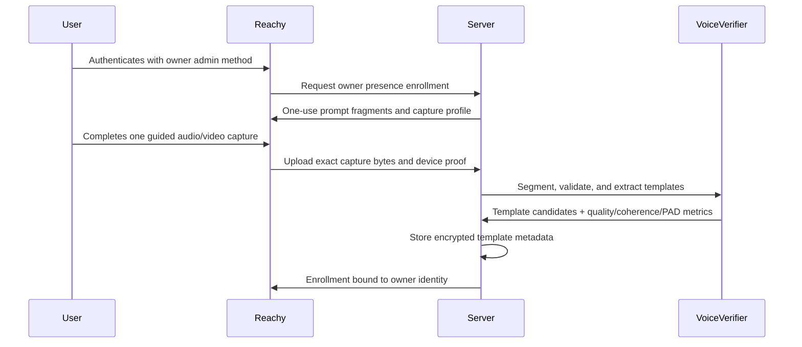
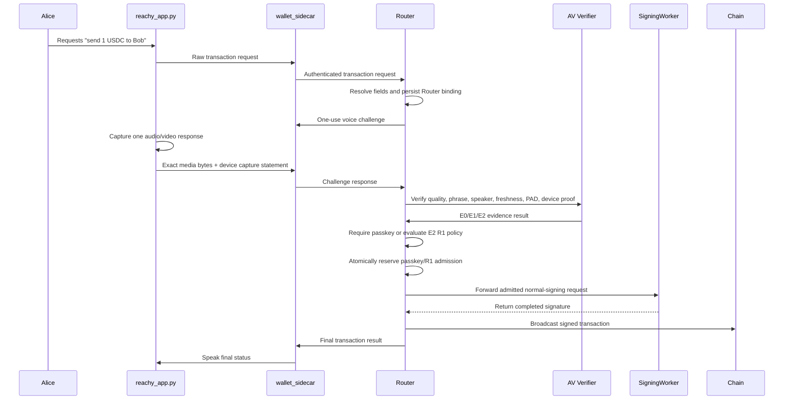

# Voice Biometrics And Spoken Intent

Status: exploratory companion design. The normative signing and recording
requirements are in
[VoiceID Signing Security Profile](voiceId-signing-security-profile.md).

This document explores voice-based authentication for wallet signing sessions
and physical robotics command authorization. It is a product and architecture
sketch, not an implementation commitment.

## Purpose

Voice evidence should be evaluated as a probabilistic owner-presence input for
MPC wallet policy and robot command authorization. The target Reachy design
combines independent checks:

1. Speech recognition verifies that the captured audio contains one exact
   supported command.
2. Speaker verification compares the recorded voice to an enrolled voice
   template for the owner.
3. Capture freshness, device proof, and PAD evaluate whether the response came
   from an approved, challenge-bound capture path.
4. Optional visual matching, active-speaker alignment, and audio direction add
   measured audio-visual PAD evidence for supported robot profiles.
5. Router binding ties the accepted command to one server-canonical transfer or
   robot action.

The core form binds the spoken confirmation to one concrete signing intent,
such as “send 100 USDC to Tom.” The server first fixes the canonical operation,
then issues the challenge. A future signing-grade E2 result can enter server
risk policy for a one-use grant. The current browser MVP is E0 and requires
passkey for every transaction.

For robotics, the same primitive can act as an authority filter in a shared
physical environment. A robot may hear commands from many nearby people. It
should execute privileged commands only when the speaker, command, role,
workspace state, and safety controller all authorize that exact action.

## Goals

1. Add a future human-presence method for owner commands and wallet signing.
2. Bind user intent to the exact transaction or session policy that will be
   signed.
3. Keep transaction parsing deterministic by resolving natural-language labels,
   assets, chains, amounts, and addresses before the voice command is admitted.
4. Keep biometric verification isolated at authentication boundaries.
5. Treat raw audio and speaker templates as sensitive personal information.
6. Preserve passkey as the highest-assurance authentication path.
7. Explore physical robotics cases where voice is safer and less awkward than
   requiring the operator to touch a robot or place their face near it.
8. Keep robot safety independent from voice identity. Authorized speakers cannot
   override emergency stops, tool guards, human-detection zones, or other safety
   interlocks.
9. Make the Reachy owner path feel like natural speech: the owner speaks, Reachy
   evaluates the evidence and safety policy, and Reachy responds.

## Non-Goals

1. Replacing passkeys as the preferred signing-session authenticator.
2. Allowing free-form natural language to directly construct transactions.
3. Treating a voice match as a deterministic cryptographic proof.
4. Storing raw enrollment or authentication audio indefinitely.
5. Sharing voice templates across projects, relying parties, wallets, or users.
6. Maintaining obsolete prototype contracts after their replacement lands.
7. Treating voice biometrics as a safety-rated robot control.
8. Gating emergency stop, pause, or other protective actions behind identity
   checks.
9. Requiring phone, watch, QR, or OTP approval in the Reachy owner happy path.

## External Guidance

Voice biometrics are probabilistic and have a materially different assurance
profile from passkeys. NIST SP 800-63B-4 limits the role of biometrics in remote
authentication, requires biometrics to be paired with a physical authenticator
in its authentication model, and explicitly excludes voice biometric comparison
from that model:

https://pages.nist.gov/800-63-4/sp800-63b.html#use-of-biometrics

FIDO/passkey systems keep biometric verification local to the user's device and
send only a cryptographic assertion to the server:

https://fidoalliance.org/specifications/

This project can still experiment with server-side voice verification. The
assurance label should remain below passkey unless the design is backed by a
device-bound cryptographic key.

Robotics deployments also need a separate safety case. ISO 10218-1:2025 covers
industrial robot safety requirements, and ISO/TS 15066:2016 supplements
collaborative robot application safety:

https://www.iso.org/standard/73933.html

https://www.iso.org/standard/62996.html

## Terms

| Term                                | Meaning                                                                                                                                                      |
| ----------------------------------- | ------------------------------------------------------------------------------------------------------------------------------------------------------------ |
| Spoken command                      | The exact supported command phrase the user speaks for one authorization attempt.                                                                            |
| Voice template                      | Encrypted speaker representation derived from internal windows in one or more strongly authenticated guided enrollment sessions.                             |
| Visual template                     | Enrolled face/body representation derived from approved camera enrollment captures.                                                                          |
| Speaker verification                | Probabilistic comparison of a new recording against a stored voice template.                                                                                 |
| Capture freshness                   | Server verification that one capture answered one unexpired, unpredictable challenge.                                                                        |
| Presentation attack detection (PAD) | Calibrated probabilistic detection of measured replay, synthesis, conversion, splicing, injection, and audio-visual presentation attacks.                    |
| Audio-visual PAD                    | Optional PAD evidence that checks whether voice, face/body track, lip motion, and audio direction are mutually consistent under an approved capture profile. |
| Device proof                        | Enrolled-device signature over the challenge, Router binding, exact uploaded-audio hash, timing, prompt, and capture profile.                                |
| Phrase verification                 | Speech-to-text or constrained ASR check that the user spoke a supported command.                                                                             |
| Router binding                      | Immutable server-built tuple for the canonical operation, signing payload, identities, session, tenant, network, and expiry.                                 |
| Spoken intent                       | Human-readable phrase deterministically derived from the Router binding and augmented with a random challenge fragment.                                      |
| E0/E1/E2                            | Experimental browser, step-up-only, and signing-candidate evidence tiers.                                                                                    |
| One-use grant                       | Server-side R1 admission record that Router can reserve atomically for one exact operation.                                                                  |
| Authority filter                    | Authentication and policy layer that decides whether a speaker may issue a command.                                                                          |
| Robot command intent                | Canonical command object derived from a constrained command grammar and current robot state.                                                                 |
| Safety controller                   | Independent robot safety layer that decides whether an authorized command can execute safely.                                                                |

## Threat Model

The design should assume attackers may:

1. Control the app session after phishing or malware.
2. Compromise an optional phone/watch/OTP channel when that future step-up is
   enabled.
3. Record the user's voice from calls, videos, meetings, or voicemails.
4. Generate synthetic speech from public or stolen samples.
5. Replay a prior recording into the microphone or upload path.
6. Try many noisy samples to find a permissive matching threshold.
7. Modify transaction fields after the user has approved a generic session.
8. Steal server-side voice templates or stored authentication artifacts.
9. Stand near a robot and issue commands meant to sound plausible.
10. Replay or synthesize an authorized operator's voice over a speaker.
11. Confuse speaker diarization in a room with multiple simultaneous talkers.
12. Issue a valid command while the robot is in an unsafe tool or workspace
    state.

Voice and visual verification help against attackers who can play or synthesize
the owner's voice and cannot convincingly present the enrolled owner as a nearby
live person. This does not remove the need for rate limits, replay resistance,
transaction binding, template protection, explicit consent, and fallback auth
methods.

## Authentication Posture

Current browser VoiceID is an evidence capability, not a wallet authenticator.
It produces E0 research evidence and an optional passkey prompt. The passkey
authorizes the operation through the existing cryptographic path.

The target split is:

```ts
type VoiceEvidenceCapability =
  | VoiceIdExperimentalBrowserEvidence
  | VoiceIdStepUpOnlyEvidence
  | VoiceIdSigningCandidateEvidence;

type VoiceIdSigningPolicyResult =
  | {
      kind: 'r1_grant_issued';
      grantReference: VoiceIdSigningGrantReference;
    }
  | {
      kind: 'passkey_required';
      reason: VoiceIdStepUpReason;
    }
  | {
      kind: 'denied';
      reason: VoiceIdPolicyDenialReason;
    };
```

Only E2 can enter `VoiceIdSigningPolicyResult`. E2 itself remains evidence. It
requires accepted speaker, phrase, quality, freshness, PAD, device proof,
capture profile, calibration, and Router-binding branches. Server R1 policy may
then issue one opaque reference to a server-side one-use grant.

VoiceID never creates a bounded signing session. R2 and R3 operations require
passkey or remain prohibited. Core signing functions accept only a passkey-
admitted transaction or an atomically reserved R1 grant.

## Transaction Intent Binding

The client submits raw transaction fields through the normal authenticated
request boundary. The server resolves labels, assets, chains, amount units,
addresses, account, wallet, subject, session, tenant, and policy scope. It then
uses the existing typed Router A/B builders to persist one immutable
`RouterVoiceIntentBinding` before VoiceID challenge creation.

The user-facing summary is deterministically derived from that same binding and
resolved transaction data. A short random fragment adds challenge entropy:

```text
Send 100 USDC on Base to Tom, address ending 7F3A. River seven.
```

Any VoiceID-specific challenge digest is a domain-separated derivative of the
Router operation id, operation fingerprint, intent digest, signing-payload
digest, admitted-signing digest, prompt hash, challenge id, device key, and
expiry. It is never an independently canonicalized authority.

The server rejects or expires the attempt if the recipient, amount, token,
network, wallet, subject, session, tenant, nonce, prompt, device, media hash,
expiry, or prepared signing payload changes. Speech confirms a transaction that
already exists; it does not construct or mutate one.

## MPC Signing Boundary

The Cloudflare signing architecture remains the existing
[Router A/B plan](../../docs/router-a-b-SPEC.md):

```text
Client -> Router -> SigningWorker -> Router -> Client
```

Deriver A and Deriver B remain setup, export, recovery, and SigningWorker-
refresh roles. VoiceID never receives shares or invokes those roles.

Browser flow:

```text
E0 voice evidence
  -> passkey verifies the exact Router operation
  -> ordinary Router admission
  -> SigningWorker
```

Future embedded R1 flow:

```text
approved-device E2
  -> server R1 policy
  -> one-use grant in issued state
  -> Router atomic issued-to-reserved transition
  -> reservation holder calls SigningWorker
  -> consumed or failed_closed terminal state
```

Router and SigningWorker independently verify the canonical digest tuple and
normal signing transcript. A failed or lost response never returns a reserved
grant to `issued`; the owner starts a new challenge.

Raw audio/video exists only for the verification window unless the owner
explicitly enables short-lived diagnostic retention. Moving verification onto
Reachy does not by itself raise assurance. A device-signed result reaches E2
only when the approved capture profile proves the required device, media,
freshness, and PAD guarantees.

## Physical Robotics Use Case

Voice biometrics are a better fit for physical robots than many wallet flows.
TouchID and FaceID assume the user can safely approach a trusted device and
perform a close-range ceremony. A cooking robot, shop robot, cleaning robot, or
tool-using arm may be hot, sharp, moving, contaminated, or surrounded by people.
The operator may need to stay outside the work envelope while still giving
commands.

The robotics design should treat voice as command authority, then let the robot
safety system decide execution:

```text
room audio
  -> wake word or push-to-talk gate
  -> speaker diarization
  -> speech-to-text
  -> constrained command parser
  -> speaker verification
  -> role and policy check
  -> workspace and robot-state safety check
  -> exact command execution
```

Emergency and protective commands should be available to anyone:

1. "Stop", "pause", "freeze", and physical emergency-stop buttons bypass voice
   identity.
2. Privileged resume, tool activation, mode changes, material handling, and
   task reassignment require a recognized speaker with the right role.
3. Dangerous commands require explicit spoken intent, a fresh command digest,
   safe workspace state, and safety-controller admission.

Example command policy:

```text
Any nearby speaker:
  "Robot, stop."

Enrolled kitchen operator:
  "Robot, resume chopping carrots."

Enrolled maintenance operator:
  "Robot, enter blade-cleaning mode."
```

The robot should resolve a spoken command into a canonical intent before acting:

```ts
type RobotCommandIntent =
  | {
      kind: 'protective_stop';
      robotId: RobotId;
      command: 'stop' | 'pause' | 'freeze';
      observedAt: IsoDateTime;
    }
  | {
      kind: 'privileged_command';
      robotId: RobotId;
      command: RobotPrivilegedCommand;
      taskId: RobotTaskId;
      toolId: RobotToolId;
      workspaceZone: RobotWorkspaceZone;
      authorizedSpeakerId: PersonId;
      speakerRole: RobotOperatorRole;
      observedSafetyStateDigest: SafetyStateDigest;
      nonce: IntentNonce;
      expiresAt: IsoDateTime;
    };
```

The robot command digest should cover both the command and the observed safety
state:

```text
robotCommandDigest = HASH(
  "seams.robot_voice_intent.v1" ||
  canonicalEncode(RobotCommandIntent) ||
  voiceCommandNonce ||
  voiceCommandExpiresAt
)
```

For example:

```text
Alice says: "Robot, resume chopping carrots."

Parsed intent:
  robotId = kitchen-arm-1
  command = resume_task
  taskId = chop-carrots
  toolId = knife
  workspaceZone = kitchen-counter
  authorizedSpeakerId = alice
  observedSafetyStateDigest = 0x...
```

Execution requires all of these conditions:

1. The phrase parser maps the command to one exact allowed command.
2. The speaker matches an enrolled authorized operator.
3. The role policy permits that operator to issue the command.
4. The current robot and workspace state still match the safety digest.
5. The independent safety controller admits the action.
6. The command digest has not been consumed.

The robot should reject ambiguous commands. "Clean that" or "move it over
there" needs clarification before any privileged command is constructed. If the
command affects tools, heat, pressure, motion, or people nearby, the robot
should use a confirmation phrase tied to the canonical command:

```text
"Confirm resume chopping carrots with knife in kitchen zone A. River seven."
```

### Robotics Auth State

Robot command authorization should keep identity, parsed command, and safety
state separate:

```ts
type RobotCommandAdmission =
  | {
      kind: 'protective_command';
      robotId: RobotId;
      command: 'stop' | 'pause' | 'freeze';
      issuedAt: IsoDateTime;
    }
  | {
      kind: 'privileged_command';
      robotId: RobotId;
      authorizedSpeakerId: PersonId;
      speakerRole: RobotOperatorRole;
      commandDigest: RobotCommandDigest;
      enrollmentId: VoiceEnrollmentId;
      evidence: RobotApprovedPresenceEvidence;
      safetyStateDigest: SafetyStateDigest;
      expiresAt: IsoDateTime;
    };
```

The robot controller should accept `RobotCommandAdmission` only for a command
whose current canonical intent recomputes the same `commandDigest`. The safety
controller remains the final gate before motion, heat, pressure, cutting,
gripping, dispensing, or mode changes.

### MPC Robot Command Foundation

The current MPC wallet architecture is a useful foundation for robot command
authorization if robot commands are modeled like transaction intents. The robot
owns one local share, the server or fleet service owns the coordinating share,
and neither side can authorize privileged robot action alone.

Recommended topology:

```text
robot:
  local MPC share
  device identity key or secure storage
  microphone and local safety-state observation
  local command parser for constrained commands

server or fleet service:
  coordinating MPC share
  voice and visual enrollment policy
  audio/video verifier for MVP
  command policy
  revocation, audit, and rate limits
```

A privileged command should require multiple independent facts:

1. The robot heard and parsed one exact command intent.
2. The speaker matched an enrolled authorized operator.
3. The approved capture profile produced accepted device, freshness, speaker,
   phrase, quality, and audio-visual PAD evidence.
4. The robot contributed its local MPC share.
5. The server or fleet service admitted the command and contributed its share.
6. The current safety state still matches the command's safety digest.
7. The safety controller admitted the action immediately before execution.

The future calibrated Reachy R1 path may omit a separate phone/watch ceremony.
Degraded sensors, new recipients, higher value, and unsupported profiles require
passkey. Any future phone/watch/operator-console step-up must return a
device-bound cryptographic assertion for the same digest.

Example flow:

```text
Alice says: "Robot, resume chopping carrots."
Server fixes RobotCommandIntent and robotCommandDigest.
Robot captures one challenge response and signs the media hashes.
Server verifies calibrated evidence and command policy.
Threshold participants sign only robotCommandDigest after admission.
Safety controller admits or rejects execution.
```

This combines independent capture, policy, threshold, and safety boundaries. Its
assurance still depends on measured PAD coverage. A stolen robot cannot mint
broad command authority after the server revokes its device identity or refuses
admission.

The target robot UX is natural speech with no separate approval ceremony in the
happy path:

```text
Alice speaks
  -> server fixes one exact command and challenge
  -> robot returns calibrated presence evidence
  -> command policy admits the digest
  -> safety controller admits the action
  -> robot responds and acts
```

The product should feel like the robot simply responds to its owner while the
authorization system runs invisibly behind that interaction.

WASM helps make this portable across browser, server, and edge Linux robot
stacks. The portable pieces are canonical intent encoding, digest calculation,
threshold crypto helpers, policy evaluation, and deterministic test fixtures.
Very small MCUs may need native bindings or a reduced runtime if a full WASM
engine is too heavy.

### Reachy Mini Payment MVP

Reachy Mini is a good proof-of-concept target for a robot wallet because it is
small, expressive, networked, and already exposes the right media primitives.
The Wireless version runs onboard on a Raspberry Pi CM4 with WiFi, microphone
array, speaker, camera, and enough memory for a local app plus a wallet sidecar.
The SDK exposes camera frames, 16 kHz audio samples, speech detection, and
direction-of-arrival helpers.

MVP command:

```text
"Reachy, send 1 USDC to Bob."
```

MVP behavior:

```text
Reachy hears owner command
  -> sends an authenticated raw transaction request
  -> server resolves Bob and persists the Router binding
  -> server issues a random voice challenge
  -> Reachy records one response and signs exact media hashes
  -> server returns E0/E1/E2 and applies passkey or R1 policy
  -> Router atomically reserves admission
  -> broadcasts testnet transfer
  -> speaks final status
```

Future approved E2 owner UX:

```text
Alice: "Reachy, send 1 USDC to Bob."
Reachy: "Sending 1 USDC to Bob."
Reachy: "Done."
```

Initial scope should stay deliberately narrow:

1. Use testnet USDC, a mock ERC-20, or a tiny capped mainnet amount.
2. Support one command grammar: `send <amount> usdc to <contact>`.
3. Support a fixed contact allowlist, for example `Bob -> 0x...`.
4. Reject raw addresses spoken aloud.
5. Reject swaps, approvals, contract calls, recurring payments, and arbitrary
   wallet commands.
6. Keep the initial browser or unapproved-device demo passkey-backed.
7. Send one audio/video challenge response and device capture statement to the
   server-side verifier.
8. Enable a direct R1 path only after calibrated E2 evidence and atomic Router
   reservation bind the prepared transaction.
9. Add rate limits and a daily demo budget.
10. Deny uncertain PAD, new recipients, unsupported commands, and amounts
    above the local cap during the first MVP.
11. Keep the future E2 happy path free of extra confirmation screens. The
    research/browser path visibly requests passkey.

Recommended process split:

```text
Reachy Python app:
  thin Reachy SDK adapter
  audio/video capture
  robot speech and gestures

Rust wallet sidecar:
  command parser
  contact allowlist
  canonical intent encoder
  media preprocessing
  local MPC client
  local robot share

server:
  coordinating MPC share
  audio/video verifier
  policy, rate limits, audit, and broadcast
  future step-up hooks outside the MVP happy path
```

The first demo can fake speaker verification with a known local profile and
fixed threshold. Fake evidence can exercise policy simulation and cannot admit
MPC signing. Testnet broadcast uses passkey until the real device, PAD,
calibration, and grant gates pass. The robot should speak a short action
acknowledgement after admission and reserve longer summaries for step-up paths:

```text
"Sending 1 USDC to Bob."
```

### Paid Guest Commands With x402

Reachy can use the same voice classification layer to separate owner commands
from guest commands. Owner voice enters the privileged wallet or robot command
flow. Unknown voices can receive a payment challenge for low-risk commands:

```text
Owner voice:
  "Reachy, send 1 USDC to Bob."
  -> owner voice match
  -> privileged wallet authorization

Guest voice:
  "Reachy, dance."
  -> no owner voice match
  -> low-risk payable command
  -> x402 Payment Required
  -> guest pays
  -> Reachy executes only that command digest
```

x402 is a good fit because the command service can behave like an HTTP
pay-per-use API. A request without payment receives HTTP `402 Payment Required`
with payment requirements. The paying client submits a payment proof, retries,
and receives the command execution result.

Reachy should translate the HTTP payment challenge into physical UX:

```text
"That command costs 0.10 USDC. Scan the code or open the link to pay."
```

Paid guest commands must be restricted to low-risk actions:

1. Allow gestures, dance, wave, speak a phrase, answer a public question, take a
   selfie, or play a sound.
2. Reject wallet transfers, admin settings, private data, contact access,
   enrollment, device binding, and safety-affecting commands.
3. Bind payment to one exact `RobotCommandDigest`.
4. Enforce maximum duration, queue length, cooldown, and daily earning caps.
5. Run the same safety and motion limits after payment.
6. Treat payment as command admission, never as robot ownership or broad
   control authority.

Domain shape:

```ts
type RobotCommandAdmission =
  | {
      kind: 'owner_authorized';
      speakerId: PersonId;
      commandDigest: RobotCommandDigest;
    }
  | {
      kind: 'payment_required';
      speakerClass: 'guest';
      commandDigest: RobotCommandDigest;
      price: {
        amount: DecimalString;
        asset: 'USDC';
        network: 'base' | 'base_sepolia';
      };
      expiresAt: IsoDateTime;
    }
  | {
      kind: 'paid_guest_authorized';
      payerAddress: EvmAddress;
      commandDigest: RobotCommandDigest;
      paymentReceiptId: PaymentReceiptId;
      expiresAt: IsoDateTime;
    };
```

Recommended command API:

```http
POST /robot/commands
```

```json
{
  "robotId": "reachy-mini-1",
  "command": "dance",
  "speakerClass": "guest",
  "commandDigest": "0x..."
}
```

If payment is required, the local sidecar or server returns `402 Payment
Required` with x402 payment requirements. The retry must carry a payment proof
for the same `commandDigest`; a payment for one command must not authorize a
different command, longer duration, different robot, or later replay.

## Flow

### Enrollment

Enrollment must happen after an existing strong authentication method, ideally
passkey or an owner admin ceremony. The server issues three to five randomized,
phonetically varied prompt fragments. The user completes one continuous guided
recording with a provisional 12-second usable-speech target. An approved robot
profile may collect synchronized video during the same ceremony.



Enrollment rules:

1. Require explicit consent and a clear deletion path.
2. Use one continuous capture ceremony and create non-overlapping VAD windows
   internally.
3. Reject low-quality, duplicate, multi-speaker, prompt-incomplete, and
   embedding-incoherent windows.
4. Build a normalized, versioned, quality-weighted speaker centroid from the
   accepted windows. Visual extraction follows its own calibrated aggregation
   policy.
5. Record enrollment assurance. Browser enrollment is a research template and
   cannot be relabeled as signing-grade.
6. Encrypt templates with scoped server keys.
7. Delete raw enrollment audio/video after template extraction unless the owner
   explicitly opts into retention for diagnostics or model improvement.
8. Version template extractors, aggregation, capture profiles, PAD, and matching
   thresholds.
9. Gain useful channel diversity later through passkey-confirmed sessions on
   different days. Do not ask for several near-identical button-driven clips.

### Reachy Owner Transfer Authorization



Server verification order:

1. Authenticate the request and derive identity, wallet, session, tenant, and
   policy scope from server context.
2. Resolve transaction fields and persist the typed Router binding before
   issuing the challenge.
3. Verify the one-use challenge, exact-media hash, device proof, and server
   receipt window.
4. Verify phrase, speaker, quality, freshness, PAD, and approved capture profile
   as separate branches.
5. Construct E0, E1, rejection, uncertainty, or E2 through narrow builders.
6. Require passkey for browser/E0/E1; apply attempt limits, value caps,
   recipient policy, anomaly policy, and budget to future E2.
7. Issue one server-side R1 grant for the exact Router tuple only after policy
   accepts E2.
8. Reserve passkey or R1 admission atomically before forwarding to
   SigningWorker.
9. Mark the reservation `consumed` on success or `failed_closed` on any terminal
   failure.

## Domain State

Voice state should follow the same discriminated-union discipline used by the
signing engine.

```ts
type VoiceEnrollmentState =
  | {
      kind: 'not_enrolled';
      walletId: WalletId;
      subjectId: WalletSubjectId;
      enrollmentId?: never;
      templateVersion?: never;
    }
  | {
      kind: 'enrollment_pending';
      walletId: WalletId;
      subjectId: WalletSubjectId;
      enrollmentId: VoiceEnrollmentId;
      phraseSetId: VoicePhraseSetId;
      expiresAt: IsoDateTime;
      templateVersion?: never;
    }
  | {
      kind: 'enrolled';
      walletId: WalletId;
      subjectId: WalletSubjectId;
      enrollmentId: VoiceEnrollmentId;
      templateVersion: VoiceTemplateVersion;
      assurance: 'research' | 'signing_grade';
      enrolledAt: IsoDateTime;
      disabledAt?: never;
    }
  | {
      kind: 'disabled';
      walletId: WalletId;
      subjectId: WalletSubjectId;
      enrollmentId: VoiceEnrollmentId;
      templateVersion: VoiceTemplateVersion;
      assurance: 'research' | 'signing_grade';
      disabledAt: IsoDateTime;
    };
```

Signing admission uses the `VoiceIdEvidence`, `RouterVoiceIntentBinding`, and
`VoiceIdSigningGrantState` unions from the signing security profile. The grant
lifecycle is `issued`, `reserved`, `consumed`, `failed_closed`, `expired`, or
`revoked`. This document does not define a parallel admission state.

Raw server records, request bodies, worker responses, ASR transcripts, and
vendor score payloads should be parsed once at their boundary into these
internal types. Core signing logic accepts a passkey-admitted transaction or a
reserved R1 grant. It never accepts raw audio metadata, raw score objects, broad
optional bags, client diagnostics, or vendor payloads.

## Storage Ownership

| Store                            | Owns                                                                                               |
| -------------------------------- | -------------------------------------------------------------------------------------------------- |
| Client memory                    | Active microphone recording before upload, UI prompt state, local recording errors                 |
| Server presence enrollment store | Encrypted voice/visual templates, enrollment metadata, extractor version, threshold version        |
| Server challenge store           | Immutable Router binding, prompt, nonce, expiry, attempt state, exact-media hash, and device proof |
| Voice verifier runtime           | Temporary audio processing, transcript, speaker score, spoof score                                 |
| Router grant store               | E2 policy decision and atomic `issued`/`reserved`/terminal one-use state                           |
| Audit log                        | Non-sensitive event metadata, digest, method, scores bucketed by policy band                       |

Raw authentication audio should be deleted immediately after verification unless
there is a separate explicitly consented retention mode. Audit logs should avoid
storing transcripts beyond the expected command text, raw scores when coarse
bands are sufficient, and any audio-derived biometric material.

## Policy

Voice policy should be explicit per operation type:

```ts
type VoiceIdOperationPolicy =
  | {
      kind: 'disabled';
      reason: VoicePolicyDisabledReason;
    }
  | {
      kind: 'r1_voice_candidate';
      maxValueUsd: DecimalString;
      requireEstablishedRecipient: true;
      requireAddressSuffixInPhrase: true;
      requiredEvidence: 'E2';
      maxAttempts: number;
      expiresInSeconds: number;
    }
  | {
      kind: 'r2_passkey_required';
      reason: VoiceIdStepUpReason;
    }
  | {
      kind: 'r3_voice_prohibited';
      reason: VoiceIdProhibitedReason;
    };
```

Ordinary browser capture always follows `r2_passkey_required`, even for a low-
value established-recipient operation. The R1 branch is reserved for a future
approved embedded profile and issues only one exact-operation grant.

Robot voice policy should make the Reachy MVP decision explicit:

```ts
type RobotPresenceEvidence =
  | {
      kind: 'owner_candidate';
      personId: PersonId;
      voiceMatch: 'accepted';
      faceMatch: 'accepted' | 'same_track';
      lipSync: 'matched';
      audioDirection: 'matched';
      audioVisualPad: 'accepted';
      deviceProof: VoiceIdVerifiedDeviceProof;
      captureProfile: VoiceIdApprovedCaptureProfile;
      confidence: number;
    }
  | {
      kind: 'guest_or_unknown';
      voiceMatch: 'unknown';
      faceTrack: 'present';
      confidence: number;
    }
  | {
      kind: 'uncertain';
      reason: 'no_face' | 'mouth_occluded' | 'noisy_audio' | 'multi_speaker' | 'low_light';
    }
  | {
      kind: 'rejected';
      reason: 'wrong_speaker' | 'face_voice_mismatch' | 'spoof_likely' | 'lip_sync_mismatch';
    };

type RobotOwnerCommandDecision =
  | {
      kind: 'allow_after_safety_policy';
      commandDigest: RobotCommandDigest | IntentDigest;
      presence: Extract<RobotPresenceEvidence, { kind: 'owner_candidate' }>;
      expiresAt: IsoDateTime;
    }
  | {
      kind: 'deny_for_mvp';
      commandDigest: RobotCommandDigest | IntentDigest;
      reason:
        | 'pad_uncertain'
        | 'amount_above_local_cap'
        | 'new_recipient'
        | 'dangerous_robot_action'
        | 'policy_denied';
    }
  | {
      kind: 'future_step_up_candidate';
      commandDigest: RobotCommandDigest | IntentDigest;
      reason: 'voice_only_mode' | 'degraded_sensor_quality' | 'higher_value_command';
    };
```

Initial policy recommendation:

1. Keep browser voice at E0 and require passkey for every browser transaction.
2. Require passkey for enrollment, template reset, template deletion, and
   high-value policy changes.
3. Permit a future E2 voice path only for explicit low-value R1 transfers to
   established recipients. Voice can assist recovery UX and cannot authorize
   recovery.
4. Require passkey or a stronger method for key export, authenticator binding,
   email/phone changes, and unrestricted signing sessions.
5. Disable voice automatically after repeated spoof, mismatch, or risk failures
   until the user reauthenticates with passkey.
6. For robotics, allow unauthenticated protective stops and require voice
   authority plus safety-controller admission for privileged robot commands.
7. Reject privileged robot commands when multiple speakers overlap or speaker
   diarization is uncertain.
8. Consider low-value owner wallet commands only after an approved embedded
   capture produces E2 and Router policy reserves a one-use grant.
9. Require passkey or deny uncertain PAD, elevated value, new recipients,
   degraded sensors, and dangerous robot actions in the first Reachy MVP.
10. For offline robot operation, issue only bounded local authority with short
    expiries, explicit command classes, and no ability to mint unrestricted
    sessions.
11. Optimize the Reachy owner path for “user speaks, robot responds” within the
    calibrated R1 and independent robot-safety boundaries.
12. Use passkey as the wallet step-up. A future phone/watch flow must return a
    device-bound cryptographic assertion before it can serve the same role.

## Matching And Verification

The Reachy UI may describe the feature as **Owner Presence ID**. Core policy
keeps each guarantee independent and fuses only typed, calibrated results:

```text
audio command match
+ speaker verification
+ calibrated replay / synthetic / injection PAD
+ visual owner match
+ lip-sync / active-speaker detection
+ mic-array direction consistency
= RobotPresenceEvidence
```

The implementation should use evaluated speaker-verification and PAD
components. Hand-written Fourier-transform matching is too brittle for this
role. Modern speaker systems usually:

1. Convert audio to frame features such as log-mel spectrograms or MFCC-like
   features.
2. Run a speaker model that produces a fixed-size embedding, such as x-vector
   or ECAPA-style embeddings.
3. Compare the new embedding against the enrolled template with cosine,
   PLDA-style, or calibrated neural scoring.

Anti-spoofing should run as a separate path:

1. Detect replayed audio, TTS, voice conversion, and deepfake speech.
2. Treat replay/synthetic detection as a rejection signal for owner wallet
   commands.
3. Track model version and dataset assumptions because spoof detectors can fail
   under domain shift.

Audio-visual PAD is a robot-specific signal:

1. Match the visible face/body track to the enrolled owner.
2. Check that mouth motion aligns with the recognized speech.
3. Check that mic-array direction-of-arrival matches the visible speaker track.
4. Reject or mark uncertain when the face is missing, mouth is occluded, lighting
   is poor, several people overlap, or the audio direction is ambiguous.

The threshold is configured per model, calibration, capture profile, cohort,
and deployment risk. It is never adjusted per user to force acceptance.
Per-user quality metadata can decide whether enrollment is allowed, whether
more usable speech or a later authenticated session is required, or whether
VoiceID is unavailable for that user.

### Speaker Verification Pipeline

Speaker verification answers: "does this recording sound like the enrolled
owner?" It is separate from ASR command parsing and separate from replay/deepfake
detection.

Input:

```text
audio clip
sample rate
capture device metadata
speech time range
expected owner enrollment id
```

Step 1: normalize and segment the audio.

1. Resample to the verifier's expected rate, commonly 16 kHz.
2. Convert to mono or a selected mic-array channel.
3. Apply voice activity detection to isolate speech frames.
4. Reject clips that are too short, clipped, saturated, mostly silence, or too
   noisy.
5. Keep timing metadata so lip-sync and direction-of-arrival checks can align
   the same speech window.

Step 2: convert waveform into frame features.

Modern systems split the waveform into short overlapping windows, for example
25 ms frames with a 10 ms hop:

```text
waveform
  -> pre-emphasis / normalization
  -> framed windows
  -> FFT or filterbank analysis
  -> log-mel spectrogram or MFCC-like features
```

The FFT step exposes frequency energy over time. The speaker verifier usually
does not compare raw Fourier coefficients. It uses log-mel or MFCC-like feature
sequences because they are more stable across microphones, pitch variation,
room acoustics, and speaking rate.

Step 3: extract a speaker embedding.

The feature sequence is fed into a trained speaker model:

```text
log-mel or MFCC features
  -> x-vector / ECAPA-TDNN / similar speaker encoder
  -> fixed-size speaker embedding
```

The embedding is a compact vector that represents speaker traits such as vocal
tract shape, timbre, formant structure, pitch tendencies, and temporal speaking
patterns. The exact dimensions depend on the model.

Step 4: build enrollment templates.

Enrollment uses one continuous guided capture. VAD creates internal,
non-overlapping windows:

```text
one guided capture
  -> VAD windows
  -> quality + prompt coverage + duplicate + single-speaker checks
  -> normalized accepted embeddings
  -> normalized quality-weighted centroid
```

The aggregation rule is versioned. It rejects outliers and records evidence
counts without treating windows as separate user recording ceremonies:

```ts
type SpeakerEnrollmentTemplate = {
  enrollmentId: VoiceEnrollmentId;
  personId: PersonId;
  modelVersion: SpeakerModelVersion;
  templateVersion: VoiceTemplateVersion;
  aggregationVersion: VoiceTemplateAggregationVersion;
  captureProfileId: VoiceIdCaptureProfileId;
  assurance: 'research' | 'signing_grade';
  normalizedCentroid: SpeakerEmbedding;
  acceptedWindowCount: number;
  rejectedWindowCount: number;
  usableSpeechMs: number;
  quality: SpeakerEnrollmentQuality;
  createdAt: IsoDateTime;
};
```

Raw enrollment audio should be deleted after template extraction unless the
owner explicitly enables diagnostic retention.

Step 5: score the runtime embedding against the template.

At runtime:

```text
runtime audio -> runtime embedding
runtime embedding + enrolled template -> similarity score
```

Scoring options:

1. **Cosine similarity**: simple and common for normalized neural embeddings.
2. **PLDA-style scoring**: classical speaker-recognition scoring that models
   within-speaker and between-speaker variation.
3. **Calibrated neural scoring**: model-specific scorer trained for target
   deployment conditions.

The scorer returns a score and quality metadata:

```ts
type SpeakerMatchResult =
  | {
      kind: 'accepted';
      enrollmentId: VoiceEnrollmentId;
      modelVersion: SpeakerModelVersion;
      score: VoiceMatchScore;
      threshold: VoiceMatchThreshold;
      quality: RuntimeAudioQuality;
    }
  | {
      kind: 'rejected';
      enrollmentId: VoiceEnrollmentId;
      modelVersion: SpeakerModelVersion;
      score: VoiceMatchScore;
      threshold: VoiceMatchThreshold;
      quality: RuntimeAudioQuality;
      reason: 'below_threshold' | 'wrong_speaker';
    }
  | {
      kind: 'uncertain';
      enrollmentId: VoiceEnrollmentId;
      modelVersion: SpeakerModelVersion;
      quality: RuntimeAudioQuality;
      reason:
        | 'insufficient_speech'
        | 'low_audio_quality'
        | 'unsupported_capture_profile'
        | 'model_unavailable';
      score?: never;
      threshold?: never;
    };
```

Step 6: calibrate thresholds by model version and risk.

The verifier should choose thresholds from validation data, not per-user
tuning. For Reachy:

1. Use a stricter threshold for wallet transfers than for harmless robot
   gestures.
2. Reject or mark uncertain when audio quality is outside the model's validated
   range.
3. Version every model, threshold, and enrollment template.
4. Record score bands for audit without storing raw biometric material.

Step 7: fuse speaker verification with the rest of Owner Presence ID.

Speaker verification alone cannot admit the wallet action. It feeds the fused
presence decision:

```text
speaker accepted
+ phrase accepted
+ quality accepted
+ freshness accepted
+ PAD accepted for the approved capture profile
+ device proof accepted
+ Router binding accepted
= E2 signing candidate
```

The E2 candidate still has no signing authority. Server R1 policy must issue a
one-use grant, and Router must reserve it atomically. Browser captures cannot
construct this branch.

### Research Baseline

The implementation should be grounded in current speaker verification,
anti-spoofing, and audio-visual liveness literature:

1. **i-vector + PLDA baseline**: Dehak et al., "Front-End Factor Analysis for
   Speaker Verification", IEEE TASLP 2011. This is the classical embedding and
   scoring reference point for speaker verification.
2. **x-vectors**: Snyder et al., "X-Vectors: Robust DNN Embeddings for Speaker
   Recognition", ICASSP 2018. This is the common deep speaker embedding
   baseline.
3. **ECAPA-TDNN**: Desplanques et al., "ECAPA-TDNN: Emphasized Channel
   Attention, Propagation and Aggregation in TDNN Based Speaker Verification",
   Interspeech 2020. This is a strong modern architecture family for speaker
   embeddings.
4. **Deep speaker-recognition survey**: Bai and Zhang, "Speaker recognition
   based on deep learning: An overview", Neural Networks 2021. Use this as a
   survey of model families and tradeoffs.
5. **ASVspoof benchmark**: ASVspoof 2019/2021 and the TASLP ASVspoof 2021
   summary. Use these benchmarks for replay, synthetic speech, voice conversion,
   and deepfake spoofing countermeasures.
6. **AASIST anti-spoofing**: Jung et al., "AASIST: Audio Anti-Spoofing Using
   Integrated Spectro-Temporal Graph Attention Networks", ICASSP 2022. Use this
   as a representative modern anti-spoofing model.
7. **Audio-video liveness**: Chetty and Wagner, "Liveness Verification in
   Audio-Video Speaker Authentication", 2005. Use this as an early reference
   for fusing lip/voice evidence in speaker authentication.
8. **NIST SRE audio-visual work**: NIST SRE21 overview notes that audio-visual
   fusion can improve over audio-only and visual-only systems. Use this as
   validation for a fused owner-presence approach.

### Patent Watchlist

Patent literature should be used as design input and freedom-to-operate review
input before commercialization:

1. Random/passphrase voice liveness, for example US8442824B2.
2. Replay detection in speaker verification, for example US20170200451A1.
3. Speaker liveness detection using acoustic responses, for example US8589167B2.
4. Voice-based liveness verification, for example US20180060552A1.
5. Audio-visual liveness using mouth/audio synchronization, for example
   US20220318349A1.

These references should not drive API design. They identify implementation
areas that need patent counsel before a production launch.

### MVP Verifier Bias

For the first Reachy MVP, run the full verifier server-side:

```text
Reachy sends:
  authenticated raw transaction request
  exact audio/video challenge-response bytes
  signed device capture statement
  advisory transcript and capture telemetry

Server returns:
  VoiceIdVerificationResult
  passkey requirement, denial, or E2 policy result
```

This simplifies model deployment and keeps heavy AV models off the Raspberry Pi.
Reachy may create model-specific derivatives in Rust, while preserving the
original capture bytes and their hash until the server has completed PAD and
verification. Trimming, denoising, resampling, and compression cannot destroy
the native evidence needed by the approved capture profile. A later local
verifier still needs a device-signed capture statement and calibrated PAD; a
device signature over an arbitrary local verdict is insufficient.

Verification uses the authoritative result union:

```ts
type VoiceIdVerificationResult =
  | { kind: 'signing_candidate'; evidence: VoiceIdSigningCandidateEvidence }
  | {
      kind: 'step_up_required';
      evidence: VoiceIdStepUpOnlyEvidence;
      allowedMethod: 'passkey';
    }
  | { kind: 'rejected'; reason: VoiceIdRejectionReason }
  | { kind: 'uncertain'; reason: VoiceIdUncertainReason }
  | { kind: 'expired'; verificationId: VoiceIdVerificationId };
```

## UX Constraints

Voice UX must reduce ambiguity:

1. Display the exact canonical transaction summary before recording.
2. Include chain, amount, token, recipient label, and address suffix in the
   spoken phrase.
3. Add one short unpredictable fragment from the server challenge, such as
   “River seven.”
4. Avoid homophones and ambiguous numbers in generated command phrases.
5. Permit at most one quality retry, under a new challenge. Phrase or speaker
   rejection starts a new attempt subject to rate limits.
6. Provide non-voice fallback for illness, noisy environments, privacy, and
   accessibility.
7. Never ask the user to speak secret recovery material or private keys.
8. For robots, keep operators outside unsafe work envelopes and use
   far-field-friendly prompts.
9. For robots, make rejected privileged commands audibly and visibly clear
   without blocking emergency stop.
10. For Reachy owner commands, prefer a short action acknowledgement after
    evidence, command policy, and the safety controller all accept.

The UI should treat voice as an intentional owner command. Passive capture,
background capture, or automatic face/voice checks should not establish wallet
signing intent.

## Open Questions

1. Should all voice matching be server-side, or should mobile clients support
   local voice verification plus a device-bound signature?
2. Which vendor or open model can satisfy latency, anti-spoof, privacy, and
   audit requirements?
3. What conservative per-operation and rolling limits satisfy the measured R1
   risk budget for each approved capture profile?
4. Should the spoken phrase include the full contact label, the address suffix,
   or both?
5. How should voice enrollment interact with project-level bring-your-own-auth
   policy?
6. What deletion and export rights apply to voice templates in each deployment
   region?
7. Which support flow restores access when voice is disabled after false
   rejects?
8. Which robot commands are protective, low-risk, privileged, or dangerous?
9. Which safety-state fields must be included in `SafetyStateDigest` for each
   robot application?
10. How should the robot handle command authority when several enrolled people
    speak near the robot?
11. Should robot-side verification run locally for latency and availability, or
    use a server verifier for centralized policy and template management?
12. Which robot hardware profiles can run the WASM threshold runtime directly,
    and which need native or MCU-specific ports?
13. Which local caps are acceptable for each calibrated audio-visual PAD profile
    in the Reachy path?
14. Which degraded-sensor cases should become future step-up candidates?
15. How should fleet revocation work when a robot is reported stolen or fails
    remote attestation?
16. Should the Reachy Mini MVP run the wallet sidecar onboard, on a paired
    laptop, or on a local network service during the first demo?
17. Which test network and mock USDC contract should be used for the payment
    demo?
18. Should Reachy use camera presence only for UX feedback, or should face
    recognition become a later step-up signal?
19. Which Reachy guest commands are safe enough to monetize through x402?
20. Should paid guest command revenue go to the robot wallet, the owner wallet,
    or a split policy?
21. How should Reachy present x402 payment requirements: QR code, local
    dashboard link, spoken URL, nearby phone handoff, or all of these?
22. Which x402 facilitator, network, and asset should the demo use?

## Architecture

The Reachy MVP should stay close to the metal on the robot. Python should be
limited to Reachy SDK glue when the hardware SDK requires it. Rust should own
the local wallet sidecar, intent parsing, digesting, media preprocessing, local
state, and MPC client behavior.

Runtime boundary:

```text
Reachy Mini Raspberry Pi:
  reachy_app.py
    - talks to Reachy SDK
    - captures audio/video
    - triggers speech and gesture responses
    - calls local Rust sidecar over localhost or Unix socket

  reachy-sidecar-rs
    - parses a constrained command candidate for UX
    - submits raw transaction fields through an authenticated channel
    - receives the server-owned Router binding and challenge
    - preserves original media and builds model-specific derivatives
    - signs the exact-media capture statement with the enrolled device key
    - owns local MPC share
    - participates in threshold signing only after Router admission

Server:
  TypeScript service
    - authenticates scope and builds the canonical Router intent/payload
    - persists the Router binding and issues the one-use challenge
    - verifies media, prompt, device proof, speaker, quality, freshness, and PAD
    - constructs E0/E1/E2 and applies passkey or R1 policy
    - atomically reserves admission before SigningWorker
    - broadcasts transaction
    - verifies x402 paid guest commands
```

Recommended folder structure:

```text
crates/
  robot-intent/
    Cargo.toml
    src/
      lib.rs
      command.rs
      transfer_intent.rs
      canonical_encode.rs
      digest.rs
      policy.rs
      errors.rs

examples/
  reachy-mini/
    README.md
    pyproject.toml

    reachy_app/
      __init__.py
      main.py
      reachy_io.py
      media_capture.py
      speech_events.py
      sidecar_client.py

    sidecar-rs/
      Cargo.toml
      src/
        main.rs
        api.rs
        config.rs
        contacts.rs
        media.rs
        verifier_client.rs
        mpc_client.rs
        tx_builder.rs
        store.rs

    fixtures/
      contacts.json
      demo-policy.json
      sample-intents.json

    scripts/
      run-reachy.sh
      run-sidecar.sh
```

`crates/robot-intent` should contain reusable, deterministic primitives that
must match across robot, server tests, and future bindings. The Reachy sidecar
should remain under `examples/reachy-mini/sidecar-rs` until the daemon becomes
productized beyond this robot.

Python-to-Rust transport:

1. Start with localhost HTTP for observability and easy debugging.
2. Move to Unix domain sockets when the local API stabilizes.
3. Avoid JSON for large media blobs. Use multipart clips for the MVP, then move
   to temp-file handles or shared memory for larger streams.

Do not add a Node/TypeScript sidecar for Reachy. Node remains useful for the
existing SDK and server tooling. The embedded robot process should use Rust for
lower memory overhead, native library integration, local secret handling, and
predictable long-running behavior.

## Prototype Plan

1. Introduce E0/E1/E2 evidence types and remove broad voice authorization from
   signing-facing code.
2. Implement one guided enrollment recording, one challenge-bound verification
   recording, internal VAD windows, and versioned quality-weighted templates.
3. Authenticate requests and use the existing Router builders to persist the
   canonical operation before issuing a random challenge.
4. Keep browser results E0 and require passkey for every browser transaction.
5. Run the pre-registered evidence-duration experiment with speaker-disjoint,
   cross-day, independent-human, channel, and attack cohorts.
6. Add an approved Reachy capture agent with a protected device key and a
   signature over the exact audio/video hashes, prompt, challenge, timing,
   capture profile, and Router binding.
7. Evaluate audio and audio-visual PAD against replay, injection, synthesis,
   voice conversion, splicing, relay, multi-speaker, and mismatched-track
   attacks. Publish per-class and worst-cohort calibration results.
8. Enable E2 construction only after the exact device, capture, speaker,
   phrase, quality, PAD, threshold, and policy versions pass the release gates.
9. Implement server-side R1 grant state and atomic Router reservation. Keep R2
   and R3 passkey/prohibited rules permanent.
10. Add a robotics-only constrained-command prototype with a fake verifier and
    an independent mock safety controller before connecting real motion.
11. Add `crates/robot-intent` for command parsing, canonical encoding, command
    digests, safety-state digests, and policy fixtures.
12. Build the Reachy payment demo on a testnet or mock asset with an allowlisted
    user cohort, fixed low budget, established recipients, kill switch, and
    passkey fallback.
13. Add paid guest x402 commands as a separate policy path that can never buy a
    privileged or unsafe command.

## Static Checks And Tests

The first code change should include type fixtures for invalid state
construction:

1. `reserved`, `consumed`, and `failed_closed` grant fields cannot appear on
   `issued`.
2. `templateVersion` cannot appear on `not_enrolled`.
3. `disabledAt` cannot appear on `enrolled`.
4. E0/E1 cannot carry a signing candidate, grant, or continuation.
5. E2 cannot be directly constructed with missing checks, broad spreads, raw
   request fields, or unsafe casts.
6. Core signing admission accepts only a passkey-admitted operation or a
   reserved R1 grant.
7. A transaction with any changed Router, identity, challenge, device, media,
   policy, or expiry field fails binding validation.
8. Every evidence, policy, enrollment, grant, and robot decision switch is
   exhaustive.

Runtime tests should cover:

1. Expired and already-submitted challenge rejection.
2. Concurrent replay rejection before and after grant reservation.
3. Phrase mismatch rejection.
4. Speaker mismatch rejection.
5. Attack-class-specific PAD rejection and uncertainty.
6. Exact-media hash, device signature, and Router-binding mismatch rejection.
7. Browser E0 success followed by independent passkey admission.
8. Denial for recovery, key export, factor changes, and unrestricted signing
   sessions.
9. Protective robot commands bypass identity checks.
10. Privileged robot commands require approved evidence, role, command digest,
    and independent safety admission.
11. Robot commands fail when the safety-state digest changes before execution.
12. Reachy payment commands reject unknown contacts, raw addresses, unsupported
    tokens, unsupported chains, and amounts above the demo cap.
13. A future low-value Reachy E2 payment proceeds only after R1 policy and
    atomic reservation of the exact Router operation.
14. The server refuses MPC signing when the prepared transaction differs from
    the admitted Router binding.
15. Paid guest commands reject privileged command kinds even after payment.
16. Paid guest command payment proof is valid only for the exact
    `RobotCommandDigest`.
17. Paid guest commands respect queue, cooldown, and duration caps.
18. Raw media deletion, enrollment disablement, device revocation, grant
    revocation, and diagnostic TTL work on every terminal branch.
